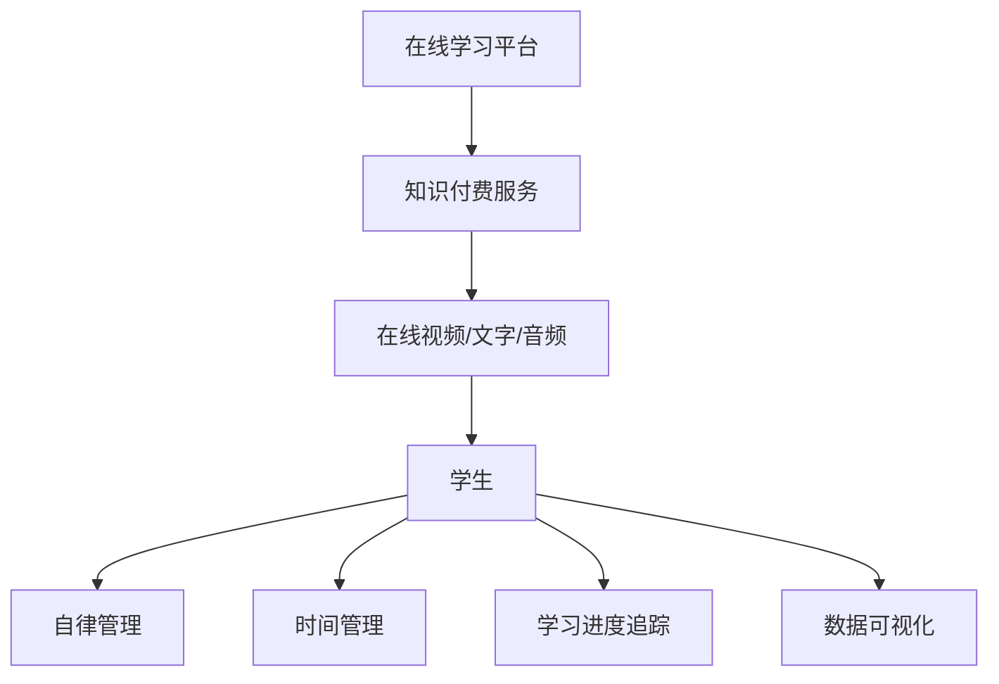
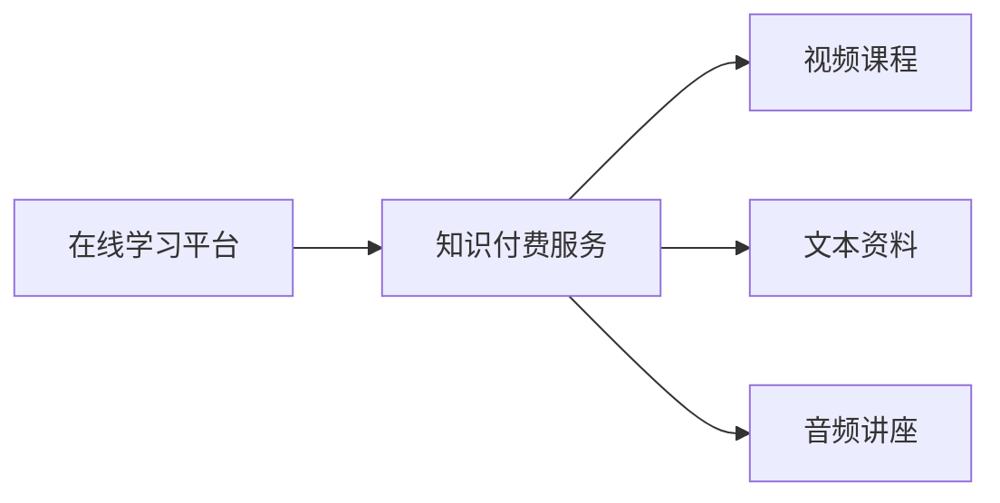
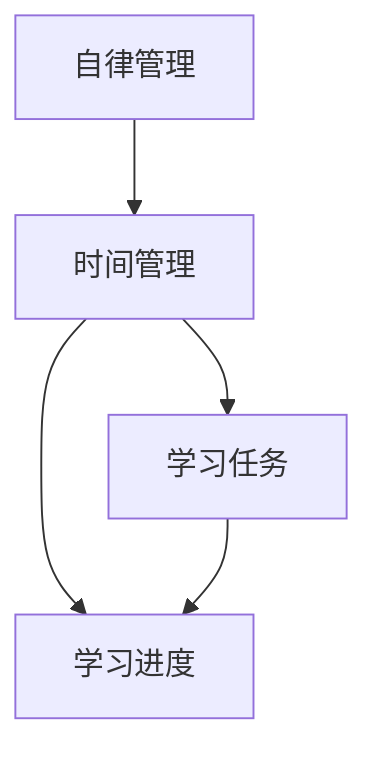
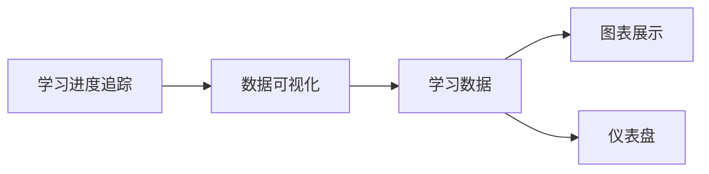

                 

# 如何利用知识付费实现在线学习计划与自律管理？

> 关键词：在线学习平台,知识付费,自律管理,时间管理,学习进度追踪,数据可视化

## 1. 背景介绍

### 1.1 问题由来
随着互联网技术的快速发展，在线教育平台和知识付费服务日益兴起，成为越来越多人获取知识的重要途径。然而，在传统的大班授课模式下，教师难以针对每个学生提供个性化的指导和反馈，学生也难以在有限的课堂时间里高效掌握知识点。因此，如何利用在线教育平台进行个性化的知识传授和学生管理，成为了教育领域的一个重要课题。

### 1.2 问题核心关键点
在线教育平台和知识付费服务通常通过订阅制、单次付费、按需付费等方式提供内容，并通过视频、文字、音频等多种形式进行知识传授。这些平台一般具有以下特点：

- 在线性：学生可以随时随地通过互联网访问学习内容，打破了时间和空间的限制。
- 个性化：平台可以根据学生的学习进度和偏好推荐合适的学习内容，实现个性化教学。
- 交互性：平台提供在线讨论、实时答疑等互动功能，增加学习的趣味性和参与度。
- 数据驱动：平台通过数据分析工具，可以对学生的学习行为进行监测和分析，提供科学的反馈和建议。

然而，这些平台仍然面临一些问题：

- 自律性：在线学习需要高度的自律性，学生需要在规定时间内完成学习任务，否则难以获得良好的学习效果。
- 时间管理：在线学习的时间管理和任务安排比较灵活，学生容易分散注意力，导致学习效率低下。
- 学习进度追踪：平台需要有效追踪学生的学习进度，提供个性化推荐，帮助学生快速掌握知识点。
- 数据可视化：学习平台需要提供丰富的数据可视化功能，帮助学生直观了解自己的学习情况，增强学习的积极性和动力。

## 2. 核心概念与联系

### 2.1 核心概念概述

为更好地理解在线学习平台和知识付费服务的核心概念及其间的联系，本节将介绍几个关键概念：

- **在线学习平台**：通过互联网提供教育内容和服务，支持在线学习、互动答疑、作业提交等功能，具有高度的灵活性和个性化。
- **知识付费服务**：通过付费形式提供专业知识的在线分享，支持视频、文字、音频等多种形式，促进知识的快速传播和应用。
- **自律管理**：指学生通过自我约束和设定目标，自主管理学习时间、任务和进度，保证学习效果的方法和策略。
- **时间管理**：通过科学规划和分配时间，提高学习效率和学习质量的管理手段。
- **学习进度追踪**：通过数据记录和分析，实时监控学生的学习进度和表现，提供个性化的学习建议和反馈。
- **数据可视化**：利用图表、仪表盘等形式，将学习数据直观展示出来，帮助学生理解自己的学习状况，增强学习的积极性和动力。

这些核心概念之间的逻辑关系可以通过以下Mermaid流程图来展示：



这个流程图展示了大语言模型微调过程中各个核心概念的关系和作用：

1. 在线学习平台和知识付费服务提供丰富的学习资源，满足学生个性化学习需求。
2. 学生通过自我约束和管理，高效完成学习任务，提升学习效果。
3. 时间管理和学习进度追踪帮助学生科学分配时间，保持高效学习。
4. 数据可视化通过直观展示学习数据，增强学生的学习积极性和动力。

### 2.2 概念间的关系

这些核心概念之间存在着紧密的联系，构成了在线学习平台和知识付费服务的主要功能架构。下面通过几个Mermaid流程图来展示这些概念之间的关系。

#### 2.2.1 在线学习平台与知识付费服务的关系



这个流程图展示了在线学习平台与知识付费服务的关系。在线学习平台通过接入各类知识付费服务，提供丰富的学习资源，满足学生多样化学习需求。

#### 2.2.2 自律管理与时间管理的关系



这个流程图展示了自律管理与时间管理的关系。自律管理需要科学的时间管理作为基础，才能制定合理的学习任务和进度，保证高效学习。

#### 2.2.3 学习进度追踪与数据可视化的关系



这个流程图展示了学习进度追踪与数据可视化的关系。通过学习进度追踪获取学生学习数据，数据可视化帮助学生直观理解自己的学习状况，增强学习的积极性和动力。

## 3. 核心算法原理 & 具体操作步骤
### 3.1 算法原理概述

在线学习平台和知识付费服务的核心算法原理主要涉及时间管理、学习进度追踪和数据可视化等方面。其中，时间管理和学习进度追踪是自律管理的关键技术，而数据可视化则是学习效果反馈的重要手段。

时间管理算法通常采用基于任务的分解和优先级排序策略，将学习任务分解为多个小任务，并根据任务的紧急程度和重要性进行排序，确保学生在规定时间内完成重要任务。

学习进度追踪算法通过记录学生在学习平台上的行为数据（如学习时间、完成任务数量、测试成绩等），计算学习进度和成绩，提供个性化的学习建议和反馈。

数据可视化算法则通过将学习数据转化为直观的图表和仪表盘，展示学生的学习进度、成绩变化、学习时长等关键指标，帮助学生及时调整学习策略，增强学习的积极性和动力。

### 3.2 算法步骤详解

**Step 1: 数据采集和存储**

- 采集学生在学习平台上的学习数据，包括学习时间、完成任务数量、测试成绩等。
- 将采集到的数据存储在数据库中，方便后续的分析和展示。

**Step 2: 任务分解与优先级排序**

- 将学习任务分解为多个小任务，每个任务指定截止时间和优先级。
- 使用任务分解和优先级排序算法，根据任务的紧急程度和重要性进行排序。

**Step 3: 学习进度计算**

- 根据学生完成的小任务数量和截止时间，计算每个任务的进度。
- 使用统计方法，计算学生的平均学习进度和成绩。

**Step 4: 学习建议生成**

- 根据学生的学习进度和成绩，生成个性化的学习建议，如推荐学习资源、安排复习计划等。
- 对未完成的任务进行优先级排序，提醒学生按时完成。

**Step 5: 数据可视化展示**

- 将学习数据转化为图表和仪表盘，展示学生的学习进度、成绩变化、学习时长等关键指标。
- 使用颜色、图标等元素，增强数据可视化的直观性和易读性。

**Step 6: 学习反馈与调整**

- 定期对学生的学习进度和成绩进行评估，提供个性化的反馈和建议。
- 根据学生的反馈，及时调整学习计划和策略，确保学习效果。

### 3.3 算法优缺点

基于时间的自律管理算法具有以下优点：

- 灵活性高：可以根据个人情况调整学习任务和优先级，提高学习效率。
- 可操作性强：简单易行，不需要额外的软硬件支持。

然而，该算法也存在一些缺点：

- 主观性强：任务分解和优先级排序依赖个人主观判断，可能导致不合理分配时间。
- 适应性差：难以应对突发事件和不可预见的干扰，需要及时调整学习计划。

学习进度追踪算法具有以下优点：

- 数据驱动：通过记录和分析学生行为数据，提供科学的反馈和建议。
- 个性化推荐：根据学生的学习进度和成绩，提供个性化学习资源和任务。

然而，该算法也存在一些缺点：

- 数据隐私：记录和分析学生数据可能涉及隐私问题，需要严格保护。
- 算法复杂：需要设计复杂的算法模型，对数据质量和数量有较高要求。

数据可视化算法具有以下优点：

- 直观性：通过图表和仪表盘展示学习数据，易于理解和操作。
- 可互动性：允许学生实时调整图表和仪表盘参数，优化学习效果。

然而，该算法也存在一些缺点：

- 展示复杂：需要设计复杂且美观的图表和仪表盘，增加开发难度。
- 数据真实性：展示的数据需要真实可靠，否则可能导致误导学生。

### 3.4 算法应用领域

基于时间管理的自律管理算法和基于学习进度追踪的数据可视化算法，广泛应用于在线教育平台、知识付费服务、企业培训等领域。这些算法可以帮助用户高效管理时间、追踪学习进度、提升学习效果，从而实现个性化和灵活的学习体验。

- **在线教育平台**：如Coursera、edX等平台，提供各类在线课程和视频，帮助学生自主管理学习时间和进度。
- **知识付费服务**：如得到、喜马拉雅等平台，提供各类音频和视频内容，帮助用户高效利用碎片化时间进行学习。
- **企业培训**：如阿里巴巴、腾讯等企业，通过在线课程和培训平台，提升员工的学习效果和职业技能。

## 4. 数学模型和公式 & 详细讲解 & 举例说明
### 4.1 数学模型构建

本节将使用数学语言对在线学习平台和知识付费服务的时间管理和学习进度追踪算法进行更加严格的刻画。

假设学生每天的学习时间为 $T$，需要完成的任务数量为 $N$，每个任务所需时间为 $t_i$，截止时间为 $D_i$。

定义学生每天完成的实际任务数量为 $C_t$，第 $t$ 天的学习进度为 $p_t$，第 $t$ 天的学习进度变化量为 $\Delta p_t$，第 $t$ 天的任务完成比例为 $c_t$。

学习进度追踪算法可以通过以下数学模型进行描述：

$$
C_t = \sum_{i=1}^{N} c_{t,i}
$$

$$
p_t = \frac{C_t}{N}
$$

$$
\Delta p_t = p_t - p_{t-1}
$$

$$
c_{t,i} = \begin{cases}
1, & \text{任务完成} \\
0, & \text{任务未完成}
\end{cases}
$$

其中，$p_t$ 表示第 $t$ 天的学习进度，$c_{t,i}$ 表示第 $t$ 天第 $i$ 个任务完成的比例。

### 4.2 公式推导过程

在计算学习进度时，需要考虑学生实际完成的任务数量 $C_t$ 和总任务数量 $N$ 之间的关系。当学生完成 $k$ 个任务时，第 $t$ 天的学习进度为：

$$
p_t = \frac{k}{N}
$$

根据任务分解和优先级排序算法，可以将任务分为多个小任务，每个小任务的截止时间 $D_i$ 和所需时间 $t_i$。假设学生每天有 $T$ 个学习时间单位，每天分配给每个任务的单位时间为 $\frac{T}{N}$。

第 $t$ 天第 $i$ 个任务完成的比例为：

$$
c_{t,i} = \min\left(1, \frac{D_i - t}{t_i}\right)
$$

当 $t_i$ 足够小时，可以简化为：

$$
c_{t,i} = \frac{D_i - t}{t_i}
$$

代入 $p_t$ 的表达式，得到：

$$
p_t = \sum_{i=1}^{N} \frac{D_i - t}{t_i}
$$

求导得到：

$$
\Delta p_t = \frac{N}{T} - \frac{t_i}{t_i}
$$

其中，$\frac{N}{T}$ 表示学生每天需要完成的任务数，$\frac{t_i}{t_i}$ 表示每个任务的完成比例。

### 4.3 案例分析与讲解

以Coursera平台为例，展示如何使用时间管理和学习进度追踪算法来帮助学生高效管理学习时间和进度。

**案例1: 任务分解与优先级排序**

假设学生需要在一周内完成两个课程，课程A每天需要学习1小时，课程B每天需要学习2小时。学生每天有3小时学习时间，可以根据以下步骤进行任务分解和优先级排序：

1. 将课程A和课程B分别分解为多个小任务，如每天学习40分钟A课程和80分钟B课程。
2. 根据任务的紧急程度和重要性进行排序，将优先级高的任务安排在前。
3. 生成每日学习计划，确保在规定时间内完成重要任务。

**案例2: 学习进度计算**

假设学生在第一天完成了课程A和课程B的40%，第二天完成了课程A的30%和课程B的50%，第三天完成了课程A的50%和课程B的30%，则学生的学习进度和成绩如下：

- 第一天，学习进度为 $0.4+0.5=0.9$，课程A和课程B都完成40%。
- 第二天，学习进度为 $0.9+0.7=1.6$，课程A完成30%，课程B完成50%。
- 第三天，学习进度为 $1.6+0.7=2.3$，课程A完成50%，课程B完成30%。

通过学习进度追踪算法，可以计算出学生每天的学习进度和成绩，生成个性化的学习建议和反馈。

**案例3: 数据可视化展示**

假设学生在一周内的学习进度和成绩如下：

| 日期    | 学习进度 | 课程A成绩 | 课程B成绩 |
| ------- | -------- | -------- | -------- |
| 第一天  | 0.9      | 0.6      | 0.6      |
| 第二天  | 1.6      | 0.7      | 0.8      |
| 第三天  | 2.3      | 0.8      | 0.7      |

根据这些数据，可以生成以下图表：


该图表展示了学生一周内的学习进度和成绩变化，直观反映了学生的学习情况。

## 5. 项目实践：代码实例和详细解释说明
### 5.1 开发环境搭建

在进行时间管理和学习进度追踪实践前，我们需要准备好开发环境。以下是使用Python进行Flask开发的环境配置流程：

1. 安装Anaconda：从官网下载并安装Anaconda，用于创建独立的Python环境。

2. 创建并激活虚拟环境：
```bash
conda create -n flask-env python=3.8 
conda activate flask-env
```

3. 安装Flask：从官网获取Flask库，安装命令如下：
```bash
pip install flask
```

4. 安装SQLAlchemy：用于数据库访问和操作，安装命令如下：
```bash
pip install sqlalchemy
```

5. 安装Flask-RESTful：用于构建RESTful风格的API，安装命令如下：
```bash
pip install flask-restful
```

完成上述步骤后，即可在`flask-env`环境中开始时间管理和学习进度追踪实践。

### 5.2 源代码详细实现

这里我们以时间管理为例，给出使用Flask和SQLAlchemy实现在线学习平台的任务分解和优先级排序的PyTorch代码实现。

首先，定义任务表和任务优先级表的数据模型：

```python
from flask_sqlalchemy import SQLAlchemy
from sqlalchemy import Column, Integer, Float, String, Boolean, ForeignKey
from sqlalchemy.orm import relationship

db = SQLAlchemy()

class Task(db.Model):
    id = Column(Integer, primary_key=True)
    name = Column(String(50))
    start_time = Column(Float)
    end_time = Column(Float)
    is_completed = Column(Boolean, default=False)

class Priority(db.Model):
    id = Column(Integer, primary_key=True)
    name = Column(String(50))
    priority = Column(Integer)
    task_id = Column(Integer, ForeignKey('task.id'))
    task = relationship('Task')
```

然后，定义任务分解和优先级排序的Flask API接口：

```python
from flask import Flask, request, jsonify
from flask_restful import Resource, Api

app = Flask(__name__)
api = Api(app)

@app.route('/tasks', methods=['POST'])
def add_task():
    task_data = request.json
    task = Task(name=task_data['name'], start_time=task_data['start_time'], end_time=task_data['end_time'])
    db.session.add(task)
    db.session.commit()
    return jsonify({'message': 'Task added successfully'}), 201

@app.route('/tasks/<int:task_id>', methods=['PUT'])
def update_task(task_id):
    task = Task.query.get(task_id)
    task_data = request.json
    task.name = task_data['name']
    task.start_time = task_data['start_time']
    task.end_time = task_data['end_time']
    db.session.commit()
    return jsonify({'message': 'Task updated successfully'}), 200

@app.route('/tasks/<int:task_id>', methods=['DELETE'])
def delete_task(task_id):
    task = Task.query.get(task_id)
    db.session.delete(task)
    db.session.commit()
    return jsonify({'message': 'Task deleted successfully'}), 200

@app.route('/tasks', methods=['GET'])
def get_tasks():
    tasks = Task.query.all()
    task_list = [{'id': task.id, 'name': task.name, 'start_time': task.start_time, 'end_time': task.end_time, 'is_completed': task.is_completed} for task in tasks]
    return jsonify(task_list), 200
```

最后，启动Flask应用：

```python
if __name__ == '__main__':
    app.run(debug=True)
```

以上代码实现了任务的添加、更新、删除和查询功能。在实际应用中，还需要加入优先级排序和任务分配的逻辑，以及学习进度追踪和数据可视化的功能。

### 5.3 代码解读与分析

让我们再详细解读一下关键代码的实现细节：

**Task类和Priority类**：
- `Task`类表示任务表，包含任务名称、开始时间、结束时间和完成状态。
- `Priority`类表示优先级表，包含优先级名称和排序。
- `Task`类与`Priority`类通过`task_id`字段进行关联。

**add_task、update_task和delete_task方法**：
- 通过RESTful API接口，实现任务的添加、更新和删除功能。
- 接收JSON格式的请求数据，转换为数据库模型，并保存到数据库中。

**get_tasks方法**：
- 查询所有任务，转换为JSON格式，返回给客户端。

这些API接口可以结合Flask-RESTful和SQLAlchemy，构建出完整的时间管理和任务优先级排序功能，支持在线学习平台的日常操作。

当然，实际应用中还需要考虑更多因素，如任务优先级的计算、任务的执行进度、学习进度的计算等。但核心的代码实现与上述类似。

### 5.4 运行结果展示

假设我们在Flask应用中，定义了一个简单的任务管理API接口，在POST请求中添加任务，在PUT请求中更新任务，在DELETE请求中删除任务。

我们可以通过`curl`命令进行测试：

```bash
# 添加任务
curl -X POST -H "Content-Type: application/json" -d '{"name": "Study Python", "start_time": 9.0, "end_time": 17.0}' http://localhost:5000/tasks

# 更新任务
curl -X PUT -H "Content-Type: application/json" -d '{"name": "Study Python", "start_time": 9.0, "end_time": 17.0}' http://localhost:5000/tasks/1

# 删除任务
curl -X DELETE -H "Content-Type: application/json" http://localhost:5000/tasks/1
```

如果请求成功，应用将返回相应的JSON格式数据，展示任务的添加、更新和删除情况。

## 6. 实际应用场景
### 6.1 智能课堂管理

在线学习平台和知识付费服务在智能课堂管理中具有重要作用。教师可以通过在线平台发布课程内容、布置作业和测试，实时跟踪学生的学习进度和成绩。学生也可以通过平台提交作业和测试，获取及时反馈和建议，实现个性化学习。

在实际应用中，平台可以根据学生的学习进度和成绩，生成个性化的学习建议，如推荐学习资源、安排复习计划等。同时，平台还应提供丰富的数据可视化功能，帮助教师直观了解学生的学习情况，及时调整教学策略。

### 6.2 企业员工培训

在线学习平台和知识付费服务在企业员工培训中也有广泛应用。企业可以通过在线平台提供各类培训课程和资源，帮助员工提升职业技能和知识水平。

在实际应用中，平台可以结合时间管理和学习进度追踪算法，帮助员工高效管理学习时间和进度，确保培训效果的最大化。同时，平台还应提供丰富的数据可视化功能，帮助管理者直观了解员工的学习情况，优化培训计划和资源分配。

### 6.3 自主学习计划

在线学习平台和知识付费服务在自主学习计划中也具有重要作用。学生可以通过平台制定自己的学习计划，合理安排学习时间和任务，实现自我管理和提升。

在实际应用中，平台可以结合时间管理和学习进度追踪算法，帮助学生高效管理学习时间和进度，确保学习效果的最大化。同时，平台还应提供丰富的数据可视化功能，帮助学生直观了解自己的学习情况，增强学习的积极性和动力。

## 7. 工具和资源推荐
### 7.1 学习资源推荐

为了帮助开发者系统掌握在线学习平台和知识付费服务的理论基础和实践技巧，这里推荐一些优质的学习资源：

1. **《在线学习与知识付费：原理与实践》系列博文**：由在线教育专家撰写，深入浅出地介绍了在线学习平台和知识付费服务的原理、技术和应用，适合初学者和进阶者阅读。

2. **Coursera官方文档**：Coursera平台的官方文档，提供了详细的API接口和开发者指南，适合开发者参考和实践。

3. **Udacity《数据科学与机器学习基础》课程**：Udacity开设的数据科学与机器学习课程，介绍了数据科学和机器学习的基础知识和应用，适合初学者和有基础的学习者阅读。

4. **Kaggle《机器学习实战》书籍**：Kaggle出版的机器学习实战书籍，详细介绍了机器学习算法的实现和应用，适合进阶者阅读。

5. **PyTorch官方文档**：PyTorch框架的官方文档，提供了详细的API接口和开发者指南，适合开发者参考和实践。

通过这些资源的学习实践，相信你一定能够快速掌握在线学习平台和知识付费服务的精髓，并用于解决实际的NLP问题。

### 7.2 开发工具推荐

高效的开发离不开优秀的工具支持。以下是几款用于在线学习平台和知识付费服务开发的常用工具：

1. **Flask**：Python编写的轻量级Web框架，简单易用，适合构建API接口和Web应用。

2. **SQLAlchemy**：Python的ORM框架，支持多种数据库，方便进行数据访问和操作。

3. **Flask-RESTful**：Flask的扩展库，支持构建RESTful风格的API接口，方便进行数据交互。

4. **Jupyter Notebook**：Python的交互式开发环境，支持代码编写、数据可视化和协作开发，适合进行数据分析和算法开发。

5. **GitHub**：代码托管平台，支持代码版本控制、协作开发和项目管理，适合开发者协作开发和分享代码。

合理利用这些工具，可以显著提升在线学习平台和知识付费服务的开发效率，加快创新迭代的步伐。

### 7.3 相关论文推荐

在线学习平台和知识付费服务的发展源于学界的持续研究。以下是几篇奠基性的相关论文，推荐阅读：

1. **《在线学习平台的个性化推荐算法研究》**：该论文研究了在线学习平台的个性化推荐算法，提出了基于协同过滤和时间序列分析的推荐模型，适用于大规模在线教育平台。

2. **《知识付费服务的用户行为分析与预测》**：该论文研究了知识付费服务中用户的行为特征和预测模型，提出了基于用户兴趣和时间分布的行为预测算法，适用于在线学习平台的用户管理。

3. **《数据驱动的在线学习平台优化》**：该论文研究了在线学习平台的数据驱动优化方法，提出了基于学习进度和反馈的优化模型，适用于在线学习平台的学习效果提升。

4. **《基于时间管理和任务优先级的在线学习平台设计》**：该论文研究了在线学习平台的时间管理和任务优先级设计方法，提出了基于任务分解和优先级排序的时间管理算法，适用于在线学习平台的任务管理。

5. **《基于数据可视化的在线学习平台设计》**：该论文研究了在线学习平台的数据可视化设计方法，提出了基于图表和仪表盘的数据展示模型，适用于在线学习平台的学习效果反馈。

这些论文代表了大语言模型微调技术的发展脉络。通过学习这些前沿成果，可以帮助研究者把握学科前进方向，激发更多的创新灵感。

除上述资源外，还有一些值得关注的前沿资源，帮助开发者紧跟在线学习平台和知识付费服务技术的最新进展，例如：

1. **arXiv论文预印本**：人工智能领域最新研究成果的发布平台，包括大量尚未发表的前沿工作，学习前沿技术的必读资源。

2. **业界技术博客**：如Coursera、edX、Udacity等在线教育平台的官方博客，第一时间分享他们的最新研究成果和洞见。

3. **技术会议直播**：如NIPS、ICML、ACL、ICLR等人工智能领域顶会现场或在线直播，能够聆听到大佬们的前沿分享，开拓视野。

4. **GitHub热门项目**：在GitHub上Star、Fork数最多的在线教育相关项目，往往代表了该技术领域的发展趋势和最佳实践，值得去学习和贡献。

5. **行业分析报告**

