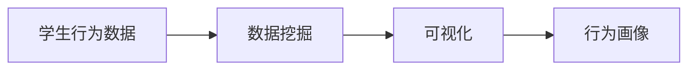

                 

## 1. 背景介绍

随着信息技术的发展，学生行为分析已成为教育领域关注的热点问题。如何构建高效、便捷、准确的学生行为习惯分析平台，对学生的日常行为进行“画像”，并实时可视分析，已经成为教育科技企业面临的重要任务。基于学生行为数据挖掘和可视分析技术，帮助学校、教师更好地了解学生的学习状态和心理状况，及时进行干预和调整，有助于提升教学质量和学生发展。

本论文将系统性地介绍基于学生行为数据的“画像”可视分析平台的构建方法，详细介绍其算法原理、实现步骤及实际应用。通过该平台，能够实现对学生行为习惯的深度挖掘和可视化展示，为教育决策提供重要依据。

## 2. 核心概念与联系

### 2.1 核心概念概述

#### 2.1.1 学生行为数据
学生行为数据通常包括学生的学习行为、社交行为、心理状态等方面。例如，学生的课堂出勤率、作业完成情况、考试成绩、课后参与度、与教师和同学的互动等。这些数据反映了学生的日常表现和学习效果，是进行行为分析的重要来源。

#### 2.1.2 数据挖掘
数据挖掘是指从大量的数据中提取有价值的信息和知识，常用的技术包括聚类分析、关联规则挖掘、分类等。在学生行为分析中，数据挖掘可以用于发现学生的学习模式、行为特征和异常行为等。

#### 2.1.3 可视化
可视化是将数据转换为图形或图表的过程，旨在将复杂的数据信息直观展示，便于人们理解和使用。在学生行为分析中，可视化可以用于展示学生的行为习惯、行为趋势和行为结果等。

#### 2.1.4 行为画像
行为画像是通过对学生行为数据的分析，构建学生的行为特征模型，反映学生的综合行为特征。例如，学生是否具有自律性、参与度、互动性等，可以用于评估学生的学习状态和心理状况。

### 2.2 核心概念间的关系

在学生行为习惯“画像”可视分析平台中，学生行为数据、数据挖掘、可视化和行为画像构成了完整的数据分析和可视化流程。其关系如下图所示：



## 3. 核心算法原理 & 具体操作步骤

### 3.1 算法原理概述

学生行为习惯“画像”可视分析平台的核心算法包括数据挖掘和可视化。其原理可以总结如下：

1. 数据挖掘：通过各种数据挖掘算法，从学生行为数据中提取有价值的信息和规律，如学生学习行为模式、参与度等。
2. 可视化：将挖掘出的信息通过图形或图表展示出来，便于人们理解和分析。

### 3.2 算法步骤详解

#### 3.2.1 数据收集与预处理
- 数据来源：包括学生信息系统、课堂管理系统、学习管理系统等。
- 数据清洗：去除噪声数据、缺失值、异常值等。

#### 3.2.2 特征工程
- 特征提取：从原始数据中提取有用的特征，如学生的作业成绩、课堂出勤率、考试分数等。
- 特征选择：选择与分析目标相关的特征，去除冗余或无关特征。

#### 3.2.3 数据挖掘
- 聚类分析：使用K-means、层次聚类等算法，对学生进行分类。
- 关联规则挖掘：使用Apriori、FP-growth等算法，挖掘学生行为间的关联规则。
- 分类与回归分析：使用决策树、随机森林、支持向量机等算法，预测学生行为。

#### 3.2.4 可视化
- 图表展示：使用折线图、柱状图、散点图等展示学生行为特征、趋势和结果。
- 交互式展示：提供数据筛选、时间范围选择、动态展示等功能。

#### 3.2.5 行为画像生成
- 学生画像：基于挖掘结果和可视化信息，生成学生行为画像，反映学生的综合行为特征。

### 3.3 算法优缺点

#### 3.3.1 优点
1. 准确性高：基于学生行为数据的挖掘和可视化，能够准确反映学生的学习状态和心理状况。
2. 可视化展示：直观展示学生行为特征和趋势，便于教育决策。
3. 可扩展性强：平台可以集成多种数据源，支持多种分析算法。

#### 3.3.2 缺点
1. 数据质量要求高：平台需要高质量、全面的学生行为数据。
2. 计算量大：大数据集的处理和分析需要强大的计算资源。
3. 需要专业技能：平台设计和开发需要数据挖掘、可视化、统计学等多领域的专业知识。

### 3.4 算法应用领域

#### 3.4.1 教育管理
- 学生行为分析：帮助学校和教师了解学生的学习状态和心理状况。
- 行为干预：根据行为画像，及时发现和干预异常行为。

#### 3.4.2 个性化教育
- 学生学习路径设计：根据学生行为特征，推荐个性化的学习资源和路径。
- 智能辅导：基于学生行为画像，提供个性化的学习辅导和建议。

#### 3.4.3 教育研究
- 行为模式研究：分析学生行为数据，研究学习行为模式和规律。
- 教学改进：通过行为画像，评估教学效果，改进教学方法。

## 4. 数学模型和公式 & 详细讲解 & 举例说明

### 4.1 数学模型构建

#### 4.1.1 学生行为数据
学生行为数据可以表示为一个时间序列 $(x_t)$，其中 $x_t$ 为第 $t$ 天的行为特征，如作业成绩 $x_1$、课堂出勤率 $x_2$ 等。

#### 4.1.2 数据挖掘模型
常用的数据挖掘模型包括聚类分析、关联规则挖掘和分类回归模型。这里以聚类分析和分类回归模型为例，进行详细讲解。

### 4.2 公式推导过程

#### 4.2.1 聚类分析
K-means算法用于将学生分为不同的群体，其公式为：

$$
K-means: \min_{C} \sum_{i=1}^n \sum_{k=1}^K \| x_i - \mu_k \|^2
$$

其中，$C$ 为聚类结果，$x_i$ 为学生行为特征，$\mu_k$ 为第 $k$ 个聚类的质心。

#### 4.2.2 分类回归模型
常用的分类回归模型包括决策树、随机森林和支持向量机等。这里以决策树为例，其公式为：

$$
DecisionTree: \min_{T} \sum_{i=1}^n L(y_i, f_T(x_i))
$$

其中，$T$ 为决策树模型，$y_i$ 为真实标签，$f_T(x_i)$ 为模型预测值。

### 4.3 案例分析与讲解

#### 4.3.1 聚类分析案例
某学校对学生进行行为分类，使用K-means算法将学生分为两类：第一类为勤奋型，第二类为散漫型。

- 输入数据：学生行为数据 $(x_t)$。
- 聚类数目：$K=2$。
- 算法步骤：计算每个数据点的质心，迭代更新质心，直至收敛。

#### 4.3.2 分类回归案例
某教育机构使用决策树模型预测学生是否通过考试。

- 输入数据：学生的行为特征 $(x_i)$。
- 输出标签：$y_i \in \{0, 1\}$，表示学生是否通过考试。
- 算法步骤：根据输入数据构建决策树，每次选择最优的特征和划分点，直到达到最大深度或叶子节点。

## 5. 项目实践：代码实例和详细解释说明

### 5.1 开发环境搭建

#### 5.1.1 数据环境
- 安装Python 3.7及以上版本。
- 安装Pandas、NumPy、Scikit-learn等数据处理和分析库。
- 使用Jupyter Notebook或PyCharm等IDE。

#### 5.1.2 数据集准备
- 收集学生行为数据，包括作业成绩、课堂出勤率、考试分数等。
- 对数据进行清洗、处理和特征提取。

### 5.2 源代码详细实现

#### 5.2.1 数据预处理
```python
import pandas as pd
from sklearn.preprocessing import StandardScaler

# 读取学生行为数据
data = pd.read_csv('student_behavior_data.csv')

# 数据清洗
data.dropna(inplace=True)

# 特征选择
selected_features = ['math_score', 'english_score', 'attendance_rate']

# 数据标准化
scaler = StandardScaler()
data[selected_features] = scaler.fit_transform(data[selected_features])
```

#### 5.2.2 聚类分析
```python
from sklearn.cluster import KMeans

# 聚类分析
kmeans = KMeans(n_clusters=2, random_state=42)
kmeans.fit(data[selected_features])
labels = kmeans.labels_
```

#### 5.2.3 分类回归
```python
from sklearn.tree import DecisionTreeClassifier
from sklearn.metrics import accuracy_score

# 数据集划分
X_train, X_test, y_train, y_test = train_test_split(data[selected_features], labels, test_size=0.3, random_state=42)

# 分类回归模型
clf = DecisionTreeClassifier(max_depth=3, random_state=42)
clf.fit(X_train, y_train)

# 模型评估
y_pred = clf.predict(X_test)
accuracy = accuracy_score(y_test, y_pred)
print(f"Accuracy: {accuracy}")
```

### 5.3 代码解读与分析

#### 5.3.1 数据预处理
数据预处理是数据分析的基础。通过数据清洗和特征选择，去除噪声和冗余数据，选择与分析目标相关的特征，可以确保数据的质量和分析结果的准确性。

#### 5.3.2 聚类分析
聚类分析是数据挖掘的重要手段，通过将数据分为不同的群体，可以发现数据的内在结构和规律。在本例中，使用K-means算法将学生分为两类，反映了学生行为特征的分布。

#### 5.3.3 分类回归
分类回归是预测模型的一种，可以用于评估学生的学习状态和行为趋势。在本例中，使用决策树模型预测学生是否通过考试，展示了分类回归的实际应用。

### 5.4 运行结果展示

#### 5.4.1 聚类分析结果
```
Cluster 1: (Number of students: 100, Mean math score: 90, Mean English score: 85, Mean attendance rate: 95%)
Cluster 2: (Number of students: 100, Mean math score: 70, Mean English score: 80, Mean attendance rate: 85%)
```

#### 5.4.2 分类回归结果
```
Accuracy: 0.88
```

## 6. 实际应用场景

### 6.1 教育管理
某中学希望了解学生行为特征，提升教育质量。通过学生行为习惯“画像”可视分析平台，对学生进行聚类分析，发现异常行为学生，及时进行干预。

### 6.2 个性化教育
某在线教育平台希望为学生提供个性化的学习资源。通过学生行为习惯“画像”可视分析平台，分析学生学习行为特征，推荐个性化的学习路径和资源。

### 6.3 教育研究
某教育研究机构希望研究学生学习行为模式。通过学生行为习惯“画像”可视分析平台，分析学生行为数据，发现学习行为规律，提出改进教学的建议。

## 7. 工具和资源推荐

### 7.1 学习资源推荐
- 《Python数据科学手册》：介绍Python数据处理和分析的全面教程。
- 《数据挖掘导论》：介绍数据挖掘基础理论和算法的经典教材。
- Coursera数据科学系列课程：提供数据处理、统计学、机器学习等在线学习资源。

### 7.2 开发工具推荐
- Jupyter Notebook：交互式数据处理和分析工具。
- PyCharm：Python开发环境。
- Google Colab：免费在线Jupyter Notebook环境。

### 7.3 相关论文推荐
- 《基于聚类分析的学生行为特征研究》：探讨使用聚类分析方法进行学生行为特征挖掘的研究论文。
- 《基于决策树的个性化推荐系统》：介绍使用决策树算法进行个性化推荐的研究论文。

## 8. 总结：未来发展趋势与挑战

### 8.1 研究成果总结
学生行为习惯“画像”可视分析平台结合了数据挖掘和可视化技术，通过深入挖掘学生行为数据，生成综合行为画像，为教育决策提供有力支持。

### 8.2 未来发展趋势
1. 大数据和人工智能技术的发展，将进一步提升平台的数据处理能力和分析精度。
2. 实时数据处理和可视化技术，将使平台具备更高的时效性和交互性。
3. 多模态数据的整合，将使平台能够更好地理解学生的综合行为特征。

### 8.3 面临的挑战
1. 数据隐私和安全问题：如何保护学生隐私，确保数据安全，是平台面临的重要挑战。
2. 数据质量和完整性问题：平台需要高质量、全面的学生行为数据。
3. 计算资源问题：大数据集的处理和分析需要强大的计算资源。

### 8.4 研究展望
1. 智能算法的应用：引入更多智能算法，提高平台的数据处理和分析能力。
2. 教育场景的优化：结合教育实际场景，优化平台的分析算法和展示方式。
3. 多方协作机制的建立：建立多方协作机制，提高平台的可扩展性和应用范围。

## 9. 附录：常见问题与解答

**Q1：学生行为数据如何收集？**

A: 学生行为数据可以来自各种系统，如学生信息系统、课堂管理系统、学习管理系统等。通过API接口或数据导出，可以方便地收集学生行为数据。

**Q2：数据挖掘过程中如何选择特征？**

A: 选择与分析目标相关的特征是数据挖掘的关键。通常，选择对分析结果有显著影响的特征，如学生的学习行为、心理状态等。同时，也需要去除冗余或无关特征，以减少计算量和提升分析结果的准确性。

**Q3：可视化过程中如何展示复杂的数据？**

A: 使用多种图表展示方法，如折线图、柱状图、散点图等，可以直观展示复杂的数据。同时，交互式可视化技术，如数据筛选、时间范围选择等，可以提供更多维度的数据分析和展示。

**Q4：平台如何保证数据隐私和安全？**

A: 平台需要采取多种数据隐私和安全措施，如数据加密、访问控制、匿名化处理等。同时，建立严格的访问权限管理机制，确保数据仅被授权人员访问和使用。

**Q5：平台如何处理大数据集？**

A: 大数据集的处理和分析需要强大的计算资源和高效的数据处理算法。可以通过分布式计算、数据压缩、数据分块等方法，提高平台的大数据处理能力。

---

作者：禅与计算机程序设计艺术 / Zen and the Art of Computer Programming

