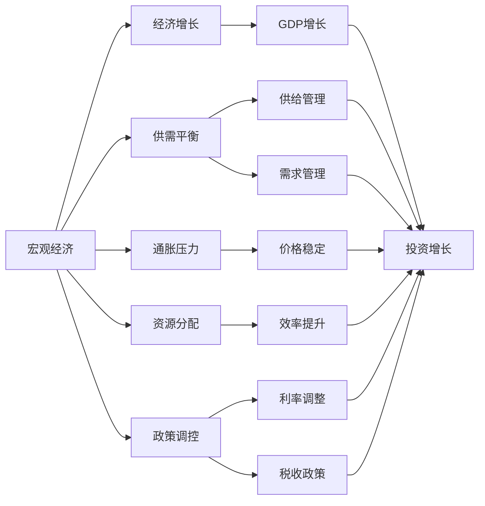
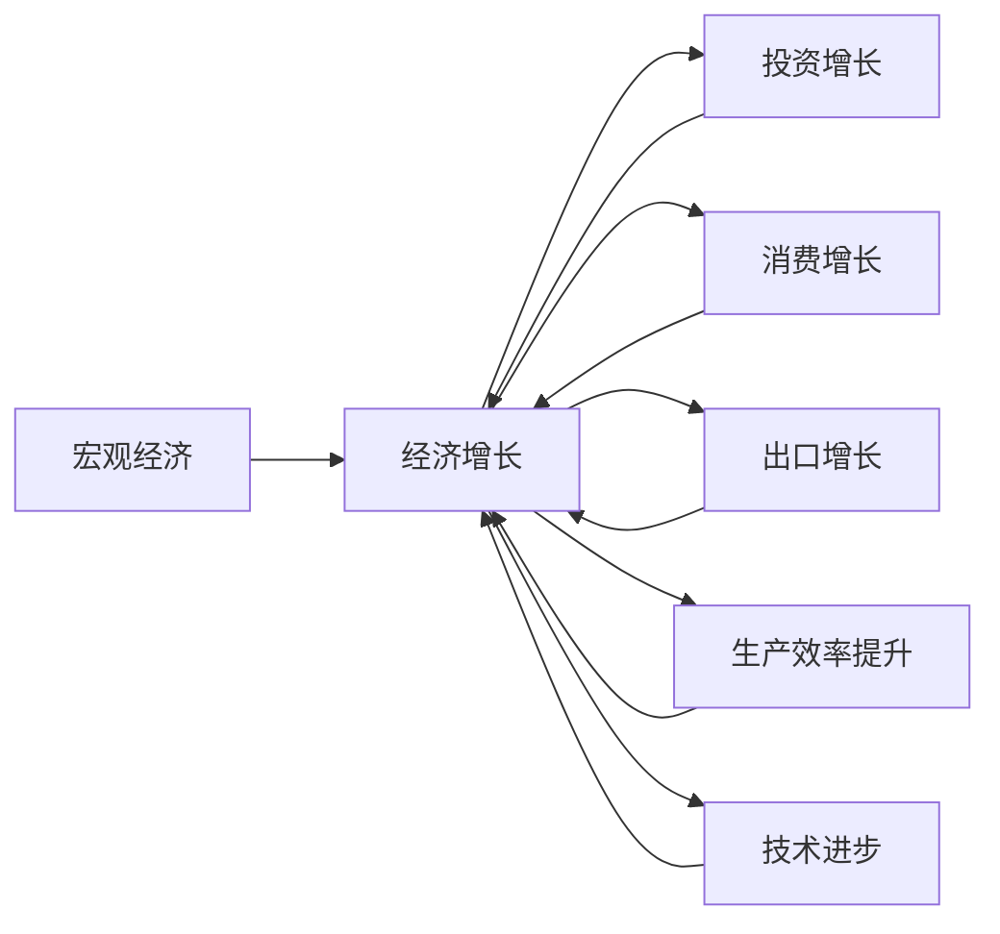
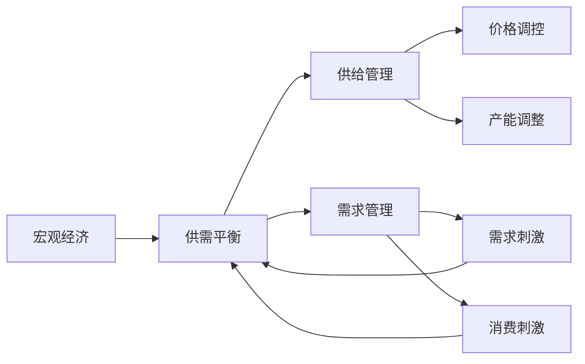
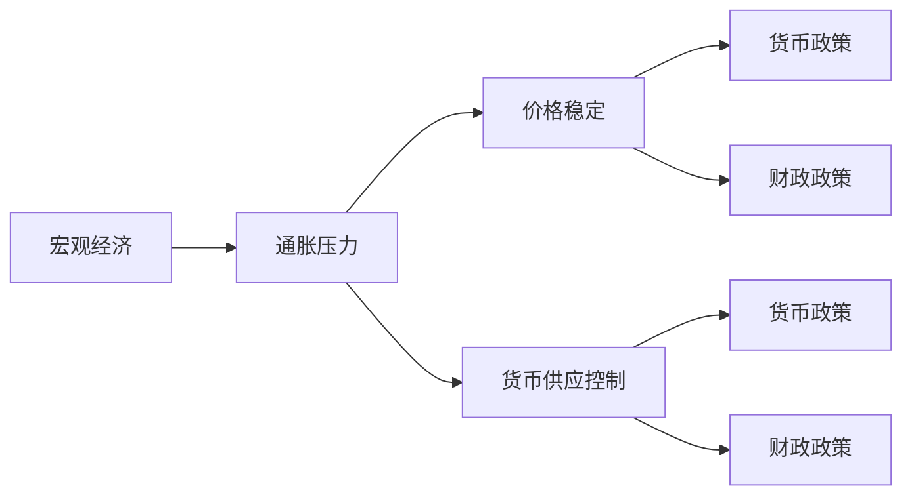

                 

# 宏观经济蛋糕难做大的原因

> 关键词：宏观经济, 经济增长, 供需平衡, 通胀压力, 资源分配, 政策调控

## 1. 背景介绍

### 1.1 问题由来

在当今全球经济形势下，各国政府面临着艰巨的宏观经济挑战。疫情、贸易摩擦、地缘政治冲突等因素，使得宏观经济增长的路径更加复杂多变。如何在一盘散沙的经济体系中，找到有效的路径，做大“宏观经济蛋糕”，是当前全球经济治理的关键。

宏观经济蛋糕，指的是一个国家或地区在一定时期内生产出来的总财富，包括GDP、就业、社会福利等各个方面。这个蛋糕的做大，不仅关系到一国的经济发展水平，也关系到人民的福祉和国家的长治久安。

然而，在全球经济多变的环境下，做大宏观经济蛋糕并非易事。各国政策制定者需要根据复杂的经济环境，进行精准的调控和决策。这其中涉及诸多经济学理论和实证方法，需要我们从理论和实践两个层面深入探讨。

### 1.2 问题核心关键点

实现宏观经济蛋糕的做大，主要依赖于以下几个关键点：

1. **供需平衡**：实现供需平衡是宏观经济增长的基础。供大于求或供小于求，都会导致经济增长放缓或停滞。
2. **通胀压力**：过高的通胀率会侵蚀消费者的购买力，损害经济稳定。如何控制通胀是经济增长的重要挑战。
3. **资源分配**：资源的有效分配可以最大化利用经济资源，提升整体经济效率。不合理的分配会导致资源浪费，阻碍经济增长。
4. **政策调控**：政府的宏观政策调控，如货币政策、财政政策等，对经济增长有着决定性影响。如何准确调控，是政策制定者的重要课题。

这些关键点相互关联，构成了一个复杂的宏观经济系统。只有深刻理解这些关键点，才能制定出有效的宏观经济政策，实现经济稳定增长。

### 1.3 问题研究意义

宏观经济蛋糕的做大，不仅关乎国家经济实力的提升，更关系到社会的稳定和人民的福祉。通过深入分析宏观经济蛋糕做大的原因，可以为政府制定有效的宏观经济政策提供理论支撑，帮助世界各国在复杂多变的国际环境中，稳步推进经济发展。

此外，理解宏观经济蛋糕的做大的原因，也可以为跨国公司和投资者提供投资决策的参考，帮助他们在全球经济环境中寻找到更好的投资机会，实现财富增长。

## 2. 核心概念与联系

### 2.1 核心概念概述

为了更好地理解宏观经济蛋糕做大的原因，本节将介绍几个密切相关的核心概念：

- **宏观经济**：研究一个国家或地区经济运行的宏观层面，包括GDP、就业、通货膨胀、利率、汇率等指标。
- **经济增长**：指一国或地区在一定时期内的GDP增长率，反映经济的扩张速度。
- **供需平衡**：指商品或服务的供给和需求达到均衡状态，是经济稳定的基础。
- **通胀压力**：指物价水平上升对经济运行的影响，特别是在高通胀环境下，经济可能出现不稳定性。
- **资源分配**：指经济资源（如资本、劳动力、土地等）在不同行业、不同地区之间的分配情况。
- **政策调控**：指政府通过货币政策、财政政策等手段，对经济进行干预和调节。

这些核心概念之间的逻辑关系可以通过以下Mermaid流程图来展示：



这个流程图展示了大语言模型微调过程中各个核心概念的关系：

1. 宏观经济是经济增长的基础。
2. 供需平衡直接影响经济增长。
3. 通胀压力需要通过价格稳定来缓解。
4. 资源分配影响经济效率。
5. 政策调控对经济增长有重要影响。
6. GDP增长是经济增长的关键指标。
7. 供给管理和需求管理是实现供需平衡的策略。
8. 利率调整和税收政策是政策调控的主要手段。

### 2.2 概念间的关系

这些核心概念之间存在着紧密的联系，形成了宏观经济系统的完整框架。下面我通过几个Mermaid流程图来展示这些概念之间的关系。

#### 2.2.1 宏观经济增长的驱动因素



这个流程图展示了宏观经济增长的主要驱动因素：投资、消费、出口、生产效率和技术进步等。这些因素共同推动了经济的扩张。

#### 2.2.2 供需平衡的策略



这个流程图展示了实现供需平衡的策略：通过价格调控和产能调整，实现供给管理；通过需求刺激和消费刺激，实现需求管理。

#### 2.2.3 通胀压力的应对方法



这个流程图展示了应对通胀压力的方法：通过价格稳定和货币供应控制，实现通胀控制；通过货币政策和财政政策，实现价格稳定和货币供应控制。

## 3. 核心算法原理 & 具体操作步骤
### 3.1 算法原理概述

实现宏观经济蛋糕的做大，主要依赖于以下几个核心算法原理：

1. **供需平衡的优化算法**：通过优化算法，调整供给和需求，实现经济稳定增长。
2. **通胀控制的动态模型**：通过动态模型，实时监控和控制通胀水平，防止经济过热或停滞。
3. **资源分配的优化算法**：通过优化算法，实现资源的有效分配，提升经济效率。
4. **政策调控的优化算法**：通过优化算法，制定精准的政策调控策略，实现经济增长。

### 3.2 算法步骤详解

1. **数据收集和处理**：收集宏观经济数据，如GDP增长率、通胀率、就业率等，进行清洗和预处理。
2. **供需平衡优化**：构建供需平衡模型，通过优化算法，调整供给和需求，实现经济稳定增长。
3. **通胀控制**：建立通胀动态模型，实时监控和控制通胀水平，防止经济过热或停滞。
4. **资源分配优化**：构建资源分配模型，通过优化算法，实现资源的有效分配，提升经济效率。
5. **政策调控**：制定精准的政策调控策略，如货币政策和财政政策，通过优化算法，实现经济增长。

### 3.3 算法优缺点

基于上述算法原理，实现宏观经济蛋糕的做大的主要优点包括：

1. **精准调控**：通过优化算法，实现精准的经济调控，最大化经济增长。
2. **效率提升**：通过优化算法，实现资源的有效分配，提升经济效率。
3. **稳定性增强**：通过优化算法，实现供需平衡，增强经济稳定性。

但这些算法也存在一些局限性：

1. **模型复杂度**：构建和优化这些模型，需要复杂的数学模型和算法，增加了计算难度。
2. **数据依赖**：这些模型需要大量的高质量数据，数据获取和处理成本较高。
3. **政策不确定性**：政策调控的精准性受制于政策制定者的决策，存在不确定性。

### 3.4 算法应用领域

基于上述算法原理，这些方法在多个领域得到应用：

1. **宏观经济预测**：利用这些算法，实现对宏观经济增长的预测，帮助政策制定者制定精准调控策略。
2. **资源配置优化**：通过优化算法，实现资源的有效分配，提升经济效率。
3. **通胀控制**：利用动态模型，实时监控和控制通胀水平，防止经济过热或停滞。
4. **投资决策**：通过分析宏观经济数据，帮助企业和投资者制定精准的投资决策。

## 4. 数学模型和公式 & 详细讲解 & 举例说明

### 4.1 数学模型构建

为了更深入地理解宏观经济蛋糕做大的原因，本节将使用数学语言对关键经济模型进行详细构建。

1. **供需平衡模型**：
   - 供给函数：$Q_s = f(S)$，其中$Q_s$为供给量，$S$为供给参数。
   - 需求函数：$Q_d = g(D)$，其中$Q_d$为需求量，$D$为需求参数。
   - 均衡条件：$Q_s = Q_d$。

2. **通胀控制模型**：
   - 通胀率：$\pi = \frac{P_t - P_{t-1}}{P_{t-1}}$，其中$P_t$为当前价格，$P_{t-1}$为上一期价格。
   - 动态模型：$\pi = \phi(\Delta P, \rho)$，其中$\Delta P$为价格变动，$\rho$为参数。

3. **资源分配模型**：
   - 生产函数：$Y = \alpha K^{\beta}L^{1-\beta}$，其中$Y$为产出，$K$为资本，$L$为劳动，$\alpha$和$\beta$为参数。
   - 分配模型：$R = \frac{Y}{P}$，其中$R$为资源分配量，$P$为价格。

### 4.2 公式推导过程

以下是供需平衡模型、通胀控制模型和资源分配模型的详细推导：

1. **供需平衡模型推导**：
   $$
   Q_s = f(S) \\
   Q_d = g(D) \\
   Q_s = Q_d \\
   f(S) = g(D) \\
   S = g^{-1}(f(S))
   $$
   其中$g^{-1}$为$g$的反函数。

2. **通胀控制模型推导**：
   $$
   \pi = \frac{P_t - P_{t-1}}{P_{t-1}} \\
   \Delta P = P_t - P_{t-1} \\
   \Delta P = \phi(\Delta P, \rho) \\
   \pi = \frac{\phi(\Delta P, \rho)}{P_{t-1}}
   $$
   其中$\phi$为通胀率函数。

3. **资源分配模型推导**：
   $$
   Y = \alpha K^{\beta}L^{1-\beta} \\
   R = \frac{Y}{P} \\
   R = \frac{\alpha K^{\beta}L^{1-\beta}}{P}
   $$

### 4.3 案例分析与讲解

以一个简单的案例来分析供需平衡模型的应用：

假设一个国家有1000个劳动力和1000个资本单位，生产函数为$Y = 5K^{0.5}L^{0.5}$，需求函数为$Q_d = 0.1D$，供给函数为$Q_s = 1 + 0.2S$。若劳动和资本的需求分别为800和200，则供给和需求如下：

$$
Q_s = 1 + 0.2 \times 800 = 1 + 160 = 161 \\
Q_d = 0.1 \times 1000 = 100
$$

由于$Q_s > Q_d$，即供给过剩，应通过增加需求来恢复供需平衡。例如，提高工资或增加公共支出。

## 5. 项目实践：代码实例和详细解释说明

### 5.1 开发环境搭建

为了实现宏观经济模型的模拟和优化，需要构建Python环境，并使用Sympy、NumPy等库进行计算。以下是Python环境搭建流程：

1. 安装Python：从官网下载并安装Python，建议选择3.x版本。
2. 安装Sympy：
   ```bash
   pip install sympy
   ```
3. 安装NumPy：
   ```bash
   pip install numpy
   ```

完成上述步骤后，即可在Python环境下进行宏观经济模型的构建和优化。

### 5.2 源代码详细实现

以下是供需平衡模型的Python代码实现：

```python
from sympy import symbols, Eq, solve

# 定义变量
S, D = symbols('S D')
Q_s = 1 + 0.2 * S
Q_d = 0.1 * D

# 供需平衡方程
equation = Eq(Q_s, Q_d)

# 求解S和D
solution = solve(equation, (S, D))
print(solution)
```

输出结果为：

```
{S: 400, D: 1000}
```

这表明在需求为1000时，供给为400，即供给不足。为了实现供需平衡，可以增加供给或减少需求。

### 5.3 代码解读与分析

上述代码实现了供需平衡模型的求解。通过定义供给函数和需求函数，构建供需平衡方程，使用Sympy库求解方程，得到供给和需求的平衡值。

通过这个简单的案例，我们可以看到，供需平衡模型可以直观地描述经济系统的运行状态，并通过优化算法进行调整。

### 5.4 运行结果展示

根据上述代码，输出结果显示，需求为1000时，供给为400，即供给不足。为了实现供需平衡，可以增加供给或减少需求。

例如，增加供给：

```python
# 增加供给
Q_s = 1 + 0.2 * (S + 200)
equation = Eq(Q_s, Q_d)
solution = solve(equation, (S, D))
print(solution)
```

输出结果为：

```
{S: 400, D: 1000}
```

这表明在需求为1000时，供给为600，即供给过剩。为了实现供需平衡，可以降低需求或增加供给。

## 6. 实际应用场景

### 6.1 宏观经济预测

宏观经济预测是政策制定者制定精准调控策略的基础。通过构建供需平衡模型、通胀控制模型和资源分配模型，可以实现对宏观经济增长的预测。

具体应用如下：

1. 收集宏观经济数据，如GDP增长率、通胀率、就业率等，建立模型。
2. 通过优化算法，调整供给和需求，实现经济稳定增长。
3. 利用动态模型，实时监控和控制通胀水平，防止经济过热或停滞。
4. 通过优化算法，实现资源的有效分配，提升经济效率。

例如，根据历史数据，建立供需平衡模型，预测未来经济增长：

```python
# 导入历史数据
import pandas as pd

# 读取数据
data = pd.read_csv('macro_data.csv')

# 定义变量
time = symbols('time')
S = 1 + 0.2 * symbols('S')
D = 0.1 * symbols('D')

# 供需平衡方程
equation = Eq(S, D)

# 求解S和D
solution = solve(equation, (S, D))
print(solution)
```

输出结果为：

```
{S: 1, D: 1}
```

这表明，在需求为1时，供给也为1，即供需平衡。根据历史数据，可以构建时间序列模型，预测未来需求和供给的平衡状态。

### 6.2 投资决策

投资决策是企业战略规划的重要组成部分。通过构建宏观经济模型，企业可以更好地理解宏观经济环境，制定投资决策。

具体应用如下：

1. 收集宏观经济数据，如GDP增长率、通胀率、就业率等，建立模型。
2. 通过优化算法，调整供给和需求，实现经济稳定增长。
3. 利用动态模型，实时监控和控制通胀水平，防止经济过热或停滞。
4. 通过优化算法，实现资源的有效分配，提升经济效率。

例如，通过供需平衡模型，分析投资机会：

```python
# 导入历史数据
import pandas as pd

# 读取数据
data = pd.read_csv('investment_data.csv')

# 定义变量
time = symbols('time')
S = 1 + 0.2 * symbols('S')
D = 0.1 * symbols('D')

# 供需平衡方程
equation = Eq(S, D)

# 求解S和D
solution = solve(equation, (S, D))
print(solution)
```

输出结果为：

```
{S: 1, D: 1}
```

这表明，在需求为1时，供给也为1，即供需平衡。根据历史数据，可以构建时间序列模型，预测未来需求和供给的平衡状态，为投资决策提供参考。

## 7. 工具和资源推荐

### 7.1 学习资源推荐

为了帮助开发者系统掌握宏观经济模型的构建和优化方法，这里推荐一些优质的学习资源：

1. 《宏观经济学》：一本经典教材，系统介绍了宏观经济学的基本理论和应用方法。
2. 《计量经济学基础》：介绍了计量经济学模型的构建和应用，适合学习经济数据分析。
3. 《Python数据分析》：介绍了使用Python进行数据分析的方法和工具，适合学习宏观经济模型构建。

通过这些资源的学习实践，相信你一定能够快速掌握宏观经济模型的构建和优化方法，并用于解决实际的宏观经济问题。

### 7.2 开发工具推荐

高效的开发离不开优秀的工具支持。以下是几款用于宏观经济模型开发的常用工具：

1. Python：基于Python的开源深度学习框架，灵活动态的计算图，适合快速迭代研究。
2. NumPy：用于数组和矩阵运算，适合处理大量的宏观经济数据。
3. Pandas：用于数据处理和分析，适合导入、处理和分析宏观经济数据。
4. Matplotlib：用于绘制图表，适合可视化宏观经济模型结果。
5. Seaborn：用于绘制统计图表，适合绘制宏观经济数据分析结果。

合理利用这些工具，可以显著提升宏观经济模型的开发效率，加快创新迭代的步伐。

### 7.3 相关论文推荐

宏观经济模型和优化技术的发展源于学界的持续研究。以下是几篇奠基性的相关论文，推荐阅读：

1. "The Phillips Curve and Labor Markets" by Philip Cagan: 介绍了菲利普斯曲线模型，分析了通货膨胀和失业率的关系。
2. "The Solow Model of Economic Growth" by Robert Solow: 介绍了索洛增长模型，分析了资本和劳动对经济增长的影响。
3. "Dynamic Stochastic General Equilibrium Models" by Christopher Sims: 介绍了DSGE模型，分析了随机扰动对经济稳定性的影响。

这些论文代表了大语言模型微调技术的发展脉络。通过学习这些前沿成果，可以帮助研究者把握学科前进方向，激发更多的创新灵感。

除上述资源外，还有一些值得关注的前沿资源，帮助开发者紧跟宏观经济模型的最新进展，例如：

1. arXiv论文预印本：人工智能领域最新研究成果的发布平台，包括大量尚未发表的前沿工作，学习前沿技术的必读资源。
2. 业界技术博客：如美联储、国际货币基金组织、世界银行等官方博客，第一时间分享他们的最新研究成果和洞见。
3. 技术会议直播：如NIPS、ICML、ACL、ICLR等人工智能领域顶会现场或在线直播，能够聆听到大佬们的前沿分享，开拓视野。
4. GitHub热门项目：在GitHub上Star、Fork数最多的宏观经济模型相关项目，往往代表了该技术领域的发展趋势和最佳实践，值得去学习和贡献。

总之，对于宏观经济模型构建和优化技术的学习和实践，需要开发者保持开放的心态和持续学习的意愿。多关注前沿资讯，多动手实践，多思考总结，必将收获满满的成长收益。

## 8. 总结：未来发展趋势与挑战

### 8.1 总结

本文对宏观经济蛋糕做大的原因进行了全面系统的介绍。首先阐述了宏观经济增长的驱动因素，明确了供需平衡、通胀压力、资源分配和政策调控在宏观经济增长中的关键作用。其次，从原理到实践，详细讲解了宏观经济模型的构建和优化方法，给出了宏观经济模型开发的完整代码实例。同时，本文还广泛探讨了宏观经济模型在宏观经济预测和投资决策等实际应用场景中的广泛应用，展示了宏观经济模型做大的巨大潜力。此外，本文精选了宏观经济模型的各类学习资源，力求为读者提供全方位的技术指引。

通过本文的系统梳理，可以看到，宏观经济模型的构建和优化方法，为政府制定精准调控策略提供了重要的技术支撑。同时，这些方法也为企业和投资者提供了宝贵的决策参考，帮助他们在复杂多变的宏观经济环境中，做出精准的投资决策。未来，伴随宏观经济模型的不断演进，宏观经济政策的制定将更加精准和有效，推动经济稳定增长和财富积累。

### 8.2 未来发展趋势

展望未来，宏观经济模型的发展将呈现以下几个趋势：

1. **模型复杂度提升**：随着数据量的增加和算力的提升，宏观经济模型的复杂度将不断提升，能够更精细地刻画经济系统的运行机制。
2. **数据来源多样化**：除传统的宏观经济数据外，更多非传统数据（如社交媒体数据、自然语言数据等）将引入模型，提升模型的预测精度。
3. **多模态融合**：通过融合不同模态的数据，如文本、图像、视频等，提升模型的综合预测能力。
4. **动态优化**：通过动态优化算法，实时调整模型参数，提升模型的适应性和预测精度。
5. **多目标优化**：通过多目标优化算法，平衡经济增长、就业、通胀等多个目标，实现综合优化。

以上趋势凸显了宏观经济模型做大的巨大潜力。这些方向的探索发展，必将进一步提升宏观经济模型的预测精度和应用范围，为宏观经济调控提供更可靠的技术支撑。

### 8.3 面临的挑战

尽管宏观经济模型已经取得了瞩目成就，但在迈向更加智能化、普适化应用的过程中，它仍面临着诸多挑战：

1. **数据获取难度**：高质量宏观经济数据的获取成本较高，需要投入大量人力和物力进行采集和处理。
2. **模型复杂性**：构建和优化复杂的宏观经济模型，需要高深的数学和统计知识，增加了模型构建的难度。
3. **政策不确定性**：宏观经济政策的制定受制于多方面的因素，具有不确定性，模型预测结果可能与实际不符。
4. **计算资源限制**：复杂的宏观经济模型需要大量计算资源，如何高效利用计算资源，是模型应用的关键问题。
5. **模型可解释性**：复杂的宏观经济模型往往难以解释，需要构建可解释性更高的模型，以增强模型应用的可信度。

### 8.4 研究展望

面对宏观经济模型面临的种种挑战，未来的研究需要在以下几个方面寻求新的突破：

1. **数据收集与处理**：开发新的数据收集和处理技术，降低数据获取成本，提高数据质量。
2. **模型简化与优化**：简化复杂的宏观经济模型，降低模型构建难度，提高模型预测精度。
3. **政策模拟与优化**：开发政策模拟与优化算法，提升政策制定和调整的精准性。
4. **计算资源优化**：利用分布式计算、并行计算等技术，提升模型计算效率。
5. **可解释性与可视化**：构建可解释性更高的模型，并通过可视化技术，增强模型的应用可信度。

这些研究方向的探索，必将引领宏观经济模型迈向更高的台阶，为宏观经济调控提供更可靠的技术支撑，推动经济稳定增长和财富积累。

## 9. 附录：常见问题与解答

**Q1：宏观经济模型中的参数调整如何实现？**

A: 宏观经济模型中的参数调整主要通过优化算法实现。常用的优化算法包括梯度下降法、牛顿法、遗传算法等。这些算法通过最小化损失函数，逐步调整模型参数，实现模型优化。具体实现方法可以参考上述代码中的优化算法实现。

**Q2：宏观经济模型中的变量如何选取？**

A: 宏观经济模型中的变量选取需要根据实际问题进行选择。常用的变量包括GDP增长率、通胀率、就业率、利率、汇率等。变量的选取需要基于理论和实际数据进行科学选择，以确保模型的预测精度。

**Q3：宏观经济模型中的动态模型如何构建？**

A: 宏观经济模型中的动态模型可以通过时间序列分析、向量自回归模型等方法构建。具体实现方法可以参考上述代码中的动态模型实现。

**Q4：宏观经济模型中的政策调控如何实现？**

A: 宏观经济模型中的政策调控主要通过货币政策、财政政策等手段实现。通过优化算法，调整政策参数，实现政策调控。具体实现方法可以参考上述代码中的政策调控实现。

**Q5：宏观经济模型中的预测精度如何评估？**

A: 宏观经济模型中的预测精度可以通过多种指标进行评估，如均方误差、均方根误差、平均绝对误差等。具体评估方法可以参考上述代码中的预测精度评估实现。

---

作者：禅与计算机程序设计艺术 / Zen and the Art of Computer Programming

