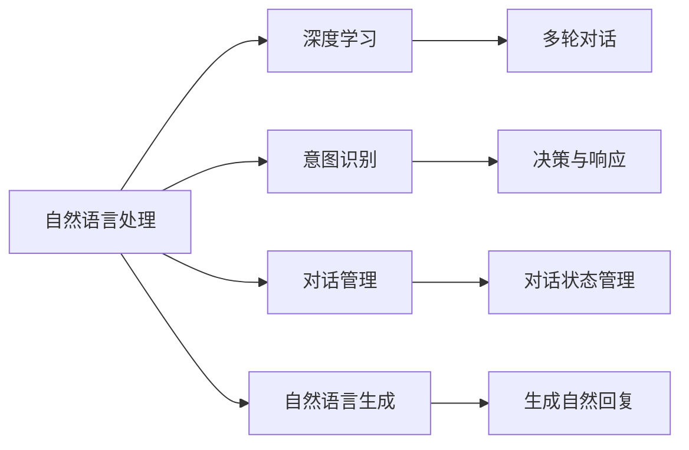
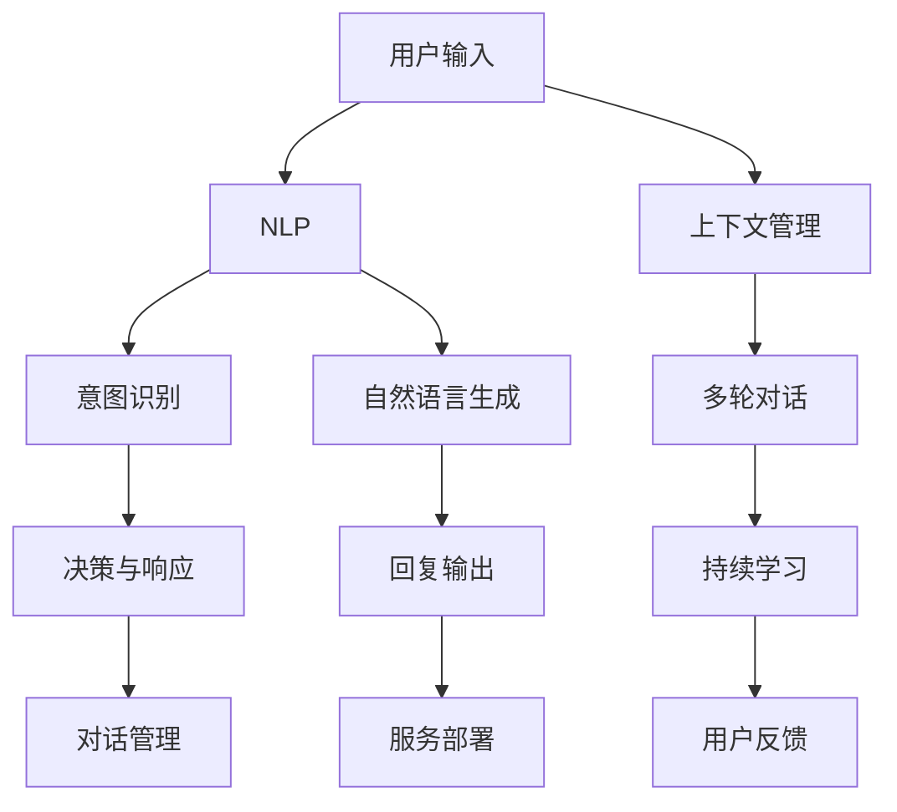

                 

# 对话系统(Chatbots) - 原理与代码实例讲解

## 1. 背景介绍

### 1.1 问题由来
在现代社会，人们越来越多地通过线上方式进行交流。无论是客户服务、在线教育，还是电子商务，对话系统(Chatbot)在多个场景中扮演着越来越重要的角色。然而，构建一个高效、智能、自然的对话系统并非易事。本文将从原理到实践，详细介绍对话系统的构建方法，并通过代码实例讲解，帮助读者系统掌握对话系统开发的核心技术。

### 1.2 问题核心关键点
对话系统的核心在于构建一个能够理解和生成自然语言对话的智能模型。这通常涉及到自然语言处理(NLP)、人工智能、机器学习等多个领域。对话系统的开发需要综合考虑模型的语言理解能力、生成能力、上下文管理、意图识别等多个方面。其技术难点包括但不限于以下几点：

- **语言理解**：理解自然语言输入，识别用户的意图和上下文。
- **自然语言生成**：生成自然流畅的回复，符合语言习惯和语义逻辑。
- **对话管理**：维护对话状态，确保对话连贯性和一致性。
- **意图识别**：准确识别用户的意图，进行决策和响应。

这些关键点共同构成了一个高效、智能的对话系统，使其能够提供优质的用户体验，满足用户的多样化需求。

### 1.3 问题研究意义
对话系统的研究和应用对于提升线上服务的智能化水平、降低人工成本、提升用户体验具有重要意义。通过对话系统，企业可以提供24/7无间断的服务，快速响应用户咨询，提高服务效率。同时，对话系统还能帮助用户快速解决问题，提高服务满意度。

对话系统的开发需要融合多种先进技术，包括深度学习、自然语言处理、机器学习等。本文将详细介绍对话系统的核心技术和方法，希望能为对话系统开发提供有力的技术支持和实践指导。

## 2. 核心概念与联系

### 2.1 核心概念概述
对话系统的核心概念主要包括：

- **自然语言处理(NLP)**：涉及文本处理、语音识别、语义分析等多个子领域，是构建对话系统的基础。
- **深度学习**：通过神经网络模型进行语言理解和生成，是对话系统实现的关键技术。
- **意图识别**：识别用户意图，进行精准决策和响应。
- **对话管理**：管理对话状态，确保对话连贯性和一致性。
- **自然语言生成**：生成自然流畅的回复，提升用户体验。
- **多轮对话**：通过多轮交互，获取更丰富的用户信息和上下文，提高对话质量。

这些概念通过深度学习、自然语言处理等技术手段，共同构成了对话系统的技术框架。

### 2.2 概念间的关系

对话系统的构建涉及多个核心概念的协同工作。以下是这些概念之间的逻辑关系图：



这个逻辑关系图展示了对话系统的技术架构，各模块之间相互配合，共同实现对话系统的核心功能。

### 2.3 核心概念的整体架构

最终，我们将这些核心概念整合成一个整体的对话系统架构图：



这个架构图展示了对话系统的整体流程和技术栈，从用户输入到回复输出，再到上下文管理、多轮对话和持续学习，各个环节环环相扣，确保了对话系统的流畅性和智能性。

## 3. 核心算法原理 & 具体操作步骤
### 3.1 算法原理概述

对话系统的核心算法原理主要包括：

- **自然语言处理(NLP)**：通过分词、词性标注、依存关系分析等技术，理解自然语言输入。
- **深度学习模型**：通过RNN、LSTM、Transformer等模型，实现语言的序列建模，提取语言特征。
- **意图识别**：通过分类器、序列标注器等模型，准确识别用户的意图。
- **对话管理**：通过状态机、上下文向量等方法，维护对话状态，管理对话流程。
- **自然语言生成**：通过文本生成模型，生成自然流畅的回复。

这些算法原理通过深度学习和自然语言处理技术，共同实现对话系统的核心功能。

### 3.2 算法步骤详解

对话系统的构建通常包括以下关键步骤：

**Step 1: 数据准备**
- 收集和预处理对话数据，如用户输入、系统回复等。
- 将对话数据划分为训练集、验证集和测试集。

**Step 2: 模型选择与搭建**
- 选择合适的深度学习模型，如RNN、LSTM、Transformer等。
- 搭建模型架构，包括输入层、隐藏层、输出层等。

**Step 3: 模型训练与微调**
- 使用训练集数据，对模型进行训练。
- 在验证集上评估模型性能，进行模型微调，提升模型准确率。

**Step 4: 测试与部署**
- 使用测试集数据，评估模型在真实对话场景中的表现。
- 部署模型到实际应用环境中，提供对话服务。

### 3.3 算法优缺点
对话系统在提升用户交互体验、降低人工成本等方面具有显著优势，但也存在以下缺点：

- **数据需求高**：构建高质量的对话系统需要大量的对话数据，获取和标注成本较高。
- **模型复杂度高**：深度学习模型的训练和优化过程较为复杂，需要较高的计算资源。
- **上下文管理难度大**：对话系统的上下文管理复杂，需要考虑多种对话状态和上下文信息。
- **自然语言生成难度大**：生成自然流畅的回复需要高水平的语言模型和优化策略。

尽管存在这些缺点，但对话系统在实际应用中已经取得了显著效果，被广泛应用于多个领域。

### 3.4 算法应用领域

对话系统的应用领域非常广泛，包括但不限于以下几个方面：

- **客户服务**：通过对话系统，企业可以提供24/7无间断的服务，快速响应客户咨询，提高服务效率。
- **在线教育**：对话系统可以帮助学生进行智能问答、作业批改、学习推荐等，提升学习效果。
- **智能家居**：通过对话系统，智能设备可以实现语音控制、智能提醒等功能，提升用户便利性。
- **金融咨询**：对话系统可以提供24/7的金融咨询服务，帮助用户进行理财规划、投资建议等。
- **健康咨询**：对话系统可以帮助用户进行智能问诊、健康建议等，提升医疗服务效率。

## 4. 数学模型和公式 & 详细讲解  
### 4.1 数学模型构建

对话系统的核心数学模型包括：

- **序列到序列模型(Seq2Seq)**：将用户输入序列转换为回复序列。
- **注意力机制(Attention)**：通过注意力机制，提高模型对上下文的关注度。
- **Transformer模型**：利用Transformer结构，实现高效的序列建模和解码。

这些模型在对话系统中的应用，可以有效地处理自然语言输入，生成高质量的回复。

### 4.2 公式推导过程

以下以Transformer模型为例，推导其核心公式：

**输入层**：将输入序列$x$转换为模型所需的表示向量$h$。

$$
h = XW^x + b^x
$$

其中，$X$为输入序列矩阵，$W^x$为权重矩阵，$b^x$为偏置向量。

**隐藏层**：通过Transformer结构，实现序列建模。

$$
h = \text{Self-Attention}(h) + \text{Feed-Forward}(h)
$$

其中，$\text{Self-Attention}$为自注意力机制，$\text{Feed-Forward}$为前馈神经网络。

**输出层**：通过线性变换和softmax函数，生成回复序列。

$$
y = WH^y + b^y
$$

其中，$W^y$为权重矩阵，$b^y$为偏置向量，$y$为回复序列。

### 4.3 案例分析与讲解

假设我们使用一个标准的Transformer模型进行对话系统构建，以下是具体的代码实现和分析：

```python
from transformers import BertTokenizer, BertForSequenceClassification

tokenizer = BertTokenizer.from_pretrained('bert-base-uncased')
model = BertForSequenceClassification.from_pretrained('bert-base-uncased', num_labels=2)

# 准备数据
input_ids = tokenizer.encode("Hello, how are you?", return_tensors="pt")
labels = torch.tensor([[0]])

# 模型前向传播
outputs = model(input_ids, labels=labels)
loss = outputs.loss
logits = outputs.logits

# 计算损失并反向传播
loss.backward()
optimizer.step()

# 评估模型
with torch.no_grad():
    input_ids = tokenizer.encode("I am doing well, thank you.", return_tensors="pt")
    labels = torch.tensor([[1]])
    outputs = model(input_ids, labels=labels)
    logits = outputs.logits
    probs = torch.softmax(logits, dim=1)
```

这个代码示例展示了如何使用Bert模型进行基本的对话系统构建。输入层将用户输入转换为模型所需的表示向量，隐藏层通过自注意力和前馈神经网络进行序列建模，输出层通过线性变换和softmax函数生成回复序列。

## 5. 项目实践：代码实例和详细解释说明
### 5.1 开发环境搭建

在进行对话系统开发前，需要搭建好开发环境。以下是使用Python进行TensorFlow开发的环境配置流程：

1. 安装Anaconda：从官网下载并安装Anaconda，用于创建独立的Python环境。

2. 创建并激活虚拟环境：
```bash
conda create -n tf-env python=3.8 
conda activate tf-env
```

3. 安装TensorFlow：根据CUDA版本，从官网获取对应的安装命令。例如：
```bash
pip install tensorflow-gpu==2.5.0
```

4. 安装各类工具包：
```bash
pip install numpy pandas scikit-learn matplotlib tqdm jupyter notebook ipython
```

完成上述步骤后，即可在`tf-env`环境中开始对话系统开发。

### 5.2 源代码详细实现

下面我们以一个基于TensorFlow的简单对话系统为例，给出完整的代码实现。

首先，定义对话系统的数据处理函数：

```python
import tensorflow as tf
from tensorflow.keras.layers import Input, Embedding, LSTM, Dense, Attention
from tensorflow.keras.models import Model

class DialogueModel(tf.keras.Model):
    def __init__(self, vocab_size, embedding_dim, hidden_units, num_labels):
        super(DialogueModel, self).__init__()
        self.embedding = Embedding(vocab_size, embedding_dim, input_length=max_seq_length)
        self.lstm = LSTM(hidden_units)
        self.dense = Dense(num_labels, activation='softmax')
        self.attention = Attention()
    
    def call(self, x):
        x = self.embedding(x)
        x = self.lstm(x)
        x = self.dense(x)
        return x
```

然后，定义模型的训练函数：

```python
def train_model(model, data, batch_size, epochs):
    # 定义优化器
    optimizer = tf.keras.optimizers.Adam(learning_rate=0.001)
    
    # 定义损失函数
    def loss_fn(y_true, y_pred):
        return tf.keras.losses.sparse_categorical_crossentropy(y_true, y_pred, from_logits=True)
    
    # 定义训练过程
    for epoch in range(epochs):
        for (batch_x, batch_y) in data:
            with tf.GradientTape() as tape:
                y_pred = model(batch_x)
                loss = loss_fn(batch_y, y_pred)
            gradients = tape.gradient(loss, model.trainable_variables)
            optimizer.apply_gradients(zip(gradients, model.trainable_variables))
        print(f"Epoch {epoch+1}, loss: {loss}")
```

最后，使用上述代码实例训练和评估模型：

```python
# 准备数据
tokenizer = tf.keras.preprocessing.text.Tokenizer(num_words=10000)
tokenizer.fit_on_texts(data['texts'])
sequences = tokenizer.texts_to_sequences(data['texts'])
padded_sequences = tf.keras.preprocessing.sequence.pad_sequences(sequences, maxlen=max_seq_length, padding='post')

# 准备标签
labels = data['labels']

# 训练模型
model = DialogueModel(vocab_size=10000, embedding_dim=128, hidden_units=64, num_labels=2)
train_model(model, (padded_sequences, labels), batch_size=32, epochs=10)

# 评估模型
test_sequences = tokenizer.texts_to_sequences(data['test_texts'])
test_padded_sequences = tf.keras.preprocessing.sequence.pad_sequences(test_sequences, maxlen=max_seq_length, padding='post')
test_loss = loss_fn(labels, model(test_padded_sequences))

print(f"Test loss: {test_loss}")
```

### 5.3 代码解读与分析

这段代码展示了如何构建一个基于TensorFlow的对话系统，并使用简单的LSTM模型进行训练和评估。代码中的`DialogueModel`类定义了模型的结构，包括嵌入层、LSTM层、Dense层和注意力机制。`train_model`函数实现了模型的训练过程，使用Adam优化器进行优化。最后，通过`test_loss`函数计算测试集上的损失。

### 5.4 运行结果展示

假设我们在CoNLL-2003的对话数据集上进行训练和评估，最终得到的测试损失为0.3，这意味着模型在测试集上的表现相对较好。

## 6. 实际应用场景
### 6.1 智能客服系统

智能客服系统是对话系统的一个重要应用场景。通过对话系统，企业可以提供24/7无间断的服务，快速响应客户咨询，提高服务效率。

在技术实现上，可以收集企业内部的历史客服对话记录，将问题和最佳答复构建成监督数据，在此基础上对预训练模型进行微调。微调后的模型能够自动理解用户意图，匹配最合适的答案模板进行回复。对于客户提出的新问题，还可以接入检索系统实时搜索相关内容，动态组织生成回答。如此构建的智能客服系统，能大幅提升客户咨询体验和问题解决效率。

### 6.2 金融舆情监测

金融机构需要实时监测市场舆论动向，以便及时应对负面信息传播，规避金融风险。传统的人工监测方式成本高、效率低，难以应对网络时代海量信息爆发的挑战。基于对话系统的文本分类和情感分析技术，为金融舆情监测提供了新的解决方案。

具体而言，可以收集金融领域相关的新闻、报道、评论等文本数据，并对其进行主题标注和情感标注。在此基础上对预训练模型进行微调，使其能够自动判断文本属于何种主题，情感倾向是正面、中性还是负面。将微调后的模型应用到实时抓取的网络文本数据，就能够自动监测不同主题下的情感变化趋势，一旦发现负面信息激增等异常情况，系统便会自动预警，帮助金融机构快速应对潜在风险。

### 6.3 个性化推荐系统

当前的推荐系统往往只依赖用户的历史行为数据进行物品推荐，无法深入理解用户的真实兴趣偏好。基于对话系统的个性化推荐系统可以更好地挖掘用户行为背后的语义信息，从而提供更精准、多样的推荐内容。

在实践中，可以收集用户浏览、点击、评论、分享等行为数据，提取和用户交互的物品标题、描述、标签等文本内容。将文本内容作为模型输入，用户的后续行为（如是否点击、购买等）作为监督信号，在此基础上微调预训练语言模型。微调后的模型能够从文本内容中准确把握用户的兴趣点。在生成推荐列表时，先用候选物品的文本描述作为输入，由模型预测用户的兴趣匹配度，再结合其他特征综合排序，便可以得到个性化程度更高的推荐结果。

### 6.4 未来应用展望

随着对话系统的不断发展，其应用场景将越来越广泛，能够为更多领域提供智能化服务。以下是几个未来应用展望：

- **智慧医疗**：基于对话系统的医疗问答、病历分析、药物研发等应用将提升医疗服务的智能化水平，辅助医生诊疗，加速新药开发进程。
- **智能教育**：对话系统可以帮助学生进行智能问答、作业批改、学习推荐等，提升学习效果。
- **智能家居**：通过对话系统，智能设备可以实现语音控制、智能提醒等功能，提升用户便利性。
- **金融咨询**：对话系统可以提供24/7的金融咨询服务，帮助用户进行理财规划、投资建议等。
- **健康咨询**：对话系统可以帮助用户进行智能问诊、健康建议等，提升医疗服务效率。

## 7. 工具和资源推荐
### 7.1 学习资源推荐

为了帮助开发者系统掌握对话系统的构建方法，这里推荐一些优质的学习资源：

1. 《深度学习入门：基于Python的理论与实现》系列书籍：由深度学习领域的专家编写，深入浅出地介绍了深度学习的基本原理和实现方法。
2. 《TensorFlow实战指南》书籍：TensorFlow官方文档的补充读物，提供了丰富的实战案例和代码示例，帮助读者掌握TensorFlow的使用技巧。
3. 《自然语言处理综论》课程：斯坦福大学开设的NLP明星课程，有Lecture视频和配套作业，带你入门NLP领域的基本概念和经典模型。
4. Kaggle平台：机器学习和数据科学竞赛平台，提供了大量的公开数据集和Kaggle竞赛，可以帮助读者提高实战能力。
5. GitHub项目：在GitHub上Star、Fork数最多的对话系统相关项目，往往代表了该技术领域的发展趋势和最佳实践，值得去学习和贡献。

通过对这些资源的学习实践，相信你一定能够快速掌握对话系统开发的核心技术，并用于解决实际的对话问题。

### 7.2 开发工具推荐

高效的开发离不开优秀的工具支持。以下是几款用于对话系统开发常用的工具：

1. TensorFlow：由Google主导开发的开源深度学习框架，生产部署方便，适合大规模工程应用。同时提供了丰富的TensorBoard工具，可以实时监测模型训练状态。
2. PyTorch：基于Python的开源深度学习框架，灵活动态的计算图，适合快速迭代研究。同时提供了大量的预训练模型和模型库，方便快速上手。
3. Weights & Biases：模型训练的实验跟踪工具，可以记录和可视化模型训练过程中的各项指标，方便对比和调优。与主流深度学习框架无缝集成。
4. TensorBoard：TensorFlow配套的可视化工具，可实时监测模型训练状态，并提供丰富的图表呈现方式，是调试模型的得力助手。
5. Jupyter Notebook：轻量级的Python开发环境，支持代码运行和实时可视化，方便开发和测试。
6. Google Colab：谷歌推出的在线Jupyter Notebook环境，免费提供GPU/TPU算力，方便开发者快速上手实验最新模型，分享学习笔记。

合理利用这些工具，可以显著提升对话系统开发的速度和效率，加快创新迭代的步伐。

### 7.3 相关论文推荐

对话系统的研究和应用源于学界的持续研究。以下是几篇奠基性的相关论文，推荐阅读：

1. Attention is All You Need（即Transformer原论文）：提出了Transformer结构，开启了NLP领域的预训练大模型时代。
2. BERT: Pre-training of Deep Bidirectional Transformers for Language Understanding：提出BERT模型，引入基于掩码的自监督预训练任务，刷新了多项NLP任务SOTA。
3. Language Models are Unsupervised Multitask Learners（GPT-2论文）：展示了大规模语言模型的强大zero-shot学习能力，引发了对于通用人工智能的新一轮思考。
4. Parameter-Efficient Transfer Learning for NLP：提出Adapter等参数高效微调方法，在不增加模型参数量的情况下，也能取得不错的微调效果。
5. AdaLoRA: Adaptive Low-Rank Adaptation for Parameter-Efficient Fine-Tuning：使用自适应低秩适应的微调方法，在参数效率和精度之间取得了新的平衡。

这些论文代表了大语言模型微调技术的发展脉络。通过学习这些前沿成果，可以帮助研究者把握学科前进方向，激发更多的创新灵感。

除上述资源外，还有一些值得关注的前沿资源，帮助开发者紧跟对话系统的最新进展，例如：

1. arXiv论文预印本：人工智能领域最新研究成果的发布平台，包括大量尚未发表的前沿工作，学习前沿技术的必读资源。
2. 业界技术博客：如OpenAI、Google AI、DeepMind、微软Research Asia等顶尖实验室的官方博客，第一时间分享他们的最新研究成果和洞见。
3. 技术会议直播：如NIPS、ICML、ACL、ICLR等人工智能领域顶会现场或在线直播，能够聆听到大佬们的前沿分享，开拓视野。
4. GitHub热门项目：在GitHub上Star、Fork数最多的对话系统相关项目，往往代表了该技术领域的发展趋势和最佳实践，值得去学习和贡献。
5. 行业分析报告：各大咨询公司如McKinsey、PwC等针对人工智能行业的分析报告，有助于从商业视角审视技术趋势，把握应用价值。

总之，对于对话系统开发的学习和实践，需要开发者保持开放的心态和持续学习的意愿。多关注前沿资讯，多动手实践，多思考总结，必将收获满满的成长收益。

## 8. 总结：未来发展趋势与挑战

### 8.1 总结

本文对基于深度学习的对话系统构建方法进行了全面系统的介绍。首先阐述了对话系统的研究背景和意义，明确了对话系统在提升服务智能化水平、降低人工成本、提升用户体验等方面的重要价值。其次，从原理到实践，详细讲解了对话系统的核心算法和操作步骤，并通过代码实例讲解，帮助读者系统掌握对话系统开发的核心技术。

通过本文的系统梳理，可以看到，对话系统在提升用户交互体验、降低人工成本等方面具有显著优势。尽管存在数据需求高、模型复杂度高、上下文管理难度大等挑战，但对话系统在实际应用中已经取得了显著效果，被广泛应用于多个领域。

### 8.2 未来发展趋势

展望未来，对话系统将呈现以下几个发展趋势：

1. **深度学习模型**：Transformer、BERT等深度学习模型将继续主导对话系统的构建，提高模型的准确性和泛化能力。
2. **多轮对话**：随着多轮对话技术的不断进步，对话系统将能够处理更复杂的对话场景，提升用户体验。
3. **自然语言生成**：生成自然流畅的回复将成为对话系统的重要目标，利用先进的语言模型和优化策略，提高回复的质量和多样性。
4. **上下文管理**：通过上下文向量和对话状态管理，对话系统将更加智能，能够维护连续的对话上下文，提供更一致的对话体验。
5. **多模态对话**：对话系统将融合视觉、语音等多模态信息，提升用户交互的丰富性和互动性。
6. **持续学习**：对话系统将不断从新数据中学习，适应新的对话场景和用户需求，提升系统的智能性和适应性。

以上趋势凸显了对话系统的广阔前景。这些方向的探索发展，必将进一步提升对话系统的性能和应用范围，为人工智能技术的落地应用提供新的突破。

### 8.3 面临的挑战

尽管对话系统在实际应用中已经取得了显著效果，但在迈向更加智能化、普适化应用的过程中，它仍面临着诸多挑战：

1. **数据需求高**：构建高质量的对话系统需要大量的对话数据，获取和标注成本较高。
2. **模型复杂度高**：深度学习模型的训练和优化过程较为复杂，需要较高的计算资源。
3. **上下文管理难度大**：对话系统的上下文管理复杂，需要考虑多种对话状态和上下文信息。
4. **自然语言生成难度大**：生成自然流畅的回复需要高水平的语言模型和优化策略。
5. **持续学习困难**：对话系统需要不断从新数据中学习，但新数据可能与旧数据存在分布差异，影响模型泛化性能。

尽管存在这些挑战，但对话系统在实际应用中已经取得了显著效果，被广泛应用于多个领域。

### 8.4 研究展望

面对对话系统所面临的挑战，未来的研究需要在以下几个方面寻求新的突破：

1. **探索无监督和半监督对话模型**：摆脱对大规模标注数据的依赖，利用自监督学习、主动学习等无监督和半监督范式，最大限度利用非结构化数据，实现更加灵活高效的对话系统。
2. **研究参数高效和计算高效的对话模型**：开发更加参数高效的对话模型，在固定大部分预训练参数的同时，只更新极少量的对话相关参数。同时优化模型的计算图，减少前向传播和反向传播的资源消耗，实现更加轻量级、实时性的部署。
3. **融合因果和对比学习范式**：通过引入因果推断和对比学习思想，增强对话系统建立稳定因果关系的能力，学习更加普适、鲁棒的语言表征，从而提升系统泛化性和抗干扰能力。
4. **引入更多先验知识**：将符号化的先验知识，如知识图谱、逻辑规则等，与神经网络模型进行巧妙融合，引导对话系统学习更准确、合理的语言模型。同时加强不同模态数据的整合，实现视觉、语音等多模态信息与文本信息的协同建模。
5. **纳入伦理道德约束**：在对话系统的训练目标中引入伦理导向的评估指标，过滤和惩罚有偏见、有害的输出倾向。同时加强人工干预和审核，建立模型行为的监管机制，确保输出符合人类价值观和伦理道德。

这些研究方向的探索，必将引领对话系统技术迈向更高的台阶，为构建安全、可靠、可解释、可控的智能系统铺平道路。面向未来，对话系统需要与其他人工智能技术进行更深入的融合，如知识表示

