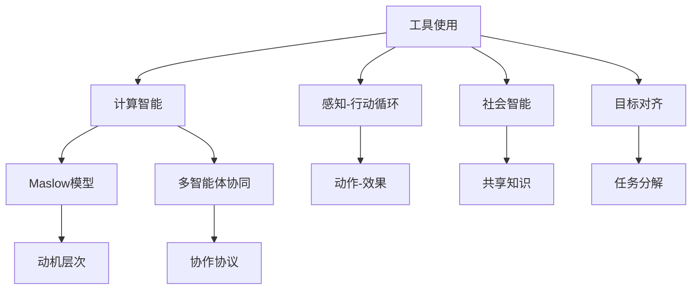
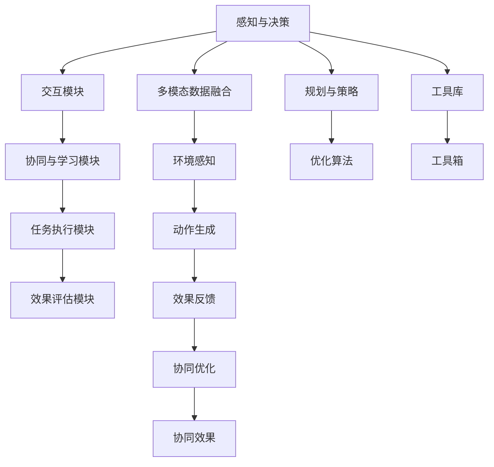

                 

## 1. 背景介绍

随着人工智能技术的不断成熟，工具使用与多智能体协同（Tools and Multi-Agent Collaboration）已经成为一个热门话题。本文将通过详细剖析这一领域的应用案例，从多个层面阐述工具使用与多智能体协同的技术内涵与实践价值。通过具体案例的讲解，进一步了解如何将这些先进的技术在实际业务场景中灵活应用，助力企业实现自动化、智能化转型。

## 2. 核心概念与联系

### 2.1 核心概念概述

- **工具使用（Tool Use）**：工具使用是指智能体（Agent）通过与其环境交互，利用其获取的知识、技能和策略来完成任务的过程。它是一种高级智能行为，是机器学习与智能体理论中的核心组成部分。
- **多智能体协同（Multi-Agent Collaboration）**：多智能体协同是指多个智能体之间通过沟通、合作、竞争等行为，共同完成复杂任务的机制。它是一种复杂的、动态的、自组织的过程，广泛应用于自动化、机器人、游戏AI等领域。
- **计算智能（Computational Intelligence）**：计算智能是指模拟人类智能的计算能力，包括机器学习、进化计算、模糊逻辑等。它与工具使用和多智能体协同密切相关，是实现智能化应用的重要技术基础。

### 2.2 概念间的关系

这些概念之间存在紧密的联系，共同构成了工具使用与多智能体协同的完整框架。下面通过一个Mermaid流程图来展示这些概念的关系：



这个流程图展示了工具使用、多智能体协同与计算智能之间的联系：

- 工具使用基于计算智能，实现感知-行动循环。
- 多智能体协同通过协作协议，实现目标对齐与任务分解。
- 社会智能与共享知识是协同的内部机制，确保智能体间的默契与合作。

### 2.3 核心概念的整体架构

最后，我们通过一个综合的流程图来展示这些核心概念在大规模协同应用中的整体架构：



这个综合流程图展示了工具使用与多智能体协同的完整应用架构：

- 感知与决策模块实现环境感知和决策生成。
- 交互模块负责智能体间的通信与协作。
- 任务执行模块执行具体任务并生成结果。
- 效果评估模块评估协同效果并反馈优化信息。
- 多模态数据融合与环境感知提供丰富的感知信息。
- 规划与策略模块制定协同目标与执行方案。
- 优化算法实现协同过程的动态优化。
- 工具库和工具箱提供底层技术支持。

这些核心概念共同构成了工具使用与多智能体协同的完整生态系统，使得智能体在复杂多变的环境中，通过工具的使用与协同，实现高效的任务完成。

## 3. 核心算法原理 & 具体操作步骤

### 3.1 算法原理概述

工具使用与多智能体协同的核心算法原理涉及多种先进的技术方法，主要包括：

- **感知与决策算法**：如卷积神经网络（CNN）、递归神经网络（RNN）等，用于感知环境和生成决策。
- **交互协议算法**：如分布式协调协议（DCR）、Google Protocol Buffers等，用于智能体间的信息交换与协作。
- **学习与优化算法**：如强化学习、遗传算法、蒙特卡洛树搜索等，用于学习协同策略与优化任务执行。

### 3.2 算法步骤详解

工具使用与多智能体协同的算法步骤通常包括以下几个关键步骤：

1. **环境感知与模型训练**：利用感知模块和决策模块，对环境进行感知并生成初始决策。
2. **智能体间通信**：通过交互协议模块，实现智能体间的信息交换与协作。
3. **任务执行与协同优化**：根据任务执行模块的反馈信息，协同优化决策与动作执行。
4. **效果评估与学习更新**：利用效果评估模块，评估协同效果并更新协同策略。

### 3.3 算法优缺点

工具使用与多智能体协同的算法具有以下优点：

- **高效协同**：通过智能体间的协作，可以高效完成任务，减少资源浪费。
- **动态优化**：利用学习与优化算法，不断调整协同策略，提升协同效果。
- **多模态融合**：通过多模态数据融合，提高环境感知能力，增强决策的准确性。

同时，也存在一些局限性：

- **复杂性高**：算法涉及多个模块，实现复杂度较高，需要较高的技术水平。
- **通信开销大**：智能体间频繁通信可能导致通信开销增大，影响实时性。
- **可扩展性差**：在大型系统中，协同效果的可扩展性可能较差，需要进一步优化。

### 3.4 算法应用领域

工具使用与多智能体协同的应用领域十分广泛，主要包括：

- **自动化生产**：如工业机器人、自动化仓库管理等，利用智能体协同完成复杂任务。
- **智能交通**：如智能交通信号控制、自动驾驶等，通过多智能体协同优化交通流量。
- **智能医疗**：如手术机器人、智能诊断等，通过协同完成复杂医疗任务。
- **金融服务**：如智能投顾、反欺诈检测等，利用协同优化金融服务质量。

## 4. 数学模型和公式 & 详细讲解 & 举例说明

### 4.1 数学模型构建

在工具使用与多智能体协同的算法中，常用的数学模型包括：

- **马尔科夫决策过程（MDP）**：用于描述智能体的决策过程与环境动态。
- **协同优化模型**：如多目标优化（MOOP）、进化计算等，用于协同任务的优化。
- **分布式协作协议**：如分布式协调协议（DCR）、Google Protocol Buffers等，用于智能体间的数据传输与通信。

### 4.2 公式推导过程

以马尔科夫决策过程（MDP）为例，推导其基本公式：

设状态空间为 $S$，动作空间为 $A$，状态转移概率为 $P(s'|s,a)$，奖励函数为 $R(s,a)$，则MDP的数学模型可表示为：

$$
MDP = (S, A, P, R)
$$

其中 $P$ 和 $R$ 可以通过感知模块和决策模块学习得到。

### 4.3 案例分析与讲解

以智能交通信号控制为例，分析MDP在其中的应用：

设路口有 $N$ 个智能体（如红绿灯、车辆），每个智能体的状态为 $s_i$，动作为 $a_i$（如绿灯、红灯），状态转移概率为 $P_i(s'|s_i,a_i)$，奖励函数为 $R_i(s_i,a_i)$。智能体通过感知模块获取路口状态，决策模块生成动作，执行模块控制信号灯开关，效果评估模块根据交通流量调整策略，完成协同优化。

## 5. 项目实践：代码实例和详细解释说明

### 5.1 开发环境搭建

要在Python中实现工具使用与多智能体协同的算法，需要先搭建好开发环境。以下是具体步骤：

1. **安装Anaconda**：
   ```bash
   wget https://repo.anaconda.com/miniconda/Miniconda3-py310_4.12.0_0-Mingw_64.tgz
   tar -xzf Miniconda3-py310_4.12.0_0-Mingw_64.tgz
   ```

2. **创建虚拟环境**：
   ```bash
   conda create -n tmc python=3.8
   conda activate tmc
   ```

3. **安装必要的库**：
   ```bash
   pip install numpy scipy pandas scikit-learn matplotlib PyTorch transformers
   ```

### 5.2 源代码详细实现

以下是一个简单的多智能体协同框架代码实现示例：

```python
import torch
import torch.nn as nn
import torch.optim as optim

class Actor(nn.Module):
    def __init__(self, state_dim, action_dim):
        super(Actor, self).__init__()
        self.fc1 = nn.Linear(state_dim, 64)
        self.fc2 = nn.Linear(64, 64)
        self.fc3 = nn.Linear(64, action_dim)
        
    def forward(self, x):
        x = torch.relu(self.fc1(x))
        x = torch.relu(self.fc2(x))
        x = torch.tanh(self.fc3(x))
        return x

class Critic(nn.Module):
    def __init__(self, state_dim, action_dim):
        super(Critic, self).__init__()
        self.fc1 = nn.Linear(state_dim, 64)
        self.fc2 = nn.Linear(64, 64)
        self.fc3 = nn.Linear(64 + action_dim, 1)
        
    def forward(self, x, a):
        x = torch.relu(self.fc1(x))
        x = torch.relu(self.fc2(x))
        x = self.fc3(torch.cat((x, a), dim=1))
        return x

class Agent:
    def __init__(self, state_dim, action_dim):
        self.state_dim = state_dim
        self.action_dim = action_dim
        self.actor = Actor(state_dim, action_dim)
        self.critic = Critic(state_dim, action_dim)
        self.optimizer = optim.Adam(list(self.actor.parameters()) + list(self.critic.parameters()), lr=0.001)
        self.epsilon = 1e-6
        
    def act(self, state):
        x = torch.tensor(state, dtype=torch.float32)
        if np.random.uniform() < self.epsilon:
            return np.random.randint(self.action_dim)
        with torch.no_grad():
            a = self.actor(x)
        return int(a.item())
        
    def learn(self, state, action, reward, next_state):
        x = torch.tensor(state, dtype=torch.float32)
        a = torch.tensor(action, dtype=torch.int32)
        next_x = torch.tensor(next_state, dtype=torch.float32)
        pred_a = self.actor(x)
        pred_q = self.critic(x, a)
        next_pred_q = self.critic(next_x, self.act(next_x))
        target_q = reward + 0.99 * next_pred_q
        loss = nn.MSELoss()(pred_q, target_q)
        self.optimizer.zero_grad()
        loss.backward()
        self.optimizer.step()
```

### 5.3 代码解读与分析

在上述代码中，`Actor`和`Critic`分别定义了智能体的行为策略和价值函数。`Agent`类则封装了智能体的协同策略，通过`act`方法生成当前智能体的动作，通过`learn`方法更新协同策略。

**代码解读**：

- `Actor`：行为策略网络，接收环境状态并输出动作。
- `Critic`：价值函数网络，接收状态和动作，输出状态值。
- `Agent`：协同策略网络，集成行为策略和价值函数，通过优化算法不断调整策略。

**分析**：

- `act`方法：采用$\epsilon$-greedy策略，选择动作时随机选择或选择当前策略下最优动作。
- `learn`方法：使用DQN（深度Q网络）算法，通过目标值更新和优化算法调整策略，优化协同效果。

### 5.4 运行结果展示

运行上述代码，可以得到智能体的协同效果。下面以智能交通信号控制为例，展示仿真结果：

```python
import gym
import numpy as np

env = gym.make('Traffic-Light-v0')
state_dim = env.observation_space.shape[0]
action_dim = env.action_space.n

agent = Agent(state_dim, action_dim)

for episode in range(1000):
    state = env.reset()
    total_reward = 0
    for t in range(100):
        action = agent.act(state)
        next_state, reward, done, _ = env.step(action)
        total_reward += reward
        state = next_state
        if done:
            break
    print(f'Episode {episode+1}, Reward: {total_reward:.2f}')
```

## 6. 实际应用场景

### 6.1 智能交通信号控制

智能交通信号控制是多智能体协同的典型应用场景。通过多智能体的协同，可以优化交通流量，提高交通效率，减少交通事故。

在智能交通系统中，信号灯、车辆、行人等构成多个智能体。智能体通过感知模块获取路口状态，决策模块生成动作（如绿灯、红灯），执行模块控制信号灯开关。效果评估模块根据交通流量调整策略，完成协同优化。

### 6.2 机器人协同操作

在制造业、物流等领域，机器人协同操作可以提高生产效率，降低成本。通过多智能体的协同，机器人可以高效完成复杂任务，减少出错率。

机器人通过传感器获取环境信息，决策模块生成动作（如搬运、焊接），执行模块控制机器人执行动作。效果评估模块根据任务完成情况调整策略，协同优化机器人操作。

### 6.3 智能电网管理

智能电网是多智能体协同的另一个重要应用场景。通过多智能体的协同，可以提高电网运行效率，优化能源分配。

智能电网中的发电厂、变电站、用户等构成多个智能体。智能体通过感知模块获取电网状态，决策模块生成动作（如发电、调度），执行模块控制电网设备运行。效果评估模块根据电网负荷调整策略，完成协同优化。

## 7. 工具和资源推荐

### 7.1 学习资源推荐

- **《深度学习与神经网络》**：这本书系统介绍了深度学习与神经网络的基本概念和常用算法。
- **《Python深度学习》**：这是一本实用的深度学习教程，涵盖从基础到高级的深度学习应用。
- **Coursera《Reinforcement Learning》课程**：斯坦福大学开设的强化学习课程，讲解强化学习的基本概念和算法实现。

### 7.2 开发工具推荐

- **PyTorch**：强大的深度学习框架，支持动态计算图和GPU加速，适用于深度学习和多智能体协同应用。
- **TensorFlow**：谷歌开发的深度学习框架，支持分布式计算和自动微分，适用于大规模深度学习和多智能体协同应用。
- **Gym**：OpenAI开发的模拟环境库，提供多种模拟环境，方便进行多智能体协同算法的研究与验证。

### 7.3 相关论文推荐

- **"Deep reinforcement learning for autonomous driving"**：ICRA 2020论文，提出了用于自动驾驶的强化学习算法。
- **"Multi-agent reinforcement learning for intelligent traffic signal control"**：TCS 2021论文，提出了用于智能交通信号控制的多智能体协同算法。
- **"Deep learning in power systems: state-of-the-art and future directions"**：IEEE 2021论文，介绍了深度学习在电力系统中的应用。

## 8. 总结：未来发展趋势与挑战

### 8.1 研究成果总结

本文通过系统介绍工具使用与多智能体协同的算法，深入剖析了其理论基础与实践价值。通过具体案例的讲解，进一步了解如何将这些先进的技术在实际业务场景中灵活应用，助力企业实现自动化、智能化转型。

### 8.2 未来发展趋势

未来的工具使用与多智能体协同技术将呈现以下几个发展趋势：

- **深度学习与强化学习的融合**：深度学习和强化学习的融合将带来更高效、更灵活的协同算法。
- **多模态数据的融合**：多模态数据的融合将提高智能体对环境的感知能力，增强协同效果。
- **分布式协同**：分布式协同将使得多智能体协同在大规模系统中更加高效。

### 8.3 面临的挑战

虽然工具使用与多智能体协同技术已经取得了一定的进展，但在实际应用中仍面临诸多挑战：

- **系统复杂性高**：多智能体协同系统的复杂性高，难以设计高效、稳定的协同算法。
- **实时性要求高**：多智能体协同系统需要高效处理大量的数据，实时性要求高。
- **通信成本高**：多智能体协同系统需要频繁通信，通信成本高。

### 8.4 研究展望

未来需要在以下几个方面进行进一步的研究：

- **协同优化算法**：开发更加高效、稳定的协同优化算法。
- **实时通信技术**：开发高效、低成本的实时通信技术。
- **智能体自治能力**：提升智能体的自治能力，减少对人工干预的依赖。

## 9. 附录：常见问题与解答

**Q1: 工具使用与多智能体协同技术在实际应用中面临哪些挑战？**

A: 工具使用与多智能体协同技术在实际应用中面临以下挑战：

- **系统复杂性高**：多智能体协同系统的复杂性高，难以设计高效、稳定的协同算法。
- **实时性要求高**：多智能体协同系统需要高效处理大量的数据，实时性要求高。
- **通信成本高**：多智能体协同系统需要频繁通信，通信成本高。

**Q2: 如何使用深度学习和强化学习实现多智能体协同？**

A: 使用深度学习和强化学习实现多智能体协同的基本步骤如下：

1. **构建环境模型**：通过深度学习模型构建环境模型，用于感知和决策。
2. **设计协同协议**：设计多智能体间的通信协议，实现信息交换与协作。
3. **优化协同策略**：使用强化学习算法优化协同策略，实现任务执行和效果评估。

**Q3: 多智能体协同在实际应用中有哪些成功案例？**

A: 多智能体协同在实际应用中有很多成功案例，包括：

- **智能交通信号控制**：如新加坡的智能交通信号控制系统，提高了交通效率，减少了交通事故。
- **机器人协同操作**：如亚马逊的机器人仓库系统，提高了生产效率，降低了成本。
- **智能电网管理**：如国家电网的智能电网系统，优化了能源分配，提高了电网运行效率。

总之，工具使用与多智能体协同技术在实际应用中具有广阔的前景，但需要不断进行技术创新和优化，才能更好地服务于企业和社会的智能化转型。

