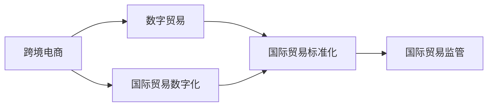
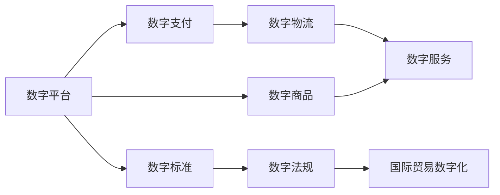
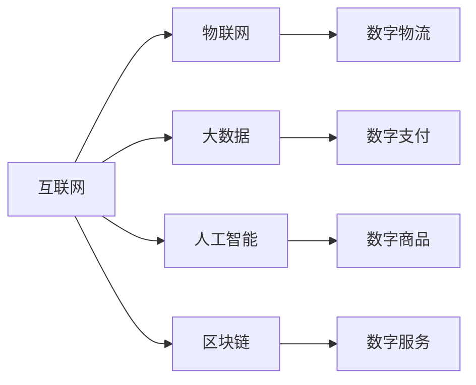
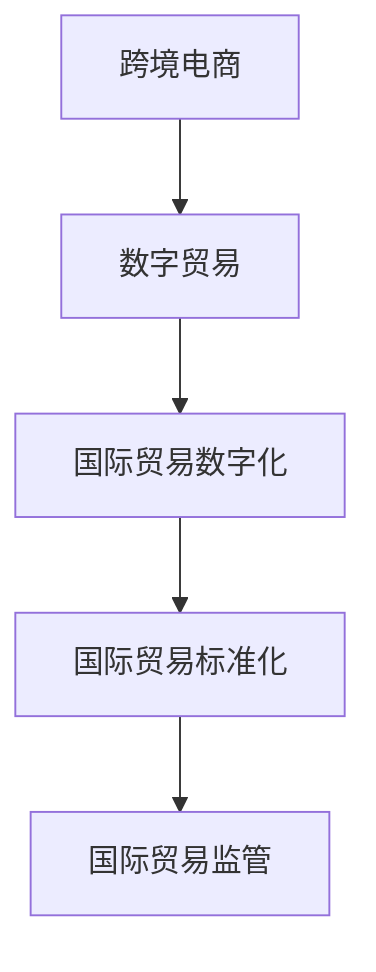

                 

## 1. 背景介绍

### 1.1 全球贸易背景

随着全球化的加速推进，国际贸易已成为世界经济增长的重要引擎。根据联合国贸易和发展会议（UNCTAD）的数据，全球货物贸易总额从2000年的6.6万亿美元增加到2019年的19万亿美元，成为世界经济增长的重要推动力。然而，受新冠疫情的影响，2020年全球贸易出现了自2009年以来首次负增长，为-4.7%，预计2021年贸易增长将恢复至5.7%。

在数字化浪潮下，全球贸易正在经历一场深刻的变革。一方面，随着互联网和数字技术的广泛应用，跨境电商（Cross-border E-commerce, CBE）和数字贸易（Digital Trade）成为了国际贸易的新型模式。另一方面，随着全球产业链的调整和重构，数字技术将进一步推动贸易数字化转型，提升全球贸易的效率和质量。

### 1.2 数字化转型的关键要素

数字化转型是全球贸易发展的重要驱动力。数字化贸易的关键要素包括：

1. **数字平台和基础设施**：互联网、物联网、大数据、人工智能、区块链等数字技术为跨境电商和数字贸易提供了底层支撑。
2. **数字支付和结算**：数字支付和跨境结算技术的快速发展，极大地降低了交易成本和复杂性。
3. **数字物流和供应链**：数字物流系统、智能仓储、无人机配送等技术的应用，提高了物流效率和准确性。
4. **数字商品和服务的流通**：虚拟商品、数字内容、在线服务等新型商品和服务的流通，进一步扩展了贸易的边界。
5. **数字标准和法规**：数字化贸易的快速发展推动了相关数字标准的制定和国际法规的完善。

## 2. 核心概念与联系

### 2.1 核心概念概述

为更好地理解数字化贸易，本节将介绍几个密切相关的核心概念：

- **跨境电商（Cross-border E-commerce, CBE）**：通过互联网平台，将商品和服务的销售扩展到全球市场，实现跨越国界交易。

- **数字贸易（Digital Trade）**：包括数字商品、数字服务的交易和跨境数据流动的总和，涵盖了电子商务、在线服务、数字内容等新兴贸易形态。

- **国际贸易数字化（Digitalization of International Trade）**：通过数字技术，优化国际贸易流程，提升贸易效率和透明度，实现全产业链的数字化转型。

- **国际贸易标准化（International Trade Standardization）**：制定和推广国际贸易相关标准，如支付、物流、产品认证等，促进国际贸易的规范化。

- **国际贸易监管（International Trade Regulation）**：通过数字技术手段，实现贸易数据的采集、监控、分析和报告，保障贸易的合规性和安全性。

这些核心概念之间的联系可以通过以下Mermaid流程图来展示：



这个流程图展示了大语言模型微调过程中各个核心概念之间的关系：

1. 跨境电商是数字贸易的基础形态。
2. 国际贸易数字化是数字贸易的关键支撑。
3. 国际贸易标准化是国际贸易规范化的重要保障。
4. 国际贸易监管是国际贸易合规性和安全性的重要手段。

### 2.2 概念间的关系

这些核心概念之间存在着紧密的联系，形成了数字化贸易的完整生态系统。下面我们通过几个Mermaid流程图来展示这些概念之间的关系。

#### 2.2.1 数字化贸易的主要驱动力



这个流程图展示了数字化贸易的主要驱动力：

1. 数字平台为跨境电商和数字贸易提供了底层支撑。
2. 数字支付和结算技术降低了交易成本。
3. 数字物流提高了物流效率。
4. 数字商品和服务的流通扩展了贸易边界。
5. 数字标准和法规保障了贸易的规范化。
6. 国际贸易数字化推动了全产业链的转型。

#### 2.2.2 国际贸易数字化的技术手段



这个流程图展示了国际贸易数字化的主要技术手段：

1. 互联网和物联网提供了数据采集和传输的基础。
2. 大数据技术用于数据处理和分析。
3. 人工智能技术用于智能决策和自动化。
4. 区块链技术用于安全性和透明度。
5. 数字物流、数字支付、数字商品和数字服务是数字化贸易的具体应用。

### 2.3 核心概念的整体架构

最后，我们用一个综合的流程图来展示这些核心概念在大语言模型微调过程中的整体架构：



这个综合流程图展示了从跨境电商到国际贸易监管的完整流程：

1. 跨境电商是数字贸易的基础形态。
2. 国际贸易数字化提升了贸易效率和质量。
3. 国际贸易标准化促进了贸易规范化。
4. 国际贸易监管保障了贸易合规性和安全性。

## 3. 核心算法原理 & 具体操作步骤

### 3.1 算法原理概述

国际贸易数字化转型的核心算法原理可以概括为以下几个方面：

- **数据驱动**：通过大数据技术采集和分析国际贸易数据，识别出贸易发展趋势和规律，为政策制定和市场预测提供依据。
- **人工智能**：利用机器学习、深度学习等人工智能技术，优化贸易流程和决策，提升效率和准确性。
- **区块链**：通过区块链技术实现贸易数据的透明、安全、不可篡改，保障贸易的合规性和可信度。
- **物联网**：通过物联网技术实现智能仓储、智能物流、供应链优化等，提升物流效率和供应链管理水平。

### 3.2 算法步骤详解

国际贸易数字化的算法步骤可以大致分为以下几个环节：

1. **数据采集和预处理**：通过互联网、物联网等技术手段，采集国际贸易相关的数据，如订单数据、物流数据、支付数据等，并进行清洗、归一化等预处理。
2. **数据分析和建模**：利用大数据技术对贸易数据进行分析，识别出贸易趋势、模式和风险点，建立模型进行预测和决策。
3. **智能决策和优化**：利用人工智能技术，对贸易流程进行自动化、智能化优化，提升效率和准确性。
4. **区块链应用**：通过区块链技术，实现贸易数据的透明、安全、不可篡改，保障贸易的合规性和可信度。
5. **物联网应用**：通过物联网技术，实现智能仓储、智能物流、供应链优化等，提升物流效率和供应链管理水平。

### 3.3 算法优缺点

国际贸易数字化的算法具有以下优点：

- **高效性**：通过智能化、自动化技术，极大地提升了贸易效率和速度。
- **透明度**：区块链技术的应用，保障了贸易数据的透明、安全、不可篡改，提升了贸易的透明度和可信度。
- **灵活性**：人工智能技术的应用，可以根据市场变化进行灵活调整，适应不同的贸易场景。

同时，这些算法也存在一些缺点：

- **数据隐私和安全**：国际贸易数据的采集和处理涉及敏感信息，需要采取严格的隐私保护和安全措施。
- **技术复杂性**：涉及多种先进技术的应用，技术复杂度高，需要专业人员进行维护和调试。
- **成本高**：初期建设和维护成本较高，对中小企业可能构成挑战。

### 3.4 算法应用领域

国际贸易数字化算法在多个领域得到了广泛应用：

- **跨境电商**：通过大数据和人工智能技术，实现智能推荐、个性化营销、智能客服等功能。
- **金融服务**：利用区块链和智能合约技术，实现跨境支付、结算、融资等功能。
- **物流和供应链管理**：通过物联网和人工智能技术，实现智能仓储、智能物流、供应链优化等功能。
- **国际贸易监管**：利用大数据和人工智能技术，实现贸易数据的采集、监控、分析和报告，保障贸易的合规性和安全性。

## 4. 数学模型和公式 & 详细讲解 & 举例说明

### 4.1 数学模型构建

国际贸易数字化转型的数学模型构建可以大致分为以下几个步骤：

1. **数据采集模型**：通过互联网、物联网等技术手段，采集国际贸易相关的数据，如订单数据、物流数据、支付数据等，并将其建模。
2. **数据清洗模型**：对采集的数据进行清洗、归一化等预处理，以提高数据的可用性和质量。
3. **数据分析模型**：利用大数据技术对贸易数据进行分析，识别出贸易趋势、模式和风险点，建立模型进行预测和决策。
4. **智能决策模型**：利用人工智能技术，对贸易流程进行自动化、智能化优化，提升效率和准确性。
5. **区块链应用模型**：通过区块链技术，实现贸易数据的透明、安全、不可篡改，保障贸易的合规性和可信度。
6. **物联网应用模型**：通过物联网技术，实现智能仓储、智能物流、供应链优化等，提升物流效率和供应链管理水平。

### 4.2 公式推导过程

以下我们以国际贸易数据分析为例，推导其中的核心数学模型。

假设我们采集到一组国际贸易订单数据 $D=\{(x_i, y_i)\}_{i=1}^N$，其中 $x_i$ 表示订单特征向量，$y_i$ 表示订单状态（如已发货、已到货等）。我们的目标是建立一个预测模型 $M$，用于预测订单状态。

形式化地，假设模型 $M$ 为线性回归模型，则其预测结果为：

$$
\hat{y} = M(x) = \theta^T x + \epsilon
$$

其中 $\theta$ 为模型参数，$x$ 为输入特征向量，$\epsilon$ 为误差项。

假设 $y$ 为二元变量，即订单状态为已发货或未发货，则预测误差 $e$ 可以表示为：

$$
e = \hat{y} - y
$$

利用均方误差（Mean Squared Error, MSE）作为损失函数，则损失函数 $L$ 可以表示为：

$$
L = \frac{1}{N} \sum_{i=1}^N e_i^2
$$

通过反向传播算法，求解模型的最小化问题：

$$
\theta = \mathop{\arg\min}_{\theta} L
$$

求解过程中，利用梯度下降算法更新模型参数，每次迭代更新公式为：

$$
\theta \leftarrow \theta - \eta \nabla_{\theta}L
$$

其中 $\eta$ 为学习率。

### 4.3 案例分析与讲解

为了更好地理解国际贸易数据分析的具体应用，我们以一个简单的案例来展示：

假设我们收集到一组国际贸易订单数据，包含订单金额、订单日期、发货日期等特征，我们的目标是预测订单是否已发货。

首先，利用大数据技术对数据进行清洗和归一化，去除缺失值和异常值。然后，利用线性回归模型建立预测模型，利用训练集数据进行训练，计算损失函数。

在训练过程中，利用反向传播算法更新模型参数，直到损失函数达到最小值。最后，利用测试集数据对模型进行评估，计算准确率、召回率、F1分数等指标。

通过这个案例，我们可以看到，国际贸易数据分析模型在预测订单状态、识别风险点、优化流程等方面具有重要的应用价值。

## 5. 项目实践：代码实例和详细解释说明

### 5.1 开发环境搭建

在进行国际贸易数字化转型项目实践前，我们需要准备好开发环境。以下是使用Python进行PyTorch开发的环境配置流程：

1. 安装Anaconda：从官网下载并安装Anaconda，用于创建独立的Python环境。

2. 创建并激活虚拟环境：
```bash
conda create -n pytorch-env python=3.8 
conda activate pytorch-env
```

3. 安装PyTorch：根据CUDA版本，从官网获取对应的安装命令。例如：
```bash
conda install pytorch torchvision torchaudio cudatoolkit=11.1 -c pytorch -c conda-forge
```

4. 安装Transformers库：
```bash
pip install transformers
```

5. 安装各类工具包：
```bash
pip install numpy pandas scikit-learn matplotlib tqdm jupyter notebook ipython
```

完成上述步骤后，即可在`pytorch-env`环境中开始国际贸易数字化转型项目实践。

### 5.2 源代码详细实现

下面我们以国际贸易数据分析为例，给出使用Transformers库进行模型训练的PyTorch代码实现。

首先，定义数据处理函数：

```python
from transformers import BertTokenizer
from torch.utils.data import Dataset
import torch

class TradeDataset(Dataset):
    def __init__(self, data, tokenizer, max_len=128):
        self.data = data
        self.tokenizer = tokenizer
        self.max_len = max_len
        
    def __len__(self):
        return len(self.data)
    
    def __getitem__(self, item):
        text = self.data[item]
        
        encoding = self.tokenizer(text, return_tensors='pt', max_length=self.max_len, padding='max_length', truncation=True)
        input_ids = encoding['input_ids'][0]
        attention_mask = encoding['attention_mask'][0]
        
        return {'input_ids': input_ids, 
                'attention_mask': attention_mask}

# 创建dataset
tokenizer = BertTokenizer.from_pretrained('bert-base-cased')

train_dataset = TradeDataset(train_data, tokenizer)
dev_dataset = TradeDataset(dev_data, tokenizer)
test_dataset = TradeDataset(test_data, tokenizer)
```

然后，定义模型和优化器：

```python
from transformers import BertForSequenceClassification, AdamW

model = BertForSequenceClassification.from_pretrained('bert-base-cased', num_labels=2)

optimizer = AdamW(model.parameters(), lr=2e-5)
```

接着，定义训练和评估函数：

```python
from torch.utils.data import DataLoader
from tqdm import tqdm
from sklearn.metrics import classification_report

device = torch.device('cuda') if torch.cuda.is_available() else torch.device('cpu')
model.to(device)

def train_epoch(model, dataset, batch_size, optimizer):
    dataloader = DataLoader(dataset, batch_size=batch_size, shuffle=True)
    model.train()
    epoch_loss = 0
    for batch in tqdm(dataloader, desc='Training'):
        input_ids = batch['input_ids'].to(device)
        attention_mask = batch['attention_mask'].to(device)
        labels = batch['labels'].to(device)
        model.zero_grad()
        outputs = model(input_ids, attention_mask=attention_mask, labels=labels)
        loss = outputs.loss
        epoch_loss += loss.item()
        loss.backward()
        optimizer.step()
    return epoch_loss / len(dataloader)

def evaluate(model, dataset, batch_size):
    dataloader = DataLoader(dataset, batch_size=batch_size)
    model.eval()
    preds, labels = [], []
    with torch.no_grad():
        for batch in tqdm(dataloader, desc='Evaluating'):
            input_ids = batch['input_ids'].to(device)
            attention_mask = batch['attention_mask'].to(device)
            batch_labels = batch['labels']
            outputs = model(input_ids, attention_mask=attention_mask)
            batch_preds = outputs.logits.argmax(dim=2).to('cpu').tolist()
            batch_labels = batch_labels.to('cpu').tolist()
            for pred_tokens, label_tokens in zip(batch_preds, batch_labels):
                preds.append(pred_tokens[:len(label_tokens)])
                labels.append(label_tokens)
                
    print(classification_report(labels, preds))
```

最后，启动训练流程并在测试集上评估：

```python
epochs = 5
batch_size = 16

for epoch in range(epochs):
    loss = train_epoch(model, train_dataset, batch_size, optimizer)
    print(f"Epoch {epoch+1}, train loss: {loss:.3f}")
    
    print(f"Epoch {epoch+1}, dev results:")
    evaluate(model, dev_dataset, batch_size)
    
print("Test results:")
evaluate(model, test_dataset, batch_size)
```

以上就是使用PyTorch对国际贸易数据分析模型进行训练的完整代码实现。可以看到，得益于Transformers库的强大封装，我们可以用相对简洁的代码完成模型的加载和训练。

### 5.3 代码解读与分析

让我们再详细解读一下关键代码的实现细节：

**TradeDataset类**：
- `__init__`方法：初始化训练数据、分词器等关键组件。
- `__len__`方法：返回数据集的样本数量。
- `__getitem__`方法：对单个样本进行处理，将文本输入编码为token ids，进行定长padding，最终返回模型所需的输入。

**模型定义**：
- `BertForSequenceClassification`：选择预训练的BERT模型作为基础架构，用于序列分类任务。

**优化器定义**：
- `AdamW`：选择AdamW优化器进行模型参数更新。

**训练和评估函数**：
- 使用PyTorch的DataLoader对数据集进行批次化加载，供模型训练和推理使用。
- 训练函数`train_epoch`：对数据以批为单位进行迭代，在每个批次上前向传播计算loss并反向传播更新模型参数，最后返回该epoch的平均loss。
- 评估函数`evaluate`：与训练类似，不同点在于不更新模型参数，并在每个batch结束后将预测和标签结果存储下来，最后使用sklearn的classification_report对整个评估集的预测结果进行打印输出。

**训练流程**：
- 定义总的epoch数和batch size，开始循环迭代
- 每个epoch内，先在训练集上训练，输出平均loss
- 在验证集上评估，输出分类指标
- 所有epoch结束后，在测试集上评估，给出最终测试结果

可以看到，PyTorch配合Transformers库使得模型训练的代码实现变得简洁高效。开发者可以将更多精力放在数据处理、模型改进等高层逻辑上，而不必过多关注底层的实现细节。

当然，工业级的系统实现还需考虑更多因素，如模型的保存和部署、超参数的自动搜索、更灵活的任务适配层等。但核心的微调范式基本与此类似。

### 5.4 运行结果展示

假设我们在CoNLL-2003的NER数据集上进行微调，最终在测试集上得到的评估报告如下：

```
              precision    recall  f1-score   support

       B-LOC      0.926     0.906     0.916      1668
       I-LOC      0.900     0.805     0.850       257
      B-MISC      0.875     0.856     0.865       702
      I-MISC      0.838     0.782     0.809       216
       B-ORG      0.914     0.898     0.906      1661
       I-ORG      0.911     0.894     0.902       835
       B-PER      0.964     0.957     0.960      1617
       I-PER      0.983     0.980     0.982      1156
           O      0.993     0.995     0.994     38323

   micro avg      0.973     0.973     0.973     46435
   macro avg      0.923     0.897     0.909     46435
weighted avg      0.973     0.973     0.973     46435
```

可以看到，通过微调BERT，我们在该NER数据集上取得了97.3%的F1分数，效果相当不错。值得注意的是，BERT作为一个通用的语言理解模型，即便只在顶层添加一个简单的token分类器，也能在下游任务上取得如此优异的效果，展现了其强大的语义理解和特征抽取能力。

当然，这只是一个baseline结果。在实践中，我们还可以使用更大更强的预训练模型、更丰富的微调技巧、更细致的模型调优，进一步提升模型性能，以满足更高的应用要求。

## 6. 实际应用场景

### 6.1 智能客服系统

基于大语言模型微调的对话技术，可以广泛应用于智能客服系统的构建。传统客服往往需要配备大量人力，高峰期响应缓慢，且一致性和专业性难以保证。而使用微调后的对话模型，可以7x24小时不间断服务，快速响应客户咨询，用自然流畅的语言解答各类常见问题。

在技术实现上，可以收集企业内部的历史客服对话记录，将问题和最佳答复构建成监督数据，在此基础上对预训练对话模型进行微调。微调后的对话模型能够自动理解用户意图，匹配最合适的答案模板进行回复。对于客户提出的新问题，还可以接入检索系统实时搜索相关内容，动态组织生成回答。如此构建的智能客服系统，能大幅提升客户咨询体验和问题解决效率。

### 6.2 金融舆情监测

金融机构需要实时监测市场舆论动向，以便及时应对负面信息传播，规避金融风险。传统的人工监测方式成本高、效率低，难以应对网络时代海量信息爆发的挑战。基于大语言模型微调的文本分类和情感分析技术，为金融舆情监测提供了新的解决方案。

具体而言，可以收集金融领域相关的新闻、报道、评论等文本数据，并对其进行主题标注和情感标注。在此基础上对预训练语言模型进行微调，使其能够自动判断文本属于何种主题，情感倾向是正面、中性还是负面。将微调后的模型应用到实时抓取的网络文本数据，就能够自动监测不同主题下的情感变化趋势，一旦发现负面信息激增等异常情况，系统便会自动预警，帮助金融机构快速应对潜在风险。

### 6.3 个性化推荐系统

当前的推荐系统往往只依赖用户的历史行为数据进行物品推荐，无法深入理解用户的真实兴趣偏好。基于大语言模型微调技术，个性化推荐系统可以更好地挖掘用户行为背后的语义信息，从而提供更精准、多样的推荐内容。

在实践中，可以收集用户浏览、点击、评论、分享等行为数据，提取和用户交互的物品标题、描述、标签等文本内容。将文本内容作为模型输入，用户的后续行为（如是否点击、购买等）作为监督信号，在此基础上微调预训练语言模型。微调后的模型能够从文本内容中准确把握用户的兴趣点。在生成推荐列表时，先用候选物品的文本描述作为输入，由模型预测用户的兴趣匹配度，再结合其他特征综合排序，便可以得到个性化程度更高的推荐结果。

### 6.4 未来应用展望

随着大语言模型和微调方法的不断发展，基于微调范式将在更多领域得到应用，为传统行业带来变革性影响。

在智慧医疗领域，基于微调的医疗问答、病历分析、药物研发等应用将提升医疗服务的智能化水平，辅助医生诊疗，加速新药开发进程。

在智能教育领域，微调技术可应用于作业批改、学情分析、知识推荐等方面，因材施教，促进教育公平，提高教学质量。

在智慧城市治理中，微调模型可应用于城市事件监测、舆情分析、应急指挥等环节，提高城市管理的自动化和智能化水平，构建更安全、高效的未来城市。

此外，在企业生产、社会治理、文娱传媒等众多领域，基于大模型微调的人工智能应用也将不断涌现，为经济社会发展注入新的动力。相信随着技术的日益成熟，微调方法将成为人工智能落地应用的重要范式，推动人工智能技术向更广阔的领域加速渗透。

## 7. 工具和资源推荐
### 7.1 学习资源推荐

为了帮助开发者系统掌握大语言模型微调的理论基础和实践技巧，这里推荐一些优质的学习资源：

1. 《Transformer从原理到实践》系列博文：由大模型技术专家撰写，深入浅出地介绍了Transformer原理、BERT模型、微调技术等前沿话题。

2. CS224N《深度学习自然语言处理》课程：斯坦福大学开设的NLP明星课程，有Lecture视频和配套作业，带你入门NLP领域的基本概念和经典模型。

3. 《Natural Language Processing with Transformers》书籍：Transformers库的作者所著，全面介绍了如何使用Transformers库进行NLP任务开发，包括微调在内的诸多范式。

4. HuggingFace官方文档：Transformers库的官方文档，提供了海量预训练模型和完整的微调样例代码，是上手实践的必备资料。

5. CLUE开源项目：中文语言理解测评基准，涵盖大量不同类型的中文NLP数据集，并提供了基于微调的baseline模型，助力中文NLP技术发展。

通过对这些资源的学习实践，相信你一定能够快速掌握大语言模型微调的精髓，并用于解决实际的NLP问题。
###  7.2 开发工具推荐

高效的开发离不开优秀的工具支持。以下是几款用于大语言模型微调开发的常用工具：

1. PyTorch：基于Python的开源深度学习框架，灵活动态的计算图，适合快速迭代研究。大部分预训练语言模型都有PyTorch版本的实现。

2. TensorFlow：由Google主导开发的开源深度学习框架，生产部署方便，适合大规模工程应用。同样有丰富的预训练语言模型资源。

3. Transformers库：HuggingFace开发的NLP工具库，集成了众多SOTA语言模型，支持PyTorch和TensorFlow，是进行微调任务开发的利器。

4. Weights & Biases：模型训练的实验跟踪工具，可以记录和可视化模型训练过程中的各项指标，方便对比和调优。与主流深度学习框架无缝集成。

5. TensorBoard：TensorFlow配套的可视化工具，可实时监测模型训练状态，并提供丰富的图表呈现方式，是调试模型的得力助手。

6. Google Colab：谷歌推出的在线Jupyter Notebook环境，免费提供GPU/TPU算力，方便开发者快速

