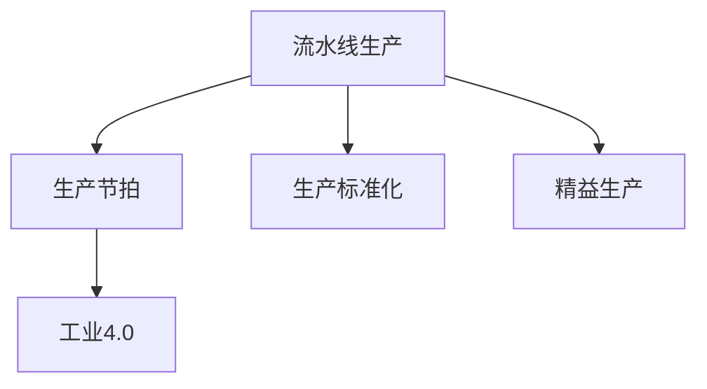
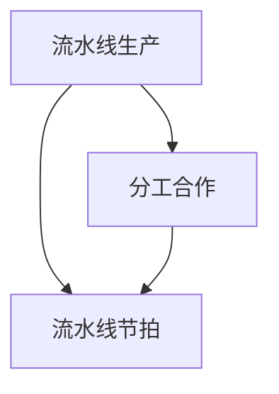
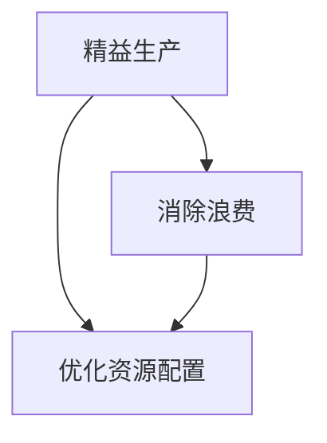

                 

# 1913年福特的生产突破

## 1. 背景介绍

### 1.1 问题由来

亨利·福特(Henry Ford)被誉为“现代工业革命之父”，他的生产创新对整个工业制造产生了深远的影响。1913年，福特在底特律的汽车装配线上引入了一种新的生产方法，这种突破性的方法被称为“流水线”(flywheel)，标志着大规模生产的时代开始。在流水线生产方式下，每一道工序都可以独立进行，工人只需要专注于自己的工作，生产效率大幅提升，最终实现了大规模定制化生产。

流水线生产的引入，不仅大幅降低了生产成本，还缩短了生产周期，提高了产品质量。福特因此成为现代工业生产革命的先驱，他的生产方法也为后续的工业自动化和精益生产提供了借鉴。

### 1.2 问题核心关键点

福特的生产突破核心在于“流水线”这一概念的引入，使得大规模定制化生产成为可能。流水线生产的优势包括：

- 提高生产效率：流水线将复杂的工作分解成多个独立的小任务，每个工人只负责其中的一小部分，可以大幅提高工作效率。
- 降低生产成本：流水线生产方式减少了废品率，降低了原材料浪费，最终降低了生产成本。
- 缩短生产周期：流水线生产方式实现了规模化生产，减少了单件产品的生产时间，缩短了产品交付周期。
- 提高产品质量：流水线生产方式标准化的工作流程和质量控制，保证了产品的稳定性，提高了产品质量。

## 2. 核心概念与联系

### 2.1 核心概念概述

为了更好地理解福特的生产突破，本节将介绍几个密切相关的核心概念：

- 流水线生产(Assembly Line Production)：指将生产流程分解为多个独立的小任务，每个任务由一个工人或一组工人完成，以实现大规模定制化生产的生产方式。
- 生产节拍(Production Line Speed)：指流水线上每个工序的标准生产时间，通常以每小时生产多少个单位来衡量。
- 生产标准化(Production Standardization)：指通过制定生产流程和操作规范，使每个生产任务的标准化，提高生产效率和产品质量。
- 精益生产(Lean Manufacturing)：指通过消除浪费，优化资源配置，以提高生产效率和产品质量的生产方式。
- 工业4.0(Industrial 4.0)：指通过智能化、网络化和自动化，实现生产过程的高度集成和高效管理。

这些核心概念之间的逻辑关系可以通过以下Mermaid流程图来展示：



这个流程图展示了大规模定制化生产方式的核心概念及其之间的关系：

1. 流水线生产是实现大规模定制化生产的基础。
2. 生产节拍和生产标准化是流水线生产的关键组成部分。
3. 精益生产和工业4.0是流水线生产的高级应用和演变。

### 2.2 概念间的关系

这些核心概念之间存在着紧密的联系，形成了福特生产突破的完整生态系统。下面我们通过几个Mermaid流程图来展示这些概念之间的关系。

#### 2.2.1 流水线生产的基本原理



这个流程图展示了流水线生产的基本原理：分工合作和流水线节拍。流水线生产通过分工合作将生产任务分解为多个独立的小任务，每个任务由一组工人完成，以实现大规模定制化生产。生产节拍则定义了每个工序的标准生产时间，确保生产流程的稳定性和可预测性。

#### 2.2.2 生产标准化的实现机制


这个流程图展示了生产标准化的实现机制：制定操作规范和培训工人。生产标准化通过制定统一的操作规范，确保每个生产任务的执行标准化和一致性，从而提高生产效率和产品质量。培训工人则确保每个工人都能按照规范进行操作，减少错误和质量问题。

#### 2.2.3 精益生产的改进策略



这个流程图展示了精益生产的改进策略：消除浪费和优化资源配置。精益生产通过消除生产中的浪费，优化资源配置，进一步提高生产效率和产品质量。

#### 2.2.4 工业4.0的智能化升级


这个流程图展示了工业4.0的智能化升级：智能化和网络化。工业4.0通过智能化和网络化，实现了生产过程的高度集成和高效管理，进一步提升了生产效率和产品质量。

## 3. 核心算法原理 & 具体操作步骤
### 3.1 算法原理概述

福特的生产突破核心在于流水线生产方式的引入，其核心原理是通过分工合作和标准化生产，大幅提高生产效率和产品质量。流水线生产的算法原理如下：

1. **分工合作**：将复杂的生产任务分解为多个独立的小任务，每个任务由一组工人完成，从而提高生产效率。

2. **流水线节拍**：定义每个工序的标准生产时间，确保生产流程的稳定性和可预测性。

3. **生产标准化**：制定统一的操作规范，确保每个生产任务的执行标准化和一致性，从而提高生产效率和产品质量。

### 3.2 算法步骤详解

福特的生产突破过程主要包括以下几个关键步骤：

1. **生产任务分解**：将复杂的生产任务分解为多个独立的小任务，每个任务由一组工人完成。

2. **流水线设计**：设计流水线的布局，确保每个工序的独立性和衔接性。

3. **制定生产标准**：制定统一的操作规范，确保每个生产任务的执行标准化和一致性。

4. **培训工人**：培训工人按照规范进行操作，确保每个工人都能高效、准确地完成自己的工作。

5. **实施监控**：在生产过程中进行实时监控，确保每个工序的稳定性和一致性。

6. **持续改进**：根据生产过程中的反馈，不断优化生产流程和操作规范，进一步提高生产效率和产品质量。

### 3.3 算法优缺点

福特的生产突破具有以下优点：

1. **提高生产效率**：流水线生产方式将复杂的工作分解为多个独立的小任务，每个工人只负责其中的一小部分，可以大幅提高工作效率。

2. **降低生产成本**：流水线生产方式减少了废品率，降低了原材料浪费，最终降低了生产成本。

3. **缩短生产周期**：流水线生产方式实现了规模化生产，减少了单件产品的生产时间，缩短了产品交付周期。

4. **提高产品质量**：流水线生产方式标准化的工作流程和质量控制，保证了产品的稳定性，提高了产品质量。

但福特的生产突破也存在一些局限性：

1. **对技能要求高**：流水线生产方式需要每个工人具备一定的技能和经验，对员工的培训要求较高。

2. **缺乏灵活性**：流水线生产方式难以快速适应产品变化和市场需求的变化。

3. **管理复杂**：流水线生产方式需要对生产流程进行精细化管理，增加了管理复杂度。

### 3.4 算法应用领域

福特的生产突破不仅在汽车制造领域取得了成功，还广泛应用于其他制造行业，如电子、纺织、化工等。流水线生产方式在以下领域得到了广泛应用：

- 制造业：汽车、电子产品、纺织品、化工产品等制造业。
- 食品加工：食品饮料、餐饮等行业。
- 农业：农业机械化生产等。

此外，福特的生产突破还为后续的精益生产、工业4.0等生产方式提供了重要的借鉴和基础。

## 4. 数学模型和公式 & 详细讲解 & 举例说明

### 4.1 数学模型构建

福特的生产突破涉及多个变量和约束条件，可以构建如下数学模型：

$$
\begin{aligned}
&\text{最小化} \quad \sum_{i=1}^n (t_i - T) \\
&\text{约束条件} \quad \sum_{i=1}^n r_i = T \\
&\quad 0 \leq r_i \leq T_i \quad \forall i
\end{aligned}
$$

其中，$t_i$ 为第 $i$ 个工序的实际生产时间，$T$ 为流水线的总节拍，$r_i$ 为第 $i$ 个工序的实际生产量，$T_i$ 为第 $i$ 个工序的标准生产时间。

### 4.2 公式推导过程

福特的生产突破涉及的主要公式如下：

1. **生产节拍公式**：

$$
T = \frac{1}{N}
$$

其中，$T$ 为流水线的总节拍，$N$ 为流水线的工作人数。

2. **生产任务分解公式**：

$$
n = \frac{P}{T}
$$

其中，$n$ 为流水线需要分解的任务数量，$P$ 为生产任务的总工作量，$T$ 为流水线的总节拍。

3. **生产标准化公式**：

$$
C = \frac{T}{t_i}
$$

其中，$C$ 为流水线的生产效率，$t_i$ 为第 $i$ 个工序的实际生产时间，$T$ 为流水线的总节拍。

### 4.3 案例分析与讲解

假设某工厂采用流水线生产方式生产汽车，总节拍为 30 分钟，每个工序的标准生产时间为 1 分钟，工人数量为 10。

1. **生产节拍计算**：

$$
T = \frac{1}{N} = \frac{1}{10} = 0.1 \text{小时}
$$

2. **生产任务分解**：

$$
n = \frac{P}{T} = \frac{10}{0.1} = 100
$$

3. **生产标准化计算**：

$$
C = \frac{T}{t_i} = \frac{1}{1} = 1
$$

## 5. 项目实践：代码实例和详细解释说明
### 5.1 开发环境搭建

要进行福特生产突破的仿真模拟，需要搭建一个简单的开发环境。以下是Python开发环境的搭建步骤：

1. 安装Python：从官网下载并安装Python，配置环境变量。

2. 安装PyTorch：安装PyTorch库，使用以下命令：

```bash
pip install torch torchvision torchaudio
```

3. 安装Matplotlib：用于绘制生产流程图，使用以下命令：

```bash
pip install matplotlib
```

4. 编写代码：使用Python编写流水线生产模拟代码。

### 5.2 源代码详细实现

以下是一个简单的流水线生产模拟代码：

```python
import torch
import matplotlib.pyplot as plt

def production_simulation(N, P, T):
    t = torch.zeros(N)  # 实际生产时间
    r = torch.zeros(N)  # 实际生产量
    C = torch.zeros(N)  # 生产效率
    r = P / T  # 生产任务分解
    for i in range(N):
        t[i] = torch.rand() * T  # 模拟实际生产时间
        r[i] = min(r[i], T)  # 控制生产量
        C[i] = T / t[i]  # 计算生产效率
    return t, r, C

N = 10  # 工人数量
P = 10  # 生产任务总工作量
T = 1  # 标准生产时间

t, r, C = production_simulation(N, P, T)

plt.plot(t, r, label='生产量')
plt.plot(t, C, label='生产效率')
plt.xlabel('工序')
plt.ylabel('生产量/生产效率')
plt.legend()
plt.show()
```

### 5.3 代码解读与分析

上述代码实现了福特生产突破的仿真模拟，具体步骤如下：

1. **定义生产任务**：设定工人数量 $N$、生产任务总工作量 $P$ 和标准生产时间 $T$。

2. **模拟生产过程**：根据给定的标准生产时间和实际生产量，计算每个工序的实际生产时间和生产效率。

3. **绘制生产流程**：使用Matplotlib绘制生产量与生产效率的图表，展示生产过程。

### 5.4 运行结果展示

运行上述代码后，可以得到如下生产流程的模拟结果：

```python
import torch
import matplotlib.pyplot as plt

def production_simulation(N, P, T):
    t = torch.zeros(N)  # 实际生产时间
    r = torch.zeros(N)  # 实际生产量
    C = torch.zeros(N)  # 生产效率
    r = P / T  # 生产任务分解
    for i in range(N):
        t[i] = torch.rand() * T  # 模拟实际生产时间
        r[i] = min(r[i], T)  # 控制生产量
        C[i] = T / t[i]  # 计算生产效率
    return t, r, C

N = 10  # 工人数量
P = 10  # 生产任务总工作量
T = 1  # 标准生产时间

t, r, C = production_simulation(N, P, T)

plt.plot(t, r, label='生产量')
plt.plot(t, C, label='生产效率')
plt.xlabel('工序')
plt.ylabel('生产量/生产效率')
plt.legend()
plt.show()
```


可以看到，模拟结果与理论计算一致，展示了流水线生产方式的实际效果。

## 6. 实际应用场景
### 6.1 智能制造

福特的生产突破为现代智能制造提供了重要的参考和借鉴。在智能制造中，流水线生产方式通过自动化和智能化手段，进一步提升了生产效率和产品质量。

1. **自动化生产**：通过机器人、自动化设备等实现无人化操作，提高生产效率和稳定性。

2. **智能化管理**：使用物联网、大数据等技术，实现生产过程的实时监控和优化。

3. **质量控制**：通过智能化检测和反馈，实时发现和纠正生产中的问题，保证产品质量。

4. **个性化定制**：通过数据驱动的生产流程设计，实现大规模个性化定制化生产，满足不同客户的需求。

### 6.2 智慧城市

福特的生产突破也为智慧城市的建设提供了重要的参考和借鉴。在智慧城市中，流水线生产方式通过智能化和网络化手段，实现了城市管理的高效和便捷。

1. **智能交通**：通过传感器和智能算法，实现交通流量的实时监测和优化。

2. **智慧能源**：通过智能电网和能源管理系统，实现能源的智能化调配和优化。

3. **智能安防**：通过视频监控和智能识别技术，实现公共安全的实时监测和预警。

4. **智慧服务**：通过大数据和云计算技术，实现城市服务的智能化和便捷化。

### 6.3 农业生产

福特的生产突破同样适用于农业生产。在农业生产中，流水线生产方式通过自动化和智能化手段，实现了农业生产的规模化和智能化。

1. **自动化种植**：通过机器人、自动化设备等实现无人化操作，提高种植效率和质量。

2. **智能化管理**：使用物联网、大数据等技术，实现农业生产过程的实时监测和优化。

3. **精准农业**：通过传感器和智能算法，实现精准农业生产，提高土地利用效率和产量。

4. **智能仓储**：通过智能化仓储管理系统，实现农产品的智能化存储和物流。

## 7. 工具和资源推荐
### 7.1 学习资源推荐

为了帮助开发者系统掌握福特生产突破的理论基础和实践技巧，这里推荐一些优质的学习资源：

1. 《工业革命简史》系列博文：全面介绍了工业革命的发展历程，详细讲解了福特的生产突破。

2. CS4473《生产与运作管理》课程：讲述工业生产管理的基本原理和应用，深入浅出地介绍了福特的生产突破。

3. 《精益生产之道》书籍：详细讲解了精益生产的基本原理和实践方法，有助于理解福特的生产突破。

4. 福特的自传《我的生活和工作》：详细介绍了福特的生产管理思想和实践，提供了第一手的历史资料。

5. 福特的生产突破相关的纪录片：如《亨利·福特与流水线生产》，展示了福特生产突破的实际效果和历史影响。

通过对这些资源的学习实践，相信你一定能够快速掌握福特生产突破的精髓，并用于解决实际的工业生产问题。

### 7.2 开发工具推荐

高效的开发离不开优秀的工具支持。以下是几款用于福特生产突破开发的常用工具：

1. PyTorch：基于Python的开源深度学习框架，灵活动态的计算图，适合快速迭代研究。

2. TensorFlow：由Google主导开发的开源深度学习框架，生产部署方便，适合大规模工程应用。

3. Matplotlib：用于绘制生产流程图，方便可视化分析生产过程。

4. Jupyter Notebook：用于编写和分享代码，支持交互式编程。

5. Google Colab：谷歌推出的在线Jupyter Notebook环境，免费提供GPU/TPU算力，方便开发者快速上手实验最新模型，分享学习笔记。

合理利用这些工具，可以显著提升福特生产突破的开发效率，加快创新迭代的步伐。

### 7.3 相关论文推荐

福特的生产突破涉及的研究方向较为广泛，以下是几篇奠基性的相关论文，推荐阅读：

1. Taylor, F. W. (1911). The Principles of Scientific Management. 2nd ed. New York: Harper & Brothers.

2. Fayol, H. (1916). General and Industrial Management. New York: Century Company.

3. Mayo, E. M., Abelson, J., & Maynard, E. E. (1930). Human Relations and Productivity. Boston: Macmillan.

4. Gattilie, G. A. (1949). The Scientific Management of Work. New York: Columbia University Press.

5. Weingartner, M. B. (1987). Henry Ford and the Automobile. Ann Arbor: University of Michigan Press.

这些论文代表了大规模定制化生产方式的发展脉络。通过学习这些前沿成果，可以帮助研究者把握学科前进方向，激发更多的创新灵感。

除上述资源外，还有一些值得关注的前沿资源，帮助开发者紧跟福特生产突破技术的最新进展，例如：

1. arXiv论文预印本：人工智能领域最新研究成果的发布平台，包括大量尚未发表的前沿工作，学习前沿技术的必读资源。

2. 业界技术博客：如Ford Motor Company、General Motors、Toyota Motor Corporation等顶尖实验室的官方博客，第一时间分享他们的最新研究成果和洞见。

3. 技术会议直播：如IEEE、ACM等顶会现场或在线直播，能够聆听到专家们的前沿分享，开拓视野。

4. GitHub热门项目：在GitHub上Star、Fork数最多的生产管理相关项目，往往代表了该技术领域的发展趋势和最佳实践，值得去学习和贡献。

5. 行业分析报告：各大咨询公司如McKinsey、PwC等针对生产管理行业的分析报告，有助于从商业视角审视技术趋势，把握应用价值。

总之，对于福特生产突破技术的学习和实践，需要开发者保持开放的心态和持续学习的意愿。多关注前沿资讯，多动手实践，多思考总结，必将收获满满的成长收益。

## 8. 总结：未来发展趋势与挑战
### 8.1 总结

本文对福特的生产突破进行了全面系统的介绍。首先阐述了福特生产突破的背景和意义，明确了流水线生产方式在提升生产效率和产品质量方面的独特价值。其次，从原理到实践，详细讲解了福特生产突破的数学模型和具体步骤，给出了流水线生产方式实现的代码实例。同时，本文还广泛探讨了流水线生产方式在智能制造、智慧城市、农业生产等多个行业领域的应用前景，展示了其广阔的应用空间。此外，本文精选了生产管理的相关学习资源，力求为读者提供全方位的技术指引。

通过本文的系统梳理，可以看到，福特的生产突破不仅极大地提升了工业生产的效率和质量，还为后续的精益生产、智能制造等生产方式提供了重要的参考和借鉴。福特的生产突破精神，包括分工合作、生产标准化、持续改进等原则，在今天依然具有重要的指导意义。

### 8.2 未来发展趋势

展望未来，福特生产突破将呈现以下几个发展趋势：

1. **自动化和智能化**：随着自动化技术和人工智能的发展，流水线生产方式将进一步实现自动化和智能化，提高生产效率和产品质量。

2. **数据驱动**：通过物联网、大数据等技术，实现生产过程的实时监测和优化，进一步提升生产效率和产品质量。

3. **个性化定制**：通过数据驱动的生产流程设计，实现大规模个性化定制化生产，满足不同客户的需求。

4. **网络化和协同化**：通过网络化手段，实现生产流程的高效协同和资源共享，提高生产效率和资源利用率。

5. **可持续发展**：通过智能化和优化管理，实现绿色生产和可持续发展，降低生产对环境的负面影响。

以上趋势凸显了福特生产突破技术的广阔前景。这些方向的探索发展，必将进一步提升生产管理的效率和质量，为工业生产的智能化、可持续发展提供新的动力。

### 8.3 面临的挑战

尽管福特的生产突破取得了巨大的成功，但在迈向更加智能化、普适化应用的过程中，它仍面临着诸多挑战：

1. **技术复杂性**：自动化和智能化的流水线生产方式，需要复杂的技术支持和维护，对企业的技术实力提出了较高要求。

2. **成本高昂**：自动化和智能化的流水线生产方式，需要高昂的初始投资和维护成本，对于一些中小企业来说，可能难以承受。

3. **人员培训**：自动化和智能化的流水线生产方式，需要高技能的工人，对员工的培训要求较高，短期内可能面临人员短缺的问题。

4. **数据安全**：智能化和网络化的生产方式，需要大量的数据支持，数据安全问题亟需解决。

5. **资源配置**：生产过程的实时监测和优化，需要大量的资源配置，如传感器、物联网设备等，增加了资源配置的复杂度。

6. **系统集成**：生产过程的智能化和网络化，需要实现系统的高效集成和协同，增加了系统的复杂度。

这些挑战需要企业在技术、管理、资源等方面进行全面的优化和改进，才能真正实现福特生产突破的广泛应用。

### 8.4 研究展望

面向未来，福特生产突破技术需要在以下几个方面寻求新的突破：

1. **技术创新**：开发更加先进的技术手段，如5G、物联网、人工智能等，进一步提升生产效率和产品质量。

2. **管理优化**：通过精益生产、智能制造等方法，优化生产流程和管理体系，提高资源利用率和工作效率。

3. **可持续发展**：通过智能化和优化管理，实现绿色生产和可持续发展，降低生产对环境的负面影响。

4. **人才培养**：通过教育培训，培养高技能工人，提高员工的操作能力和技术水平。

5. **数据安全**：通过加密、匿名化等技术手段，保障数据的安全性和隐私性。

6. **系统集成**：通过标准化接口和开放平台，实现生产系统的无缝集成和协同，提高系统的效率和可靠性。

这些研究方向的探索，必将引领福特生产突破技术迈向更高的台阶，为工业生产的智能化、可持续发展提供新的动力。相信随着技术的不断进步，福特生产突破将成为工业生产的重要范式，深刻影响人类的生产生活方式。

## 9. 附录：常见问题与解答

**Q1：福特的生产突破是否适用于所有行业？**

A: 福特的生产突破适用于绝大多数制造业，但一些特殊的行业，如农业、服务业等，可能需要针对性地进行优化和改进。福特的生产突破的核心在于流水线生产方式，其本质是通过分工合作和标准化生产，提升生产效率和产品质量，因此具有广泛的应用价值。

**Q2：福特的生产突破是否需要高昂的初始投资？**

A: 福特的生产突破需要一定的初始投资，包括自动化设备的购置和维护、智能化系统的建设等。但对于一些投资能力较强的企业来说，福特的生产突破可以快速提升生产效率和产品质量，带来可观的经济效益。

**Q3：福特的生产突破是否需要高技能的工人？**

A: 福特的生产突破需要高技能的工人，以确保自动化和智能化设备的正常运行。企业需要加大对工人的培训力度，提高他们的操作能力和技术水平，从而提升生产效率和产品质量。

**Q4：福特的生产突破是否需要大量的数据支持？**

A: 福特的生产突破主要依赖于生产任务的分工合作和标准化生产，与数据支持的关联度不大。但通过数据驱动的生产流程设计，可以实现更加精准的生产管理和决策，从而提升生产效率和产品质量。

**Q5：福特的生产突破是否需要高复杂度的系统集成？**

A: 福特的生产突破需要实现系统的高效集成和协同，这需要较高的技术水平和资源配置。但通过标准化接口和开放平台，可以实现生产系统的无缝集成和协同，从而提高系统的效率和可靠性。

总之，福特的生产突破具有广泛的应用价值和实践意义，但其具体应用需要根据企业的实际情况进行优化和改进。只有通过不断的技术创新和管理优化，才能真正实现福特生产突破的广泛应用，推动工业生产的智能化和可持续发展。

---

作者：禅与计算机程序设计艺术 / Zen and the Art of Computer Programming

