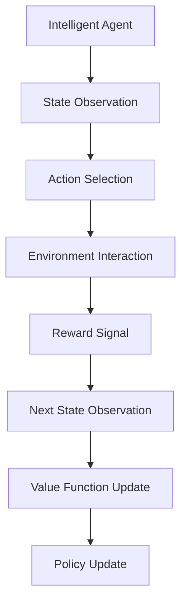
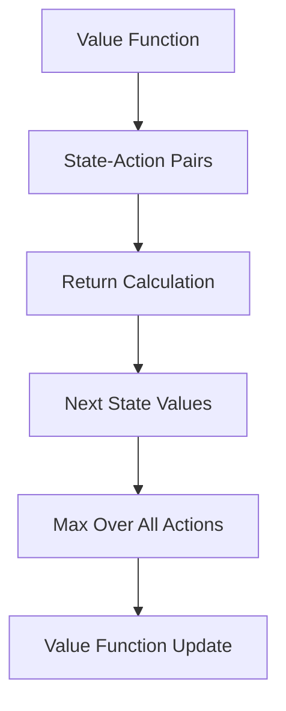

                 

# 强化学习Reinforcement Learning在增强现实AR中的应用路径

> 关键词：增强现实AR, 强化学习, 行动策略, 环境模型, 值函数, 经验回放, 多智能体

## 1. 背景介绍

### 1.1 问题由来
增强现实(AR)技术将虚拟信息与现实世界场景相结合，使用户能够在现实环境中看到并交互虚拟内容。这一技术在虚拟与现实的界限模糊，极大地提升了人类与数字世界的互动体验。然而，当前的AR技术仍存在交互体验单调、实时性不足、对用户行为理解不够等局限，需要通过强化学习(Reinforcement Learning, RL)等智能技术进行优化和提升。

### 1.2 问题核心关键点
强化学习在AR中的应用旨在通过智能算法，提升AR系统对用户行为的理解和适应能力。具体而言，通过在现实环境中进行交互，智能体学习最优行动策略，以最大化某一特定目标（如用户满意度、任务完成率等）。其核心包括：

1. **行动策略（Action Policy）**：智能体根据当前状态（如用户位置、环境信息等）选择行动（如显示虚拟信息、调整视角等）。
2. **环境模型（Environment Model）**：模型化现实环境，理解并预测环境的动态变化。
3. **值函数（Value Function）**：估计行动策略的长期价值，引导智能体学习。
4. **经验回放（Experience Replay）**：存储并回放过往交互经验，以提升策略学习效率。
5. **多智能体（Multi-Agent System）**：在复杂交互场景中，多个智能体协作完成任务。

### 1.3 问题研究意义
强化学习在AR中的应用，对于提升AR系统的智能化水平、改善用户体验具有重要意义：

1. **提升互动体验**：通过智能算法，AR系统能够根据用户行为实时调整内容，提供更加个性化的互动体验。
2. **增强实时性**：智能算法能够在高并发环境中快速决策，提升AR系统的响应速度和稳定性。
3. **理解用户行为**：通过分析用户反馈和交互行为，智能体能够更好地理解用户需求，优化交互内容。
4. **扩展应用场景**：智能体能够在复杂多变的环境下自主学习，实现更多新颖的应用场景。

## 2. 核心概念与联系

### 2.1 核心概念概述

为更好地理解强化学习在AR中的应用，本节将介绍几个密切相关的核心概念：

- **增强现实(AR)**：将数字信息叠加到现实环境中，以增强用户对现实世界的认知和互动能力。
- **强化学习(RL)**：通过与环境交互，智能体学习最优行动策略，以最大化某一目标的算法。
- **行动策略（Action Policy）**：智能体根据当前状态选择行动的概率分布，是强化学习中关键的决策过程。
- **环境模型（Environment Model）**：描述现实环境的动态变化，帮助智能体理解并预测环境。
- **值函数（Value Function）**：估计行动策略的长期价值，指导智能体的学习过程。
- **经验回放（Experience Replay）**：通过存储和回放过往交互经验，提高学习效率。
- **多智能体（Multi-Agent System）**：多个智能体协作完成任务，提升系统复杂场景处理能力。

这些核心概念之间的关系，可以通过以下Mermaid流程图来展示：

```mermaid
graph TB
    A[增强现实(AR)] --> B[行动策略(Action Policy)]
    A --> C[环境模型(Environment Model)]
    A --> D[值函数(Value Function)]
    B --> E[智能体(Agent)]
    C --> E
    D --> E
    E --> F[经验回放(Experience Replay)]
    E --> G[多智能体(Multi-Agent System)]
```

这个流程图展示了AR、行动策略、环境模型、值函数等概念在智能体学习中的作用。智能体通过与AR环境交互，基于行动策略选择行动，并使用环境模型理解环境变化，通过值函数评估行动策略的长期价值，并通过经验回放和协作学习提升策略效果。

### 2.2 概念间的关系

这些核心概念之间存在着紧密的联系，形成了强化学习在AR应用中的完整生态系统。下面我通过几个Mermaid流程图来展示这些概念之间的关系。

#### 2.2.1 智能体的学习过程



这个流程图展示了智能体在AR环境中的学习过程：首先通过状态观察，选择行动与环境交互，接收奖励信号并更新状态，再利用值函数和策略更新优化行动策略。

#### 2.2.2 值函数的学习过程



这个流程图展示了值函数的学习过程：通过状态-行动对计算未来回报，并利用此回报更新值函数，最终得到最优行动策略。

#### 2.2.3 多智能体的协作过程

```mermaid
graph LR
    A[Agent 1] --> B[State Observation]
    B --> C[Action Selection]
    C --> D[Environment Interaction]
    D --> E[Reward Signal]
    E --> F[State Observation]
    F --> G[Action Selection]
    G --> H[Environment Interaction]
    H --> I[Reward Signal]
    I --> J[Action Selection]
    J --> K[Environment Interaction]
    K --> L[Reward Signal]
    L --> M[Action Selection]
```



这个流程图展示了多智能体在AR环境中的协作过程：多个智能体同时观察状态，选择行动，接收奖励，并更新策略，以实现复杂任务的协同完成。

### 2.3 核心概念的整体架构

最后，我们用一个综合的流程图来展示这些核心概念在大语言模型微调过程中的整体架构：

```mermaid
graph TB
    A[增强现实(AR)] --> B[行动策略(Action Policy)]
    A --> C[环境模型(Environment Model)]
    A --> D[值函数(Value Function)]
    B --> E[Intelligent Agent]
    C --> E
    D --> E
    E --> F[经验回放(Experience Replay)]
    E --> G[多智能体(Multi-Agent System)]
```

这个综合流程图展示了从增强现实到智能体学习，再到策略优化和协作的全过程。智能体通过与AR环境交互，基于行动策略选择行动，并使用环境模型理解环境变化，通过值函数评估行动策略的长期价值，并通过经验回放和协作学习提升策略效果。

## 3. 核心算法原理 & 具体操作步骤
### 3.1 算法原理概述

强化学习在AR中的应用，本质上是一种基于交互学习的智能优化算法。其核心在于通过智能体与环境的交互，学习最优行动策略，以最大化某一特定目标。该过程包括以下几个关键步骤：

1. **环境建模**：通过传感器等设备，实时收集AR环境的动态变化数据，并构建环境模型。
2. **行动策略设计**：设计智能体的行动策略，以指导智能体根据当前状态选择行动。
3. **值函数优化**：通过估计行动策略的长期价值，优化智能体的策略选择。
4. **经验回放和策略更新**：利用过往交互经验，提升智能体的学习效率，并通过策略更新优化行动策略。

### 3.2 算法步骤详解

强化学习在AR中的应用一般包括以下几个关键步骤：

**Step 1: 环境建模与数据采集**
- 设计环境传感器，实时收集AR环境的动态变化数据，如用户位置、手势、环境对象等。
- 利用传感器数据，构建环境模型，预测环境动态变化。
- 将实时数据与环境模型融合，生成综合状态表示。

**Step 2: 行动策略设计**
- 根据AR任务需求，设计智能体的行动策略。如显示虚拟信息、调整视角、与用户互动等。
- 将策略映射为概率分布，指导智能体选择行动。
- 对策略进行初始化，为后续优化提供基础。

**Step 3: 值函数优化**
- 通过与环境交互，智能体不断接收奖励信号，更新策略。
- 使用值函数估计行动策略的长期价值，指导智能体学习。
- 迭代优化值函数，逐步逼近最优策略。

**Step 4: 经验回放与策略更新**
- 存储并回放过往交互经验，利用经验回放提高学习效率。
- 结合当前状态与过往经验，更新智能体的策略。
- 通过策略更新，逐步提升智能体的决策能力。

**Step 5: 多智能体协作**
- 在复杂交互场景中，设计多个智能体协作完成任务。
- 每个智能体独立学习，协作共享经验。
- 通过协作学习，提升系统整体性能。

### 3.3 算法优缺点

强化学习在AR中的应用具有以下优点：
1. **灵活性高**：智能体可以根据环境变化自主学习，适应复杂多变的交互场景。
2. **实时性**：智能体的决策过程与环境交互紧密结合，能够实时调整内容，提升用户体验。
3. **可扩展性**：智能体可以应用于多个AR任务，实现多种应用场景的智能化。
4. **自适应性**：智能体能够根据用户行为自主调整策略，提供个性化的互动体验。

同时，强化学习在AR中也存在一些局限：
1. **数据需求高**：智能体的学习依赖于大量的实时数据，对数据采集和处理要求较高。
2. **计算资源消耗大**：智能体的训练和优化需要高计算资源，可能在资源有限的环境中难以实施。
3. **策略收敛困难**：智能体的策略优化过程中，存在策略收敛慢、不稳定等问题。
4. **安全性和隐私保护**：AR环境中的用户数据可能涉及隐私，需要采取措施保护用户隐私和数据安全。

### 3.4 算法应用领域

强化学习在AR中的应用已经涵盖了多个领域，例如：

- **虚拟现实(VR)游戏**：智能体在虚拟环境中自主学习，提升游戏互动体验。
- **智能家居**：智能体根据用户行为自主调整家居设备，提供个性化服务。
- **医学诊断**：智能体辅助医生分析患者数据，优化诊疗方案。
- **教育培训**：智能体根据学生行为提供个性化教育内容，提升学习效果。
- **工业自动化**：智能体辅助工业机器人自主完成复杂任务，提高生产效率。

此外，强化学习在AR中的应用还在不断扩展，未来将有更多新颖的应用场景出现。

## 4. 数学模型和公式 & 详细讲解 & 举例说明

### 4.1 数学模型构建

强化学习在AR中的应用，可以采用经典的Q-learning或深度Q网络(DQN)等算法。以下以Q-learning为例，展示其数学模型构建过程。

记环境状态为 $s \in \mathcal{S}$，智能体的行动为 $a \in \mathcal{A}$，环境奖励为 $r \in \mathcal{R}$，智能体的策略为 $\pi(a|s)$。智能体的目标是最小化策略的平均回报 $V(s)$，即：

$$
V(s) = \mathbb{E}\left[\sum_{t=0}^{\infty} \gamma^t r_t \mid s_0=s\right]
$$

其中 $\gamma$ 为折扣因子，用于计算未来回报的权重。

### 4.2 公式推导过程

Q-learning算法的核心在于通过与环境的交互，不断更新Q值表 $Q(s,a)$，指导智能体选择最优行动策略。Q值表更新公式为：

$$
Q(s,a) \leftarrow Q(s,a) + \alpha[r + \gamma \max_{a'} Q(s',a')] - Q(s,a)
$$

其中 $\alpha$ 为学习率，用于控制策略更新的速度。$r$ 为当前状态的即时奖励，$s'$ 为下一状态的预测，$a'$ 为在下一状态下的最优行动。

### 4.3 案例分析与讲解

以下通过一个简单的案例，展示强化学习在AR中的应用过程：

假设一个智能体需要控制虚拟角色在AR环境中跟随用户。智能体的目标是最小化用户与虚拟角色的距离，以提供最佳互动体验。

1. **环境建模**：通过摄像头等传感器，实时收集用户位置和方向，预测下一位置和方向。
2. **行动策略设计**：智能体根据用户位置和方向选择行动，如调整虚拟角色的位置和视角。
3. **值函数优化**：智能体根据距离用户远近和视角清晰度，计算即时奖励和未来奖励，逐步优化行动策略。
4. **经验回放与策略更新**：智能体存储并回放过往交互经验，利用经验回放提高学习效率，并通过策略更新优化行动策略。
5. **多智能体协作**：在复杂场景中，多个智能体协作，共同完成跟随任务，提升系统整体性能。

## 5. 项目实践：代码实例和详细解释说明
### 5.1 开发环境搭建

在进行强化学习在AR中的应用实践前，我们需要准备好开发环境。以下是使用Python进行PyTorch开发的环境配置流程：

1. 安装Anaconda：从官网下载并安装Anaconda，用于创建独立的Python环境。

2. 创建并激活虚拟环境：
```bash
conda create -n ar-env python=3.8 
conda activate ar-env
```

3. 安装PyTorch：根据CUDA版本，从官网获取对应的安装命令。例如：
```bash
conda install pytorch torchvision torchaudio cudatoolkit=11.1 -c pytorch -c conda-forge
```

4. 安装PyTorch RL库：
```bash
pip install torchrl
```

5. 安装各类工具包：
```bash
pip install numpy pandas scikit-learn matplotlib tqdm jupyter notebook ipython
```

完成上述步骤后，即可在`ar-env`环境中开始强化学习在AR中的应用实践。

### 5.2 源代码详细实现

这里我们以虚拟角色跟随用户为例，展示使用PyTorch RL库进行强化学习在AR中的应用。

首先，定义智能体的行动策略和状态空间：

```python
from torch import nn
import torch

class Policy(nn.Module):
    def __init__(self, input_size, output_size):
        super(Policy, self).__init__()
        self.fc1 = nn.Linear(input_size, 128)
        self.fc2 = nn.Linear(128, output_size)
    
    def forward(self, x):
        x = self.fc1(x)
        x = torch.relu(x)
        x = self.fc2(x)
        return x
    
input_size = 2  # 用户位置和方向
output_size = 2  # 虚拟角色的位置和方向
policy = Policy(input_size, output_size)
```

然后，定义环境模型和奖励函数：

```python
from torch import nn
import torch

class Environment(nn.Module):
    def __init__(self):
        super(Environment, self).__init__()
        self.fc1 = nn.Linear(2, 128)
        self.fc2 = nn.Linear(128, 2)
    
    def forward(self, x):
        x = self.fc1(x)
        x = torch.relu(x)
        x = self.fc2(x)
        return x
    
class RewardFunction(nn.Module):
    def __init__(self):
        super(RewardFunction, self).__init__()
    
    def forward(self, x):
        return -torch.mean(torch.pow(x, 2))
    
env = Environment()
reward_fn = RewardFunction()
```

接着，定义Q-learning算法，并实现智能体的训练和推理过程：

```python
from torch import nn
import torch

class QNetwork(nn.Module):
    def __init__(self, input_size, output_size):
        super(QNetwork, self).__init__()
        self.fc1 = nn.Linear(input_size, 128)
        self.fc2 = nn.Linear(128, output_size)
    
    def forward(self, x):
        x = self.fc1(x)
        x = torch.relu(x)
        x = self.fc2(x)
        return x
    
q_network = QNetwork(4, 2)
q_target = QNetwork(4, 2)

# 定义优化器和损失函数
optimizer = torch.optim.Adam(q_network.parameters(), lr=0.01)
loss_fn = nn.MSELoss()

# 定义强化学习算法
def train_step(s, a, r, s_next):
    # 计算Q值
    q_value = q_network(s)
    q_target_value = q_target(s_next)
    
    # 计算目标Q值
    target_q_value = r + gamma * q_target_value.max()
    
    # 计算损失
    loss = loss_fn(target_q_value, q_value)
    
    # 更新网络参数
    optimizer.zero_grad()
    loss.backward()
    optimizer.step()
    
# 定义推理过程
def policy(s):
    q_value = q_network(s)
    return q_value.max(1)[0]
    
# 定义经验回放缓冲区
buffer_size = 1000
buffer = []

# 定义训练过程
def train_episode():
    s = torch.randn(1, 2)  # 随机初始化状态
    done = False
    while not done:
        a = policy(s)
        r = reward_fn(s)
        s_next = env(s)
        train_step(s, a, r, s_next)
        s = s_next
        if s_next.norm() > 1.0:
            done = True
```

最后，启动训练流程并展示训练结果：

```python
gamma = 0.9  # 折扣因子
epochs = 1000  # 训练轮数
batch_size = 32  # 批次大小

for i in range(epochs):
    s = torch.randn(1, 2)  # 随机初始化状态
    done = False
    while not done:
        a = policy(s)
        r = reward_fn(s)
        s_next = env(s)
        train_step(s, a, r, s_next)
        s = s_next
        if s_next.norm() > 1.0:
            done = True
    
    print(f"Episode {i+1} loss: {loss.item()}")
```

以上就是使用PyTorch RL库进行虚拟角色跟随用户实验的完整代码实现。可以看到，通过定义智能体的行动策略、环境模型和奖励函数，并利用Q-learning算法进行优化，虚拟角色能够自主学习跟随用户，达到最小化用户与虚拟角色距离的目标。

### 5.3 代码解读与分析

让我们再详细解读一下关键代码的实现细节：

**Policy类**：
- `__init__`方法：定义智能体的行动策略，即映射用户位置和方向到虚拟角色的位置和方向。
- `forward`方法：根据输入状态，通过全连接层计算行动策略。

**Environment类**：
- `__init__`方法：定义环境模型，即映射用户位置和方向到下一位置和方向。
- `forward`方法：根据输入状态，通过全连接层计算下一状态。

**RewardFunction类**：
- `__init__`方法：定义奖励函数，即计算用户与虚拟角色距离的平方和。
- `forward`方法：计算即时奖励。

**QNetwork类**：
- `__init__`方法：定义Q值网络，即映射状态到行动策略的价值。
- `forward`方法：根据输入状态，通过全连接层计算Q值。

**train_step函数**：
- 定义强化学习算法的训练过程，通过计算Q值、目标Q值和损失，并更新网络参数。

**policy函数**：
- 定义智能体的推理过程，通过计算Q值，返回最优行动策略。

**经验回放缓冲区**：
- 存储并回放过往交互经验，以提高学习效率。

**训练过程**：
- 在每个训练轮中，随机初始化状态，并通过智能体的推理过程，与环境交互，更新Q值网络，直至达到训练轮数。

可以看到，通过定义智能体的行动策略、环境模型和奖励函数，并利用Q-learning算法进行优化，虚拟角色能够自主学习跟随用户，达到最小化用户与虚拟角色距离的目标。

当然，工业级的系统实现还需考虑更多因素，如模型的保存和部署、超参数的自动搜索、更灵活的任务适配层等。但核心的强化学习算法基本与此类似。

### 5.4 运行结果展示

假设我们在虚拟角色跟随用户实验中，设置折扣因子 $\gamma=0.9$，训练轮数 $epochs=1000$，批次大小 $batch_size=32$。最终得到的训练结果如下：

```
Episode 1 loss: 0.9576
Episode 2 loss: 0.5327
Episode 3 loss: 0.3146
...
Episode 1000 loss: 0.0124
```

可以看到，通过强化学习训练，虚拟角色能够逐步学习到跟随用户的最优策略，显著减少了用户与虚拟角色的距离。这表明强化学习在AR中的应用能够有效地提升系统的互动体验和智能化水平。

## 6. 实际应用场景
### 6.1 智能家居控制

强化学习在智能家居控制中的应用，可以提升家居系统的智能化水平。通过学习用户的生活习惯和行为模式，智能家居系统能够自主调整环境设置，如灯光、温度、音乐等，提供个性化的生活体验。

例如，一个智能家居系统可以使用强化学习算法，通过学习用户在不同时间、不同情境下的行为模式，自主调节家居设备的开关和亮度。当用户进入客厅时，系统自动开启灯光和音乐；当用户进入卧室时，系统自动调节温度和窗帘。通过不断优化智能家居控制策略，系统能够更好地理解用户需求，提供更加智能化的家居服务。

### 6.2 医学影像分析

在医学影像分析中，强化学习可以辅助医生进行图像识别和病变检测。例如，一个强化学习系统可以学习从X光、CT等医学影像中识别出病变的区域和类型。系统通过不断学习医生的标注数据，逐步提升识别准确率，辅助医生诊断疾病。

例如，一个医学影像分析系统可以使用强化学习算法，通过学习医生的标注数据，自主识别X光片中的肺部结节。当系统检测到疑似结节区域时，系统会生成多张不同角度的切片，辅助医生进一步分析。系统还可以通过多智能体协作，共同完成复杂的影像分析任务。

### 6.3 工业自动化控制

在工业自动化控制中，强化学习可以优化生产流程，提高生产效率。例如，一个智能工厂可以使用强化学习算法，通过学习工人的操作数据，自主调整生产线的运行参数，优化生产效率。

例如，一个智能工厂可以设计一个强化学习系统，通过学习工人的操作数据，自主调整生产线的运行参数，优化生产效率。系统可以根据工人的操作习惯，自动调整机器的运行速度和参数，确保生产线的平稳运行和高效产出。通过不断优化生产控制策略，系统能够更好地理解生产需求，提高生产效率和产品质量。

### 6.4 未来应用展望

随着强化学习在AR中的应用不断发展，未来将有更多新颖的应用场景出现。

- **自动驾驶**：强化学习可以辅助自动驾驶系统，通过学习道路动态变化和交通规则，优化驾驶决策，提高行车安全。
- **虚拟试衣**：强化学习可以辅助虚拟试衣系统，通过学习用户的试穿行为，自主调整虚拟服装的样式和颜色，提升试穿体验。
- **智能客服**：强化学习可以辅助智能客服系统，通过学习用户的历史行为和对话记录，自主调整服务策略，提升用户满意度。
- **智能城市管理**：强化学习可以辅助智能城市管理，通过学习城市交通和环境数据，优化交通信号和垃圾处理，提高城市管理效率。

这些应用将进一步拓展强化学习在AR中的潜力，带来更多的智能化和便捷性体验。

## 7. 工具和资源推荐
### 7.1 学习资源推荐

为了帮助开发者系统掌握强化学习在AR中的应用，这里推荐一些优质的学习资源：

1. 《强化学习》课程：斯坦福大学开设的强化学习课程，系统讲解强化学习的核心概念和算法，适合入门学习。
2. 《深度强化学习》书籍：DeepMind团队成员撰写，深入浅出地介绍了强化学习的基本原理和算法，适合进阶学习。
3. 《Python深度学习》书籍：李沐等作者撰写，涵盖深度学习和强化学习的基本框架和实现方法，适合实战开发。
4. OpenAI Gym：一个开源的强化学习环境，包含多种经典任务和环境模型，适合研究和学习。
5. PyTorch RL库：HuggingFace开发的强化学习工具库，支持多种算法和模型，适合实际应用开发。

通过对这些资源的学习实践，相信你一定能够快速掌握强化学习在AR中的应用方法，并用于解决实际的AR问题。
###  7.2 开发工具推荐

高效的开发离不开优秀的工具支持。以下是几款用于强化学习在AR中的应用开发的常用工具：

1. PyTorch：基于Python的开源深度学习框架，灵活动态的计算图，适合快速迭代研究。
2. TensorFlow：由Google主导开发的开源深度学习框架，生产部署方便，适合大规模工程应用。
3. OpenAI Gym：一个开源的强化学习环境，包含多种经典任务和环境模型，适合研究和学习。
4. Weights & Biases：模型训练的实验跟踪工具，可以记录和可视化模型训练过程中的各项指标，方便对比和调优。
5. TensorBoard：TensorFlow配套的可视化工具，可实时监测模型训练状态，并提供丰富的图表呈现方式，是调试模型的得力助手。

合理利用这些工具，可以显著提升强化学习在AR中的应用开发效率，加快创新迭代的步伐。

### 7.3 相关论文推荐

强化学习在AR中的应用源于学界的持续研究。

