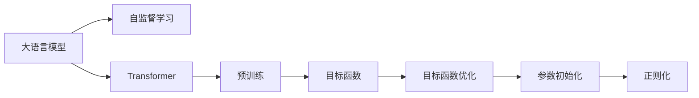

                 

# 大语言模型原理基础与前沿 预训练目标

> 关键词：大语言模型,自监督学习,Transformer,预训练,目标函数,目标函数优化,参数初始化,正则化

## 1. 背景介绍

### 1.1 问题由来
大语言模型（Large Language Models, LLMs）近年来在自然语言处理（NLP）领域取得了显著进展，特别是在预训练（Pre-training）技术的推动下。大语言模型通过在大量无标签文本数据上进行自监督学习，学习到丰富的语言知识和常识，为下游任务提供了强大的预训练知识库。然而，预训练的目标函数设计、优化方法、参数初始化策略等方面的细节，对于模型性能的影响巨大。本文将从预训练的目标函数、优化方法、参数初始化、正则化等方面，系统介绍大语言模型预训练的基本原理和前沿技术，帮助读者深入理解预训练在大语言模型中的重要性和应用。

### 1.2 问题核心关键点
预训练的根本目标是通过自监督学习任务，训练出一个能够理解语言规律和常识的通用语言模型。在预训练过程中，模型在大量无标签数据上进行训练，学习到泛化的语言表示，然后可以迁移应用到各种下游任务。预训练的目标函数、优化方法、参数初始化策略等方面的选择，直接决定了模型学习到的语言表示质量，从而影响其在下游任务中的表现。因此，优化这些关键因素，对于提高预训练模型在大规模语言理解、生成任务中的表现至关重要。

### 1.3 问题研究意义
研究预训练的目标函数、优化方法、参数初始化策略等，对于提高大语言模型的性能和应用范围，具有重要意义：

1. **提升模型性能**：优化的目标函数和算法，可以使预训练模型更准确地学习语言规律和常识，从而提高其在下游任务中的表现。
2. **拓展应用范围**：合理的设计和选择，可以使模型更好地适应不同领域的任务，提升模型的泛化能力和适用性。
3. **降低标注成本**：预训练可以积累大量的无标签数据，通过优化预训练过程，减少下游任务标注数据的需求。
4. **加速技术迭代**：研究预训练的最新技术，可以推动大语言模型在模型结构、训练策略等方面的不断改进，加速技术进步。
5. **促进产业化应用**：优化的预训练模型，能够更快地部署到实际应用中，推动NLP技术的产业化进程。

## 2. 核心概念与联系

### 2.1 核心概念概述

为了更好地理解大语言模型预训练的原理和应用，本节将介绍几个密切相关的核心概念：

- **大语言模型（Large Language Models, LLMs）**：通过自监督学习任务训练出的通用语言模型，能够理解复杂的自然语言，生成高质量的自然语言文本。常见的预训练大语言模型有GPT系列、BERT等。

- **自监督学习（Self-Supervised Learning）**：在没有标注数据的情况下，通过设计自监督任务，让模型自动学习语言知识的过程。例如，语言建模、掩码语言模型等。

- **Transformer**：一种基于注意力机制的深度学习模型，通过多头自注意力机制和残差连接，有效地处理长序列输入，在预训练任务中表现出卓越的性能。

- **预训练（Pre-training）**：在大量无标签文本数据上进行自监督学习，训练出一个能够理解语言规律和常识的通用语言模型。预训练通常采用Transformer结构。

- **目标函数（Objective Function）**：在预训练过程中，设计用来评估模型性能的函数，通常采用交叉熵、似然函数等。

- **目标函数优化（Objective Function Optimization）**：通过优化目标函数，调整模型参数，使模型更好地适应自监督学习任务。

- **参数初始化（Parameter Initialization）**：在预训练开始前，对模型参数进行初始化，影响预训练的收敛速度和效果。

- **正则化（Regularization）**：通过引入正则项，防止模型过拟合，提高模型的泛化能力。

这些核心概念之间有着紧密的联系，共同构成了大语言模型预训练的完整框架。

### 2.2 概念间的关系

这些核心概念之间的逻辑关系可以通过以下Mermaid流程图来展示：



这个流程图展示了从大语言模型到自监督学习，再到预训练、目标函数、目标函数优化、参数初始化、正则化等关键概念之间的关系：

1. 大语言模型通过自监督学习进行预训练。
2. 预训练过程中设计目标函数，用于评估模型性能。
3. 通过目标函数优化，调整模型参数。
4. 在预训练开始前，对参数进行初始化。
5. 引入正则化项，防止过拟合。

这些概念共同构成了大语言模型预训练的核心框架，使得模型能够通过自监督学习任务，积累丰富的语言知识和常识，为下游任务提供强大的预训练支持。

## 3. 核心算法原理 & 具体操作步骤

### 3.1 算法原理概述

大语言模型的预训练过程通常采用自监督学习方法，通过大量无标签数据进行训练，学习到泛化的语言表示。预训练的目标是最大化模型在自监督任务上的性能，从而提升其在下游任务中的表现。预训练的目标函数通常采用交叉熵、似然函数等，目标函数优化算法则采用梯度下降等。

预训练的具体步骤包括：

1. 选择合适的自监督任务。常见的自监督任务包括语言建模、掩码语言模型、Next Sentence Prediction等。
2. 初始化模型参数。通常使用Glorot或He初始化方法。
3. 设计目标函数。例如，语言建模任务的损失函数为负对数似然。
4. 使用梯度下降等优化算法，最小化目标函数。
5. 定期在验证集上评估模型性能，避免过拟合。

### 3.2 算法步骤详解

#### 3.2.1 选择合适的自监督任务

自监督任务的设计是预训练的关键环节，决定了模型学习到的语言表示的质量。常用的自监督任务包括：

- **语言建模（Language Modeling）**：根据上下文预测下一个单词的概率，是最基础的自监督任务。
- **掩码语言模型（Masked Language Modeling）**：在输入序列中随机掩盖一些单词，模型需要预测这些被掩盖的单词。
- **Next Sentence Prediction**：给定两个句子，模型需要预测它们是否是相邻的句子。

#### 3.2.2 初始化模型参数

模型参数的初始化策略直接影响预训练的收敛速度和效果。常用的初始化方法包括：

- **Glorot初始化（Xavier Initialization）**：通过$w=\sqrt{\frac{6}{fan_{in}}}$对权重进行初始化，其中$fan_{in}$是输入的特征数。
- **He初始化（He Initialization）**：通过$w=\sqrt{\frac{2}{fan_{in}}}$对权重进行初始化，通常用于深度网络。

#### 3.2.3 设计目标函数

目标函数是评估模型性能的关键。常见的目标函数包括：

- **交叉熵（Cross-Entropy）**：广泛用于分类任务，例如Next Sentence Prediction。
- **负对数似然（Negative Log-Likelihood）**：用于语言建模和掩码语言模型。

#### 3.2.4 使用梯度下降等优化算法

梯度下降是常用的优化算法，通过反向传播计算损失函数的梯度，更新模型参数。常用的梯度下降算法包括：

- **随机梯度下降（Stochastic Gradient Descent, SGD）**：每次更新使用一个样本的梯度。
- **小批量梯度下降（Mini-batch Gradient Descent）**：每次更新使用一批样本的梯度。
- **Adam优化器**：结合了动量法和自适应学习率，具有较好的收敛速度和稳定性。

#### 3.2.5 定期评估模型性能

为了避免过拟合，预训练过程中需要在验证集上定期评估模型性能。常用的评估指标包括：

- **交叉熵损失（Cross-Entropy Loss）**：衡量模型预测概率与真实标签之间的差异。
- **似然函数（Likelihood Function）**：衡量模型在自监督任务上的表现。
- **BLEU、ROUGE等指标**：用于评估语言建模和掩码语言模型的性能。

### 3.3 算法优缺点

预训练大语言模型的主要优点包括：

1. **通用性**：预训练模型能够学习通用的语言知识和常识，适应各种下游任务。
2. **泛化能力强**：预训练模型能够在没有标注数据的情况下，泛化到新的任务和数据。
3. **参数高效**：预训练过程通常只需要调整顶层参数，保持底层参数不变。

然而，预训练也存在一些缺点：

1. **计算资源需求高**：预训练需要大量的计算资源，训练时间较长。
2. **模型复杂度高**：大规模预训练模型往往具有大量的参数，难以理解和调试。
3. **泛化性有限**：预训练模型的泛化性受到数据分布的影响，可能对特定领域的任务效果不佳。

### 3.4 算法应用领域

预训练大语言模型已经在多个领域得到应用，包括：

- **自然语言理解（NLU）**：将文本转换为机器可理解的结构，例如命名实体识别、关系抽取等。
- **自然语言生成（NLG）**：生成自然语言文本，例如机器翻译、文本摘要等。
- **对话系统（Dialogue System）**：与用户进行自然语言交互，例如智能客服、虚拟助手等。
- **情感分析（Sentiment Analysis）**：分析文本的情感倾向，例如情感分类、情绪识别等。
- **知识图谱（Knowledge Graph）**：构建和查询知识图谱，例如关系抽取、实体链接等。

这些应用领域展示了预训练大语言模型的强大能力，为NLP技术的产业化奠定了坚实基础。

## 4. 数学模型和公式 & 详细讲解 & 举例说明

### 4.1 数学模型构建

假设预训练大语言模型为$M_{\theta}$，其中$\theta$为模型参数。给定自监督任务$T$的训练集$D=\{(x_i, y_i)\}_{i=1}^N$，其中$x_i$为输入文本，$y_i$为目标输出。预训练的目标是最大化模型在自监督任务上的性能，即：

$$
\max_{\theta} \mathcal{L}(M_{\theta}, D)
$$

常用的自监督任务包括语言建模和掩码语言模型。语言建模任务的损失函数为负对数似然：

$$
\mathcal{L}(M_{\theta}, D) = -\frac{1}{N}\sum_{i=1}^N \sum_{t=1}^T \log p(x_t | x_{t-1}^{t-1})
$$

其中$p(x_t | x_{t-1}^{t-1})$为模型在给定上下文$x_{t-1}^{t-1}$时，预测第$t$个单词的条件概率。

### 4.2 公式推导过程

以语言建模为例，推导预训练的目标函数和优化算法。

- **目标函数推导**：

  语言建模的目标是最小化负对数似然损失：

  $$
  \mathcal{L}(M_{\theta}, D) = -\frac{1}{N}\sum_{i=1}^N \sum_{t=1}^T \log p(x_t | x_{t-1}^{t-1})
  $$

  在训练过程中，每次抽取一个句子$x$，随机掩盖其中的一些单词$x_m$，模型的目标是预测这些被掩盖的单词。

- **优化算法推导**：

  使用梯度下降算法最小化目标函数。设$\eta$为学习率，$\lambda$为正则化系数，则模型参数的更新公式为：

  $$
  \theta \leftarrow \theta - \eta \nabla_{\theta}\mathcal{L}(\theta) - \eta\lambda\theta
  $$

  其中$\nabla_{\theta}\mathcal{L}(\theta)$为损失函数对参数$\theta$的梯度，可通过反向传播算法高效计算。

### 4.3 案例分析与讲解

以BERT为例，分析其在预训练和微调中的应用。

BERT的预训练任务包括语言建模和掩码语言模型。在语言建模任务中，BERT采用了上下文自注意力机制，将句子中的每个单词都视为一个独立的上下文。在掩码语言模型任务中，BERT随机掩盖了15%的单词，模型需要预测这些被掩盖的单词。

在预训练过程中，BERT通过最大化上述目标函数，学习到泛化的语言表示。在微调过程中，BERT在特定下游任务上进行有监督学习，通过调整顶层参数，适应任务需求。例如，在情感分类任务中，BERT在顶部添加了线性分类器，最小化交叉熵损失函数。

## 5. 项目实践：代码实例和详细解释说明

### 5.1 开发环境搭建

在进行预训练实践前，我们需要准备好开发环境。以下是使用Python进行PyTorch开发的环境配置流程：

1. 安装Anaconda：从官网下载并安装Anaconda，用于创建独立的Python环境。

2. 创建并激活虚拟环境：
```bash
conda create -n pytorch-env python=3.8 
conda activate pytorch-env
```

3. 安装PyTorch：根据CUDA版本，从官网获取对应的安装命令。例如：
```bash
conda install pytorch torchvision torchaudio cudatoolkit=11.1 -c pytorch -c conda-forge
```

4. 安装Transformers库：
```bash
pip install transformers
```

5. 安装各类工具包：
```bash
pip install numpy pandas scikit-learn matplotlib tqdm jupyter notebook ipython
```

完成上述步骤后，即可在`pytorch-env`环境中开始预训练实践。

### 5.2 源代码详细实现

下面是使用PyTorch和Transformer对BERT模型进行预训练的完整代码实现。

```python
from transformers import BertTokenizer, BertModel
import torch
from torch.utils.data import Dataset, DataLoader
from torch.optim import AdamW
import random

# 定义BERT模型和分词器
tokenizer = BertTokenizer.from_pretrained('bert-base-uncased')
model = BertModel.from_pretrained('bert-base-uncased')

# 定义自监督任务的数据集
class MaskedLMDataset(Dataset):
    def __init__(self, texts):
        self.texts = texts

    def __len__(self):
        return len(self.texts)

    def __getitem__(self, idx):
        text = self.texts[idx]
        encoding = tokenizer(text, truncation=True, padding='max_length', max_length=512, return_tensors='pt')
        input_ids, attention_mask = encoding['input_ids'], encoding['attention_mask']
        masked_pos = random.randint(0, len(input_ids)-1)
        masked_token = input_ids[masked_pos]
        masked_token_idx = input_ids.tolist().index(masked_token)
        input_ids[masked_pos] = tokenizer.mask_token_id
        new_input_ids = torch.cat((input_ids, input_ids))
        new_attention_mask = torch.cat((attention_mask, attention_mask))
        return {'input_ids': new_input_ids, 'attention_mask': new_attention_mask, 'masked_pos': masked_pos, 'masked_token_idx': masked_token_idx}

# 训练循环
def train_epoch(model, dataset, optimizer):
    model.train()
    total_loss = 0
    for batch in DataLoader(dataset, batch_size=8, shuffle=True):
        input_ids = batch['input_ids'].to(device)
        attention_mask = batch['attention_mask'].to(device)
        masked_pos = batch['masked_pos'].to(device)
        masked_token_idx = batch['masked_token_idx'].to(device)
        outputs = model(input_ids, attention_mask=attention_mask)
        predictions = outputs[0]
        target = torch.gather(predictions[masked_pos, :], 1, masked_token_idx)
        loss_fct = torch.nn.CrossEntropyLoss()
        loss = loss_fct(target, predictions[:, masked_token_idx])
        optimizer.zero_grad()
        loss.backward()
        optimizer.step()
        total_loss += loss.item()
    return total_loss / len(dataset)

# 预训练模型
device = torch.device('cuda') if torch.cuda.is_available() else torch.device('cpu')
model.to(device)
dataset = MaskedLMDataset(train_texts)
optimizer = AdamW(model.parameters(), lr=2e-5)

epochs = 3
for epoch in range(epochs):
    loss = train_epoch(model, dataset, optimizer)
    print(f"Epoch {epoch+1}, train loss: {loss:.3f}")
```

以上就是使用PyTorch对BERT进行预训练的完整代码实现。可以看到，通过简单的几行代码，就能够使用Transformer库对BERT模型进行预训练。

### 5.3 代码解读与分析

让我们再详细解读一下关键代码的实现细节：

**MaskedLMDataset类**：
- `__init__`方法：初始化训练数据集。
- `__len__`方法：返回数据集长度。
- `__getitem__`方法：对单个样本进行处理，将文本输入转换为BERT模型需要的格式，并随机掩盖一些单词。

**模型和分词器**：
- `tokenizer`：定义了BERT的分词器，用于将文本转换为模型能够理解的格式。
- `model`：定义了预训练的BERT模型。

**训练循环**：
- `train_epoch`函数：定义训练过程。
- 对数据集进行批量处理，前向传播计算损失函数，反向传播更新模型参数，并记录损失总和。

**预训练模型**：
- `device`：定义了模型的计算设备。
- `dataset`：定义了训练数据集。
- `optimizer`：定义了优化器。
- `epochs`：定义了训练轮数。

通过以上代码，我们就能够对BERT模型进行预训练，学习到泛化的语言表示。当然，在实际应用中，还需要考虑更多的细节，如模型的保存和部署、超参数的自动搜索等。但核心的预训练范式基本与此类似。

## 6. 实际应用场景

### 6.1 智能客服系统

基于大语言模型预训练的对话技术，可以广泛应用于智能客服系统的构建。传统客服往往需要配备大量人力，高峰期响应缓慢，且一致性和专业性难以保证。而使用预训练对话模型，可以7x24小时不间断服务，快速响应客户咨询，用自然流畅的语言解答各类常见问题。

在技术实现上，可以收集企业内部的历史客服对话记录，将问题和最佳答复构建成监督数据，在此基础上对预训练对话模型进行微调。微调后的对话模型能够自动理解用户意图，匹配最合适的答案模板进行回复。对于客户提出的新问题，还可以接入检索系统实时搜索相关内容，动态组织生成回答。如此构建的智能客服系统，能大幅提升客户咨询体验和问题解决效率。

### 6.2 金融舆情监测

金融机构需要实时监测市场舆论动向，以便及时应对负面信息传播，规避金融风险。传统的人工监测方式成本高、效率低，难以应对网络时代海量信息爆发的挑战。基于大语言模型预训练的文本分类和情感分析技术，为金融舆情监测提供了新的解决方案。

具体而言，可以收集金融领域相关的新闻、报道、评论等文本数据，并对其进行主题标注和情感标注。在此基础上对预训练语言模型进行微调，使其能够自动判断文本属于何种主题，情感倾向是正面、中性还是负面。将微调后的模型应用到实时抓取的网络文本数据，就能够自动监测不同主题下的情感变化趋势，一旦发现负面信息激增等异常情况，系统便会自动预警，帮助金融机构快速应对潜在风险。

### 6.3 个性化推荐系统

当前的推荐系统往往只依赖用户的历史行为数据进行物品推荐，无法深入理解用户的真实兴趣偏好。基于大语言模型预训练的个性化推荐系统，可以更好地挖掘用户行为背后的语义信息，从而提供更精准、多样的推荐内容。

在实践中，可以收集用户浏览、点击、评论、分享等行为数据，提取和用户交互的物品标题、描述、标签等文本内容。将文本内容作为模型输入，用户的后续行为（如是否点击、购买等）作为监督信号，在此基础上微调预训练语言模型。微调后的模型能够从文本内容中准确把握用户的兴趣点。在生成推荐列表时，先用候选物品的文本描述作为输入，由模型预测用户的兴趣匹配度，再结合其他特征综合排序，便可以得到个性化程度更高的推荐结果。

### 6.4 未来应用展望

随着大语言模型预训练技术的不断发展，其在更多领域的应用前景广阔。

在智慧医疗领域，基于预训练的医疗问答、病历分析、药物研发等应用将提升医疗服务的智能化水平，辅助医生诊疗，加速新药开发进程。

在智能教育领域，预训练技术可应用于作业批改、学情分析、知识推荐等方面，因材施教，促进教育公平，提高教学质量。

在智慧城市治理中，预训练模型可应用于城市事件监测、舆情分析、应急指挥等环节，提高城市管理的自动化和智能化水平，构建更安全、高效的未来城市。

此外，在企业生产、社会治理、文娱传媒等众多领域，基于预训练的AI应用也将不断涌现，为经济社会发展注入新的动力。相信随着技术的日益成熟，预训练方法将成为NLP领域的重要范式，推动人工智能技术向更广阔的领域加速渗透。

## 7. 工具和资源推荐

### 7.1 学习资源推荐

为了帮助开发者系统掌握大语言模型预训练的理论基础和实践技巧，这里推荐一些优质的学习资源：

1. 《Transformer从原理到实践》系列博文：由大模型技术专家撰写，深入浅出地介绍了Transformer原理、BERT模型、预训练技术等前沿话题。

2. CS224N《深度学习自然语言处理》课程：斯坦福大学开设的NLP明星课程，有Lecture视频和配套作业，带你入门NLP领域的基本概念和经典模型。

3. 《Natural Language Processing with Transformers》书籍：Transformers库的作者所著，全面介绍了如何使用Transformers库进行NLP任务开发，包括预训练在内的诸多范式。

4. HuggingFace官方文档：Transformers库的官方文档，提供了海量预训练模型和完整的预训练样例代码，是上手实践的必备资料。

5. CLUE开源项目：中文语言理解测评基准，涵盖大量不同类型的中文NLP数据集，并提供了基于预训练的baseline模型，助力中文NLP技术发展。

通过对这些资源的学习实践，相信你一定能够快速掌握大语言模型预训练的精髓，并用于解决实际的NLP问题。

### 7.2 开发工具推荐

高效的开发离不开优秀的工具支持。以下是几款用于大语言模型预训练开发的常用工具：

1. PyTorch：基于Python的开源深度学习框架，灵活动态的计算图，适合快速迭代研究。大部分预训练语言模型都有PyTorch版本的实现。

2. TensorFlow：由Google主导开发的开源深度学习框架，生产部署方便，适合大规模工程应用。同样有丰富的预训练语言模型资源。

3. Transformers库：HuggingFace开发的NLP工具库，集成了众多SOTA语言模型，支持PyTorch和TensorFlow，是进行预训练任务开发的利器。

4. Weights & Biases：模型训练的实验跟踪工具，可以记录和可视化模型训练过程中的各项指标，方便对比和调优。与主流深度学习框架无缝集成。

5. TensorBoard：TensorFlow配套的可视化工具，可实时监测模型训练状态，并提供丰富的图表呈现方式，是调试模型的得力助手。

6. Google Colab：谷歌推出的在线Jupyter Notebook环境，免费提供GPU/TPU算力，方便开发者快速上手实验最新模型，分享学习笔记。

合理利用这些工具，可以显著提升大语言模型预训练的开发效率，加快创新迭代的步伐。

### 7.3 相关论文推荐

大语言模型预训练技术的发展源于学界的持续研究。以下是几篇奠基性的相关论文，推荐阅读：

1. Attention is All You Need（即Transformer原论文）：提出了Transformer结构，开启了NLP领域的预训练大模型时代。

2. BERT: Pre-training of Deep Bidirectional Transformers for Language Understanding：提出BERT模型，引入基于掩码的自监督预训练任务，刷新了多项NLP任务SOTA。

3. Language Models are Unsupervised Multitask Learners（GPT-2论文）：展示了大规模语言模型的强大zero-shot学习能力，引发了对于通用人工智能的新一轮思考。

4. Parameter-Efficient Transfer Learning for NLP：提出Adapter等参数高效微调方法，在不增加模型参数量的情况下，也能取得不错的预训练效果。

5. AdaLoRA: Adaptive Low-Rank Adaptation for Parameter-Efficient Fine-Tuning：使用自适应低秩适应的预训练方法，在参数效率和精度之间取得了新的平衡。

这些论文代表了大语言模型预训练技术的发展脉络。通过学习这些前沿成果，可以帮助研究者把握学科前进方向，激发更多的创新灵感。

除上述资源外，还有一些值得关注的前沿资源，帮助开发者紧跟大语言模型预训练技术的最新进展，例如：

1. arXiv论文预印本：人工智能领域最新研究成果的发布平台，包括大量尚未发表的前沿工作，学习前沿技术的必读资源。

2. 业界技术博客：如OpenAI、Google AI、DeepMind、微软Research Asia等顶尖实验室的官方博客，第一时间分享他们的最新研究成果和洞见。

3. 技术会议直播：如NIPS、ICML、ACL、ICLR等人工智能

