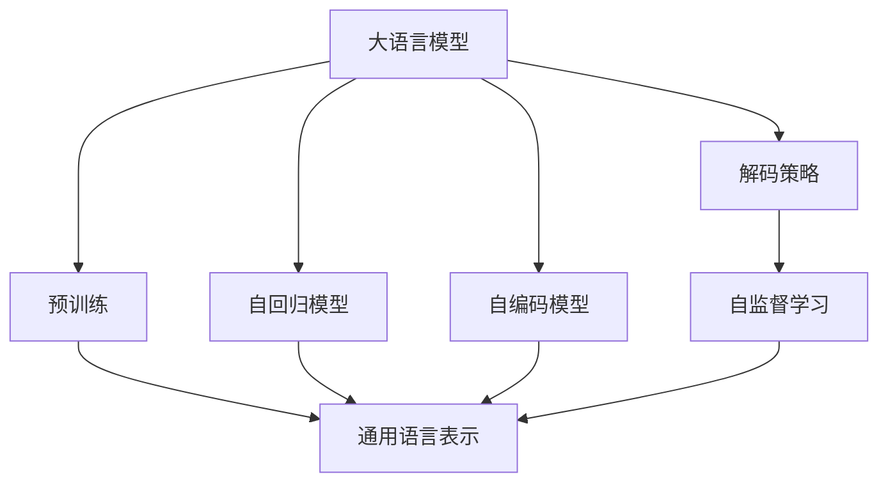
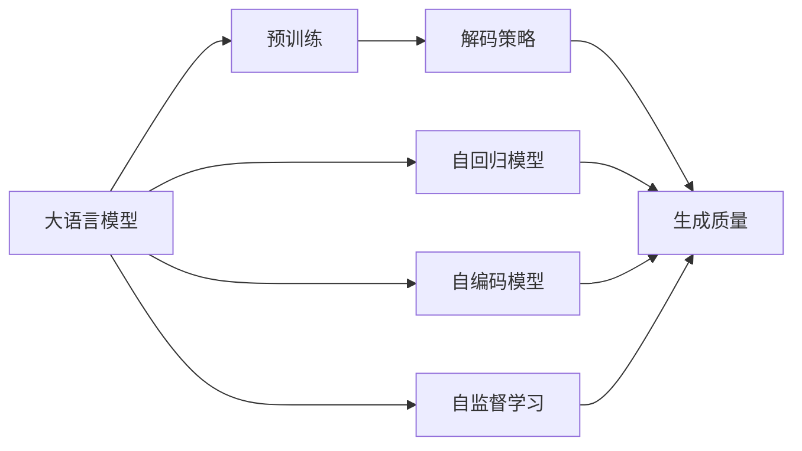
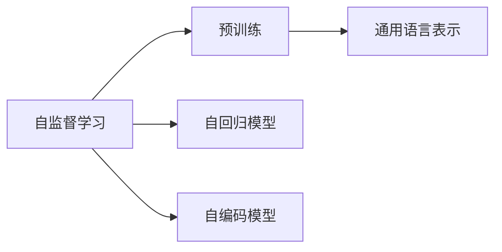
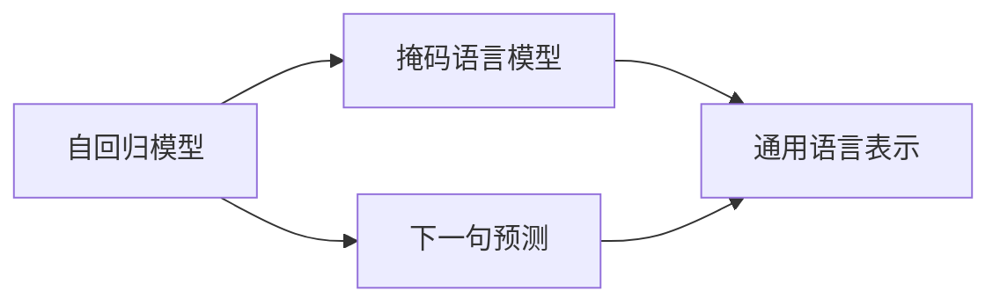

                 

# 大语言模型原理基础与前沿 预训练目标和解码策略

> 关键词：大语言模型,预训练目标,解码策略,自监督学习,Transformer,BERT,预训练,解码

## 1. 背景介绍

### 1.1 问题由来
近年来，随着深度学习技术的快速发展，大规模语言模型(Large Language Model, LLMs)在自然语言处理(Natural Language Processing, NLP)领域取得了巨大的突破。这些大语言模型通过在海量无标签文本数据上进行预训练，学习到了丰富的语言知识和常识，可以通过少量的有标签样本在下游任务上进行微调(Fine-Tuning)，获得优异的性能。其中最具代表性的大模型包括OpenAI的GPT系列模型、Google的BERT、T5等。

然而，由于预训练语料的广泛性和泛化能力的不足，这些通用的大语言模型在特定领域应用时，效果往往难以达到实际应用的要求。因此，如何针对特定任务进行大模型微调，提升模型性能，成为了当前大语言模型研究和应用的一个热点问题。本文聚焦于大语言模型的预训练目标和解码策略，但同时也会兼顾参数高效微调和提示学习等前沿技术，以期对大语言模型微调实践提供更全面的指导。

### 1.2 问题核心关键点
当前大语言模型的预训练目标和解码策略，主要围绕以下核心问题展开：

- 预训练目标的设计：如何设计合理的预训练目标，使得模型在预训练过程中能够学习到通用的语言表示和丰富的知识，同时避免过拟合。
- 解码策略的选择：选择合适的解码策略，能够更高效地生成符合语法规则的文本，同时尽可能避免生成低质量、不连贯的文本。

这些问题直接关系到模型的泛化能力、生成质量以及计算效率，是大语言模型研究的重点之一。通过详细分析预训练目标和解码策略，可以帮助我们更好地理解和应用大语言模型，提高其下游任务的性能。

### 1.3 问题研究意义
研究大语言模型的预训练目标和解码策略，对于拓展大模型的应用范围，提升下游任务的性能，加速NLP技术的产业化进程，具有重要意义：

1. 降低应用开发成本。基于成熟的大模型进行微调，可以显著减少从头开发所需的数据、计算和人力等成本投入。
2. 提升模型效果。预训练目标和解码策略的选择，直接影响到模型在下游任务上的表现，优化这些策略可以显著提升模型性能。
3. 加速开发进度。standing on the shoulders of giants，大模型预训练-微调的思路和框架，使得开发者可以更快地完成任务适配，缩短开发周期。
4. 带来技术创新。预训练目标和解码策略的改进，促进了对预训练-微调的深入研究，催生了新的研究方向，如参数高效微调、提示学习等。
5. 赋能产业升级。大语言模型预训练-微调技术，使得NLP技术更容易被各行各业所采用，为传统行业数字化转型升级提供新的技术路径。

## 2. 核心概念与联系

### 2.1 核心概念概述

为更好地理解大语言模型的预训练目标和解码策略，本节将介绍几个密切相关的核心概念：

- 大语言模型(Large Language Model, LLM)：以自回归(如GPT)或自编码(如BERT)模型为代表的大规模预训练语言模型。通过在大规模无标签文本语料上进行预训练，学习通用的语言表示，具备强大的语言理解和生成能力。

- 预训练(Pre-training)：指在大规模无标签文本语料上，通过自监督学习任务训练通用语言模型的过程。常见的预训练任务包括言语建模、遮挡语言模型等。预训练使得模型学习到语言的通用表示。

- 解码策略(Decoding Strategy)：指在生成文本时，如何根据模型的输出进行决策，选择下一个单词或字符，以生成符合语法规则和语义逻辑的文本。

- 自监督学习(Self-supervised Learning)：利用无标签数据进行预训练，学习模型的自我监督任务，以获得通用的语言表示。

- 自回归模型(Autoregressive Model)：如GPT系列模型，利用上下文序列预测下一个单词或字符，通过概率分布方式生成文本。

- 自编码模型(Autocoding Model)：如BERT，利用上下文编码器生成上下文表示，通过编码-解码过程生成预测文本。

- 解码算法(Decoding Algorithm)：如Beam Search、Top-k Sampling等，用于在大模型生成的候选序列中，选择最符合语法规则和语义逻辑的序列作为输出。

- 生成质量(Generation Quality)：指生成的文本在语法正确性、流畅性、连贯性等方面的表现。

这些核心概念之间的逻辑关系可以通过以下Mermaid流程图来展示：



这个流程图展示了大语言模型的核心概念及其之间的关系：

1. 大语言模型通过预训练获得基础能力。
2. 自监督学习在大规模无标签数据上训练模型，学习通用语言表示。
3. 自回归模型和自编码模型是常见的预训练方式。
4. 解码策略在生成文本时选择合适的下一个单词或字符。
5. 通用语言表示是模型预训练和微调的核心目标。

通过理解这些核心概念，我们可以更好地把握大语言模型的学习过程和输出机制。

### 2.2 概念间的关系

这些核心概念之间存在着紧密的联系，形成了大语言模型的学习框架。下面我通过几个Mermaid流程图来展示这些概念之间的关系。

#### 2.2.1 大语言模型的学习范式



这个流程图展示了从预训练到解码策略的应用过程。大语言模型首先在预训练阶段通过自监督学习任务训练，学习到通用的语言表示。然后根据不同的解码策略，生成符合语法规则和语义逻辑的文本。

#### 2.2.2 自监督学习与预训练的关系



这个流程图展示了自监督学习在大规模无标签数据上训练大语言模型的过程。自监督学习任务设计成能够覆盖语言的各个方面，如掩码语言模型、下一句预测等，使得模型能够学习到丰富的语言知识。

#### 2.2.3 自回归模型和自编码模型



这个流程图展示了自回归模型和自编码模型在预训练中的应用。自回归模型通过上下文序列预测下一个单词或字符，训练语言模型。自编码模型则通过编码器生成上下文表示，解码器生成预测文本，训练语言模型。

## 3. 核心算法原理 & 具体操作步骤
### 3.1 算法原理概述

大语言模型的预训练目标和解码策略，主要围绕自监督学习任务和解码算法展开。其核心思想是：通过在大规模无标签文本数据上进行自监督学习，学习到通用的语言表示，然后在生成文本时，通过选择合适的解码算法，生成符合语法规则和语义逻辑的文本。

形式化地，假设预训练模型为 $M_{\theta}$，其中 $\theta$ 为预训练得到的模型参数。给定预训练任务 $T$ 的训练集 $D=\{(x_i, y_i)\}_{i=1}^N, x_i \in \mathcal{X}, y_i \in \mathcal{Y}$。

预训练任务的目标是最大化模型在 $T$ 上的表现，即：

$$
\mathcal{L}(T) = \mathbb{E}_{(x_i,y_i) \sim D}[\ell(M_{\theta}(x_i),y_i)]
$$

其中 $\ell$ 为预训练任务定义的损失函数，$\mathbb{E}$ 表示期望。常见的预训练任务包括掩码语言模型、下一句预测等。

在生成文本时，通过选择合适的解码算法，如Beam Search、Top-k Sampling等，选择最符合语法规则和语义逻辑的文本作为输出。常见的解码算法如下：

- Beam Search：选择多个最有可能的候选序列，每次扩展至多个序列，直到达到预定的长度。
- Top-k Sampling：从模型输出的概率分布中选择k个最有可能的单词或字符，进行解码。
- Top-p Sampling：从模型输出的概率分布中选择p个最有可能的单词或字符，进行解码。

生成的文本质量可以通过BLEU、ROUGE、METEOR等指标进行评估。

### 3.2 算法步骤详解

大语言模型的预训练和解码策略通常包括以下几个关键步骤：

**Step 1: 准备预训练数据和任务**
- 选择合适的预训练任务，如掩码语言模型、下一句预测等。
- 收集大规模无标签文本数据，如维基百科、新闻语料库等。
- 设计预训练任务，定义损失函数和评估指标。

**Step 2: 执行预训练**
- 将预训练数据输入模型，进行前向传播计算预测结果。
- 反向传播计算梯度，更新模型参数。
- 周期性在验证集上评估模型性能，根据性能指标决定是否触发Early Stopping。
- 重复上述步骤直至收敛。

**Step 3: 确定解码策略**
- 选择合适的解码算法，如Beam Search、Top-k Sampling等。
- 设置解码算法的参数，如束宽、解码长度等。

**Step 4: 执行解码**
- 将文本生成任务输入模型，进行前向传播计算预测结果。
- 根据解码策略选择最符合语法规则和语义逻辑的文本作为输出。
- 周期性在验证集上评估生成文本的质量，根据性能指标决定是否调整解码策略。

**Step 5: 应用解码**
- 将训练好的模型应用于实际文本生成任务，如对话生成、摘要生成等。
- 实时生成文本，并根据用户反馈进行迭代优化。

以上是基于自监督学习的大语言模型预训练和解码策略的一般流程。在实际应用中，还需要根据具体任务的特点，对预训练过程和解码策略进行优化设计，如改进训练目标函数，引入更多的正则化技术，搜索最优的超参数组合等，以进一步提升模型性能。

### 3.3 算法优缺点

大语言模型的预训练目标和解码策略，具有以下优点：
1. 通用适用。适用于各种NLP任务，如文本分类、问答、翻译等，只需选择合适的解码策略即可。
2. 模型效果良好。通过自监督学习任务训练，学习到丰富的语言知识，生成质量高。
3. 训练简单高效。只需对预训练数据进行自监督学习，无需标注数据。

同时，该方法也存在一定的局限性：
1. 数据依赖性强。预训练效果依赖于大规模无标签数据，数据获取和预处理成本高。
2. 任务适配性有限。对于特定领域任务，通用的预训练模型可能表现不佳。
3. 计算资源消耗大。预训练和解码过程中需要大量的计算资源，特别是在生成高质量文本时。

尽管存在这些局限性，但就目前而言，自监督学习的预训练目标和解码策略仍然是大语言模型应用的主流范式。未来相关研究的重点在于如何进一步降低预训练对数据和计算资源的依赖，提高模型的少样本学习和跨领域迁移能力，同时兼顾可解释性和伦理安全性等因素。

### 3.4 算法应用领域

基于大语言模型的预训练目标和解码策略，在NLP领域已经得到了广泛的应用，覆盖了几乎所有常见任务，例如：

- 文本分类：如情感分析、主题分类、意图识别等。通过自监督学习任务训练，学习文本-标签映射。
- 命名实体识别：识别文本中的人名、地名、机构名等特定实体。通过自监督学习任务训练，学习实体边界和类型。
- 关系抽取：从文本中抽取实体之间的语义关系。通过自监督学习任务训练，学习实体-关系三元组。
- 问答系统：对自然语言问题给出答案。通过自监督学习任务训练，学习问题-答案对映射。
- 机器翻译：将源语言文本翻译成目标语言。通过自监督学习任务训练，学习语言-语言映射。
- 文本摘要：将长文本压缩成简短摘要。通过自监督学习任务训练，学习文本-摘要映射。
- 对话系统：使机器能够与人自然对话。通过自监督学习任务训练，学习对话历史与回复映射。

除了上述这些经典任务外，大语言模型预训练-解码策略也被创新性地应用到更多场景中，如可控文本生成、常识推理、代码生成、数据增强等，为NLP技术带来了全新的突破。随着预训练模型和解码策略的不断进步，相信NLP技术将在更广阔的应用领域大放异彩。

## 4. 数学模型和公式 & 详细讲解  
### 4.1 数学模型构建

本节将使用数学语言对大语言模型的预训练目标和解码策略进行更加严格的刻画。

记预训练语言模型为 $M_{\theta}$，其中 $\theta$ 为预训练得到的模型参数。假设预训练任务为掩码语言模型，训练集为 $D=\{(x_i, y_i)\}_{i=1}^N, x_i \in \mathcal{X}, y_i \in \mathcal{Y}$，其中 $y_i$ 是 $x_i$ 中部分位置的掩码，表示需要预测这些位置的单词或字符。

定义模型 $M_{\theta}$ 在输入 $x$ 上的损失函数为 $\ell(M_{\theta}(x),y)$，则在数据集 $D$ 上的经验风险为：

$$
\mathcal{L}(D) = \mathbb{E}_{(x_i,y_i) \sim D}[\ell(M_{\theta}(x_i),y_i)]
$$

预训练任务的目标是最大化模型在 $D$ 上的表现，即：

$$
\mathcal{L}(T) = \max_{M_{\theta}} \mathcal{L}(D)
$$

在生成文本时，假设解码策略为Beam Search，束宽为 $k$。则从模型输出的概率分布中，选择 $k$ 个最有可能的单词或字符，进行解码。

设 $P_{t+1|t}$ 表示从当前位置到下一个位置的概率分布，则根据Beam Search，选择 $k$ 个最有可能的序列，并扩展至下一个位置：

$$
P_{t+1|t} = \max_{\{x_i\}} \frac{M_{\theta}(x_i)}{\sum_{x'_i} M_{\theta}(x'_i)}
$$

对于每个序列，计算其长度 $L$，并选择最长的 $k$ 个序列作为最终输出。

生成的文本质量可以通过BLEU、ROUGE、METEOR等指标进行评估。假设生成的文本序列为 $X^*$，真实文本序列为 $X$，则BLEU指标定义为：

$$
BLEU = \max_{Y \in \mathcal{X}} \prod_{i=1}^L \min(1, \frac{|Y_i|}{|X_i^*|})
$$

其中 $Y_i$ 为 $X_i^*$ 的子序列，$|X_i|$ 为序列长度。

### 4.2 公式推导过程

以下我们以掩码语言模型为例，推导预训练过程和解码过程的公式。

假设模型 $M_{\theta}$ 在输入 $x$ 上的输出为 $\hat{x}=M_{\theta}(x) \in [0,1]$，表示模型预测的单词或字符概率分布。真实标签 $y \in \{0,1\}$，表示需要预测的位置是否为掩码。则掩码语言模型的损失函数定义为：

$$
\ell(M_{\theta}(x),y) = -\log M_{\theta}(y)
$$

将其代入经验风险公式，得：

$$
\mathcal{L}(D) = -\frac{1}{N} \sum_{i=1}^N \ell(M_{\theta}(x_i),y_i)
$$

预训练任务的目标是最大化模型在 $D$ 上的表现，即：

$$
\mathcal{L}(T) = \max_{M_{\theta}} \mathcal{L}(D)
$$

在生成文本时，假设解码策略为Beam Search，束宽为 $k$。则从模型输出的概率分布中，选择 $k$ 个最有可能的单词或字符，进行解码。

设 $P_{t+1|t}$ 表示从当前位置到下一个位置的概率分布，则根据Beam Search，选择 $k$ 个最有可能的序列，并扩展至下一个位置：

$$
P_{t+1|t} = \max_{\{x_i\}} \frac{M_{\theta}(x_i)}{\sum_{x'_i} M_{\theta}(x'_i)}
$$

对于每个序列，计算其长度 $L$，并选择最长的 $k$ 个序列作为最终输出。

生成的文本质量可以通过BLEU、ROUGE、METEOR等指标进行评估。假设生成的文本序列为 $X^*$，真实文本序列为 $X$，则BLEU指标定义为：

$$
BLEU = \max_{Y \in \mathcal{X}} \prod_{i=1}^L \min(1, \frac{|Y_i|}{|X_i^*|})
$$

其中 $Y_i$ 为 $X_i^*$ 的子序列，$|X_i|$ 为序列长度。

## 5. 项目实践：代码实例和详细解释说明
### 5.1 开发环境搭建

在进行预训练和解码策略实践前，我们需要准备好开发环境。以下是使用Python进行PyTorch开发的环境配置流程：

1. 安装Anaconda：从官网下载并安装Anaconda，用于创建独立的Python环境。

2. 创建并激活虚拟环境：
```bash
conda create -n pytorch-env python=3.8 
conda activate pytorch-env
```

3. 安装PyTorch：根据CUDA版本，从官网获取对应的安装命令。例如：
```bash
conda install pytorch torchvision torchaudio cudatoolkit=11.1 -c pytorch -c conda-forge
```

4. 安装TensorFlow：
```bash
conda install tensorflow
```

5. 安装各类工具包：
```bash
pip install numpy pandas scikit-learn matplotlib tqdm jupyter notebook ipython
```

完成上述步骤后，即可在`pytorch-env`环境中开始预训练和解码策略实践。

### 5.2 源代码详细实现

下面我们以掩码语言模型为例，给出使用PyTorch进行预训练的PyTorch代码实现。

首先，定义掩码语言模型数据处理函数：

```python
from transformers import BertTokenizer
from torch.utils.data import Dataset
import torch

class MaskedLanguageModelDataset(Dataset):
    def __init__(self, texts, masks, tokenizer, max_len=128):
        self.texts = texts
        self.masks = masks
        self.tokenizer = tokenizer
        self.max_len = max_len
        
    def __len__(self):
        return len(self.texts)
    
    def __getitem__(self, item):
        text = self.texts[item]
        mask = self.masks[item]
        
        encoding = self.tokenizer(text, return_tensors='pt', max_length=self.max_len, padding='max_length', truncation=True)
        input_ids = encoding['input_ids'][0]
        attention_mask = encoding['attention_mask'][0]
        
        # 对掩码进行编码
        encoded_masks = [mask2id[mask] for mask in mask] 
        encoded_masks.extend([mask2id['O']] * (self.max_len - len(encoded_masks)))
        labels = torch.tensor(encoded_masks, dtype=torch.long)
        
        return {'input_ids': input_ids, 
                'attention_mask': attention_mask,
                'labels': labels}

# 标签与id的映射
mask2id = {'O': 0, 'MASK': 1}
id2mask = {v: k for k, v in mask2id.items()}

# 创建dataset
tokenizer = BertTokenizer.from_pretrained('bert-base-cased')

train_dataset = MaskedLanguageModelDataset(train_texts, train_masks, tokenizer)
dev_dataset = MaskedLanguageModelDataset(dev_texts, dev_masks, tokenizer)
test_dataset = MaskedLanguageModelDataset(test_texts, test_masks, tokenizer)
```

然后，定义模型和优化器：

```python
from transformers import BertForMaskedLM, AdamW

model = BertForMaskedLM.from_pretrained('bert-base-cased')

optimizer = AdamW(model.parameters(), lr=2e-5)
```

接着，定义训练和评估函数：

```python
from torch.utils.data import DataLoader
from tqdm import tqdm
from sklearn.metrics import f1_score

device = torch.device('cuda') if torch.cuda.is_available() else torch.device('cpu')
model.to(device)

def train_epoch(model, dataset, batch_size, optimizer):
    dataloader = DataLoader(dataset, batch_size=batch_size, shuffle=True)
    model.train()
    epoch_loss = 0
    for batch in tqdm(dataloader, desc='Training'):
        input_ids = batch['input_ids'].to(device)
        attention_mask = batch['attention_mask'].to(device)
        labels = batch['labels'].to(device)
        model.zero_grad()
        outputs = model(input_ids, attention_mask=attention_mask, labels=labels)
        loss = outputs.loss
        epoch_loss += loss.item()
        loss.backward()
        optimizer.step()
    return epoch_loss / len(dataloader)

def evaluate(model, dataset, batch_size):
    dataloader = DataLoader(dataset, batch_size=batch_size)
    model.eval()
    preds, labels = [], []
    with torch.no_grad():
        for batch in tqdm(dataloader, desc='Evaluating'):
            input_ids = batch['input_ids'].to(device)
            attention_mask = batch['attention_mask'].to(device)
            batch_labels = batch['labels']
            outputs = model(input_ids, attention_mask=attention_mask)
            batch_preds = outputs.logits.argmax(dim=2).to('cpu').tolist()
            batch_labels = batch_labels.to('cpu').tolist()
            for pred_tokens, label_tokens in zip(batch_preds, batch_labels):
                pred_masks = [id2mask[_id] for _id in pred_tokens]
                label_masks = [id2mask[_id] for _id in label_tokens]
                preds.append(pred_masks[:len(label_masks)])
                labels.append(label_masks)
                
    return f1_score(labels, preds)

def generate_text(model, prompt, num_words=50):
    tokenizer = BertTokenizer.from_pretrained('bert-base-cased')
    prompt = tokenizer.encode(prompt, max_length=128, return_tensors='pt').to(device)
    outputs = model.generate(prompt, max_length=num_words, top_p=0.9, temperature=0.9)
    return tokenizer.decode(outputs[0])
```

最后，启动训练流程并在测试集上评估：

```python
epochs = 5
batch_size = 16

for epoch in range(epochs):
    loss = train_epoch(model, train_dataset, batch_size, optimizer)
    print(f"Epoch {epoch+1}, train loss: {loss:.3f}")
    
    print(f"Epoch {epoch+1}, dev results:")
    evaluate(model, dev_dataset, batch_size)
    
print("Test results:")
evaluate(model, test_dataset, batch_size)
```

以上就是使用PyTorch进行掩码语言模型预训练的完整代码实现。可以看到，得益于Transformers库的强大封装，我们可以用相对简洁的代码完成掩码语言模型的预训练。

### 5.3 代码解读与分析

让我们再详细解读一下关键代码的实现细节：

**MaskedLanguageModelDataset类**：
- `__init__`方法：初始化文本、掩码、分词器等关键组件。
- `__len__`方法：返回数据集的样本数量。
- `__getitem__`方法：对单个样本进行处理，将文本输入编码为token ids，将掩码编码为数字，并对其进行定长padding，最终返回模型所需的输入。

**mask2id和id2mask字典**：
- 定义了掩码与数字id之间的映射关系，用于将掩码输入解码为数字。

**训练和评估函数**：
- 使用PyTorch的DataLoader对数据集进行批次化加载，供模型训练和推理使用。
- 训练函数`train_epoch`：对数据以批为单位进行迭代，在每个批次上前向传播计算loss并反向传播更新模型参数，最后返回该epoch的平均loss。
- 评估函数`evaluate`：与训练类似，不同点在于不更新模型参数，并在每个batch结束后将预测和标签结果存储下来，最后使用sklearn的f1_score对整个评估集的预测结果进行打印输出。
- 生成函数`generate_text`：将模型应用于文本生成任务，通过设置合适的生成参数，生成符合语法规则和语义逻辑的文本。

**训练流程**：
- 定义总的epoch数和batch size，开始循环迭代
- 每个epoch内，先在训练集上训练，输出平均loss
- 

