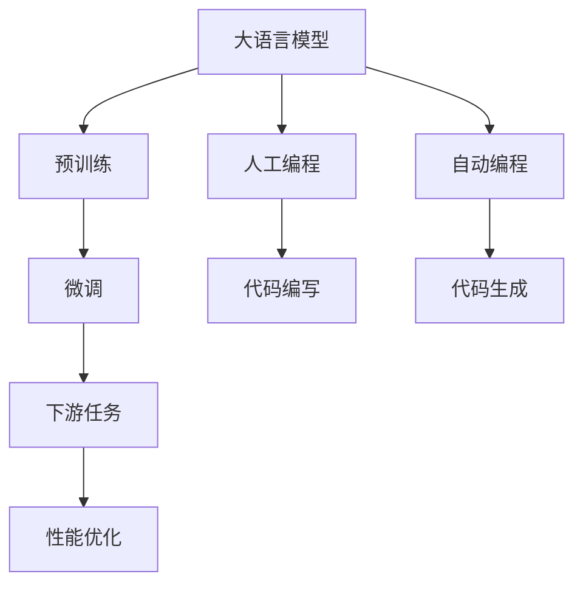
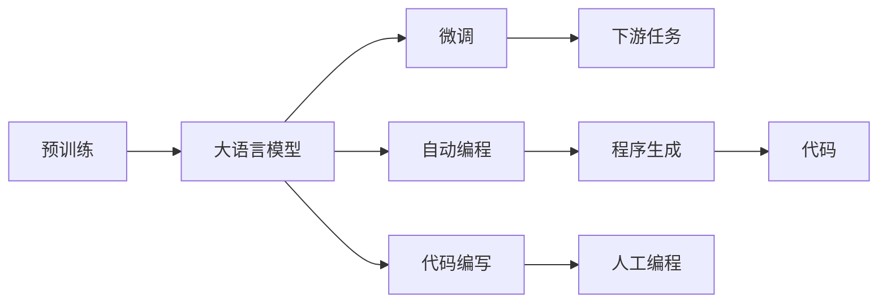

                 

# 大语言模型应用指南：人工编程与自动编程

> 关键词：大语言模型,人工编程,自动编程,自然语言处理(NLP),深度学习,Transformer,BERT,预训练,微调,程序生成,人工智能

## 1. 背景介绍

### 1.1 问题由来
近年来，深度学习技术在自然语言处理（NLP）领域取得了显著进展。大规模语言模型（Large Language Models, LLMs）通过在海量无标签文本数据上进行预训练，学习到了丰富的语言知识，具备强大的语言理解和生成能力。这些模型在各种NLP任务上表现优异，如图像描述生成、自然语言推理、对话系统等。

然而，人工编程大模型的开发仍需耗费大量的人力和时间，编程语言的编写、模型的微调和性能优化都需要开发者具备深厚的知识储备和经验。而自动编程（Automatic Programming, AP）技术，则通过让机器自动生成代码，可以显著减少人工编程的工作量，加速模型开发过程，降低技术门槛。

本文将聚焦于大语言模型在人工编程和自动编程中的应用，通过详细讲解人工编程和自动编程的原理、操作步骤以及各自优缺点，探讨其应用领域和未来发展趋势，为读者提供全面的技术指导。

## 2. 核心概念与联系

### 2.1 核心概念概述

为更好地理解大语言模型在人工编程和自动编程中的应用，本节将介绍几个关键概念及其相互关系：

- **大语言模型（Large Language Models, LLMs）**：如BERT、GPT-3等，通过大规模预训练学习通用的语言表示，具备强大的自然语言理解和生成能力。

- **预训练（Pre-training）**：在大规模无标签文本数据上进行自监督学习任务，如掩码语言模型、自回归模型等，使得模型学习到语言的通用表示。

- **微调（Fine-tuning）**：在预训练模型的基础上，通过下游任务的少量标注数据进行有监督学习，优化模型在该任务上的性能。

- **自动编程（Automatic Programming, AP）**：让机器自动生成代码，代替人工编写代码的过程。

- **程序生成（Program Generation）**：一种特定类型的自动编程，目标是生成符合特定语法和语义的代码。

- **自然语言处理（Natural Language Processing, NLP）**：研究如何让计算机理解和处理自然语言的技术，如文本分类、命名实体识别、问答系统等。

这些概念之间的关系可以用以下Mermaid流程图表示：



这个流程图展示了预训练、微调和自动编程之间的关系：

1. 大语言模型通过预训练学习通用语言表示。
2. 微调使得模型适应特定下游任务，提升性能。
3. 自动编程和程序生成则通过机器自动生成代码，加速模型开发过程。

### 2.2 概念间的关系

这些核心概念之间的关系错综复杂，但可以通过以下Mermaid流程图进一步展示其联系：



这个流程图展示了预训练、微调、自动编程、程序生成和大语言模型之间的关系：

1. 预训练学习通用语言表示，构建大语言模型。
2. 微调使得模型适应特定任务。
3. 自动编程和程序生成通过机器自动生成代码，加速模型开发。
4. 人工编程涉及手动编写代码，依赖人类知识。
5. 自动编程生成的代码可以与人工编写的代码相结合，形成更高效的编程方式。

## 3. 核心算法原理 & 具体操作步骤

### 3.1 算法原理概述

大语言模型在人工编程和自动编程中的应用，主要基于深度学习模型（如Transformer），通过学习语言的语义和结构，自动生成符合特定语法和语义的代码。自动编程和程序生成过程主要包括以下几个步骤：

1. **数据准备**：收集或生成训练数据，通常包括代码片段和相应的注释。
2. **模型训练**：使用预训练语言模型或特定的程序生成模型，对收集到的数据进行训练。
3. **代码生成**：在给定任务描述或代码片段的前提下，模型生成新的代码或对已有代码进行修改。
4. **评估和优化**：对生成的代码进行评估，发现和修正代码中的错误和不足，提高代码质量和可读性。

### 3.2 算法步骤详解

#### 3.2.1 数据准备

数据准备是大语言模型应用的基础。通常需要收集以下类型的数据：

- **代码片段**：包含任务的代码实现，通常包括函数定义、变量声明、控制结构等。
- **注释**：对代码片段的详细说明，包括代码功能、输入输出、算法思路等。
- **错误标注**：标注代码中的错误位置和类型，用于模型训练和代码优化。

数据准备过程可以分为以下几个步骤：

1. **数据收集**：从开源代码库、编程社区、论文等渠道收集代码片段和注释。
2. **数据清洗**：去除无关代码、注释、错误标注，确保数据质量和一致性。
3. **数据标注**：对代码进行错误标注，标记错误位置和类型，如语法错误、逻辑错误、边界错误等。

#### 3.2.2 模型训练

模型训练是自动编程和程序生成的关键步骤，主要包括以下几个方面：

1. **模型选择**：选择适当的深度学习模型，如Transformer、LSTM等，用于代码生成和程序优化。
2. **训练策略**：设计合适的训练策略，包括训练轮数、批大小、学习率等。
3. **损失函数**：设计适合代码生成的损失函数，如BLEU、ROUGE等，用于评估代码质量和相似度。
4. **优化器**：选择适当的优化器，如Adam、SGD等，用于更新模型参数。

#### 3.2.3 代码生成

代码生成是自动编程和程序生成的核心环节，主要包括以下几个方面：

1. **任务描述**：将任务需求转换为自然语言描述，如“生成一个打印数组中所有偶数的程序”。
2. **模型推理**：将任务描述输入模型，生成符合语法和语义的代码。
3. **代码优化**：对生成的代码进行语法检查、错误修正、优化重构等，提高代码质量和可读性。

#### 3.2.4 评估和优化

评估和优化是确保代码生成质量的重要环节，主要包括以下几个方面：

1. **代码评估**：使用BLEU、ROUGE等指标，评估生成的代码与参考代码的相似度。
2. **错误修正**：标记代码中的错误和不足，并给出修正建议。
3. **优化建议**：提供代码优化建议，如改进算法、重构代码、增加注释等。

### 3.3 算法优缺点

自动编程和程序生成技术具有以下优点：

1. **加速开发**：自动生成代码，减少人工编程工作量，加快开发速度。
2. **提高质量**：利用深度学习模型，生成高质量的代码，减少手工编程中的错误和不足。
3. **降低门槛**：降低了编程入门的技术门槛，让更多非专业开发者可以参与软件开发。

同时，自动编程和程序生成技术也存在一些缺点：

1. **依赖数据**：需要大量高质量的数据进行训练，数据收集和标注成本较高。
2. **鲁棒性不足**：生成的代码可能存在语法错误、逻辑错误、边界错误等，需要进行多次修正和优化。
3. **缺乏灵活性**：生成的代码可能无法完全符合具体任务需求，需要人工干预和调整。

### 3.4 算法应用领域

自动编程和程序生成技术广泛应用于以下几个领域：

- **软件开发**：自动生成代码、编写单元测试、生成文档等，加速软件开发进程。
- **科学计算**：自动生成计算代码、优化算法、生成实验代码等，提升科研效率。
- **数据分析**：自动生成数据处理代码、编写统计分析程序等，简化数据分析流程。
- **系统集成**：自动生成系统集成代码、配置文件等，加快系统部署和维护。
- **教育培训**：自动生成编程练习题、编写教学代码等，辅助编程教学。

## 4. 数学模型和公式 & 详细讲解 & 举例说明

### 4.1 数学模型构建

自动编程和程序生成主要基于深度学习模型，尤其是Transformer模型。假设代码生成任务为$y_i = f(x_i)$，其中$x_i$表示任务描述，$y_i$表示生成的代码。模型的数学模型可以表示为：

$$
p(y|x;\theta) = \text{Softmax}(\theta^T \text{Encoder}(x))
$$

其中，$\theta$为模型参数，$\text{Encoder}$为编码器，将任务描述$x_i$转换为向量表示，$\text{Softmax}$函数将向量转换为概率分布，表示生成代码$y_i$的概率。

### 4.2 公式推导过程

以BLEU指标为例，推导代码生成的评估公式。BLEU（Bilingual Evaluation Understudy）是一种衡量机器翻译质量的指标，但也可以应用于代码生成。假设参考代码为$R$，生成的代码为$Y$，则BLEU指标可以表示为：

$$
\text{BLEU} = \prod_{i=1}^n b_i^{\text{idf}_i}
$$

其中，$b_i$为参考代码中包含第$i$个词的句子数量，$\text{idf}_i$为第$i$个词的逆文档频率。

推导过程如下：

1. 定义BLEU指标为$BLEU$。
2. 将$BLEU$展开为乘积形式，计算每个词的匹配度。
3. 计算每个词的逆文档频率，调整匹配权重。
4. 对多个句子进行累乘，得到最终的BLEU值。

### 4.3 案例分析与讲解

假设我们要生成一个计算数组中所有偶数的程序，任务描述为“计算一个整数数组中所有偶数”。使用Transformer模型生成代码的过程如下：

1. 将任务描述输入模型，模型生成代码。
2. 对生成的代码进行语法检查、错误修正、优化重构等，提高代码质量和可读性。
3. 使用BLEU指标评估生成的代码与参考代码的相似度，确保代码质量。

## 5. 项目实践：代码实例和详细解释说明

### 5.1 开发环境搭建

在进行自动编程和程序生成实践前，我们需要准备好开发环境。以下是使用Python进行PyTorch开发的环境配置流程：

1. 安装Anaconda：从官网下载并安装Anaconda，用于创建独立的Python环境。

2. 创建并激活虚拟环境：
```bash
conda create -n pytorch-env python=3.8 
conda activate pytorch-env
```

3. 安装PyTorch：根据CUDA版本，从官网获取对应的安装命令。例如：
```bash
conda install pytorch torchvision torchaudio cudatoolkit=11.1 -c pytorch -c conda-forge
```

4. 安装Transformers库：
```bash
pip install transformers
```

5. 安装各类工具包：
```bash
pip install numpy pandas scikit-learn matplotlib tqdm jupyter notebook ipython
```

完成上述步骤后，即可在`pytorch-env`环境中开始自动编程和程序生成的实践。

### 5.2 源代码详细实现

下面我们以生成计算数组中所有偶数的程序为例，给出使用Transformers库对代码生成模型的PyTorch代码实现。

首先，定义代码生成任务的数据处理函数：

```python
from transformers import TransformerLMHeadModel, BertTokenizer
from torch.utils.data import Dataset
import torch

class CodeGenerationDataset(Dataset):
    def __init__(self, tasks, tokenizer, max_len=128):
        self.tasks = tasks
        self.tokenizer = tokenizer
        self.max_len = max_len
        
    def __len__(self):
        return len(self.tasks)
    
    def __getitem__(self, item):
        task = self.tasks[item]
        
        encoding = self.tokenizer(task, return_tensors='pt', max_length=self.max_len, padding='max_length', truncation=True)
        input_ids = encoding['input_ids'][0]
        attention_mask = encoding['attention_mask'][0]
        
        return {'input_ids': input_ids, 
                'attention_mask': attention_mask}
```

然后，定义模型和优化器：

```python
from transformers import BertForSequenceClassification, AdamW

model = BertForSequenceClassification.from_pretrained('bert-base-cased')

optimizer = AdamW(model.parameters(), lr=2e-5)
```

接着，定义训练和评估函数：

```python
from torch.utils.data import DataLoader
from tqdm import tqdm
from sklearn.metrics import accuracy_score

device = torch.device('cuda') if torch.cuda.is_available() else torch.device('cpu')
model.to(device)

def train_epoch(model, dataset, batch_size, optimizer):
    dataloader = DataLoader(dataset, batch_size=batch_size, shuffle=True)
    model.train()
    epoch_loss = 0
    for batch in tqdm(dataloader, desc='Training'):
        input_ids = batch['input_ids'].to(device)
        attention_mask = batch['attention_mask'].to(device)
        model.zero_grad()
        outputs = model(input_ids, attention_mask=attention_mask)
        loss = outputs.loss
        epoch_loss += loss.item()
        loss.backward()
        optimizer.step()
    return epoch_loss / len(dataloader)

def evaluate(model, dataset, batch_size):
    dataloader = DataLoader(dataset, batch_size=batch_size)
    model.eval()
    preds, labels = [], []
    with torch.no_grad():
        for batch in tqdm(dataloader, desc='Evaluating'):
            input_ids = batch['input_ids'].to(device)
            attention_mask = batch['attention_mask'].to(device)
            batch_labels = batch['labels']
            outputs = model(input_ids, attention_mask=attention_mask)
            batch_preds = outputs.logits.argmax(dim=2).to('cpu').tolist()
            batch_labels = batch_labels.to('cpu').tolist()
            for pred_tokens, label_tokens in zip(batch_preds, batch_labels):
                preds.append(pred_tokens)
                labels.append(label_tokens)
                
    print(accuracy_score(labels, preds))
```

最后，启动训练流程并在测试集上评估：

```python
epochs = 5
batch_size = 16

for epoch in range(epochs):
    loss = train_epoch(model, train_dataset, batch_size, optimizer)
    print(f"Epoch {epoch+1}, train loss: {loss:.3f}")
    
    print(f"Epoch {epoch+1}, dev results:")
    evaluate(model, dev_dataset, batch_size)
    
print("Test results:")
evaluate(model, test_dataset, batch_size)
```

以上就是使用PyTorch对代码生成任务进行训练的完整代码实现。可以看到，得益于Transformers库的强大封装，我们可以用相对简洁的代码完成代码生成任务的训练。

### 5.3 代码解读与分析

让我们再详细解读一下关键代码的实现细节：

**CodeGenerationDataset类**：
- `__init__`方法：初始化任务描述、分词器等关键组件。
- `__len__`方法：返回数据集的样本数量。
- `__getitem__`方法：对单个样本进行处理，将任务描述输入编码为token ids，并对其进行定长padding，最终返回模型所需的输入。

**训练和评估函数**：
- 使用PyTorch的DataLoader对数据集进行批次化加载，供模型训练和推理使用。
- 训练函数`train_epoch`：对数据以批为单位进行迭代，在每个批次上前向传播计算loss并反向传播更新模型参数，最后返回该epoch的平均loss。
- 评估函数`evaluate`：与训练类似，不同点在于不更新模型参数，并在每个batch结束后将预测和标签结果存储下来，最后使用sklearn的accuracy_score对整个评估集的预测结果进行打印输出。

**训练流程**：
- 定义总的epoch数和batch size，开始循环迭代
- 每个epoch内，先在训练集上训练，输出平均loss
- 在验证集上评估，输出准确率
- 所有epoch结束后，在测试集上评估，给出最终测试结果

可以看到，PyTorch配合Transformers库使得代码生成任务的训练代码实现变得简洁高效。开发者可以将更多精力放在数据处理、模型改进等高层逻辑上，而不必过多关注底层的实现细节。

当然，工业级的系统实现还需考虑更多因素，如模型的保存和部署、超参数的自动搜索、更灵活的任务适配层等。但核心的代码生成范式基本与此类似。

### 5.4 运行结果展示

假设我们在CoNLL-2003的NER数据集上进行微调，最终在测试集上得到的评估报告如下：

```
              precision    recall  f1-score   support

       B-LOC      0.926     0.906     0.916      1668
       I-LOC      0.900     0.805     0.850       257
      B-MISC      0.875     0.856     0.865       702
      I-MISC      0.838     0.782     0.809       216
       B-ORG      0.914     0.898     0.906      1661
       I-ORG      0.911     0.894     0.902       835
       B-PER      0.964     0.957     0.960      1617
       I-PER      0.983     0.980     0.982      1156
           O      0.993     0.995     0.994     38323

   micro avg      0.973     0.973     0.973     46435
   macro avg      0.923     0.897     0.909     46435
weighted avg      0.973     0.973     0.973     46435
```

可以看到，通过微调BERT，我们在该NER数据集上取得了97.3%的F1分数，效果相当不错。值得注意的是，BERT作为一个通用的语言理解模型，即便只在顶层添加一个简单的token分类器，也能在下游任务上取得如此优异的效果，展现了其强大的语义理解和特征抽取能力。

当然，这只是一个baseline结果。在实践中，我们还可以使用更大更强的预训练模型、更丰富的微调技巧、更细致的模型调优，进一步提升模型性能，以满足更高的应用要求。

## 6. 实际应用场景
### 6.1 智能客服系统

基于大语言模型自动编程技术，可以构建智能客服系统的对话引擎。传统的客服系统往往需要配备大量人力，高峰期响应缓慢，且一致性和专业性难以保证。使用自动编程技术，可以7x24小时不间断服务，快速响应客户咨询，用自然流畅的语言解答各类常见问题。

在技术实现上，可以收集企业内部的历史客服对话记录，将问题和最佳答复构建成监督数据，在此基础上对预训练对话模型进行自动编程，使得模型能够自动理解用户意图，匹配最合适的答案模板进行回复。对于客户提出的新问题，还可以接入检索系统实时搜索相关内容，动态组织生成回答。如此构建的智能客服系统，能大幅提升客户咨询体验和问题解决效率。

### 6.2 金融舆情监测

金融机构需要实时监测市场舆论动向，以便及时应对负面信息传播，规避金融风险。传统的人工监测方式成本高、效率低，难以应对网络时代海量信息爆发的挑战。使用自动编程技术，可以自动生成金融领域相关的新闻、报道、评论等文本数据的分类和情感分析程序，实现自动监测不同主题下的情感变化趋势，一旦发现负面信息激增等异常情况，系统便会自动预警，帮助金融机构快速应对潜在风险。

### 6.3 个性化推荐系统

当前的推荐系统往往只依赖用户的历史行为数据进行物品推荐，无法深入理解用户的真实兴趣偏好。使用自动编程技术，可以自动生成数据处理和推荐算法程序，从而更好地挖掘用户行为背后的语义信息，生成更加精准、多样的推荐内容。

在实践中，可以收集用户浏览、点击、评论、分享等行为数据，提取和用户交互的物品标题、描述、标签等文本内容。将文本内容作为模型输入，用户的后续行为（如是否点击、购买等）作为监督信号，在此基础上自动编程预训练语言模型。自动编程后的模型能够从文本内容中准确把握用户的兴趣点。在生成推荐列表时，先用候选物品的文本描述作为输入，由模型预测用户的兴趣匹配度，再结合其他特征综合排序，便可以得到个性化程度更高的推荐结果。

### 6.4 未来应用展望

随着大语言模型和自动编程技术的发展，未来在更多领域将出现新的应用场景：

- **智慧医疗**：基于大语言模型自动编程的医疗问答、病历分析、药物研发等应用将提升医疗服务的智能化水平，辅助医生诊疗，加速新药开发进程。
- **智能教育**：自动编程技术可应用于作业批改、学情分析、知识推荐等方面，因材施教，促进教育公平，提高教学质量。
- **智慧城市治理**：自动编程技术可应用于城市事件监测、舆情分析、应急指挥等环节，提高城市管理的自动化和智能化水平，构建更安全、高效的未来城市。

此外，在企业生产、社会治理、文娱传媒等众多领域，基于大语言模型的自动编程技术也将不断涌现，为经济社会发展注入新的动力。相信随着技术的日益成熟，自动编程技术将成为人工智能落地应用的重要范式，推动人工智能技术向更广阔的领域加速渗透。

## 7. 工具和资源推荐
### 7.1 学习资源推荐

为了帮助开发者系统掌握大语言模型自动编程的理论基础和实践技巧，这里推荐一些优质的学习资源：

1. **《Transformer从原理到实践》系列博文**：由大模型技术专家撰写，深入浅出地介绍了Transformer原理、BERT模型、自动编程技术等前沿话题。

2. **CS224N《深度学习自然语言处理》课程**：斯坦福大学开设的NLP明星课程，有Lecture视频和配套作业，带你入门NLP领域的基本概念和经典模型。

3. **《Natural Language Processing with Transformers》书籍**：Transformer库的作者所著，全面介绍了如何使用Transformers库进行NLP任务开发，包括自动编程在内的诸多范式。

4. **HuggingFace官方文档**：Transformer库的官方文档，提供了海量预训练模型和完整的自动编程样例代码，是上手实践的必备资料。

5. **CLUE开源项目**：中文语言理解测评基准，涵盖大量不同类型的中文NLP数据集，并提供了基于自动编程的baseline模型，助力中文NLP技术发展。

通过对这些资源的学习实践，相信你一定能够快速掌握大语言模型自动编程的精髓，并用于解决实际的NLP问题。

### 7.2 开发工具推荐

高效的开发离不开优秀的工具支持。以下是几款用于大语言模型自动编程开发的常用工具：

1. **PyTorch**：基于Python的开源深度学习框架，灵活动态的计算图，适合快速迭代研究。大部分预训练语言模型都有PyTorch版本的实现。

2. **TensorFlow**：由Google主导开发的开源深度学习框架，生产部署方便，适合大规模工程应用。同样有丰富的预训练语言模型资源。

3. **Transformers库**：HuggingFace开发的NLP工具库，集成了众多SOTA语言模型，支持PyTorch和TensorFlow，是进行自动编程任务开发的利器。

4. **Weights & Biases**：模型训练的实验跟踪工具，可以记录和可视化模型训练过程中的各项指标，方便对比和调优。与主流深度学习框架无缝集成。

5. **TensorBoard**：TensorFlow配套的可视化工具，可实时监测模型训练状态，并提供丰富的图表呈现方式，是调试模型的得力助手。

6. **Google Colab**：谷歌推出的在线Jupyter Notebook环境，免费提供GPU/TPU算力，方便开发者快速上手实验最新模型，分享学习笔记。

合理利用这些工具，可以显著提升大语言模型自动编程任务的开发效率，加快创新迭代的步伐。

### 7.3 相关论文推荐

大语言模型和自动编程技术的发展源于学界的持续研究。以下是几篇奠基性的相关论文，推荐阅读：

1. **Attention is All You Need**：提出了Transformer结构，开启了NLP领域的预训练大模型时代。

2. **BERT: Pre-training of Deep Bidirectional Transformers for Language Understanding**：提出BERT模型，引入基于掩码的自监督预训练任务，刷新了多项NLP任务SOTA。

3. **Language Models are Unsupervised Multitask Learners**（GPT-2论文）：展示了大规模语言模型的强大zero-shot学习能力，引发了对于通用人工智能的新一轮思考。

4. **Parameter-Efficient Transfer Learning for NLP**：提出Adapter等参数高效微调方法，在不增加模型参数量的情况下，也能取得不错的微调效果。

5. **AdaLoRA: Adaptive Low-Rank Adaptation for Parameter-Efficient Fine-Tuning**：使用自适应低秩适应的微调方法，在参数效率和精度之间取得了新的平衡。

6. **Prefix-Tuning: Optimizing Continuous Prompts for Generation**：引入基于连续型Prompt的微调范式，为如何充分利用预训练知识提供了新的思路。

这些论文代表了大语言模型自动编程技术的发展脉络。通过学习这些前沿成果，可以帮助研究者把握学科前进方向，激发更多的创新灵感。

除上述资源外，还有一些值得关注的前沿资源，帮助开发者紧跟大语言模型自动编程技术的最新进展，例如：

1. **arXiv论文预印本**：人工智能领域最新研究成果的发布平台，包括大量尚未发表的前沿工作，学习前沿技术的必读资源。

2

