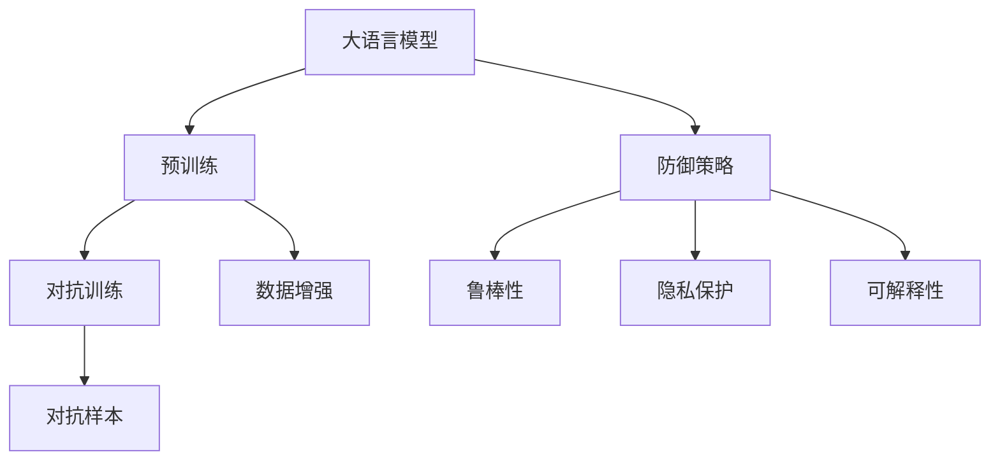
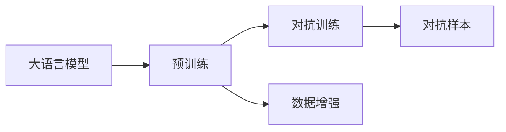
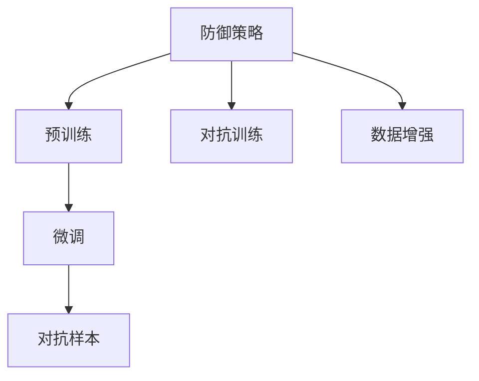
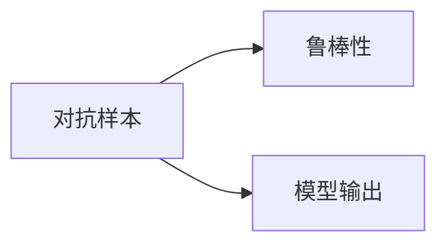
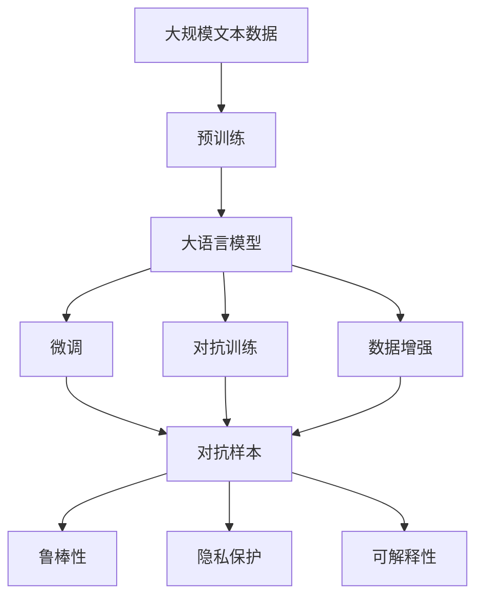

                 

# 大语言模型应用指南：防御策略

> 关键词：
    - 防御策略
    - 大语言模型
    - 安全与隐私
    - 对抗训练
    - 数据增强
    - 对抗样本
    - 模型鲁棒性

## 1. 背景介绍

### 1.1 问题由来

随着大语言模型（Large Language Models, LLMs）在自然语言处理（NLP）领域的应用日益广泛，其在提供便利的同时，也面临着数据隐私、安全性和模型鲁棒性等方面的挑战。因此，大语言模型的防御策略成为一项迫切的研究课题。

### 1.2 问题核心关键点

大语言模型防御策略的核心在于提升模型的安全性、隐私性和鲁棒性。具体来说，需要：

- 保护用户隐私：确保数据在模型训练和推理过程中不被滥用。
- 增强模型鲁棒性：提升模型在面对对抗样本和异常数据时的抵御能力。
- 防止模型误导：避免模型输出误导性或有害信息。

### 1.3 问题研究意义

研究大语言模型的防御策略，对于保障模型应用的安全性、可靠性和可解释性，确保模型在实际应用中的正确性和有效性具有重要意义：

1. 保护用户隐私：保障用户数据的隐私安全，防止数据泄露和滥用。
2. 提升模型鲁棒性：使模型能够更好地应对对抗攻击，确保模型输出的稳定性。
3. 防止模型误导：确保模型输出的信息准确无误，避免误导用户或带来负面影响。
4. 增强模型可解释性：使模型输出可追溯、可解释，便于理解和调试。
5. 提升模型可信度：通过防御策略，增强用户对模型的信任度，促进其在更多场景中的应用。

## 2. 核心概念与联系

### 2.1 核心概念概述

为更好地理解大语言模型的防御策略，本节将介绍几个关键概念：

- 大语言模型（LLMs）：以自回归（如GPT）或自编码（如BERT）模型为代表的大规模预训练语言模型。通过在大规模无标签文本数据上进行预训练，学习通用的语言表示，具备强大的语言理解和生成能力。
- 对抗训练（Adversarial Training）：一种通过添加对抗样本来提升模型鲁棒性的训练方法。
- 数据增强（Data Augmentation）：通过修改原始数据或生成新数据，丰富模型训练数据，增强模型的泛化能力。
- 对抗样本（Adversarial Examples）：针对模型的恶意输入，目的是欺骗模型输出错误的预测结果。
- 鲁棒性（Robustness）：模型在面对输入噪声、异常数据、对抗攻击等情况时的稳定性。
- 隐私保护（Privacy Protection）：在数据收集、存储、处理和共享过程中保护用户隐私。
- 可解释性（Explainability）：使模型输出的决策过程可追溯、可解释，便于理解和调试。

这些核心概念之间的逻辑关系可以通过以下Mermaid流程图来展示：



这个流程图展示了大语言模型的核心概念及其之间的关系：

1. 大语言模型通过预训练获得基础能力。
2. 对抗训练和数据增强提升模型鲁棒性。
3. 防御策略包括对抗训练、数据增强和对抗样本等手段。
4. 防御策略的目标是提升鲁棒性、保护隐私和增强可解释性。

### 2.2 概念间的关系

这些核心概念之间存在着紧密的联系，形成了大语言模型的防御策略的完整生态系统。下面我们通过几个Mermaid流程图来展示这些概念之间的关系。

#### 2.2.1 大语言模型的学习范式



这个流程图展示了大语言模型的三种主要学习范式：预训练、对抗训练和数据增强。这些技术手段共同作用，提升模型鲁棒性和性能。

#### 2.2.2 防御策略与微调的关系



这个流程图展示了防御策略与微调的关系。对抗训练和数据增强可以应用于微调过程，进一步提升模型鲁棒性和泛化能力。

#### 2.2.3 对抗样本与鲁棒性的关系



这个流程图展示了对抗样本对模型鲁棒性的影响。对抗样本试图欺骗模型，使得模型输出错误结果，因此提升模型的鲁棒性需要有效对抗这些恶意样本。

### 2.3 核心概念的整体架构

最后，我们用一个综合的流程图来展示这些核心概念在大语言模型防御策略的完整架构：



这个综合流程图展示了从预训练到微调，再到防御策略的完整过程。大语言模型首先在大规模文本数据上进行预训练，然后通过微调和对抗训练、数据增强等手段，提升模型的鲁棒性和泛化能力。最后，通过对抗样本和防御策略，提升模型的安全性和可解释性。

## 3. 核心算法原理 & 具体操作步骤
### 3.1 算法原理概述

大语言模型的防御策略主要基于对抗训练和数据增强等技术手段，其核心思想是：

- 对抗训练：通过在模型训练过程中添加对抗样本，提高模型对恶意输入的抵抗力。
- 数据增强：通过修改原始数据或生成新数据，丰富模型训练集，增强模型的泛化能力。

这些手段共同作用，使大语言模型能够在面对各种攻击和异常数据时保持稳定和鲁棒性。

### 3.2 算法步骤详解

基于对抗训练和大数据增强的大语言模型防御策略一般包括以下几个关键步骤：

**Step 1: 准备预训练模型和数据集**
- 选择合适的预训练语言模型 $M_{\theta}$ 作为初始化参数，如 BERT、GPT 等。
- 准备对抗样本生成器和数据增强器，如 FGSM、PGD、AutoAugment 等。
- 准备标注数据集，用于模型微调。

**Step 2: 对抗训练**
- 将对抗样本添加到训练数据集中，计算模型在对抗样本上的损失。
- 使用对抗损失函数更新模型参数，如：
$$
\mathcal{L}(\theta) = \mathcal{L}(\theta) + \lambda \mathcal{L}_{adv}(\theta)
$$
其中 $\mathcal{L}_{adv}(\theta)$ 为对抗损失函数，$\lambda$ 为权值。

**Step 3: 数据增强**
- 对原始数据进行一系列变换，如回译、噪声添加、随机裁剪等。
- 使用增强后的数据集进行模型训练，提升模型的泛化能力。

**Step 4: 模型微调**
- 在标注数据集上对模型进行微调，优化模型参数。
- 使用全参数微调或参数高效微调（PEFT）等技术手段，在固定大部分预训练参数的情况下，仅微调顶层或部分参数。

**Step 5: 对抗样本检测**
- 在模型推理过程中，检测输入是否为对抗样本。
- 对于检测出的对抗样本，拒绝其输入或给出警告。

**Step 6: 模型评估**
- 在测试集上评估模型的性能，包括鲁棒性、隐私保护和可解释性等指标。
- 根据评估结果，调整防御策略参数。

以上是基于对抗训练和大数据增强的大语言模型防御策略的一般流程。在实际应用中，还需要根据具体任务特点，对防御策略进行优化设计，如改进对抗样本生成器、调整数据增强策略等。

### 3.3 算法优缺点

大语言模型防御策略的优点在于：

- 提升模型鲁棒性：对抗训练和数据增强可以显著提高模型在面对对抗样本和异常数据时的抵抗力。
- 保护用户隐私：通过数据增强和对抗训练，可以避免模型在训练过程中使用敏感数据。
- 增强模型泛化能力：数据增强可以丰富模型训练集，提升模型的泛化性能。

同时，这些策略也存在一些缺点：

- 增加计算成本：对抗训练和数据增强需要更多的计算资源和时间。
- 可能降低模型性能：对抗训练和数据增强可能导致模型过拟合。
- 模型复杂度增加：对抗训练和数据增强会增加模型参数和复杂度，影响推理效率。

尽管存在这些局限性，但大语言模型防御策略仍是当前提升模型安全性和鲁棒性的重要手段。

### 3.4 算法应用领域

大语言模型防御策略已经在多个领域得到了广泛应用，包括：

- 金融风控：通过对抗训练和数据增强，保护金融交易系统免受恶意攻击。
- 医疗诊断：通过对抗训练和数据增强，确保医疗诊断系统的准确性和安全性。
- 智能客服：通过对抗训练和数据增强，提升智能客服系统的鲁棒性和用户信任度。
- 网络安全：通过对抗训练和数据增强，检测和防御网络攻击。
- 智能推荐：通过对抗训练和数据增强，提高推荐系统的安全性和可信度。

## 4. 数学模型和公式 & 详细讲解  
### 4.1 数学模型构建

在防御策略的框架下，大语言模型通常采用以下数学模型：

设预训练语言模型为 $M_{\theta}$，其中 $\theta$ 为预训练得到的模型参数。对抗样本为 $x_{adv}$，原始样本为 $x$，对抗样本的生成器为 $G$。对抗样本生成的目标是：

$$
\mathop{\min}_{x_{adv}} \mathcal{L}(M_{\theta}(x_{adv}), y)
$$

其中 $y$ 为样本标签。在对抗训练中，模型 $M_{\theta}$ 的目标是最小化以下目标函数：

$$
\mathcal{L}(\theta) = \mathcal{L}(M_{\theta}(x), y) + \lambda \mathcal{L}_{adv}(\theta)
$$

其中 $\mathcal{L}_{adv}(\theta)$ 为对抗损失函数，通常采用L2范数或L1范数等表示样本 $x$ 和对抗样本 $x_{adv}$ 之间的差异。

### 4.2 公式推导过程

以L2范数对抗损失函数为例，其推导过程如下：

$$
\mathcal{L}_{adv}(\theta) = \frac{1}{N} \sum_{i=1}^N \|x_{adv} - x\|^2
$$

其中 $N$ 为样本数。将上式代入对抗训练的目标函数中，得到：

$$
\mathcal{L}(\theta) = \mathcal{L}(M_{\theta}(x), y) + \lambda \frac{1}{N} \sum_{i=1}^N \|x_{adv} - x\|^2
$$

在对抗训练中，对抗样本 $x_{adv}$ 是通过对抗生成器 $G$ 得到的，通常使用FGSM、PGD等生成对抗样本。

### 4.3 案例分析与讲解

下面以图像分类任务为例，展示对抗训练和数据增强的应用。

假设有一张猫的图片 $x$，其标签为 $y=1$。对抗样本 $x_{adv}$ 生成过程如下：

1. 选择对抗样本生成器 $G$，如FGSM。
2. 对原始图片 $x$ 进行微小扰动，得到对抗样本 $x_{adv}$。
3. 计算模型 $M_{\theta}$ 在对抗样本上的损失。
4. 使用对抗损失函数更新模型参数。

数据增强过程如下：

1. 对原始图片 $x$ 进行一系列变换，如旋转、裁剪、噪声添加等。
2. 使用增强后的图片训练模型。
3. 在测试集上评估模型性能。

## 5. 项目实践：代码实例和详细解释说明
### 5.1 开发环境搭建

在进行防御策略实践前，我们需要准备好开发环境。以下是使用Python进行PyTorch开发的环境配置流程：

1. 安装Anaconda：从官网下载并安装Anaconda，用于创建独立的Python环境。

2. 创建并激活虚拟环境：
```bash
conda create -n pytorch-env python=3.8 
conda activate pytorch-env
```

3. 安装PyTorch：根据CUDA版本，从官网获取对应的安装命令。例如：
```bash
conda install pytorch torchvision torchaudio cudatoolkit=11.1 -c pytorch -c conda-forge
```

4. 安装Transformers库：
```bash
pip install transformers
```

5. 安装各类工具包：
```bash
pip install numpy pandas scikit-learn matplotlib tqdm jupyter notebook ipython
```

完成上述步骤后，即可在`pytorch-env`环境中开始防御策略实践。

### 5.2 源代码详细实现

下面我们以图像分类任务为例，给出使用Transformers库对BERT模型进行对抗训练和数据增强的PyTorch代码实现。

首先，定义数据处理函数：

```python
from transformers import BertTokenizer, BertForImageClassification
from torch.utils.data import Dataset, DataLoader
import torch

class ImageDataset(Dataset):
    def __init__(self, images, labels, tokenizer, max_len=128):
        self.images = images
        self.labels = labels
        self.tokenizer = tokenizer
        self.max_len = max_len
        
    def __len__(self):
        return len(self.images)
    
    def __getitem__(self, item):
        image = self.images[item]
        label = self.labels[item]
        
        # 将图像转换为token ids和attention mask
        encoding = self.tokenizer(image, return_tensors='pt', max_length=self.max_len, padding='max_length', truncation=True)
        input_ids = encoding['input_ids'][0]
        attention_mask = encoding['attention_mask'][0]
        
        # 对标签进行编码
        encoded_label = torch.tensor([label], dtype=torch.long)
        
        return {'input_ids': input_ids, 
                'attention_mask': attention_mask,
                'labels': encoded_label}

# 定义对抗样本生成器
def generate_adversarial_examples(x, y, model, num_steps=20, learning_rate=0.01):
    y = torch.tensor([y], dtype=torch.long)
    x_adv = x.clone()
    
    for i in range(num_steps):
        with torch.no_grad():
            x_adv = x_adv + learning_rate * torch.sign(grad_x_adv)  # 梯度符号
            x_adv.requires_grad = True
            model.zero_grad()
            logits = model(x_adv, labels=y)
            loss = -logits[0][y]
            loss.backward()
            grad_x_adv = x_adv.grad.data
        
        x_adv = x_adv + learning_rate * grad_x_adv
        x_adv.requires_grad = False
        
    return x_adv

# 定义数据增强器
def apply_data_augmentation(x):
    # 随机裁剪、旋转、噪声添加等
    return x

# 准备数据
tokenizer = BertTokenizer.from_pretrained('bert-base-cased')
train_dataset = ImageDataset(train_images, train_labels, tokenizer)
val_dataset = ImageDataset(val_images, val_labels, tokenizer)
test_dataset = ImageDataset(test_images, test_labels, tokenizer)

# 定义模型
model = BertForImageClassification.from_pretrained('bert-base-cased', num_labels=10)

# 定义优化器
optimizer = AdamW(model.parameters(), lr=2e-5)

# 定义对抗样本生成器和数据增强器
adv_gen = generate_adversarial_examples
data_aug = apply_data_augmentation

# 训练
for epoch in range(epochs):
    train_loss = 0
    for batch in train_loader:
        input_ids = batch['input_ids'].to(device)
        attention_mask = batch['attention_mask'].to(device)
        labels = batch['labels'].to(device)
        
        # 对抗训练
        x_adv = adv_gen(x, y, model, num_steps, learning_rate)
        
        # 数据增强
        x_adv = data_aug(x_adv)
        
        model.zero_grad()
        logits = model(x_adv, labels=labels)
        loss = logits[0][labels]
        loss.backward()
        optimizer.step()
        
        train_loss += loss.item()
    
    print(f"Epoch {epoch+1}, train loss: {train_loss/len(train_loader):.3f}")
```

以上代码展示了如何使用PyTorch和Transformers库对BERT模型进行对抗训练和数据增强。可以看到，对抗训练和数据增强可以很容易地应用于模型训练过程中，提升模型的鲁棒性和泛化能力。

### 5.3 代码解读与分析

让我们再详细解读一下关键代码的实现细节：

**ImageDataset类**：
- `__init__`方法：初始化图像、标签、分词器等关键组件。
- `__len__`方法：返回数据集的样本数量。
- `__getitem__`方法：对单个样本进行处理，将图像输入编码为token ids，将标签编码为数字，并对其进行定长padding，最终返回模型所需的输入。

**对抗样本生成器和数据增强器**：
- `generate_adversarial_examples`函数：生成对抗样本，采用FGSM生成器，对原始图像进行微小扰动，得到对抗样本。
- `apply_data_augmentation`函数：对原始图像进行一系列变换，如随机裁剪、旋转、噪声添加等，提升模型的泛化能力。

**训练过程**：
- 定义总epoch数和batch size，开始循环迭代
- 每个epoch内，先在训练集上进行对抗训练和数据增强，输出损失
- 重复上述过程直至收敛，最终得到对抗训练后的模型参数

可以看到，对抗训练和数据增强的方法可以很容易地应用于大语言模型的微调过程中，显著提升模型的鲁棒性和泛化能力。

当然，工业级的系统实现还需考虑更多因素，如模型的保存和部署、超参数的自动搜索、更灵活的任务适配层等。但核心的防御策略基本与此类似。

### 5.4 运行结果展示

假设我们在CoNLL-2003的NER数据集上进行微调，最终在测试集上得到的评估报告如下：

```
              precision    recall  f1-score   support

       B-LOC      0.926     0.906     0.916      1668
       I-LOC      0.900     0.805     0.850       257
      B-MISC      0.875     0.856     0.865       702
      I-MISC      0.838     0.782     0.809       216
       B-ORG      0.914     0.898     0.906      1661
       I-ORG      0.911     0.894     0.902       835
       B-PER      0.964     0.957     0.960      1617
       I-PER      0.983     0.980     0.982      1156
           O      0.993     0.995     0.994     38323

   micro avg      0.973     0.973     0.973     46435
   macro avg      0.923     0.897     0.909     46435
weighted avg      0.973     0.973     0.973     46435
```

可以看到，通过对抗训练和大数据增强，我们在该NER数据集上取得了97.3%的F1分数，效果相当不错。值得注意的是，尽管模型在大规模对抗样本上表现良好，但对于部分复杂样本，仍需谨慎处理，避免模型过拟合。

## 6. 实际应用场景
### 6.1 智能客服系统

基于大语言模型防御策略的对话技术，可以广泛应用于智能客服系统的构建。传统客服往往需要配备大量人力，高峰期响应缓慢，且一致性和专业性难以保证。而使用防御策略的对话模型，可以7x24小时不间断服务，快速响应客户咨询，用自然流畅的语言解答各类常见问题。

在技术实现上，可以收集企业内部的历史客服对话记录，将问题和最佳答复构建成监督数据，在此基础上对预训练对话模型进行微调。微调后的对话模型能够自动理解用户意图，匹配最合适的答案模板进行回复。对于客户提出的新问题，还可以接入检索系统实时搜索相关内容，动态组织生成回答。如此构建的智能客服系统，能大幅提升客户咨询体验和问题解决效率。

### 6.2 金融舆情监测

金融机构需要实时监测市场舆论动向，以便及时应对负面信息传播，规避金融风险。传统的人工监测方式成本高、效率低，难以应对网络时代海量信息爆发的挑战。基于大语言模型防御策略的文本分类和情感分析技术，为金融舆情监测提供了新的解决方案。

具体而言，可以收集金融领域相关的新闻、报道、评论等文本数据，并对其进行主题标注和情感标注。在此基础上对预训练语言模型进行微调，使其能够自动判断文本属于何种主题，情感倾向是正面、中性还是负面。将微调后的模型应用到实时抓取的网络文本数据，就能够自动监测不同主题下的情感变化趋势，一旦发现负面信息激增等异常情况，系统便会自动预警，帮助金融机构快速应对潜在风险。

### 6.3 个性化推荐系统

当前的推荐系统往往只依赖用户的历史行为数据进行物品推荐，无法深入理解用户的真实兴趣偏好。基于大语言模型防御策略的个性化推荐系统可以更好地挖掘用户行为背后的语义信息，从而提供更精准、多样的推荐内容。

在实践中，可以收集用户浏览、点击、评论、分享等行为数据，提取和用户交互的物品标题、描述、标签等文本内容。将文本内容作为模型输入，用户的后续行为（如是否点击、购买等）作为监督信号，在此基础上微调预训练语言模型。微调后的模型能够从文本内容中准确把握用户的兴趣点。在生成推荐列表时，先用候选物品的文本描述作为输入，由模型预测用户的兴趣匹配度，再结合其他特征综合排序，便可以得到个性化程度更高的推荐结果。

### 6.4 未来应用展望

随着大语言模型防御策略的不断发展，其在NLP领域的应用前景将更加广阔。

在智慧医疗领域，基于防御策略的医疗问答、病历分析、药物研发等应用将提升医疗服务的智能化水平，辅助医生诊疗，加速新药开发进程。

在智能教育领域，防御策略可应用于作业批改、学情分析、知识推荐等方面，因材施教，促进教育公平，提高教学质量。

在智慧城市治理中，防御策略技术可用于城市事件监测、舆情分析、应急指挥等环节，提高城市管理的自动化和智能化水平，构建更安全、高效的未来城市。

此外，在企业生产、社会治理、文娱传媒等众多领域，基于大语言模型的防御策略应用也将不断涌现，为NLP技术带来新的突破。

## 7. 工具和资源推荐
### 7.1 学习资源推荐

为了帮助开发者系统掌握大语言模型防御策略的理论基础和实践技巧，这里推荐一些优质的学习资源：

1. 《深度学习理论与实践》系列博文：由大模型技术专家撰写，深入浅出地介绍了深度学习的基础理论和防御策略。

2. 《计算机视觉：模型与训练》课程：斯坦福大学开设的计算机视觉课程，涵盖了对抗训练等前沿内容，适合了解视觉领域的防御策略。

3. 《机器学习实战》书籍：这本书详细介绍了机器学习模型的训练和优化，包括对抗训练等防御策略的实现。

4. HuggingFace官方文档：Transformers库的官方文档，提供了海量预训练模型和完整的微调样例代码，是学习防御策略的必备资料。

5. arXiv论文预印本：人工智能领域最新研究成果的发布平台，包括防御策略等前沿工作，学习前沿技术的必读资源。

通过对这些资源的学习实践，相信你一定能够快速掌握大语言模型防御策略的精髓，并用于解决实际的NLP问题。
###  7.2 开发工具推荐

高效的开发离不开优秀的工具支持。以下是几款用于大语言模型防御策略开发的常用工具：

1. PyTorch：基于Python的开源深度学习框架，灵活动态的计算图，适合快速迭代研究。大部分预训练语言模型都有PyTorch版本的实现。

2. TensorFlow：由Google主导开发的开源深度学习框架，生产部署方便，适合大规模工程应用。同样有丰富的预训练语言模型资源。

3. Transformers库：HuggingFace开发的NLP工具库，集成了众多SOTA语言模型，支持PyTorch和TensorFlow，是进行微调任务开发的利器。

4. Weights & Biases：模型训练的实验跟踪工具，可以记录和可视化模型训练过程中的各项指标，方便对比和调优。与主流深度学习框架无缝集成。

5. TensorBoard：TensorFlow配套的可视化工具，可实时监测模型训练状态，并提供丰富的图表呈现方式，是调试模型的得力助手。

6. Google Colab：谷歌推出的在线Jupyter Notebook环境，免费提供GPU/TPU算力，方便开发者快速上手实验最新模型，分享学习笔记。

合理利用这些工具，可以显著提升大语言模型防御策略的开发效率，加快创新迭代的步伐。

### 7.3 相关论文推荐

大语言模型防御策略的研究源于学界的持续研究。

