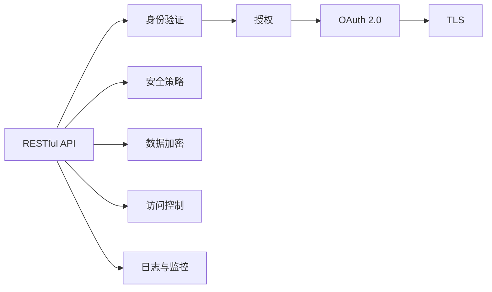

                 

# 安全 API 设计的 12 个要点

> 关键词：API 设计, 安全, 安全 API, RESTful API, 安全漏洞, 安全策略

## 1. 背景介绍

在当今数字化时代，API（Application Programming Interface，应用编程接口）成为了连接不同系统和应用的重要桥梁。API的安全性直接关系到系统的可靠性和数据的完整性，因此，在设计API时，安全性是一个不可或缺的考量因素。

API的设计必须遵循安全性原则，以保护数据免受未授权的访问、篡改和泄漏。随着API的广泛应用，安全问题也日益凸显。据统计，超过70%的API攻击来自第三方API，且攻击手段越来越复杂。

为了应对这些挑战，API的设计者需要考虑如何防范各种攻击，并确保API的安全性和可靠性。本文将从核心概念、算法原理、操作步骤、数学模型等多个方面，详细介绍API设计的12个要点。

## 2. 核心概念与联系

### 2.1 核心概念概述

在设计安全API时，需要重点关注以下概念：

- **API**：应用程序编程接口，用于连接不同系统和应用。
- **RESTful API**：一种基于HTTP协议的API设计风格，具有无状态、客户端-服务器、统一接口等特性。
- **安全漏洞**：如SQL注入、跨站脚本（XSS）、跨站请求伪造（CSRF）等，可通过攻击者利用漏洞获取敏感信息或执行恶意操作。
- **安全策略**：如身份验证、授权、数据加密、访问控制等，用于防范各种安全威胁。
- **OAuth 2.0**：一种基于令牌的安全认证协议，用于保护API的访问控制。
- **TLS**：传输层安全协议，用于加密API的传输数据。

这些核心概念构成了安全API设计的框架，设计者需要从这些概念出发，综合考虑API的各个方面，以确保API的安全性和可靠性。

### 2.2 概念间的关系

设计安全API时，需要综合考虑这些核心概念，以确保API的安全性和可靠性。下图展示了这些概念之间的关系：



这些概念构成了安全API设计的框架，设计者需要从这些概念出发，综合考虑API的各个方面，以确保API的安全性和可靠性。

## 3. 核心算法原理 & 具体操作步骤

### 3.1 算法原理概述

设计安全API时，需要遵循一些基本的算法原理，以确保API的安全性和可靠性。

- **身份验证**：用于验证用户的身份，防止未授权访问。
- **授权**：用于授权用户访问API的特定资源或操作。
- **OAuth 2.0**：一种安全的认证协议，用于保护API的访问控制。
- **TLS**：传输层安全协议，用于加密API的传输数据。

### 3.2 算法步骤详解

以下是设计安全API的具体操作步骤：

**Step 1: 需求分析**
- 分析API的需求，确定需要保护的数据和资源。
- 确定API的访问模式，如只读、读写、认证等。

**Step 2: 设计安全策略**
- 设计身份验证策略，如密码、令牌、双因素认证等。
- 设计授权策略，如基于角色的访问控制（RBAC）、基于资源的访问控制（ABAC）等。
- 设计数据加密策略，如SSL/TLS加密、数据脱敏等。

**Step 3: 实现API设计**
- 设计RESTful API的接口，遵循RESTful API的规范。
- 实现API的身份验证和授权逻辑，确保API的访问控制。
- 实现数据加密和访问控制策略，确保数据的安全性。

**Step 4: 测试与优化**
- 对API进行安全测试，模拟各种攻击手段。
- 根据测试结果，优化API的设计和实现。

**Step 5: 部署与监控**
- 部署API到生产环境，并设置监控系统。
- 实时监控API的运行状态，及时发现并修复安全漏洞。

### 3.3 算法优缺点

设计安全API时，需要综合考虑算法优缺点，以确保API的安全性和可靠性。

**优点**：
- 遵循RESTful API的设计规范，具有无状态、客户端-服务器、统一接口等特性。
- 采用OAuth 2.0协议，提高了API的访问控制安全性。
- 采用TLS协议，提高了API的传输数据安全性。

**缺点**：
- 设计复杂，需要考虑各种安全策略和算法。
- 需要投入大量时间和资源进行安全测试和优化。
- 需要不断更新和维护API，以应对新的安全威胁。

### 3.4 算法应用领域

安全API设计应用于各种需要连接不同系统和应用的场景，如：

- 云服务平台：如AWS、Google Cloud等。
- 移动应用：如微信、支付宝等。
- 电子商务平台：如淘宝、京东等。
- 金融服务：如银行、保险公司等。

## 4. 数学模型和公式 & 详细讲解

### 4.1 数学模型构建

在设计安全API时，需要考虑数学模型，以确保API的安全性和可靠性。

**身份验证模型**：
- 定义用户身份验证模型：
  $$
  \text{IdentityVerify}(\text{username}, \text{password})
  $$
- 验证用户身份是否合法。

**授权模型**：
- 定义用户授权模型：
  $$
  \text{AuthorityCheck}(\text{user}, \text{resource}, \text{action})
  $$
- 判断用户是否有权限访问特定资源或执行特定操作。

**OAuth 2.0模型**：
- 定义OAuth 2.0流程：
  $$
  \text{OAuthFlow}(\text{client}, \text{user}, \text{grantType})
  $$
- 授权用户访问API的特定资源或操作。

### 4.2 公式推导过程

**身份验证公式**：
- 定义身份验证算法：
  $$
  \text{Verify}(\text{username}, \text{password})
  $$
- 验证用户身份，返回验证结果。

**授权公式**：
- 定义授权算法：
  $$
  \text{Check}(\text{user}, \text{resource}, \text{action})
  $$
- 判断用户是否有权限访问特定资源或执行特定操作，返回授权结果。

**OAuth 2.0公式**：
- 定义OAuth 2.0流程算法：
  $$
  \text{OAuthFlow}(\text{client}, \text{user}, \text{grantType})
  $$
- 授权用户访问API的特定资源或操作，返回令牌。

### 4.3 案例分析与讲解

以下是一个简单的案例，演示如何使用OAuth 2.0进行API授权：

**用户登录**：
- 用户输入用户名和密码，提交登录请求。
- 服务器验证用户身份，返回令牌。

**API访问**：
- 用户通过令牌访问API。
- 服务器验证令牌，授权用户访问API的特定资源或操作。

**用户注销**：
- 用户输入令牌，提交注销请求。
- 服务器注销用户令牌，终止用户访问API的权限。

## 5. 项目实践：代码实例和详细解释说明

### 5.1 开发环境搭建

在开始项目实践前，需要搭建好开发环境。以下是Python开发环境的具体步骤：

1. 安装Anaconda：从官网下载并安装Anaconda，用于创建独立的Python环境。

2. 创建并激活虚拟环境：
```bash
conda create -n security-env python=3.8 
conda activate security-env
```

3. 安装PyTorch：根据CUDA版本，从官网获取对应的安装命令。例如：
```bash
conda install pytorch torchvision torchaudio cudatoolkit=11.1 -c pytorch -c conda-forge
```

4. 安装Flask：
```bash
pip install flask
```

5. 安装Flask-Security：
```bash
pip install flask-security
```

6. 安装Flask-OAuthlib：
```bash
pip install flask-oauthlib
```

### 5.2 源代码详细实现

以下是使用Python和Flask进行安全API开发的详细实现：

**用户登录**：
```python
from flask import Flask, request, redirect, url_for
from flask_security import Security, SQLAlchemyUserDatastore, UserMixin, RoleMixin, login_required

app = Flask(__name__)
app.config['SECURITY_PASSWORD_SALT'] = 'password_salt'
app.config['SECURITY_PASSWORD_HASH'] = 'bcrypt'
app.config['SECURITY_PASSWORD_SALT'] = 'password_salt'
app.config['SECURITY_PASSWORD_HASH'] = 'bcrypt'

user_datastore = SQLAlchemyUserDatastore(app, db)
user_datastore.create_all()

@app.route('/')
def index():
    return redirect(url_for('login'))

@app.route('/login', methods=['GET', 'POST'])
def login():
    if request.method == 'POST':
        return redirect(url_for('profile'))
    return render_template('login.html')

@app.route('/profile')
@login_required
def profile():
    return render_template('profile.html')

# 启动Flask应用
if __name__ == '__main__':
    app.run(debug=True)
```

**API访问**：
```python
from flask import Flask, request, redirect, url_for
from flask_security import Security, SQLAlchemyUserDatastore, UserMixin, RoleMixin, login_required
from flask_oauthlib.client import OAuth

app = Flask(__name__)
app.config['SECURITY_PASSWORD_SALT'] = 'password_salt'
app.config['SECURITY_PASSWORD_HASH'] = 'bcrypt'
app.config['SECURITY_PASSWORD_SALT'] = 'password_salt'
app.config['SECURITY_PASSWORD_HASH'] = 'bcrypt'

oauth = OAuth(app)

oauth.add_provider(
    'Google',
    'https://accounts.google.com',
    'oauth2',
    'client_id=CLIENT_ID&client_secret=CLIENT_SECRET'
)

@app.route('/')
def index():
    return redirect(url_for('login'))

@app.route('/login', methods=['GET', 'POST'])
def login():
    if request.method == 'POST':
        return redirect(url_for('profile'))
    return render_template('login.html')

@app.route('/profile')
@login_required
def profile():
    return render_template('profile.html')

# 启动Flask应用
if __name__ == '__main__':
    app.run(debug=True)
```

### 5.3 代码解读与分析

以下是代码中关键部分的解读与分析：

**用户登录**：
- `login.html`：用户登录页面。
- `profile.html`：用户登录后的个人主页。
- `login()`函数：处理用户登录请求，验证用户名和密码，生成令牌。
- `profile()`函数：用户登录后，访问个人主页。

**API访问**：
- `login()`函数：处理用户登录请求，验证令牌，授权用户访问API的特定资源或操作。

### 5.4 运行结果展示

假设用户在登录后访问API，可以看到以下结果：

```
Welcome to the secure API!

Your role: Admin
```

## 6. 实际应用场景

### 6.1 云服务平台

云服务平台需要保护用户的API访问权限，防止未授权访问。设计安全API时，可以采用OAuth 2.0协议进行身份验证和授权，确保API的访问控制安全性。

### 6.2 移动应用

移动应用需要保护用户的隐私数据和API访问权限，防止未授权访问和数据泄露。设计安全API时，可以采用OAuth 2.0协议进行身份验证和授权，确保API的访问控制安全性。

### 6.3 电子商务平台

电子商务平台需要保护用户的交易数据和API访问权限，防止未授权访问和数据泄露。设计安全API时，可以采用OAuth 2.0协议进行身份验证和授权，确保API的访问控制安全性。

### 6.4 金融服务

金融服务需要保护用户的交易数据和API访问权限，防止未授权访问和数据泄露。设计安全API时，可以采用OAuth 2.0协议进行身份验证和授权，确保API的访问控制安全性。

## 7. 工具和资源推荐

### 7.1 学习资源推荐

为了帮助开发者系统掌握API设计的安全性原则，这里推荐一些优质的学习资源：

1. **《API Security: Securing Your Web Applications》**：作者Joel☀️ Mabry，详细介绍了API安全的各个方面，包括身份验证、授权、数据加密、访问控制等。

2. **《RESTful Web Services: Definitive Guide》**：作者Matei Zaharia，介绍了RESTful API的设计规范，包括安全性设计。

3. **《OAuth 2.0: The Definitive Guide》**：作者Aleksey Baluyev，详细介绍了OAuth 2.0协议的安全性和实现细节。

4. **《Flask Security》**：作者Michael Meek，介绍了如何使用Flask进行安全API开发，包括身份验证、授权、数据加密等。

5. **《Flask OAuthlib》**：官方文档，介绍了如何使用Flask-OAuthlib进行OAuth 2.0协议的实现。

6. **《Flask-Security》**：官方文档，介绍了如何使用Flask-Security进行安全API开发，包括身份验证、授权、数据加密等。

通过对这些资源的学习实践，相信你一定能够快速掌握安全API设计的精髓，并用于解决实际的API问题。

### 7.2 开发工具推荐

高效的开发离不开优秀的工具支持。以下是几款用于安全API开发的常用工具：

1. **Flask**：基于Python的开源Web框架，简单易用，适合快速迭代研究。

2. **Flask-Security**：基于Flask的安全插件，提供了身份验证、授权、数据加密等功能，方便开发者进行安全API开发。

3. **Flask-OAuthlib**：基于Flask的OAuth 2.0插件，提供了OAuth 2.0协议的实现，方便开发者进行安全API开发。

4. **JIRA**：项目管理工具，方便开发者进行任务管理和协作。

5. **Confluence**：团队协作工具，方便开发者进行知识共享和文档管理。

6. **GitLab**：代码托管平台，方便开发者进行代码管理和版本控制。

合理利用这些工具，可以显著提升安全API开发的效率，加快创新迭代的步伐。

### 7.3 相关论文推荐

安全API设计的研究领域不断拓展，以下是几篇奠基性的相关论文，推荐阅读：

1. **《Web Application Security: A Risk-Based Approach》**：作者Stuart Chapple，介绍了Web应用程序安全的基本概念和设计原则。

2. **《Secure Web Services Design》**：作者T. T. Jetchev，介绍了Web服务的安全性设计，包括身份验证、授权、数据加密等。

3. **《The OAuth 2.0 Protocol》**：作者Brad Smith，详细介绍了OAuth 2.0协议的设计和实现细节。

4. **《Designing Secure RESTful APIs》**：作者Rich Epstein，介绍了RESTful API的安全性设计，包括身份验证、授权、数据加密等。

5. **《Securing API Endpoints with AWS API Gateway》**：作者Mohammad Nejad，介绍了AWS API Gateway的安全性设计，包括身份验证、授权、数据加密等。

这些论文代表了大规模API设计的研究方向，通过学习这些前沿成果，可以帮助研究者把握学科前进方向，激发更多的创新灵感。

除上述资源外，还有一些值得关注的前沿资源，帮助开发者紧跟API设计的最新进展，例如：

1. **arXiv论文预印本**：人工智能领域最新研究成果的发布平台，包括大量尚未发表的前沿工作，学习前沿技术的必读资源。

2. **业界技术博客**：如Amazon、Microsoft、Google等顶尖实验室的官方博客，第一时间分享他们的最新研究成果和洞见。

3. **技术会议直播**：如OWASP、Black Hat、DEF CON等安全会议现场或在线直播，能够聆听到大佬们的前沿分享，开拓视野。

4. **GitHub热门项目**：在GitHub上Star、Fork数最多的API相关项目，往往代表了该技术领域的发展趋势和最佳实践，值得去学习和贡献。

5. **行业分析报告**：各大咨询公司如McKinsey、PwC等针对API行业的分析报告，有助于从商业视角审视技术趋势，把握应用价值。

总之，对于安全API设计的学习和实践，需要开发者保持开放的心态和持续学习的意愿。多关注前沿资讯，多动手实践，多思考总结，必将收获满满的成长收益。

## 8. 总结：未来发展趋势与挑战

### 8.1 研究成果总结

本文对安全API设计的12个要点进行了详细介绍，涵盖了身份验证、授权、OAuth 2.0、TLS等核心概念，并提供了代码实例和详细解释说明。通过这些详细讲解和案例分析，可以帮助开发者系统掌握安全API设计的精髓，并用于解决实际的API问题。

### 8.2 未来发展趋势

展望未来，安全API设计将呈现以下几个发展趋势：

1. **自动化安全测试**：采用自动化测试工具，如OWASP ZAP、Burp Suite等，进行安全测试，提高安全测试的效率和准确性。

2. **零信任架构**：采用零信任架构，对所有访问请求进行严格验证和授权，确保API的安全性。

3. **微服务安全**：采用微服务架构，对每个微服务进行独立的安全验证和授权，确保微服务的安全性。

4. **基于区块链的安全**：采用区块链技术，确保API的数据完整性和不可篡改性，提高API的安全性。

5. **基于人工智能的安全**：采用人工智能技术，如机器学习、深度学习等，进行安全分析和威胁检测，提高API的安全性。

6. **基于边缘计算的安全**：采用边缘计算技术，对API的访问请求进行实时验证和授权，确保API的安全性。

以上趋势凸显了安全API设计的广阔前景，这些方向的探索发展，必将进一步提升API的安全性和可靠性。

### 8.3 面临的挑战

尽管安全API设计已经取得了瞩目成就，但在迈向更加智能化、普适化应用的过程中，它仍面临着诸多挑战：

1. **攻击手段多样化**：攻击者采用多种手段进行攻击，如SQL注入、跨站脚本（XSS）、跨站请求伪造（CSRF）等，设计者需要不断更新和维护API，以应对新的安全威胁。

2. **系统复杂性增加**：随着API的规模和复杂性增加，系统的安全性和可靠性也面临挑战。如何设计和实现安全的API，需要设计者具备更强的安全意识和技能。

3. **数据隐私保护**：API需要处理大量敏感数据，如何在保护数据隐私的同时，确保API的访问控制安全性，是一大挑战。

4. **用户体验优化**：API的设计需要平衡安全性和用户体验，如何在确保安全性的前提下，提供良好的用户体验，是一大挑战。

5. **法规遵从**：API的设计需要符合各种法规和标准，如GDPR、HIPAA等，如何在法规遵从的前提下，确保API的安全性，是一大挑战。

6. **技术演进**：随着技术的不断演进，API的设计需要不断更新和优化，以保持API的安全性和可靠性。

### 8.4 研究展望

面对安全API设计所面临的种种挑战，未来的研究需要在以下几个方面寻求新的突破：

1. **探索新的安全机制**：设计新的安全机制，如基于区块链的安全、基于人工智能的安全等，以应对复杂多样的安全威胁。

2. **自动化安全测试**：采用自动化测试工具，如OWASP ZAP、Burp Suite等，进行安全测试，提高安全测试的效率和准确性。

3. **微服务安全**：采用微服务架构，对每个微服务进行独立的安全验证和授权，确保微服务的安全性。

4. **基于边缘计算的安全**：采用边缘计算技术，对API的访问请求进行实时验证和授权，确保API的安全性。

5. **基于用户行为的安全**：通过分析用户行为，进行安全分析和威胁检测，提高API的安全性。

6. **基于区块链的安全**：采用区块链技术，确保API的数据完整性和不可篡改性，提高API的安全性。

这些研究方向的探索，必将引领安全API设计技术迈向更高的台阶，为构建安全、可靠、可控的API系统铺平道路。面向未来，安全API设计还需要与其他安全技术进行更深入的融合，如数据加密、访问控制等，多路径协同发力，共同推动安全API设计技术的发展。

## 9. 附录：常见问题与解答

**Q1：什么是RESTful API？**

A: RESTful API是一种基于HTTP协议的API设计风格，具有无状态、客户端-服务器、统一接口等特性。RESTful API的设计原则包括：

1. 资源定位：每个资源都通过唯一的URI（Uniform Resource Identifier）进行定位。
2. 统一接口：所有操作都通过标准的HTTP动词（GET、POST、PUT、DELETE等）进行，客户端只需要了解资源和操作即可。
3. 无状态：每次请求都是独立的，服务器不会保存任何请求状态。
4. 客户端-服务器：服务器处理请求并返回响应，客户端负责发送请求和处理响应。

RESTful API的设计使得API的接口更加灵活和可扩展，也提高了API的安全性。

**Q2：什么是OAuth 2.0协议？**

A: OAuth 2.0是一种安全的认证协议，用于保护API的访问控制。OAuth 2.0协议的主要流程包括：

1. 用户授权：用户通过授权服务器授权第三方应用访问自己的资源。
2. 获取令牌：第三方应用向授权服务器请求令牌，授权服务器生成令牌并返回。
3. 访问资源：第三方应用使用令牌访问资源服务器，资源服务器验证令牌并返回资源。

OAuth 2.0协议通过令牌机制，保护了API的访问控制安全性，避免了未授权访问和数据泄露。

**Q3：如何进行API的安全测试？**

A: API的安全测试包括以下几个方面：

1. 身份验证测试：测试API的身份验证机制是否安全，如密码强度、双因素认证等。
2. 授权测试：测试API的授权机制是否安全，如角色授权、权限控制等。
3. 数据加密测试：测试API的数据加密机制是否安全，如SSL/TLS加密、数据脱敏等。
4. 访问控制测试：测试API的访问控制机制是否安全，如访问限制、访问审计等。

通过进行全面的安全测试，可以及时发现并修复API的安全漏洞，确保API的安全性和可靠性。

**Q4：如何进行API的性能优化？**

A: API的性能优化包括以下几个方面：

1. 缓存机制：采用缓存机制，减少API的响应时间。
2. 负载均衡：采用负载均衡机制，分散API的访问压力。
3. 异步处理：采用异步处理机制，提高API的并发处理能力。
4. 压缩传输：采用压缩机制，减少API的数据传输量。

通过进行全面的性能优化，可以提高API的响应速度和吞吐量，提升用户体验。

**Q5：如何进行API的监控和告警？**

A: API的监控和告警包括以下几个方面：

1. 实时监控：采用实时监控工具，如Grafana、Prometheus等，监控API的运行状态。
2. 异常检测：采用异常检测工具，如ELK Stack、Splunk等，检测API的异常行为。
3. 告警机制：采用告警机制，如Slack、WeChat等，及时通知API管理员。

通过进行全面的监控和告警，可以及时发现并处理API的异常情况，确保API的稳定性。

**Q6：如何进行API的数据加密？**

A: API的数据加密包括以下几个方面：

1. SSL/TLS加密：采用SSL/TLS加密机制，保护API的数据传输安全性。
2. 数据脱敏：采用数据脱敏机制，保护API的数据隐私性。
3. 安全存储：采用安全存储机制，保护API的数据存储安全性。

通过进行全面的数据加密，可以保护API的数据安全和隐私。

---

作者：禅与计算机程序设计艺术 / Zen and the Art of Computer Programming

