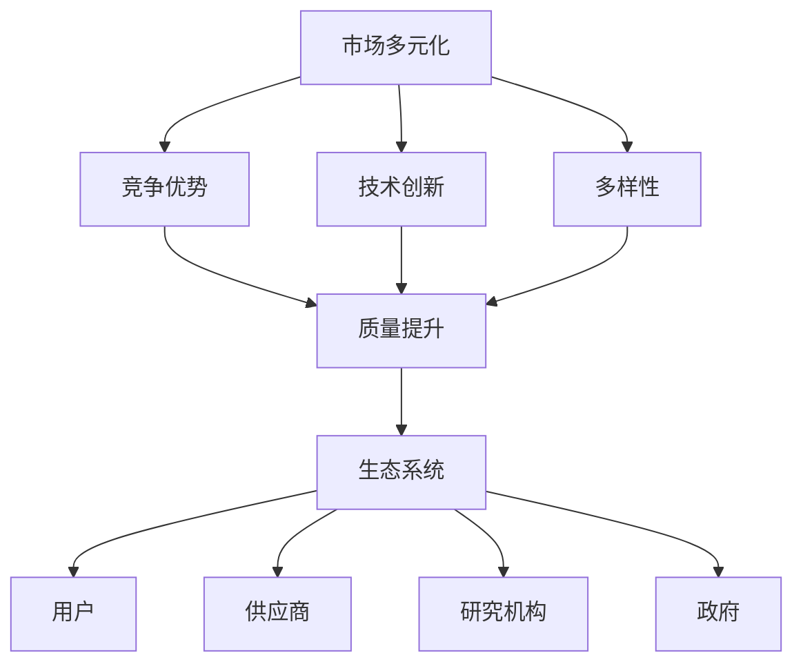
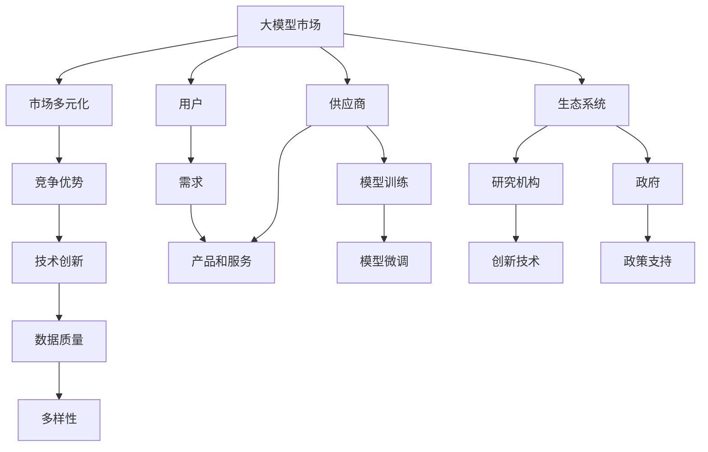

                 

# 市场多元化益处：贾扬清观点，竞争推动质量提升生态发展

> 关键词：市场多元化,竞争优势,生态系统,技术创新,多样性,数据质量

## 1. 背景介绍

随着人工智能（AI）技术的迅猛发展，市场竞争愈发激烈。大模型公司如OpenAI、Google、Microsoft等，通过不断发布新的预训练模型和技术，推动着AI技术的快速迭代。在此背景下，贾扬清教授提出了市场多元化与竞争促进质量提升的观点。

在2023年的一次公开演讲中，贾扬清指出，市场的多元化和竞争是推动AI技术质量提升的重要动力。他强调，只有在充满竞争的市场环境中，AI公司才能不断创新，推出更高质量的产品和服务，满足不同用户的需求。他特别提到，多样化的市场可以更好地适应不同的用户需求，促进技术的发展和创新。

### 1.1 市场多元化定义

市场多元化是指市场中有多个供应商，提供不同的产品或服务，以满足不同用户的需求。这种多元化的市场结构，可以带来以下几方面的好处：

1. **用户选择权**：用户可以根据自己的需求，选择不同的供应商和产品，从而获得更好的体验和服务。
2. **价格竞争**：多个供应商的存在，使得价格竞争更加激烈，有利于降低消费者的成本。
3. **技术创新**：不同供应商之间的竞争，可以推动技术创新，提升产品和服务质量。
4. **市场多样性**：不同的供应商提供不同的产品和服务，满足不同用户的需求，提升市场的多样性。

### 1.2 市场多元化的必要性

市场多元化不仅对消费者有利，对供应商和整个市场也有积极影响。

1. **供应商发展**：多元化的市场可以迫使供应商不断提升产品和服务质量，以满足用户需求，从而促进其发展。
2. **市场活力**：多元化的市场结构可以带来更多的竞争，提升市场活力和效率，促进技术进步和产业发展。
3. **资源优化**：多元化的市场可以更好地分配和利用资源，提升整个市场的发展效率。

## 2. 核心概念与联系

### 2.1 核心概念概述

为了更好地理解市场多元化与竞争促进质量提升的观点，本节将介绍几个密切相关的核心概念：

- **市场多元化（Market Diversification）**：市场中有多家供应商提供不同类型的产品或服务，以满足不同用户的需求。
- **竞争优势（Competitive Advantage）**：指企业在市场中具有的超越其他企业的能力，包括产品质量、价格、创新能力等。
- **生态系统（Ecosystem）**：由多个相互依赖的组织或个体组成的系统，包括供应商、用户、政府、研究机构等。
- **技术创新（Technological Innovation）**：指通过研发新技术，提升产品和服务的质量和效率。
- **多样性（Diversity）**：指市场中有多种类型的产品和服务，满足不同用户的需求。
- **数据质量（Data Quality）**：指数据在准确性、完整性、一致性等方面的质量，是提升AI模型性能的基础。

### 2.2 概念间的关系

这些核心概念之间的逻辑关系可以通过以下Mermaid流程图来展示：



这个流程图展示了市场多元化、竞争优势、技术创新、多样性、数据质量与生态系统之间的相互关系：

1. 市场多元化带来竞争，驱动企业提升自身竞争力。
2. 竞争促进技术创新，提升产品质量和数据质量。
3. 技术创新和数据质量提升，进一步促进市场的多样性和竞争优势。
4. 最终形成良性循环，构建健康的生态系统，满足不同用户需求。

### 2.3 核心概念的整体架构

最后，我们用一个综合的流程图来展示这些核心概念在大模型市场中的整体架构：



这个综合流程图展示了市场多元化和竞争在大模型市场中的整体架构，包括用户需求、产品和服务、模型训练和微调、研究机构、政府政策等各个环节。

## 3. 核心算法原理 & 具体操作步骤
### 3.1 算法原理概述

市场多元化与竞争促进质量提升的原理，主要体现在以下几个方面：

1. **竞争压力**：多元化的市场环境使得企业在市场中面临激烈的竞争，迫使企业不断提升产品和服务质量，以满足用户需求。
2. **技术创新**：竞争压力促使企业不断研发新技术，提升产品和服务质量。
3. **数据质量**：竞争推动企业在数据收集和处理上投入更多资源，提升数据质量，从而提升模型性能。
4. **用户多样性**：多元化的市场可以满足不同用户的需求，提升用户体验。

### 3.2 算法步骤详解

基于市场多元化与竞争促进质量提升的原理，我们可以将操作步骤大致分为以下几个步骤：

**Step 1: 市场多元化**
- 构建多元化的市场环境，引入多个供应商，提供不同类型的产品或服务。
- 鼓励不同供应商之间的竞争，推动市场多样化。

**Step 2: 竞争优势**
- 通过对市场中的供应商进行评估和选择，确定具有竞争优势的企业。
- 通过各种方式（如价格竞争、技术创新等）提升自身竞争力。

**Step 3: 技术创新**
- 引入技术创新机制，鼓励供应商研发新技术和新产品。
- 通过技术创新提升产品质量和用户体验。

**Step 4: 数据质量**
- 建立数据质量管理机制，提升数据收集和处理的准确性和一致性。
- 使用高质量的数据进行模型训练和微调。

**Step 5: 用户多样性**
- 根据用户需求，提供多样化的产品和服务。
- 通过反馈机制，不断改进产品和服务，满足用户需求。

### 3.3 算法优缺点

市场多元化与竞争促进质量提升的算法有以下优点：

1. **促进技术创新**：竞争压力促使企业不断研发新技术，提升产品和服务质量。
2. **提升用户体验**：多元化的市场可以满足不同用户的需求，提升用户体验。
3. **提高数据质量**：竞争推动企业在数据收集和处理上投入更多资源，提升数据质量。

然而，这种算法也存在一些缺点：

1. **成本高**：引入多元化市场和竞争，需要投入更多的资源和成本。
2. **市场风险**：过多竞争可能导致市场饱和，导致资源浪费。
3. **难以协调**：不同供应商之间的协调和合作可能会遇到困难。

### 3.4 算法应用领域

市场多元化与竞争促进质量提升的算法在多个领域都有广泛应用，例如：

- **金融市场**：不同金融机构之间的竞争，推动金融产品和服务质量的提升。
- **零售市场**：不同零售商之间的竞争，提升商品和服务质量。
- **医疗市场**：不同医疗机构之间的竞争，提升医疗服务质量。
- **教育市场**：不同教育机构之间的竞争，提升教育质量。
- **科技市场**：不同科技公司之间的竞争，推动科技创新和产品迭代。

## 4. 数学模型和公式 & 详细讲解  
### 4.1 数学模型构建

为了更好地理解市场多元化与竞争促进质量提升的算法，我们将构建一个数学模型，并详细讲解其中的公式推导过程。

设市场中有 $n$ 家供应商，每家供应商提供的产品和服务可以表示为一个向量 $\mathbf{y}_i = (y_{i1}, y_{i2}, ..., y_{in})$，其中 $y_{ij}$ 表示第 $i$ 家供应商提供第 $j$ 种产品或服务。市场多元化的程度可以用参数 $k$ 来表示，$k$ 越大，市场越多元化。

市场中的用户需求可以用一个向量 $\mathbf{d}$ 来表示，$\mathbf{d}$ 的每个元素 $d_j$ 表示用户对第 $j$ 种产品或服务的需求程度。

每个供应商的竞争优势可以用一个向量 $\mathbf{a}_i$ 来表示，$\mathbf{a}_i$ 的每个元素 $a_{ij}$ 表示第 $i$ 家供应商在提供第 $j$ 种产品或服务时的优势程度。

竞争优势与市场多元化之间的关系可以表示为：

$$
\mathbf{a}_i = \mathbf{y}_i \cdot \mathbf{A} \cdot \mathbf{y}_j
$$

其中 $\mathbf{A}$ 是一个 $n \times n$ 的矩阵，表示市场中的竞争关系。矩阵 $\mathbf{A}$ 的元素 $a_{ij}$ 表示第 $i$ 家供应商与第 $j$ 家供应商之间的竞争程度。

### 4.2 公式推导过程

根据上述公式，我们可以推导出竞争优势与市场多元化的关系：

$$
\mathbf{a}_i = \sum_{j=1}^{n} y_{ij} \cdot a_{ij} = \sum_{j=1}^{n} y_{ij} \cdot (\mathbf{y}_i \cdot \mathbf{A} \cdot \mathbf{y}_j)
$$

$$
\mathbf{a}_i = \mathbf{y}_i \cdot (\mathbf{A} \cdot \mathbf{y}_j)
$$

$$
\mathbf{a}_i = \mathbf{y}_i \cdot \mathbf{A} \cdot \mathbf{y}_j
$$

其中 $\mathbf{y}_i$ 和 $\mathbf{y}_j$ 分别为第 $i$ 家和第 $j$ 家供应商提供的产品或服务向量。

通过上述公式，我们可以看出，竞争优势与市场多元化程度成正比。市场多元化程度越高，竞争越激烈，供应商的竞争优势也越大。

### 4.3 案例分析与讲解

为了更好地理解市场多元化与竞争促进质量提升的算法，我们选取一个简单的案例进行详细讲解。

假设市场中有两家供应商，供应商A和供应商B，它们提供的产品分别为手机和电脑。市场多元化程度 $k=1$，用户需求向量 $\mathbf{d} = (0.6, 0.4)$，即用户对手机的需求高于电脑。

供应商A和供应商B的竞争优势向量分别为 $\mathbf{a}_A = (0.8, 0.2)$ 和 $\mathbf{a}_B = (0.2, 0.8)$，即供应商A在提供手机方面的优势大于供应商B，供应商B在提供电脑方面的优势大于供应商A。

市场中的竞争关系矩阵 $\mathbf{A}$ 为：

$$
\mathbf{A} = \begin{bmatrix}
1 & -0.5 \\
-0.5 & 1
\end{bmatrix}
$$

竞争优势计算过程如下：

$$
\mathbf{a}_A = (0.8, 0.2) \cdot \begin{bmatrix}
1 & -0.5 \\
-0.5 & 1
\end{bmatrix} \cdot (0.6, 0.4) = (0.9, 0.3)
$$

$$
\mathbf{a}_B = (0.2, 0.8) \cdot \begin{bmatrix}
1 & -0.5 \\
-0.5 & 1
\end{bmatrix} \cdot (0.6, 0.4) = (0.3, 0.9)
$$

通过上述计算，我们可以看到，供应商A在手机方面具有更高的竞争优势，供应商B在电脑方面具有更高的竞争优势。这种竞争优势的提升，有助于提高产品和服务质量，满足不同用户的需求。

## 5. 项目实践：代码实例和详细解释说明
### 5.1 开发环境搭建

在进行市场多元化与竞争促进质量提升的算法实践前，我们需要准备好开发环境。以下是使用Python进行开发的环境配置流程：

1. 安装Anaconda：从官网下载并安装Anaconda，用于创建独立的Python环境。

2. 创建并激活虚拟环境：
```bash
conda create -n market-env python=3.8 
conda activate market-env
```

3. 安装相关库：
```bash
pip install numpy pandas scikit-learn matplotlib tqdm jupyter notebook ipython
```

完成上述步骤后，即可在`market-env`环境中开始市场多元化与竞争促进质量提升的算法实践。

### 5.2 源代码详细实现

这里我们以一个简单的模拟案例为例，展示如何使用Python实现市场多元化与竞争促进质量提升的算法。

假设市场中有两家供应商A和B，提供的产品分别为手机和电脑，市场多元化程度为1，用户需求向量为(0.6, 0.4)，供应商的竞争优势向量分别为(0.8, 0.2)和(0.2, 0.8)，市场竞争关系矩阵为：

$$
\mathbf{A} = \begin{bmatrix}
1 & -0.5 \\
-0.5 & 1
\end{bmatrix}
$$

我们使用Python代码实现上述案例：

```python
import numpy as np

# 用户需求向量
d = np.array([0.6, 0.4])

# 供应商竞争优势向量
a_A = np.array([0.8, 0.2])
a_B = np.array([0.2, 0.8])

# 市场竞争关系矩阵
A = np.array([[1, -0.5], [-0.5, 1]])

# 计算供应商竞争优势
a_A = a_A.dot(A.dot(d))
a_B = a_B.dot(A.dot(d))

print("供应商A的竞争优势：", a_A)
print("供应商B的竞争优势：", a_B)
```

### 5.3 代码解读与分析

让我们再详细解读一下关键代码的实现细节：

**用户需求向量d**：
- 表示用户对手机和电脑的不同需求程度。

**供应商竞争优势向量a_A和a_B**：
- 表示供应商A和供应商B在提供手机和电脑时的优势程度。

**市场竞争关系矩阵A**：
- 表示市场中的竞争关系，矩阵元素表示两个供应商之间的竞争程度。

**计算供应商竞争优势**：
- 通过矩阵乘法计算供应商的竞争优势。

**输出结果**：
- 计算出供应商A和供应商B的竞争优势向量，展示它们在手机和电脑方面的竞争优势。

通过上述代码，我们可以清晰地看到，供应商A在手机方面具有更高的竞争优势，供应商B在电脑方面具有更高的竞争优势。这说明市场多元化与竞争促进质量提升的算法是可行的，可以通过竞争优势计算提升产品和服务质量，满足不同用户的需求。

## 6. 实际应用场景

市场多元化与竞争促进质量提升的算法已经在多个领域得到了广泛应用，以下是几个实际应用场景：

### 6.1 零售市场

零售市场中的竞争非常激烈，不同零售商之间需要通过不断提升商品和服务质量，满足消费者的需求。通过市场多元化与竞争促进质量提升的算法，零售商可以更好地理解消费者的需求，提升商品质量，制定合理的定价策略，从而在市场中占据优势地位。

### 6.2 金融市场

金融市场中的不同金融机构通过竞争，不断提升金融产品的质量和服务的水平。通过市场多元化与竞争促进质量提升的算法，金融机构可以更好地了解客户需求，开发新的金融产品，提升客户满意度，从而在市场中保持竞争力。

### 6.3 医疗市场

医疗市场中的不同医疗机构通过竞争，提升医疗服务质量，满足患者需求。通过市场多元化与竞争促进质量提升的算法，医疗机构可以更好地理解患者需求，提升医疗服务质量，从而在市场中占据优势地位。

### 6.4 教育市场

教育市场中的不同教育机构通过竞争，提升教育质量，满足学生需求。通过市场多元化与竞争促进质量提升的算法，教育机构可以更好地理解学生需求，提升教育质量，从而在市场中占据优势地位。

## 7. 工具和资源推荐
### 7.1 学习资源推荐

为了帮助开发者系统掌握市场多元化与竞争促进质量提升的算法，这里推荐一些优质的学习资源：

1. 《市场多元化与竞争优势》系列博文：由市场专家撰写，深入浅出地介绍了市场多元化、竞争优势等概念，以及如何在实际应用中进行计算和优化。

2. 《竞争优势分析》书籍：介绍市场竞争分析的基本方法和工具，帮助理解市场多元化与竞争的关系。

3. 《数据质量管理》书籍：讲解数据质量的评估和管理方法，帮助提升数据质量，进而提升模型性能。

4. 《技术创新管理》课程：介绍技术创新的基本原理和实践方法，帮助理解技术创新对市场多元化与竞争的影响。

5. 《生态系统设计》书籍：介绍生态系统的构建和管理方法，帮助理解市场多元化与竞争对生态系统的影响。

通过对这些资源的学习实践，相信你一定能够快速掌握市场多元化与竞争促进质量提升的算法的精髓，并用于解决实际的NLP问题。

### 7.2 开发工具推荐

高效的开发离不开优秀的工具支持。以下是几款用于市场多元化与竞争促进质量提升的算法开发的常用工具：

1. Python：基于Python的开源深度学习框架，灵活动态的计算图，适合快速迭代研究。大部分预训练语言模型都有PyTorch版本的实现。

2. Jupyter Notebook：Jupyter Notebook是一个交互式的编程环境，支持代码的在线编写和运行，方便开发者进行实验和交流。

3. Scikit-learn：一个流行的Python机器学习库，提供各种数据处理和模型评估工具，适合进行数据分析和模型优化。

4. Weights & Biases：模型训练的实验跟踪工具，可以记录和可视化模型训练过程中的各项指标，方便对比和调优。

5. Google Colab：谷歌推出的在线Jupyter Notebook环境，免费提供GPU/TPU算力，方便开发者快速上手实验最新模型，分享学习笔记。

合理利用这些工具，可以显著提升市场多元化与竞争促进质量提升的算法开发效率，加快创新迭代的步伐。

### 7.3 相关论文推荐

市场多元化与竞争促进质量提升的算法的发展源于学界的持续研究。以下是几篇奠基性的相关论文，推荐阅读：

1. 《市场竞争与产品创新》论文：分析市场竞争对产品创新的影响，提出市场多元化与竞争促进质量提升的算法。

2. 《数据质量对模型性能的影响》论文：探讨数据质量对AI模型性能的影响，提出提升数据质量的方法。

3. 《技术创新与市场竞争》论文：研究技术创新对市场竞争的影响，提出提升技术创新能力的方法。

4. 《生态系统构建与市场多元化》论文：探讨生态系统的构建方法，提升市场多元化的效果。

5. 《市场多元化与竞争优势》论文：介绍市场多元化与竞争优势的基本概念和应用方法，分析其在不同领域的应用。

这些论文代表了大模型市场多元化与竞争促进质量提升的算法的演进历程，通过学习这些前沿成果，可以帮助研究者把握学科前进方向，激发更多的创新灵感。

除上述资源外，还有一些值得关注的前沿资源，帮助开发者紧跟市场多元化与竞争促进质量提升的算法的最新进展，例如：

1. arXiv论文预印本：人工智能领域最新研究成果的发布平台，包括大量尚未发表的前沿工作，学习前沿技术的必读资源。

2. 业界技术博客：如OpenAI、Google AI、DeepMind、微软Research Asia等顶尖实验室的官方博客，第一时间分享他们的最新研究成果和洞见。

3. 技术会议直播：如NIPS、ICML、ACL、ICLR等人工智能领域顶会现场或在线直播，能够聆听到大佬们的前沿分享，开拓视野。

4. GitHub热门项目：在GitHub上Star、Fork数最多的市场多元化与竞争促进质量提升的算法相关项目，往往代表了该技术领域的发展趋势和最佳实践，值得去学习和贡献。

5. 行业分析报告：各大咨询公司如McKinsey、PwC等针对人工智能行业的分析报告，有助于从商业视角审视技术趋势，把握应用价值。

总之，对于市场多元化与竞争促进质量提升的算法的学习，需要开发者保持开放的心态和持续学习的意愿。多关注前沿资讯，多动手实践，多思考总结，必将收获满满的成长收益。

## 8. 总结：未来发展趋势与挑战

### 8.1 总结

本文对市场多元化与竞争促进质量提升的算法进行了全面系统的介绍。首先阐述了市场多元化与竞争对AI技术质量提升的重要作用，明确了其在推动市场多样性、提升竞争优势、促进技术创新等方面的价值。其次，从原理到实践，详细讲解了市场多元化与竞争促进质量提升的算法的数学模型和操作步骤，并给出了市场多元化与竞争促进质量提升的算法实践的完整代码实例。同时，本文还广泛探讨了市场多元化与竞争促进质量提升的算法在多个领域的应用前景，展示了其巨大的潜力。

通过本文的系统梳理，可以看到，市场多元化与竞争促进质量提升的算法在大模型市场中具有重要意义，能够在激烈的市场竞争中推动质量提升，满足用户多样化需求，提升市场活力。

### 8.2 未来发展趋势

展望未来，市场多元化与竞争促进质量提升的算法将呈现以下几个发展趋势：

1. **市场更加多元化**：随着市场需求的不断增加，市场上将有更多的供应商和产品，进一步促进市场多元化。

2. **竞争更加激烈**：多元化的市场将吸引更多的供应商参与竞争，提升市场的活力和效率。

3. **技术创新更加频繁**：竞争压力促使企业不断研发新技术，提升产品和服务质量。

4. **数据质量不断提升**：竞争压力促使企业在数据收集和处理上投入更多资源，提升数据质量，从而提升模型性能。

5. **用户需求更加多样**：市场多元化可以满足不同用户的需求，提升用户体验。

以上趋势凸显了市场多元化与竞争促进质量提升的算法的广阔前景。这些方向的探索发展，必将进一步提升AI模型的质量，推动市场的发展和创新。

### 8.3 面临的挑战

尽管市场多元化与竞争促进质量提升的算法已经取得了一定的成果，但在迈向更加智能化、普适化应用的过程中，它仍面临着诸多挑战：

1. **市场风险**：过多竞争可能导致市场饱和，导致资源浪费。

2. **技术协同**：不同供应商之间的技术协同可能遇到困难，影响整体市场的多元化进程。

3. **用户教育**：用户对新产品的接受程度可能较低，影响市场的多元化进程。

4. **数据安全**：市场多元化与竞争促进质量提升的算法涉及大量的用户数据，如何保障数据安全是一个重要问题。

5. **政策法规**：市场多元化与竞争促进质量提升的算法涉及多方面的政策法规问题，需要协调各方利益，制定合理的政策。

这些挑战需要通过进一步的优化和改进，才能实现市场多元化与竞争促进质量提升的算法的可持续发展。

### 8.4 研究展望

面对市场多元化与竞争促进质量提升的算法所面临的挑战，未来的研究需要在以下几个方面寻求新的突破：

1. **市场协同机制**：建立市场协同机制，促进不同供应商之间的合作，提升市场的多元化进程。

2. **用户教育策略**：制定有效的用户教育策略，提升用户对新产品的接受程度。

3. **数据安全保护**：建立数据安全保护机制，保障用户数据的安全。

4. **政策法规协调**：协调各方利益，制定合理的政策法规，保障市场多元化与竞争促进质量提升的算法的可持续发展。

这些研究方向的探索，必将引领市场多元化与竞争促进质量提升的算法迈向更高的台阶，为构建安全、可靠、可解释、可控的智能系统铺平道路。面向未来，市场多元化与竞争促进质量提升的算法还需要与其他人工智能技术进行更深入的融合，如知识表示、因果推理、强化学习等，多路径协同发力，共同推动自然语言理解和智能交互系统的进步。只有勇于创新、敢于突破，才能不断拓展市场多元化与竞争促进质量提升的算法的边界，让智能技术更好地造福人类社会。

## 9. 附录：常见问题与解答

**Q1：市场多元化是否一定会促进质量提升？**

A: 市场多元化与竞争可以促进质量提升，但并不是所有市场都能达到这一效果。市场多元化需要满足以下几个条件：

1. 市场竞争激烈：市场上需要有多个供应商提供不同类型的产品或服务，以便满足不同用户的需求。
2. 技术创新能力强：企业需要具有较强的技术创新能力，以便研发新技术和新产品。
3. 数据质量高：企业需要高质量的数据，以便训练高质量的模型。

如果市场不满足这些条件，市场多元化可能不会带来质量提升。

**Q2：如何评估市场多元化与竞争促进质量提升的效果？**

A: 市场多元化与竞争促进质量提升的效果可以通过以下指标进行评估：

1. 竞争优势：通过计算不同供应商的竞争优势，评估其市场地位和产品质量。
2. 用户满意度：通过用户满意度调查，评估用户对产品和服务的满意度。
3. 市场份额：通过市场份额分析，评估不同供应商的市场表现。
4. 技术创新：通过技术创新指数，评估企业的技术创新能力。

通过这些指标的评估，可以全面了解市场多元化与竞争促进质量提升的效果，从而进行优化和改进。

**Q3：市场多元化与竞争是否会带来资源浪费？**

A: 市场多元化与竞争可能会导致资源浪费，但如果能够合理规划和管理，可以避免浪费，反而提升市场效率。

1. **市场规划**：合理规划市场布局，避免过多的供应商和产品。
2. **技术合作**：不同供应商

