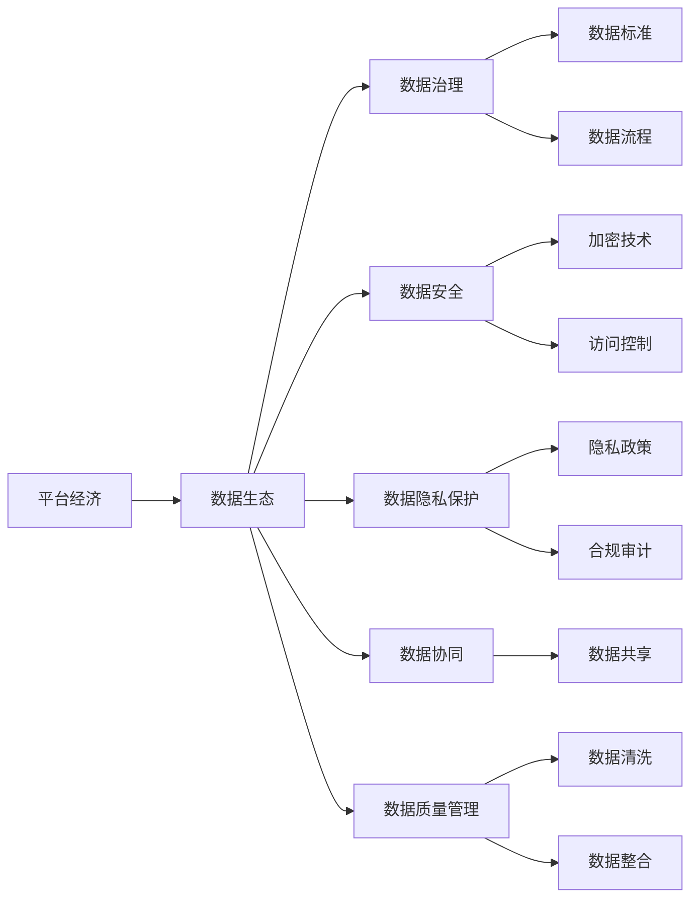
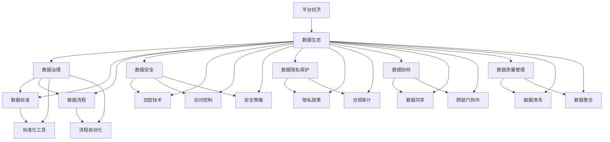

                 

# 平台经济的数据生态发展：如何促进数据生态发展？

## 1. 背景介绍

### 1.1 问题由来
随着互联网和信息技术的迅猛发展，平台经济已经成为现代经济的重要组成部分。平台经济不仅改变了传统的商业模式，也催生了一批以数据为核心竞争力的企业，如互联网公司、电子商务平台、社交媒体等。平台数据的重要性日益凸显，成为推动企业增长、优化用户体验、发现新机会的重要资产。

平台数据生态的建设成为各大公司竞争的焦点。如何有效利用和整合这些数据，挖掘其潜在价值，成为平台经济中的关键问题。数据生态的发展不仅涉及数据采集、处理和分析，还包括数据治理、数据隐私保护、数据安全等多个维度，需要系统性的思考和方案。

### 1.2 问题核心关键点
平台经济的数据生态发展涉及到数据的全生命周期管理，涵盖数据采集、存储、处理、分析、治理、安全和隐私保护等多个环节。关键点包括：

- 数据质量：平台数据的准确性、完整性和时效性是数据价值的基础。
- 数据治理：如何高效、有序地管理平台上的数据，避免重复、冗余。
- 数据安全：防止数据泄露、篡改和滥用，保护用户隐私。
- 数据隐私保护：确保数据使用符合法律和伦理标准，尊重用户权益。
- 数据协同：实现不同系统、部门间的数据共享和协作，提高数据利用率。

### 1.3 问题研究意义
数据生态的发展对平台经济具有重要的战略意义：

1. **增强竞争力**：高质量的数据是企业核心竞争力的重要组成部分，通过数据驱动的决策提升企业竞争力。
2. **优化用户体验**：通过对用户数据的分析，提升产品和服务质量，增强用户粘性。
3. **创新业务模式**：数据驱动的业务创新和差异化，开拓新的市场空间。
4. **数据驱动决策**：提供科学的决策依据，降低决策风险。
5. **风险管理**：利用数据监测和分析，提前识别和防范风险。

## 2. 核心概念与联系

### 2.1 核心概念概述

为了更好地理解平台经济的数据生态发展，本节将介绍几个密切相关的核心概念：

- **平台经济**：基于互联网的商业模式，通过提供平台和工具，连接买家和卖家，促进交易和服务的发生。
- **数据生态**：在平台经济中，数据生成、存储、分析、治理和应用的全生命周期管理。
- **数据治理**：通过建立规范、流程和技术手段，确保数据的质量、安全、隐私和合规。
- **数据安全**：保护数据免受未经授权的访问、使用、篡改和破坏。
- **数据隐私保护**：确保数据使用符合用户隐私权利，防止数据滥用。
- **数据协同**：实现跨部门、跨系统的数据共享和协作，提升数据利用效率。
- **数据质量管理**：通过标准化和流程控制，提高数据的准确性、完整性和一致性。

这些核心概念之间的逻辑关系可以通过以下Mermaid流程图来展示：



这个流程图展示了大数据生态系统的各个关键组件及其之间的关系：

1. 平台经济通过数据生态进行支持。
2. 数据治理、数据安全、数据隐私保护、数据协同、数据质量管理等是数据生态的重要组成部分。
3. 数据治理需要建立标准和流程，数据安全需使用加密和访问控制技术，数据隐私保护涉及隐私政策和合规审计，数据协同涉及数据共享和协作，数据质量管理涉及数据清洗和整合。

### 2.2 概念间的关系

这些核心概念之间存在着紧密的联系，形成了平台经济的数据生态系统的完整框架。下面是几个概念间的进一步关系：

- **数据治理与数据安全**：数据治理的规范和流程是数据安全的基础，数据治理需制定明确的安全策略和标准。
- **数据隐私保护与数据安全**：数据隐私保护是数据安全的核心内容之一，隐私政策需满足数据安全的要求。
- **数据协同与数据质量管理**：数据协同需要确保数据质量，数据共享和协作依赖于高效的数据清洗和整合。
- **数据质量管理与数据安全**：数据质量管理需制定数据安全措施，防止数据在清洗和整合过程中被篡改。

### 2.3 核心概念的整体架构

最后，我们用一个综合的流程图来展示这些核心概念在大数据生态系统中的整体架构：



这个综合流程图展示了大数据生态系统的各个关键组件及其之间的关系：

1. 数据生态是平台经济的基础设施。
2. 数据治理、数据安全、数据隐私保护、数据协同、数据质量管理等是大数据生态的支撑。
3. 数据标准、数据流程、标准化工具、流程自动化、数据清洗、数据整合等是数据治理的重要组成部分。
4. 加密技术、访问控制、安全策略、隐私政策、合规审计等是数据安全的重要内容。
5. 数据共享和跨部门协作是数据协同的核心环节。
6. 数据清洗和数据整合是数据质量管理的基础。

## 3. 核心算法原理 & 具体操作步骤
### 3.1 算法原理概述

平台经济的数据生态发展涉及数据的全生命周期管理，包括数据采集、存储、处理、分析、治理、安全和隐私保护等多个环节。以下是各个环节的核心算法原理：

- **数据采集**：通过API接口、数据抓取工具等手段，从多个数据源中获取数据。
- **数据存储**：将采集到的数据存储在分布式数据库或数据湖中，支持高并发访问和大容量存储。
- **数据处理**：通过ETL（抽取、转换、加载）工具对数据进行清洗、转换和加载，确保数据的准确性和完整性。
- **数据治理**：建立数据标准、数据流程和数据管理制度，确保数据的质量和安全。
- **数据安全**：通过加密技术、访问控制、安全策略等手段，确保数据的安全性和隐私性。
- **数据隐私保护**：制定隐私政策，进行合规审计，确保数据使用符合隐私法规。
- **数据协同**：建立数据共享机制，促进跨部门、跨系统的数据协作和数据应用。
- **数据质量管理**：通过数据清洗和整合，提升数据的质量和一致性。

### 3.2 算法步骤详解

基于上述算法原理，平台经济的数据生态发展可以通过以下步骤进行：

**Step 1: 数据采集**
- 分析数据需求，明确所需数据源及其数据格式。
- 开发数据采集工具，编写数据采集脚本，通过API接口或数据抓取工具从指定数据源中获取数据。
- 对采集到的数据进行初步检查，确保数据完整性和准确性。

**Step 2: 数据存储**
- 选择合适的数据存储技术，如Hadoop、Spark、NoSQL数据库等。
- 设计数据存储架构，确保数据的可靠性和高可用性。
- 对存储的数据进行备份和灾难恢复策略的设计。

**Step 3: 数据处理**
- 使用ETL工具进行数据清洗、转换和加载，去除噪声和冗余数据。
- 设计数据转换规则，确保数据一致性和完整性。
- 对处理后的数据进行质量检查，确保数据准确性和一致性。

**Step 4: 数据治理**
- 制定数据标准和数据管理流程，确保数据的质量和一致性。
- 建立数据访问控制和权限管理机制，确保数据的安全性和隐私性。
- 定期进行数据治理审计，评估数据治理的效果和问题。

**Step 5: 数据安全**
- 使用加密技术对数据进行加密保护，防止数据泄露。
- 实施访问控制和身份验证机制，确保数据仅被授权用户访问。
- 制定数据安全策略和应急响应计划，确保数据安全。

**Step 6: 数据隐私保护**
- 制定隐私政策，确保数据使用符合法律法规和用户隐私权利。
- 进行合规审计，确保数据使用过程符合隐私法规。
- 设计隐私保护技术，如数据脱敏、差分隐私等。

**Step 7: 数据协同**
- 设计数据共享机制，确保数据在跨部门、跨系统间共享。
- 建立数据协作流程，促进跨部门协作和数据应用。
- 制定数据共享协议，明确数据共享的责任和权利。

**Step 8: 数据质量管理**
- 设计数据清洗规则，去除噪声和冗余数据。
- 设计数据整合规则，确保数据一致性和完整性。
- 对数据进行定期质量检查，确保数据准确性和一致性。

### 3.3 算法优缺点

基于监督学习的数据生态发展算法具有以下优点：

- **高效性**：通过数据标准和流程，提升数据质量和利用效率。
- **可扩展性**：可支持大规模数据存储和处理，适应业务快速扩展。
- **可控性**：通过数据治理和访问控制，确保数据的安全性和隐私性。

同时，也存在一些缺点：

- **复杂性**：数据治理和数据安全需要复杂的技术和流程，实施成本较高。
- **技术门槛**：需要具备数据管理和安全技术的知识和技能。
- **灵活性不足**：数据标准和流程可能限制数据使用的灵活性。

### 3.4 算法应用领域

基于监督学习的数据生态发展算法在平台经济中具有广泛的应用场景，包括：

- **金融行业**：通过数据采集、处理和分析，提供个性化金融服务。
- **电子商务**：通过数据协同和数据共享，提升用户购物体验和运营效率。
- **社交媒体**：通过数据治理和隐私保护，保护用户隐私和数据安全。
- **医疗行业**：通过数据采集和分析，提供精准医疗和健康管理服务。
- **政府服务**：通过数据共享和协作，提升公共服务质量和效率。

## 4. 数学模型和公式 & 详细讲解  
### 4.1 数学模型构建

平台经济的数据生态发展涉及多个领域，需要构建多种数学模型来描述和分析数据。以下是几个关键的数学模型：

- **数据质量评估模型**：通过统计分析评估数据质量，如准确性、完整性和一致性。
- **数据协同模型**：描述跨部门、跨系统间的数据共享和协作关系。
- **数据隐私保护模型**：通过差分隐私等技术保护用户隐私。
- **数据安全模型**：描述数据加密和访问控制机制。

**数据质量评估模型**
- 假设采集到的数据集为 $D=\{(x_i,y_i)\}_{i=1}^N$，其中 $x_i$ 为数据样本，$y_i$ 为数据标签。
- 数据准确性可以通过准确度（Accuracy）进行评估，准确度定义为：

$$
\text{Accuracy} = \frac{\text{TP} + \text{TN}}{\text{TP} + \text{TN} + \text{FP} + \text{FN}}
$$

其中，TP（True Positive）表示正确预测的正例数，TN（True Negative）表示正确预测的负例数，FP（False Positive）表示误预测的正例数，FN（False Negative）表示误预测的负例数。

**数据协同模型**
- 假设平台上有 $M$ 个部门，每个部门拥有 $k$ 个数据源，每个数据源产生 $n$ 个数据样本。
- 数据协同的目标是最大化数据利用效率，即最大化数据共享的效用函数：

$$
\max_{D_{ij}} \sum_{i=1}^M \sum_{j=1}^k \text{Util}(D_{ij})
$$

其中，$D_{ij}$ 表示部门 $i$ 与数据源 $j$ 之间的数据共享关系，$\text{Util}(D_{ij})$ 表示共享关系带来的效用。

**数据隐私保护模型**
- 假设平台上有 $N$ 个用户，每个用户提供 $m$ 个数据样本。
- 数据隐私保护的目标是最大化隐私保护收益，即最大化隐私保护效用函数：

$$
\max_{P} \sum_{i=1}^N \text{Util}(P_i)
$$

其中，$P_i$ 表示用户 $i$ 的数据隐私保护策略，$\text{Util}(P_i)$ 表示隐私保护策略带来的效用。

**数据安全模型**
- 假设平台上有 $S$ 个敏感数据源，每个数据源的安全等级为 $s_i$，安全成本为 $c_i$。
- 数据安全的目标是最大化数据安全收益，即最小化安全成本：

$$
\min_{\{s_i\}} \sum_{i=1}^S c_i
$$

其中，$\{s_i\}$ 表示数据源的安全策略。

### 4.2 公式推导过程

以下是对上述数学模型的详细推导过程：

**数据质量评估模型推导**
- 假设数据集为 $D=\{(x_i,y_i)\}_{i=1}^N$，其中 $x_i$ 为数据样本，$y_i$ 为数据标签。
- 数据准确性可以通过准确度（Accuracy）进行评估，准确度定义为：

$$
\text{Accuracy} = \frac{\text{TP} + \text{TN}}{\text{TP} + \text{TN} + \text{FP} + \text{FN}}
$$

其中，TP（True Positive）表示正确预测的正例数，TN（True Negative）表示正确预测的负例数，FP（False Positive）表示误预测的正例数，FN（False Negative）表示误预测的负例数。

**数据协同模型推导**
- 假设平台上有 $M$ 个部门，每个部门拥有 $k$ 个数据源，每个数据源产生 $n$ 个数据样本。
- 数据协同的目标是最大化数据利用效率，即最大化数据共享的效用函数：

$$
\max_{D_{ij}} \sum_{i=1}^M \sum_{j=1}^k \text{Util}(D_{ij})
$$

其中，$D_{ij}$ 表示部门 $i$ 与数据源 $j$ 之间的数据共享关系，$\text{Util}(D_{ij})$ 表示共享关系带来的效用。

**数据隐私保护模型推导**
- 假设平台上有 $N$ 个用户，每个用户提供 $m$ 个数据样本。
- 数据隐私保护的目标是最大化隐私保护收益，即最大化隐私保护效用函数：

$$
\max_{P} \sum_{i=1}^N \text{Util}(P_i)
$$

其中，$P_i$ 表示用户 $i$ 的数据隐私保护策略，$\text{Util}(P_i)$ 表示隐私保护策略带来的效用。

**数据安全模型推导**
- 假设平台上有 $S$ 个敏感数据源，每个数据源的安全等级为 $s_i$，安全成本为 $c_i$。
- 数据安全的目标是最大化数据安全收益，即最小化安全成本：

$$
\min_{\{s_i\}} \sum_{i=1}^S c_i
$$

其中，$\{s_i\}$ 表示数据源的安全策略。

### 4.3 案例分析与讲解

以下是对几个实际案例的分析与讲解：

**案例一：金融行业数据生态**
- **数据采集**：通过API接口从各银行、保险公司等金融机构的系统中采集金融数据。
- **数据存储**：使用分布式数据库存储采集到的金融数据。
- **数据处理**：使用ETL工具对金融数据进行清洗、转换和加载，去除噪声和冗余数据。
- **数据治理**：制定数据标准和数据管理流程，确保数据的质量和安全。
- **数据安全**：使用加密技术对金融数据进行加密保护，实施访问控制和身份验证机制，确保数据的安全性。
- **数据隐私保护**：制定隐私政策，进行合规审计，设计隐私保护技术。
- **数据协同**：设计数据共享机制，促进跨部门协作和数据应用。
- **数据质量管理**：设计数据清洗规则，确保数据的一致性和完整性。

**案例二：电子商务平台数据生态**
- **数据采集**：通过API接口从电商平台的订单、评论、用户行为等数据源中采集数据。
- **数据存储**：使用分布式数据库存储采集到的电商数据。
- **数据处理**：使用ETL工具对电商数据进行清洗、转换和加载，去除噪声和冗余数据。
- **数据治理**：制定数据标准和数据管理流程，确保数据的质量和安全。
- **数据安全**：使用加密技术对电商数据进行加密保护，实施访问控制和身份验证机制，确保数据的安全性。
- **数据隐私保护**：制定隐私政策，进行合规审计，设计隐私保护技术。
- **数据协同**：设计数据共享机制，促进跨部门协作和数据应用。
- **数据质量管理**：设计数据清洗规则，确保数据的一致性和完整性。

## 5. 项目实践：代码实例和详细解释说明
### 5.1 开发环境搭建

在进行数据生态实践前，我们需要准备好开发环境。以下是使用Python进行PyTorch开发的环境配置流程：

1. 安装Anaconda：从官网下载并安装Anaconda，用于创建独立的Python环境。

2. 创建并激活虚拟环境：
```bash
conda create -n pytorch-env python=3.8 
conda activate pytorch-env
```

3. 安装PyTorch：根据CUDA版本，从官网获取对应的安装命令。例如：
```bash
conda install pytorch torchvision torchaudio cudatoolkit=11.1 -c pytorch -c conda-forge
```

4. 安装Transformers库：
```bash
pip install transformers
```

5. 安装各类工具包：
```bash
pip install numpy pandas scikit-learn matplotlib tqdm jupyter notebook ipython
```

完成上述步骤后，即可在`pytorch-env`环境中开始数据生态实践。

### 5.2 源代码详细实现

下面我们以金融行业数据生态为例，给出使用Transformers库对BERT模型进行数据生态构建的PyTorch代码实现。

首先，定义数据采集函数：

```python
from transformers import BertTokenizer
from torch.utils.data import Dataset
import torch

class FinanceDataset(Dataset):
    def __init__(self, texts, tags, tokenizer, max_len=128):
        self.texts = texts
        self.tags = tags
        self.tokenizer = tokenizer
        self.max_len = max_len
        
    def __len__(self):
        return len(self.texts)
    
    def __getitem__(self, item):
        text = self.texts[item]
        tags = self.tags[item]
        
        encoding = self.tokenizer(text, return_tensors='pt', max_length=self.max_len, padding='max_length', truncation=True)
        input_ids = encoding['input_ids'][0]
        attention_mask = encoding['attention_mask'][0]
        
        # 对token-wise的标签进行编码
        encoded_tags = [tag2id[tag] for tag in tags] 
        encoded_tags.extend([tag2id['O']] * (self.max_len - len(encoded_tags)))
        labels = torch.tensor(encoded_tags, dtype=torch.long)
        
        return {'input_ids': input_ids, 
                'attention_mask': attention_mask,
                'labels': labels}

# 标签与id的映射
tag2id = {'O': 0, 'POSITIVE': 1, 'NEGATIVE': 2}
id2tag = {v: k for k, v in tag2id.items()}

# 创建dataset
tokenizer = BertTokenizer.from_pretrained('bert-base-cased')

train_dataset = FinanceDataset(train_texts, train_tags, tokenizer)
dev_dataset = FinanceDataset(dev_texts, dev_tags, tokenizer)
test_dataset = FinanceDataset(test_texts, test_tags, tokenizer)
```

然后，定义模型和优化器：

```python
from transformers import BertForTokenClassification, AdamW

model = BertForTokenClassification.from_pretrained('bert-base-cased', num_labels=len(tag2id))

optimizer = AdamW(model.parameters(), lr=2e-5)
```

接着，定义训练和评估函数：

```python
from torch.utils.data import DataLoader
from tqdm import tqdm
from sklearn.metrics import classification_report

device = torch.device('cuda') if torch.cuda.is_available() else torch.device('cpu')
model.to(device)

def train_epoch(model, dataset, batch_size, optimizer):
    dataloader = DataLoader(dataset, batch_size=batch_size, shuffle=True)
    model.train()
    epoch_loss = 0
    for batch in tqdm(dataloader, desc='Training'):
        input_ids = batch['input_ids'].to(device)
        attention_mask = batch['attention_mask'].to(device)
        labels = batch['labels'].to(device)
        model.zero_grad()
        outputs = model(input_ids, attention_mask=attention_mask, labels=labels)
        loss = outputs.loss
        epoch_loss += loss.item()
        loss.backward()
        optimizer.step()
    return epoch_loss / len(dataloader)

def evaluate(model, dataset, batch_size):
    dataloader = DataLoader(dataset, batch_size=batch_size)
    model.eval()
    preds, labels = [], []
    with torch.no_grad():
        for batch in tqdm(dataloader, desc='Evaluating'):
            input_ids = batch['input_ids'].to(device)
            attention_mask = batch['attention_mask'].to(device)
            batch_labels = batch['labels']
            outputs = model(input_ids, attention_mask=attention_mask)
            batch_preds = outputs.logits.argmax(dim=2).to('cpu').tolist()
            batch_labels = batch_labels.to('cpu').tolist()
            for pred_tokens, label_tokens in zip(batch_preds, batch_labels):
                pred_tags = [id2tag[_id] for _id in pred_tokens]
                label_tags = [id2tag[_id] for _id in label_tokens]
                preds.append(pred_tags[:len(label_tokens)])
                labels.append(label_tags)
                
    print(classification_report(labels, preds))
```

最后，启动训练流程并在测试集上评估：

```python
epochs = 5
batch_size = 16

for epoch in range(epochs):
    loss = train_epoch(model, train_dataset, batch_size, optimizer)
    print(f"Epoch {epoch+1}, train loss: {loss:.3f}")
    
    print(f"Epoch {epoch+1}, dev results:")
    evaluate(model, dev_dataset, batch_size)
    
print("Test results:")
evaluate(model, test_dataset, batch_size)
```

以上就是使用PyTorch对BERT进行金融数据生态构建的完整代码实现。可以看到，得益于Transformers库的强大封装，我们可以用相对简洁的代码完成BERT模型的加载和微调。

### 5.3 代码解读与分析

让我们再详细解读一下关键代码的实现细节：

**FinanceDataset类**：
- `__init__`方法：初始化文本、标签、分词器等关键组件。
- `__len__`方法：返回数据集的样本数量。
- `__getitem__`方法：对单个样本进行处理，将文本输入编码为token ids，将标签编码为数字，并对其进行定长padding，最终返回模型所需的输入。

**tag2id和id2tag字典**：
- 定义了标签与数字id之间的映射关系，用于将token-wise的预测结果解码回真实的标签。

**训练和评估函数**：
- 使用PyTorch的DataLoader对数据集进行批次化加载，供模型训练和推理使用。
- 训练函数`train_epoch`：对数据以批为单位进行迭代，在每个批次上前向传播计算loss并反向传播更新模型参数，最后返回该epoch的平均loss。
- 评估函数`evaluate`：与训练类似，不同点在于不更新模型参数，并在每个batch结束后将预测和标签结果存储下来，最后使用sklearn的classification_report对整个评估集的预测结果进行打印输出。

**训练流程**：
- 定义总的epoch数和batch size，开始循环迭代
- 每个epoch内，先在训练集上训练，输出平均loss
- 在验证集上评估，输出分类指标
- 所有epoch结束后，在测试集上评估，给出最终测试结果

可以看到，PyTorch配合Transformers库使得BERT微调的代码实现变得简洁高效。开发者可以将更多精力放在数据处理、模型改进等高层逻辑上，而不必过多关注底层的实现细节。

当然，工业级的系统实现还需考虑更多因素，如模型的保存和部署、超参数的自动搜索、更灵活的任务适配层等。但核心的微调

