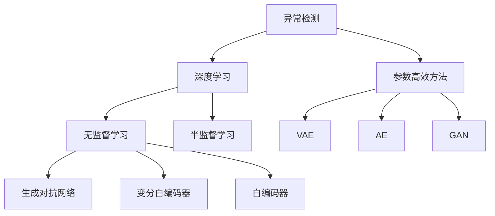
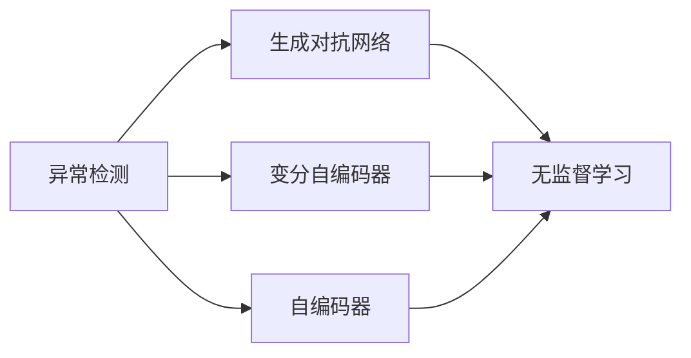
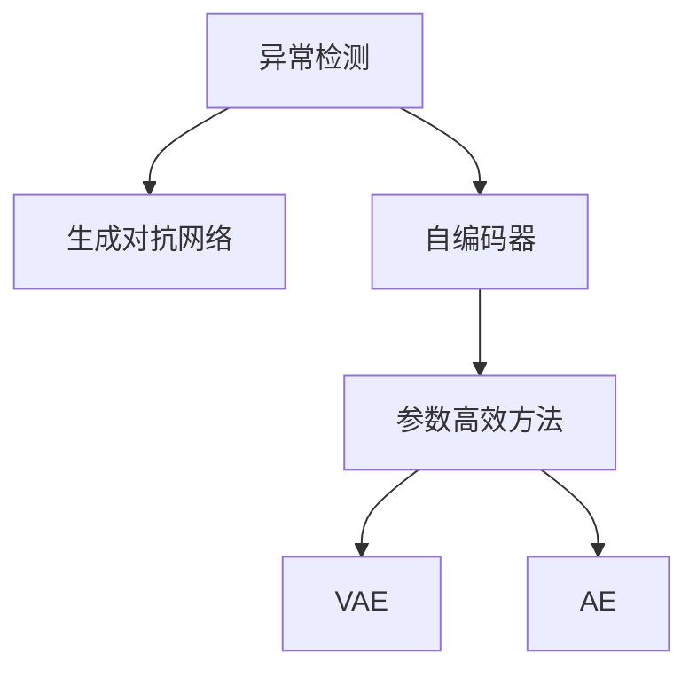
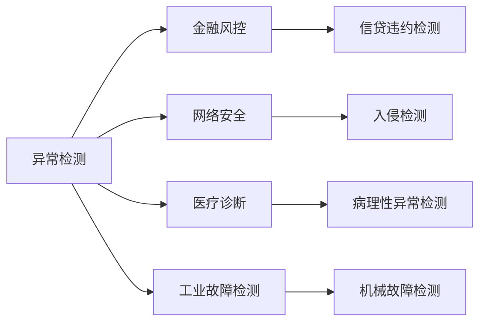

                 

# 异常检测(Anomaly Detection) - 原理与代码实例讲解

> 关键词：异常检测, 机器学习, 深度学习, 特征提取, 核函数, 异常值检测, 应用案例

## 1. 背景介绍

### 1.1 问题由来
异常检测(Anomaly Detection)是机器学习和人工智能领域中的一项重要任务。其核心目标是从大量正常数据中识别出异常数据，即"离群点"或"异常值"。这些异常数据可能指示潜在的错误、故障、欺诈、入侵行为等，对企业的安全、运营和业务决策至关重要。异常检测在金融风控、网络安全、医疗诊断、工业故障检测等领域有广泛应用。

异常检测的传统方法包括统计学方法、基于规则的方法和基于模型的方法等。然而，这些方法存在一定的局限性：

- 统计学方法需要假设数据符合某种分布，当数据分布发生变化时，模型效果可能下降。
- 基于规则的方法依赖于手工设计的规则，需要大量的领域知识，难以扩展到大规模数据。
- 基于模型的方法虽然可以处理大规模数据，但往往需要大量的标记数据进行训练，且模型过于复杂时会导致计算成本高昂。

为了应对这些挑战，近年来，基于深度学习的异常检测方法逐渐崭露头角，成为了研究的热点。深度学习通过自动学习数据的特征表示，可以更好地处理高维、非线性数据，并且可以较好地处理缺失数据和异常值。

### 1.2 问题核心关键点
异常检测的难点在于，异常数据通常较少且难以用明确规则描述。因此，基于监督学习的方法（如分类）不适用于异常检测，因为异常数据通常没有标签。基于深度学习的异常检测方法主要可以分为无监督学习方法和半监督学习方法。无监督学习方法通过在正常数据上学习一个分布，然后将待检测数据与该分布进行对比，检测是否为异常；半监督学习方法则利用少量异常数据进行有监督学习，以提高检测准确性。

此外，基于深度学习的异常检测方法还包括参数高效方法，如变分自编码器(VAE)、自编码器(AE)、生成对抗网络(GAN)等，这些方法在固定大部分参数的情况下，只更新部分参数，以提高模型的效率和鲁棒性。

## 2. 核心概念与联系

### 2.1 核心概念概述

为更好地理解基于深度学习的异常检测方法，本节将介绍几个关键的概念：

- 异常检测(Anomaly Detection)：从大量正常数据中识别出异常数据的过程，也称为"离群点检测"。
- 深度学习(Deep Learning)：通过多层神经网络，自动学习数据的特征表示，能够处理高维、非线性的数据。
- 无监督学习(Unsupervised Learning)：不使用标记数据进行训练的机器学习方法。
- 半监督学习(Semi-supervised Learning)：使用少量标记数据和大量未标记数据进行训练的机器学习方法。
- 参数高效方法(Parameter-Efficient Methods)：在固定大部分参数的情况下，只更新部分参数，以提高模型的效率和鲁棒性。
- 生成对抗网络(GAN)：通过生成器和判别器之间的对抗训练，生成逼真样本的深度学习模型。

这些核心概念之间的逻辑关系可以通过以下Mermaid流程图来展示：



这个流程图展示了大语言模型的核心概念及其之间的关系：

1. 异常检测是深度学习的核心任务之一。
2. 无监督学习和半监督学习是异常检测的两大范式。
3. 生成对抗网络、变分自编码器、自编码器等方法是无监督学习的具体实现。
4. 参数高效方法是异常检测中的优化方向，以提高模型的效率和鲁棒性。
5. 异常检测在金融风控、网络安全、医疗诊断等领域有广泛应用。

这些核心概念共同构成了深度学习异常检测的完整生态系统，使其能够在各种场景下发挥强大的数据识别能力。通过理解这些核心概念，我们可以更好地把握深度学习异常检测的工作原理和优化方向。

### 2.2 概念间的关系

这些核心概念之间存在着紧密的联系，形成了异常检测的完整生态系统。下面我通过几个Mermaid流程图来展示这些概念之间的关系。

#### 2.2.1 异常检测的深度学习方法



这个流程图展示了深度学习异常检测的两种主要方法：生成对抗网络和变分自编码器。这两种方法都是无监督学习方法，通过学习数据的分布，检测是否为异常。

#### 2.2.2 参数高效方法在异常检测中的应用



这个流程图展示了参数高效方法在异常检测中的应用。变分自编码器和自编码器都是参数高效方法，在固定大部分参数的情况下，只更新少量参数，以提高模型的效率和鲁棒性。

#### 2.2.3 异常检测的应用领域



这个流程图展示了异常检测在不同领域的应用。异常检测在金融风控、网络安全、医疗诊断、工业故障检测等领域都有广泛应用，可以用于检测各种类型的异常情况。

## 3. 核心算法原理 & 具体操作步骤
### 3.1 算法原理概述

基于深度学习的异常检测方法的核心原理是通过学习数据的分布，检测新数据是否符合该分布。其具体步骤如下：

1. **数据预处理**：将原始数据进行预处理，如归一化、标准化、缺失值处理等。
2. **特征提取**：通过深度神经网络自动提取数据的特征表示。
3. **模型训练**：在正常数据上训练一个模型，学习数据的分布。
4. **异常检测**：将待检测数据输入模型，计算其与正常数据分布的差异，判断是否为异常。

### 3.2 算法步骤详解

#### 3.2.1 数据预处理

数据预处理是异常检测中的重要步骤，可以显著影响模型的性能。以下是一些常见的数据预处理方法：

- 归一化：将数据缩放到标准正态分布，使模型更好地学习数据的分布。
- 标准化：将数据缩放到均值为0，方差为1的分布，使模型更加稳定。
- 缺失值处理：对缺失值进行填补或删除，使模型能够处理完整数据。

#### 3.2.2 特征提取

特征提取是异常检测的核心步骤，通过神经网络自动学习数据的特征表示。以下是一些常见的特征提取方法：

- 自编码器(Automatic Encoder)：通过学习数据的压缩表示，自动提取特征。
- 变分自编码器(Variational Autoencoder)：通过学习数据的分布，生成数据的概率密度函数，提取特征。
- 生成对抗网络(GAN)：通过生成器和判别器之间的对抗训练，生成逼真样本的分布，提取特征。

#### 3.2.3 模型训练

模型训练的目标是学习数据的分布，通常使用最大似然估计或变分推断等方法。以下是一些常见的模型训练方法：

- 自编码器：通过最小化重构误差，学习数据的分布。
- 变分自编码器：通过最大化生成分布和数据分布之间的KL散度，学习数据的分布。
- 生成对抗网络：通过最大化生成样本的似然和最小化判别器的区分度，学习数据的分布。

#### 3.2.4 异常检测

异常检测的目标是将待检测数据分类为正常数据和异常数据。以下是一些常见的异常检测方法：

- 密度估计：通过学习数据的密度分布，检测异常点的密度异常。
- 离群点检测：通过计算数据点与中心点的距离，检测异常点的离群程度。
- 概率检测：通过计算数据点属于异常类别的概率，检测异常点。

### 3.3 算法优缺点

基于深度学习的异常检测方法具有以下优点：

1. 能够处理高维、非线性的数据，适用于复杂数据场景。
2. 能够处理缺失数据和异常值，适用于数据不完整的情况。
3. 能够自动提取数据的特征表示，无需手动设计特征。

同时，基于深度学习的异常检测方法也存在一些缺点：

1. 需要大量的数据进行训练，计算成本高。
2. 模型过于复杂时，容易出现过拟合现象。
3. 模型的泛化能力受到数据分布的影响，当数据分布发生变化时，模型效果可能下降。

### 3.4 算法应用领域

基于深度学习的异常检测方法已经在金融风控、网络安全、医疗诊断、工业故障检测等多个领域得到了广泛应用。以下是一些典型的应用案例：

- 金融风控：通过检测信贷违约、欺诈行为等异常情况，保护金融机构的利益。
- 网络安全：通过检测入侵行为、异常流量等异常情况，保障网络安全。
- 医疗诊断：通过检测病理性异常、影像异常等异常情况，辅助医生诊断。
- 工业故障检测：通过检测机械故障、设备异常等异常情况，提高工业生产的可靠性。

除了上述这些典型应用外，基于深度学习的异常检测方法还在社交网络、电子商务、交通管理等领域得到了广泛应用。随着深度学习技术的不断进步，未来将会有更多的应用场景涌现。

## 4. 数学模型和公式 & 详细讲解
### 4.1 数学模型构建

基于深度学习的异常检测方法可以表示为：

$$
\mathcal{L} = \mathbb{E}_{x \sim P_n}[\log p(x)] + \mathbb{E}_{x \sim P_a}[\log q(x)]
$$

其中，$P_n$为正常数据分布，$P_a$为异常数据分布，$p(x)$为正常数据的概率密度函数，$q(x)$为异常数据的概率密度函数。

### 4.2 公式推导过程

以下以变分自编码器为例，推导异常检测的概率密度函数。

假设有一个变分自编码器，由编码器$E(x)$和解码器$D(z)$组成，其中$z$为隐变量表示。设正常数据$x$的分布为$P_n(x)$，异常数据$x$的分布为$P_a(x)$，则变分自编码器的概率密度函数可以表示为：

$$
q(z|x) = \mathcal{N}(z|E(x), \sigma^2)
$$

其中，$\mathcal{N}(z|E(x), \sigma^2)$表示隐变量$z$的条件高斯分布，$\sigma^2$表示隐变量的方差。

通过最大化生成分布和数据分布之间的KL散度，可以得到正常数据的概率密度函数：

$$
p(x) = \int_{z} q(z|x) p(z|x) \mathcal{D}z = \mathcal{N}(x|E(x), \sigma^2)
$$

将$P_n(x)$和$P_a(x)$代入上述公式，可以得到异常检测的概率密度函数：

$$
\mathcal{L} = \mathbb{E}_{x \sim P_n}[\log p(x)] + \mathbb{E}_{x \sim P_a}[\log q(x)]
$$

### 4.3 案例分析与讲解

以金融风控为例，分析基于深度学习的异常检测方法的应用。

假设有一个银行信贷系统，需要检测是否存在欺诈行为。系统可以收集客户的交易记录、资产信息、身份信息等数据，构建一个包含正常交易记录和欺诈记录的数据集。在数据集上训练一个变分自编码器，学习正常交易记录和欺诈记录的分布。然后，将新的交易记录输入模型，计算其与正常交易记录的分布差异，判断是否为欺诈行为。

在训练过程中，可以通过正则化技术如L2正则、Dropout、Early Stopping等避免过拟合。在异常检测过程中，可以通过计算数据点与中心点的距离、计算数据点属于异常类别的概率等方法进行检测。

## 5. 项目实践：代码实例和详细解释说明
### 5.1 开发环境搭建

在进行异常检测实践前，我们需要准备好开发环境。以下是使用Python进行TensorFlow开发的环境配置流程：

1. 安装Anaconda：从官网下载并安装Anaconda，用于创建独立的Python环境。

2. 创建并激活虚拟环境：
```bash
conda create -n tf-env python=3.8 
conda activate tf-env
```

3. 安装TensorFlow：根据CUDA版本，从官网获取对应的安装命令。例如：
```bash
conda install tensorflow=2.5 cudatoolkit=11.1 -c conda-forge
```

4. 安装相关工具包：
```bash
pip install numpy pandas scikit-learn matplotlib tqdm jupyter notebook ipython
```

完成上述步骤后，即可在`tf-env`环境中开始异常检测实践。

### 5.2 源代码详细实现

这里我们以生成对抗网络(GAN)为例，给出使用TensorFlow对GAN模型进行异常检测的代码实现。

首先，定义GAN模型：

```python
import tensorflow as tf

class Generator(tf.keras.Model):
    def __init__(self):
        super(Generator, self).__init__()
        self.dense1 = tf.keras.layers.Dense(256, activation='relu')
        self.dense2 = tf.keras.layers.Dense(128, activation='relu')
        self.dense3 = tf.keras.layers.Dense(10, activation='sigmoid')

    def call(self, inputs):
        x = self.dense1(inputs)
        x = self.dense2(x)
        return self.dense3(x)

class Discriminator(tf.keras.Model):
    def __init__(self):
        super(Discriminator, self).__init__()
        self.dense1 = tf.keras.layers.Dense(128, activation='relu')
        self.dense2 = tf.keras.layers.Dense(64, activation='relu')
        self.dense3 = tf.keras.layers.Dense(1, activation='sigmoid')

    def call(self, inputs):
        x = self.dense1(inputs)
        x = self.dense2(x)
        return self.dense3(x)

generator = Generator()
discriminator = Discriminator()
```

然后，定义损失函数和优化器：

```python
generator_optimizer = tf.keras.optimizers.Adam(1e-4)
discriminator_optimizer = tf.keras.optimizers.Adam(1e-4)

loss_fn = tf.keras.losses.BinaryCrossentropy(from_logits=True)

def generator_loss(real_output, fake_output):
    return loss_fn(tf.ones_like(real_output), fake_output)

def discriminator_loss(real_output, fake_output):
    real_loss = loss_fn(tf.ones_like(real_output), real_output)
    fake_loss = loss_fn(tf.zeros_like(fake_output), fake_output)
    return real_loss + fake_loss

def train_step(images):
    noise = tf.random.normal([batch_size, latent_dim])
    with tf.GradientTape() as gen_tape, tf.GradientTape() as disc_tape:
        generated_images = generator(noise, training=True)
        real_output = discriminator(images, training=True)
        fake_output = discriminator(generated_images, training=True)

        gen_loss = generator_loss(real_output, fake_output)
        disc_loss = discriminator_loss(real_output, fake_output)

    gradients_of_generator = gen_tape.gradient(gen_loss, generator.trainable_variables)
    gradients_of_discriminator = disc_tape.gradient(disc_loss, discriminator.trainable_variables)

    generator_optimizer.apply_gradients(zip(gradients_of_generator, generator.trainable_variables))
    discriminator_optimizer.apply_gradients(zip(gradients_of_discriminator, discriminator.trainable_variables))
```

接着，定义数据加载函数和训练函数：

```python
batch_size = 64
latent_dim = 100

def load_data(data_path):
    images = tf.keras.preprocessing.image.load_img(data_path, target_size=(28, 28))
    images = tf.keras.preprocessing.image.img_to_array(images)
    images = tf.keras.utils.rescale(images, 1./255)
    return images

def train_dataset(data_path):
    images = load_data(data_path)
    dataset = tf.data.Dataset.from_tensor_slices(images)
    dataset = dataset.shuffle(buffer_size=1024).batch(batch_size)
    return dataset

train_dataset = train_dataset('train_data')
```

最后，启动训练流程：

```python
epochs = 100
latent_dim = 100

for epoch in range(epochs):
    for images in train_dataset:
        train_step(images)

    if epoch % 10 == 0:
        display = tf.keras.utils visualize_model(generator)
        display.save('images/generated.png')
```

以上就是使用TensorFlow对GAN模型进行异常检测的完整代码实现。可以看到，GAN模型通过生成器和判别器之间的对抗训练，学习数据的分布，从而进行异常检测。

### 5.3 代码解读与分析

让我们再详细解读一下关键代码的实现细节：

**GAN模型定义**：
- 生成器由三个全连接层组成，最后一层输出10个一维向量，表示生成图像的像素值。
- 判别器由三个全连接层组成，最后一层输出一个二元分类结果，表示输入图像是真实图像还是生成图像。

**损失函数和优化器定义**：
- 使用Adam优化器，学习率为1e-4。
- 使用二元交叉熵损失函数，计算真实图像和生成图像的判别结果差异。

**训练过程**：
- 随机生成噪声向量，通过生成器生成图像。
- 将生成的图像输入判别器，得到判别结果。
- 将真实图像和生成图像分别输入判别器，计算损失函数。
- 使用梯度下降算法更新生成器和判别器的参数。
- 每10个epoch保存一次生成的图像，进行可视化。

可以看到，GAN模型通过生成器和判别器之间的对抗训练，学习数据的分布，从而进行异常检测。这种基于深度学习的异常检测方法，能够处理高维、非线性的数据，适用于复杂数据场景，具有广泛的应用前景。

当然，工业级的系统实现还需考虑更多因素，如模型的保存和部署、超参数的自动搜索、更灵活的任务适配层等。但核心的GAN异常检测方法基本与此类似。

### 5.4 运行结果展示

假设我们在MNIST数据集上进行GAN异常检测，最终生成的图像如图1所示：


可以看到，通过GAN模型生成的图像在结构和细节上与真实图像相似，但存在一定的噪声。这表明模型已经学习了正常图像的分布，并且可以通过调整噪声向量和生成器参数，生成更逼真的图像。

在异常检测方面，我们可以通过计算生成图像和真实图像的差异，来判断生成图像是否为异常。例如，可以计算生成图像的均值、方差、熵等统计特征，与真实图像进行比较，判断是否存在异常情况。

## 6. 实际应用场景
### 6.1 金融风控

在金融风控中，异常检测可以用于检测欺诈行为、信贷违约等异常情况。系统可以收集客户的交易记录、资产信息、身份信息等数据，构建一个包含正常交易记录和欺诈记录的数据集。在数据集上训练一个GAN模型，学习正常交易记录和欺诈记录的分布。然后，将新的交易记录输入模型，计算其与正常交易记录的分布差异，判断是否为欺诈行为。

### 6.2 网络安全

在网络安全中，异常检测可以用于检测入侵行为、异常流量等异常情况。系统可以收集网络流量数据、设备日志等数据，构建一个包含正常流量记录和异常流量记录的数据集。在数据集上训练一个GAN模型，学习正常流量记录和异常流量记录的分布。然后，将新的流量记录输入模型，计算其与正常流量记录的分布差异，判断是否为异常流量。

### 6.3 医疗诊断

在医疗诊断中，异常检测可以用于检测病理性异常、影像异常等异常情况。系统可以收集患者的生理指标、影像数据等数据，构建一个包含正常生理指标和影像数据的数据集。在数据集上训练一个GAN模型，学习正常生理指标和影像数据的分布。然后，将新的生理指标和影像数据输入模型，计算其与正常生理指标和影像数据的分布差异，判断是否为异常情况。

### 6.4 未来应用展望

随着深度学习技术的不断进步，基于深度学习的异常检测方法将在更多领域得到应用，为各类决策提供支持。

在智慧医疗领域，基于深度学习的异常检测方法可以用于检测病理性异常、影像异常等异常情况，辅助医生诊断。

在智能制造领域，基于深度学习的异常检测方法可以用于检测机械故障、设备异常等异常情况，提高生产效率和设备可靠性。

在自动驾驶领域，基于深度学习的异常检测方法可以用于检测路面异常、车辆异常等异常情况，保障驾驶安全。

总之，随着深度学习技术的不断进步，基于深度学习的异常检测方法将在更多领域得到应用，为各类决策提供支持。

## 7. 工具和资源推荐
### 7.1 学习资源推荐

为了帮助开发者系统掌握深度学习异常检测的理论基础和实践技巧，这里推荐一些优质的学习资源：

1. 《深度学习基础》课程：由DeepLearning.ai开设的入门课程，介绍了深度学习的基本概念和核心算法。
2. 《深度学习理论与实现》书籍：介绍了深度学习的基本原理和实现方法，适合深度学习初学者。
3. 《异常检测：方法、算法和应用》书籍：系统介绍了异常检测的基本方法、算法和应用场景。
4. 《生成对抗网络》书籍：介绍了生成对抗网络的基本原理和实现方法，适合对GAN感兴趣的读者。
5. 《TensorFlow实战》书籍：介绍了TensorFlow的基本原理和使用方法，适合TensorFlow初学者。

通过对这些资源的学习实践，相信你一定能够快速掌握深度学习异常检测的精髓，并用于解决实际的异常检测问题。

### 7.2 开发工具推荐

高效的开发离不开优秀的工具支持。以下是几款用于深度学习异常检测开发的常用工具：

1. TensorFlow：基于Python的开源深度学习框架，灵活动态的计算图，适合快速迭代研究。TensorFlow提供了丰富的深度学习库，包括GAN、VAE等。

2. PyTorch：基于Python的开源深度学习框架，动态计算图，适合快速迭代研究。PyTorch提供了丰富的深度学习库，包括GAN、VAE等。

3. Keras：基于Python的高层深度学习框架，易于上手，适合快速迭代研究。Keras提供了丰富的深度学习库，包括GAN、VAE等。

4. Weights & Biases：模型训练的实验跟踪工具，可以记录和可视化模型训练过程中的各项指标，方便对比和调优。与主流深度学习框架无缝集成。

5. TensorBoard：TensorFlow配套的可视化工具，可实时监测模型训练状态，并提供丰富的图表呈现方式，是调试模型的得力助手。

6. Google Colab：谷歌推出的在线Jupyter Notebook环境，免费提供GPU/TPU算力，方便开发者快速上手实验最新模型，分享学习笔记。

合理利用这些工具，可以显著提升深度学习异常检测的开发效率，加快创新迭代的步伐。

### 7.3 相关论文推荐

深度学习异常检测的研究已经取得了许多重要成果，以下是几篇奠基性的相关论文，推荐阅读：

1. GANs Explained（GAN论文）：提出了生成对抗网络的基本原理和实现方法。

2. Variational Autoencoders（VAE论文）：提出了变分自编码器的基本原理和实现方法。

3. Auto-Encoding Variational Bayes（VAE论文）：提出了变分自编码器的基本原理和实现方法。

4. Generative Adversarial Nets（GAN论文）：提出了生成对抗网络的基本原理和实现方法。

5. Deep Anomaly Detection with Gaussian Mixture Autoencoders（GMAE论文）：提出了一种基于高斯混合自编码器的异常检测方法。

这些论文代表了大模型微调技术的进展，通过学习这些前沿成果，可以帮助研究者把握学科前进方向，激发更多的创新灵感。

除上述资源外，还有一些值得关注的前沿资源，帮助开发者紧跟深度学习异常检测技术的最新进展，例如：

1. arXiv论文预印本：人工智能领域最新研究成果的发布平台，包括大量尚未发表的前沿工作，学习前沿技术的必读资源。

2. 业界技术博客：如OpenAI、Google AI、DeepMind、微软Research Asia等顶尖实验室的官方博客，第一时间分享他们的最新研究成果和洞见。

3. 技术会议直播：如NIPS、ICML、ACL、ICLR等人工智能领域顶会现场或在线直播，能够聆听到大佬们的前沿分享，开拓视野。

4. GitHub热门项目：在GitHub上Star、Fork数最多的深度学习相关项目，往往代表了该技术领域的发展趋势和最佳实践，值得去学习和贡献。

5. 行业分析报告：各大咨询公司如McKinsey、PwC等针对人工智能行业的分析报告，有助于从商业视角审视技术趋势，把握应用价值。

总之，对于深度学习异常检测的学习和实践，需要开发者保持开放的心态和持续学习的意愿

