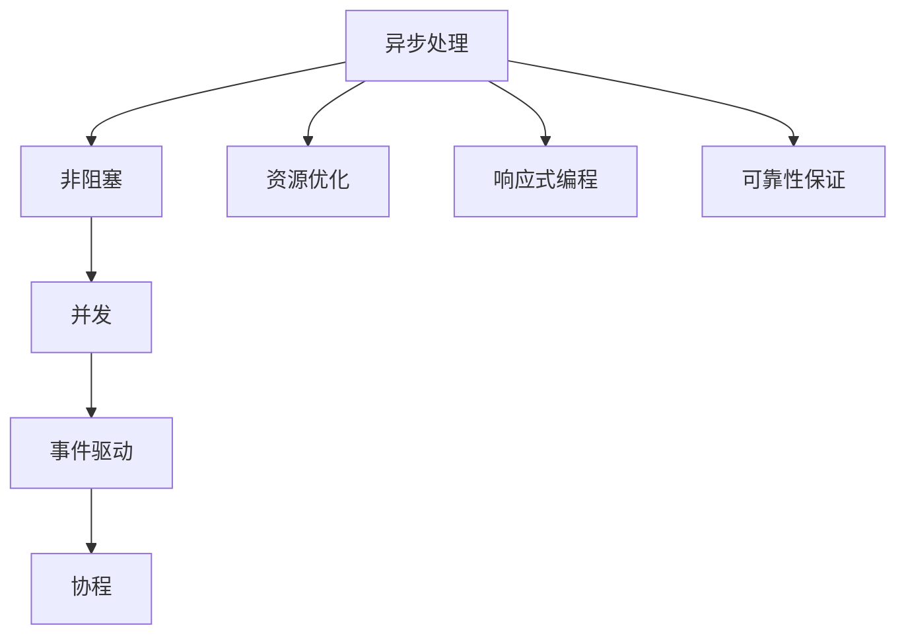

                 

# 异步处理技术在高吞吐量中的实例应用

## 1. 背景介绍

在现代高吞吐量系统中，异步处理技术的应用越来越普遍。随着互联网和移动互联网的普及，各类在线服务系统如电商、社交、搜索、直播等逐渐成为核心基础设施。这些系统需要处理海量请求，并保持高并发、低延迟、高可靠性的服务质量。异步处理技术作为一种高效且灵活的编程范式，为系统设计提供了强大的支撑。

### 1.1 问题由来
随着Web 3.0和云服务的发展，越来越多的系统需要处理大规模的并发请求，传统同步阻塞方式已无法满足高吞吐量的需求。例如，一个大型电商平台需要处理亿级别的订单处理、库存更新、支付接口等操作，传统同步处理方式往往会导致系统资源占用过高、响应时间长、系统可用性低等问题。异步处理技术可以有效地解决这些问题，通过非阻塞方式提升系统处理能力和吞吐量。

### 1.2 问题核心关键点
异步处理技术在高吞吐量应用中的核心关键点主要包括：
- 并发处理：通过异步I/O减少线程切换和阻塞，提升系统并发能力。
- 资源优化：通过异步任务队列优化资源配置，提高系统处理效率。
- 响应式编程：通过回调、事件驱动等机制实现灵活且高效的交互方式。
- 可靠性保证：通过异步机制确保系统的容错性和稳定性。

这些关键点共同构成了异步处理技术的核心优势，使其成为应对高吞吐量需求的重要手段。

### 1.3 问题研究意义
异步处理技术的应用对于提高系统性能、稳定性和用户体验具有重要意义：
1. 提升吞吐量：异步处理技术通过并行处理能力，能够显著提升系统的吞吐量，满足大规模并发请求的需求。
2. 降低延迟：异步处理减少了线程切换和阻塞，降低了系统响应时间，提高了用户体验。
3. 优化资源：异步任务队列能够灵活配置资源，避免系统过载，提高了资源利用率。
4. 增强容错：异步机制使系统具有更高的容错性和自恢复能力，减少了因单点故障导致的系统宕机。
5. 灵活交互：异步处理技术支持灵活的事件驱动编程，提升了系统的交互性。

## 2. 核心概念与联系

### 2.1 核心概念概述
为了更好地理解异步处理技术在高吞吐量系统中的应用，本节将介绍几个密切相关的核心概念：

- 异步处理(Async Processing)：指在事件发生时不立即处理，而是通过回调、事件循环等方式延迟处理，从而提高系统并行处理能力。
- 非阻塞(Non-blocking)：指在处理I/O操作时，不需要等待操作完成，而是继续执行其他任务。
- 并发(Concurrency)：指多个任务同时进行，提升系统的处理能力。
- 事件驱动(Event-driven)：指系统响应事件的发生，执行相应的事件处理函数。
- 协程(Coroutine)：指一种轻量级线程，可以在线程内部进行异步任务处理。

这些概念通过异步处理技术紧密联系在一起，共同构建了高吞吐量系统的核心架构。

### 2.2 概念间的关系

以下通过几个Mermaid流程图来展示这些核心概念的关系：



这个流程图展示了大吞吐量系统中异步处理技术的各个概念之间的关系：

1. 异步处理通过非阻塞方式提升系统并发能力。
2. 并发处理可以充分利用多核CPU，进一步提升系统吞吐量。
3. 事件驱动编程实现灵活交互，支持异步任务的异步执行。
4. 协程提供轻量级线程，增强系统并发处理能力。
5. 资源优化和可靠性保证是异步处理技术应用的重要保障。

这些概念共同构成了异步处理技术的完整生态系统，使其在高吞吐量系统中发挥出强大优势。

## 3. 核心算法原理 & 具体操作步骤
### 3.1 算法原理概述

异步处理技术在高吞吐量系统中的应用主要基于事件驱动和非阻塞I/O机制。通过异步处理，系统能够高效处理海量请求，并保证系统的稳定性和可用性。

具体而言，异步处理技术在高吞吐量系统中的应用原理如下：
- 非阻塞I/O操作：在进行I/O操作时，系统不等待操作完成，而是继续执行其他任务。
- 事件驱动编程：系统通过回调函数或事件循环等方式，响应事件的触发，执行相应的任务。
- 并发任务处理：通过协程等机制，实现多个任务的并行处理，提升系统吞吐量。

这些原理通过异步处理技术紧密联系在一起，共同实现了系统的高吞吐量和高可靠性。

### 3.2 算法步骤详解

以下详细介绍异步处理技术在高吞吐量系统中的应用步骤：

**Step 1: 任务划分与调度**
- 将请求任务划分为多个异步任务，每个任务由一个协程进行处理。
- 通过任务队列对任务进行调度，确保任务有序执行。

**Step 2: 异步I/O处理**
- 使用非阻塞I/O机制处理I/O操作，如文件读写、网络请求等，确保I/O操作不会阻塞任务执行。
- 通过回调函数或事件循环，处理异步I/O操作完成后的响应。

**Step 3: 事件驱动编程**
- 在任务执行过程中，通过事件驱动编程机制，响应事件的触发。例如，当网络请求返回结果时，触发相应的事件处理函数。
- 使用异步库（如Node.js的EventEmitter、Python的asyncio）进行事件驱动编程。

**Step 4: 并发任务处理**
- 使用协程或线程池等机制，实现多个任务的并发处理。例如，在Python中可以使用asyncio库的async/await语法进行协程调度。
- 通过并发任务处理，提升系统吞吐量，确保任务能够及时响应。

**Step 5: 错误处理与容错机制**
- 在任务执行过程中，使用try/catch等机制进行错误处理。例如，在Python中使用asyncio库的try/except语法进行错误捕获。
- 使用异步异常处理机制，增强系统的容错性和稳定性。例如，在Node.js中使用Promise和async/await语法进行异常处理。

通过上述步骤，异步处理技术能够高效处理海量请求，保证系统的高吞吐量和稳定性。

### 3.3 算法优缺点

异步处理技术在高吞吐量系统中的应用具有以下优点：
1. 提高吞吐量：异步处理技术通过并发处理能力，能够显著提升系统的吞吐量，满足大规模并发请求的需求。
2. 降低延迟：异步处理减少了线程切换和阻塞，降低了系统响应时间，提高了用户体验。
3. 优化资源：异步任务队列能够灵活配置资源，避免系统过载，提高了资源利用率。
4. 增强容错：异步机制使系统具有更高的容错性和自恢复能力，减少了因单点故障导致的系统宕机。
5. 灵活交互：异步处理技术支持灵活的事件驱动编程，提升了系统的交互性。

同时，异步处理技术也存在一些缺点：
1. 代码复杂度较高：异步处理需要使用回调、事件驱动等编程方式，代码结构较为复杂。
2. 调试困难：异步处理的错误处理和异常管理较为复杂，调试难度较大。
3. 资源消耗较大：异步任务队列和事件驱动机制需要占用一定的系统资源，可能导致资源浪费。

尽管存在这些缺点，但异步处理技术在高吞吐量系统中的应用仍然是现代系统设计的重要手段。

### 3.4 算法应用领域

异步处理技术已经广泛应用于各种高吞吐量系统的设计和实现中。以下是几个典型的应用领域：

**Web服务**
- Web服务系统需要处理大量的并发请求，如电商网站、社交平台、搜索引擎等。异步处理技术通过事件驱动编程和协程调度，实现了高效处理大量并发请求的目标。

**分布式系统**
- 分布式系统需要处理跨节点的消息传递和数据同步，异步处理技术通过非阻塞I/O和事件驱动编程，提高了系统的并发能力和容错性。例如，Kafka和RabbitMQ等消息中间件均采用异步处理机制。

**实时数据处理**
- 实时数据处理系统需要高效处理海量数据流，如流计算、数据挖掘等。异步处理技术通过协程调度和非阻塞I/O操作，提升了系统的吞吐量和处理速度。例如，Spark Streaming和Flink等流处理框架均支持异步处理机制。

## 4. 数学模型和公式 & 详细讲解  
### 4.1 数学模型构建

在异步处理技术中，常见的数学模型包括吞吐量模型和响应时间模型。以下是详细的数学模型构建和公式推导过程：

**吞吐量模型**

假设系统中的请求数为 $N$，每个请求的处理时间为 $T$，则系统的总处理时间为 $NT$。在异步处理系统中，每个请求的处理时间被分为两部分：处理时间和等待时间。设等待时间为 $W$，则系统总处理时间为 $N(T+W)$。

设系统的并发度为 $C$，则系统的吞吐量为：

$$
S = \frac{N}{T+W} \times C
$$

其中，$C$ 表示系统的并发度。在异步处理系统中，$W$ 通常远大于 $T$，因此 $S$ 可以近似为：

$$
S \approx \frac{N}{W}
$$

即系统的吞吐量主要受等待时间的限制。

**响应时间模型**

设请求的平均处理时间为 $T$，系统响应时间为 $R$，则响应时间的计算公式为：

$$
R = T + W
$$

其中 $T$ 表示请求的平均处理时间，$W$ 表示请求的平均等待时间。在异步处理系统中，$W$ 通常远大于 $T$，因此 $R$ 可以近似为：

$$
R \approx W
$$

即系统的响应时间主要受等待时间的限制。

### 4.2 公式推导过程

以下给出吞吐量模型和响应时间模型的详细推导过程：

**吞吐量模型推导**

设系统的请求速率为 $L$，处理时间为 $T$，等待时间为 $W$，并发度为 $C$。则系统的总处理时间为 $NT + NW$。

设吞吐量为 $S$，则：

$$
S = \frac{NT + NW}{T + W}
$$

由于 $W$ 通常远大于 $T$，因此可以简化为：

$$
S \approx \frac{N}{W}
$$

即系统的吞吐量主要受等待时间的限制。

**响应时间模型推导**

设请求的平均处理时间为 $T$，系统响应时间为 $R$，则响应时间的计算公式为：

$$
R = T + W
$$

由于 $W$ 通常远大于 $T$，因此可以简化为：

$$
R \approx W
$$

即系统的响应时间主要受等待时间的限制。

### 4.3 案例分析与讲解

**Web服务器案例分析**

假设有一个Web服务器，每秒接收 $1000$ 个请求，每个请求的处理时间为 $0.1$ 秒，等待时间为 $1$ 秒。设系统的并发度为 $10$，则系统的吞吐量和响应时间分别为：

$$
S = \frac{1000}{1} \times 10 = 10000
$$

$$
R = 0.1 + 1 = 1.1
$$

因此，系统的吞吐量为 $10000$ 请求/秒，响应时间为 $1.1$ 秒。

**分布式系统案例分析**

假设有一个分布式系统，每秒接收 $10000$ 个请求，每个请求的处理时间为 $0.01$ 秒，等待时间为 $0.1$ 秒。设系统的并发度为 $100$，则系统的吞吐量和响应时间分别为：

$$
S = \frac{10000}{0.1} \times 100 = 1000000
$$

$$
R = 0.01 + 0.1 = 0.11
$$

因此，系统的吞吐量为 $1000000$ 请求/秒，响应时间为 $0.11$ 秒。

## 5. 项目实践：代码实例和详细解释说明
### 5.1 开发环境搭建

在进行异步处理技术的项目实践前，我们需要准备好开发环境。以下是使用Python进行项目开发的环境配置流程：

1. 安装Anaconda：从官网下载并安装Anaconda，用于创建独立的Python环境。

2. 创建并激活虚拟环境：
```bash
conda create -n async-env python=3.8 
conda activate async-env
```

3. 安装Python的异步处理库：
```bash
pip install asyncio uvloop aiohttp
```

4. 安装其他必要的开发库：
```bash
pip install requests numpy pandas
```

完成上述步骤后，即可在`async-env`环境中开始项目实践。

### 5.2 源代码详细实现

以下是使用Python和asyncio库实现一个简单的异步Web服务器示例：

```python
import asyncio
import uvloop
import aiohttp
import requests
from aiohttp.web import run_app

async def handle_request(request):
    data = await request.text()
    response = aiohttp.web.Response(text=f"Hello, {data}")
    return response

async def main():
    app = aiohttp.web.Application()
    app.router.add_get('/', handle_request)
    await app.start_serving()
    try:
        await asyncio.run_forever()
    except KeyboardInterrupt:
        app.close()
        await app.wait_closed()

if __name__ == '__main__':
    uvloop.install()
    asyncio.set_event_loop_policy(uvloop.EventLoopPolicy())
    run_app(main, host='127.0.0.1', port=8080)
```

在这个示例中，我们使用了Python的asyncio库和aiohttp库实现了一个异步Web服务器。具体步骤如下：

**Step 1: 定义请求处理函数**

定义了`handle_request`函数，该函数接收一个请求对象，读取请求正文，返回一个响应对象。在这个函数中，我们使用`await`关键字等待请求正文的读取，然后构建响应对象并返回。

**Step 2: 定义主循环**

定义了`main`函数，该函数创建了一个aiohttp应用程序，定义了一个路由规则，将根路径映射到`handle_request`函数。然后启动Web服务器，进入主循环。

**Step 3: 运行服务器**

在`if __name__ == '__main__':`语句块中，我们安装了uvloop库，用于提升异步I/O的性能。然后设置了异步事件的循环策略，最后启动Web服务器，监听本地的8080端口。

通过以上步骤，我们实现了一个简单的异步Web服务器，可以通过`curl`或浏览器访问该服务器，获取服务器返回的响应。

### 5.3 代码解读与分析

让我们再详细解读一下关键代码的实现细节：

**异步I/O操作**

在`handle_request`函数中，我们使用`await request.text()`等待请求正文的读取。`await`关键字使得异步I/O操作不会阻塞主线程，而是返回一个等待状态。当请求正文读取完成后，`await`关键字会自动唤醒等待状态，继续执行后续代码。

**事件驱动编程**

在`main`函数中，我们使用`app.start_serving()`启动Web服务器，进入主循环。在主循环中，`await asyncio.run_forever()`等待事件触发，当有请求到达时，`app.close()`函数会被触发，停止服务器。

**协程调度**

在Python中，使用`async`关键字定义协程函数，通过`await`关键字进行协程调度。在`handle_request`函数中，我们使用`await`关键字等待请求正文的读取，然后执行后续代码。在`main`函数中，我们使用`await asyncio.run_forever()`进入主循环，等待事件触发。

**错误处理与容错机制**

在异步处理中，我们需要使用try/catch等机制进行错误处理。例如，在`main`函数中，我们使用了`try/except`语句块进行错误捕获。在实际应用中，还需要进一步加强系统的容错性和稳定性，如使用异步异常处理机制，增强系统的可靠性。

### 5.4 运行结果展示

假设我们在本地机器上运行上述异步Web服务器，可以通过`curl http://127.0.0.1:8080`命令访问该服务器，获取服务器返回的响应。

在实际应用中，我们可以通过异步处理技术处理海量请求，提升系统的并发能力和吞吐量。异步处理技术在高吞吐量系统中的应用，已经成为现代系统设计的重要手段。

## 6. 实际应用场景
### 6.1 实例应用场景

异步处理技术已经在多个高吞吐量系统的设计和实现中得到了广泛应用。以下是几个典型的应用场景：

**Web服务**
- 电商网站：电商平台需要处理大量用户下单、支付、库存更新等请求，异步处理技术通过协程调度和非阻塞I/O操作，实现了高效处理海量请求的目标。例如，Amazon的AWS Lambda和阿里云的EventBridge都采用异步处理机制。

**分布式系统**
- 消息中间件：消息中间件需要高效处理跨节点的消息传递和数据同步，异步处理技术通过非阻塞I/O和事件驱动编程，提高了系统的并发能力和容错性。例如，RabbitMQ和Kafka等消息中间件均采用异步处理机制。

**实时数据处理**
- 流处理：流处理系统需要高效处理海量数据流，异步处理技术通过协程调度和非阻塞I/O操作，提升了系统的吞吐量和处理速度。例如，Apache Flink和Apache Kafka Streams均支持异步处理机制。

## 7. 工具和资源推荐
### 7.1 学习资源推荐

为了帮助开发者系统掌握异步处理技术的高吞吐量应用，这里推荐一些优质的学习资源：

1. 《Python异步编程》书籍：全面介绍了Python异步编程技术，涵盖异步I/O、事件驱动编程、协程等核心概念。

2. 《Node.js高级编程》书籍：介绍了Node.js的异步编程机制，包括事件循环、回调、Promise等核心概念。

3. 《asyncio官方文档》：提供了Python的asyncio库的详细文档和示例，帮助开发者快速上手异步处理技术。

4. 《高性能异步编程》文章系列：深入浅出地介绍了异步处理技术的核心原理和应用场景，适合初学者入门。

5. 《异步编程实战》文章系列：从实际项目中总结了异步处理技术的最佳实践和优化策略，适合有经验的开发者。

通过对这些资源的学习实践，相信你一定能够快速掌握异步处理技术的高吞吐量应用，并用于解决实际的系统设计问题。

### 7.2 开发工具推荐

高效的开发离不开优秀的工具支持。以下是几款用于异步处理技术的开发工具：

1. Python的asyncio库：Python内置的异步处理库，支持协程和非阻塞I/O操作，是异步编程的首选工具。

2. Node.js的EventEmitter和Promise库：Node.js的异步处理核心库，支持事件驱动编程和异步异常处理。

3. aiohttp库：Python的异步Web框架，支持异步I/O和协程调度，适合构建高性能Web服务。

4. uvloop库：Python的异步I/O库，使用UVLoop实现，提升了异步I/O的性能。

5. asyncio库的coroutine工具：Python的协程工具，支持异步函数的定义和调度。

6. Promises库：Python的异步异常处理库，支持异步异常的捕获和处理。

合理利用这些工具，可以显著提升异步处理技术的开发效率，加快创新迭代的步伐。

### 7.3 相关论文推荐

异步处理技术的发展源于学界的持续研究。以下是几篇奠基性的相关论文，推荐阅读：

1. "Asynchronous Programming in Go"：介绍Go语言的异步编程机制，是现代异步编程的代表作之一。

2. "Event-driven Programming for Concurrency"：介绍了事件驱动编程的核心原理和应用场景，是异步处理技术的理论基础。

3. "High-Performance Asynchronous Programming in JavaScript"：介绍了Node.js的异步编程机制，展示了异步处理技术在实际应用中的最佳实践。

4. "Asynchronous Programming in Python"：介绍了Python的异步编程机制，包括协程、异步I/O等核心概念。

5. "Asynchronous Programming in Java"：介绍了Java的异步编程机制，展示了异步处理技术在Java中的应用。

这些论文代表了大吞吐量系统中异步处理技术的发展脉络。通过学习这些前沿成果，可以帮助研究者把握学科前进方向，激发更多的创新灵感。

除上述资源外，还有一些值得关注的前沿资源，帮助开发者紧跟异步处理技术的最新进展，例如：

1. arXiv论文预印本：人工智能领域最新研究成果的发布平台，包括大量尚未发表的前沿工作，学习前沿技术的必读资源。

2. 业界技术博客：如Go官网、Node.js官网、Microsoft官方博客等顶尖实验室的官方博客，第一时间分享他们的最新研究成果和洞见。

3. 技术会议直播：如ACL、ICML、NIPS等人工智能领域顶会现场或在线直播，能够聆听到大佬们的前沿分享，开拓视野。

4. GitHub热门项目：在GitHub上Star、Fork数最多的异步处理技术相关项目，往往代表了该技术领域的发展趋势和最佳实践，值得去学习和贡献。

5. 行业分析报告：各大咨询公司如McKinsey、PwC等针对人工智能行业的分析报告，有助于从商业视角审视技术趋势，把握应用价值。

总之，对于异步处理技术的高吞吐量应用的学习和实践，需要开发者保持开放的心态和持续学习的意愿。多关注前沿资讯，多动手实践，多思考总结，必将收获满满的成长收益。

## 8. 总结：未来发展趋势与挑战
### 8.1 总结

本文对异步处理技术在高吞吐量系统中的应用进行了全面系统的介绍。首先阐述了异步处理技术的研究背景和意义，明确了异步处理在高吞吐量系统中的核心价值。其次，从原理到实践，详细讲解了异步处理的数学模型和核心步骤，给出了异步处理技术的完整代码实例。同时，本文还广泛探讨了异步处理技术在Web服务、分布式系统、实时数据处理等多个领域的应用前景，展示了异步处理技术的强大优势。此外，本文精选了异步处理技术的各类学习资源，力求为读者提供全方位的技术指引。

通过本文的系统梳理，可以看到，异步处理技术在高吞吐量系统中的应用已经非常广泛，成为现代系统设计的重要手段。异步处理技术通过并发处理能力、非阻塞I/O操作、事件驱动编程等机制，显著提升了系统的并发能力和吞吐量，满足了大规模并发请求的需求。未来，伴随异步处理技术的持续演进，高吞吐量系统将能够更好地应对海量请求，提供更快速、更稳定、更高效的服务体验。

### 8.2 未来发展趋势

展望未来，异步处理技术在高吞吐量系统中的应用将呈现以下几个发展趋势：

1. 并发度提升：随着硬件性能的提升和编程语言的优化，异步处理技术的并发度将进一步提升，系统能够处理更海量的并发请求。

2. 错误处理优化：异步处理技术的错误处理和异常管理将进一步优化，通过异步异常处理机制，增强系统的容错性和稳定性。

3. 分布式系统优化：异步处理技术将进一步应用于分布式系统的设计和实现中，提升系统的容错性和可扩展性。

4. 实时数据处理优化：异步处理技术将进一步应用于实时数据处理系统中，提升系统的吞吐量和处理速度。

5. 应用场景拓展：异步处理技术将进一步应用于更多高吞吐量场景，如实时交易、实时监控、实时搜索等，提供更快速、更可靠的服务体验。

以上趋势凸显了异步处理技术在高吞吐量系统中的广阔前景。这些方向的探索发展，必将进一步提升系统的处理能力和用户体验，推动高吞吐量技术的不断进步。

### 8.3 面临的挑战

尽管异步处理技术在高吞吐量系统中的应用已经取得了显著成效，但在迈向更加智能化、普适化应用的过程中，它仍面临着诸多挑战：

1. 代码复杂度增加：异步处理技术的使用需要开发者掌握复杂的事件驱动和协程机制，增加了开发难度。

2. 调试难度提高：异步处理技术的错误处理和异常管理较为复杂，调试难度较大。

3. 资源消耗较大：异步任务队列和事件驱动机制需要占用一定的系统资源，可能导致资源浪费。

4. 容错性和稳定性：异步处理技术在高吞吐量系统中的应用，需要保证系统的容错性和稳定性，避免单点故障导致的系统宕机。

5. 编程语言支持：异步处理技术在不同编程语言中的支持程度不同，开发者的选择受限。

尽管存在这些挑战，但异步处理技术在高吞吐量系统中的应用仍然是现代系统设计的重要手段。通过不断优化和改进，相信这些挑战终将一一被克服，异步处理技术必将在高吞吐量系统中发挥出更大的优势。

### 8.4 未来突破

面对异步处理技术在高吞吐量系统中的应用所面临的挑战，未来的研究需要在以下几个方面寻求新的突破：

1. 编程语言优化：不同编程语言对异步处理的支持程度不同，未来需要在更多的编程语言中优化异步处理机制，提供更高效的异步编程工具。

2. 并发度提升：通过优化硬件和编程语言，进一步提升异步处理技术的并发度，使其能够处理更海量的并发请求。

3. 错误处理优化：通过引入异步异常处理机制，增强系统的容错性和稳定性，避免单点

