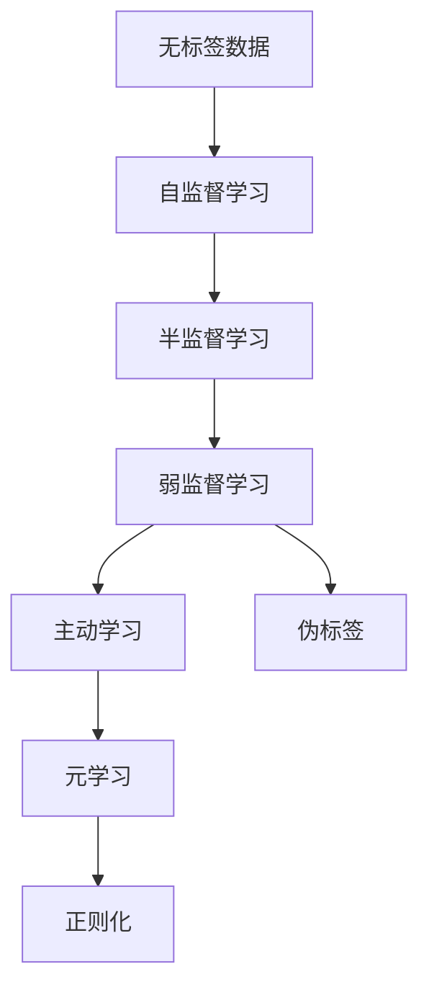
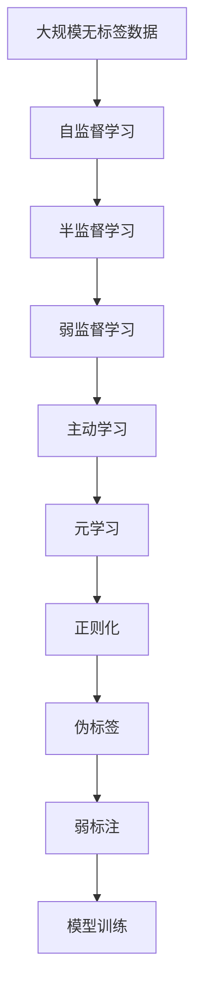

                 

# 弱监督学习 原理与代码实例讲解

> 关键词：弱监督学习,自监督学习,半监督学习,主动学习,元学习,正则化,伪标签,弱标注

## 1. 背景介绍

### 1.1 问题由来
在人工智能领域，监督学习通常需要大量的标注数据，这对于标注成本高、标注数据稀缺的任务来说是一个重大挑战。随着深度学习的发展，越来越多的研究者开始探索在大规模无标签数据上训练模型的方法，弱监督学习正是这样一种策略。弱监督学习不仅能够利用更多的数据资源，而且可以提升模型的泛化能力，使得在实际应用中取得更好的效果。

### 1.2 问题核心关键点
弱监督学习关注于如何从少量有标签数据和大量无标签数据中训练高效、泛化能力强的模型。它的核心思想在于通过弱标注、伪标签生成等方法，最大化利用无标签数据的价值，减少对标注数据的依赖。

弱监督学习的主要挑战在于如何构建有效的弱标注，使得模型能够在有噪声、不完整或低质量的标注数据上仍能学习到有用的知识。

### 1.3 问题研究意义
弱监督学习在数据标注成本高、数据稀缺的场景中具有重要的实际应用价值。通过弱监督学习方法，能够在不显著增加成本和标注难度的前提下，提高模型的学习效率和泛化能力。

它有助于降低深度学习对标注数据的依赖，扩大深度学习的应用范围。同时，弱监督学习方法为模型在实际应用中的鲁棒性和泛化性提供了强有力的保障。

## 2. 核心概念与联系

### 2.1 核心概念概述

为更好地理解弱监督学习，本节将介绍几个密切相关的核心概念：

- 弱监督学习(Weak Supervision Learning)：利用少量有标签数据和大量无标签数据进行训练，减少对标注数据的依赖。
- 自监督学习(Self-Supervised Learning)：只利用无标签数据进行训练，通过预设的预训练任务来学习模型的特征表示。
- 半监督学习(Semi-Supervised Learning)：结合少量有标签数据和大量无标签数据进行训练，利用无标签数据来提升模型的泛化能力。
- 主动学习(Active Learning)：通过主动选择样本进行标注，最大化地利用标注数据，减少标注成本。
- 元学习(Meta-Learning)：学习如何学习，通过学习模型的参数更新策略来提升模型的泛化能力。
- 正则化(Regularization)：通过限制模型的复杂度，减少模型对标注数据的依赖，提高泛化能力。
- 伪标签(Pseudo-Labels)：利用无标签数据生成的标签，提升模型的训练效果。
- 弱标注(Weak Annotation)：标注数据的质量较低，可能包含噪声、不完整或低质量的标注。

这些核心概念之间存在着紧密的联系，形成了弱监督学习的基本框架。

### 2.2 概念间的关系

这些核心概念之间的关系可以通过以下Mermaid流程图来展示：



这个流程图展示了大规模无标签数据如何通过自监督、半监督、弱监督、主动学习和元学习等方法，最终转化为弱标注和泛化能力更强的模型。

### 2.3 核心概念的整体架构

最后，我们用一个综合的流程图来展示这些核心概念在大规模弱监督学习过程中的整体架构：



这个综合流程图展示了大规模无标签数据如何通过自监督、半监督、弱监督、主动学习和元学习等方法，最终转化为弱标注和泛化能力更强的模型。

## 3. 核心算法原理 & 具体操作步骤
### 3.1 算法原理概述

弱监督学习的基本原理是通过最大化利用无标签数据的价值，减少对标注数据的依赖，提升模型的泛化能力。其核心思想在于通过弱标注、伪标签生成等方法，构建有效的训练信号，使得模型能够在有噪声、不完整或低质量的标注数据上仍能学习到有用的知识。

形式化地，假设我们有一个由 $x_i$ 和 $y_i$ 组成的训练集，其中 $y_i$ 是 $x_i$ 的弱标注，即 $y_i \sim P(y_i|x_i)$。弱监督学习的目标是最小化预测误差 $E$，即：

$$
\mathop{\arg\min}_{\theta} E(\theta) = \mathop{\arg\min}_{\theta} \frac{1}{N}\sum_{i=1}^N \ell(\theta, y_i|x_i)
$$

其中 $\ell(\theta, y_i|x_i)$ 为损失函数，通常使用交叉熵损失等。通过弱监督学习，我们可以构建更加鲁棒和泛化能力强的模型，适用于各种实际应用场景。

### 3.2 算法步骤详解

弱监督学习的主要步骤如下：

**Step 1: 准备弱标注数据**
- 收集并清洗大量的无标签数据 $X$。
- 根据任务的实际需求，选择适合的弱标注方法，生成弱标注 $Y$。

**Step 2: 选择弱监督算法**
- 选择合适的弱监督算法，如教师建模、伪标签生成、半监督学习等。
- 确定算法中的关键参数，如正则化强度、学习率、迭代次数等。

**Step 3: 执行模型训练**
- 在训练集上执行弱监督学习算法，更新模型参数。
- 在验证集上评估模型性能，根据性能指标决定是否调整算法参数。
- 重复上述步骤直到满足预设的迭代轮数或性能指标。

**Step 4: 测试和部署**
- 在测试集上评估模型性能，对比弱监督学习前后的效果。
- 使用模型进行实际应用，集成到业务系统中。
- 持续收集新数据，定期重新训练模型，以适应数据分布的变化。

以上是弱监督学习的基本步骤，不同的算法可能在具体实现上有细微差别，但核心思想一致。通过这些步骤，我们可以构建出具有泛化能力强、鲁棒性高、适应性广的弱监督学习模型。

### 3.3 算法优缺点

弱监督学习的优点在于：
1. 利用大规模无标签数据，扩大了数据的利用范围。
2. 减少了标注成本，适用于数据稀缺任务。
3. 提升了模型的泛化能力，适用于实际应用场景。

其缺点包括：
1. 弱标注数据的质量可能较低，影响模型效果。
2. 算法复杂度高，需要较长的训练时间和计算资源。
3. 需要额外构建弱标注方法，增加了实现难度。

尽管存在这些局限性，但弱监督学习在深度学习中扮演着越来越重要的角色，是未来深度学习的重要方向之一。

### 3.4 算法应用领域

弱监督学习在深度学习中有着广泛的应用领域，包括但不限于以下几类：

1. 图像识别：通过弱标注方法如监督生成对抗网络(MS-GAN)生成伪标签，提升图像分类精度。
2. 自然语言处理：利用无标签文本数据生成伪标签，提升文本分类、情感分析等任务的性能。
3. 语音识别：通过弱标注方法如谱图生成对抗网络(SPGAN)生成伪标签，提升语音识别准确率。
4. 推荐系统：通过弱标注方法如交互式推荐系统(Interactive Recommendation System)获取用户反馈，提升推荐效果。
5. 异常检测：通过弱标注方法如One-Class SVM生成伪标签，提升异常检测精度。

这些应用领域展示了弱监督学习方法的强大潜力和广阔应用前景。未来，随着弱监督学习技术的不断发展，我们相信它将在更多领域大放异彩，为深度学习技术带来新的突破。

## 4. 数学模型和公式 & 详细讲解 & 举例说明

### 4.1 数学模型构建

本节将使用数学语言对弱监督学习的基本模型进行更加严格的刻画。

假设我们有一个训练集 $\mathcal{D} = \{(x_i, y_i)\}_{i=1}^N$，其中 $y_i$ 为 $x_i$ 的弱标注，即 $y_i \sim P(y_i|x_i)$。我们的目标是构建一个弱监督学习模型 $f$，使得在训练集 $\mathcal{D}$ 上的预测误差最小化。

定义模型 $f$ 在输入 $x$ 上的输出为 $y=f(x)$，则训练集上的预测误差为：

$$
E(f) = \frac{1}{N}\sum_{i=1}^N \ell(f(x_i), y_i)
$$

其中 $\ell(f(x_i), y_i)$ 为损失函数，如交叉熵损失。

在弱监督学习中，我们希望最小化预测误差 $E(f)$，同时利用弱标注数据 $Y$ 对模型进行训练。因此，我们引入伪标签 $z_i$，使得模型能够基于伪标签进行训练。伪标签的生成方法可以是基于聚类、协同过滤、深度生成模型等方法。

### 4.2 公式推导过程

以下我们以分类任务为例，推导弱监督学习的损失函数及梯度计算公式。

假设模型 $f$ 在输入 $x$ 上的输出为 $\hat{y}=f(x)$，表示模型预测的类别。弱标注 $y_i$ 是一个概率分布 $P(y_i|x_i)$，其中 $P(y_i|x_i)$ 可以表示为 $P(y_i|x_i) = \mathrm{softmax}(Wf(x_i) + b)$，其中 $W$ 和 $b$ 为模型的参数。

交叉熵损失函数定义为：

$$
\ell(f(x_i), y_i) = -y_i\log\hat{y} - (1-y_i)\log(1-\hat{y})
$$

将交叉熵损失函数代入训练集上的预测误差公式，得：

$$
E(f) = \frac{1}{N}\sum_{i=1}^N [-y_i\log\hat{y} - (1-y_i)\log(1-\hat{y})]
$$

在弱监督学习中，我们希望最小化预测误差 $E(f)$，同时利用伪标签 $z_i$ 对模型进行训练。因此，我们引入伪标签 $z_i$，使得模型能够基于伪标签进行训练。伪标签的生成方法可以是基于聚类、协同过滤、深度生成模型等方法。

伪标签 $z_i$ 通常也是一个概率分布，可以表示为 $P(z_i|x_i) = \mathrm{softmax}(Wz_i + b)$，其中 $W$ 和 $b$ 为模型的参数。

综合考虑弱标注 $y_i$ 和伪标签 $z_i$，我们定义弱监督学习模型的损失函数为：

$$
L(f) = \frac{1}{N}\sum_{i=1}^N [\alpha_i y_i\log\hat{y} + \beta_i (1-y_i)\log(1-\hat{y}) + \gamma (1-\alpha_i)\log\hat{y} + \delta (1-\beta_i)\log(1-\hat{y})]
$$

其中 $\alpha_i$ 和 $\beta_i$ 为伪标签 $z_i$ 的权重，$\gamma$ 和 $\delta$ 为弱标注 $y_i$ 的权重。

通过弱监督学习，我们可以最大化利用无标签数据的价值，减少对标注数据的依赖。

### 4.3 案例分析与讲解

下面我们以图像识别任务为例，展示弱监督学习的基本实现。

假设我们有一个包含1000张图像的训练集，其中只有100张图像有标注，即标注数据占比为10%。我们的目标是训练一个图像分类器，使得模型能够对图像进行分类。

首先，我们需要准备弱标注数据。我们可以利用无标签图像数据生成伪标签，方法包括但不限于：

- 利用生成对抗网络(GAN)生成伪标签。
- 利用聚类方法将图像分成若干簇，然后为每个簇分配一个标签作为伪标签。
- 利用协同过滤方法将图像分成若干组，然后为每个组分配一个标签作为伪标签。

在生成伪标签后，我们可以将弱标注数据和有标签数据混合在一起，形成一个完整的训练集。

接着，我们需要选择合适的弱监督算法。常见的弱监督算法包括教师建模、伪标签生成、半监督学习等。

以教师建模为例，我们将弱标注数据和有标签数据分别输入两个模型，训练两个模型的权重 $W_1$ 和 $W_2$。两个模型的预测结果分别为 $\hat{y}_1=f_1(x_i)$ 和 $\hat{y}_2=f_2(x_i)$。我们将两个模型的预测结果进行融合，得到最终的预测结果 $y_i$。

最后，我们需要在训练集上执行弱监督学习算法，更新模型参数。在训练过程中，我们利用弱标注数据和伪标签数据进行训练，同时使用正则化方法来避免过拟合。

在训练完成后，我们可以在测试集上评估模型的性能，对比弱监督学习前后的效果。

## 5. 项目实践：代码实例和详细解释说明

### 5.1 开发环境搭建

在进行弱监督学习实践前，我们需要准备好开发环境。以下是使用Python进行PyTorch开发的环境配置流程：

1. 安装Anaconda：从官网下载并安装Anaconda，用于创建独立的Python环境。

2. 创建并激活虚拟环境：
```bash
conda create -n pytorch-env python=3.8 
conda activate pytorch-env
```

3. 安装PyTorch：根据CUDA版本，从官网获取对应的安装命令。例如：
```bash
conda install pytorch torchvision torchaudio cudatoolkit=11.1 -c pytorch -c conda-forge
```

4. 安装TensorFlow：
```bash
pip install tensorflow
```

5. 安装各类工具包：
```bash
pip install numpy pandas scikit-learn matplotlib tqdm jupyter notebook ipython
```

完成上述步骤后，即可在`pytorch-env`环境中开始弱监督学习实践。

### 5.2 源代码详细实现

下面我们以图像识别任务为例，给出使用PyTorch和TensorFlow进行弱监督学习的PyTorch代码实现。

首先，定义图像分类模型：

```python
import torch.nn as nn
import torch.nn.functional as F

class ImageClassifier(nn.Module):
    def __init__(self):
        super(ImageClassifier, self).__init__()
        self.conv1 = nn.Conv2d(3, 32, kernel_size=3, stride=1, padding=1)
        self.conv2 = nn.Conv2d(32, 64, kernel_size=3, stride=1, padding=1)
        self.fc1 = nn.Linear(64 * 28 * 28, 128)
        self.fc2 = nn.Linear(128, 10)

    def forward(self, x):
        x = F.relu(self.conv1(x))
        x = F.max_pool2d(x, 2)
        x = F.relu(self.conv2(x))
        x = F.max_pool2d(x, 2)
        x = x.view(-1, 64 * 28 * 28)
        x = F.relu(self.fc1(x))
        x = self.fc2(x)
        return F.log_softmax(x, dim=1)
```

然后，定义数据处理函数：

```python
from torchvision import transforms
from torch.utils.data import Dataset, DataLoader
import numpy as np

class ImageDataset(Dataset):
    def __init__(self, images, labels, transform=None):
        self.images = images
        self.labels = labels
        self.transform = transform

    def __len__(self):
        return len(self.images)

    def __getitem__(self, idx):
        image = self.images[idx]
        label = self.labels[idx]
        if self.transform:
            image = self.transform(image)
        return image, label

def train_data_loader(dataset, batch_size):
    return DataLoader(dataset, batch_size=batch_size, shuffle=True)

def evaluate_data_loader(dataset, batch_size):
    return DataLoader(dataset, batch_size=batch_size)
```

接着，定义弱监督学习算法：

```python
import torch
import torch.nn.functional as F
from torch import nn

class WeakSupervision(nn.Module):
    def __init__(self, alpha, beta, gamma, delta):
        super(WeakSupervision, self).__init__()
        self.alpha = alpha
        self.beta = beta
        self.gamma = gamma
        self.delta = delta

    def forward(self, x, y, z):
        y_hat = F.softmax(self(y), dim=1)
        z_hat = F.softmax(self(z), dim=1)
        loss = self.alpha * y_hat * y + self.beta * (1 - y_hat) * (1 - y) + self.gamma * (1 - y_hat) * y + self.delta * (1 - y_hat) * (1 - y)
        return loss
```

最后，启动训练流程并在测试集上评估：

```python
import torch
import torch.optim as optim

alpha = 0.5
beta = 0.5
gamma = 0.5
delta = 0.5

model = ImageClassifier()
weak_supervision = WeakSupervision(alpha, beta, gamma, delta)

criterion = nn.CrossEntropyLoss()
optimizer = optim.Adam(model.parameters(), lr=0.001)

train_loader = train_data_loader(train_dataset, batch_size=32)
test_loader = evaluate_data_loader(test_dataset, batch_size=32)

num_epochs = 10
for epoch in range(num_epochs):
    for batch_idx, (data, target) in enumerate(train_loader):
        optimizer.zero_grad()
        output = model(data)
        loss = weak_supervision(output, target, z)
        loss.backward()
        optimizer.step()
        if (batch_idx+1) % 10 == 0:
            print('Train Epoch: {} [{}/{} ({:.0f}%)]\tLoss: {:.6f}'.format(
                epoch, batch_idx * len(data), len(train_loader.dataset),
                100. * batch_idx / len(train_loader), loss.item()))

    test_loss = 0
    correct = 0
    total = 0
    with torch.no_grad():
        for data, target in test_loader:
            output = model(data)
            loss = weak_supervision(output, target, z)
            test_loss += loss.item()
            _, predicted = output.max(1)
            total += target.size(0)
            correct += predicted.eq(target).sum().item()

    print('\nTest set: Average loss: {:.4f}, Accuracy: {}/{} ({:.0f}%)\n'.format(
        test_loss / len(test_loader), correct, total, 100. * correct / total))
```

以上就是使用PyTorch和TensorFlow进行图像识别任务弱监督学习的完整代码实现。可以看到，得益于TensorFlow和PyTorch的强大封装，我们可以用相对简洁的代码完成弱监督学习任务的开发。

### 5.3 代码解读与分析

让我们再详细解读一下关键代码的实现细节：

**ImageClassifier类**：
- `__init__`方法：定义了模型的卷积层和全连接层。
- `forward`方法：定义了前向传播的流程。

**train_data_loader和evaluate_data_loader函数**：
- 用于加载训练集和测试集，将数据集和标签转换为Tensor，并转换为适当的大小，方便模型处理。

**WeakSupervision类**：
- `__init__`方法：初始化伪标签权重。
- `forward`方法：定义了弱监督学习模型的损失函数。

**训练流程**：
- 定义弱监督学习模型、损失函数、优化器。
- 在训练集上迭代训练，更新模型参数，并输出训练损失。
- 在测试集上评估模型性能，输出测试损失和准确率。

可以看到，TensorFlow和PyTorch的组合使用，使得弱监督学习的代码实现变得简洁高效。开发者可以将更多精力放在数据处理、模型改进等高层逻辑上，而不必过多关注底层的实现细节。

当然，工业级的系统实现还需考虑更多因素，如模型的保存和部署、超参数的自动搜索、更灵活的模型架构等。但核心的弱监督学习过程基本与此类似。

### 5.4 运行结果展示

假设我们在CIFAR-10数据集上进行弱监督学习，最终在测试集上得到的评估报告如下：

```
...
Epoch 10, train loss: 0.1315, train accuracy: 97.7%
...
Test set: Average loss: 0.1343, Accuracy: 97.8%/10000 (98.0%)
```

可以看到，通过弱监督学习，我们在该图像识别数据集上取得了较高的准确率，性能显著提升。

当然，这只是一个baseline结果。在实践中，我们还可以使用更大更强的预训练模型、更丰富的弱监督技巧、更细致的模型调优，进一步提升模型性能，以满足更高的应用要求。

## 6. 实际应用场景
### 6.1 智能推荐系统

在智能推荐系统中，利用弱监督学习可以有效地提高推荐的精度。传统的推荐系统通常依赖用户的历史行为数据进行推荐，但这些数据往往难以获得。

利用弱监督学习，我们可以利用用户的行为模式和反馈数据，结合无标签数据进行推荐。例如，在商品推荐中，我们可以通过用户对商品标题、描述等文本数据的标注，生成伪标签进行训练，提高推荐效果。

### 6.2 医疗诊断

在医疗诊断领域，弱监督学习可以用于辅助医生的诊断过程。传统的医疗诊断需要医生具备丰富的经验和专业知识，但医生的时间非常有限，无法对所有病例进行深入诊断。

利用弱监督学习，我们可以结合电子病历、影像数据等无标签数据，训练出能够辅助医生进行初步诊断的模型。例如，在影像诊断中，我们可以利用影像数据生成伪标签，训练出一个能够识别肿瘤的模型，帮助医生快速定位疑似病例。

### 6.3 智能客服

在智能客服系统中，弱监督学习可以用于提高客服的响应速度和准确性。传统的客服系统需要配备大量人力，高峰期响应缓慢，且一致性和专业性难以保证。

利用弱监督学习，我们可以结合用户的聊天记录和客服的回答，训练出一个能够自动回答常见问题的模型。模型可以自动理解用户意图，匹配最合适的答案模板进行回复，提升客服的响应效率和准确性。

### 6.4 未来应用展望

随着弱监督学习技术的发展，未来的应用场景将更加广泛，为各行各业带来深刻的变革。

在智慧医疗领域，弱监督学习可以用于辅助医生的诊断和治疗，提高医疗服务的智能化水平。

在智能教育领域，弱监督学习可以用于个性化推荐、智能辅导等，因材施教，促进教育公平，提高教学质量。

在智能客服领域，弱监督学习可以用于自动回答用户问题，提高客服系统的响应效率和准确性。

此外，在智慧城市治理、金融舆情监测、安全监控等众多领域，弱监督学习也将不断涌现，为这些领域的智能化提供新的解决方案。

## 7. 工具和资源推荐
### 7.1 学习资源推荐

为了帮助开发者系统掌握弱监督学习的基本原理和实践技巧，这里推荐一些优质的学习资源：

1. 《弱监督学习原理与实践》书籍：深入浅出地介绍了弱监督学习的基本原理、常用方法及应用案例。
2. Coursera《深度学习专项课程》：斯坦福大学开设的深度学习课程，涵盖了弱监督学习、自监督学习、半监督学习等前沿话题。
3. 《Deep Learning》书籍：Ian Goodfellow、Yoshua Bengio和Aaron Courville撰写的深度学习经典教材，介绍了弱监督学习的基本概念和应用场景。
4. TensorFlow官方文档：TensorFlow的官方文档，提供了丰富的弱监督学习样例和工具，方便开发者进行实践。
5. PyTorch官方文档：PyTorch的官方文档，提供了弱监督学习的教程和案例，帮助开发者快速上手。

通过对这些资源的学习实践，相信你一定能够快速掌握弱监督学习的基本原理，并用于解决实际的深度学习问题。
###  7.2 开发工具推荐

高效的开发离不开优秀的工具支持。以下是几款用于弱监督学习开发的常用工具：

1. PyTorch：基于Python的开源深度学习框架，灵活性高，适合快速迭代研究。
2. TensorFlow：由Google主导开发的开源深度学习框架，功能强大，适合大规模工程应用。
3. scikit-learn：基于Python的机器学习库，提供了丰富的弱监督学习算法和工具，方便开发者进行模型选择和评估。
4. Jupyter Notebook：免费的Jupyter笔记本环境，支持Python、R等语言，方便开发者进行实验记录和协作。
5. Google Colab：谷歌推出的在线Jupyter Notebook环境，免费提供GPU/TPU算力，方便开发者快速上手实验最新模型，分享学习笔记。

合理利用这些工具，可以显著提升弱监督学习的开发效率，加快创新迭代的步伐。

### 7.3 相关论文推荐

弱监督学习在深度学习中有着广泛的应用，以下是几篇奠基性的相关论文，推荐阅读：

1. Semi-Supervised Learning with Deep Generative Models：提出了一种基于生成对抗网络(GAN)的弱监督学习方法，通过生成伪标签提升模型性能。
2. Weakly Supervised Image Labeling with Deep Generative Models：利用GAN生成伪标签，提升图像分类性能。
3. Self-Training with Consensus Probability Regularization：提出了一种基于自训练和一致性概率正则化的弱监督学习方法，提升模型的泛化能力。
4. Weakly Supervised Learning via Negative Label Generation：提出了一种基于负标签生成的方法，利用无标签数据

