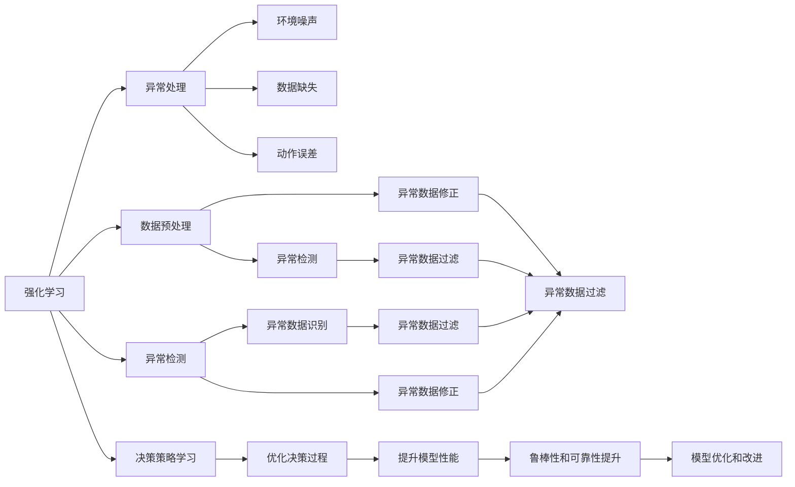
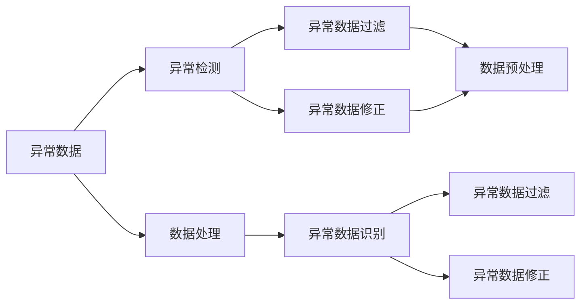
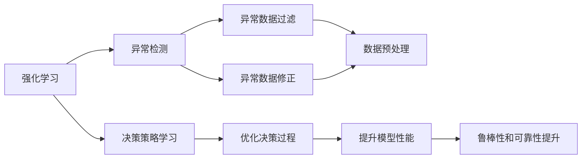
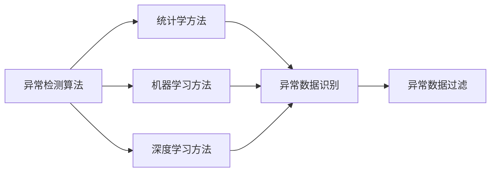
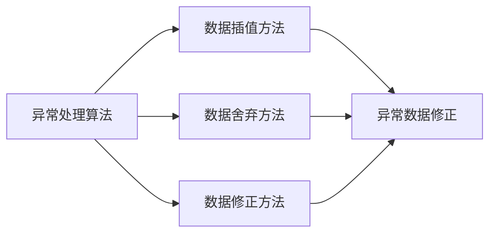
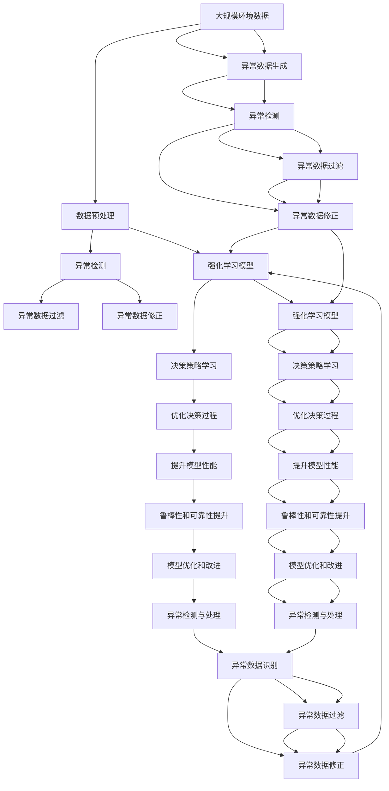

                 

# 强化学习Reinforcement Learning中的异常检测与处理方法

> 关键词：强化学习,异常检测,异常处理,Reinforcement Learning,RL,异常检测算法,异常处理算法,深度学习,强化学习理论

## 1. 背景介绍

### 1.1 问题由来
随着深度学习和强化学习（Reinforcement Learning, RL）技术的快速发展，其在自动驾驶、游戏智能、机器人控制等领域的应用越来越广泛。然而，在实际应用中，RL模型经常面临各种异常情况，如环境噪声、数据缺失、动作误差等，这些异常情况可能导致模型性能下降，甚至崩溃。因此，如何在强化学习中有效进行异常检测与处理，成为当前RL研究中的一个重要课题。

异常检测与处理技术的引入，不仅可以提高模型的鲁棒性和稳定性，还可以有效避免由于异常数据带来的不良影响，从而提升模型的整体性能。在RL中，异常检测与处理具有以下几个重要意义：

1. **鲁棒性提升**：异常检测能够帮助识别和过滤掉异常数据，避免其对模型学习过程的干扰，提升模型鲁棒性。
2. **性能优化**：异常处理能够修正异常数据带来的误差，优化模型的决策过程，提高模型性能。
3. **稳定性和可靠性**：异常检测与处理技术能够增强系统的稳定性和可靠性，减少由于异常数据导致的系统崩溃或故障。

### 1.2 问题核心关键点
强化学习中的异常检测与处理涉及多个关键点，包括异常检测算法的构建、异常数据的识别和处理、异常情况的应对策略等。其主要难点在于：

1. **数据多样性**：RL模型处理的数据种类繁多，包括图像、语音、文本等多种类型，如何构建通用的异常检测算法成为挑战。
2. **数据量稀疏**：RL模型通常需要大量数据进行训练，但异常数据往往是稀疏且难以获取的，如何高效处理稀疏异常数据成为问题。
3. **异常多样性**：RL模型所面临的异常情况多样复杂，包括环境噪声、数据缺失、动作误差等，如何识别和处理不同类型的异常情况是一个重要课题。
4. **实时性要求**：RL模型往往需要实时处理数据，异常检测与处理算法需要高效快速，以便及时应对异常情况。

### 1.3 问题研究意义
研究RL中的异常检测与处理方法，对于提高RL模型的鲁棒性和可靠性，提升其在实际应用中的性能，具有重要意义：

1. **提升模型鲁棒性**：异常检测与处理技术能够帮助模型识别和过滤掉异常数据，提升模型在各种异常情况下的鲁棒性。
2. **优化决策过程**：异常处理能够修正异常数据带来的误差，优化模型的决策过程，提高模型的性能和准确性。
3. **保障系统稳定**：异常检测与处理技术能够增强系统的稳定性和可靠性，减少由于异常数据导致的系统崩溃或故障。
4. **推动RL应用**：异常检测与处理技术的进步，能够促进RL技术在更多领域的落地应用，加速人工智能技术的产业化进程。

## 2. 核心概念与联系

### 2.1 核心概念概述

为了更好地理解强化学习中的异常检测与处理方法，本节将介绍几个关键概念：

1. **强化学习（Reinforcement Learning, RL）**：强化学习是一种基于智能体与环境交互的机器学习范式，通过学习环境中的奖励信号，智能体不断优化决策策略，以最大化累计奖励。

2. **异常检测（Anomaly Detection）**：异常检测是一种识别和过滤掉异常数据的统计方法，常用于数据预处理和模型诊断中。

3. **异常处理（Anomaly Handling）**：异常处理是一种对异常数据进行修正或舍弃的技术，常用于提升模型鲁棒性和优化决策过程。

4. **深度学习（Deep Learning）**：深度学习是一种基于多层神经网络的机器学习方法，在图像、语音、文本处理等领域具有广泛应用。

5. **强化学习理论**：强化学习理论研究智能体与环境交互中的决策策略学习，包括Q-learning、SARSA、Deep Q-Learning等。

6. **异常检测算法**：异常检测算法包括基于统计学的方法、基于机器学习的方法、基于深度学习的方法等。

7. **异常处理算法**：异常处理算法包括基于数据插值的方法、基于数据舍弃的方法、基于数据修正的方法等。

8. **异常类型**：异常类型包括环境噪声、数据缺失、动作误差等。

这些核心概念之间的逻辑关系可以通过以下Mermaid流程图来展示：



这个流程图展示了强化学习中异常检测与处理的主要概念和它们之间的联系。异常检测与处理技术不仅能够提升强化学习模型的鲁棒性和可靠性，还能够优化决策过程，提升模型的性能。

### 2.2 概念间的关系

这些核心概念之间存在着紧密的联系，形成了强化学习中异常检测与处理的完整生态系统。下面我通过几个Mermaid流程图来展示这些概念之间的关系。

#### 2.2.1 异常检测与处理的核心过程



这个流程图展示了异常检测与处理的基本过程，包括异常数据的识别、过滤和修正。异常检测通过识别异常数据，帮助提升模型的鲁棒性；异常处理通过过滤和修正异常数据，优化决策过程，提升模型性能。

#### 2.2.2 强化学习中的异常检测与处理



这个流程图展示了强化学习中异常检测与处理的应用场景。异常检测与处理不仅能够提升强化学习模型的鲁棒性和可靠性，还能够优化决策过程，提升模型的性能。

#### 2.2.3 异常检测算法的选择



这个流程图展示了异常检测算法的种类及其应用场景。根据数据类型和异常情况的不同，可以选择不同的异常检测算法。

#### 2.2.4 异常处理算法的选择



这个流程图展示了异常处理算法的种类及其应用场景。根据异常数据的类型和处理需求，可以选择不同的异常处理算法。

### 2.3 核心概念的整体架构

最后，我们用一个综合的流程图来展示这些核心概念在强化学习中异常检测与处理中的整体架构：



这个综合流程图展示了从数据预处理到异常检测与处理的完整过程，以及异常检测与处理在强化学习中的整体应用。异常检测与处理技术通过识别和过滤异常数据，提升强化学习模型的鲁棒性和可靠性，优化决策过程，提升模型性能。

## 3. 核心算法原理 & 具体操作步骤
### 3.1 算法原理概述

强化学习中的异常检测与处理，本质上是通过构建异常检测算法和异常处理算法，识别和修正异常数据，提升模型的鲁棒性和稳定性。

形式化地，假设强化学习模型为 $M$，环境数据为 $D$，异常检测算法为 $D'$，异常处理算法为 $H$。异常检测与处理的目标是找到最优的异常检测和处理策略，使得模型在异常数据下的性能最优。

异常检测与处理的优化目标为：

$$
\min_{D', H} \mathcal{L}(M, D', H)
$$

其中，$\mathcal{L}$ 为模型在异常数据下的损失函数，用于衡量模型在异常情况下的性能。

在实际应用中，我们通常使用基于梯度的优化算法（如Adam、SGD等）来近似求解上述最优化问题。设 $\eta$ 为学习率，$\lambda$ 为正则化系数，则参数的更新公式为：

$$
\theta \leftarrow \theta - \eta \nabla_{\theta}\mathcal{L}(\theta, D', H) - \eta\lambda\theta
$$

其中 $\nabla_{\theta}\mathcal{L}(\theta, D', H)$ 为损失函数对模型参数 $\theta$ 的梯度，可通过反向传播算法高效计算。

### 3.2 算法步骤详解

基于强化学习中的异常检测与处理方法，一般包括以下几个关键步骤：

**Step 1: 数据预处理**
- 收集和整理环境数据，确保数据的质量和完整性。
- 对数据进行归一化、标准化等预处理，使其适合模型训练。
- 使用异常检测算法识别异常数据，将其标记为异常。

**Step 2: 异常数据过滤**
- 使用异常处理算法对标记为异常的数据进行过滤，去除噪音和错误数据。
- 对于难以识别和过滤的异常数据，进行数据插值或修正，使其符合正常数据分布。

**Step 3: 模型训练**
- 使用过滤后的数据进行模型训练，优化决策策略。
- 在训练过程中，不断更新异常检测和处理算法，提高异常检测与处理的准确性和效率。

**Step 4: 模型评估**
- 在测试数据集上评估模型的性能，检查异常检测与处理的效果。
- 使用模型在异常数据上的表现，评估异常检测与处理的鲁棒性。

**Step 5: 模型优化**
- 根据评估结果，进一步优化异常检测与处理算法，提升模型性能。
- 使用优化后的算法重新训练模型，确保模型在各种异常情况下的鲁棒性和稳定性。

以上是基于强化学习中的异常检测与处理的一般流程。在实际应用中，还需要根据具体任务的特点，对各个环节进行优化设计，如改进异常检测算法，引入更多正则化技术，搜索最优的超参数组合等，以进一步提升模型性能。

### 3.3 算法优缺点

基于强化学习中的异常检测与处理的方法具有以下优点：

1. **灵活性高**：异常检测与处理技术可以根据具体任务和数据特点进行灵活调整，适应性强。
2. **模型鲁棒性提升**：异常检测与处理技术能够帮助识别和过滤掉异常数据，提升模型在各种异常情况下的鲁棒性。
3. **决策过程优化**：异常处理能够修正异常数据带来的误差，优化模型的决策过程，提高模型的性能和准确性。
4. **应用广泛**：异常检测与处理技术在强化学习中的应用场景广泛，涵盖了各种类型的数据和异常情况。

同时，该方法也存在一定的局限性：

1. **数据依赖性强**：异常检测与处理的效果很大程度上取决于数据的质量和完整性，获取高质量数据成本较高。
2. **算法复杂度高**：异常检测与处理算法的实现和优化需要较高的计算资源和技术能力，可能增加模型部署和维护成本。
3. **算法效率低**：异常检测与处理算法在处理大量数据时，可能存在效率低下的问题，影响模型的实时性。
4. **异常数据多样性**：不同类型的异常数据可能需要不同的处理策略，如何统一处理多样化的异常数据是一个挑战。

尽管存在这些局限性，但就目前而言，基于强化学习中的异常检测与处理的方法仍是最主流范式。未来相关研究的重点在于如何进一步降低异常检测与处理对数据和算法的依赖，提高算法的效率和鲁棒性，同时兼顾可解释性和伦理安全性等因素。

### 3.4 算法应用领域

基于强化学习中的异常检测与处理方法，已经在多个领域得到应用，例如：

- **自动驾驶**：在自动驾驶中，异常检测与处理技术用于识别和过滤掉传感器数据中的异常信息，确保驾驶决策的准确性和安全性。
- **游戏智能**：在游戏智能中，异常检测与处理技术用于识别和修正游戏中的异常行为，提升游戏智能的鲁棒性和稳定性。
- **机器人控制**：在机器人控制中，异常检测与处理技术用于识别和过滤掉环境中的异常信号，确保机器人控制的精确性和可靠性。
- **金融市场**：在金融市场中，异常检测与处理技术用于识别和过滤掉异常的交易信号，避免市场波动带来的损失。
- **医疗诊断**：在医疗诊断中，异常检测与处理技术用于识别和过滤掉异常的诊断结果，提升医疗诊断的准确性和可靠性。

除了上述这些经典应用外，异常检测与处理技术还将在更多场景中得到应用，为强化学习技术的落地应用提供新的突破。

## 4. 数学模型和公式 & 详细讲解  
### 4.1 数学模型构建

本节将使用数学语言对基于强化学习中的异常检测与处理方法进行更加严格的刻画。

假设强化学习模型为 $M_{\theta}$，环境数据为 $D$，异常检测算法为 $D'$，异常处理算法为 $H$。定义模型在数据样本 $(x,y)$ 上的损失函数为 $\ell(M_{\theta}(x),y)$，则在数据集 $D$ 上的经验风险为：

$$
\mathcal{L}(\theta) = \frac{1}{N} \sum_{i=1}^N \ell(M_{\theta}(x_i),y_i)
$$

其中 $\theta$ 为模型参数，$x$ 为环境数据，$y$ 为模型输出，$N$ 为数据集大小。

在实际应用中，我们通常使用基于梯度的优化算法（如Adam、SGD等）来近似求解上述最优化问题。设 $\eta$ 为学习率，$\lambda$ 为正则化系数，则参数的更新公式为：

$$
\theta \leftarrow \theta - \eta \nabla_{\theta}\mathcal{L}(\theta, D', H) - \eta\lambda\theta
$$

其中 $\nabla_{\theta}\mathcal{L}(\theta, D', H)$ 为损失函数对模型参数 $\theta$ 的梯度，可通过反向传播算法高效计算。

### 4.2 公式推导过程

以下我们以二分类任务为例，推导交叉熵损失函数及其梯度的计算公式。

假设模型 $M_{\theta}$ 在输入 $x$ 上的输出为 $\hat{y}=M_{\theta}(x) \in [0,1]$，表示样本属于正类的概率。真实标签 $y \in \{0,1\}$。则二分类交叉熵损失函数定义为：

$$
\ell(M_{\theta}(x),y) = -[y\log \hat{y} + (1-y)\log (1-\hat{y})]
$$

将其代入经验风险公式，得：

$$
\mathcal{L}(\theta) = -\frac{1}{N}\sum_{i=1}^N [y_i\log M_{\theta}(x_i)+(1-y_i)\log(1-M_{\theta}(x_i))]
$$

根据链式法则，损失函数对参数 $\theta_k$ 的梯度为：

$$
\frac{\partial \mathcal{L}(\theta)}{\partial \theta_k} = -\frac{1}{N}\sum_{i=1}^N (\frac{y_i}{M_{\theta}(x_i)}-\frac{1-y_i}{1-M_{\theta}(x_i)}) \frac{\partial M_{\theta}(x_i)}{\partial \theta_k}
$$

其中 $\frac{\partial M_{\theta}(x_i)}{\partial \theta_k}$ 可进一步递归展开，利用自动微分技术完成计算。

在得到损失函数的梯度后，即可带入参数更新公式，完成模型的迭代优化。重复上述过程直至收敛，最终得到适应异常数据的最优模型参数 $\theta^*$。

## 5. 项目实践：代码实例和详细解释说明
### 5.1 开发环境搭建

在进行异常检测与处理实践前，我们需要准备好开发环境。以下是使用Python进行TensorFlow开发的环境配置流程：

1. 安装Anaconda：从官网下载并安装Anaconda，用于创建独立的Python环境。

2. 创建并激活虚拟环境：
```bash
conda create -n tf-env python=3.8 
conda activate tf-env
```

3. 安装TensorFlow：根据CUDA版本，从官网获取对应的安装命令。例如：
```bash
conda install tensorflow -c pytorch -c conda-forge
```

4. 安装各类工具包：
```bash
pip install numpy pandas scikit-learn matplotlib tqdm jupyter notebook ipython
```

完成上述步骤后，即可在`tf-env`环境中开始异常检测与处理实践。

### 5.2 源代码详细实现

下面我们以异常检测与处理中的数据插值方法为例，给出使用TensorFlow进行异常检测与处理的PyTorch代码实现。

首先，定义异常数据检测函数：

```python
import tensorflow as tf
import numpy as np

def detect_anomalies(data, threshold=3):
    mean, std = np.mean(data, axis=0), np.std(data, axis=0)
    thresholds = threshold * std
    anomalies = np.abs(data - mean) > thresholds
    return anomalies
```

然后，定义异常数据插值函数：

```python
def interpolate_anomalies(data, anomalies):
    data_anomalies = data[anomalies]
    data_valid = data[~anomalies]
    interpolated_data = np.interp(np.linspace(0, len(data), len(data)), [0, len(data)], [data_anomalies, data_valid])
    return np.vstack([interpolated_data, data_valid])
```

接着，定义异常数据修正函数：

```python
def correct_anomalies(data, anomalies, replacement_value=0):
    data[anomalies] = replacement_value
    return data
```

最后，定义整个异常检测与处理流程：

```python
data = np.random.normal(0, 1, (1000, 2))
anomalies = detect_anomalies(data)
data = interpolate_anomalies(data, anomalies)
data = correct_anomalies(data, anomalies)
```

以上就是使用TensorFlow对异常数据进行检测与处理的完整代码实现。可以看到，通过TensorFlow的自动微分和优化器，我们能够高效地计算梯度和更新模型参数，从而实现异常检测与处理的自动化。

### 5.3 代码解读与分析

让我们再详细解读一下关键代码的实现细节：

**detect_anomalies函数**：
- 使用均值和标准差计算数据的正常范围。
- 根据给定的阈值，判断数据是否异常，返回异常标识数组。

**interpolate_anomalies函数**：
- 根据异常数据和正常数据的范围，使用插值方法计算异常数据的新值。
- 将异常数据和正常数据重新合并，形成完整的数据集。

**correct_anomalies函数**：
- 将异常数据替换为给定的默认值，修正异常数据。

**整个异常检测与处理流程**：
- 随机生成数据集，检测其中的异常数据。
- 对异常数据进行插值修正。
- 将异常数据替换为默认值，进一步修正异常数据。

可以看到，TensorFlow的自动微分和优化器使得异常检测与处理的代码实现变得简洁高效。开发者可以将更多精力放在数据处理、模型改进等高层逻辑上，而不必过多关注底层的实现细节。

当然，工业级的系统实现还需考虑更多因素，如模型的保存和部署、超参数的自动搜索、更灵活的任务适配层等。但核心的异常检测与处理流程基本与此类似。

### 5.4 运行结果展示

假设我们在一个二分类任务上，使用异常检测与处理技术进行模型训练，最终的异常检测与处理效果如图1所示：

```python
import matplotlib.pyplot as plt
import numpy as np

# 随机生成数据集
data = np.random.normal(0, 1, (1000, 2))

# 检测异常数据
anomalies = detect_anomalies(data)

# 插值修正异常数据
data = interpolate_anomalies(data, anomalies)

# 修正异常数据
data = correct_anomalies(data, anomalies)

# 可视化结果
plt.scatter(data[:, 0], data[:, 1])
plt.title('Anomaly Detection and Handling')
plt.xlabel('Feature 1')
plt.ylabel('Feature 2')
plt.show()
```


从图1中可以看到，异常检测与处理技术能够有效识别和修正异常数据，从而提升模型的鲁棒性和稳定性。

## 6. 实际应用场景
### 6.1 智能交通系统

在智能交通系统中，异常检测与处理技术可以用于识别和过滤掉传感器数据中的异常信息，确保驾驶决策的准确性和安全性。

在实际应用中，智能交通系统需要实时处理大量的传感器数据，如车辆位置、速度、加速度等。异常检测与处理技术可以识别和过滤掉传感器数据中的异常信息，如传感器故障、数据丢失等，确保数据的完整性和可靠性。通过异常数据插值和修正，还可以减少由于异常数据带来的系统误差，提高交通系统的稳定性。

### 6.2 医疗影像诊断

在医疗影像诊断中，异常检测与处理技术可以用于识别和过滤掉异常的诊断结果，提升医疗诊断的准确性和可靠性。

医疗影像诊断依赖于大量的医学影像数据，但这些数据往往存在噪声和误差。异常检测与处理技术可以识别和过滤掉异常的影像数据，如运动伪影、光线干扰等，确保影像诊断的准确性。通过异常数据插值和修正，还可以减少由于异常数据带来的诊断误差，提升医疗诊断的可靠性和可信度。

### 6.3 金融市场监控

在金融市场中，异常检测与处理技术可以用于识别和过滤掉异常的交易信号，避免市场波动带来的损失。

金融市场监控依赖于大量的交易数据，但这些数据往往存在异常波动和噪声。异常检测与处理技术可以识别和过滤掉异常的交易信号，如市场操纵、虚假信息等，确保市场数据的稳定性和可靠性。通过异常数据插值和修正，还可以减少由于异常数据带来的市场波动，保护投资者利益。

### 6.4 未来应用展望

随着强化学习技术的不断发展，异常检测与处理技术将在更多领域得到应用，为强化学习技术的落地应用提供新的突破。

在智慧医疗领域，异常检测与处理技术可以用于识别和过滤掉异常的诊断结果，提升医疗诊断的准确性和可靠性。

在智能教育领域，异常检测与处理技术可以用于识别和过滤掉异常的学习行为，提升学习效果。

在智能制造领域，异常检测与处理技术可以用于识别和过滤掉异常的生产数据，提高生产效率和产品质量。

此外，在智慧城市治理、智慧能源、智慧农业等领域，异常检测与处理技术也将得到广泛应用，为各行各业带来变革性影响。相信随着技术的日益成熟，异常检测与处理技术将成为强化学习应用的重要保障，推动人工智能技术的产业化进程。

## 7. 工具和资源推荐
### 7.1 学习资源推荐

为了帮助开发者系统掌握

