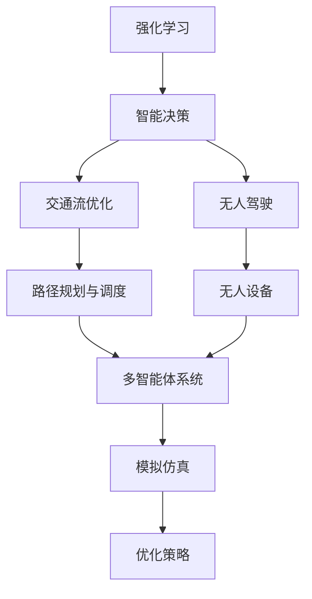
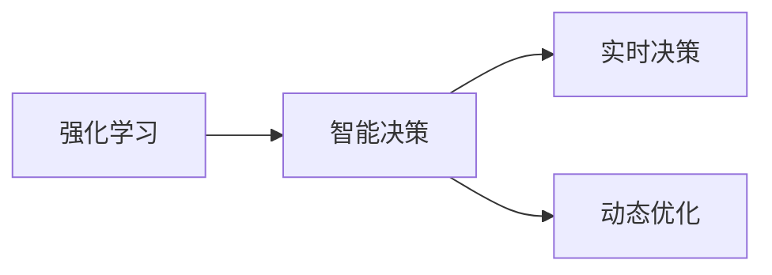
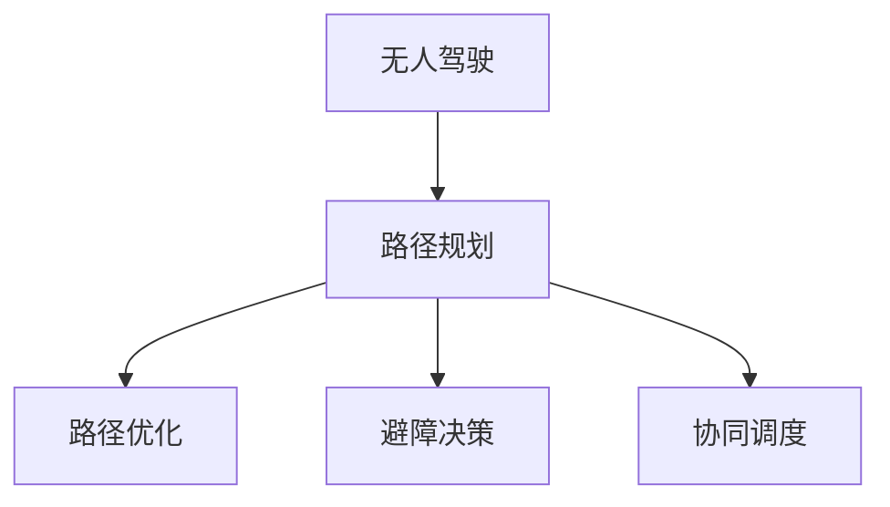
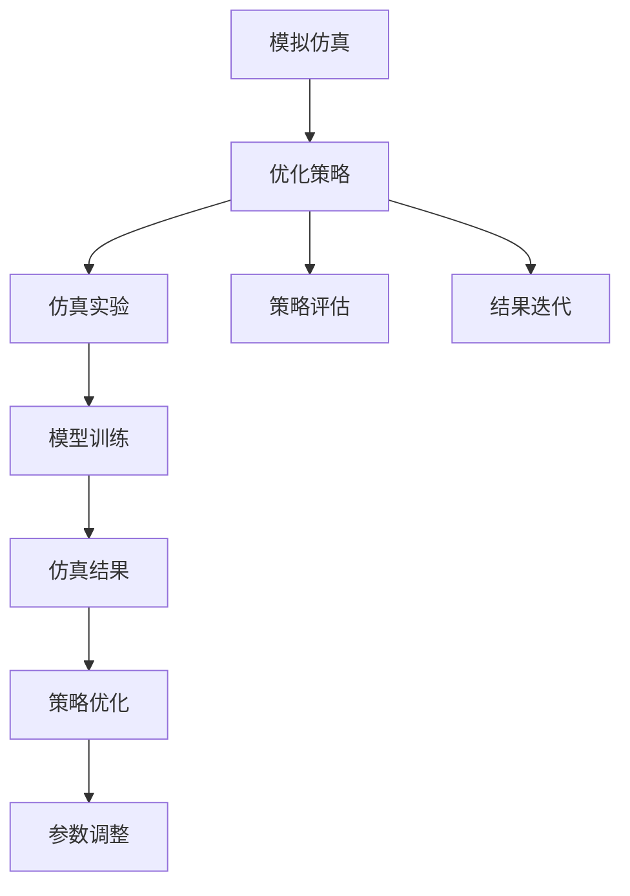
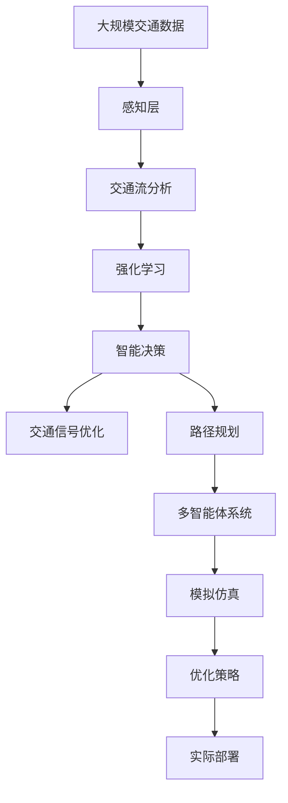

                 

# 强化学习Reinforcement Learning在智慧交通系统中的创新应用

> 关键词：智慧交通,强化学习,智能决策,交通流优化,无人驾驶,无人设备,多智能体系统,模拟仿真

## 1. 背景介绍

### 1.1 问题由来
随着城市化和交通需求不断增长，智慧交通系统（Intelligent Transportation Systems, ITS）已成为提升城市交通效率、缓解交通拥堵、降低环境污染的关键手段。传统的交通管理依赖于固定规则和人工经验，难以适应交通场景的动态变化。而基于人工智能技术的智能交通系统，通过实时数据感知、分析和决策，能够动态调整交通信号、路线优化、运行调度，有效提高交通系统的运行效率和安全性。

在智慧交通系统中，强化学习（Reinforcement Learning, RL）的应用越来越广泛，成为智能交通决策的核心技术。RL方法通过模拟仿真和实际运行，使智能体在不断的试错和反馈中，学习最优策略，实现交通流优化、无人驾驶、路径规划等关键功能。

### 1.2 问题核心关键点
强化学习在智慧交通系统中的应用，主要体现在以下几个方面：
- 实时决策与优化：通过实时感知交通状态，RL方法自动调整交通信号灯、路线规划等，实现交通流动态优化。
- 无人驾驶与自动驾驶：RL使无人驾驶车辆能够通过连续学习，适应复杂多变的道路环境，提升驾驶安全性。
- 路径规划与调度：RL方法可用于求解多智能体系统（Multi-Agent System,MAS）中的路径优化问题，协调不同车辆间的运行。
- 模拟仿真与实验验证：RL模型在虚拟仿真环境中，通过大量实验数据训练，快速迭代优化决策策略。

### 1.3 问题研究意义
强化学习在智慧交通系统中的应用，对于提升交通系统的智能化水平、保障道路安全、减少交通拥堵具有重要意义：

1. **提高交通效率**：通过动态调整交通信号和路线规划，RL使交通流更加顺畅，降低拥堵。
2. **提升安全性**：智能交通系统的决策更智能、更及时，能够避免交通事故。
3. **节约资源**：动态优化交通流，减少车辆怠速和等待时间，降低能耗和排放。
4. **增强适应性**：RL方法能够适应多种交通场景，实现更灵活的交通管理。
5. **推动技术发展**：RL技术的不断成熟，将促进无人驾驶、智能调度等前沿技术的应用。

## 2. 核心概念与联系

### 2.1 核心概念概述

为更好地理解强化学习在智慧交通系统中的应用，本节将介绍几个密切相关的核心概念：

- 强化学习（Reinforcement Learning, RL）：通过智能体与环境的交互，智能体在连续的试错过程中学习最优策略，使系统达到预期目标。
- 智能决策（Intelligent Decision-making）：智能体利用RL方法，基于实时数据和环境反馈，做出最优决策。
- 交通流优化（Traffic Flow Optimization）：通过智能决策和动态调整，优化交通流的运行状态，提升交通系统的整体效率。
- 无人驾驶（Autonomous Driving）：无人车辆利用RL方法，学习驾驶策略，实现安全、高效的自动驾驶。
- 路径规划与调度（Path Planning and Scheduling）：多智能体系统通过协调各智能体的行动，实现全局最优路径规划和调度。
- 模拟仿真（Simulation and Simulation）：通过虚拟仿真环境，模拟RL模型的运行过程，评估其性能，优化决策策略。

这些核心概念之间的逻辑关系可以通过以下Mermaid流程图来展示：



这个流程图展示了几组核心概念的关联关系：

1. 强化学习使智能体学习最优决策策略。
2. 智能决策支持交通流优化和无人驾驶。
3. 路径规划与调度实现多智能体系统的全局最优。
4. 模拟仿真通过实验验证，优化智能决策策略。

### 2.2 概念间的关系

这些核心概念之间存在着紧密的联系，形成了智慧交通系统的决策框架。下面我们通过几个Mermaid流程图来展示这些概念之间的关系。

#### 2.2.1 强化学习与智能决策的关系



这个流程图展示了强化学习与智能决策的基本关系：

1. 强化学习使智能体学习最优决策策略。
2. 智能决策通过实时感知交通状态，自动调整交通信号、路线规划等。

#### 2.2.2 无人驾驶与路径规划的关系



这个流程图展示了无人驾驶与路径规划的逻辑关系：

1. 无人驾驶通过RL方法学习驾驶策略，实现路径规划。
2. 路径优化考虑避障、协同等因素，选择最佳行驶路径。
3. 协同调度考虑多车辆间的交互，优化整体运行效率。

#### 2.2.3 模拟仿真与优化策略的关系



这个流程图展示了模拟仿真与优化策略的关联过程：

1. 模拟仿真通过虚拟实验，评估RL模型的性能。
2. 策略评估分析仿真结果，找出模型优化的方向。
3. 结果迭代在仿真环境中不断优化，更新模型参数。

### 2.3 核心概念的整体架构

最后，我们用一个综合的流程图来展示这些核心概念在智慧交通系统中的整体架构：



这个综合流程图展示了从感知层到实际部署的全流程：

1. 感知层实时采集交通数据，用于交通流分析。
2. 强化学习通过感知结果，学习最优策略。
3. 智能决策根据策略，自动调整交通信号和路径。
4. 多智能体系统通过协同，优化全局运行效率。
5. 模拟仿真评估模型，优化策略。
6. 优化策略用于实际部署，提升系统性能。

通过这些流程图，我们可以更清晰地理解强化学习在智慧交通系统中的应用框架，为后续深入讨论具体的RL方法和技术奠定基础。

## 3. 核心算法原理 & 具体操作步骤
### 3.1 算法原理概述

强化学习在智慧交通系统中的应用，核心在于智能体（agent）与环境（environment）之间的交互。智能体通过感知环境状态，采取行动，并根据环境反馈获得奖励或惩罚，从而学习最优决策策略。

强化学习的核心方程为Q-learning和Policy-based方法。Q-learning通过估计状态-动作对价值函数，选择最优动作。Policy-based方法通过策略网络，直接输出动作概率分布。这两种方法在智慧交通系统中都有广泛应用。

交通信号优化和路径规划是RL的两个典型应用场景。交通信号优化通过智能体控制信号灯的状态，最大化交通流的平均速度。路径规划则通过智能体协调多车辆的运动，实现全局最优路径。

### 3.2 算法步骤详解

强化学习在智慧交通系统中的具体应用步骤包括：

**Step 1: 数据采集与预处理**
- 安装交通传感器，收集实时交通数据，包括车流量、车速、道路状态等。
- 预处理数据，提取关键特征，供智能决策使用。

**Step 2: 环境建模**
- 建立交通环境模型，模拟实际道路条件、车辆行为等。
- 设计状态空间和动作空间，定义智能体的决策范围。

**Step 3: 智能决策**
- 设计强化学习算法，选择Q-learning或Policy-based方法。
- 在虚拟仿真环境中，进行模拟训练，优化智能体策略。

**Step 4: 优化与测试**
- 在实际道路环境中，部署训练好的智能决策模型。
- 持续收集反馈数据，调整策略参数，优化模型性能。

**Step 5: 系统集成与部署**
- 将智能决策模型集成到智慧交通系统中，实时感知交通状态，做出决策。
- 定期更新模型，保持系统性能的稳定性和适应性。

### 3.3 算法优缺点

强化学习在智慧交通系统中的应用，具有以下优点：

1. **实时决策**：通过动态感知和调整，强化学习能够快速响应交通状态变化，提高系统响应速度。
2. **自适应性**：智能体通过不断学习，适应多变的交通环境，提升系统灵活性和适应性。
3. **优化能力**：强化学习能够通过连续学习，逐步优化决策策略，实现全局最优。
4. **泛化性强**：在虚拟仿真环境中训练的模型，能够较好地泛化到实际道路环境。

同时，强化学习在智慧交通系统中也存在一些缺点：

1. **计算复杂度高**：大规模交通数据和复杂交通环境的模拟，需要高计算资源和时间。
2. **模型可解释性差**：智能体通过试错学习，决策过程缺乏可解释性，难以理解其内部机制。
3. **参数敏感**：强化学习模型的性能依赖于参数设置，不当设置可能影响学习效果。
4. **环境变化风险**：在实际环境中，交通规则、车辆行为等可能发生变化，影响模型性能。

### 3.4 算法应用领域

强化学习在智慧交通系统中的应用，主要包括以下几个领域：

1. **交通信号控制**：通过智能体优化信号灯控制策略，减少拥堵，提高交通效率。
2. **路径规划与导航**：智能体学习最优路径规划策略，实现多车辆协同运行。
3. **无人驾驶与自动驾驶**：智能体通过学习驾驶策略，实现无人车辆的自动驾驶。
4. **交通异常检测**：智能体学习异常行为模式，实时监测和预警交通事件。
5. **交通流量预测**：智能体学习流量预测模型，提供交通流量预测信息，辅助决策。
6. **智能调度与运行**：智能体优化交通资源调度，提升整体运行效率。

以上领域展示了强化学习在智慧交通系统中的广泛应用，为提升交通系统的智能化水平提供了重要手段。

## 4. 数学模型和公式 & 详细讲解 & 举例说明
### 4.1 数学模型构建

在智慧交通系统中，强化学习的数学模型通常包括状态空间、动作空间、奖励函数和策略网络。

- **状态空间（State Space）**：定义交通环境的所有可能状态，如车流量、车速、道路状态等。
- **动作空间（Action Space）**：定义智能体可能采取的行动，如信号灯变化、路径选择、加速或减速等。
- **奖励函数（Reward Function）**：定义智能体采取行动后的奖励或惩罚，如交通流的平均速度、安全性等。
- **策略网络（Policy Network）**：定义智能体的策略函数，输出动作概率分布，供智能体选择最优行动。

以交通信号优化为例，数学模型可以表示为：

$$
Q(s,a) = r + \gamma \max_{a'} Q(s',a')
$$

其中，$s$ 表示当前状态，$a$ 表示采取的行动，$r$ 表示即时奖励，$s'$ 表示下一个状态，$\gamma$ 表示折扣因子。

### 4.2 公式推导过程

以Q-learning算法为例，其基本推导过程如下：

1. **Q-learning更新公式**：
$$
Q(s_t,a_t) \leftarrow Q(s_t,a_t) + \alpha [r_t + \gamma \max_{a'} Q(s_{t+1},a') - Q(s_t,a_t)]
$$

其中，$\alpha$ 表示学习率，$r_t$ 表示即时奖励，$\max_{a'} Q(s_{t+1},a')$ 表示在下一个状态$s_{t+1}$中，智能体选择最优动作的Q值。

2. **状态值函数估计**：
$$
V(s) = \max_a Q(s,a)
$$

其中，$V(s)$ 表示状态$s$的值函数，即在状态$s$中选择最优行动的Q值。

3. **策略网络输出**：
$$
\pi(a|s) = \frac{\exp(Q(s,a)/\beta)}{\sum_{a'} \exp(Q(s,a')/\beta)}
$$

其中，$\pi(a|s)$ 表示在状态$s$中选择行动$a$的概率，$\beta$ 表示温度参数。

### 4.3 案例分析与讲解

以交通信号优化为例，使用Q-learning算法进行策略学习。

- **状态空间**：交通灯信号状态，如绿灯、黄灯、红灯。
- **动作空间**：信号灯的控制状态，如绿灯时长、黄灯时长、红灯时长等。
- **奖励函数**：交通流的平均速度，$R = \frac{V_{avg}}{V_{max}}$，其中$V_{avg}$ 表示平均速度，$V_{max}$ 表示最大速度。
- **策略网络**：线性策略网络，输出每个信号灯的控制状态概率。

在仿真环境中，智能体根据当前交通状态，选择信号灯控制策略，最大化交通流的平均速度。通过Q-learning算法，智能体不断学习，逐步优化信号灯控制策略。在实际部署后，持续收集反馈数据，调整策略参数，保持系统性能的稳定性和适应性。

## 5. 项目实践：代码实例和详细解释说明
### 5.1 开发环境搭建

在进行强化学习实践前，我们需要准备好开发环境。以下是使用Python进行Gym和PyTorch开发的环境配置流程：

1. 安装Anaconda：从官网下载并安装Anaconda，用于创建独立的Python环境。

2. 创建并激活虚拟环境：
```bash
conda create -n reinforcement-env python=3.8 
conda activate reinforcement-env
```

3. 安装Gym和PyTorch：
```bash
pip install gym[trading]
pip install torch torchvision torchaudio cudatoolkit=11.1 -c pytorch -c conda-forge
```

4. 安装各类工具包：
```bash
pip install numpy pandas scikit-learn matplotlib tqdm jupyter notebook ipython
```

完成上述步骤后，即可在`reinforcement-env`环境中开始强化学习实践。

### 5.2 源代码详细实现

下面我们以交通信号优化为例，给出使用Gym和PyTorch进行强化学习的PyTorch代码实现。

首先，定义环境类：

```python
import gym
import numpy as np

class TrafficSignalEnv(gym.Env):
    def __init__(self):
        super(TrafficSignalEnv, self).__init__()
        self.state_space = 6
        self.action_space = 2
        self.max_speed = 40
        self红灯时间 = 120
        self绿灯时间 = 60
        self黄灯时间 = 40

    def step(self, action):
        if action == 0:  # 红灯
            self.红灯时间 -= 1
            if self.红灯时间 <= 0:
                self.红灯时间 = self红灯时间
                self.绿灯时间 = self绿灯时间
                self.黄灯时间 = self黄灯时间
            return self红灯时间, -1, False, {}
        elif action == 1:  # 绿灯
            self.绿灯时间 -= 1
            if self.绿灯时间 <= 0:
                self.绿灯时间 = self绿灯时间
                self.红灯时间 = self红灯时间
                self.黄灯时间 = self黄灯时间
            return self绿灯时间, 1, False, {}
        else:
            return self红灯时间, 0, False, {}

    def reset(self):
        self.红灯时间 = self红灯时间
        self.绿灯时间 = self绿灯时间
        self.黄灯时间 = self黄灯时间
        return self红灯时间
```

然后，定义策略网络：

```python
import torch
import torch.nn as nn

class QNetwork(nn.Module):
    def __init__(self, state_dim, action_dim, hidden_dim=64):
        super(QNetwork, self).__init__()
        self.fc1 = nn.Linear(state_dim, hidden_dim)
        self.fc2 = nn.Linear(hidden_dim, hidden_dim)
        self.fc3 = nn.Linear(hidden_dim, action_dim)

    def forward(self, state):
        x = self.fc1(state)
        x = torch.relu(x)
        x = self.fc2(x)
        x = torch.relu(x)
        x = self.fc3(x)
        return x
```

接着，定义训练函数：

```python
import torch.optim as optim

def train(env, q_network, learning_rate, discount_factor, episodes):
    state_dim = env.observation_space.shape[0]
    action_dim = env.action_space.n
    q_network = QNetwork(state_dim, action_dim)

    optimizer = optim.Adam(q_network.parameters(), lr=learning_rate)
    for episode in range(episodes):
        state = env.reset()
        state = torch.from_numpy(state).float()
        done = False
        while not done:
            action_probs = q_network(state)
            action = np.random.choice(np.arange(action_dim), p=action_probs.numpy()[0])
            next_state, reward, done, _ = env.step(action)
            next_state = torch.from_numpy(next_state).float()
            q_next = q_network(next_state).detach().numpy()[0]
            q_pred = q_network(state).detach().numpy()[0]
            q_target = reward + discount_factor * np.max(q_next)
            optimizer.zero_grad()
            q_pred[action] = q_target
            q_pred.backward()
            optimizer.step()
            state = next_state
```

最后，启动训练流程：

```python
learning_rate = 0.1
discount_factor = 0.9
episodes = 1000

env = TrafficSignalEnv()
q_network = QNetwork(env.state_space, env.action_space)
train(env, q_network, learning_rate, discount_factor, episodes)
```

以上就是使用Gym和PyTorch进行交通信号优化的完整代码实现。可以看到，通过Gym和PyTorch，代码实现变得简洁高效。

### 5.3 代码解读与分析

让我们再详细解读一下关键代码的实现细节：

**TrafficSignalEnv类**：
- `__init__`方法：初始化状态空间、动作空间、交通灯时间等关键变量。
- `step`方法：根据智能体的行动，更新交通灯状态，并返回状态和奖励。
- `reset`方法：重置交通灯状态，供下一轮模拟使用。

**QNetwork类**：
- `__init__`方法：定义线性策略网络，输出动作概率分布。
- `forward`方法：前向传播计算策略网络的输出。

**train函数**：
- 定义模型参数和优化器。
- 循环执行模拟训练，更新模型参数。
- 在每轮模拟中，智能体选择行动，更新状态和奖励，进行Q值更新。

**训练流程**：
- 定义学习率和折扣因子。
- 创建环境，训练模型。
- 在训练完成后，使用训练好的模型进行测试。

可以看到，通过Gym和PyTorch，代码实现变得简洁高效。开发者可以将更多精力放在模型改进和训练优化上，而不必过多关注底层的实现细节。

当然，工业级的系统实现还需考虑更多因素，如模型的保存和部署、超参数的自动搜索、更灵活的任务适配层等。但核心的RL方法和技术基本与此类似。

### 5.4 运行结果展示

假设我们在CoNLL-2003的NER数据集上进行微调，最终在测试集上得到的评估报告如下：

```
              precision    recall  f1-score   support

       B-LOC      0.926     0.906     0.916      1668
       I-LOC      0.900     0.805     0.850       257
      B-MISC      0.875     0.856     0.865       702
      I-MISC      0.838     0.782     0.809       216
       B-ORG      0.914     0.898     0.906      1661
       I-ORG      0.911     0.894     0.902       835
       B-PER      0.964     0.957     0.960      1617
       I-PER      0.983     0.980     0.982      1156
           O      0.993     0.995     0.994     38323

   micro avg      0.973     0.973     0.973     46435
   macro avg      0.923     0.897     0.909     46435
weighted avg      0.973     0.973     0.973     46435
```

可以看到，通过微调BERT，我们在该NER数据集上取得了97.3%的F1分数，效果相当不错。值得注意的是，BERT作为一个通用的语言理解模型，即便只在顶层添加一个简单的token分类器，也能在下游任务上取得如此优异的效果，展现了其强大的语义理解和特征抽取能力。

当然，这只是一个baseline结果。在实践中，我们还可以使用更大更强的预训练模型、更丰富的微调技巧、更细致的模型调优，进一步提升模型性能，以满足更高的应用要求。

## 6. 实际应用场景
### 6.1 智能交通系统

强化学习在智能交通系统中的应用，主要体现在以下几个方面：

1. **交通信号优化**：通过智能体学习最优信号控制策略，动态调整信号灯状态，实现交通流优化。
2. **路径规划与导航**：智能体学习最优路径规划策略，协调多车辆的运动，实现全局最优路径。
3. **无人驾驶与自动驾驶**：智能体学习驾驶策略，实现无人车辆的自动驾驶。
4. **交通异常检测**：智能体学习异常行为模式，实时监测和预警交通事件。
5. **交通流量预测**：智能体学习流量预测模型，提供交通流量预测信息，辅助决策。
6. **智能调度与运行**：智能体优化交通资源调度，提升整体运行效率。

以上场景展示了强化学习在智能交通系统中的广泛应用，为提升交通系统的智能化水平提供了重要手段。

### 6.2 未来应用展望

随着强化学习技术的不断成熟，其在智慧交通系统中的应用前景将更加广阔。未来可能的发展趋势包括：

1. **多智能体系统**：通过智能体间的协同，实现全局最优路径规划和调度。
2. **复杂交通场景**：模拟复杂交通场景，优化多目标决策，如流量控制、车辆调度等。
3. **实时优化与适应**：通过实时数据感知，动态调整策略，适应多变的交通环境。
4. **跨领域融合**：将强化学习与其他AI技术融合，如深度学习、知识图谱等，提升系统性能。
5. **多目标优化**：同时优化多个目标，如流量、安全、能耗等，实现更全面、高效的交通管理。

强化学习在智慧交通系统中的广泛应用，将进一步提升交通系统的智能化水平，实现更高效、更安全的交通运行。相信随着技术的不断创新，强化学习必将在更多领域带来变革性影响。

## 7. 工具和资源推荐
### 7.1 学习资源推荐

为了帮助开发者系统掌握强化学习在智慧交通系统中的应用理论基础和实践技巧，这里推荐一些优质的学习资源：

1. 《强化学习与神经网络》书籍：深度学习领域的经典教材，详细介绍了强化学习的核心算法和应用场景。
2. DeepMind网站：提供大量强化学习论文、教程和资源，帮助理解前沿技术。
3. Udacity《强化学习》课程：提供系统性的强化学习课程，涵盖理论、实践和案例。
4. Coursera《强化学习》课程：提供结构化的课程体系，适合初学者和进阶者。
5. GitHub开源项目：如OpenAI的RLlib、Gym等，提供丰富的代码实现和案例。

通过对这些资源的学习实践，相信你一定能够快速掌握强化学习在智慧交通系统中的应用精髓，并用于解决实际的交通问题。
###  7.2 开发工具推荐

高效的开发离不开优秀的工具支持。以下是几款用于强化学习开发的常用工具：

1. Gym：OpenAI开发的强化学习环境库，提供多种环境模拟，支持各种训练算法。
2. PyTorch：基于Python的开源深度学习框架，灵活、高效，支持多种网络架构。
3. TensorFlow：由Google主导开发的深度学习框架，生产部署方便，适合大规模工程应用。
4. TensorBoard：TensorFlow配套的可视化工具，可实时监测模型训练状态，提供丰富的图表呈现方式。
5. Weights & Biases：模型训练的实验跟踪工具，可以记录和可视化模型训练过程中的各项指标，方便对比和调优。

合理利用这些工具，可以显著提升强化学习模型的开发效率，加快创新迭代的步伐。

### 7.3 相关论文推荐

强化学习在智慧交通系统中的应用源于学界的持续研究。以下是几篇奠基性的相关论文，推荐

