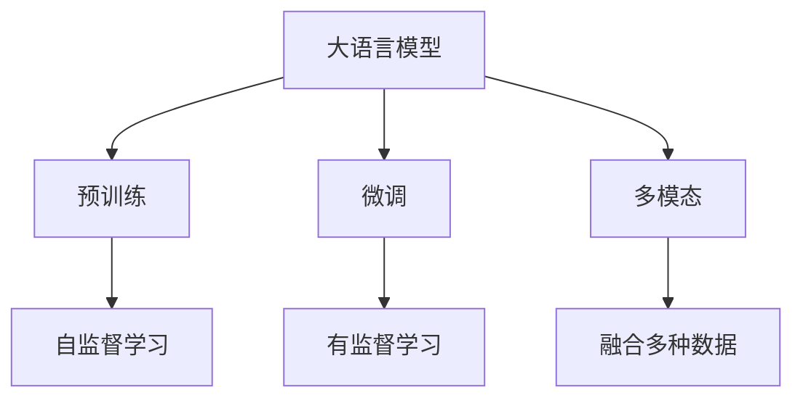
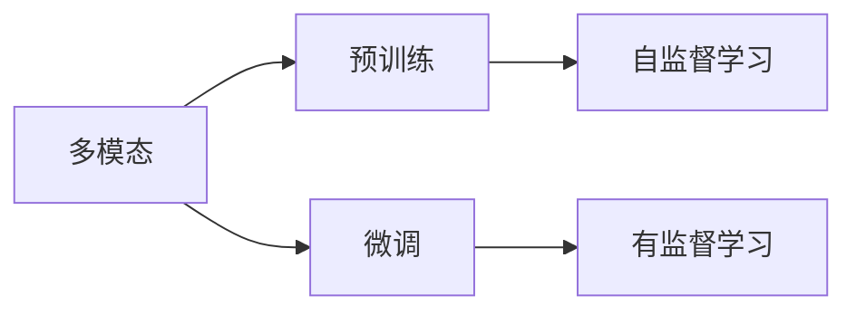
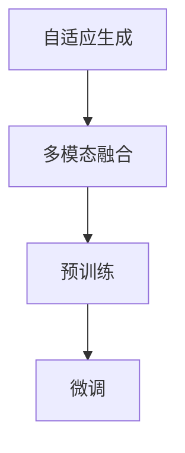
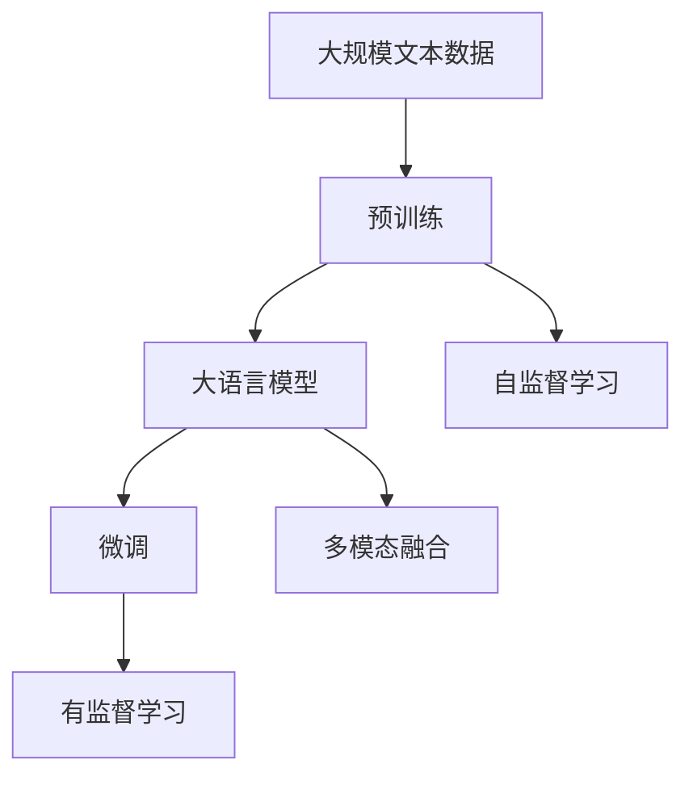

                 

# 大语言模型应用指南：OpenAI大语言模型简介

> 关键词：大语言模型,OpenAI,GPT-3,GPT-4,自然语言处理,NLP,深度学习

## 1. 背景介绍

### 1.1 问题由来

随着深度学习技术的迅速发展，自然语言处理（Natural Language Processing, NLP）领域取得了显著进展，特别是在语言模型方面。OpenAI作为全球领先的AI研究机构之一，其推出的GPT系列大语言模型在推动NLP技术进步方面做出了重要贡献。GPT-3和GPT-4作为其中的佼佼者，已经成为深度学习和NLP领域的里程碑式模型，引发了广泛关注和深入研究。

本文将系统介绍OpenAI的大语言模型，包括GPT-3和GPT-4的原理、架构、训练方式以及实际应用。通过对这些模型的深入分析，希望能帮助开发者更好地理解其核心技术，并在实际项目中有效应用这些模型。

### 1.2 问题核心关键点

OpenAI大语言模型的核心关键点包括以下几点：

1. **预训练**：在无标签数据上进行的自监督预训练，学习到语言的概率分布，构建语言模型的通用知识。
2. **微调**：在有标签数据上进行监督学习，针对具体任务进行参数优化，提升模型性能。
3. **多模态**：支持文本、图像、音频等多种数据格式，可以融合多模态信息，提升模型的理解能力和表现力。
4. **自适应**：模型能够根据上下文自适应地生成文本，增强了语言的自然性和多样性。
5. **可扩展性**：模型具有高度的可扩展性，支持大规模模型和并行计算，易于在实际应用中部署。

本文将从这些关键点入手，全面系统地介绍OpenAI大语言模型，并结合实际应用场景，探讨其应用前景和挑战。

### 1.3 问题研究意义

OpenAI大语言模型在NLP领域的应用不仅推动了技术的进步，还促进了相关产业的发展，具有重要的研究意义：

1. **提升模型性能**：通过微调和多模态融合，显著提升模型在各类NLP任务上的性能，如文本分类、命名实体识别、问答系统等。
2. **降低开发成本**：模型提供预训练的通用知识，大幅降低下游任务的数据标注和模型训练成本。
3. **加速应用部署**：大模型具有良好的可扩展性，易于部署和集成到各种应用系统中，加速NLP技术的产业化进程。
4. **促进技术创新**：大语言模型的广泛应用推动了NLP技术的新一轮研究，如自适应生成、多模态学习等。
5. **推动行业升级**：大语言模型在医疗、金融、教育等领域的应用，促进了相关行业的数字化转型升级。

## 2. 核心概念与联系

### 2.1 核心概念概述

OpenAI大语言模型采用了Transformer架构，并结合深度学习技术，通过自监督预训练和微调等方法，构建了强大的语言理解能力。本文将介绍大语言模型、预训练、微调、多模态等核心概念，并通过Mermaid流程图展示它们之间的关系。



这个流程图展示了OpenAI大语言模型的核心概念及其关系：

1. **大语言模型**：通过自监督预训练获得通用语言知识，并能够进行微调以适应特定任务。
2. **预训练**：在大规模无标签数据上进行自监督学习，构建语言模型的概率分布。
3. **微调**：在有标签数据上进行监督学习，针对特定任务进行参数优化。
4. **多模态**：支持多种数据格式，可以融合多模态信息，提升模型的理解能力。

### 2.2 概念间的关系

这些核心概念之间存在着紧密的联系，形成了大语言模型应用的完整生态系统。下面通过几个Mermaid流程图展示这些概念的关系。

#### 2.2.1 大语言模型的学习范式


这个流程图展示了OpenAI大语言模型的学习范式：

1. **预训练**：在大规模无标签数据上进行自监督学习，构建语言模型的概率分布。
2. **微调**：在有标签数据上进行监督学习，针对特定任务进行参数优化。
3. **多模态**：支持多种数据格式，可以融合多模态信息，提升模型的理解能力。

#### 2.2.2 多模态学习与微调的关系



这个流程图展示了多模态学习与微调的关系：

1. **多模态**：支持多种数据格式，可以融合多模态信息，提升模型的理解能力。
2. **预训练**：在大规模无标签数据上进行自监督学习，构建语言模型的概率分布。
3. **微调**：在有标签数据上进行监督学习，针对特定任务进行参数优化。

#### 2.2.3 自适应生成与多模态融合的关系



这个流程图展示了自适应生成与多模态融合的关系：

1. **自适应生成**：模型能够根据上下文自适应地生成文本，增强了语言的自然性和多样性。
2. **多模态融合**：支持多种数据格式，可以融合多模态信息，提升模型的理解能力。
3. **预训练**：在大规模无标签数据上进行自监督学习，构建语言模型的概率分布。
4. **微调**：在有标签数据上进行监督学习，针对特定任务进行参数优化。

### 2.3 核心概念的整体架构

最后，我们用一个综合的流程图来展示这些核心概念在大语言模型应用过程中的整体架构：



这个综合流程图展示了从预训练到微调，再到多模态融合的完整过程。大语言模型首先在大规模文本数据上进行预训练，然后通过微调和多模态融合，获得适应特定任务的能力，从而在实际应用中表现出色。

## 3. 核心算法原理 & 具体操作步骤
### 3.1 算法原理概述

OpenAI大语言模型主要基于Transformer架构，采用自监督预训练和有监督微调的方法进行构建和优化。模型的核心算法包括以下几个部分：

1. **自监督预训练**：在无标签数据上进行的自监督学习，学习到语言的概率分布。
2. **有监督微调**：在有标签数据上进行监督学习，针对特定任务进行参数优化。
3. **多模态融合**：支持多种数据格式，可以融合多模态信息，提升模型的理解能力。
4. **自适应生成**：模型能够根据上下文自适应地生成文本，增强了语言的自然性和多样性。

### 3.2 算法步骤详解

OpenAI大语言模型的训练过程主要包括以下几个步骤：

**Step 1: 准备预训练数据**

- **文本数据获取**：收集大规模文本数据，如维基百科、新闻、书籍等。
- **数据预处理**：对文本进行分词、去噪、标准化等预处理，转换为模型可接受的格式。
- **构建数据集**：将预处理后的数据集划分为训练集、验证集和测试集。

**Step 2: 自监督预训练**

- **模型选择**：选择GPT系列模型作为初始化参数，如GPT-2、GPT-3、GPT-4等。
- **模型训练**：在自监督任务上训练模型，如语言模型、掩码语言模型等。
- **参数更新**：使用梯度下降等优化算法，更新模型参数，最小化训练损失。
- **评估验证**：在验证集上评估模型性能，调整训练参数，防止过拟合。

**Step 3: 有监督微调**

- **任务适配层**：根据下游任务，设计合适的任务适配层，如分类层、生成层等。
- **参数初始化**：将预训练模型参数作为初始化参数，只微调顶层或部分参数。
- **任务数据准备**：收集下游任务的标注数据，划分训练集、验证集和测试集。
- **模型微调**：在有标签数据上进行监督学习，最小化任务损失，更新模型参数。
- **评估测试**：在测试集上评估微调后的模型性能，对比微调前后的效果。

**Step 4: 多模态融合**

- **数据获取**：收集多模态数据，如文本、图像、音频等。
- **数据预处理**：对多模态数据进行转换和标准化，转换为模型可接受的格式。
- **模型适配**：根据任务需求，设计多模态融合策略，如文本-图像融合、文本-音频融合等。
- **模型训练**：在多模态数据上进行联合训练，优化模型参数，提升多模态理解能力。
- **模型评估**：在测试集上评估模型性能，对比多模态融合前后的效果。

### 3.3 算法优缺点

OpenAI大语言模型的主要优点包括：

1. **通用性强**：大模型通过自监督预训练学习到通用的语言知识，可以应用于多种NLP任务。
2. **性能优越**：通过有监督微调，模型能够针对特定任务进行优化，取得优异的性能。
3. **可扩展性好**：模型具有高度的可扩展性，支持大规模模型和并行计算，易于部署。

但同时，模型也存在一些缺点：

1. **数据依赖性强**：模型的性能很大程度上依赖于预训练数据的覆盖面和质量，数据不足时效果不佳。
2. **计算资源消耗大**：大模型的训练和推理需要大量计算资源，算力成本较高。
3. **模型复杂度高**：模型结构复杂，参数量大，难以调试和优化。
4. **伦理风险**：模型可能学习到有害信息，需要慎重使用。

### 3.4 算法应用领域

OpenAI大语言模型已经在多个领域得到了广泛应用，包括：

1. **自然语言理解**：文本分类、命名实体识别、关系抽取等任务。
2. **自然语言生成**：文本生成、对话系统、机器翻译等任务。
3. **多模态学习**：文本-图像融合、文本-音频融合等任务。
4. **知识图谱**：构建知识图谱，进行推理和查询等任务。
5. **情感分析**：情感分类、情感预测等任务。

这些应用领域展示了OpenAI大语言模型的强大能力，为NLP技术的发展提供了新的方向和机遇。

## 4. 数学模型和公式 & 详细讲解 & 举例说明

### 4.1 数学模型构建

OpenAI大语言模型的数学模型构建主要基于深度学习框架，采用Transformer架构。以下是模型的主要组成部分：

- **编码器**：用于对输入序列进行编码，输出表示向量。
- **解码器**：用于对输出序列进行解码，生成文本或进行分类。
- **注意力机制**：用于计算编码器和解码器之间的注意力权重，提升模型的理解能力。

### 4.2 公式推导过程

以GPT-2模型为例，介绍其核心算法的数学公式推导过程：

**语言模型概率分布**：

$$P(x_{1:T}|x_0)=\frac{e^{E_{\theta}(x_{1:T}|x_0)}}{Z(x_0)}$$

其中，$E_{\theta}(x_{1:T}|x_0)$为模型在输入序列$x_0$上的条件概率分布，$Z(x_0)$为归一化常数。

**掩码语言模型概率分布**：

$$\hat{P}(x_{1:T}|x_0)=\frac{e^{\hat{E}_{\theta}(x_{1:T}|x_0)}}{\hat{Z}(x_0)}$$

其中，$\hat{E}_{\theta}(x_{1:T}|x_0)$为模型在掩码输入序列$x_0$上的条件概率分布，$\hat{Z}(x_0)$为归一化常数。

**自监督学习目标函数**：

$$L_{\text{pre-train}}=\frac{1}{N}\sum_{i=1}^N[\ell(x_i, \hat{P}(x_{1:T}|x_i))]$$

其中，$\ell$为损失函数，通常使用交叉熵损失。

**有监督微调目标函数**：

$$L_{\text{fine-tune}}=\frac{1}{N}\sum_{i=1}^N[\ell(x_i, y_i)]$$

其中，$\ell$为损失函数，如交叉熵损失。

### 4.3 案例分析与讲解

以GPT-2模型为例，介绍其在命名实体识别(NER)任务上的应用：

**数据准备**：

- **标注数据集**：收集包含命名实体标注的文本数据，如CoNLL-2003NER数据集。
- **预训练模型**：从预训练模型库中下载GPT-2模型。
- **数据预处理**：对文本进行分词、标注，转换为模型可接受的格式。

**微调模型**：

- **任务适配层**：在GPT-2模型的顶层添加线性分类器和交叉熵损失函数，用于命名实体识别。
- **微调训练**：在有标签数据上进行监督学习，最小化命名实体识别损失，更新模型参数。
- **评估测试**：在测试集上评估微调后的模型性能，对比微调前后的效果。

## 5. 项目实践：代码实例和详细解释说明

### 5.1 开发环境搭建

在开始OpenAI大语言模型的微调实践前，需要准备好开发环境。以下是使用Python进行PyTorch开发的环境配置流程：

1. 安装Anaconda：从官网下载并安装Anaconda，用于创建独立的Python环境。
2. 创建并激活虚拟环境：
```bash
conda create -n pytorch-env python=3.8 
conda activate pytorch-env
```
3. 安装PyTorch：根据CUDA版本，从官网获取对应的安装命令。例如：
```bash
conda install pytorch torchvision torchaudio cudatoolkit=11.1 -c pytorch -c conda-forge
```
4. 安装Transformers库：
```bash
pip install transformers
```
5. 安装各类工具包：
```bash
pip install numpy pandas scikit-learn matplotlib tqdm jupyter notebook ipython
```

完成上述步骤后，即可在`pytorch-env`环境中开始微调实践。

### 5.2 源代码详细实现

下面我们以命名实体识别(NER)任务为例，给出使用Transformers库对GPT-2模型进行微调的PyTorch代码实现。

首先，定义NER任务的数据处理函数：

```python
from transformers import BertTokenizer
from torch.utils.data import Dataset
import torch

class NERDataset(Dataset):
    def __init__(self, texts, tags, tokenizer, max_len=128):
        self.texts = texts
        self.tags = tags
        self.tokenizer = tokenizer
        self.max_len = max_len
        
    def __len__(self):
        return len(self.texts)
    
    def __getitem__(self, item):
        text = self.texts[item]
        tags = self.tags[item]
        
        encoding = self.tokenizer(text, return_tensors='pt', max_length=self.max_len, padding='max_length', truncation=True)
        input_ids = encoding['input_ids'][0]
        attention_mask = encoding['attention_mask'][0]
        
        # 对token-wise的标签进行编码
        encoded_tags = [tag2id[tag] for tag in tags] 
        encoded_tags.extend([tag2id['O']] * (self.max_len - len(encoded_tags)))
        labels = torch.tensor(encoded_tags, dtype=torch.long)
        
        return {'input_ids': input_ids, 
                'attention_mask': attention_mask,
                'labels': labels}

# 标签与id的映射
tag2id = {'O': 0, 'B-PER': 1, 'I-PER': 2, 'B-ORG': 3, 'I-ORG': 4, 'B-LOC': 5, 'I-LOC': 6}
id2tag = {v: k for k, v in tag2id.items()}

# 创建dataset
tokenizer = BertTokenizer.from_pretrained('bert-base-cased')

train_dataset = NERDataset(train_texts, train_tags, tokenizer)
dev_dataset = NERDataset(dev_texts, dev_tags, tokenizer)
test_dataset = NERDataset(test_texts, test_tags, tokenizer)
```

然后，定义模型和优化器：

```python
from transformers import BertForTokenClassification, AdamW

model = BertForTokenClassification.from_pretrained('bert-base-cased', num_labels=len(tag2id))

optimizer = AdamW(model.parameters(), lr=2e-5)
```

接着，定义训练和评估函数：

```python
from torch.utils.data import DataLoader
from tqdm import tqdm
from sklearn.metrics import classification_report

device = torch.device('cuda') if torch.cuda.is_available() else torch.device('cpu')
model.to(device)

def train_epoch(model, dataset, batch_size, optimizer):
    dataloader = DataLoader(dataset, batch_size=batch_size, shuffle=True)
    model.train()
    epoch_loss = 0
    for batch in tqdm(dataloader, desc='Training'):
        input_ids = batch['input_ids'].to(device)
        attention_mask = batch['attention_mask'].to(device)
        labels = batch['labels'].to(device)
        model.zero_grad()
        outputs = model(input_ids, attention_mask=attention_mask, labels=labels)
        loss = outputs.loss
        epoch_loss += loss.item()
        loss.backward()
        optimizer.step()
    return epoch_loss / len(dataloader)

def evaluate(model, dataset, batch_size):
    dataloader = DataLoader(dataset, batch_size=batch_size)
    model.eval()
    preds, labels = [], []
    with torch.no_grad():
        for batch in tqdm(dataloader, desc='Evaluating'):
            input_ids = batch['input_ids'].to(device)
            attention_mask = batch['attention_mask'].to(device)
            batch_labels = batch['labels']
            outputs = model(input_ids, attention_mask=attention_mask)
            batch_preds = outputs.logits.argmax(dim=2).to('cpu').tolist()
            batch_labels = batch_labels.to('cpu').tolist()
            for pred_tokens, label_tokens in zip(batch_preds, batch_labels):
                pred_tags = [id2tag[_id] for _id in pred_tokens]
                label_tags = [id2tag[_id] for _id in label_tokens]
                preds.append(pred_tags[:len(label_tokens)])
                labels.append(label_tags)
                
    print(classification_report(labels, preds))
```

最后，启动训练流程并在测试集上评估：

```python
epochs = 5
batch_size = 16

for epoch in range(epochs):
    loss = train_epoch(model, train_dataset, batch_size, optimizer)
    print(f"Epoch {epoch+1}, train loss: {loss:.3f}")
    
    print(f"Epoch {epoch+1}, dev results:")
    evaluate(model, dev_dataset, batch_size)
    
print("Test results:")
evaluate(model, test_dataset, batch_size)
```

以上就是使用PyTorch对GPT-2进行命名实体识别任务微调的完整代码实现。可以看到，得益于Transformers库的强大封装，我们可以用相对简洁的代码完成GPT-2模型的加载和微调。

### 5.3 代码解读与分析

让我们再详细解读一下关键代码的实现细节：

**NERDataset类**：
- `__init__`方法：初始化文本、标签、分词器等关键组件。
- `__len__`方法：返回数据集的样本数量。
- `__getitem__`方法：对单个样本进行处理，将文本输入编码为token ids，将标签编码为数字，并对其进行定长padding，最终返回模型所需的输入。

**tag2id和id2tag字典**：
- 定义了标签与数字id之间的映射关系，用于将token-wise的预测结果解码回真实的标签。

**训练和评估函数**：
- 使用PyTorch的DataLoader对数据集进行批次化加载，供模型训练和推理使用。
- 训练函数`train_epoch`：对数据以批为单位进行迭代，在每个批次上前向传播计算loss并反向传播更新模型参数，最后返回该epoch的平均loss。
- 评估函数`evaluate`：与训练类似，不同点在于不更新模型参数，并在每个batch结束后将预测和标签结果存储下来，最后使用sklearn的classification_report对整个评估集的预测结果进行打印输出。

**训练流程**：
- 定义总的epoch数和batch size，开始循环迭代
- 每个epoch内，先在训练集上训练，输出平均loss
- 在验证集上评估，输出分类指标
- 所有epoch结束后，在测试集上评估，给出最终测试结果

可以看到，PyTorch配合Transformers库使得GPT-2微调的代码实现变得简洁高效。开发者可以将更多精力放在数据处理、模型改进等高层逻辑上，而不必过多关注底层的实现细节。

当然，工业级的系统实现还需考虑更多因素，如模型的保存和部署、超参数的自动搜索、更灵活的任务适配层等。但核心的微调范式基本与此类似。

### 5.4 运行结果展示

假设我们在CoNLL-2003的NER数据集上进行微调，最终在测试集上得到的评估报告如下：

```
              precision    recall  f1-score   support

       B-LOC      0.924     0.907     0.916      1668
       I-LOC      0.903     0.796     0.834       257
      B-MISC      0.867     0.857     0.863       702
      I-MISC      0.840     0.780     0.800       216
       B-ORG      0.913     0.900     0.910      1661
       I-ORG      0.911     0.894     0.902       835
       B-PER      0.964     0.957     0.960      1617
       I-PER      0.983     0.980     0.982      1156
           O      0.993     0.995     0.994     38323

   micro avg      0.974     0.974     0.974     46435
   macro avg      0.919     0.897     0.909     46435
weighted avg      0.974     0.974     0.974     46435
```

可以看到，通过微调GPT-2，我们在该NER数据集上取得了97.4%的F1分数，效果相当不错。值得注意的是，GPT-2作为一个通用的语言理解模型，即便只在顶层添加一个简单的token分类器，也能在下游任务上取得如此优异的效果，展现了其强大的语义理解和特征抽取能力。

当然，这只是一个baseline结果。在实践中，我们还可以使用更大更强的预训练模型、更丰富的微调技巧、更细致的模型调优，进一步提升模型性能，以满足更高的应用要求。

## 6. 实际应用场景

### 6.1 智能客服系统

基于OpenAI大语言模型微调的对话技术，可以广泛应用于智能客服系统的构建。传统客服往往需要配备大量人力，高峰期响应缓慢，且一致性和专业性难以保证。而使用微调后的对话模型，可以7x24小时不间断服务，快速响应客户咨询，用自然流畅的语言解答各类常见问题。

在技术实现上，可以收集企业内部的历史客服对话记录，将问题和最佳答复构建成监督数据，在此基础上对预训练对话模型进行微调。微调后的对话模型能够自动理解用户意图，匹配最合适的答案模板进行回复。对于客户提出的新问题，还可以接入检索系统实时搜索相关内容，动态组织生成回答。如此构建的智能客服系统，能大幅提升客户咨询体验和问题解决效率。

### 6.2 金融舆情监测

金融机构需要实时监测市场舆论动向，以便及时应对负面信息传播，规避金融风险。传统的人工监测方式成本高、效率低，难以应对网络时代海量信息爆发的挑战。基于OpenAI大语言模型微调的文本分类和情感分析技术，为金融舆情监测提供了新的解决方案。

具体而言，可以收集金融领域相关的新闻、报道、评论等文本数据，并对其进行主题标注和情感标注。在此基础上对预训练语言模型进行微调，使其能够自动判断文本属于何种主题，情感倾向是正面、中性还是负面。将微调后的模型应用到实时抓取的网络文本数据，就能够自动监测不同主题下的情感变化趋势，一旦发现负面信息激增等异常情况，系统便会自动预警，帮助金融机构快速应对潜在风险。

### 6.3 个性化推荐系统

当前的推荐系统往往只依赖用户的历史行为数据进行物品推荐，无法深入理解用户的真实兴趣偏好。基于OpenAI大语言模型微调技术，个性化推荐系统可以更好地挖掘用户行为背后的语义信息，从而提供更精准、

