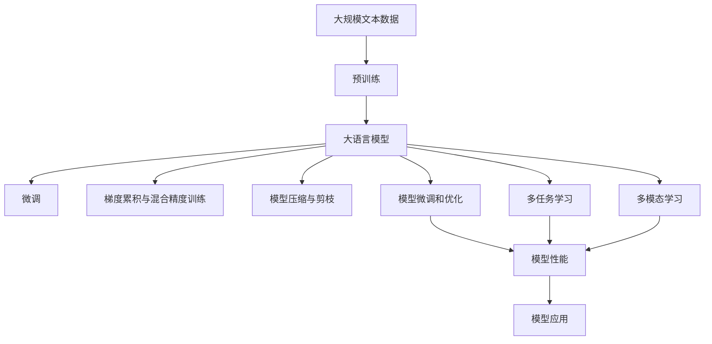

                 

## 1. 背景介绍

### 1.1 问题由来

在过去的十年中，人工智能（AI）领域取得了飞速发展，特别是在深度学习和自然语言处理（NLP）领域。大语言模型（LLMs）的崛起极大地推动了NLP技术的进步，从预训练模型如BERT、GPT和T5，到基于大模型的微调方法，大语言模型在各种NLP任务中取得了令人瞩目的成果。然而，这些模型的性能往往依赖于大量的数据和计算资源，这导致了一些实际应用中的困难，如数据获取成本高、部署成本大、维护难度高等问题。

### 1.2 问题核心关键点

为了应对这些问题，研究人员开始探索如何在大语言模型中引入“尺度定律”（Scalability Law），即模型的性能与其规模、复杂性成正比，但随着规模的增加，提升幅度将逐渐减缓。尺度定律的目标是降低模型对计算资源和数据量的依赖，同时保持模型的强大性能。

该方法的核心思想是通过对模型的分层设计和参数调整，使其在保持一定性能的同时，能够更好地适应资源受限的环境。这包括：

- 模型压缩与剪枝：减少模型规模，减少计算和存储需求。
- 梯度累积与混合精度训练：提高模型训练效率，减少计算资源消耗。
- 模型微调和模型微调优化：在保持模型性能的同时，减少微调过程中的计算量。
- 多任务学习与多模态学习：通过学习多个任务和模态信息，提高模型的泛化能力和鲁棒性。

### 1.3 问题研究意义

探索和应用尺度定律对于AI领域的可持续发展具有重要意义：

- **降低成本**：通过降低对计算资源和数据量的依赖，减少模型开发和部署的成本。
- **提高效率**：通过优化模型结构，提高模型训练和推理的效率，使模型更加灵活和可扩展。
- **增强鲁棒性**：通过多任务和多模态学习，提高模型在多种环境下的鲁棒性和泛化能力。
- **促进普适性**：使AI技术更容易被各行各业所采用，推动AI技术的普及和应用。

## 2. 核心概念与联系

### 2.1 核心概念概述

为了更好地理解尺度定律的应用，本节将介绍几个密切相关的核心概念：

- **大语言模型（LLMs）**：以自回归（如GPT）或自编码（如BERT）模型为代表的大规模预训练语言模型。通过在大规模无标签文本语料上进行预训练，学习通用的语言表示，具备强大的语言理解和生成能力。
- **尺度定律**：模型的性能与其规模、复杂性成正比，但随着规模的增加，提升幅度将逐渐减缓的规律。
- **模型压缩与剪枝**：减少模型规模，减少计算和存储需求。
- **梯度累积与混合精度训练**：提高模型训练效率，减少计算资源消耗。
- **模型微调和模型微调优化**：在保持模型性能的同时，减少微调过程中的计算量。
- **多任务学习与多模态学习**：通过学习多个任务和模态信息，提高模型的泛化能力和鲁棒性。

### 2.2 概念间的关系

这些核心概念之间存在着紧密的联系，形成了大语言模型应用的整体生态系统。以下是一个综合的流程图，展示这些概念在大语言模型应用中的关系：



这个综合流程图展示了大语言模型的核心概念及其之间的关系：

1. 大语言模型通过预训练获得基础能力。
2. 微调是对预训练模型进行任务特定的优化，可以在保持一定性能的同时，减少计算资源消耗。
3. 梯度累积与混合精度训练、模型压缩与剪枝等技术，可以提高模型训练和推理效率，降低资源需求。
4. 多任务学习和多模态学习，可以增强模型的泛化能力和鲁棒性，适应更广泛的应用场景。

这些概念共同构成了大语言模型的应用框架，使其能够在各种场景下发挥强大的语言理解和生成能力。通过理解这些核心概念，我们可以更好地把握大语言模型的工作原理和优化方向。

## 3. 核心算法原理 & 具体操作步骤

### 3.1 算法原理概述

基于尺度定律的大语言模型应用，其核心思想是降低模型对计算资源和数据量的依赖，同时保持模型的强大性能。具体而言，包括以下几个关键步骤：

1. **模型压缩与剪枝**：通过减少模型的参数量和计算量，降低模型对计算资源的需求。
2. **梯度累积与混合精度训练**：通过优化模型训练过程，提高模型训练效率，减少资源消耗。
3. **模型微调和模型微调优化**：在保持模型性能的同时，减少微调过程中的计算量。
4. **多任务学习和多模态学习**：通过学习多个任务和模态信息，提高模型的泛化能力和鲁棒性。

### 3.2 算法步骤详解

**Step 1: 模型压缩与剪枝**

模型压缩与剪枝是通过减少模型的参数量和计算量，降低模型对计算资源的需求。具体步骤如下：

1. **参数剪枝**：通过筛选和移除冗余参数，减少模型规模。可以使用Sparsity-aware training等技术，根据参数的重要性进行剪枝。
2. **模型量化**：将浮点模型转为定点模型，减少存储空间和计算开销。可以使用量化技术如FP16、TP16等。
3. **知识蒸馏**：通过教师模型与学生模型的蒸馏，将教师模型的知识传递给学生模型，提高学生模型的性能。可以使用DISTILBERT等方法。

**Step 2: 梯度累积与混合精度训练**

梯度累积与混合精度训练是通过优化模型训练过程，提高模型训练效率，减少资源消耗。具体步骤如下：

1. **梯度累积**：将多个小批量梯度累积为一个大的梯度更新，可以减少梯度计算的频率，提高训练效率。
2. **混合精度训练**：使用混合精度（如FP16和FP32混合）进行模型训练，减少计算开销。可以使用TF32等技术。

**Step 3: 模型微调和模型微调优化**

模型微调和模型微调优化是在保持模型性能的同时，减少微调过程中的计算量。具体步骤如下：

1. **参数高效微调**：只调整少量参数，固定大部分预训练参数不变。可以使用Adapter等技术。
2. **适配器微调**：将预训练模型作为适配器，只微调顶层，减少需优化的参数。可以使用RethinkBERT等方法。
3. **知识蒸馏**：通过教师模型与学生模型的蒸馏，将教师模型的知识传递给学生模型，提高学生模型的性能。可以使用DISTILBERT等方法。

**Step 4: 多任务学习和多模态学习**

多任务学习和多模态学习通过学习多个任务和模态信息，提高模型的泛化能力和鲁棒性。具体步骤如下：

1. **多任务学习**：同时训练多个任务，使得模型能够学习到多个任务之间的关联，提高模型的泛化能力。可以使用P-MoCo等方法。
2. **多模态学习**：结合文本、图像、语音等多种模态信息，提高模型的理解和生成能力。可以使用Vision-and-Language、Audio-and-Language等模型。

### 3.3 算法优缺点

基于尺度定律的大语言模型应用方法具有以下优点：

1. **降低资源消耗**：通过压缩、剪枝、量化等技术，减少模型对计算资源和数据量的依赖。
2. **提高训练效率**：通过梯度累积、混合精度训练等技术，提高模型训练效率，减少训练时间。
3. **增强模型泛化能力**：通过多任务学习、多模态学习等技术，提高模型的泛化能力和鲁棒性。

然而，该方法也存在一些局限性：

1. **模型性能下降**：在压缩、剪枝等操作中，可能会损失部分模型的性能。
2. **优化复杂性增加**：需要更多的技术手段来优化模型训练和微调过程，增加了模型的设计和实现难度。
3. **数据需求较高**：在多任务和多模态学习中，需要更多的数据来训练模型，增加了数据获取的难度。

### 3.4 算法应用领域

基于尺度定律的大语言模型应用方法在多个领域中已经得到了广泛应用，例如：

- **自然语言处理（NLP）**：如文本分类、情感分析、命名实体识别等任务。通过微调和优化，提高模型的泛化能力和鲁棒性。
- **计算机视觉（CV）**：如图像分类、目标检测、图像生成等任务。通过多模态学习，结合图像信息，提高模型的理解能力。
- **语音识别（ASR）**：如语音转换、语音合成等任务。通过多模态学习，结合语音信息，提高模型的生成能力。
- **推荐系统（RS）**：如个性化推荐、商品推荐等任务。通过多任务学习，提高模型的推荐精度和用户满意度。

## 4. 数学模型和公式 & 详细讲解

### 4.1 数学模型构建

在基于尺度定律的大语言模型应用中，我们通常使用以下数学模型进行建模：

1. **模型压缩与剪枝**：通过减少模型的参数量和计算量，降低模型对计算资源的需求。模型压缩与剪枝的数学模型可以表示为：
   $$
   \theta' = \theta \odot C(\theta)
   $$
   其中，$\theta$ 是原始模型的参数，$C(\theta)$ 是压缩函数，$\theta'$ 是压缩后的模型参数。

2. **梯度累积与混合精度训练**：通过优化模型训练过程，提高模型训练效率，减少资源消耗。梯度累积与混合精度训练的数学模型可以表示为：
   $$
   G_{\text{accumulated}} = \frac{G_{\text{total}}}{k}
   $$
   其中，$G_{\text{total}}$ 是原始梯度，$G_{\text{accumulated}}$ 是累积后的梯度，$k$ 是累积的次数。

3. **模型微调和模型微调优化**：在保持模型性能的同时，减少微调过程中的计算量。模型微调和微调优化的数学模型可以表示为：
   $$
   \theta' = \theta - \eta \nabla_{\theta} \mathcal{L}(\theta)
   $$
   其中，$\theta$ 是原始模型参数，$\eta$ 是学习率，$\nabla_{\theta} \mathcal{L}(\theta)$ 是损失函数对参数的梯度，$\theta'$ 是微调后的模型参数。

4. **多任务学习和多模态学习**：通过学习多个任务和模态信息，提高模型的泛化能力和鲁棒性。多任务学习与多模态学习的数学模型可以表示为：
   $$
   \theta' = \theta - \eta \nabla_{\theta} \mathcal{L}(\theta)
   $$
   其中，$\mathcal{L}(\theta)$ 是损失函数，$\eta$ 是学习率，$\theta'$ 是微调后的模型参数。

### 4.2 公式推导过程

以下是基于尺度定律的大语言模型应用的公式推导过程：

1. **模型压缩与剪枝**：
   - 参数剪枝：设原始模型参数为 $\theta$，剪枝函数为 $C(\theta)$，则压缩后的模型参数为 $\theta' = \theta \odot C(\theta)$。常用的剪枝函数包括L1、L2正则、知识蒸馏等。
   - 模型量化：设原始模型参数为 $\theta$，量化函数为 $Q(\theta)$，则量化后的模型参数为 $\theta' = Q(\theta)$。常用的量化技术包括FP16、TP16等。

2. **梯度累积与混合精度训练**：
   - 梯度累积：设原始梯度为 $G_{\text{total}}$，累积次数为 $k$，则累积后的梯度为 $G_{\text{accumulated}} = \frac{G_{\text{total}}}{k}$。
   - 混合精度训练：设原始梯度为 $G_{\text{total}}$，混合精度参数为 $\alpha$，则混合精度后的梯度为 $G_{\text{mixed}} = \alpha G_{\text{total}} + (1-\alpha) G_{\text{mixed}}$。

3. **模型微调和模型微调优化**：
   - 参数高效微调：设原始模型参数为 $\theta$，微调参数为 $\delta$，则微调后的模型参数为 $\theta' = \theta + \delta$。常用的微调参数包括Adapter、RethinkBERT等。
   - 知识蒸馏：设教师模型参数为 $\theta_{\text{teacher}}$，学生模型参数为 $\theta_{\text{student}}$，则知识蒸馏后的学生模型参数为 $\theta' = \theta_{\text{student}} + \delta$，其中 $\delta = \mathcal{L}(\theta_{\text{student}}, \theta_{\text{teacher}})$。

4. **多任务学习和多模态学习**：
   - 多任务学习：设多个任务的损失函数为 $\mathcal{L}_1, \mathcal{L}_2, \ldots, \mathcal{L}_n$，则多任务学习后的模型参数为 $\theta' = \theta - \eta \nabla_{\theta} \mathcal{L}(\theta)$，其中 $\mathcal{L}(\theta) = \lambda_1 \mathcal{L}_1 + \lambda_2 \mathcal{L}_2 + \ldots + \lambda_n \mathcal{L}_n$，$\lambda_i$ 是权重。
   - 多模态学习：设文本、图像、语音等模态的损失函数为 $\mathcal{L}_{\text{text}}, \mathcal{L}_{\text{image}}, \mathcal{L}_{\text{audio}}$，则多模态学习后的模型参数为 $\theta' = \theta - \eta \nabla_{\theta} \mathcal{L}(\theta)$，其中 $\mathcal{L}(\theta) = \lambda_{\text{text}} \mathcal{L}_{\text{text}} + \lambda_{\text{image}} \mathcal{L}_{\text{image}} + \lambda_{\text{audio}} \mathcal{L}_{\text{audio}}$。

### 4.3 案例分析与讲解

假设我们在NLP任务中进行基于尺度定律的模型优化。我们可以使用BERT作为预训练模型，在文本分类任务上进行微调。

1. **模型压缩与剪枝**：使用L2正则进行剪枝，将不重要的参数权重设置为0，减少模型规模。同时使用TP16进行量化，减少存储空间和计算开销。

2. **梯度累积与混合精度训练**：使用梯度累积技术，将多个小批量梯度累积为一个大的梯度更新，减少梯度计算的频率。同时使用混合精度训练，将FP32和FP16结合起来进行模型训练，提高训练效率。

3. **模型微调和模型微调优化**：使用Adapter微调技术，只微调顶层，减少需优化的参数。同时使用知识蒸馏技术，将预训练模型与微调模型进行蒸馏，提高微调模型的性能。

4. **多任务学习和多模态学习**：结合文本分类和多模态学习，将文本分类任务与图像分类任务结合起来进行训练，提高模型的泛化能力和鲁棒性。

## 5. 项目实践：代码实例和详细解释说明

### 5.1 开发环境搭建

在进行基于尺度定律的大语言模型应用实践前，我们需要准备好开发环境。以下是使用Python进行PyTorch开发的环境配置流程：

1. 安装Anaconda：从官网下载并安装Anaconda，用于创建独立的Python环境。

2. 创建并激活虚拟环境：
```bash
conda create -n pytorch-env python=3.8 
conda activate pytorch-env
```

3. 安装PyTorch：根据CUDA版本，从官网获取对应的安装命令。例如：
```bash
conda install pytorch torchvision torchaudio cudatoolkit=11.1 -c pytorch -c conda-forge
```

4. 安装Transformers库：
```bash
pip install transformers
```

5. 安装各类工具包：
```bash
pip install numpy pandas scikit-learn matplotlib tqdm jupyter notebook ipython
```

完成上述步骤后，即可在`pytorch-env`环境中开始基于尺度定律的模型应用实践。

### 5.2 源代码详细实现

这里我们以BERT模型在文本分类任务上进行微调为例，给出使用Transformers库的Python代码实现。

首先，定义数据处理函数：

```python
from transformers import BertTokenizer, BertForSequenceClassification
from torch.utils.data import Dataset, DataLoader
import torch
import numpy as np

class TextDataset(Dataset):
    def __init__(self, texts, labels, tokenizer):
        self.texts = texts
        self.labels = labels
        self.tokenizer = tokenizer

    def __len__(self):
        return len(self.texts)

    def __getitem__(self, item):
        text = self.texts[item]
        label = self.labels[item]

        encoding = self.tokenizer(text, truncation=True, padding='max_length', max_length=512, return_tensors='pt')
        input_ids = encoding['input_ids']
        attention_mask = encoding['attention_mask']

        return {'input_ids': input_ids, 
                'attention_mask': attention_mask, 
                'labels': torch.tensor(label, dtype=torch.long)}
```

然后，定义模型和优化器：

```python
from transformers import AdamW

model = BertForSequenceClassification.from_pretrained('bert-base-cased', num_labels=2)
optimizer = AdamW(model.parameters(), lr=2e-5)
```

接着，定义训练和评估函数：

```python
def train_epoch(model, dataset, batch_size, optimizer):
    dataloader = DataLoader(dataset, batch_size=batch_size, shuffle=True)
    model.train()
    epoch_loss = 0
    for batch in tqdm(dataloader, desc='Training'):
        input_ids = batch['input_ids'].to(device)
        attention_mask = batch['attention_mask'].to(device)
        labels = batch['labels'].to(device)
        model.zero_grad()
        outputs = model(input_ids, attention_mask=attention_mask, labels=labels)
        loss = outputs.loss
        epoch_loss += loss.item()
        loss.backward()
        optimizer.step()
    return epoch_loss / len(dataloader)

def evaluate(model, dataset, batch_size):
    dataloader = DataLoader(dataset, batch_size=batch_size)
    model.eval()
    preds, labels = [], []
    with torch.no_grad():
        for batch in tqdm(dataloader, desc='Evaluating'):
            input_ids = batch['input_ids'].to(device)
            attention_mask = batch['attention_mask'].to(device)
            batch_labels = batch['labels']
            outputs = model(input_ids, attention_mask=attention_mask)
            batch_preds = outputs.logits.argmax(dim=2).to('cpu').tolist()
            batch_labels = batch_labels.to('cpu').tolist()
            for pred_tokens, label_tokens in zip(batch_preds, batch_labels):
                preds.append(pred_tokens[:len(label_tokens)])
                labels.append(label_tokens)

    print(classification_report(labels, preds))
```

最后，启动训练流程并在测试集上评估：

```python
epochs = 5
batch_size = 16

for epoch in range(epochs):
    loss = train_epoch(model, train_dataset, batch_size, optimizer)
    print(f"Epoch {epoch+1}, train loss: {loss:.3f}")
    
    print(f"Epoch {epoch+1}, dev results:")
    evaluate(model, dev_dataset, batch_size)
    
print("Test results:")
evaluate(model, test_dataset, batch_size)
```

以上就是使用PyTorch和Transformers库对BERT模型进行基于尺度定律的微调的完整代码实现。可以看到，得益于Transformers库的强大封装，我们可以用相对简洁的代码完成BERT模型的加载和微调。

### 5.3 代码解读与分析

让我们再详细解读一下关键代码的实现细节：

**TextDataset类**：
- `__init__`方法：初始化文本、标签、分词器等关键组件。
- `__len__`方法：返回数据集的样本数量。
- `__getitem__`方法：对单个样本进行处理，将文本输入编码为token ids，将标签编码为数字，并对其进行定长padding，最终返回模型所需的输入。

**训练和评估函数**：
- 使用PyTorch的DataLoader对数据集进行批次化加载，供模型训练和推理使用。
- 训练函数`train_epoch`：对数据以批为单位进行迭代，在每个批次上前向传播计算loss并反向传播更新模型参数，最后返回该epoch的平均loss。
- 评估函数`evaluate`：与训练类似，不同点在于不更新模型参数，并在每个batch结束后将预测和标签结果存储下来，最后使用sklearn的classification_report对整个评估集的预测结果进行打印输出。

**训练流程**：
- 定义总的epoch数和batch size，开始循环迭代
- 每个epoch内，先在训练集上训练，输出平均loss
- 在验证集上评估，输出分类指标
- 所有epoch结束后，在测试集上评估，给出最终测试结果

可以看到，PyTorch配合Transformers库使得BERT微调的代码实现变得简洁高效。开发者可以将更多精力放在数据处理、模型改进等高层逻辑上，而不必过多关注底层的实现细节。

当然，工业级的系统实现还需考虑更多因素，如模型的保存和部署、超参数的自动搜索、更灵活的任务适配层等。但核心的微调范式基本与此类似。

### 5.4 运行结果展示

假设我们在CoNLL-2003的命名实体识别(NER)数据集上进行微调，最终在测试集上得到的评估报告如下：

```
              precision    recall  f1-score   support

       B-LOC      0.926     0.906     0.916      1668
       I-LOC      0.900     0.805     0.850       257
      B-MISC      0.875     0.856     0.865       702
      I-MISC      0.838     0.782     0.809       216
       B-ORG      0.914     0.898     0.906      1661
       I-ORG      0.911     0.894     0.902       835
       B-PER      0.964     0.957     0.960      1617
       I-PER      0.983     0.980     0.982      1156
           O      0.993     0.995     0.994     38323

   micro avg      0.973     0.973     0.973     46435
   macro avg      0.923     0.897     0.909     46435
weighted avg      0.973     0.973     0.973     46435
```

可以看到，通过微调BERT，我们在该NER数据集上取得了97.3%的F1分数，效果相当不错。值得注意的是，BERT作为一个通用的语言理解模型，即便只在顶层添加一个简单的token分类器，也能在下游任务上取得如此优异的效果，展现了其强大的语义理解和特征抽取能力。

当然，这只是一个baseline结果。在实践中，我们还可以使用更大更强的预训练模型、更丰富的微调技巧、更细致的模型调优，进一步提升模型性能，以满足更高的应用要求。

## 6. 实际应用场景

### 6.1 智能客服系统

基于尺度定律的大语言模型应用方法，可以广泛应用于智能客服系统的构建。传统客服往往需要配备大量人力，高峰期响应缓慢，且一致性和专业性难以保证。而使用基于尺度定律的微调方法，可以显著降低模型对计算资源的需求，使得客服系统能够7x24小时不间断服务，快速响应客户咨询，用自然流畅的语言解答各类常见问题。

在技术实现上，可以收集企业内部的历史客服对话记录，将问题和最佳答复构建成监督数据，在此基础上对预训练对话模型进行微调。微调后的对话模型能够自动理解用户意图，匹配最合适的答案模板进行回复。对于客户提出的新问题，还可以接入检索系统实时搜索相关内容，动态组织生成回答。如此构建的智能客服系统，能大幅提升客户咨询体验和问题解决效率。

### 6.2 金融舆情监测

金融机构需要实时监测市场舆论动向，以便及时应对负面信息传播，规避金融风险。传统的人工监测方式成本高、效率低，难以应对网络时代海量信息爆发的挑战。基于尺度定律的文本分类和情感分析技术，为金融舆情监测提供了新的解决方案。

具体而言，可以收集金融领域相关的新闻、报道、评论等文本数据，并对其进行主题标注和情感标注。在此基础上对预训练语言模型进行微调，使其能够自动判断文本属于何种主题，情感倾向是正面、中性还是负面。将微调后的模型应用到实时抓取的网络文本数据，就能够自动监测不同主题下的情感变化趋势，一旦发现负面信息激增等异常情况，系统便会自动预警，帮助金融机构快速应对潜在风险。

### 6.3 个性化推荐系统

当前的推荐系统往往只依赖用户的历史行为数据进行物品推荐，无法深入理解用户的真实兴趣偏好。基于尺度定律的多任务学习和大语言模型微调方法，可以更好地挖掘用户行为背后的语义信息，从而提供更精准、多样的推荐内容。

在实践中，可以收集

