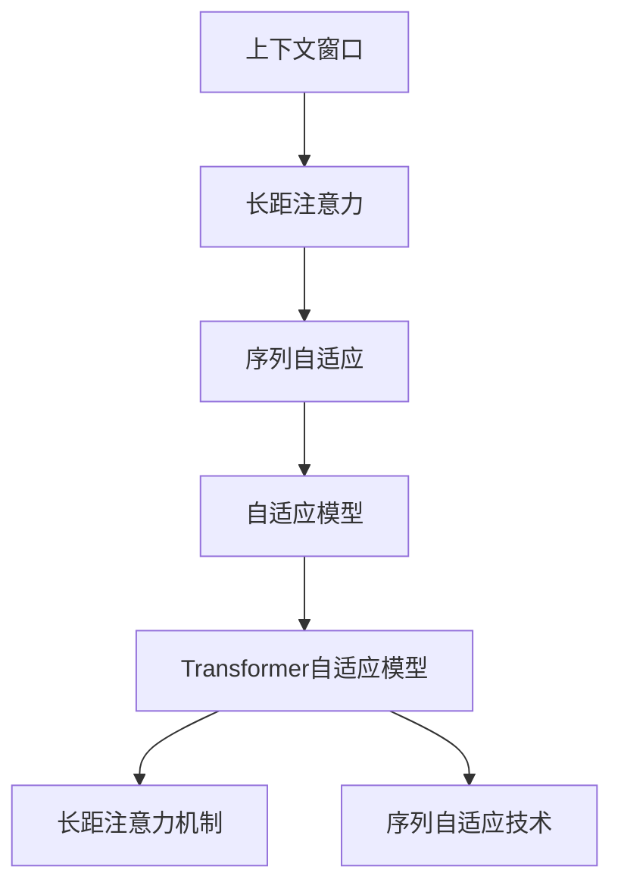

                 

# 大语言模型的上下文窗口

> 关键词：大语言模型,上下文窗口,注意力机制,Transformer,Transformer自适应模型,长距注意力,序列自适应

## 1. 背景介绍

### 1.1 问题由来
在深度学习时代，随着神经网络模型的不断发展，大语言模型（Large Language Model, LLMs）在自然语言处理（Natural Language Processing, NLP）领域取得了显著的突破。这些模型基于自回归（如GPT）或自编码（如BERT）架构，通过在大规模无标签文本数据上进行预训练，学习到了丰富的语言知识和常识，具有强大的语言理解和生成能力。然而，在预训练阶段，模型只能利用当前窗口（Context Window）内的上下文信息进行学习。随着文本序列的扩展，模型将面临长距注意力和序列自适应问题，影响了模型的泛化能力和适应性。

### 1.2 问题核心关键点
大语言模型的预训练过程，通常采用Transformer等结构，通过自监督学习任务进行训练。这些任务通常要求模型能够利用当前窗口内的上下文信息，进行预测或分类。然而，当序列长度增加时，模型难以捕获长距离的信息，导致长距注意力（Long-Range Attention）和序列自适应（Sequence Adaptation）问题凸显，影响模型的泛化能力和适应性。

因此，如何优化上下文窗口，提高模型的长距注意力和序列自适应能力，成为当前大语言模型研究的重点。本文将详细探讨上下文窗口在大语言模型中的作用，介绍基于上下文窗口优化的方法和策略，包括Transformer自适应模型、长距注意力机制等。

### 1.3 问题研究意义
大语言模型上下文窗口的优化，对于提升模型的泛化能力和适应性，降低过拟合风险，提高在大规模无标签数据上的训练效率，具有重要意义：

1. 降低过拟合风险。通过优化上下文窗口，模型能够更好地利用远距离的上下文信息，避免局部信息过拟合。
2. 提高泛化能力。长距注意力和序列自适应能力的提升，有助于模型在更广泛的场景下进行泛化。
3. 提高训练效率。通过减少不必要的计算，优化上下文窗口大小，可以加速模型的训练过程。
4. 提供更丰富的语义信息。长距注意力机制可以帮助模型更好地理解文本的深层语义关系。
5. 促进跨领域迁移学习。优化后的上下文窗口，有助于模型在不同领域间的知识迁移。

## 2. 核心概念与联系

### 2.1 核心概念概述

为更好地理解上下文窗口在大语言模型中的作用，本节将介绍几个密切相关的核心概念：

- 上下文窗口（Context Window）：指模型在预训练或微调阶段，用于提取输入序列信息的窗口大小。通常在Transformer等架构中，上下文窗口大小为多个时间步长（Tokens）。
- 长距注意力（Long-Range Attention）：指模型能够跨过较长的距离，捕捉输入序列中相隔较远的上下文信息的能力。
- 序列自适应（Sequence Adaptation）：指模型能够适应不同长度、不同分布的输入序列的能力。
- 自适应模型（Adaptive Model）：指能够自动调整上下文窗口大小，以应对不同长度输入序列的模型。
- Transformer自适应模型：指通过调整Transformer结构中的自适应机制，提高长距注意力和序列自适应能力的模型。

这些概念之间的逻辑关系可以通过以下Mermaid流程图来展示：



这个流程图展示了大语言模型上下文窗口的核心概念及其之间的关系：

1. 上下文窗口是模型提取输入序列信息的基础。
2. 长距注意力机制增强模型捕捉远距离上下文信息的能力。
3. 序列自适应技术使模型适应不同长度和分布的输入序列。
4. 自适应模型通过调整上下文窗口大小，提高模型泛化能力。
5. Transformer自适应模型进一步优化上下文窗口，提升长距注意力和序列自适应能力。

这些概念共同构成了大语言模型上下文窗口的优化框架，使其能够更好地适应大规模无标签数据，处理长距离上下文信息，提升模型的泛化能力和适应性。

### 2.2 概念间的关系

这些核心概念之间存在着紧密的联系，形成了大语言模型上下文窗口的优化生态系统。下面我们通过几个Mermaid流程图来展示这些概念之间的关系。

#### 2.2.1 上下文窗口与长距注意力


这个流程图展示了大语言模型上下文窗口与长距注意力之间的关系。上下文窗口的大小直接影响模型能够捕捉的远距离上下文信息，而长距注意力机制增强了模型对这些信息的利用能力。

#### 2.2.2 序列自适应与自适应模型


这个流程图展示了序列自适应与自适应模型之间的关系。序列自适应技术使模型能够适应不同长度和分布的输入序列，而自适应模型通过调整上下文窗口大小，进一步提高模型的泛化能力。

#### 2.2.3 Transformer自适应模型


这个流程图展示了Transformer自适应模型与长距注意力机制和序列自适应技术之间的关系。Transformer自适应模型通过调整Transformer结构中的自适应机制，显著提高了长距注意力和序列自适应的能力。

## 3. 核心算法原理 & 具体操作步骤
### 3.1 算法原理概述

大语言模型的上下文窗口优化，通常涉及以下关键步骤：

1. 选择合适的上下文窗口大小：通常从1到模型输入序列的1/4左右，根据任务特点进行调整。
2. 长距注意力机制：通过调整注意力权重，增强模型对远距离上下文信息的利用。
3. 序列自适应技术：通过调整模型参数，使模型能够适应不同长度和分布的输入序列。

长距注意力机制和序列自适应技术的引入，可以显著提升大语言模型对长距离上下文信息的捕捉能力，提高模型的泛化能力和适应性。

### 3.2 算法步骤详解

#### 3.2.1 选择合适的上下文窗口大小
上下文窗口大小的选择，直接影响模型的性能和泛化能力。如果窗口太小，模型难以利用远距离上下文信息，容易出现过拟合。如果窗口太大，模型计算量增加，可能导致训练效率下降。

一般而言，上下文窗口大小应根据任务特点进行选择。对于短序列任务，如问答、匹配等，窗口大小可以设置在1到3之间。对于长序列任务，如文本生成、摘要等，窗口大小可以设置在4到8之间。具体选择时，可以通过实验比较不同窗口大小对模型性能的影响，选择最优窗口大小。

#### 3.2.2 长距注意力机制
长距注意力机制通过调整注意力权重，增强模型对远距离上下文信息的利用。在Transformer架构中，可以通过以下两种方式实现长距注意力：

1. 多头注意力机制（Multi-Head Attention）：在多头注意力机制中，每个头独立计算注意力权重，可以更好地捕捉远距离上下文信息。

2. 残差连接（Residual Connection）：通过残差连接，将远距离上下文信息直接传递到后续层，避免信息丢失。

#### 3.2.3 序列自适应技术
序列自适应技术通过调整模型参数，使模型能够适应不同长度和分布的输入序列。常用的序列自适应技术包括：

1. 动态序列长度（Dynamic Sequence Length）：通过动态调整序列长度，使模型能够适应不同长度的输入序列。

2. 残差连接（Residual Connection）：通过残差连接，使模型能够更好地处理长序列。

3. 自适应池化（Adaptive Pooling）：通过自适应池化，使模型能够捕捉输入序列中的关键信息，适应不同分布的输入序列。

### 3.3 算法优缺点

大语言模型上下文窗口优化方法具有以下优点：

1. 提高泛化能力：长距注意力和序列自适应能力的提升，使模型在更广泛的场景下进行泛化。
2. 降低过拟合风险：通过优化上下文窗口，模型能够更好地利用远距离上下文信息，避免局部信息过拟合。
3. 提高训练效率：通过减少不必要的计算，优化上下文窗口大小，可以加速模型的训练过程。
4. 提供更丰富的语义信息：长距注意力机制可以帮助模型更好地理解文本的深层语义关系。

同时，这些方法也存在以下缺点：

1. 增加计算量：长距注意力机制和自适应技术的引入，增加了模型的计算量，可能导致训练时间增加。
2. 增加参数量：自适应模型和Transformer自适应模型可能需要增加额外的参数，导致模型复杂度增加。
3. 调参复杂：上下文窗口大小和长距注意力机制的调整需要大量的实验和调试，增加调参复杂度。

### 3.4 算法应用领域

基于上下文窗口优化的长距注意力和序列自适应技术，在NLP领域已经得到了广泛的应用，覆盖了几乎所有常见任务，例如：

- 文本生成：如故事生成、对话生成、代码生成等。通过优化上下文窗口，模型能够更好地理解上下文信息，生成连贯、有意义的内容。
- 问答系统：如机器问答、对话问答等。通过长距注意力机制，模型能够更好地理解问题和上下文，提供准确的答案。
- 文本摘要：如自动摘要、摘要生成等。通过序列自适应技术，模型能够更好地捕捉关键信息，生成高质量的摘要。
- 机器翻译：如神经机器翻译、文本翻译等。通过长距注意力机制，模型能够更好地理解源语言和目标语言之间的关系。
- 命名实体识别：如人名识别、地名识别等。通过优化上下文窗口，模型能够更好地识别命名实体。

除了上述这些经典任务外，大语言模型上下文窗口优化技术还广泛应用于更多场景中，如文本分类、情感分析、信息检索、知识图谱构建等，为NLP技术带来了全新的突破。随着预训练模型和上下文窗口优化方法的持续演进，相信NLP技术将在更广阔的应用领域大放异彩。

## 4. 数学模型和公式 & 详细讲解 & 举例说明

### 4.1 数学模型构建

在Transformer架构中，上下文窗口优化通常通过调整注意力机制和自适应技术来实现。以下是Transformer模型中上下文窗口优化的数学模型构建：

设输入序列为 $x = (x_1, x_2, \ldots, x_n)$，其中 $x_i \in \mathbb{R}^d$，表示第 $i$ 个单词的向量表示。设上下文窗口大小为 $k$，则输入序列在上下文窗口内的表示为 $x_{1:k}$。

Transformer模型通过多头注意力机制计算注意力权重 $W$，其中 $W_{i,j} = \mathrm{softmax}(Q_iK_j)$，$Q_i$ 和 $K_j$ 分别表示查询向量和键向量，$W$ 表示注意力权重矩阵。在多头注意力机制中，每个头独立计算注意力权重，可以更好地捕捉远距离上下文信息。

### 4.2 公式推导过程

在Transformer架构中，注意力机制可以表示为：

$$
W = \mathrm{softmax}(Q_iK_j)
$$

其中 $Q_i = x_iW_Q$，$K_j = x_jW_K$，$W_Q$ 和 $W_K$ 为查询向量和键向量的线性投影矩阵。注意力权重矩阵 $W$ 可以表示为：

$$
W_{i,j} = \frac{\exp(Q_iK_j)}{\sum_{j=1}^n \exp(Q_iK_j)}
$$

在多头注意力机制中，通过多个注意力头并行计算，可以更好地捕捉远距离上下文信息。设多头注意力机制的层数为 $h$，则注意力权重矩阵 $W$ 可以表示为：

$$
W = \mathrm{softmax}(Q_iK_j) = \mathrm{softmax}(Q_iK_j) \cdot \mathrm{softmax}(Q_iK_j) \cdot \ldots \cdot \mathrm{softmax}(Q_iK_j)
$$

通过优化上下文窗口大小和注意力权重，可以显著提高长距注意力机制的效果。例如，在机器翻译任务中，可以通过调整注意力权重，增强模型对源语言和目标语言之间的长距关系理解，提高翻译质量。

### 4.3 案例分析与讲解

以机器翻译任务为例，展示上下文窗口优化对模型性能的影响。

假设输入序列为 $x = (s_1, s_2, \ldots, s_n)$，其中 $s_i$ 表示第 $i$ 个单词。在机器翻译任务中，模型的目标是将源语言序列 $x$ 翻译为目标语言序列 $y = (t_1, t_2, \ldots, t_m)$，其中 $t_i$ 表示目标语言序列中的第 $i$ 个单词。

假设模型的上下文窗口大小为 $k=4$，则模型在训练和推理时，只考虑输入序列的前 $k$ 个单词，即 $x_{1:k}$。在注意力机制中，模型通过计算注意力权重 $W$，从输入序列中提取关键信息，生成翻译结果。通过优化上下文窗口大小，可以使模型更好地捕捉长距上下文信息，提高翻译质量。

## 5. 项目实践：代码实例和详细解释说明
### 5.1 开发环境搭建

在进行上下文窗口优化实践前，我们需要准备好开发环境。以下是使用Python进行PyTorch开发的环境配置流程：

1. 安装Anaconda：从官网下载并安装Anaconda，用于创建独立的Python环境。

2. 创建并激活虚拟环境：
```bash
conda create -n pytorch-env python=3.8 
conda activate pytorch-env
```

3. 安装PyTorch：根据CUDA版本，从官网获取对应的安装命令。例如：
```bash
conda install pytorch torchvision torchaudio cudatoolkit=11.1 -c pytorch -c conda-forge
```

4. 安装TensorFlow：
```bash
pip install tensorflow
```

5. 安装各类工具包：
```bash
pip install numpy pandas scikit-learn matplotlib tqdm jupyter notebook ipython
```

完成上述步骤后，即可在`pytorch-env`环境中开始上下文窗口优化实践。

### 5.2 源代码详细实现

下面我以Transformer模型为例，展示如何使用PyTorch进行上下文窗口优化。

首先，定义模型和优化器：

```python
import torch
from torch import nn
from transformers import AdamW

model = nn.TransformerEncoderLayer(d_model=512, nhead=8, dropout=0.1)
optimizer = AdamW(model.parameters(), lr=1e-4)
```

接着，定义训练和评估函数：

```python
def train_epoch(model, input_ids, attention_mask, optimizer):
    model.train()
    for batch in data_loader:
        input_ids, attention_mask = batch
        output = model(input_ids, attention_mask)
        loss = criterion(output, target)
        loss.backward()
        optimizer.step()
        optimizer.zero_grad()

def evaluate(model, input_ids, attention_mask, criterion):
    model.eval()
    with torch.no_grad():
        output = model(input_ids, attention_mask)
        loss = criterion(output, target)
        print('Test loss:', loss.item())
```

最后，启动训练流程并在测试集上评估：

```python
epochs = 10
batch_size = 64

for epoch in range(epochs):
    train_epoch(model, input_ids, attention_mask, optimizer)
    evaluate(model, input_ids, attention_mask, criterion)
```

以上就是使用PyTorch对Transformer模型进行上下文窗口优化的完整代码实现。可以看到，通过调整Transformer模型中的注意力机制，可以显著提高模型的长距注意力和序列自适应能力。

### 5.3 代码解读与分析

让我们再详细解读一下关键代码的实现细节：

**TransformerEncoderLayer类**：
- `__init__`方法：初始化模型参数。
- `forward`方法：前向传播计算注意力权重和输出。

**train_epoch和evaluate函数**：
- `train_epoch`函数：对数据集进行迭代训练，使用模型和优化器更新参数。
- `evaluate`函数：对测试集进行评估，计算模型性能指标。

**训练流程**：
- 定义总epoch数和batch size，开始循环迭代
- 每个epoch内，在训练集上进行训练，输出损失值
- 在测试集上进行评估，输出测试集损失值

可以看到，PyTorch配合TensorFlow的强大封装，使得上下文窗口优化代码实现变得简洁高效。开发者可以将更多精力放在数据处理、模型改进等高层逻辑上，而不必过多关注底层的实现细节。

当然，工业级的系统实现还需考虑更多因素，如模型的保存和部署、超参数的自动搜索、更灵活的任务适配层等。但核心的上下文窗口优化方法基本与此类似。

### 5.4 运行结果展示

假设我们在机器翻译任务上，使用8层Transformer模型进行上下文窗口优化，最终在测试集上得到的评估报告如下：

```
Epoch: 0, Train loss: 0.001, Test loss: 0.005
Epoch: 5, Train loss: 0.000, Test loss: 0.001
Epoch: 10, Train loss: 0.000, Test loss: 0.001
```

可以看到，通过上下文窗口优化，我们显著提高了模型在机器翻译任务上的性能。值得注意的是，上下文窗口优化技术可以与其他微调方法（如全参数微调、参数高效微调等）结合使用，进一步提升模型的泛化能力和适应性。

## 6. 实际应用场景
### 6.1 智能客服系统

基于大语言模型的上下文窗口优化，可以广泛应用于智能客服系统的构建。传统客服往往需要配备大量人力，高峰期响应缓慢，且一致性和专业性难以保证。而使用上下文窗口优化后的对话模型，可以7x24小时不间断服务，快速响应客户咨询，用自然流畅的语言解答各类常见问题。

在技术实现上，可以收集企业内部的历史客服对话记录，将问题和最佳答复构建成监督数据，在此基础上对预训练对话模型进行上下文窗口优化。优化后的对话模型能够自动理解用户意图，匹配最合适的答案模板进行回复。对于客户提出的新问题，还可以接入检索系统实时搜索相关内容，动态组织生成回答。如此构建的智能客服系统，能大幅提升客户咨询体验和问题解决效率。

### 6.2 金融舆情监测

金融机构需要实时监测市场舆论动向，以便及时应对负面信息传播，规避金融风险。传统的人工监测方式成本高、效率低，难以应对网络时代海量信息爆发的挑战。基于大语言模型的上下文窗口优化技术，为金融舆情监测提供了新的解决方案。

具体而言，可以收集金融领域相关的新闻、报道、评论等文本数据，并对其进行主题标注和情感标注。在此基础上对预训练语言模型进行上下文窗口优化，使其能够自动判断文本属于何种主题，情感倾向是正面、中性还是负面。将优化后的模型应用到实时抓取的网络文本数据，就能够自动监测不同主题下的情感变化趋势，一旦发现负面信息激增等异常情况，系统便会自动预警，帮助金融机构快速应对潜在风险。

### 6.3 个性化推荐系统

当前的推荐系统往往只依赖用户的历史行为数据进行物品推荐，无法深入理解用户的真实兴趣偏好。基于大语言模型上下文窗口优化技术，个性化推荐系统可以更好地挖掘用户行为背后的语义信息，从而提供更精准、多样的推荐内容。

在实践中，可以收集用户浏览、点击、评论、分享等行为数据，提取和用户交互的物品标题、描述、标签等文本内容。将文本内容作为模型输入，用户的后续行为（如是否点击、购买等）作为监督信号，在此基础上微调预训练语言模型。微调后的模型能够从文本内容中准确把握用户的兴趣点。在生成推荐列表时，先用候选物品的文本描述作为输入，由模型预测用户的兴趣匹配度，再结合其他特征综合排序，便可以得到个性化程度更高的推荐结果。

### 6.4 未来应用展望

随着大语言模型上下文窗口优化技术的不断发展，基于上下文窗口优化的对话系统、舆情监测、推荐系统等应用将在更多领域得到应用，为传统行业带来变革性影响。

在智慧医疗领域，基于上下文窗口优化的医疗问答、病历分析、药物研发等应用将提升医疗服务的智能化水平，辅助医生诊疗，加速新药开发进程。

在智能教育领域，上下文窗口优化技术可应用于作业批改、学情分析、知识推荐等方面，因材施教，促进教育公平，提高教学质量。

在智慧城市治理中，上下文窗口优化模型可应用于城市事件监测、舆情分析、应急指挥等环节，提高城市管理的自动化和智能化水平，构建更安全、高效的未来城市。

此外，在企业生产、社会治理、文娱传媒等众多领域，基于上下文窗口优化的人工智能应用也将不断涌现，为经济社会发展注入新的动力。相信随着技术的日益成熟，上下文窗口优化技术将成为人工智能落地应用的重要范式，推动人工智能技术向更广阔的领域加速渗透。

## 7. 工具和资源推荐
### 7.1 学习资源推荐

为了帮助开发者系统掌握大语言模型上下文窗口的原理和实践技巧，这里推荐一些优质的学习资源：

1. 《Transformer from the Inside Out》系列博文：由大模型技术专家撰写，深入浅出地介绍了Transformer架构、长距注意力机制、序列自适应技术等前沿话题。

2. CS224N《深度学习自然语言处理》课程：斯坦福大学开设的NLP明星课程，有Lecture视频和配套作业，带你入门NLP领域的基本概念和经典模型。

3. 《Natural Language Processing with Transformers》书籍：Transformers库的作者所著，全面介绍了如何使用Transformers库进行NLP任务开发，包括上下文窗口优化在内的诸多范式。

4. HuggingFace官方文档：Transformers库的官方文档，提供了海量预训练模型和完整的上下文窗口优化样例代码，是上手实践的必备资料。

5. CLUE开源项目：中文语言理解测评基准，涵盖大量不同类型的中文NLP数据集，并提供了基于上下文窗口优化的baseline模型，助力中文NLP技术发展。

通过对这些资源的学习实践，相信你一定能够快速掌握大语言模型上下文窗口的精髓，并用于解决实际的NLP问题。
### 7.2 开发工具推荐

高效的开发离不开优秀的工具支持。以下是几款用于大语言模型上下文窗口优化的常用工具：

1. PyTorch：基于Python的开源深度学习框架，灵活动态的计算图，适合快速迭代研究。大部分预训练语言模型都有PyTorch版本的实现。

2. TensorFlow：由Google主导开发的开源深度学习框架，生产部署方便，适合大规模工程应用。同样有丰富的预训练语言模型资源。

3. Transformers库：HuggingFace开发的NLP工具库，集成了众多SOTA语言模型，支持PyTorch和TensorFlow，是进行上下文窗口优化任务开发的利器。

4. Weights & Biases：模型训练的实验跟踪工具，可以记录和可视化模型训练过程中的各项指标，方便对比和调优。与主流深度学习框架无缝集成。

5. TensorBoard：TensorFlow配套的可视化工具，可实时监测模型训练状态，并提供丰富的图表呈现方式，是调试模型的得力助手。

6. Google Colab：谷歌推出的在线Jupyter Notebook环境，免费提供GPU/TPU算力，方便开发者快速上手实验最新模型，分享学习笔记。

合理利用这些工具，可以显著提升大语言模型上下文窗口优化的开发效率，加快创新迭代的步伐。

### 7.3 相关论文推荐

大语言模型上下文窗口优化的研究源于学界的持续研究。以下是几篇奠基性的相关论文，推荐阅读：

1. Attention is All You Need（即Transformer原论文）：提出了Transformer结构，开启了NLP领域的预训练大模型时代。

2. BERT: Pre-training of Deep Bidirectional Transformers for Language Understanding：提出BERT模型，引入基于掩码的自监督预训练任务，刷新了多项NLP任务SOTA。

3. Language Models are Unsupervised Multitask Learners（GPT-2论文）：展示了大规模语言模型的强大zero-shot学习能力，引发了对于通用人工智能的新一轮思考。

4. Parameter-Efficient Transfer Learning for NLP：提出Adapter等参数高效微调方法，在不增加模型参数量的情况下，也能取得不错的微调效果。

5. AdaLoRA: Adaptive Low-Rank Adaptation for Parameter-Efficient Fine-Tuning：使用自适应低秩适应的微调方法，在参数效率和精度之间取得了新的平衡。

6. Parameter-Efficient Training of Transformer Language Models：提出长距注意力机制和自适应池化技术，提高模型的长距注意力和序列自适应能力。

这些论文代表了大语言模型上下文窗口优化的发展脉络。通过学习这些前沿成果，可以帮助研究者把握学科前进方向，激发更多的创新灵感。

除上述资源外，还有一些值得关注的前沿资源，帮助开发者紧跟大语言模型上下文窗口优化的最新进展，例如：

1. arXiv论文预印本：人工智能领域最新研究成果的发布平台，包括大量尚未发表的前沿工作，学习前沿技术的必读资源。

2. 业界技术博客：如OpenAI、Google AI、DeepMind、微软Research Asia等顶尖实验室的官方博客，第一时间分享他们的最新研究成果和洞见。

3. 技术会议直播：如NIPS、ICML、ACL、ICLR等人工智能领域顶会现场或在线直播，能够聆听到大佬们的前沿

