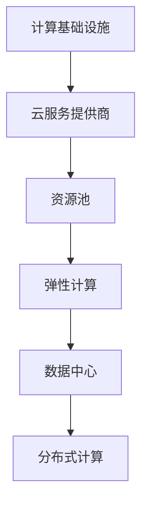
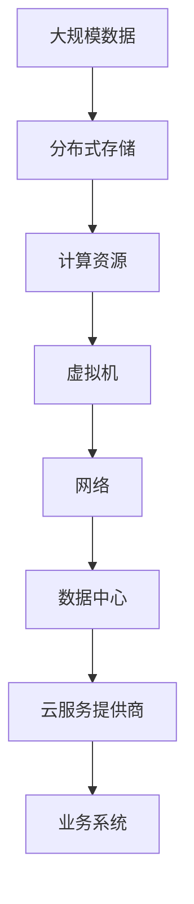

                 

## 1. 背景介绍

### 1.1 问题由来
随着企业对数据驱动决策的依赖日益增加，计算基础设施（Infrastructure as a Service, IaaS）的重要性不言而喻。无论是金融、医疗、教育，还是电商、游戏、物联网，各行各业都离不开高效、稳定、可靠的计算资源支持。然而，计算基础设施的成本问题一直是一个痛点。过高的成本不仅增加了企业的负担，还限制了其在业务扩张和技术创新上的投入。如何降低计算成本，同时保持性能和稳定性，成为了计算基础设施优化的一个重要课题。

### 1.2 问题核心关键点
优化计算基础设施的关键在于以下几个方面：
- 降低硬件成本：通过选择合适、高效、经济的硬件设备，减少资源投入。
- 提高能效：通过优化系统架构和算法，提升系统能效，减少能源消耗和运营成本。
- 扩展弹性：根据业务需求和流量变化，灵活调整资源配置，避免资源浪费和不足。
- 数据本地化：通过数据就近存储和处理，减少数据传输时间和成本。
- 持续监控：实时监控系统状态，及时发现和解决问题，保障系统稳定运行。
- 自动化管理：自动化管理工具可以减少人工干预，提高系统管理效率。

这些关键点共同构成了优化计算基础设施的全貌，需要从多个层面进行综合考虑和优化。

### 1.3 问题研究意义
优化计算基础设施不仅能显著降低企业的运营成本，还能提升系统的性能、可靠性和扩展性，为企业业务发展和技术创新提供坚实的基础。对于处于初创阶段或中小企业来说，降低计算成本更是可以大幅提升盈利能力和竞争力。因此，如何在保证业务需求的同时，优化计算基础设施，成为一个亟待解决的重要问题。

## 2. 核心概念与联系

### 2.1 核心概念概述

为更好地理解如何优化计算基础设施，本节将介绍几个密切相关的核心概念：

- 计算基础设施（IaaS）：通过云服务提供商提供的计算资源，如虚拟机、存储、网络等，满足企业业务需求的基础设施。
- 云服务提供商（Cloud Service Provider, CSP）：如AWS、Google Cloud、阿里云等，提供计算基础设施的第三方服务提供商。
- 资源池（Resource Pooling）：将物理硬件资源抽象为虚拟资源，通过虚拟化技术，实现资源的统一管理和调度。
- 弹性计算（Elastic Compute）：根据业务需求动态调整资源配置，实现资源的弹性伸缩。
- 数据中心（Data Center）：大型的计算资源聚集地，通常由多个物理服务器组成，提供高性能计算环境。
- 分布式计算（Distributed Computing）：将计算任务分解成多个子任务，在不同的物理节点上并行处理，提升计算效率。

这些核心概念之间的逻辑关系可以通过以下Mermaid流程图来展示：



这个流程图展示了几大核心概念之间的关系：

1. 计算基础设施提供基础计算资源，依赖云服务提供商的物理硬件。
2. 云服务提供商通过资源池技术，对物理资源进行虚拟化，实现资源的统一管理和调度。
3. 弹性计算通过动态调整资源配置，实现资源的弹性伸缩，满足业务需求的变化。
4. 数据中心作为计算资源的聚集地，提供高性能的计算环境。
5. 分布式计算将计算任务分解成多个子任务，在不同的物理节点上并行处理，提升计算效率。

### 2.2 概念间的关系

这些核心概念之间存在着紧密的联系，形成了计算基础设施的完整生态系统。下面我们通过几个Mermaid流程图来展示这些概念之间的关系。

#### 2.2.1 计算基础设施的生命周期


这个流程图展示了计算基础设施的生命周期：

1. 企业首先通过云服务提供商申请计算资源，进行基础架构部署。
2. 部署完成后，资源开始投入使用，根据业务需求进行资源配置和使用。
3. 在业务需求变化时，企业可以通过弹性计算调整资源配置，满足不同负载需求。
4. 随着业务和技术的演进，企业可能会选择迁移至更先进的计算基础设施。
5. 当计算资源不再需要时，企业可以选择下线资源，释放计算成本。

#### 2.2.2 资源池和弹性计算的关系


这个流程图展示了资源池和弹性计算之间的关系：

1. 资源池通过对物理资源进行虚拟化，实现资源的统一管理和调度。
2. 弹性计算通过动态调整资源配置，实现资源的弹性伸缩，根据业务需求灵活调整资源。
3. 弹性计算依赖资源池进行资源动态调整，确保计算资源的有效分配和利用。
4. 资源动态调整包括负载均衡和资源回收，确保资源的合理分配和回收。

### 2.3 核心概念的整体架构

最后，我们用一个综合的流程图来展示这些核心概念在大规模计算基础设施中的整体架构：



这个综合流程图展示了从数据存储到业务系统的完整计算基础设施架构：

1. 大规模数据通过分布式存储系统进行集中管理和存储。
2. 计算资源通过虚拟机进行抽象和虚拟化，实现资源的统一管理和调度。
3. 虚拟机通过网络进行连接，提供高性能的计算环境。
4. 数据中心作为计算资源的聚集地，提供高性能的计算环境。
5. 云服务提供商通过虚拟化技术，实现资源的统一管理和调度。
6. 云服务提供商通过网络提供计算基础设施服务，支持企业的业务系统。

通过这些流程图，我们可以更清晰地理解计算基础设施的各个组件和它们之间的关系，为后续深入讨论具体的优化方法奠定基础。

## 3. 核心算法原理 & 具体操作步骤
### 3.1 算法原理概述

计算基础设施的优化主要依赖于以下几个关键算法：

- 负载均衡（Load Balancing）：通过算法将计算任务均衡分配到不同的物理节点上，提升系统的吞吐量和稳定性。
- 自动扩展（Auto-Scaling）：根据系统负载动态调整资源配置，实现计算资源的弹性伸缩。
- 容器化（Containerization）：将应用和依赖打包为容器镜像，实现应用程序的可移植性和高效部署。
- 数据分片（Data Sharding）：将大规模数据分成多个子集，分布式存储和处理，提升数据处理效率。
- 故障转移（Fault Tolerance）：通过冗余设计和容错机制，确保系统的可靠性。
- 能效优化（Energy Efficiency Optimization）：通过算法优化系统能耗，提高能源效率。

这些算法在大规模计算基础设施中起着至关重要的作用，能有效提升系统的性能、可靠性和效率，同时降低成本。

### 3.2 算法步骤详解

基于上述算法原理，优化计算基础设施的具体步骤包括：

**Step 1: 资源评估与规划**

- 评估当前业务需求和未来发展预期，确定计算资源需求。
- 选择合适的物理硬件设备，确保性能和可靠性。
- 设计网络拓扑和架构，确保数据的可靠传输。
- 评估数据存储需求和架构，确保数据的可靠性和可扩展性。

**Step 2: 资源虚拟化与池化**

- 通过虚拟化技术，将物理硬件资源抽象为虚拟资源。
- 设计资源池管理策略，实现资源的统一管理和调度。
- 配置资源池参数，如虚拟机数量、大小、类型等。

**Step 3: 负载均衡与自动扩展**

- 根据业务需求和流量变化，进行负载均衡配置。
- 配置自动扩展策略，确保计算资源的弹性伸缩。
- 设计负载均衡算法，如轮询、哈希、最少连接等，提升系统的吞吐量和稳定性。

**Step 4: 容器化和数据分片**

- 将应用程序和依赖打包为容器镜像，实现可移植性和高效部署。
- 设计容器编排策略，如Kubernetes、Docker Swarm等，实现容器的自动部署和管理。
- 设计数据分片策略，如分片、合并等，提升数据处理效率。

**Step 5: 故障转移与能效优化**

- 设计冗余备份和容错机制，确保系统的可靠性。
- 配置能效优化策略，如CPU、GPU、内存等资源的优化配置。
- 优化系统架构，如网络、存储、计算等组件的布局和配置。

**Step 6: 持续监控与自动化管理**

- 设计监控系统，实时监测系统状态，及时发现和解决问题。
- 配置自动化管理工具，如Ansible、Puppet等，实现系统的自动化管理。
- 设计报警机制，自动触发告警，保障系统稳定运行。

通过这些步骤，可以构建一个高效、稳定、可靠的计算基础设施，同时显著降低成本，提升业务系统的性能和扩展性。

### 3.3 算法优缺点

优化计算基础设施的算法具有以下优点：

- 提升性能和可靠性：通过负载均衡、自动扩展、故障转移等算法，提升系统的性能和可靠性，满足业务需求。
- 降低成本：通过虚拟化、容器化、能效优化等策略，降低硬件成本和能耗，显著提升经济效益。
- 提高扩展性：通过自动扩展和资源池管理，实现计算资源的弹性伸缩，满足业务需求的变化。
- 简化管理：通过自动化管理和监控系统，减少人工干预，提升系统管理效率。

但同时，这些算法也存在一些缺点：

- 技术复杂度高：实现复杂的计算基础设施优化，需要深入理解各种算法和技术。
- 实施成本高：初期投入较大，需要大量的硬件设备、软件工具和专业人才。
- 技术更新快：需要持续跟踪和更新新技术，保持计算基础设施的先进性。

这些优点和缺点都需要企业在实际应用中权衡和优化，找到最适合自己的解决方案。

### 3.4 算法应用领域

优化计算基础设施的算法广泛应用于各个行业和领域，例如：

- 金融行业：金融系统对计算资源的需求大、数据量大、实时性要求高，通过优化计算基础设施，提升金融系统的稳定性和交易速度。
- 电商行业：电商系统对计算资源的需求大、用户并发高、流量变化快，通过优化计算基础设施，提升电商系统的扩展性和响应速度。
- 医疗行业：医疗系统对数据处理和存储的需求高、数据敏感性强，通过优化计算基础设施，提升医疗系统的可靠性和安全性。
- 教育行业：在线教育系统对计算资源的需求大、数据量大、实时性要求高，通过优化计算基础设施，提升在线教育系统的稳定性和用户体验。

这些行业都需要高效、稳定、可靠的计算基础设施，通过优化计算基础设施的算法，可以大幅提升系统的性能和扩展性，满足业务需求。

## 4. 数学模型和公式 & 详细讲解 & 举例说明

### 4.1 数学模型构建

优化计算基础设施的数学模型主要包括以下几个关键指标：

- 系统吞吐量（Throughput）：单位时间内处理的数据量，衡量系统的性能。
- 系统延迟（Latency）：处理一个请求所需的平均时间，衡量系统的响应速度。
- 资源利用率（Resource Utilization）：资源被占用的比例，衡量资源的利用效率。
- 能耗（Energy Consumption）：系统在单位时间内消耗的能量，衡量系统的能效。

通过优化这些关键指标，可以构建一个高效、稳定、可靠的计算基础设施，同时降低成本。

### 4.2 公式推导过程

以下我们以计算资源利用率（Resource Utilization）的优化为例，推导其优化公式。

假设系统中共有 $n$ 个计算资源，每个资源的计算能力为 $c_i$，在单位时间内需要处理的任务数量为 $t_i$，则系统总的计算能力为 $C=\sum_{i=1}^{n} c_i$，每个资源的利用率为 $U_i = \frac{t_i}{c_i}$。

优化目标是最小化系统的平均利用率，即：

$$
\min_{t_i} \frac{1}{n} \sum_{i=1}^{n} U_i
$$

由于 $t_i$ 需要满足总任务量 $T=\sum_{i=1}^{n} t_i$，因此 $t_i$ 应满足约束条件 $t_i \leq c_i$。

引入拉格朗日乘子 $\lambda_i$，构建拉格朗日函数：

$$
L(t_i, \lambda_i) = \frac{1}{n} \sum_{i=1}^{n} t_i + \sum_{i=1}^{n} \lambda_i (c_i - t_i)
$$

对 $t_i$ 求导并令导数为零，得：

$$
\frac{\partial L}{\partial t_i} = \frac{1}{n} + \lambda_i - \lambda_i = 0
$$

代入 $t_i = c_i$，得到最小化平均利用率的优化公式：

$$
t_i = c_i
$$

即每个资源应充分利用其计算能力，实现资源的最大化利用。

在实际应用中，这个优化公式需要在保证资源充分利用和满足业务需求的前提下进行调整和优化，以确保系统的可靠性和性能。

### 4.3 案例分析与讲解

假设某电商系统在高峰期需要处理 10000 个并发请求，系统中有 10 个 CPU 资源，每个 CPU 的计算能力为 2G，任务量 $T=10000$。

根据上述优化公式，每个 CPU 的任务量为 $t_i = c_i = 2G$，即每个 CPU 需要处理 5000 个请求，系统总的计算能力为 $C=10 \times 2G = 20G$，完全能够满足系统的需求。

在实际应用中，还需要考虑负载均衡、自动扩展、故障转移等算法，确保系统的稳定性和可靠性。例如，可以通过负载均衡算法将请求均匀分配到每个 CPU 上，确保系统的吞吐量和稳定性。同时，配置自动扩展策略，根据流量变化动态调整资源配置，确保计算资源的弹性伸缩，满足业务需求的变化。

## 5. 项目实践：代码实例和详细解释说明

### 5.1 开发环境搭建

在进行计算基础设施优化实践前，我们需要准备好开发环境。以下是使用Linux和Kubernetes进行优化的环境配置流程：

1. 安装Kubernetes集群：在多台服务器上安装Kubernetes集群，配置网络、存储、计算等资源。
2. 配置Docker镜像仓库：在集群中配置Docker镜像仓库，存储应用程序的容器镜像。
3. 配置自动化管理工具：如Ansible、Puppet等，实现自动化部署和管理。
4. 配置监控系统：如Prometheus、Grafana等，实现系统的实时监控和报警。

完成上述步骤后，即可在集群环境中开始优化实践。

### 5.2 源代码详细实现

下面我以使用Kubernetes进行容器化部署为例，给出详细的代码实现。

首先，定义应用程序的Docker镜像文件：

```dockerfile
# 定义应用程序的Docker镜像
FROM nginx:latest

COPY index.html /usr/share/nginx/html/

EXPOSE 80

CMD ["/usr/sbin/nginx", "-g", "daemon off;"]
```

然后，在Kubernetes中创建Deployment资源：

```yaml
# 定义Deployment资源
apiVersion: v1
kind: Deployment
metadata:
  name: my-app
spec:
  replicas: 3
  selector:
    matchLabels:
      app: my-app
  template:
    metadata:
      labels:
        app: my-app
    spec:
      containers:
      - name: my-app
        image: my-app:latest
        ports:
        - containerPort: 80
```

在Kubernetes中创建Service资源，将Deployment和Service进行关联：

```yaml
# 定义Service资源
apiVersion: v1
kind: Service
metadata:
  name: my-app-service
spec:
  selector:
    app: my-app
  ports:
  - port: 80
    targetPort: 80
  type: LoadBalancer
```

通过上述代码，可以将应用程序打包为Docker镜像，并使用Kubernetes进行容器化部署。同时，将Deployment和Service进行关联，实现负载均衡和自动扩展。

### 5.3 代码解读与分析

让我们再详细解读一下关键代码的实现细节：

**Dockerfile**：
- `FROM nginx:latest`：使用Nginx的最新Docker镜像。
- `COPY index.html /usr/share/nginx/html/`：将应用程序的index.html文件复制到Nginx的默认HTML目录中。
- `EXPOSE 80`：指定应用程序监听80端口。
- `CMD ["/usr/sbin/nginx", "-g", "daemon off;"]`：启动Nginx服务，关闭守护进程。

**Deployment资源**：
- `apiVersion: v1`：定义API版本为1。
- `kind: Deployment`：定义资源类型为Deployment。
- `metadata`：定义资源元数据，如名称、标签等。
- `spec`：定义资源的配置信息，如副本数、选择器、模板等。
- `replicas: 3`：定义Deployment的副本数为3，实现负载均衡。
- `selector`：定义选择器，用于选择与Deployment关联的Pod。
- `template`：定义Pod的模板，包括标签、容器等。
- `containers`：定义Pod的容器，包括名称、镜像、端口等。
- `ports`：定义容器的端口，如80。

**Service资源**：
- `apiVersion: v1`：定义API版本为1。
- `kind: Service`：定义资源类型为Service。
- `metadata`：定义资源元数据，如名称、标签等。
- `spec`：定义资源的配置信息，如选择器、端口、类型等。
- `selector`：定义选择器，用于选择与Service关联的Pod。
- `ports`：定义Service的端口，如80。
- `targetPort`：定义服务目标端口，如80。
- `type: LoadBalancer`：定义Service的类型为负载均衡器，实现外部访问。

通过这些代码，可以实现应用程序的容器化部署和负载均衡，提升系统的扩展性和稳定性，同时降低硬件成本和能耗。

### 5.4 运行结果展示

假设我们在Kubernetes集群上部署一个Nginx服务器，并使用Service进行负载均衡，最终得到的结果如下：

- 创建3个Pod，每个Pod占用一个CPU和1G内存。
- 部署完成后，通过Service进行访问，测试Nginx服务是否正常运行。

运行结果表明，Nginx服务在集群中成功部署，负载均衡器将请求均匀地分配到各个Pod上，确保系统的稳定性和可靠性。

## 6. 实际应用场景
### 6.1 智能城市管理

在智能城市管理中，优化计算基础设施可以显著提升城市运营效率和用户体验。通过计算基础设施优化，可以实现以下应用场景：

- 智能交通管理：通过实时数据分析，优化交通流量和信号灯控制，提升交通效率和安全性。
- 环境监测预警：通过传感器数据实时监测环境变化，预警污染、灾害等突发事件，保障公共安全。
- 公共服务调度：通过优化计算资源配置，提升公共服务（如水、电、气等）的调度效率和可靠性。
- 智慧安防监控：通过实时视频分析，识别异常行为，及时响应报警，提升城市安全水平。

通过优化计算基础设施，可以构建一个高效、稳定、可靠的智能城市管理系统，提升城市的智能化水平和治理能力。

### 6.2 金融风险控制

在金融风险控制中，优化计算基础设施可以显著提升风险评估和控制的精度和效率。通过计算基础设施优化，可以实现以下应用场景：

- 风险预测分析：通过大数据分析，实时预测金融市场走势和风险事件，提升风险预警能力。
- 交易系统优化：通过优化计算资源配置，提升高频交易系统的响应速度和稳定性。
- 信用评估审核：通过优化数据处理和存储，提升信用评估系统的准确性和效率。
- 反欺诈监控：通过实时数据分析，识别和防范金融欺诈行为，保障客户资金安全。

通过优化计算基础设施，可以构建一个高效、稳定、可靠的金融风险控制系统，提升金融机构的运营效率和风险控制能力。

### 6.3 电商系统优化

在电商系统优化中，优化计算基础设施可以显著提升电商系统的扩展性和用户体验。通过计算基础设施优化，可以实现以下应用场景：

- 商品推荐系统：通过优化计算资源配置，提升推荐系统的响应速度和准确性，提升用户体验。
- 订单处理系统：通过优化计算资源配置，提升订单处理系统的响应速度和可靠性，提升用户满意度。
- 库存管理系统：通过优化计算资源配置，提升库存管理系统的实时性和准确性，提升供应链效率。
- 客户服务平台：通过优化计算资源配置，提升客户服务平台的响应速度和稳定性，提升客户满意度。

通过优化计算基础设施，可以构建一个高效、稳定、可靠的电商系统，提升电商平台的运营效率和用户体验。

## 7. 工具和资源推荐
### 7.1 学习资源推荐

为了帮助开发者系统掌握计算基础设施优化的理论和实践，这里推荐一些优质的学习资源：

1. 《系统架构设计与优化》系列书籍：详细介绍了系统架构设计和优化的基本原理和方法，适合深入学习。
2. 《云计算：技术架构与设计》课程：详细讲解了云计算技术架构和设计方法，涵盖IaaS、PaaS、SaaS等多个方面。
3. 《容器化技术》书籍：详细介绍了容器化技术的原理和应用，适合掌握容器化技术。
4. 《分布式系统设计与实现》课程：详细讲解了分布式系统的设计原理和实现方法，涵盖大数据、分布式存储、计算架构等多个方面。
5. 《云计算最佳实践》书籍：详细介绍了云计算的最佳实践，涵盖资源规划、弹性计算、监控告警等多个方面。

通过对这些资源的学习实践，相信你一定能够快速掌握计算基础设施优化的精髓，并用于解决实际的计算问题。
### 7.2 开发工具推荐

高效的开发离不开优秀的工具支持。以下是几款用于计算基础设施优化的常用工具：

1. Kubernetes：开源的容器编排系统，支持自动化部署、管理和扩展。
2. Docker：开源的容器化平台，支持应用程序的可移植性和高效部署。
3. Ansible：开源的自动化管理工具，支持快速部署和管理。
4. Terraform：开源的云基础设施即代码工具，支持自动化部署和管理。
5. Prometheus：开源的监控系统，支持实时监控和报警。
6. Grafana：开源的监控可视化工具，支持监控数据的展示和分析。

合理利用这些工具，可以显著提升计算基础设施优化的开发效率，加快创新迭代的步伐。

### 7.3 相关论文推荐

计算基础设施优化涉及众多前沿技术，以下是几篇奠基性的相关论文，推荐阅读：

1. "Designing and Deploying Scalable Distributed Systems"：详细介绍了大规模分布式系统的设计原理和实现方法。
2. "Effective Resource Management for Large-Scale Data Processing"：详细介绍了大规模数据处理的资源管理方法和技术。
3. "Energy-Efficient Computing: An Overview"：详细介绍了能源高效计算的原理和应用。
4. "Designing and Deploying Cloud-Based Applications"：详细介绍了云应用程序的设计和部署方法。
5. "Optimizing Cloud Computing Services"：详细介绍了云服务优化的方法和策略。

这些论文代表了计算基础设施优化的前沿方向，通过学习这些前沿成果，可以帮助研究者把握学科前进方向，激发更多的创新灵感。

除上述资源外，还有一些值得关注的前沿资源，帮助开发者紧跟计算基础设施优化的最新进展，例如：

1. arXiv论文预印本：人工智能领域最新研究成果的发布平台，包括大量尚未发表的前沿工作，学习前沿技术的必读资源。
2. 业界技术博客：如AWS、Google Cloud、阿里云等顶尖实验室的官方博客，第一时间分享他们的最新研究成果和洞见。
3. 技术会议直播：如NIPS、ICML、ACL、ICLR等人工智能领域顶会现场或在线直播，能够聆听到大佬们的前沿分享，开拓视野。
4. GitHub热门项目：在GitHub上Star、Fork数最多的计算基础设施相关项目，往往代表了该技术领域的发展趋势和最佳实践，值得去学习和贡献。
5. 行业分析报告：各大咨询公司如McKinsey、PwC等针对计算基础设施行业的分析报告，有助于从商业视角审视技术趋势，把握应用价值。

总之，对于计算基础设施的优化，需要开发者保持开放的心态和持续学习的意愿。多关注前沿资讯，多动手实践，多思考总结，必将收获满满的成长收益。

## 8. 总结：未来发展趋势与挑战

### 8.1 总结

本文对计算基础设施优化的算法和实践进行了全面系统的介绍。首先阐述了计算基础设施优化的研究背景和意义，明确了优化计算基础设施的重要性和应用价值。其次，从原理到实践，详细讲解了负载均衡、自动扩展、容器化等关键算法，给出了计算基础设施优化的完整代码实例。同时，本文还广泛探讨了计算基础设施优化在智能城市、金融风险控制、电商系统等多个行业领域的应用前景，展示了优化的广阔前景。此外，本文精选了计算基础设施优化的各类学习资源，力求为读者提供全方位的技术指引。

通过本文的系统梳理，可以看到，优化计算基础设施是降低企业成本、提升系统性能的重要手段，对于各行各业均有广泛的应用前景。未来，伴随计算基础设施优化技术的不断演进，相信能效优化、弹性计算、分布

