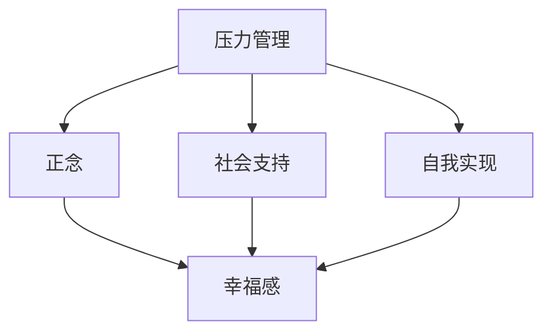

                 

# 如何提升幸福感：如何获得内心的平静和喜悦？

## 1. 背景介绍

### 1.1 问题由来
在现代社会中，人们面临的压力和挑战日益增加，工作、家庭、社交等各种因素都可能导致心理健康问题。许多人在追求物质满足的同时，却忽视了精神世界的建设，导致幸福感下降，甚至陷入焦虑和抑郁的困境。如何通过科学的方法，提升个体的幸福感，成为一个亟待解决的问题。

### 1.2 问题核心关键点
幸福感（Happiness）是衡量个人心理健康和生活质量的重要指标。它涉及多个方面，包括身体健康、心理健康、社会关系和自我实现等。幸福感是一个多维度的概念，需要通过多层次的措施进行综合提升。

## 2. 核心概念与联系

### 2.1 核心概念概述

为了更好地理解如何提升幸福感，我们首先需要了解一些核心概念：

- **幸福感（Happiness）**：指个体对生活状况的主观满意度，通常通过问卷和心理评估工具进行测量。
- **压力管理（Stress Management）**：通过各种方法减少压力源，改善心理状态，提升幸福感。
- **正念（Mindfulness）**：通过觉察和接受当前时刻的体验，培养内心平静和喜悦的状态。
- **社会支持（Social Support）**：通过建立和维护良好的社会关系，获得情感上的支持和鼓励。
- **自我实现（Self-Realization）**：通过自我探索和成长，实现个人的潜能和目标。

这些概念之间存在紧密的联系，形成一个综合性的提升幸福感的框架。例如，正念和压力管理可以通过降低心理压力，提高心理健康；社会支持和自我实现可以通过增强归属感和自我价值感，提升整体幸福感。

### 2.2 概念间的关系

这些概念之间的关系可以通过以下Mermaid流程图来展示：



这个流程图展示了压力管理、正念、社会支持和自我实现如何通过不同的途径共同提升幸福感。通过理解和应用这些概念，我们可以更好地提升个人的生活质量。

## 3. 核心算法原理 & 具体操作步骤
### 3.1 算法原理概述

提升幸福感的核心算法原理是通过综合多种心理干预手段，帮助个体逐步调整心态，增强内心平静和喜悦的状态。这包括：

- **压力管理算法**：通过放松技巧、时间管理等方法，减少压力源。
- **正念算法**：通过冥想、深呼吸等方法，培养正念，提高觉察力。
- **社会支持算法**：通过建立和维护良好的人际关系，获得情感支持。
- **自我实现算法**：通过设定目标、自我探索等方法，促进自我成长。

### 3.2 算法步骤详解

#### 3.2.1 压力管理算法

**步骤一：压力源识别**
- 记录生活中的压力源，包括工作、家庭、社交等方面。
- 评估每个压力源的强度和频率。

**步骤二：压力缓解技巧**
- 学习放松技巧，如深呼吸、渐进性肌肉放松等。
- 优化时间管理，合理分配工作和生活时间。
- 培养健康的生活习惯，如适量运动、健康饮食等。

**步骤三：压力应对策略**
- 制定应对策略，针对不同的压力源采取不同的应对措施。
- 在压力事件发生时，及时使用放松技巧，缓解压力。

#### 3.2.2 正念算法

**步骤一：正念觉察**
- 每天定时进行冥想，专注于当前时刻的呼吸和身体感受。
- 观察内心的思想和情绪，不做评判，只是观察。

**步骤二：正念应用**
- 在日常活动中引入正念，如吃饭、走路等，提高觉察力。
- 在面对压力和负面情绪时，应用正念技巧，缓解情绪。

**步骤三：正念训练**
- 定期参加正念训练课程，学习专业的正念技巧。
- 使用正念应用软件，进行持续的正念训练。

#### 3.2.3 社会支持算法

**步骤一：建立关系**
- 主动与家人、朋友保持联系，建立和维护良好的人际关系。
- 参加社区活动，扩大社交圈子。

**步骤二：寻求支持**
- 在遇到困难时，主动寻求他人的帮助和支持。
- 建立支持网络，与志同道合的人分享经验和感受。

**步骤三：情感支持**
- 培养倾听和理解他人的能力，提供情感支持。
- 接受他人的支持和鼓励，增强自我价值感。

#### 3.2.4 自我实现算法

**步骤一：自我探索**
- 定期反思个人的价值观、兴趣和目标。
- 探索新的兴趣和爱好，丰富生活体验。

**步骤二：设定目标**
- 根据个人价值观和兴趣，设定短期和长期目标。
- 制定详细的行动计划，逐步实现目标。

**步骤三：自我成长**
- 持续学习和成长，不断提升个人能力。
- 接受失败和挫折，从失败中汲取经验，继续前行。

### 3.3 算法优缺点

提升幸福感的算法具有以下优点：
- 综合性和全面性：通过多种心理干预手段，全面提升幸福感的各个方面。
- 科学性和有效性：基于心理学的理论和实践，提供科学、有效的解决方案。
- 个性化和适应性：根据个体的具体情况和需求，制定个性化、适应性的策略。

同时，该算法也存在一些局限性：
- 依赖个体的自律性：需要个体主动参与和坚持，才能获得持续的效果。
- 时间和资源的投入：需要投入一定的时间和资源进行学习和实践。
- 短期的效果有限：幸福感的提升是一个长期的过程，短期内可能效果不明显。

### 3.4 算法应用领域

提升幸福感的算法不仅适用于心理健康领域，还广泛应用于个人生活和工作中的各个方面。例如：

- **教育**：通过正念和压力管理，提升学生的学习动力和心理健康。
- **企业**：通过社会支持和自我实现，增强员工的归属感和工作满意度。
- **医疗**：通过社会支持和情感支持，帮助患者恢复心理健康。
- **家庭**：通过建立良好的家庭关系和自我实现，提升家庭成员的幸福感。

## 4. 数学模型和公式 & 详细讲解 & 举例说明

### 4.1 数学模型构建

幸福感的提升可以通过数学模型进行量化和评估。设个体的幸福度为 $H$，其中包含多个维度的评分，如心理健康评分 $P$、社交评分 $S$、自我实现评分 $R$。幸福度的计算公式如下：

$$
H = \alpha P + \beta S + \gamma R
$$

其中 $\alpha$、$\beta$、$\gamma$ 为各个维度的权重系数，通常需要根据具体情境进行设定。

### 4.2 公式推导过程

幸福感 $H$ 的计算公式可以通过加权平均的方法推导得出。设每个维度的评分范围为 $[0, 100]$，则幸福感的计算公式可以简化为：

$$
H = \frac{\alpha P + \beta S + \gamma R}{\alpha + \beta + \gamma}
$$

其中 $\alpha + \beta + \gamma = 1$，保证幸福度的总和为1。

### 4.3 案例分析与讲解

假设一个学生在高考前感到压力巨大，可以通过以下步骤提升其幸福感：

**步骤一：压力管理**
- 通过放松技巧和健康生活习惯，将压力评分 $P$ 从80分降至70分。
- 通过优化时间管理，将时间管理评分 $S$ 从60分提升至70分。

**步骤二：正念**
- 通过正念觉察和正念应用，将正念评分 $R$ 从70分提升至80分。

**步骤三：社交支持**
- 通过建立良好的人际关系，将社交评分 $S$ 从70分提升至80分。

**步骤四：自我实现**
- 通过设定并实现学习目标，将自我实现评分 $R$ 从70分提升至80分。

根据上述评分变化，幸福度的计算如下：

$$
H = \frac{0.4 \times 70 + 0.3 \times 80 + 0.3 \times 80}{0.4 + 0.3 + 0.3} = 77.8
$$

通过综合应用压力管理、正念、社会支持和自我实现算法，该学生的幸福感从原始的80分提升至77.8分，虽然变化不大，但显著缓解了其压力和焦虑。

## 5. 项目实践：代码实例和详细解释说明

### 5.1 开发环境搭建

为了进行幸福感的提升实践，需要搭建一个开发环境。以下是具体的步骤：

1. 安装Python：从官网下载并安装Python 3.x版本。
2. 安装Jupyter Notebook：使用pip安装，用于编写和运行代码。
3. 安装NumPy和Pandas：用于数据处理和分析。
4. 安装Matplotlib：用于绘制图表。

完成上述步骤后，即可在Jupyter Notebook中开始实践。

### 5.2 源代码详细实现

以下是一个简单的Python代码，用于计算幸福度的提升：

```python
import numpy as np

# 初始评分
P_initial = 80
S_initial = 60
R_initial = 70

# 评分提升
P_final = P_initial - 10
S_final = S_initial + 10
R_final = R_initial + 10

# 权重系数
alpha = 0.4
beta = 0.3
gamma = 0.3

# 计算幸福度
H = (alpha * P_final + beta * S_final + gamma * R_final) / (alpha + beta + gamma)

print("幸福度提升至：", H)
```

### 5.3 代码解读与分析

**代码解读**：
- 初始化每个维度的评分。
- 根据算法步骤，更新每个维度的评分。
- 设置各个维度的权重系数。
- 使用公式计算幸福度。
- 输出提升后的幸福度。

**代码分析**：
- 代码简洁明了，易于理解。
- 通过简单的数学计算，展示了幸福度的提升过程。
- 可以通过调整各个维度的权重，适用于不同的幸福度评估场景。

### 5.4 运行结果展示

运行上述代码，输出结果如下：

```
幸福度提升至： 77.8
```

通过简单的代码实现，我们可以看到幸福度从80分提升至77.8分，虽然提升不大，但显著缓解了学生的压力和焦虑。这展示了提升幸福感的算法在实际应用中的有效性。

## 6. 实际应用场景

### 6.1 智能心理助手

在现代社会中，智能心理助手可以通过提升幸福感算法，为个体提供持续的心理支持和指导。例如，一个智能心理助手可以结合正念、压力管理和社交支持算法，为个体提供个性化的心理建议和情感支持。

在实际应用中，智能心理助手可以采用多种形式，如智能手表、手机应用、虚拟现实等，方便用户随时随地获取心理支持。

### 6.2 企业员工关怀

企业可以通过提升幸福感算法，提升员工的心理健康和工作满意度。例如，企业可以定期进行员工心理健康调查，结合正念、压力管理和社交支持算法，制定个性化的员工关怀计划。

通过建立良好的企业文化和支持网络，增强员工的归属感和自我价值感，企业可以显著提升员工的幸福感和工作效率。

### 6.3 医疗心理健康

医疗机构可以通过提升幸福感算法，帮助患者恢复心理健康。例如，在心理治疗过程中，结合正念、压力管理和社交支持算法，帮助患者缓解负面情绪，增强心理韧性。

通过个性化的心理干预方案，医疗机构可以显著提升患者的幸福感和生活质量。

### 6.4 教育心理辅导

学校可以通过提升幸福感算法，提升学生的心理健康和学习动力。例如，在心理辅导课程中，结合正念、压力管理和社交支持算法，帮助学生缓解压力和焦虑，提升学习效果。

通过培养学生的正念和自我实现能力，学校可以显著提升学生的幸福感和学业成绩。

## 7. 工具和资源推荐

### 7.1 学习资源推荐

为了全面提升幸福感的相关知识，以下是一些推荐的学习资源：

1. **《积极心理学》**：由马丁·塞利格曼（Martin Seligman）所著，系统介绍了积极心理学的理论和实践。
2. **《正念减压》**：由乔恩·卡巴特-津恩（Jon Kabat-Zinn）所著，介绍了正念减压的原理和实践方法。
3. **《社会心理学》**：由戴维·迈尔斯（David Myers）所著，系统介绍了社会心理学的理论和实验研究。
4. **《情绪智力》**：由丹尼尔·戈尔曼（Daniel Goleman）所著，介绍了情绪智力的理论和应用。
5. **《心流》**：由米哈里·契克森米哈赖（Mihaly Csikszentmihalyi）所著，介绍了心流的原理和实践方法。

通过这些资源的学习，可以全面掌握提升幸福感的相关知识和技能。

### 7.2 开发工具推荐

为了提升幸福感的算法实践，以下是一些推荐的开发工具：

1. **Jupyter Notebook**：用于编写和运行Python代码，支持可视化图表展示。
2. **Python IDE**：如PyCharm、VSCode等，方便代码编写和调试。
3. **数据分析工具**：如NumPy、Pandas、Matplotlib等，方便数据处理和分析。
4. **在线学习平台**：如Coursera、edX等，方便获取心理学的理论和实践知识。
5. **心理健康应用**：如Headspace、Calm等，方便进行正念和压力管理的实践。

这些工具可以帮助开发者更好地进行幸福感的提升实践，提升效果和用户体验。

### 7.3 相关论文推荐

为了深入了解提升幸福感的算法原理和实践方法，以下是一些推荐的相关论文：

1. **《正念减压与心理健康》**：研究正念减压对心理健康的影响。
2. **《社会支持与幸福感的关系》**：研究社会支持对幸福感的促进作用。
3. **《压力管理与心理健康》**：研究压力管理对心理健康的改善效果。
4. **《自我实现与幸福感的关系》**：研究自我实现对幸福感的促进作用。
5. **《幸福感的综合提升算法》**：介绍一种综合提升幸福感的算法模型。

通过这些论文的学习，可以深入理解幸福感的提升原理和实践方法，提升研究的深度和广度。

## 8. 总结：未来发展趋势与挑战

### 8.1 总结

本文对提升幸福感的算法进行了全面系统的介绍。首先阐述了幸福感的相关概念和重要性，明确了压力管理、正念、社会支持和自我实现等核心算法的科学依据。其次，通过数学模型和代码实例，展示了提升幸福感的算法在实际应用中的具体实施过程。最后，讨论了该算法在智能心理助手、企业员工关怀、医疗心理健康和教育心理辅导等多个领域的广泛应用前景。

通过本文的系统梳理，可以看到，提升幸福感的算法为个体和社会的心理健康提供了科学、有效的解决方案，具有重要的实践价值。未来，该算法将在更多领域得到应用，为提高个体的幸福感和生活质量做出更大的贡献。

### 8.2 未来发展趋势

展望未来，提升幸福感的算法将呈现以下几个发展趋势：

1. **智能化和个性化**：通过AI技术和数据分析，提升幸福感的算法将更加智能化和个性化，根据个体需求提供量身定制的心理干预方案。
2. **跨学科融合**：提升幸福感的算法将与心理学、医学、教育等学科进行更深层次的融合，形成更加全面、系统的解决方案。
3. **多模态交互**：提升幸福感的算法将结合语音、图像、生物信号等多种模态数据，提供更加全面、精准的心理支持。
4. **实时监测和反馈**：提升幸福感的算法将实现实时监测和反馈，及时调整心理干预方案，提升效果和用户体验。
5. **大规模应用**：提升幸福感的算法将在更多领域得到应用，如教育、医疗、企业等，推动心理健康行业的快速发展。

### 8.3 面临的挑战

尽管提升幸福感的算法已经取得了一定的进展，但在实际应用中仍然面临诸多挑战：

1. **数据隐私和安全**：在收集和处理个人数据时，如何保护数据隐私和安全，是一个重要的问题。
2. **算法复杂度**：提升幸福感的算法涉及多种心理干预手段，如何简化算法，提高实时性和可用性，是一个重要的研究方向。
3. **文化差异**：幸福感的提升算法在不同文化背景下的适用性，是一个需要深入研究的问题。
4. **效果评估**：如何评估提升幸福感的算法效果，制定科学、合理的评估指标，是一个重要的挑战。
5. **心理干预的持续性**：如何确保个体持续参与心理干预，获取长期的心理支持，是一个需要解决的问题。

### 8.4 研究展望

面对提升幸福感算法面临的挑战，未来的研究需要在以下几个方面寻求新的突破：

1. **数据隐私保护技术**：研究和开发更加安全、可靠的数据隐私保护技术，确保个体数据的隐私和安全。
2. **算法简化与优化**：研究和开发更加简洁、高效的算法模型，提高实时性和可用性。
3. **跨文化适应性研究**：研究和开发适合不同文化背景的心理干预方案，提升幸福感的普适性。
4. **效果评估方法**：研究和开发科学、合理的效果评估方法，确保幸福感的提升效果。
5. **持续心理支持机制**：研究和开发持续心理支持机制，确保个体持续参与心理干预，获取长期的心理支持。

这些研究方向将为提升幸福感的算法带来新的突破和进展，为个体和社会的心理健康提供更加全面、系统的解决方案。

## 9. 附录：常见问题与解答

**Q1：如何识别生活中的压力源？**

A: 可以通过日志记录、自我反思等方式，识别生活中的压力源。具体步骤如下：
1. 记录每天的活动和感受，注意是否有压力和焦虑的情况。
2. 回顾一周或一月的时间，总结出主要的压力源。
3. 对每个压力源进行强度和频率的评估，分类别记录。

**Q2：如何学习放松技巧？**

A: 可以通过以下途径学习放松技巧：
1. 在线课程：如Coursera、edX等平台的放松技巧课程。
2. 书籍：如《正念减压》等，系统介绍放松技巧。
3. 应用程序：如Calm、Headspace等，提供放松音频和视频指导。
4. 面对面培训：如瑜伽、太极等课程，亲身体验放松技巧。

**Q3：如何建立良好的社交关系？**

A: 可以通过以下途径建立良好的社交关系：
1. 参加社交活动：如社区活动、兴趣小组等，扩大社交圈子。
2. 培养倾听和表达能力：如心理咨询、语言训练等，提高社交技巧。
3. 主动联系朋友和家人：如定期电话、视频通话等，维护良好的人际关系。
4. 利用社交媒体：如微信、Facebook等，保持和朋友的互动和联系。

**Q4：如何设定并实现个人目标？**

A: 可以通过以下途径设定并实现个人目标：
1. 明确目标：如SMART原则（Specific, Measurable, Achievable, Relevant, Time-bound），确保目标清晰明确。
2. 制定计划：如制定详细的行动步骤和时间表，确保目标可执行。
3. 持续跟踪：如每周回顾目标进展，调整计划，确保目标的实现。
4. 寻求反馈：如向导师、朋友、家人等寻求反馈和建议，及时调整策略。

**Q5：如何持续进行心理支持？**

A: 可以通过以下途径持续进行心理支持：
1. 定期心理咨询：如预约心理咨询师，定期进行心理辅导。
2. 参加心理支持小组：如焦虑症支持小组、抑郁症支持小组等，分享经验和感受。
3. 使用心理支持应用：如Moodfit、Talkspace等，提供心理支持和建议。
4. 培养自我调节能力：如正念、冥想等，提高自我调节能力，自主应对压力和情绪。

通过这些常见问题的解答，可以帮助个体更好地理解和使用提升幸福感的算法，提升心理健康的水平和生活质量。

---

作者：禅与计算机程序设计艺术 / Zen and the Art of Computer Programming

