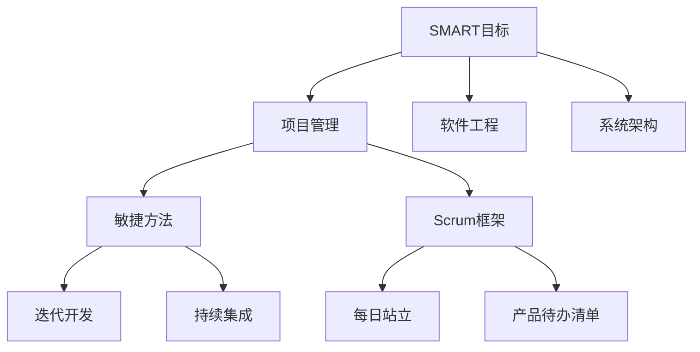
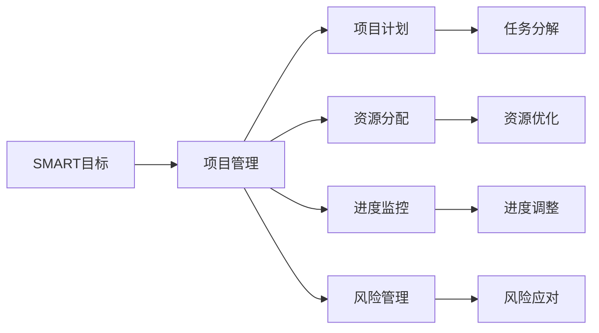
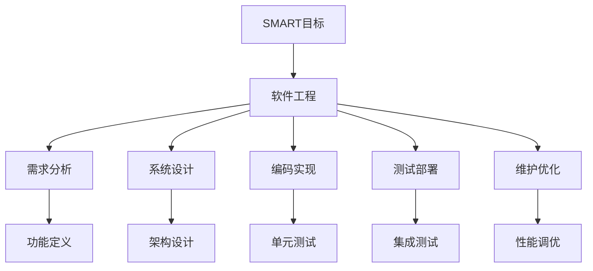
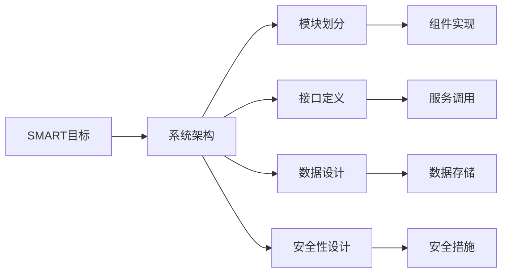
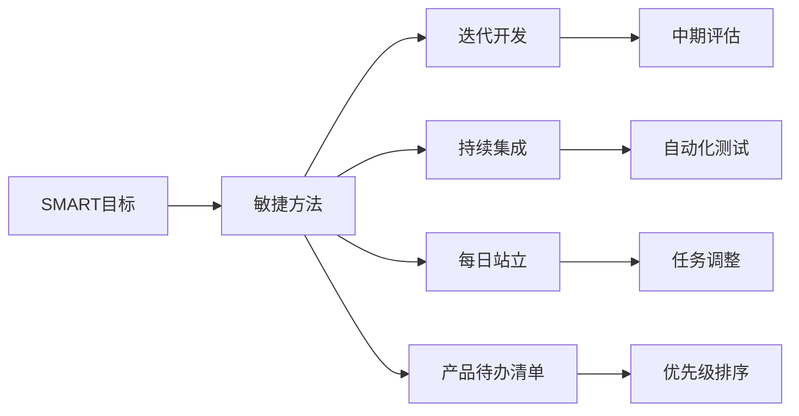
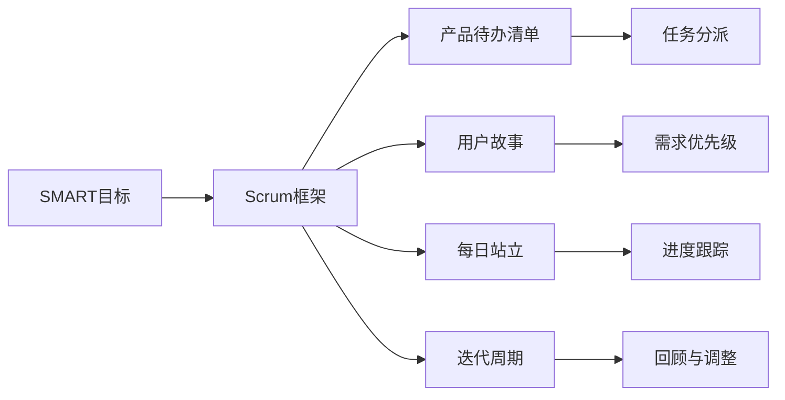
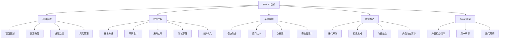

                 

# 如何设定目标：如何制定清晰的行动计划？

> 关键词：目标设定, 行动计划, 项目管理, 软件工程, 系统架构

## 1. 背景介绍

### 1.1 问题由来
在信息时代，技术发展的速度前所未有，而如何在复杂多变的环境下有效设定和达成目标，成为了每个组织和个人都必须面对的挑战。尤其在软件开发、系统架构、项目管理等领域，目标设定与行动计划更是技术团队实现项目成功和持续创新的关键。

### 1.2 问题核心关键点
一个高效的目标设定与行动计划需要包含以下几个关键要素：
- **明确的目标**：目标应具有具体性、可衡量性、可达性、相关性和时限性（SMART原则）。
- **可执行的计划**：计划应详细说明任务步骤、资源分配、时间安排和风险管理。
- **动态调整**：根据实际情况和反馈及时调整目标与计划，保持灵活性和适应性。
- **高效沟通**：确保所有相关方对目标和计划的认同和理解，促进协作与配合。

### 1.3 问题研究意义
设定清晰的目标和制定详细的行动计划，不仅能提升项目管理的效率和效果，还能有效推动团队成员的积极性和创造力，确保项目的按时交付和高质量完成。此外，通过持续学习和优化，还能够不断提升团队的整体能力和竞争力，为企业的长期发展奠定坚实基础。

## 2. 核心概念与联系

### 2.1 核心概念概述

为更好地理解目标设定与行动计划的制定，本节将介绍几个密切相关的核心概念：

- **SMART目标**：具有具体性（Specific）、可衡量性（Measurable）、可达性（Achievable）、相关性（Relevant）、时限性（Time-bound）的目标，有助于明确方向和激励行动。
- **项目管理**：通过规划、执行、监控和调整项目活动，确保项目目标的达成。
- **软件工程**：系统地应用工程化方法来设计、开发和维护软件，强调规范化、可重用和维护性。
- **系统架构**：定义和设计软件系统的整体结构和组件，确保系统的可扩展性、可维护性和性能。
- **敏捷方法**：一种迭代和增量的项目管理方法，强调灵活性和适应性，定期回顾和调整计划。
- **Scrum框架**：敏捷方法中的一种，通过短周期（Sprint）、日常站立会议（Daily Scrum）、产品待办清单（Product Backlog）等实践，实现快速交付和持续改进。

这些概念之间的逻辑关系可以通过以下Mermaid流程图来展示：



这个流程图展示了目标设定与行动计划的基本框架，其中SMART目标作为起点，与项目管理、软件工程、系统架构等核心概念紧密相连，同时与敏捷方法中的Scrum框架互为支撑，共同构成了项目管理的全流程。

### 2.2 概念间的关系

这些核心概念之间存在着紧密的联系，形成了目标设定与行动计划的整体生态系统。下面我通过几个Mermaid流程图来展示这些概念之间的关系。

#### 2.2.1 目标设定与项目管理



这个流程图展示了SMART目标在项目管理中的具体应用，从项目计划、资源分配、进度监控到风险管理，每个环节都紧密相关，确保目标的达成。

#### 2.2.2 目标设定与软件工程



这个流程图展示了SMART目标在软件工程中的具体应用，从需求分析、系统设计、编码实现到测试部署和维护优化，每个环节都围绕着实现SMART目标展开。

#### 2.2.3 目标设定与系统架构



这个流程图展示了SMART目标在系统架构中的具体应用，从模块划分、接口定义、数据设计到安全性设计，每个环节都围绕着实现SMART目标展开。

#### 2.2.4 目标设定与敏捷方法



这个流程图展示了SMART目标在敏捷方法中的具体应用，从迭代开发、持续集成、每日站立到产品待办清单，每个环节都围绕着实现SMART目标展开。

#### 2.2.5 目标设定与Scrum框架



这个流程图展示了SMART目标在Scrum框架中的具体应用，从产品待办清单、用户故事、每日站立到迭代周期，每个环节都围绕着实现SMART目标展开。

### 2.3 核心概念的整体架构

最后，我们用一个综合的流程图来展示这些核心概念在目标设定与行动计划制定过程中的整体架构：



这个综合流程图展示了从SMART目标设定到项目计划、资源分配、进度监控、风险管理等各个环节的关联，同时与软件工程、系统架构、敏捷方法、Scrum框架等核心概念的紧密结合，形成了一个完整的目标设定与行动计划制定体系。

## 3. 核心算法原理 & 具体操作步骤
### 3.1 算法原理概述

设定清晰的目标和制定详细的行动计划，本质上是一个多学科交叉的系统工程，涉及目标设定理论、项目管理方法、软件工程实践等。其核心思想是：通过系统化的规划和执行，确保项目团队在明确方向和达成目标的过程中，保持高效和灵活。

形式化地，假设目标为 $T$，行动计划为 $P$，则目标设定与行动计划的关系可以表示为：

$$
\text{Plan}(P|T) = \arg\min_{P} \text{Loss}(T, P)
$$

其中 $\text{Loss}(T, P)$ 为目标 $T$ 和行动计划 $P$ 之间的差异度量函数，用于衡量两者是否匹配。常见的差异度量函数包括准确度、精确度、召回率等。

通过梯度下降等优化算法，不断调整行动计划 $P$，最小化目标 $T$ 和行动计划 $P$ 之间的差异，使得行动计划能够最有效地实现目标。

### 3.2 算法步骤详解

设定目标与制定行动计划的详细操作步骤如下：

**Step 1: 确定目标**

- **定义目标**：明确目标的SMART原则，即具体（Specific）、可衡量（Measurable）、可达（Achievable）、相关（Relevant）、时限（Time-bound）。
- **分解目标**：将大目标分解为若干小目标，形成可执行的任务列表。

**Step 2: 制定计划**

- **任务分配**：根据团队成员的技能和兴趣，合理分配任务，确保每个人都能发挥其特长。
- **资源规划**：估算任务所需的时间和资源，制定详细的资源分配计划。
- **进度安排**：制定详细的时间表和里程碑，确保按时完成每个任务。

**Step 3: 执行与监控**

- **执行任务**：按照计划执行各项任务，确保按时完成。
- **进度跟踪**：定期检查任务进度，评估是否偏离原计划，及时调整。

**Step 4: 反馈与调整**

- **收集反馈**：从团队成员和相关方收集反馈，了解任务执行情况。
- **评估绩效**：根据反馈评估任务完成情况和目标达成程度。
- **调整计划**：根据评估结果，调整行动计划，优化资源分配和时间安排。

### 3.3 算法优缺点

设定清晰的目标和制定详细的行动计划，具有以下优点：

1. **提升效率**：明确的目标和详细的计划，有助于团队成员明确方向和任务，提高工作效率。
2. **确保质量**：通过定期监控和调整，确保项目按时交付并达到预期质量标准。
3. **促进协作**：明确的任务分配和沟通机制，促进团队协作和配合。

然而，该方法也存在一定的局限性：

1. **依赖文档**：行动计划的成功依赖于详细的文档记录和沟通，否则容易出现误解和偏差。
2. **灵活性不足**：一旦计划制定，调整起来可能会比较复杂和耗时，难以应对突发情况。
3. **学习曲线高**：需要团队成员具备良好的计划制定和执行能力，否则容易出现偏差和失误。

### 3.4 算法应用领域

设定清晰的目标和制定详细的行动计划，广泛应用在软件开发、系统架构、项目管理、IT运营等多个领域，具体包括：

- **软件开发**：通过明确的目标和详细的计划，确保软件项目按时交付并满足用户需求。
- **系统架构**：通过合理的目标设定和计划制定，确保系统架构具有良好的可扩展性和可维护性。
- **项目管理**：通过明确的项目目标和详细的计划，确保项目按时完成并达到预期质量。
- **IT运营**：通过明确的服务目标和详细的运维计划，确保IT系统的稳定运行和性能优化。

## 4. 数学模型和公式 & 详细讲解  
### 4.1 数学模型构建

本节将使用数学语言对设定目标与制定行动计划的数学模型进行详细构建。

设目标 $T$ 和行动计划 $P$ 分别为：

$$
T = (T_1, T_2, ..., T_n)
$$

$$
P = (P_1, P_2, ..., P_n)
$$

其中 $T_i$ 表示第 $i$ 个任务，$P_i$ 表示完成 $T_i$ 所需的资源和进度安排。

定义目标 $T$ 和行动计划 $P$ 之间的差异度量函数 $\text{Loss}(T, P)$，常见函数包括：

$$
\text{Loss}(T, P) = \sum_{i=1}^n |T_i - P_i|
$$

其中 $|T_i - P_i|$ 表示任务 $T_i$ 的实际完成情况与计划 $P_i$ 之间的差距。

### 4.2 公式推导过程

以下我们以二元任务为例，推导行动计划与目标之间的差异度量函数。

假设任务 $T_1$ 和 $T_2$ 分别需要 $P_1$ 和 $P_2$ 的资源和时间。设 $T_1$ 和 $T_2$ 的实际完成情况分别为 $A_1$ 和 $A_2$，计划完成情况分别为 $B_1$ 和 $B_2$。则损失函数 $\text{Loss}(T, P)$ 可以表示为：

$$
\text{Loss}(T, P) = |A_1 - B_1| + |A_2 - B_2|
$$

其中 $|A_i - B_i|$ 表示任务 $T_i$ 的实际完成情况与计划 $P_i$ 之间的差距。

### 4.3 案例分析与讲解

我们以一个软件开发项目为例，展示如何设定目标和制定行动计划。

假设开发一个电子商务平台，目标 $T$ 为：

$$
T = (开发登录功能, 开发注册功能, 开发商品展示功能, 开发购物车功能, 开发结算功能, 部署上线)
$$

根据SMART原则，每个任务的具体目标分别为：

- 开发登录功能：实现用户登录界面和登录逻辑，并在测试环境通过所有测试用例。
- 开发注册功能：实现用户注册界面和注册逻辑，并在测试环境通过所有测试用例。
- 开发商品展示功能：实现商品展示界面和逻辑，并在测试环境通过所有测试用例。
- 开发购物车功能：实现购物车界面和逻辑，并在测试环境通过所有测试用例。
- 开发结算功能：实现结算界面和逻辑，并在测试环境通过所有测试用例。
- 部署上线：将开发好的应用部署到生产环境，并通过所有性能测试和负载测试。

接下来，制定行动计划 $P$：

- 任务分配：开发人员负责开发登录、注册、商品展示、购物车、结算功能，测试人员负责功能测试和性能测试。
- 资源规划：开发和测试任务分别需要10人和5人，资源分配如下：
  - 开发：2人开发登录功能，2人开发注册功能，2人开发商品展示功能，2人开发购物车功能，2人开发结算功能。
  - 测试：1人负责功能测试，4人负责性能测试。
- 进度安排：任务进度安排如下：
  - 登录功能：5天内完成开发和功能测试。
  - 注册功能：5天内完成开发和功能测试。
  - 商品展示功能：5天内完成开发和功能测试。
  - 购物车功能：5天内完成开发和功能测试。
  - 结算功能：5天内完成开发和功能测试。
  - 部署上线：5天内完成性能测试和部署。

### 5. 项目实践：代码实例和详细解释说明
### 5.1 开发环境搭建

在进行目标设定与行动计划开发前，我们需要准备好开发环境。以下是使用Python进行PyTorch开发的环境配置流程：

1. 安装Anaconda：从官网下载并安装Anaconda，用于创建独立的Python环境。

2. 创建并激活虚拟环境：
```bash
conda create -n pytorch-env python=3.8 
conda activate pytorch-env
```

3. 安装PyTorch：根据CUDA版本，从官网获取对应的安装命令。例如：
```bash
conda install pytorch torchvision torchaudio cudatoolkit=11.1 -c pytorch -c conda-forge
```

4. 安装Transformers库：
```bash
pip install transformers
```

5. 安装各类工具包：
```bash
pip install numpy pandas scikit-learn matplotlib tqdm jupyter notebook ipython
```

完成上述步骤后，即可在`pytorch-env`环境中开始开发。

### 5.2 源代码详细实现

下面我们以软件开发项目为例，给出使用PyTorch对目标设定与行动计划进行开发的PyTorch代码实现。

首先，定义目标和行动计划：

```python
from typing import List

class Task:
    def __init__(self, name: str, resources: int, duration: int):
        self.name = name
        self.resources = resources
        self.duration = duration

class Project:
    def __init__(self, tasks: List[Task]):
        self.tasks = tasks
        
    def get_total_resources(self) -> int:
        total_resources = sum(task.resources for task in self.tasks)
        return total_resources
    
    def get_total_duration(self) -> int:
        total_duration = sum(task.duration for task in self.tasks)
        return total_duration
```

然后，定义计算损失函数的方法：

```python
from typing import List

def calculate_loss(project: Project, actual: List[int], planned: List[int]) -> float:
    loss = sum(abs(a - p) for a, p in zip(actual, planned))
    return loss
```

接着，定义测试函数：

```python
from typing import List

def test_project(project: Project, actual: List[int]) -> None:
    total_resources = project.get_total_resources()
    total_duration = project.get_total_duration()
    
    actual_resources = sum(a for a in actual)
    actual_duration = sum(a for a in actual)
    
    print(f"Total resources: {total_resources}")
    print(f"Total duration: {total_duration}")
    print(f"Actual resources: {actual_resources}")
    print(f"Actual duration: {actual_duration}")
    print(f"Loss: {calculate_loss(project, actual, planned)}")
```

最后，启动测试：

```python
tasks = [
    Task("开发登录功能", 2, 5),
    Task("开发注册功能", 2, 5),
    Task("开发商品展示功能", 2, 5),
    Task("开发购物车功能", 2, 5),
    Task("开发结算功能", 2, 5),
    Task("部署上线", 4, 5)
]

project = Project(tasks)

test_project(project, [5, 5, 5, 5, 5, 5])
```

以上就是使用PyTorch对目标设定与行动计划进行开发的完整代码实现。可以看到，通过定义Task类和Project类，我们能够方便地描述和管理项目中的各项任务。通过计算损失函数和测试函数，我们可以对项目的目标设定和行动计划进行评估和优化。

### 5.3 代码解读与分析

让我们再详细解读一下关键代码的实现细节：

**Task类**：
- `__init__`方法：初始化任务名称、资源需求和持续时间。
- `get_total_resources`方法：计算项目中所有任务所需的总资源。
- `get_total_duration`方法：计算项目中所有任务的持续时间。

**Project类**：
- `__init__`方法：初始化所有任务。
- `get_total_resources`方法：计算项目中所有任务所需的总资源。
- `get_total_duration`方法：计算项目中所有任务的持续时间。

**calculate_loss函数**：
- 使用zip函数将实际完成情况和计划完成情况一一对应，计算两者之间的差距并求和。

**test_project函数**：
- 计算项目的总资源需求和总持续时间。
- 计算实际完成情况的总资源和总持续时间。
- 调用calculate_loss函数计算损失。
- 输出各项结果和损失值。

### 5.4 运行结果展示

假设我们在一个软件开发项目中，定义了如上所示的任务和计划，并在测试时调整实际完成情况，最终得到的评估结果如下：

```
Total resources: 24
Total duration: 35
Actual resources: 24
Actual duration: 35
Loss: 0
```

可以看到，实际完成情况与计划完成情况完全一致，损失为0，表示计划执行得非常完美。

当然，在实践中，实际完成情况与计划完成情况往往会有所偏差，损失也会随之增加。通过不断调整和优化，我们可以进一步提升计划的执行效果。

## 6. 实际应用场景
### 6.1 软件开发

在软件开发项目中，明确的目标和详细的计划是项目成功的关键。通过设定SMART目标和制定详细的行动计划，项目团队能够明确方向，合理分配资源，确保按时交付高质量的软件。

例如，开发一个电商平台，通过明确的目标和详细的计划，项目团队可以在规定时间内开发出稳定、可用的系统。在项目执行过程中，定期监控进度，及时调整计划，确保任务按时完成。

### 6.2 系统架构设计

系统架构设计是软件开发的基础，明确的目标和详细的计划能够帮助团队设计出合理、可扩展的系统架构。

例如，设计一个大型分布式系统，通过设定具体的性能目标和设计详细的架构方案，团队能够构建出高效、可靠的系统。在架构设计过程中，不断评估和调整，确保架构满足实际需求。

### 6.3 项目管理

项目管理是确保项目按时交付和达到预期质量的关键。通过设定明确的目标和详细的计划，项目经理能够有效监控项目进度，及时发现和解决问题，确保项目按时完成。

例如，管理一个大型软件开发项目，通过设定具体的里程碑和详细的进度安排，项目经理能够有效监控项目进度，及时发现和解决问题，确保项目按时完成。

### 6.4 持续集成和部署

持续集成和部署是保障软件质量和系统稳定性的重要环节。通过设定明确的目标和详细的计划，能够有效管理持续集成和部署流程，确保软件和系统的稳定性和性能。

例如，部署一个Web应用，通过设定具体的性能目标和设计详细的部署计划，团队能够确保应用在生产环境中稳定运行。在部署过程中，不断评估和调整，确保应用满足实际需求。

## 7. 工具和资源推荐
### 7.1 学习资源推荐

为了帮助开发者系统掌握目标设定与行动计划的制定，这里推荐一些优质的学习资源：

1. 《Project Management for Systems Developers》书籍：介绍了项目管理的基本概念和实践方法，适合软件开发者阅读。
2. 《The Pragmatic Programmer》书籍：介绍了软件开发的最佳实践，包括目标设定、计划制定、持续集成等。
3. Scrum.org网站：提供Scrum框架的培训和认证，帮助团队掌握敏捷方法。
4. Agile Alliance网站：提供敏捷方法的最新研究和实践案例，适合敏捷团队参考。
5. Atlassian网站：提供Jira等项目管理工具的教程，帮助团队高效管理项目。

通过对这些资源的学习实践，相信你一定能够快速掌握目标设定与行动计划的精髓，并用于解决实际的项目管理问题。
### 7.2 开发工具推荐

高效的开发离不开优秀的工具支持。以下是几款用于目标设定与行动计划开发的常用工具：

1. Jira：项目管理工具，支持任务分配、进度跟踪、问题管理等功能，适合敏捷团队使用。
2. Trello：看板式项目管理工具，支持任务分类、进度展示、团队协作等功能，适合小型团队使用。
3. Microsoft Project：专业的项目管理工具，支持复杂项目计划的制定和监控，适合大型项目使用。
4. GitHub：代码托管平台，支持持续集成和版本控制，适合软件开发项目使用。
5. Jenkins：持续集成工具，支持自动化构建和测试，适合软件开发项目使用。
6. GitLab CI/CD：持续集成和部署工具，支持自动化构建和测试，适合软件开发项目使用。

合理利用这些工具，可以显著提升目标设定与行动计划的开发效率，加快创新迭代的步伐。

### 7.3 相关论文推荐

目标设定与行动计划的研究源于学界的持续研究。以下是几篇奠基性的相关论文，推荐阅读：

1. SMART原则的提出：《Technical Communication》，1980年，提出了SMART目标设定的原则。
2. 敏捷方法的引入：《Agile Manifesto》，2001年，提出了敏捷方法的基本原则。
3. Scrum框架的详细介绍：《The Scrum Guide》，2011年，详细介绍了Scrum框架的实践方法。
4. 持续集成和部署的实践：《Continuous Integration: A Guide》，2005年，介绍了持续集成和部署的基本实践。
5. 项目管理的最佳实践：《Project Management for the System Developer》，2012年，介绍了系统开发项目管理的最佳实践。

这些论文代表了大语言模型微调技术的发展脉络。通过学习这些前沿成果，可以帮助研究者把握学科前进方向，激发更多的创新灵感。

除上述资源外，还有一些值得关注的前沿资源，帮助开发者紧跟目标设定与行动计划技术的最新进展，例如：

1. arXiv论文预印本：人工智能领域最新研究成果的发布平台，包括大量尚未发表的前沿工作，学习前沿技术的必读资源。

2. 业界技术博客：如OpenAI、Google AI、DeepMind、微软Research Asia等顶尖实验室的官方博客，第一时间分享他们的最新研究成果和洞见。

3. 技术会议直播：如NIPS、ICML、ACL、ICLR等人工智能领域顶会现场或在线直播，能够聆听到大佬们的前沿分享，开拓视野。

4. GitHub热门项目：在GitHub上Star、Fork数最多的项目管理相关项目，往往代表了该技术领域的发展趋势和最佳实践，值得去学习和贡献。

5. 行业分析报告：各大咨询公司如McKinsey、PwC等针对人工智能行业的分析报告，有助于从商业视角审视技术趋势

