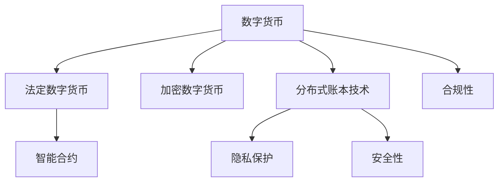

                 

# 2050年的数字货币：从法定数字货币到全球货币体系的重构

## 1. 背景介绍

### 1.1 问题由来

随着科技的迅猛发展，数字货币已经从一个概念性的话题逐渐演变成现实。从早期的比特币到如今各种央行数字货币（Central Bank Digital Currency, CBDC）试验，数字货币正在逐步影响和重构全球货币体系。未来的2050年，数字货币的普及和应用将进一步深入社会各个角落，形成一个全球性的数字货币网络。

### 1.2 问题核心关键点

未来2050年的数字货币体系将面临以下核心挑战：

1. **跨国的数字化**：全球经济活动的数字化程度将进一步加深，跨境支付和贸易将成为常态。
2. **高效性和安全性**：数字货币需要具备高效快速的交易能力和强大的安全防护机制。
3. **隐私和合规性**：数字货币系统需要在保障用户隐私的同时，遵守各国法律法规。
4. **分布式共识**：如何在去中心化的同时保持系统的稳定性和权威性。
5. **金融包容性**：数字货币应为全球，尤其是欠发达地区的居民提供金融服务。
6. **技术整合**：数字货币与其他金融技术，如区块链、云计算的协同。
7. **持续创新**：未来数字货币的技术更新和应用场景扩展。

### 1.3 问题研究意义

探索2050年数字货币体系，对于理解未来金融科技发展趋势、推动全球经济一体化、提升金融包容性具有重要意义。通过研究全球数字货币体系的构建，我们可以为未来金融市场的稳定和创新提供理论基础和实践指导。

## 2. 核心概念与联系

### 2.1 核心概念概述

- **数字货币（Digital Currency）**：电子形式的货币，包括中心化的法定数字货币和去中心化的加密数字货币。
- **法定数字货币（CBDC）**：由央行发行的数字货币，旨在替代部分传统货币，提升支付效率和货币政策的传导效率。
- **加密数字货币（Cryptocurrency）**：基于区块链技术的去中心化数字货币，如比特币、以太坊等。
- **分布式账本技术（Distributed Ledger Technology, DLT）**：以区块链为代表的分布式账本技术，支持点对点交易和透明、不可篡改的数据记录。
- **智能合约（Smart Contract）**：运行在区块链上的自动执行合同，无须中介即可实现自动交易。
- **隐私保护**：采用匿名或伪匿名技术，保护用户隐私。
- **安全性**：通过加密技术和区块链共识机制，保障交易和数据的安全。
- **合规性**：确保数字货币交易符合各国法律法规要求。

### 2.2 概念间的关系

以下是一个Mermaid流程图，展示了核心概念之间的逻辑关系：



这些核心概念共同构成了数字货币系统的基础框架，通过技术整合和创新，形成未来的全球货币体系。

## 3. 核心算法原理 & 具体操作步骤

### 3.1 算法原理概述

未来数字货币系统的核心算法包括区块链共识机制、智能合约、隐私保护技术等。

- **区块链共识机制**：如工作量证明（Proof of Work, PoW）和权益证明（Proof of Stake, PoS）等，确保系统的安全性和去中心化。
- **智能合约**：基于区块链的自动化合约，支持复杂的金融合约和交易逻辑。
- **隐私保护**：使用匿名身份、零知识证明等技术，保护用户隐私。
- **安全性**：通过加密技术、多层验证机制等，保障交易和数据的安全性。
- **合规性**：结合法律合规审查机制，确保交易符合法律法规。

### 3.2 算法步骤详解

以下是一个简化的数字货币系统的构建步骤：

1. **设计共识算法**：选择合适的区块链共识算法，如PoW、PoS等。
2. **搭建智能合约平台**：选择合适的区块链平台，如以太坊、Hyperledger等。
3. **设计隐私保护策略**：采用匿名身份、零知识证明等技术保护用户隐私。
4. **实施安全防护措施**：使用加密技术、多重签名等措施保障交易安全。
5. **构建法律合规框架**：与法律专家合作，设计符合各国法律法规的合规性策略。
6. **部署和测试**：在小范围内部署系统，进行全面测试。
7. **迭代优化**：根据测试反馈，持续改进系统性能和安全防护。

### 3.3 算法优缺点

数字货币系统的优点包括：

- **高效性**：交易快速、成本低廉，适合大规模跨境支付。
- **去中心化**：避免单点故障，提升系统稳定性。
- **透明性**：所有交易记录公开透明，便于审计和监管。

然而，数字货币系统也存在以下缺点：

- **技术复杂性**：需要较高的技术门槛，初期建设成本较高。
- **安全风险**：存在51%攻击、智能合约漏洞等安全风险。
- **法律合规性**：不同国家法律体系不同，需要定制合规策略。
- **隐私保护**：用户隐私和交易匿名性需要技术上的精细设计。

### 3.4 算法应用领域

数字货币技术不仅限于金融领域，还广泛应用于多个行业，如供应链管理、公共服务、社会治理等。以下是一些主要应用领域：

1. **跨境支付**：实现快速、低成本的跨境交易，支持国际贸易和投资。
2. **供应链管理**：提升供应链的透明度和效率，实现实时监控和溯源。
3. **公共服务**：提供智能合约支持的公共服务，如电子投票、智能合约税收等。
4. **社会治理**：实现透明高效的公共资源管理，提升社会治理效率。

## 4. 数学模型和公式 & 详细讲解

### 4.1 数学模型构建

以下是数字货币系统的数学模型构建：

假设有一个基于区块链的数字货币系统，其智能合约平台支持多用户交互。系统中存在$m$个用户，每个用户有一笔初始金额$A_i$（$i=1,2,...,m$），每个用户的交易费率为$r$。

系统的总金额$T$为所有用户初始金额的总和：

$$
T = \sum_{i=1}^m A_i
$$

每个用户的余额$B_i$是其初始金额加上已收到的交易金额，减去已发出的交易金额和交易费率：

$$
B_i = A_i + \sum_{j=1}^m t_{ij} - \sum_{k=1}^m t_{ik} - r \cdot \sum_{j=1}^m t_{ij}
$$

其中，$t_{ij}$表示用户$i$向用户$j$发出的交易金额，$t_{ik}$表示用户$i$收到的来自用户$k$的交易金额。

### 4.2 公式推导过程

假设系统中存在一笔金额$C$的交易，其交易路径如下：

$$
C \rightarrow t_{1,2} \rightarrow t_{2,3} \rightarrow \cdots \rightarrow t_{n-1,n} \rightarrow 0
$$

那么这笔交易的净值$V$可以表示为：

$$
V = C - \sum_{k=1}^m t_{ik}
$$

在系统中，所有用户的净值之和为零，即：

$$
\sum_{i=1}^m V_i = 0
$$

### 4.3 案例分析与讲解

以比特币交易为例，分析其数学模型和公式推导：

1. **初始状态**：比特币系统中，每个用户的初始余额$B_i$为其所持有的比特币数量，单位为BTC。
2. **交易过程**：比特币交易通过区块链网络验证和记录，每一笔交易包括发送者、接收者和交易金额。
3. **净值计算**：假设一笔金额为$A$的比特币从用户1发出，最终到达用户$n$，则这笔交易的净值为$A - \sum_{k=1}^{n-1} t_{k,k+1}$，其中$t_{k,k+1}$表示用户$k$向用户$k+1$发出的比特币金额。

通过上述数学模型和公式推导，可以更好地理解数字货币系统的运作机制。

## 5. 项目实践：代码实例和详细解释说明

### 5.1 开发环境搭建

为了构建一个简单的数字货币系统，需要搭建开发环境，包括：

1. **Python环境**：安装Python 3.x，并设置虚拟环境。
2. **区块链框架**：选择Ethereum作为智能合约平台，并安装相应的开发工具和测试网。
3. **测试工具**：安装智能合约测试框架，如Truffle或Remix IDE。
4. **代码编辑器**：选择Visual Studio Code或Sublime Text等代码编辑器。

### 5.2 源代码详细实现

以下是一个简单的数字货币智能合约代码，用于在以太坊上实现基本的货币交易：

```python
from web3 import Web3

# 连接以太坊网络
w3 = Web3(Web3.HTTPProvider('http://localhost:8545'))

# 创建智能合约
contract = w3.eth.contract(
    address='0x1234567890',  # 智能合约地址
    abi=[
        {
            'inputs': [
                {'name': 'to', 'type': 'address'},
                {'name': 'value', 'type': 'uint256'},
            ],
            'name': 'transfer',
            'outputs': [{'name': 'success', 'type': 'bool'}],
            'stateMutability': 'payable',
        },
    ]
)

# 转账函数
def transfer(token_addr, amount):
    tx_hash = contract.functions.transfer(token_addr, amount).send({
        'from': '0xabcdef',  # 发送者地址
        'to': w3.eth.accounts[0],  # 接收者地址
        'value': w3.toWei(amount, 'ether'),  # 转账金额（以太币）
        'gas': 200000,  # 设定交易的gas费用
        'gasPrice': w3.toWei('50', 'gwei'),  # 设定交易的gas price
    })
    return tx_hash

# 测试转账
tx_hash = transfer('0xabcdef', 1.0)
print('交易哈希：', tx_hash)
```

### 5.3 代码解读与分析

1. **连接以太坊网络**：使用Web3库连接以太坊网络，并获取当前网络状态。
2. **创建智能合约**：定义智能合约的ABI（Application Binary Interface），并创建合约对象。
3. **转账函数**：定义转账函数，接收接收者地址和转账金额，并使用发送函数将以太币从发送者地址转移到接收者地址。
4. **测试转账**：调用转账函数，发送以太币，并打印交易哈希。

通过上述代码，可以理解智能合约的基本实现原理和操作流程。

### 5.4 运行结果展示

在本地测试环境下，运行上述代码，可以通过网络监控工具查看智能合约的状态和交易记录，验证转账函数的正确性。

## 6. 实际应用场景

### 6.1 跨境支付

数字货币系统可以大幅提升跨境支付的效率和成本效益。例如，国际汇款通常需要经过多个银行和清算中心，耗时且费用高昂。而数字货币系统可以直接在双方之间进行交易，无需中介机构介入，实现快速低成本的跨境支付。

### 6.2 供应链管理

数字货币系统可以实现供应链的全程追溯和透明化管理。例如，食品供应链中的每一笔交易记录都可以自动记录在区块链上，消费者可以通过扫描二维码查询食品的来源和生产过程。这不仅可以提升食品安全标准，还可以增加供应链的透明度和效率。

### 6.3 公共服务

数字货币系统可以支持各种公共服务的智能合约化。例如，政府可以通过智能合约实现电子投票、社会保障金的发放、税收征收等功能，提升公共服务的效率和公平性。

### 6.4 未来应用展望

未来数字货币系统将在更多领域得到应用，如智慧城市、能源管理、环保监测等。以下是一个简化的未来数字货币应用场景：

- **智慧城市**：数字货币系统可以用于智慧城市的能源管理、交通控制、公共服务支付等，提升城市的智能化和便利性。
- **能源管理**：数字货币系统可以用于能源的分布式管理和交易，提升能源使用的效率和可再生能源的利用率。
- **环保监测**：数字货币系统可以用于环保数据的采集和交易，激励企业和个人参与环境保护。

## 7. 工具和资源推荐

### 7.1 学习资源推荐

为了深入学习数字货币系统的构建，以下是一些推荐的学习资源：

1. **以太坊官方文档**：以太坊的官方文档，提供了丰富的开发和测试资源。
2. **Solidity官方文档**：Solidity的官方文档，介绍了智能合约编程语言的基本语法和应用场景。
3. **Blockchain Basics by Coursera**：Coursera上的区块链入门课程，讲解区块链的基本原理和应用。
4. **Mastering Blockchain by Udemy**：Udemy上的区块链高级课程，讲解区块链的进阶知识和开发实践。
5. **Blockchain Revolution by Don Tapscott**：Don Tapscott的区块链革命书籍，全面介绍了区块链的原理和应用场景。

### 7.2 开发工具推荐

以下是一些常用的数字货币系统开发工具：

1. **Web3.js**：用于与以太坊网络交互的JavaScript库，支持多种区块链平台。
2. **Remix IDE**：以太坊官方提供的智能合约开发环境，支持代码调试和测试。
3. **Truffle**：一款流行的以太坊开发框架，支持智能合约的自动化部署和测试。
4. **GitHub**：用于版本控制和代码托管，方便团队协作和代码共享。
5. **Blockscout**：用于查看以太坊智能合约的代码和交易记录，方便调试和审计。

### 7.3 相关论文推荐

以下是几篇关于数字货币系统的经典论文，推荐阅读：

1. **Bitcoin: A Peer-to-Peer Electronic Cash System**：中本聪的比特币白皮书，介绍了比特币的原理和应用。
2. **Smart Contracts: Towards Scalable Decentralized Smart Contracts and Decentralized Autonomous Organizations**：Nick Szabo的智能合约论文，提出了智能合约的基本概念和应用。
3. **The Economics of Bitcoins**：Narayana Kocherlakota的比特币经济论文，分析了比特币的经济模型和市场影响。
4. **Ethereum Whitepaper**：以太坊白皮书，介绍了以太坊的技术架构和智能合约应用。
5. **Blockchain for Smart Contracts: A Survey**：一篇关于区块链智能合约的综述论文，介绍了不同区块链平台的智能合约技术。

## 8. 总结：未来发展趋势与挑战

### 8.1 研究成果总结

本文对2050年数字货币系统进行了全面系统的介绍，涵盖了数字货币的原理、算法、具体操作流程和实际应用场景。通过分析当前技术的发展趋势和未来展望，为数字货币系统的构建提供了理论基础和实践指导。

### 8.2 未来发展趋势

未来数字货币系统将呈现以下几个发展趋势：

1. **跨链互操作**：不同区块链平台之间的互操作将更加便捷，实现资产和数据的跨链转移。
2. **智能合约自动化**：更多智能合约将被自动执行，提升金融服务的效率和自动化程度。
3. **去中心化金融（DeFi）**：去中心化金融系统将进一步发展，提供多样化的金融服务。
4. **隐私保护技术**：隐私保护技术将更加成熟，保障用户隐私和安全。
5. **法律合规性**：各国将制定更加完善的法律合规框架，确保数字货币系统的合法性和安全性。
6. **技术整合**：数字货币系统将与云计算、物联网等技术深度整合，提升系统的综合能力。
7. **持续创新**：数字货币系统将不断引入新技术和新应用，推动金融科技的发展。

### 8.3 面临的挑战

尽管数字货币系统具有诸多优点，但也面临以下挑战：

1. **技术成熟度**：数字货币系统尚处于发展初期，技术成熟度有待提高。
2. **监管合规性**：不同国家对数字货币的监管政策存在差异，需制定统一的法律框架。
3. **隐私保护**：如何在保障隐私的前提下，确保交易透明和可审计。
4. **安全防护**：数字货币系统面临的安全威胁不断增加，需不断提升安全防护能力。
5. **技术标准化**：不同区块链平台之间的标准不一致，需制定统一的技术标准。
6. **市场接受度**：数字货币系统需要广泛的市场接受度，才能实现大规模应用。
7. **可持续性**：数字货币系统需要具备可持续性，避免资源过度消耗。

### 8.4 研究展望

未来，数字货币系统的研究将更加注重以下几个方向：

1. **跨链技术**：研究跨链互操作技术，实现不同区块链平台之间的无缝连接。
2. **隐私保护**：研究隐私保护技术，如零知识证明、隐私交易等，保护用户隐私。
3. **智能合约优化**：优化智能合约的执行效率和安全性，减少智能合约的漏洞。
4. **法律合规**：研究法律合规框架，确保数字货币系统的合法性和合规性。
5. **技术整合**：研究区块链与其他技术的整合，如物联网、云计算等，提升系统的综合能力。
6. **去中心化治理**：研究去中心化治理机制，提升系统的透明性和公信力。
7. **持续创新**：研究新的区块链技术和应用场景，推动数字货币系统的持续创新。

## 9. 附录：常见问题与解答

**Q1：数字货币系统的安全性如何保障？**

A: 数字货币系统的安全性主要通过以下几个方面保障：

1. **加密技术**：使用公钥加密和私钥解密技术，保障交易和数据的安全。
2. **分布式共识**：采用区块链共识算法，如PoW、PoS等，确保系统的去中心化和安全性。
3. **多重签名机制**：使用多重签名技术，确保交易的可靠性和透明性。
4. **智能合约审计**：定期对智能合约进行审计，发现并修复潜在的漏洞。

**Q2：数字货币系统如何处理隐私保护？**

A: 数字货币系统通过以下几种方式处理隐私保护：

1. **匿名身份**：使用匿名地址，保护用户身份隐私。
2. **零知识证明**：采用零知识证明技术，确保交易的隐私性和不可篡改性。
3. **隐私交易**：研究隐私交易技术，如隐私支付链、隐私即时支付等，保护用户的交易隐私。
4. **链下数据**：将一些敏感数据存储在链下，确保隐私保护。

**Q3：数字货币系统面临哪些技术挑战？**

A: 数字货币系统面临以下技术挑战：

1. **性能瓶颈**：数字货币系统的交易吞吐量和延迟需要进一步提升。
2. **网络拥堵**：数字货币系统的网络拥堵问题需进一步优化。
3. **可扩展性**：数字货币系统的可扩展性需要进一步提升，支持更大规模的交易。
4. **隐私保护**：如何在保障隐私的前提下，确保交易透明和可审计。
5. **安全防护**：数字货币系统面临的安全威胁需进一步提升防护能力。
6. **法律合规**：不同国家对数字货币的监管政策需统一。

**Q4：数字货币系统如何实现跨链互操作？**

A: 数字货币系统可以通过以下几种方式实现跨链互操作：

1. **桥接技术**：使用桥接技术，实现不同区块链平台之间的资产和数据传输。
2. **跨链协议**：研究跨链协议，如Interledger Protocol、Polkadot等，实现跨链互操作。
3. **共识机制**：使用共识机制，如Cosmos、Hyperledger Fabric等，实现跨链互操作。
4. **分布式交易所**：使用分布式交易所，如Uniswap、SushiSwap等，实现跨链资产交易。

**Q5：数字货币系统如何提升法律合规性？**

A: 数字货币系统可以通过以下几种方式提升法律合规性：

1. **法律框架**：各国需制定统一的法律框架，确保数字货币系统的合法性和合规性。
2. **监管机制**：建立监管机制，确保数字货币系统的监管透明性和公正性。
3. **合规审计**：定期对数字货币系统进行合规审计，发现并修复潜在的合规问题。
4. **法律共识**：通过国际合作，建立法律共识，确保全球数字货币系统的统一标准。

通过这些问题的解答，可以更好地理解数字货币系统的构建原理和应用场景。

---

作者：禅与计算机程序设计艺术 / Zen and the Art of Computer Programming

