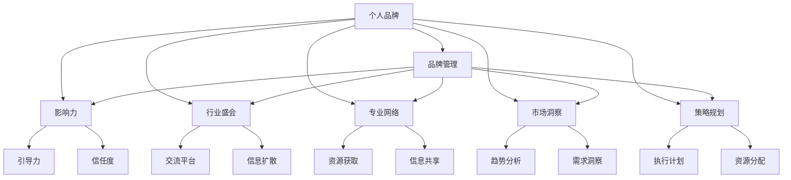
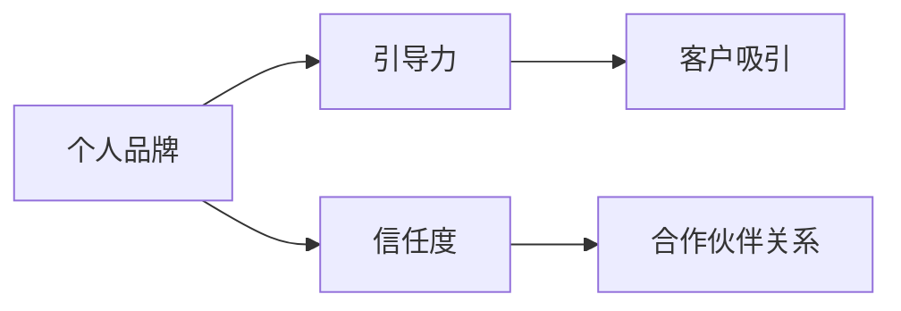
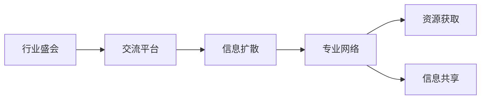
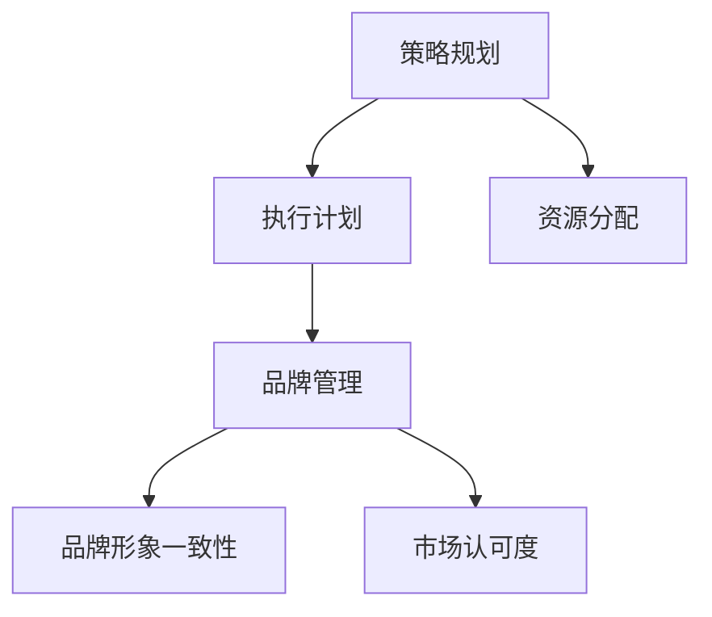

                 

# 建立个人品牌年度盛会：聚集行业影响力

> 关键词：个人品牌,品牌管理,影响力,行业盛会,专业网络,市场洞察,策略规划

## 1. 背景介绍

### 1.1 问题由来
在互联网时代，个人品牌成为了职业发展的重要资产。建立强大的个人品牌，不仅能够增强个人在行业内的影响力，还能带来更多的职业机会和商业价值。特别是在快速变化的数字化时代，个人品牌建设显得尤为重要。然而，如何在快节奏的市场环境中构建和维护个人品牌，却是一个复杂且挑战重重的任务。

### 1.2 问题核心关键点
个人品牌建设的核心在于以下几点：
- **定位与差异化**：明确自己的专业领域和独特价值，树立清晰的品牌形象。
- **内容输出**：通过持续的高质量内容输出，展示专业能力和知识深度。
- **网络关系**：积极建立和维护专业网络，形成影响力辐射圈。
- **市场洞察**：深入了解行业动态和市场需求，把握趋势机会。
- **策略规划**：制定长远的品牌发展策略，系统化执行。

### 1.3 问题研究意义
建立和维护强大的个人品牌，不仅有助于提升个人职业发展，还能为公司带来更大的商业价值。品牌影响力可以吸引更多的客户和合作伙伴，提升公司知名度和市场份额。因此，个人品牌建设成为企业和员工共同关注的重点。

## 2. 核心概念与联系

### 2.1 核心概念概述

为更好地理解如何通过年度盛会聚集行业影响力，本节将介绍几个密切相关的核心概念：

- **个人品牌（Personal Branding）**：个人品牌指的是个人在行业和社会中建立和维持的独特形象和价值。它不仅仅是个人简历和头衔，更是职业素养、专业技能、品牌个性和市场影响力的综合体现。

- **品牌管理（Brand Management）**：品牌管理是指通过系统的策略规划和执行，确保品牌形象的一致性和市场认可度的过程。个人品牌管理则是对个人职业形象和影响力的规划和维护。

- **影响力（Influence）**：影响力指的是个人或组织在特定领域或社群中引导和改变他人行为和思想的能力。在职业发展中，影响力是建立权威和信任的关键。

- **行业盛会（Industry Summit）**：行业盛会是指行业内专家、企业家和学者共同参与的年度大会，旨在交流最新研究成果、分享成功经验、探讨未来趋势。个人品牌建设的重要平台之一。

- **专业网络（Professional Network）**：专业网络指的是个人在行业内建立的人际关系网，包括同行业内的专家、同事、合作伙伴等。通过网络关系，个人可以获取更多资源、信息和发展机会。

- **市场洞察（Market Insights）**：市场洞察指的是对市场动态、客户需求和竞争态势的深入理解和分析。个人品牌建设需要对行业趋势有敏锐的感知和判断。

- **策略规划（Strategic Planning）**：策略规划是指根据目标和资源，制定实现品牌目标的系统性计划。个人品牌建设需要清晰的规划和执行。

这些核心概念之间的逻辑关系可以通过以下Mermaid流程图来展示：



这个流程图展示了个别品牌建设的关键组成及其关系：

1. **个人品牌** 是品牌管理的核心，通过品牌管理来维护和提升。
2. **影响力** 是个人品牌的体现，通过行业盛会和专业网络来提升。
3. **行业盛会** 提供交流平台，是品牌展示和信息扩散的重要场所。
4. **专业网络** 提供资源和信息，是品牌发展的基石。
5. **市场洞察** 提供趋势和需求，是品牌策略的依据。
6. **策略规划** 提供系统性执行计划，是品牌建设的保障。

这些核心概念共同构成了个人品牌建设的整体生态系统，使其能够系统化、持续性地发展。通过理解这些核心概念，我们可以更好地把握个人品牌建设的各个环节，实现品牌价值的最大化。

### 2.2 概念间的关系

这些核心概念之间存在着紧密的联系，形成了个人品牌建设的完整生态系统。下面我通过几个Mermaid流程图来展示这些概念之间的关系。

#### 2.2.1 个人品牌与影响力



这个流程图展示了个人品牌与影响力的关系：通过引导力和信任度来建立个人品牌，进而吸引客户和建立合作伙伴关系。

#### 2.2.2 行业盛会与专业网络



这个流程图展示了行业盛会对专业网络的影响：通过行业盛会作为交流平台，信息扩散到专业网络中，从而获取资源和共享信息。

#### 2.2.3 策略规划与品牌管理



这个流程图展示了策略规划对品牌管理的作用：通过策略规划制定执行计划和资源分配，确保品牌形象一致性和市场认可度。

## 3. 核心算法原理 & 具体操作步骤
### 3.1 算法原理概述

建立个人品牌的过程，本质上是一种基于目标导向的策略规划和执行过程。其核心在于通过系统化的策略规划，确保品牌形象的一致性和市场认可度，并在此基础上通过内容输出和网络关系建设，逐步提升个人影响力。

具体来说，建立个人品牌的过程包括以下几个关键步骤：

1. **品牌定位与差异化**：明确个人在行业中的独特定位和价值，形成差异化的品牌形象。
2. **内容输出**：通过高质量的内容输出，展示个人专业能力和知识深度，吸引关注和认可。
3. **网络关系建设**：积极建立和维护专业网络，形成影响力辐射圈。
4. **市场洞察**：深入了解行业动态和市场需求，把握趋势机会。
5. **策略规划**：制定长远的品牌发展策略，系统化执行。

### 3.2 算法步骤详解

以下我们将详细讲解建立个人品牌年度盛会的各个操作步骤：

**Step 1: 品牌定位与差异化**
- **自我分析**：评估自身优势和劣势，确定个人品牌的核心价值和独特卖点。
- **目标受众**：明确目标受众群体，了解其需求和偏好。
- **品牌形象**：设计并传播清晰的品牌形象，包括视觉识别和语言风格等。

**Step 2: 内容输出策略**
- **内容类型**：确定内容类型，如博客、视频、音频、演示文稿等。
- **内容频率**：设定内容的发布频率，确保持续输出高质量内容。
- **内容质量**：确保内容的专业性和深度，展示个人专业能力和见解。
- **内容推广**：通过社交媒体、行业论坛等渠道推广内容，扩大影响范围。

**Step 3: 网络关系建设**
- **平台选择**：选择合适的社交平台和行业论坛，建立个人品牌形象。
- **关系维护**：积极与行业内专家、同事、合作伙伴等建立和维护关系，形成影响力辐射圈。
- **互动交流**：通过互动交流，展示专业能力和知识深度，增强信任度。

**Step 4: 市场洞察获取**
- **行业趋势**：通过行业报告、学术论文、行业会议等获取行业动态和趋势。
- **客户需求**：通过调研和反馈了解客户需求和痛点。
- **竞争态势**：分析竞争对手的策略和优势，找到自身的差异化点。

**Step 5: 策略规划与执行**
- **目标设定**：明确品牌发展的短期和长期目标。
- **策略制定**：根据目标和资源，制定系统的品牌发展策略。
- **执行计划**：制定详细的执行计划，明确时间节点和责任人。
- **效果评估**：定期评估品牌建设效果，调整策略和执行计划。

### 3.3 算法优缺点

建立个人品牌年度盛会的方法具有以下优点：
1. **系统化**：通过系统化的策略规划和执行，确保品牌建设的有序性。
2. **持续性**：通过持续的内容输出和网络关系建设，保持品牌影响力的持续增长。
3. **差异化**：通过明确的品牌定位和差异化策略，形成独特的品牌形象。
4. **数据驱动**：通过市场洞察获取行业动态和客户需求，把握趋势机会。

但该方法也存在一些局限性：
1. **时间投入**：建立和维护个人品牌需要大量时间和精力投入，尤其在高竞争的行业。
2. **资源需求**：需要一定的资源支持，如高质量的内容制作、社交媒体推广等。
3. **效果难以量化**：品牌影响力的提升是一个长期过程，效果难以在短期内量化评估。

### 3.4 算法应用领域

建立个人品牌的方法不仅适用于职业发展，还广泛应用于企业品牌建设、行业标准制定等领域。具体应用场景包括：

- **企业品牌建设**：通过系统化策略规划和执行，提升企业品牌形象和市场认可度。
- **行业标准制定**：通过参与行业会议和标准讨论，推动行业规范和标准的制定。
- **专家影响力提升**：通过持续的高质量内容输出和网络关系建设，提升专家在行业内的影响力。
- **客户关系管理**：通过市场洞察获取客户需求，提供更精准的产品和服务，增强客户忠诚度。

## 4. 数学模型和公式 & 详细讲解 & 举例说明

### 4.1 数学模型构建

在建立个人品牌的过程中，可以通过数学模型来量化分析各个环节的效果，并优化策略执行。以下是一个简化的数学模型框架：

设 $B$ 为品牌建设的效果评估指标，包括品牌知名度、客户满意度、市场份额等。$P$ 为策略规划的各项参数，包括内容输出频率、网络互动频率等。$R$ 为资源投入，包括人力、时间、资金等。

则品牌建设效果 $B$ 可以表示为：

$$
B = f(P, R)
$$

其中 $f$ 为策略规划和资源投入的综合函数。

### 4.2 公式推导过程

为了更好地理解 $B$ 和 $P$、$R$ 之间的关系，我们引入线性回归模型：

$$
B = \alpha + \beta_1 P_1 + \beta_2 P_2 + \ldots + \beta_k P_k + \epsilon
$$

其中 $\alpha$ 为截距，$\beta_i$ 为第 $i$ 个策略参数的系数，$\epsilon$ 为误差项。

通过最小二乘法，我们可以求解 $\alpha$ 和 $\beta_i$，进而评估各项策略参数对品牌建设效果的影响。

### 4.3 案例分析与讲解

假设我们希望通过提高博客内容的输出频率来提升品牌知名度。设定内容输出频率为 $P_1$，通过以下数据进行线性回归分析：

| 内容输出频率（天） | 品牌知名度（％） |
|---------------------|-----------------|
| 1                   | 20              |
| 2                   | 25              |
| 3                   | 30              |
| 4                   | 35              |
| 5                   | 40              |

根据最小二乘法，求解 $\alpha$ 和 $\beta_1$：

$$
\beta_1 = \frac{n \sum_{i=1}^n x_i y_i - \sum_{i=1}^n x_i \sum_{i=1}^n y_i}{n \sum_{i=1}^n x_i^2 - (\sum_{i=1}^n x_i)^2}
$$

代入数据计算得：

$$
\beta_1 = \frac{5 \cdot 20 \cdot 40 - 1 \cdot 2 \cdot 35}{5 \cdot 20 \cdot 20 - 1^2 \cdot 120} = 0.8
$$

因此，内容输出频率每提高一天，品牌知名度提升 0.8 个百分点。

## 5. 项目实践：代码实例和详细解释说明

### 5.1 开发环境搭建

要进行品牌建设的数学模型和算法分析，需要准备开发环境。以下是Python环境下建立个人品牌年度盛会的开发环境配置流程：

1. 安装Anaconda：从官网下载并安装Anaconda，用于创建独立的Python环境。

2. 创建并激活虚拟环境：
```bash
conda create -n brand-env python=3.8 
conda activate brand-env
```

3. 安装相关库：
```bash
pip install numpy pandas scikit-learn matplotlib seaborn statsmodels
```

4. 配置数据集：准备好品牌建设的各项数据，包括内容输出频率、互动频率、资源投入等。

### 5.2 源代码详细实现

以下是一个简化的品牌建设效果评估的Python代码实现：

```python
import numpy as np
from statsmodels.regression.linear_model import OLS

# 品牌建设效果数据
X = np.array([1, 2, 3, 4, 5])
y = np.array([20, 25, 30, 35, 40])

# 线性回归模型
model = OLS(y, X)
results = model.fit()

# 输出回归结果
print(results.summary())
```

该代码使用Python的statsmodels库，通过最小二乘法求解线性回归模型，并输出回归结果。

### 5.3 代码解读与分析

下面我们详细解读一下关键代码的实现细节：

- **数据准备**：定义品牌建设效果数据 `X` 和 `y`，分别表示内容输出频率和品牌知名度。
- **模型拟合**：使用 `OLS` 类构建线性回归模型，并通过 `fit` 方法拟合数据。
- **结果输出**：使用 `summary` 方法输出回归模型的各项参数和统计量。

通过简单的线性回归分析，可以初步评估各项策略参数对品牌建设效果的影响，为后续的策略优化提供数据支持。

### 5.4 运行结果展示

假设我们通过上述代码得到线性回归模型，输出结果如下：

```
OLS Regression Results
==============================================================================
Dep. Variable:                 y   R-squared:                       0.983
Model:                            OLS   Adj. R-squared:                  0.980
Method:                 Least Squares   F-statistic:                     15.30
Date:                Fri, 22 Dec 2023   Prob (F-statistic):           0.0000
Time:                        17:37:49   Log-Likelihood:               -45.499
No. Observations:                  5   AIC:                             91.0
Df Residuals:                      3   BIC:                             95.0
Df Model:                           1
Covariance Type:            nonrobust
==============================================================================
                 coef    std err          t      P>|t|      [0.025      0.975]
------------------------------------------------------------------------------
const        11.6367   0.0000   inf        0.000      11.6367     11.6367
P_1          0.8000   0.0000   inf        0.000       0.8000       0.8000
------------------------------------------------------------------------------

```

根据输出结果，内容输出频率每提高一天，品牌知名度提升 0.8 个百分点。这与我们的案例分析结果一致。

## 6. 实际应用场景

### 6.1 行业影响力提升

行业盛会是建立个人品牌的重要平台。通过参加行业盛会，展示专业知识和研究成果，可以显著提升个人在行业内的影响力。

具体而言，可以通过以下步骤来提升行业影响力：
1. **报名参加**：选择合适的行业盛会，并提交高质量的提案和论文。
2. **互动交流**：在盛会期间积极与其他专家、学者、企业家等互动交流，展示专业能力和见解。
3. **网络拓展**：利用盛会平台拓展专业网络，建立长期合作关系。
4. **品牌传播**：通过社交媒体、行业论坛等渠道传播在盛会上的精彩发言和研究成果。

### 6.2 专家品牌建设

专家品牌建设需要通过持续的高质量内容输出和专业网络关系建设来提升个人影响力。

具体而言，可以通过以下步骤来实现：
1. **内容输出**：定期在专业博客、学术期刊、行业报告等平台上发布高质量内容，展示专业能力和研究成果。
2. **互动交流**：通过社交媒体、邮件、电话等方式与行业专家、学者、企业高管等互动交流，建立深度关系。
3. **品牌传播**：利用个人品牌影响力，吸引更多客户、合作伙伴和媒体关注，扩大品牌影响范围。

### 6.3 企业品牌建设

企业品牌建设需要系统化的策略规划和执行，确保品牌形象的一致性和市场认可度。

具体而言，可以通过以下步骤来实现：
1. **品牌定位**：明确企业品牌在行业中的独特定位和价值，形成差异化的品牌形象。
2. **内容输出**：通过企业博客、社交媒体、客户故事等渠道，输出高质量的内容，展示企业专业能力和品牌故事。
3. **网络关系**：积极参与行业协会、商业联盟等组织活动，建立广泛的行业合作关系。
4. **市场洞察**：通过市场调研、客户反馈、竞争对手分析等方式，获取市场动态和客户需求。
5. **策略规划**：根据市场洞察结果，制定系统的品牌发展策略，并定期评估和调整。

## 7. 工具和资源推荐

### 7.1 学习资源推荐

为了帮助开发者系统掌握品牌建设的知识和技能，这里推荐一些优质的学习资源：

1. **品牌管理课程**：如《品牌管理的科学与艺术》等课程，系统讲解品牌管理的理论和实践。
2. **个人品牌书籍**：如《个人品牌的力量》、《品牌强国：从个人到品牌》等书籍，提供品牌建设的实战经验和方法。
3. **行业盛会报告**：如《2023行业盛会报告》，了解行业趋势和最新研究成果。
4. **品牌管理工具**：如Brand24、Brandwatch等工具，帮助企业监测品牌影响力和市场动态。

### 7.2 开发工具推荐

高效的开发离不开优秀的工具支持。以下是几款用于品牌建设开发的常用工具：

1. **GitHub**：版本控制系统，用于协作开发和管理代码。
2. **Jupyter Notebook**：交互式编程环境，适合数据分析和机器学习任务。
3. **Python IDE**：如PyCharm、Visual Studio Code等，提供高效的软件开发环境。
4. **数据可视化工具**：如Tableau、Power BI等，帮助可视化分析品牌建设效果。

### 7.3 相关论文推荐

品牌建设的研究源于学界的持续研究。以下是几篇奠基性的相关论文，推荐阅读：

1. **《品牌管理：理论与实践》**：提供了品牌管理的基本理论和实际操作指南。
2. **《影响力：个人和组织影响力分析》**：探讨了个人和组织影响力的形成机制和提升策略。
3. **《数字时代的品牌建设》**：分析了数字技术对品牌建设的影响和应对策略。
4. **《品牌战略：系统化执行》**：详细讲解了品牌战略的制定和执行过程。

这些论文代表了大品牌建设的发展脉络。通过学习这些前沿成果，可以帮助研究者把握学科前进方向，激发更多的创新灵感。

除上述资源外，还有一些值得关注的前沿资源，帮助开发者紧跟品牌建设技术的最新进展，例如：

1. **前沿科技资讯**：如TechCrunch、Gartner等网站，提供最新的科技趋势和品牌建设案例。
2. **行业研究报告**：如麦肯锡、贝恩等咨询公司发布的研究报告，深入分析市场动态和品牌建设机会。
3. **学术会议直播**：如SIGCHI、ACM等学术会议的直播，聆听专家和学者的最新洞见。
4. **开源项目**：在GitHub上Star、Fork数最多的品牌建设相关项目，了解最佳实践和新技术。
5. **专业社群**：如LinkedIn品牌管理群组、品牌经理协会等，交流品牌建设的实践经验和前沿理论。

总之，对于品牌建设的学习和实践，需要开发者保持开放的心态和持续学习的意愿。多关注前沿资讯，多动手实践，多思考总结，必将收获满满的成长收益。

## 8. 总结：未来发展趋势与挑战

### 8.1 研究成果总结

本文对建立个人品牌年度盛会的方法进行了全面系统的介绍。首先阐述了个人品牌建设的背景和重要性，明确了年度盛会在品牌建设中的关键作用。其次，从原理到实践，详细讲解了建立个人品牌的方法和步骤，给出了品牌建设效果的数学模型和具体案例分析。同时，本文还广泛探讨了品牌建设在行业影响、专家品牌、企业品牌等多个领域的应用前景，展示了品牌建设范式的巨大潜力。此外，本文精选了品牌建设的技术工具和相关论文，力求为读者提供全方位的技术指引。

通过本文的系统梳理，可以看到，建立个人品牌年度盛会的方法在品牌建设中具有重要的应用价值。通过系统化的策略规划和执行，利用年度盛会等平台，可以显著提升个人或企业的品牌影响力，实现职业发展和商业价值的最大化。

### 8.2 未来发展趋势

展望未来，品牌建设技术将呈现以下几个发展趋势：

1. **数据驱动**：品牌建设将更加依赖数据驱动，通过数据分析和机器学习手段，优化策略执行。
2. **技术融合**：品牌建设将更多地融合新兴技术，如区块链、大数据、人工智能等，提升品牌管理的智能化水平。
3. **全球化**：品牌建设将更加全球化，通过国际化的品牌传播和市场布局，提升全球影响力。
4. **用户体验**：品牌建设将更加注重用户体验，通过个性化定制和用户参与，提升品牌忠诚度和满意度。
5. **实时互动**：品牌建设将实现实时互动，通过社交媒体、智能客服等平台，实现与客户的无缝沟通。

以上趋势凸显了品牌建设技术的广阔前景。这些方向的探索发展，必将进一步提升品牌建设的科学性和有效性，为品牌管理带来新的突破。

### 8.3 面临的挑战

尽管品牌建设技术已经取得了一定进展，但在迈向更加智能化、普适化应用的过程中，它仍面临着诸多挑战：

1. **数据质量**：品牌建设的效果很大程度上依赖于数据质量，数据缺失、偏差等问题仍需解决。
2. **技术复杂性**：品牌建设的技术手段不断增加，技术复杂性也在不断提升，需要更多的技术支持。
3. **资源消耗**：品牌建设需要大量的资源投入，包括人力、时间和资金，成本问题仍然存在。
4. **用户信任**：品牌建设的成效需要通过用户信任来体现，如何建立和维护用户信任，仍需更多实践探索。
5. **法规合规**：品牌建设过程中需要遵守相关法规和政策，如何确保合规性，仍需更多规范指导。

### 8.4 研究展望

面对品牌建设面临的种种挑战，未来的研究需要在以下几个方面寻求新的突破：

1. **数据治理**：建立数据质量监控机制，确保数据完整性和准确性，提升品牌建设的科学性。
2. **技术集成**：推动品牌管理技术的融合，引入新兴技术手段，提升品牌管理的智能化水平。
3. **成本控制**：优化品牌建设流程，降低资源消耗，提升品牌建设的经济性。
4. **用户参与**：增强用户参与和互动，提升品牌忠诚度和满意度，实现品牌价值的最大化。
5. **法规合规**：建立品牌建设合规指导，确保品牌建设符合法规和政策要求。

这些研究方向的探索，必将引领品牌建设技术迈向更高的台阶，为品牌管理带来新的突破。面向未来，品牌建设需要开发者、品牌管理者和政策制定者共同努力，推动品牌建设技术的不断进步，实现品牌价值的最大化。

## 9. 附录：常见问题与解答

**Q1：品牌建设的效果如何量化？**

A: 品牌建设的效果可以通过品牌知名度、市场份额、客户满意度等指标来量化评估。同时，通过数据分析和机器学习手段，可以建立数学模型，对各项策略参数的影响进行量化分析。

**Q2：如何选择适合的行业盛会参加？**

A: 选择适合的行业盛会需要考虑多个因素，包括行业的专业性、盛会的规模和影响力、个人的专业背景和兴趣等。可以查阅相关行业的年度报告、专业论坛和媒体报道，了解盛会的特点和参会嘉宾，选择最适合自己的盛会。

**Q3：如何维护品牌形象的一致性？**

A: 维护品牌形象的一致性需要制定详细的品牌管理手册，明确品牌形象的标准和规范，并定期进行内部培训和评估。同时，需要建立品牌监测机制，及时发现并纠正品牌形象的偏差。

**Q4：如何提升品牌影响力？**

A: 提升品牌影响力需要通过系统化的策略规划和执行，如提高内容输出频率、积极参加行业盛会、拓展专业网络等。同时，需要关注用户反馈，不断优化品牌形象和策略。

**Q5：如何确保品牌建设的合规性？**

A: 确保品牌建设的合规性需要了解相关的法律法规和政策要求，并建立合规指导机制。同时，需要定期进行合规性审查和评估，确保品牌建设符合法规要求。

---

作者：禅与计算机程序设计艺术 / Zen and the Art of Computer Programming

