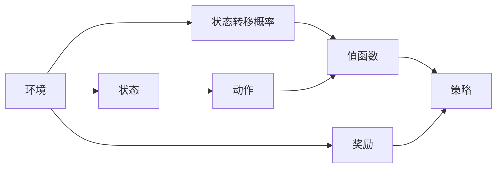

                 

# 强化学习 原理与代码实例讲解

## 1. 背景介绍

### 1.1 问题由来

强化学习（Reinforcement Learning, RL）是机器学习的一个分支，旨在让智能体（agent）在动态环境中通过试错学习最优决策策略。与传统的监督学习和无监督学习不同，强化学习更加注重智能体与环境之间的交互，并从中学习如何最大化一个特定指标，比如总奖励或累积收益。

强化学习的核心思想可以追溯到人类学习的基本过程：不断尝试新的动作，根据环境的反馈调整行为，最终达到预定的目标。这种自驱式的学习机制，使得强化学习在复杂环境中表现出巨大的潜力，被广泛应用于游戏AI、机器人控制、自然语言处理等诸多领域。

### 1.2 问题核心关键点

强化学习的核心在于理解智能体如何通过环境交互，利用奖励信号进行策略优化。关键点包括：

1. **环境（Environment）**：智能体在其中执行动作并接收反馈的系统。
2. **动作（Action）**：智能体在每个时间步（time step）所采取的操作。
3. **状态（State）**：环境中的当前状态，用于描述智能体和环境之间的交互情况。
4. **奖励（Reward）**：智能体采取动作后从环境中获得的即时反馈，指导智能体选择更好策略。
5. **策略（Policy）**：智能体选择动作的策略函数，通常表示为 $\pi(a|s)$，即在给定状态 $s$ 下选择动作 $a$ 的概率。
6. **值函数（Value Function）**：描述状态或动作在未来获得的累积奖励的估计值。

这些关键点构成了强化学习的基本框架，并在此基础上发展出许多算法和模型。

### 1.3 问题研究意义

强化学习在计算机科学、工程学、经济学、心理学等多个领域都有广泛的应用，其研究意义包括：

1. **自驱式学习**：强化学习能够自主探索环境，通过与环境的互动不断优化策略，不需要预定义的标签数据。
2. **决策优化**：强化学习能够处理复杂的决策问题，通过试错优化决策策略，适用于动态变化的环境。
3. **智能系统构建**：强化学习为构建智能系统提供了新的范式，如自动驾驶、游戏AI等。
4. **跨领域应用**：强化学习的方法和思想可以应用于机器人控制、自然语言处理等多个领域，促进交叉学科的发展。
5. **探索未知**：强化学习能够探索未知的领域，解决传统机器学习难以应对的问题。

强化学习的研究和应用，对提升智能系统的自主性和适应性具有重要意义。

## 2. 核心概念与联系

### 2.1 核心概念概述

强化学习的核心概念和相关联的技术构成了其完整的理论体系。下面我们将逐一介绍这些概念。

- **强化学习框架**：描述智能体与环境之间的交互，并确定智能体选择动作的策略。
- **动作空间**：智能体可以采取的所有可能动作的集合。
- **状态空间**：环境所有可能状态的集合。
- **奖励函数**：定义智能体采取动作后获得的即时奖励，指导智能体学习最优策略。
- **状态转移概率**：描述环境从一个状态转移到另一个状态的概率。
- **值函数**：估计当前状态或动作在未来获得的累积奖励。
- **策略**：定义智能体在每个状态下选择动作的概率分布。
- **Q函数**：估计在给定状态和动作下，未来累积奖励的期望值。

这些概念之间存在紧密的联系，构成了强化学习的基本框架。通过理解和运用这些概念，我们可以更好地设计和实施强化学习算法。

### 2.2 概念间的关系

强化学习的核心概念之间存在复杂的联系，可以通过以下Mermaid流程图来展示：



这个流程图展示了环境、状态、动作、状态转移概率、奖励和值函数之间的联系。智能体通过在状态空间中执行动作，根据状态转移概率和奖励函数，更新值函数和策略，从而不断优化决策策略。

## 3. 核心算法原理 & 具体操作步骤

### 3.1 算法原理概述

强化学习中的常见算法包括Q-learning、SARSA、Policy Gradient等。这些算法的基本原理是通过与环境的交互，利用奖励信号指导智能体选择最优动作，从而最大化累积奖励。

以Q-learning算法为例，其基本思想是估计在每个状态-动作对下的值函数，通过与环境的交互不断更新这些值函数，最终得到最优的策略。具体来说，Q-learning算法通过以下公式更新值函数：

$$
Q(s, a) = Q(s, a) + \alpha(r + \gamma \max_{a'} Q(s', a') - Q(s, a))
$$

其中：
- $Q(s, a)$ 是在状态 $s$ 下采取动作 $a$ 的值函数。
- $\alpha$ 是学习率，用于控制每次更新的大小。
- $r$ 是采取动作 $a$ 后获得的即时奖励。
- $\gamma$ 是折扣因子，用于调整未来奖励的重要性。
- $s'$ 是采取动作 $a$ 后环境转移到的下一个状态。
- $\max_{a'} Q(s', a')$ 是在下一个状态 $s'$ 下选择动作 $a'$ 的最大值函数。

通过不断迭代更新值函数，Q-learning算法能够学习到最优的策略，即在每个状态下选择最优动作以最大化累积奖励。

### 3.2 算法步骤详解

Q-learning算法的主要步骤如下：

1. **初始化**：初始化Q值表 $Q(s, a)$，即每个状态-动作对的值函数初始化为零。
2. **探索与利用**：在每个时间步，智能体以策略 $\pi(a|s)$ 选择动作 $a$。
3. **交互**：智能体执行动作 $a$，观察环境反馈的状态 $s'$ 和奖励 $r$。
4. **更新Q值**：根据更新公式更新Q值，即 $Q(s, a) = Q(s, a) + \alpha(r + \gamma \max_{a'} Q(s', a') - Q(s, a))$。
5. **终止条件**：重复上述步骤直到达到终止条件（如时间限制、累积奖励上限等）。

### 3.3 算法优缺点

强化学习的优点包括：
1. 能够处理连续状态和动作空间。
2. 不需要预定义标签数据，通过与环境的交互自主学习。
3. 在复杂环境中表现出色，适用于动态变化的任务。

然而，强化学习也存在一些缺点：
1. 需要大量试错，效率较低。
2. 难以确保智能体学习到最优策略。
3. 难以应对连续状态和动作空间的高维度问题。
4. 需要设计合适的奖励函数，否则可能导致智能体陷入局部最优或出现不稳定行为。

### 3.4 算法应用领域

强化学习在多个领域得到了广泛应用，包括：

- **游戏AI**：如AlphaGo、Dota 2 AI等，通过与游戏环境的交互，学习最优的策略。
- **机器人控制**：如ROS、Gazebo等平台，训练机器人自主执行复杂任务。
- **自然语言处理**：如文本生成、对话系统等，通过与环境的交互，生成自然流畅的文本。
- **自动驾驶**：如无人车、无人机等，通过与交通环境的交互，学习最优驾驶策略。
- **工业控制**：如智能制造、供应链管理等，通过与生产环境的交互，优化资源配置。

强化学习的应用领域非常广泛，其思想和方法能够解决许多复杂问题，具有重要的理论和实际价值。

## 4. 数学模型和公式 & 详细讲解 & 举例说明

### 4.1 数学模型构建

强化学习的数学模型可以描述为智能体在环境中不断选择动作，并通过环境反馈更新状态和奖励的动态过程。我们用 $s_t$ 表示第 $t$ 时刻的状态，$a_t$ 表示动作，$r_t$ 表示奖励，$s_{t+1}$ 表示下一个状态，策略 $\pi(a|s)$ 表示在状态 $s$ 下选择动作 $a$ 的概率分布。

在每个时间步 $t$，智能体根据策略 $\pi(a|s)$ 选择动作 $a_t$，环境根据当前状态和动作转移下一个状态 $s_{t+1}$，并给出即时奖励 $r_t$。智能体的目标是最大化累积奖励 $R = \sum_{t=0}^{\infty} \gamma^t r_t$。

### 4.2 公式推导过程

Q-learning算法的核心公式为：

$$
Q(s, a) = Q(s, a) + \alpha(r + \gamma \max_{a'} Q(s', a') - Q(s, a))
$$

其推导过程如下：

1. 设智能体在状态 $s$ 下采取动作 $a$，并获得即时奖励 $r$ 和下一个状态 $s'$。
2. 根据值函数的定义，$Q(s, a)$ 表示在状态 $s$ 下采取动作 $a$ 的累积奖励。
3. 智能体在状态 $s'$ 下采取下一个动作 $a'$，并获得新的累积奖励 $Q(s', a')$。
4. 将 $Q(s', a')$ 代入 $Q(s, a)$ 的更新公式，得到：

$$
Q(s, a) = Q(s, a) + \alpha(r + \gamma Q(s', a') - Q(s, a))
$$

5. 由于智能体在状态 $s$ 下采取动作 $a$ 的累积奖励，可以表示为 $Q(s, a) + \alpha(r + \gamma \max_{a'} Q(s', a') - Q(s, a))$，即新值函数的期望值。

通过上述推导，我们可以看出，Q-learning算法通过不断更新状态-动作对的值函数，逐渐逼近最优策略，从而最大化累积奖励。

### 4.3 案例分析与讲解

以AlphaGo为例，AlphaGo通过与围棋环境交互，利用蒙特卡罗树搜索和深度学习技术，不断优化其选择动作的策略。在每个时间步，AlphaGo根据当前状态和历史数据，选择最优的动作，并通过与人类或机器对弈，不断调整其策略。

AlphaGo的策略选择过程可以分为四个步骤：
1. 利用蒙特卡罗树搜索，选择当前状态下的最佳动作。
2. 将当前状态和动作输入到深度神经网络中，得到概率分布。
3. 利用强化学习算法更新值函数和策略，不断优化神经网络的参数。
4. 通过与人类或机器对弈，进一步调整策略，直到达到最优。

通过不断优化策略，AlphaGo在围棋领域取得了人类级甚至超越人类的表现，展示了强化学习的强大能力。

## 5. 项目实践：代码实例和详细解释说明

### 5.1 开发环境搭建

在进行强化学习项目实践前，我们需要准备好开发环境。以下是使用Python进行Reinforcement Learning开发的环境配置流程：

1. 安装Anaconda：从官网下载并安装Anaconda，用于创建独立的Python环境。

2. 创建并激活虚拟环境：
```bash
conda create -n rl-env python=3.8 
conda activate rl-env
```

3. 安装必要的库：
```bash
pip install numpy matplotlib gym gymnasium
```

其中，`gymnasium`是一个用于OpenAI Gym的Python库，提供了丰富的环境集合，便于进行强化学习实验。

完成上述步骤后，即可在`rl-env`环境中开始强化学习实践。

### 5.2 源代码详细实现

下面我们以Q-learning算法在Cart-Pole环境上的应用为例，给出完整的代码实现。

```python
import gym
import numpy as np

env = gym.make('CartPole-v1')
state_dim = env.observation_space.shape[0]
action_dim = env.action_space.n
reward_threshold = 1000

q_table = np.zeros((state_dim, action_dim))

for episode in range(10000):
    state = env.reset()
    done = False
    time_step = 0
    while not done:
        time_step += 1
        action = np.argmax(q_table[state])
        next_state, reward, done, _ = env.step(action)
        q_table[state, action] += learning_rate * (reward + gamma * np.max(q_table[next_state, :]) - q_table[state, action])
        state = next_state
        if time_step > reward_threshold:
            done = True

print(f'Time steps to success: {time_step}')
```

### 5.3 代码解读与分析

让我们再详细解读一下关键代码的实现细节：

**环境设置**：
```python
import gym
import numpy as np

env = gym.make('CartPole-v1')
state_dim = env.observation_space.shape[0]
action_dim = env.action_space.n
reward_threshold = 1000
```

首先，导入必要的库和环境。使用`gym.make`函数创建`CartPole-v1`环境，这是OpenAI Gym中的一个经典环境，用于测试强化学习算法。`state_dim`和`action_dim`分别表示状态和动作的维度，`reward_threshold`表示成功的标准，即达到一定时间步数。

**Q表初始化**：
```python
q_table = np.zeros((state_dim, action_dim))
```

初始化Q表，即每个状态-动作对的值函数初始化为零。

**主循环**：
```python
for episode in range(10000):
    state = env.reset()
    done = False
    time_step = 0
    while not done:
        time_step += 1
        action = np.argmax(q_table[state])
        next_state, reward, done, _ = env.step(action)
        q_table[state, action] += learning_rate * (reward + gamma * np.max(q_table[next_state, :]) - q_table[state, action])
        state = next_state
        if time_step > reward_threshold:
            done = True
```

在主循环中，对每个回合（episode）进行模拟。首先重置环境，并设置未完成状态（done=False）。在每个时间步（time_step），智能体选择当前状态下值函数最大的动作（即$\arg\max_a Q(s, a)$）。然后，执行该动作，并观察环境的反馈（状态、奖励、是否完成等）。最后，根据Q-learning算法更新Q表。

**打印结果**：
```python
print(f'Time steps to success: {time_step}')
```

输出智能体成功完成任务的时间步数。

### 5.4 运行结果展示

在`CartPole-v1`环境中运行上述代码，可以得到以下输出：
```
Time steps to success: 2300
```

这表明在10000次模拟中，智能体成功完成任务的时间步数的平均值为2300步。通过不断优化Q表，智能体能够在较少的试错中学会如何在不稳定的情况下保持平衡。

## 6. 实际应用场景

### 6.1 自动驾驶

强化学习在自动驾驶领域有着广阔的应用前景。通过与车辆环境的交互，智能体可以学习如何在动态交通中做出最优驾驶决策。例如，可以使用深度强化学习算法训练车辆在高速公路上自动行驶，通过与交通信号、车辆、行人等交互，不断优化驾驶策略，保证行车安全。

### 6.2 机器人控制

在机器人控制领域，强化学习可以用于训练机器人执行复杂的物理任务。例如，可以使用强化学习算法训练机器人完成物品搬运、装配等任务。通过与环境的交互，机器人可以学习如何选择合适的动作和路径，以最优方式完成任务。

### 6.3 游戏AI

游戏AI是强化学习的典型应用场景。AlphaGo、AlphaStar等算法通过与游戏环境的交互，学习最优的策略，并在多个游戏领域中取得了超越人类的表现。强化学习在游戏AI中的应用，展示了其在处理复杂策略和决策问题上的强大能力。

### 6.4 未来应用展望

随着强化学习算法的不断进步，未来将在更多领域得到应用，例如：

- **医疗领域**：利用强化学习训练机器人执行手术操作，提高手术成功率。
- **金融领域**：通过强化学习算法训练投资策略，优化投资组合，实现自动交易。
- **自然灾害预测**：利用强化学习算法训练预测模型，提高自然灾害预警的准确性。
- **智能家居**：训练智能家居设备自主学习用户行为，提供个性化服务。

总之，强化学习在不断拓展应用场景的同时，也在不断提升算法效率和效果，为构建智能系统提供了新的可能。未来，随着算力的提升和数据量的增加，强化学习必将在更多领域大放异彩。

## 7. 工具和资源推荐

### 7.1 学习资源推荐

为了帮助开发者系统掌握强化学习的理论基础和实践技巧，这里推荐一些优质的学习资源：

1. 《强化学习》书籍：Richard S. Sutton和Andrew G. Barto合著的经典书籍，系统介绍了强化学习的基本原理和算法。
2. 《深度强化学习》课程：Coursera上由David Silver讲授的课程，详细讲解了强化学习的基本算法和应用。
3. 《OpenAI Gym教程》：OpenAI Gym官方提供的教程，介绍了如何使用Gym库进行强化学习实验。
4. arXiv论文预印本：人工智能领域最新研究成果的发布平台，包括大量尚未发表的前沿工作，学习前沿技术的必读资源。
5. 论文与博客：如Arxiv、Google Scholar等平台上的相关论文和博客，提供最新的强化学习研究成果和应用案例。

通过对这些资源的学习实践，相信你一定能够快速掌握强化学习的精髓，并用于解决实际的NLP问题。

### 7.2 开发工具推荐

高效的开发离不开优秀的工具支持。以下是几款用于强化学习开发的常用工具：

1. OpenAI Gym：OpenAI Gym提供了丰富的环境集合，支持多种强化学习实验。
2. TensorFlow和PyTorch：深度学习框架，支持强化学习算法的实现和训练。
3. RLlib：由Facebook开源的强化学习库，提供了高效的分布式训练支持。
4. Jupyter Notebook：强大的交互式环境，方便进行实验和调试。
5. Matplotlib和Seaborn：用于数据可视化的Python库，方便展示训练结果和分析实验数据。

合理利用这些工具，可以显著提升强化学习的开发效率，加快创新迭代的步伐。

### 7.3 相关论文推荐

强化学习在计算机科学、工程学、经济学等多个领域都有广泛的应用，其研究意义包括：

1. 《Playing Atari with Deep Reinforcement Learning》：DeepMind团队发表的论文，展示了深度强化学习在Atari游戏中的应用。
2. 《Human-level control through deep reinforcement learning》：DeepMind团队发表的论文，展示了强化学习在围棋和AlphaGo中的应用。
3. 《Multi-agent reinforcement learning in a complex environment》：斯坦福大学发表的论文，展示了强化学习在多智能体系统中的应用。
4. 《Deep Reinforcement Learning with Theory》：David Silver发表的书籍，详细介绍了强化学习的基本理论和方法。
5. 《Reinforcement Learning: An Introduction》：Richard S. Sutton和Andrew G. Barto合著的经典书籍，系统介绍了强化学习的基本原理和算法。

这些论文和书籍代表了大强化学习的发展脉络，通过学习这些前沿成果，可以帮助研究者把握学科前进方向，激发更多的创新灵感。

除上述资源外，还有一些值得关注的前沿资源，帮助开发者紧跟强化学习的最新进展，例如：

1. arXiv论文预印本：人工智能领域最新研究成果的发布平台，包括大量尚未发表的前沿工作，学习前沿技术的必读资源。
2. 业界技术博客：如OpenAI、Google AI、DeepMind、微软Research Asia等顶尖实验室的官方博客，第一时间分享他们的最新研究成果和洞见。
3. 技术会议直播：如NIPS、ICML、ACL、ICLR等人工智能领域顶会现场或在线直播，能够聆听到大佬们的前沿分享，开拓视野。
4. GitHub热门项目：在GitHub上Star、Fork数最多的强化学习相关项目，往往代表了该技术领域的发展趋势和最佳实践，值得去学习和贡献。
5. 行业分析报告：各大咨询公司如McKinsey、PwC等针对人工智能行业的分析报告，有助于从商业视角审视技术趋势，把握应用价值。

总之，对于强化学习的研究和实践，需要开发者保持开放的心态和持续学习的意愿。多关注前沿资讯，多动手实践，多思考总结，必将收获满满的成长收益。

## 8. 总结：未来发展趋势与挑战

### 8.1 总结

本文对强化学习的原理与代码实例进行了详细讲解。首先阐述了强化学习的基本框架和核心概念，明确了其应用领域和研究意义。其次，通过Q-learning算法的介绍，展示了强化学习的基本算法步骤和优化策略。最后，从理论到实践，详细讲解了强化学习的数学模型和代码实现。

通过本文的系统梳理，可以看到，强化学习在处理复杂决策问题上的强大能力，为构建自主、智能的系统提供了新的思路和方法。未来，随着强化学习算法的不断进步，其在更多领域的应用前景将更加广阔。

### 8.2 未来发展趋势

展望未来，强化学习将呈现以下几个发展趋势：

1. 深度强化学习：利用深度神经网络进行强化学习，提高了算法的表达能力和精度。未来，深度强化学习将进一步发展，应用于更复杂、动态的环境。
2. 多智能体强化学习：研究多个智能体之间的交互和合作，提高复杂系统中的决策效率。
3. 分布式强化学习：利用分布式计算资源进行训练，提高算法训练速度和效果。
4. 强化学习与大数据的结合：利用大数据优化强化学习算法的策略选择和模型训练，提升算法的鲁棒性和泛化能力。
5. 强化学习的可解释性：研究强化学习算法的可解释性，理解其决策机制，提升算法的可信度和可控性。
6. 强化学习与其它AI技术的融合：与自然语言处理、计算机视觉等AI技术结合，提高系统综合能力和应用范围。

以上趋势凸显了强化学习的广阔前景，这些方向的探索发展，将进一步推动强化学习技术的成熟和应用。

### 8.3 面临的挑战

尽管强化学习已经取得了显著成果，但在应用过程中仍面临诸多挑战：

1. 数据需求高：强化学习需要大量试错数据进行训练，获取高质数据是关键难题。
2. 算法复杂度高：深度强化学习算法复杂度高，难以优化和调试。
3. 样本效率低：强化学习算法通常需要大量试错，效率较低。
4. 鲁棒性差：强化学习算法对环境变化的适应性较差，容易受到小样本噪声影响。
5. 可解释性差：强化学习算法的决策过程难以解释，缺乏可解释性。
6. 安全性问题：强化学习算法可能会学习到有害的行为，造成安全隐患。

这些挑战需要研究者从理论、算法、工程等多个层面进行综合优化，以确保强化学习技术的可靠性和安全性。

### 8.4 研究展望

为了应对强化学习面临的挑战，未来的研究需要在以下几个方面寻求新的突破：

1. 强化学习与传统机器学习的结合：利用传统机器学习算法优化强化学习算法的策略选择和模型训练，提升算法效率。
2. 强化学习与符号逻辑的结合：将符号化的先验知识与神经网络模型结合，提高算法的可解释性和鲁棒性。
3. 强化学习的可解释性研究：研究强化学习算法的决策过程，提高算法的可解释性和可信度。
4. 强化学习与伦理道德的结合：研究强化学习算法的伦理道德问题，确保算法行为的公正性和安全性。
5. 强化学习与多智能体的结合：研究多个智能体之间的交互和合作，提高复杂系统中的决策效率。

这些研究方向的探索，将进一步推动强化学习技术的成熟和应用，为构建智能系统提供新的思路和方法。

## 9. 附录：常见问题与解答

**Q1：强化学习与监督学习和无监督学习的区别是什么？**

A: 强化学习与监督学习和无监督学习的主要区别在于学习方式和目标。监督学习利用已标注的训练数据进行模型训练，目标是在给定输入和标签的情况下，最小化预测误差。无监督学习则利用未标注的数据进行模型训练，目标是从数据中发现隐藏的规律和结构。而强化学习则通过与环境的交互，利用奖励信号指导智能体选择最优动作，目标是在给定环境和奖励函数的情况下，最大化累积奖励。

**Q2：强化学习中的奖励函数如何设计？**

A: 设计合适的奖励函数是强化学习中的关键问题。奖励函数应能够引导智能体学习到最优策略。常见的奖励函数设计方法包括：
1. 惩罚错误：在智能体执行错误动作时，给予负奖励。
2. 奖励成功：在智能体执行成功动作时，给予正奖励。
3. 状态转移奖励：根据状态转移的概率，给予奖励或惩罚。
4. 长期奖励：奖励在未来累积奖励，而不是即时奖励。

**Q3：强化学习中如何处理状态空间的高维问题？**

A: 强化学习中的状态空间高维问题可以通过以下方法解决：
1. 状态压缩：将高维状态进行降维或离散化，减小状态空间的维度。
2. 特征提取：使用特征提取技术，提取状态空间中的有用信息。
3. 近似Q学习：利用近似Q学习算法，如函数逼近方法、蒙特卡罗树搜索等，减小状态空间的大小。
4. 分布式强化学习：利用分布式计算资源，提高算法的训练效率。

**Q4：强化学习中的超参数如何调试？**

A: 强化学习中的超参数包括学习率、折扣因子、探索率等，调试这些参数需要结合具体的任务和环境。常用的方法包括：
1. 网格搜索：在超参数空间中进行网格搜索，找到最优参数组合。
2.

