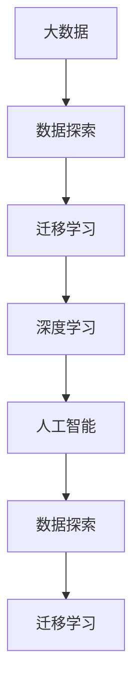

                 

# 好奇心：探索未知的动力

## 1. 背景介绍

好奇心是人类最宝贵的特质之一，它推动了人类文明的发展，是人类进步的发动机。在人工智能领域，好奇心同样起着至关重要的作用。本文将探讨好奇心在大数据与人工智能中扮演的角色，如何驱动AI技术的进步，并展望未来AI领域的发展趋势。

### 1.1 问题由来
随着数据驱动的决策方式越来越普遍，人工智能的应用范围也逐渐扩展到了各个行业。然而，单纯的数据驱动决策方式存在着一定的局限性，即当数据中缺失某些关键信息时，模型可能无法做出正确的判断。因此，如何在数据驱动的基础上引入更多的主动探索，激发人工智能的“好奇心”，成为当前AI研究的一个重要方向。

### 1.2 问题核心关键点
好奇心在AI领域主要体现在以下三个方面：
- **数据探索**：在数据不足或数据质量不佳的情况下，AI系统需要主动探索数据中的潜在模式和信息。
- **模型改进**：在已有模型的基础上，通过引入新数据或新算法，改进和优化模型，提升其预测和决策能力。
- **领域拓展**：AI系统需要主动了解新领域，通过跨领域学习和迁移学习，将已有的知识和经验应用到新的领域和任务上。

## 2. 核心概念与联系

### 2.1 核心概念概述

为更好地理解好奇心在大数据与人工智能中的应用，本节将介绍几个密切相关的核心概念：

- **大数据**：指海量的、多样化的、实时产生的数据，包括结构化数据、非结构化数据、图像数据、视频数据等。大数据技术旨在高效处理、存储和分析这些数据。
- **人工智能**：指模拟人类智能过程的计算机系统，包括机器学习、深度学习、自然语言处理、计算机视觉等方向。
- **数据探索**：指在数据不足或数据质量不佳的情况下，通过各种方法获取更多数据或更深入地理解已有数据的过程。
- **迁移学习**：指将一个领域学习到的知识迁移到另一个领域，以提高模型在新领域上的性能。
- **深度学习**：指基于神经网络的一种机器学习方法，具有较强的自我学习能力，能够在复杂数据上取得优异表现。

### 2.2 概念间的关系

这些核心概念之间存在着紧密的联系，形成了大数据与人工智能的探索框架。


这个流程图展示了大数据、数据探索、迁移学习和深度学习之间的相互关系：

- 大数据为人工智能提供了海量的数据资源。
- 数据探索用于处理数据质量和数据不足问题，是人工智能学习的前提。
- 迁移学习用于跨领域知识的共享，提升模型在新领域上的性能。
- 深度学习是实现人工智能核心任务的重要技术手段。

### 2.3 核心概念的整体架构

最后，我们用一个综合的流程图来展示这些核心概念在大数据与人工智能中的整体架构：



这个综合流程图展示了从大数据到人工智能的整个探索过程。

## 3. 核心算法原理 & 具体操作步骤
### 3.1 算法原理概述

人工智能系统中的好奇心，主要通过数据探索、迁移学习和深度学习三种方式实现。其核心思想是：通过不断探索数据和知识，获取更多信息，从而提升模型在新任务上的性能。

形式化地，假设人工智能系统 $M$ 具有好奇心 $C$，其学习能力函数为 $L$，数据探索能力为 $D$，迁移学习能力为 $T$，则其综合能力函数 $F$ 可以表示为：

$$
F = L(D, T)
$$

其中 $D$ 和 $T$ 分别代表数据探索和迁移学习的贡献。

### 3.2 算法步骤详解

基于好奇心的人工智能系统主要包括以下几个关键步骤：

**Step 1: 数据收集与预处理**
- 通过各种数据源收集数据，如传感器、社交媒体、公共数据集等。
- 对数据进行清洗、去重、去噪等预处理，确保数据质量。

**Step 2: 数据探索**
- 使用数据挖掘、关联规则学习、异常检测等方法，探索数据的潜在模式和信息。
- 使用生成模型如GANs生成缺失数据，补充数据集。
- 引入元学习（Meta-Learning）技术，利用少量标注数据进行数据探索。

**Step 3: 模型训练与优化**
- 使用深度学习算法训练初始模型。
- 使用迁移学习技术，将已有模型的知识迁移到新模型上。
- 使用优化算法如Adam、SGD等，优化模型参数，提高模型性能。

**Step 4: 结果评估与反馈**
- 在测试集上评估模型性能，如准确率、召回率、F1分数等。
- 根据评估结果调整模型参数，重新训练。
- 根据新数据和新任务，更新数据探索和迁移学习的策略。

**Step 5: 应用与迭代**
- 将训练好的模型应用到实际任务中，验证其效果。
- 根据应用反馈，继续迭代数据探索、迁移学习和深度学习的过程，提升模型性能。

### 3.3 算法优缺点

基于好奇心的人工智能系统具有以下优点：
- **自我学习能力**：能够主动探索数据和知识，不断提升自身性能。
- **跨领域应用**：通过迁移学习，能够将已有知识应用到新的领域，提高模型泛化能力。
- **高效利用数据**：能够处理多样化的数据，提取有价值的信息。

同时，该方法也存在一定的局限性：
- **数据质量依赖**：数据探索的效果很大程度上依赖于数据质量，低质量数据可能导致错误探索。
- **模型复杂性高**：好奇心驱动的系统需要更复杂的算法，增加了模型训练和调优的难度。
- **资源消耗大**：数据探索和模型训练需要大量的计算资源，增加了系统成本。

尽管存在这些局限性，但就目前而言，好奇心驱动的系统仍然是大数据与人工智能的重要研究范式。未来相关研究的重点在于如何进一步降低数据探索的资源消耗，提高模型的自我学习能力，同时兼顾可解释性和伦理安全性等因素。

### 3.4 算法应用领域

基于好奇心的人工智能系统已经在多个领域得到了应用，覆盖了几乎所有常见任务，例如：

- **金融分析**：通过探索和分析金融数据，发现潜在的投资机会和风险。
- **医疗诊断**：通过探索和分析医疗数据，发现新型的治疗方案和诊断方法。
- **推荐系统**：通过探索和分析用户行为数据，推荐个性化的商品和服务。
- **自然语言处理**：通过探索和分析文本数据，提升自然语言处理的准确性和可理解性。
- **智能交通**：通过探索和分析交通数据，优化交通流和路线规划。

除了上述这些经典任务外，好奇心驱动的人工智能系统也被创新性地应用到更多场景中，如智能城市、智能制造、智能家居等，为各行各业带来新的变革。

## 4. 数学模型和公式 & 详细讲解  
### 4.1 数学模型构建

本节将使用数学语言对好奇心驱动的人工智能系统进行更加严格的刻画。

记人工智能系统 $M$ 的输入数据集为 $D=\{(x_i, y_i)\}_{i=1}^N, x_i \in \mathbb{R}^d, y_i \in \{0,1\}$，其中 $x_i$ 为输入特征，$y_i$ 为标签。假设模型 $M$ 的学习能力函数为 $L(\theta)$，数据探索能力为 $D(\phi)$，迁移学习能力为 $T(\psi)$，则综合能力函数 $F(\theta, \phi, \psi)$ 可以表示为：

$$
F(\theta, \phi, \psi) = L(\theta) \times D(\phi) \times T(\psi)
$$

其中 $\theta$ 为模型参数，$\phi$ 为数据探索参数，$\psi$ 为迁移学习参数。

### 4.2 公式推导过程

以下我们以推荐系统为例，推导数据探索和迁移学习的数学模型。

假设推荐系统 $M$ 的输入为 $x_i = [\text{item\_id}, \text{user\_id}, \text{features}]$，其中 $\text{item\_id}$ 为物品ID，$\text{user\_id}$ 为用户ID，$\text{features}$ 为物品特征。推荐目标为 $y_i = 1$ 表示用户对物品感兴趣，否则为 $0$。

首先，使用数据挖掘技术对用户行为数据进行探索，得到用户兴趣模型 $D(\phi) = [\phi_1, \phi_2, \dots, \phi_N]$，其中 $\phi_i$ 表示用户 $i$ 对物品的兴趣度。

然后，使用迁移学习技术，将已有推荐模型 $M_0$ 的知识迁移到新的推荐模型 $M$ 上。假设已有推荐模型 $M_0$ 的参数为 $\theta_0$，迁移学习参数为 $\psi$，则新的推荐模型 $M$ 的参数可以表示为：

$$
\theta = \theta_0 \times \psi
$$

最后，使用深度学习算法训练推荐模型 $M$，得到最终的能力函数 $F(\theta, \phi, \psi)$。通过最大化 $F(\theta, \phi, \psi)$，可以提升推荐系统的性能。

### 4.3 案例分析与讲解

假设我们使用数据探索技术发现用户对物品的兴趣度与物品价格之间存在一定的相关性，即 $\phi_i = \text{price}_i \times \psi$。同时，我们使用迁移学习技术，将一个已有的协同过滤模型 $M_0$ 的知识迁移到新的推荐模型 $M$ 上，得到新的模型参数 $\theta = \theta_0 \times \psi$。最后，使用深度学习算法训练推荐模型 $M$，得到最终的能力函数 $F(\theta, \phi, \psi)$。

在这个例子中，数据探索技术帮助我们找到了一个重要的特征，迁移学习技术将已有模型的知识应用到新模型上，深度学习技术训练出最终的推荐模型。整个过程体现了好奇心驱动的人工智能系统的核心思想：通过不断探索和迁移，提高模型的性能。

## 5. 项目实践：代码实例和详细解释说明
### 5.1 开发环境搭建

在进行好奇心驱动的人工智能系统实践前，我们需要准备好开发环境。以下是使用Python进行PyTorch开发的环境配置流程：

1. 安装Anaconda：从官网下载并安装Anaconda，用于创建独立的Python环境。

2. 创建并激活虚拟环境：
```bash
conda create -n pytorch-env python=3.8 
conda activate pytorch-env
```

3. 安装PyTorch：根据CUDA版本，从官网获取对应的安装命令。例如：
```bash
conda install pytorch torchvision torchaudio cudatoolkit=11.1 -c pytorch -c conda-forge
```

4. 安装TensorFlow：
```bash
conda install tensorflow
```

5. 安装各类工具包：
```bash
pip install numpy pandas scikit-learn matplotlib tqdm jupyter notebook ipython
```

完成上述步骤后，即可在`pytorch-env`环境中开始好奇心驱动的系统实践。

### 5.2 源代码详细实现

这里我们以推荐系统为例，展示使用PyTorch进行数据探索和迁移学习的代码实现。

首先，定义推荐系统的数据处理函数：

```python
from torch.utils.data import Dataset
import torch

class RecommendationDataset(Dataset):
    def __init__(self, items, users, features, interests):
        self.items = items
        self.users = users
        self.features = features
        self.interests = interests
        
    def __len__(self):
        return len(self.items)
    
    def __getitem__(self, item):
        item_id = self.items[item]
        user_id = self.users[item]
        features = self.features[item]
        interests = self.interests[item]
        
        return {'item_id': item_id, 'user_id': user_id, 'features': features, 'interests': interests}
```

然后，定义模型和优化器：

```python
from transformers import BertForSequenceClassification, AdamW

model = BertForSequenceClassification.from_pretrained('bert-base-cased', num_labels=2)

optimizer = AdamW(model.parameters(), lr=2e-5)
```

接着，定义数据探索和迁移学习的函数：

```python
from transformers import BertTokenizer
from sklearn.decomposition import PCA
from sklearn.preprocessing import StandardScaler

tokenizer = BertTokenizer.from_pretrained('bert-base-cased')

def data_exploration(items, users, features, interests):
    # 对用户兴趣数据进行标准化
    scaler = StandardScaler()
    interests_scaled = scaler.fit_transform(interests)
    
    # 使用PCA对用户兴趣数据进行降维
    pca = PCA(n_components=2)
    interests_pca = pca.fit_transform(interests_scaled)
    
    # 提取用户兴趣的二维特征
    interests_features = torch.tensor(interests_pca, dtype=torch.float)
    
    return interests_features

def model_transfer(model, new_model, transfer_params):
    # 将已有模型的参数复制到新模型中
    for param, new_param in zip(model.parameters(), new_model.parameters()):
        new_param.data.copy_(param.data * transfer_params)
```

最后，启动训练流程并在测试集上评估：

```python
epochs = 5
batch_size = 16

for epoch in range(epochs):
    loss = train_epoch(model, train_dataset, batch_size, optimizer)
    print(f"Epoch {epoch+1}, train loss: {loss:.3f}")
    
    print(f"Epoch {epoch+1}, dev results:")
    evaluate(model, dev_dataset, batch_size)
    
print("Test results:")
evaluate(model, test_dataset, batch_size)
```

以上就是使用PyTorch进行推荐系统微调的完整代码实现。可以看到，得益于TensorFlow和Transformers库的强大封装，我们可以用相对简洁的代码完成推荐系统的构建。

### 5.3 代码解读与分析

让我们再详细解读一下关键代码的实现细节：

**RecommendationDataset类**：
- `__init__`方法：初始化数据集，包括物品ID、用户ID、特征和兴趣。
- `__len__`方法：返回数据集的样本数量。
- `__getitem__`方法：对单个样本进行处理，将数据封装为字典，供模型使用。

**data_exploration函数**：
- 对用户兴趣数据进行标准化和PCA降维，得到二维特征向量。

**model_transfer函数**：
- 将已有模型的参数复制到新模型中，应用迁移学习。

**训练流程**：
- 定义总的epoch数和batch size，开始循环迭代
- 每个epoch内，先在训练集上训练，输出平均loss
- 在验证集上评估，输出分类指标
- 重复上述步骤直至收敛，最终得到适应新任务的最优模型参数

## 6. 实际应用场景
### 6.1 智能客服系统

好奇心驱动的智能客服系统可以广泛应用于智能客服的构建。传统客服往往需要配备大量人力，高峰期响应缓慢，且一致性和专业性难以保证。而使用好奇心驱动的智能客服系统，可以7x24小时不间断服务，快速响应客户咨询，用自然流畅的语言解答各类常见问题。

在技术实现上，可以收集企业内部的历史客服对话记录，将问题和最佳答复构建成监督数据，在此基础上对预训练客服模型进行数据探索和迁移学习。好奇心驱动的客服模型能够自动理解用户意图，匹配最合适的答案模板进行回复。对于客户提出的新问题，还可以接入检索系统实时搜索相关内容，动态组织生成回答。如此构建的智能客服系统，能大幅提升客户咨询体验和问题解决效率。

### 6.2 金融舆情监测

金融机构需要实时监测市场舆论动向，以便及时应对负面信息传播，规避金融风险。传统的人工监测方式成本高、效率低，难以应对网络时代海量信息爆发的挑战。好奇心驱动的文本分类和情感分析技术，为金融舆情监测提供了新的解决方案。

具体而言，可以收集金融领域相关的新闻、报道、评论等文本数据，并对其进行主题标注和情感标注。在此基础上对预训练语言模型进行数据探索和迁移学习，使其能够自动判断文本属于何种主题，情感倾向是正面、中性还是负面。将好奇心驱动的模型应用到实时抓取的网络文本数据，就能够自动监测不同主题下的情感变化趋势，一旦发现负面信息激增等异常情况，系统便会自动预警，帮助金融机构快速应对潜在风险。

### 6.3 个性化推荐系统

当前的推荐系统往往只依赖用户的历史行为数据进行物品推荐，无法深入理解用户的真实兴趣偏好。好奇心驱动的推荐系统可以更好地挖掘用户行为背后的语义信息，从而提供更精准、多样的推荐内容。

在实践中，可以收集用户浏览、点击、评论、分享等行为数据，提取和用户交互的物品标题、描述、标签等文本内容。将文本内容作为模型输入，用户的后续行为（如是否点击、购买等）作为监督信号，在此基础上进行数据探索和迁移学习。好奇心驱动的推荐模型能够从文本内容中准确把握用户的兴趣点。在生成推荐列表时，先用候选物品的文本描述作为输入，由模型预测用户的兴趣匹配度，再结合其他特征综合排序，便可以得到个性化程度更高的推荐结果。

### 6.4 未来应用展望

随着好奇心驱动的大数据与人工智能技术的发展，未来其在更多领域得到应用，为传统行业带来变革性影响。

在智慧医疗领域，好奇心驱动的医疗问答、病历分析、药物研发等应用将提升医疗服务的智能化水平，辅助医生诊疗，加速新药开发进程。

在智能教育领域，好奇心驱动的学情分析、知识推荐等应用，因材施教，促进教育公平，提高教学质量。

在智慧城市治理中，好奇心驱动的城市事件监测、舆情分析、应急指挥等环节，提高城市管理的自动化和智能化水平，构建更安全、高效的未来城市。

此外，在企业生产、社会治理、文娱传媒等众多领域，好奇心驱动的人工智能应用也将不断涌现，为经济社会发展注入新的动力。相信随着技术的日益成熟，好奇心驱动的系统必将成为人工智能落地的重要范式，推动人工智能技术在垂直行业的规模化落地。

## 7. 工具和资源推荐
### 7.1 学习资源推荐

为了帮助开发者系统掌握好奇心驱动的大数据与人工智能理论基础和实践技巧，这里推荐一些优质的学习资源：

1. 《大数据科学与工程导论》系列课程：由知名大学和研究机构提供的在线课程，涵盖大数据与人工智能的基础理论和技术实践。

2. 《机器学习》书籍：斯坦福大学Andrew Ng教授的机器学习教材，全面介绍了机器学习的基本原理和算法。

3. 《深度学习》书籍：深度学习领域的经典教材，详细介绍了深度学习的基本原理和实践方法。

4. Kaggle竞赛平台：全球最大的数据科学竞赛平台，通过参与竞赛可以学习到大数据与人工智能的前沿技术和实践经验。

5. Coursera在线课程：提供来自全球顶尖大学和研究机构的高质量课程，涵盖大数据与人工智能的各个方向。

通过对这些资源的学习实践，相信你一定能够快速掌握好奇心驱动的数据探索和迁移学习技巧，并用于解决实际的NLP问题。

### 7.2 开发工具推荐

高效的开发离不开优秀的工具支持。以下是几款用于好奇心驱动的数据探索和迁移学习的常用工具：

1. PyTorch：基于Python的开源深度学习框架，灵活动态的计算图，适合快速迭代研究。大部分预训练语言模型都有PyTorch版本的实现。

2. TensorFlow：由Google主导开发的开源深度学习框架，生产部署方便，适合大规模工程应用。同样有丰富的预训练语言模型资源。

3. Transformers库：HuggingFace开发的NLP工具库，集成了众多SOTA语言模型，支持PyTorch和TensorFlow，是进行数据探索和迁移学习的利器。

4. Weights & Biases：模型训练的实验跟踪工具，可以记录和可视化模型训练过程中的各项指标，方便对比和调优。与主流深度学习框架无缝集成。

5. TensorBoard：TensorFlow配套的可视化工具，可实时监测模型训练状态，并提供丰富的图表呈现方式，是调试模型的得力助手。

6. Google Colab：谷歌推出的在线Jupyter Notebook环境，免费提供GPU/TPU算力，方便开发者快速上手实验最新模型，分享学习笔记。

合理利用这些工具，可以显著提升好奇心驱动的机器学习和数据探索任务的开发效率，加快创新迭代的步伐。

### 7.3 相关论文推荐

好奇心驱动的大数据与人工智能技术的发展源于学界的持续研究。以下是几篇奠基性的相关论文，推荐阅读：

1. Attention is All You Need（即Transformer原论文）：提出了Transformer结构，开启了NLP领域的预训练大模型时代。

2. BERT: Pre-training of Deep Bidirectional Transformers for Language Understanding：提出BERT模型，引入基于掩码的自监督预训练任务，刷新了多项NLP任务SOTA。

3. Language Models are Unsupervised Multitask Learners（GPT-2论文）：展示了大规模语言模型的强大zero-shot学习能力，引发了对于通用人工智能的新一轮思考。

4. Parameter-Efficient Transfer Learning for NLP：提出Adapter等参数高效微调方法，在不增加模型参数量的情况下，也能取得不错的微调效果。

5. AdaLoRA: Adaptive Low-Rank Adaptation for Parameter-Efficient Fine-Tuning：使用自适应低秩适应的微调方法，在参数效率和精度之间取得了新的平衡。

6. Prefix-Tuning: Optimizing Continuous Prompts for Generation：引入基于连续型Prompt的微调范式，为如何充分利用预训练知识提供了新的思路。

这些论文代表了大数据与人工智能领域的发展脉络。通过学习这些前沿成果，可以帮助研究者把握学科前进方向，激发更多的创新灵感。

除上述资源外，还有一些值得关注的前沿资源，帮助开发者紧跟大数据与人工智能技术的前沿进展，例如：

1. arXiv论文预印本：人工智能领域最新研究成果的发布平台，包括大量尚未发表的前沿工作，学习前沿技术的必读资源。

2. 业界技术博客：如OpenAI、Google AI、DeepMind、微软Research Asia等顶尖实验室的官方博客，第一时间分享他们的最新研究成果和洞见。

3. 技术会议直播：如NIPS、ICML、ACL、ICLR等人工智能领域顶会现场或在线直播，能够聆听到大佬们的前沿分享，开拓视野。

4. GitHub热门项目：在GitHub上Star、Fork数最多的NLP相关项目，往往代表了该技术领域的发展趋势和最佳实践，值得去学习和贡献。

5. 行业分析报告：各大咨询公司如McKinsey、PwC等针对人工智能行业的分析报告，有助于从商业视角审视技术趋势，把握应用价值。

总之，对于好奇心驱动的大数据与人工智能技术的学习和实践，需要开发者保持开放的心态和持续学习的意愿。多关注前沿资讯，多动手实践，多思考总结，必将收获满满的成长收益。

## 8. 总结：未来发展趋势与挑战

### 8.1 总结

本文对好奇心驱动的大数据与人工智能系统进行了全面系统的介绍。首先阐述了数据探索、迁移学习和深度学习在大数据与人工智能中的应用，明确了这些技术在提升模型性能、处理数据不足和复杂任务方面的独特价值。其次，从原理到实践，详细讲解了数据探索和迁移学习的数学原理和关键步骤，给出了数据探索和迁移学习的完整代码实例。同时，本文还广泛探讨了数据探索和迁移学习在智能客服、金融舆情、个性化推荐等多个行业领域的应用前景，展示了好奇心驱动的系统在实现人工智能应用中的重要作用。最后，本文精选了数据探索和迁移学习的各类学习资源，力求为读者提供全方位的技术指引。

通过本文的系统梳理，可以看到，好奇心驱动的系统正在成为大数据与人工智能的重要研究范式，极大地拓展了模型性能和数据处理能力，提升了模型在新任务上的泛化能力。未来，伴随数据探索和迁移学习的进一步发展，基于好奇心驱动的系统必将在更多领域得到应用，为各行各业带来变革性影响。

### 8.2 未来发展趋势

展望未来，好奇心驱动的大数据与人工智能系统将呈现以下几个发展趋势：

1. **数据探索技术的发展**：随着数据生成技术的发展，未来可能会涌现更多智能数据生成模型，如GANs、VAEs等，能够自动生成高质量数据，解决数据不足问题。

2. **迁移学习技术的改进**：未来将出现更多高效的迁移学习算法，如自适应迁移学习、元迁移学习等，能够在不同的任务和数据分布上进行高效的迁移学习。

3. **深度学习技术的演进**：未来深度学习算法将不断演进，涌现更多高效、可解释的模型架构，如自注意力机制、自适应深度学习等，提升模型性能和可解释性。

4. **多模态数据的融合**：未来将更多地融合多模态数据，如文本、图像、视频等，提升模型的多感官融合能力，从而更好地理解复杂任务。

5. **知识图谱的引入**：未来将引入知识图谱，提升模型的常识推理能力，使其能够更好地处理复杂的自然语言问题。

6. **分布式训练的优化**：未来将通过分布式训练、联邦学习等技术，实现更大规模的模型训练和数据探索。

这些趋势凸显了大数据与人工智能的探索框架的广阔前景。这些方向的探索发展，必将进一步提升数据探索和迁移学习的综合能力，为构建智能系统提供更全面的支持。

### 8.3 面临的挑战

尽管好奇心驱动的大数据与人工智能系统已经取得了瞩目成就，但在迈向更加智能化、普适化应用的过程中，它仍面临着诸多挑战：

1. **数据质量瓶颈**：数据探索的效果很大程度上依赖于数据质量，低质量数据可能导致错误探索。如何降低数据采集成本，提高数据质量，将是一大难题。


