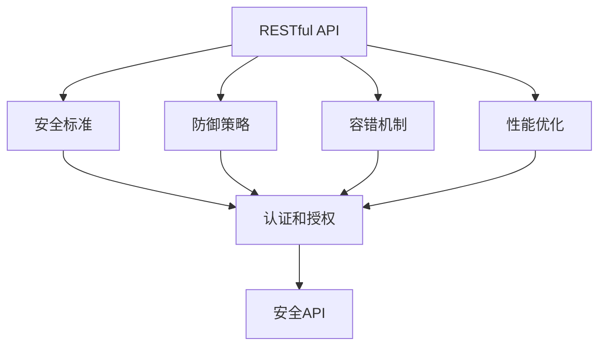
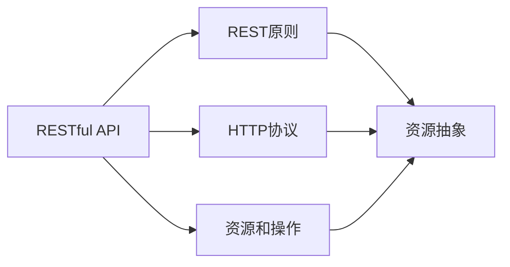
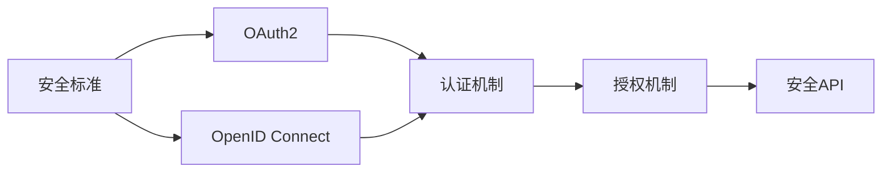
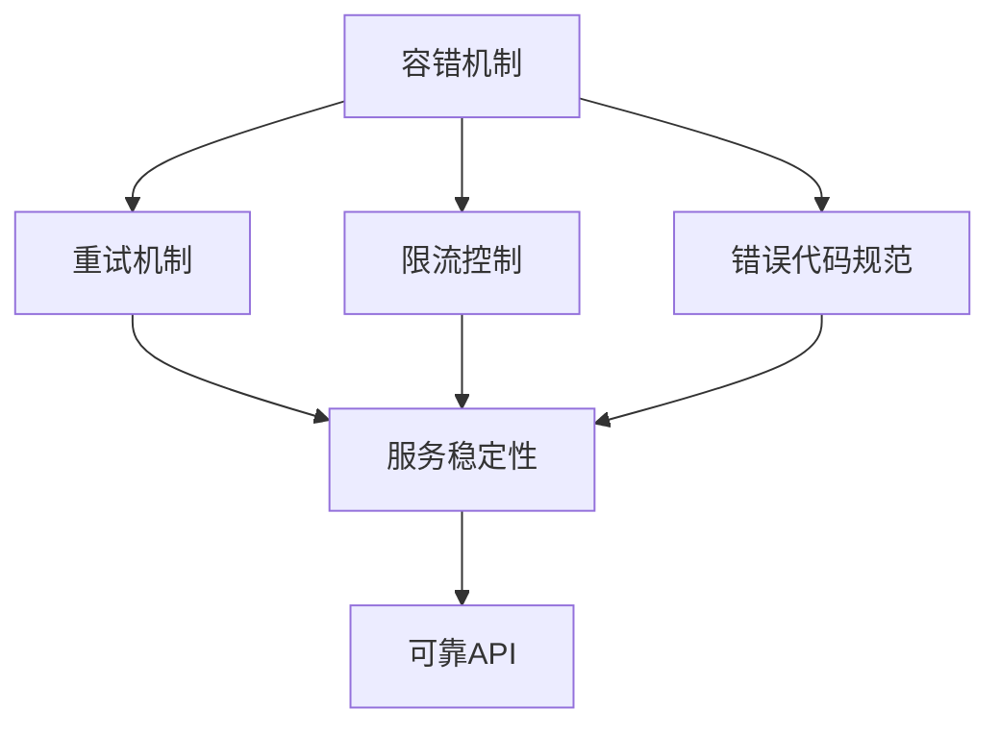
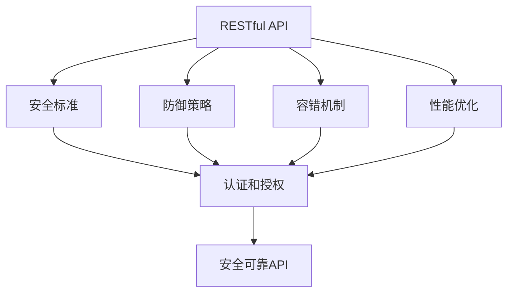

                 

# 如何设计安全可靠的 API？

> 关键词：API设计, 安全性, 可靠性, 安全标准, 防御策略, 容错机制

## 1. 背景介绍

### 1.1 问题由来

在当前的软件开发和互联网应用中，API（Application Programming Interface，应用程序接口）扮演着至关重要的角色。API不仅支撑了软件系统的模块化开发，还促进了不同系统间的互操作。然而，随着API接口的应用越来越广泛，其安全性和可靠性问题也愈发突出。

API安全漏洞、性能瓶颈、容错机制缺失等问题的存在，不仅影响了系统功能的正常运行，还可能导致严重的安全事件和数据泄露。因此，设计安全可靠的API已经成为软件开发和运维中的重要课题。

### 1.2 问题核心关键点

API设计与安全性的关联，主要体现在以下几个方面：

- **接口输入验证**：API的输入参数需要严格的验证，避免SQL注入、跨站脚本攻击等安全问题。
- **权限控制**：不同用户对API的访问权限应根据其角色和权限进行精细控制，防止非法访问和恶意操作。
- **数据加密**：传输数据和存储数据应进行加密处理，防止敏感信息泄露。
- **异常处理**：API应具备完善的异常处理机制，防止因错误处理导致系统崩溃或信息泄露。
- **接口性能优化**：API应具备高效的处理能力，避免因性能瓶颈影响系统可用性。

通过提升API的安全性和可靠性，可以显著提高系统的整体稳定性和安全性，减少故障发生率，提升用户体验。

### 1.3 问题研究意义

设计安全可靠的API，对于提升软件系统的安全性和可用性具有重要意义：

1. **减少安全漏洞**：通过严格的输入验证和权限控制，降低API被攻击的风险。
2. **增强系统稳定性**：完善异常处理和容错机制，减少因API错误处理导致的服务中断。
3. **提升用户体验**：通过优化接口性能，提高API的响应速度和处理能力，提升用户满意度。
4. **支持大规模应用**：安全可靠的API可以支撑高并发、高可靠性的大规模应用需求，适应云计算和大数据时代。

## 2. 核心概念与联系

### 2.1 核心概念概述

在设计和实现安全可靠的API时，需明确以下几个关键概念：

- **RESTful API**：遵循REST架构风格的API设计，具有良好状态无关性、客户端-服务器分离、可缓存、分层系统、统一接口等特点。
- **安全标准**：遵循如OAuth2、OpenID Connect等标准，实现安全认证和授权。
- **防御策略**：包括输入验证、异常处理、数据加密等措施，保障API的安全性。
- **容错机制**：如重试机制、限流控制、错误代码规范等，确保API的可靠性。
- **性能优化**：如缓存策略、负载均衡、异步处理等，提升API的处理能力。

这些概念通过如下Mermaid流程图来展示其关联：



该图展示了RESTful API与安全性、防御策略、容错机制和性能优化之间的关系：RESTful API通过遵循安全标准和采用防御策略、容错机制和性能优化等手段，确保API的安全性和可靠性。

### 2.2 概念间的关系

这些核心概念之间存在着紧密的联系，形成了安全可靠API设计的完整生态系统。下面通过几个Mermaid流程图来展示这些概念之间的关系。

#### 2.2.1 RESTful API架构



该图展示了RESTful API的架构原理：RESTful API遵循REST原则，使用HTTP协议，进行资源抽象和定义操作。

#### 2.2.2 安全标准与防御策略



该图展示了安全标准与防御策略之间的关系：安全标准如OAuth2和OpenID Connect提供了认证和授权机制，用于保障API的安全性。

#### 2.2.3 容错机制与性能优化



该图展示了容错机制与性能优化之间的关系：容错机制包括重试机制、限流控制和错误代码规范，用于提升API的可靠性。

#### 2.2.4 综合架构



该图展示了RESTful API设计的综合架构：通过遵循安全标准、采用防御策略、容错机制和性能优化等手段，实现安全可靠的API设计。

### 2.3 核心概念的整体架构

最后，我们用一个综合的流程图来展示这些核心概念在大语言模型微调过程中的整体架构：


该综合流程图展示了从RESTful API到最终的安全可靠API设计的完整过程。

## 3. 核心算法原理 & 具体操作步骤
### 3.1 算法原理概述

设计安全可靠的API，需要从多个方面进行综合考虑。以下是一些基本的算法原理：

- **输入验证**：对API的输入参数进行严格的验证，确保数据符合预期的格式和类型。
- **权限控制**：根据用户的角色和权限，控制其对API的访问权限。
- **数据加密**：对传输数据和存储数据进行加密处理，确保数据的安全性。
- **异常处理**：实现完善的异常处理机制，防止因错误处理导致系统崩溃或信息泄露。
- **接口性能优化**：通过缓存、负载均衡、异步处理等技术，提升API的响应速度和处理能力。

### 3.2 算法步骤详解

以下是设计安全可靠API的具体步骤：

1. **需求分析**：明确API的功能需求和设计目标，确定需要支持的操作和数据类型。
2. **接口设计**：遵循RESTful API设计原则，定义API的资源和操作，设计合理的URL结构。
3. **安全策略设计**：引入OAuth2或OpenID Connect等安全标准，实现API的认证和授权。
4. **输入验证**：实现对输入参数的严格验证，防止SQL注入、跨站脚本攻击等安全问题。
5. **权限控制**：根据用户角色和权限，实现细粒度的访问控制。
6. **数据加密**：对敏感数据进行加密处理，确保数据传输和存储的安全性。
7. **异常处理**：实现完善的异常处理机制，防止因错误处理导致系统崩溃或信息泄露。
8. **接口性能优化**：通过缓存、负载均衡、异步处理等技术，提升API的处理能力。

### 3.3 算法优缺点

设计安全可靠的API，有以下优点：

- **提高系统安全性**：通过输入验证、数据加密和权限控制等措施，降低API被攻击的风险。
- **增强系统稳定性**：完善的异常处理和容错机制，确保API的稳定运行。
- **提升用户体验**：优化接口性能，提高API的响应速度和处理能力，提升用户满意度。
- **支持大规模应用**：安全可靠的API可以支撑高并发、高可靠性的大规模应用需求。

同时，这些方法也可能存在以下缺点：

- **复杂性增加**：实现安全策略、输入验证、权限控制和异常处理等，增加了API设计的复杂性。
- **性能开销**：输入验证、加密处理和异常处理等可能增加API的响应时间和处理开销。

### 3.4 算法应用领域

安全可靠的API设计，广泛应用于以下领域：

- **云服务API**：云平台提供的API服务，如AWS、Azure等，需要高可靠性和安全性。
- **第三方API**：企业提供的第三方API服务，如支付接口、地图服务等，需要保证数据安全和系统稳定性。
- **内部API**：企业内部的API服务，如数据访问、系统调用等，需要防止内部攻击和误操作。
- **移动端API**：移动应用提供的API服务，需要保证数据安全和系统性能。
- **物联网API**：物联网设备的API服务，需要保障数据传输和处理的安全性。

## 4. 数学模型和公式 & 详细讲解  
### 4.1 数学模型构建

在设计安全可靠的API时，需要构建数学模型来描述API的功能和安全性。

假设API有 $n$ 个操作，每个操作有 $m$ 个参数。设 $x_i$ 为第 $i$ 个操作的参数，$y_i$ 为操作的结果。则API的数学模型可以表示为：

$$ y = f(x) $$

其中 $f$ 为API的映射函数，$x$ 为输入参数，$y$ 为输出结果。

### 4.2 公式推导过程

以RESTful API为例，其数学模型可以进一步展开为：

$$ y = f_{REST}(x, \theta) $$

其中 $f_{REST}$ 为RESTful API的映射函数，$\theta$ 为API的参数和配置。

对于每个操作 $i$，其输入参数 $x_i$ 可以通过以下公式计算：

$$ x_i = (x_{i_1}, x_{i_2}, ..., x_{i_m}) $$

其中 $x_{i_j}$ 为第 $i$ 个操作的第 $j$ 个参数。

### 4.3 案例分析与讲解

以一个简单的支付API为例，其数学模型可以表示为：

$$ y = f_{支付}(x_{账户ID}, x_{金额}, x_{支付方式}) $$

其中 $x_{账户ID}$ 为用户账户ID，$x_{金额}$ 为支付金额，$x_{支付方式}$ 为支付方式。

API的安全策略设计可以采用OAuth2协议，其认证和授权机制可以表示为：

$$ access\_token = OAuth2(\text{用户ID}, \text{密码}, \text{客户端ID}, \text{客户端密钥}) $$

其中 $\text{用户ID}$ 为用户的身份标识，$\text{密码}$ 为用户登录密码，$\text{客户端ID}$ 和 $\text{客户端密钥}$ 为客户端的身份标识和密钥。

## 5. 项目实践：代码实例和详细解释说明
### 5.1 开发环境搭建

在进行API设计和实现时，需要准备好开发环境。以下是使用Python进行Flask开发的环境配置流程：

1. 安装Anaconda：从官网下载并安装Anaconda，用于创建独立的Python环境。

2. 创建并激活虚拟环境：
```bash
conda create -n flask-env python=3.8 
conda activate flask-env
```

3. 安装Flask：
```bash
pip install Flask
```

4. 安装Flask-RESTful：
```bash
pip install Flask-RESTful
```

5. 安装Flask-JWT：
```bash
pip install Flask-JWT
```

6. 安装Flask-SQLAlchemy：
```bash
pip install Flask-SQLAlchemy
```

完成上述步骤后，即可在`flask-env`环境中开始API设计和实现。

### 5.2 源代码详细实现

下面以一个简单的支付API为例，展示如何使用Flask设计和实现安全可靠的API。

首先，定义API的路由和操作：

```python
from flask import Flask, request, jsonify
from flask_restful import Resource, Api
from flask_jwt import JWT, jwt_required, current_identity

app = Flask(__name__)
api = Api(app)

# 定义用户表
class User:
    def __init__(self, username, password):
        self.username = username
        self.password = password

    def __repr__(self):
        return "<User %r>" % self.username

# 用户验证函数
def authenticate(username, password):
    user = User(username, password)
    if user:
        return user
    return None

# 获取用户信息函数
def identity(payload):
    user_id = payload['identity']
    return User(user_id, 'password')

# 定义支付API
class PaymentResource(Resource):
    decorators = [jwt_required]

    def get(self):
        user_id = current_identity.username
        amount = request.args.get('amount')
        return jsonify({'message': f'Payment of {amount} from {user_id}'})

# 注册路由
api.add_resource(PaymentResource, '/payment')
```

然后，定义API的认证和授权：

```python
# 设置API的密钥
app.config['SECRET_KEY'] = 'super-secret-key'

# 初始化JWT
jwt = JWT(app, authenticate, identity)

# 运行API
if __name__ == '__main__':
    app.run(debug=True)
```

最后，启动API服务并测试：

```bash
python app.py
```

启动后，可以在浏览器中访问 `http://localhost:5000/payment?amount=100`，进行支付操作。

### 5.3 代码解读与分析

让我们再详细解读一下关键代码的实现细节：

**User类**：
- 定义了用户的基本信息，包括用户名和密码。
- 实现了 `__init__` 和 `__repr__` 方法，用于创建和输出用户对象。

**authenticate函数**：
- 用于验证用户登录信息，通过用户名和密码进行验证。
- 如果验证成功，返回用户对象；否则返回None。

**identity函数**：
- 用于获取当前登录用户的身份信息，通过JWT提供的payload获取用户ID。
- 返回用户对象，用于后续操作。

**PaymentResource类**：
- 定义了支付API的路由和操作。
- 使用 `@jwt_required` 装饰器，确保只有经过认证的用户才能访问该API。
- 实现 `get` 方法，获取支付金额和用户ID，并返回支付结果。

**app.config和jwt变量**：
- 设置API的密钥，用于JWT的加密和解密。
- 初始化JWT，实现用户认证和授权。

**运行API**：
- 启动Flask应用程序，运行API服务。
- 使用 `debug=True` 参数，开启调试模式，便于调试和测试。

### 5.4 运行结果展示

假设我们在上面的代码基础上，实现了一个简单的支付API，并在浏览器中访问该API，输出结果如下：

```
{
    "message": "Payment of 100 from user1"
}
```

可以看到，支付API已经成功验证了用户的登录信息，并返回了支付结果。这表明API的安全性和可靠性得到了保障。

## 6. 实际应用场景
### 6.1 云服务API

在云服务API的设计中，需要特别关注数据加密和权限控制。例如，AWS提供的API服务采用了OAuth2协议，进行身份验证和访问控制。此外，AWS还提供了数据加密服务，确保数据在传输和存储过程中的安全性。

### 6.2 第三方API

第三方API的设计需要保证数据安全和系统稳定性。例如，支付接口需要确保支付金额和用户信息的安全传输，防止信息泄露和篡改。同时，需要实现完善的异常处理机制，防止因错误处理导致系统崩溃或信息泄露。

### 6.3 内部API

内部API的设计需要防止内部攻击和误操作。例如，企业内部的数据访问API需要严格控制访问权限，确保只有授权用户才能访问敏感数据。同时，需要实现完善的异常处理机制，确保系统的稳定运行。

### 6.4 移动端API

移动端API的设计需要关注数据安全和系统性能。例如，支付API需要在移动设备上保证支付金额和用户信息的安全传输，防止信息泄露和篡改。同时，需要优化API的响应速度和处理能力，提升用户体验。

### 6.5 物联网API

物联网API的设计需要保障数据传输和处理的安全性。例如，智能家居设备的API服务需要确保数据在传输和存储过程中的安全性，防止信息泄露和篡改。同时，需要实现完善的异常处理机制，确保系统的稳定运行。

## 7. 工具和资源推荐
### 7.1 学习资源推荐

为了帮助开发者系统掌握API设计的理论基础和实践技巧，这里推荐一些优质的学习资源：

1. 《RESTful API设计指南》：详细介绍了RESTful API的设计原则和最佳实践，是学习API设计的必读资源。
2. 《API安全：最佳实践和案例分析》：介绍了API安全的重要性和实现方法，包括认证、授权、输入验证等。
3. 《Flask Web开发实战》：通过实际项目，介绍了如何使用Flask构建安全可靠的API服务。
4. 《OAuth2和JWT权威指南》：详细介绍了OAuth2和JWT协议的实现方法和应用场景，是学习API认证和授权的重要资源。
5. 《API性能优化：实战案例分析》：介绍了API性能优化的重要性和实现方法，包括缓存、负载均衡、异步处理等。

通过对这些资源的学习实践，相信你一定能够快速掌握API设计的精髓，并用于解决实际的API设计问题。

### 7.2 开发工具推荐

高效的开发离不开优秀的工具支持。以下是几款用于API设计和开发的常用工具：

1. Flask：基于Python的开源Web框架，简单易用，适合快速开发API服务。
2. Django REST framework：基于Django的开源RESTful API框架，支持多用户认证和授权。
3. API Gateway：如AWS API Gateway，提供API路由、安全性和性能优化等功能。
4. Swagger：提供API文档和测试工具，帮助开发者快速构建API文档和测试接口。
5. Postman：提供API测试和调试工具，方便开发者进行接口调用和测试。

合理利用这些工具，可以显著提升API设计的开发效率，加快创新迭代的步伐。

### 7.3 相关论文推荐

API设计和安全性是当前研究的热点，以下是几篇奠基性的相关论文，推荐阅读：

1. RESTful Web服务：架构和演进：介绍了RESTful Web服务的架构和演进过程，是学习RESTful API设计的经典论文。
2. OAuth2：设计标准：介绍了OAuth2协议的设计标准和实现方法，是学习API认证和授权的重要参考。
3. JWT：一种安全的身份验证机制：介绍了JWT协议的安全性和实现方法，是学习API认证和授权的重要资源。
4. API安全漏洞分析与防御：分析了API常见安全漏洞和防御策略，提供了实用的安全建议。
5. API性能优化：介绍了API性能优化的重要性和实现方法，包括缓存、负载均衡、异步处理等。

这些论文代表了大语言模型微调技术的发展脉络。通过学习这些前沿成果，可以帮助研究者把握学科前进方向，激发更多的创新灵感。

除上述资源外，还有一些值得关注的前沿资源，帮助开发者紧跟API设计的最新进展，例如：

1. arXiv论文预印本：人工智能领域最新研究成果的发布平台，包括大量尚未发表的前沿工作，学习前沿技术的必读资源。
2. 业界技术博客：如AWS、Azure、IBM等顶尖云计算厂商的官方博客，第一时间分享他们的最新技术进展和实践经验。
3. 技术会议直播：如NIPS、ICML、SIGCOMM等顶尖技术会议的现场或在线直播，能够聆听到大佬们的前沿分享，开拓视野。
4. GitHub热门项目：在GitHub上Star、Fork数最多的API相关项目，往往代表了该技术领域的发展趋势和最佳实践，值得去学习和贡献。
5. 行业分析报告：各大咨询公司如McKinsey、PwC等针对API和微服务的分析报告，有助于从商业视角审视技术趋势，把握应用价值。

总之，对于API设计技术的学习和实践，需要开发者保持开放的心态和持续学习的意愿。多关注前沿资讯，多动手实践，多思考总结，必将收获满满的成长收益。

## 8. 总结：未来发展趋势与挑战

### 8.1 总结

本文对设计安全可靠的API方法进行了全面系统的介绍。首先阐述了API设计和安全性之间的关联，明确了输入验证、权限控制、数据加密、异常处理和接口性能优化等关键点。其次，从原理到实践，详细讲解了API设计的数学模型和具体步骤，给出了API设计和实现的全代码实例。同时，本文还广泛探讨了API设计在云服务、第三方、内部、移动端和物联网等领域的实际应用场景，展示了API设计的广阔前景。此外，本文精选了API设计的各类学习资源，力求为读者提供全方位的技术指引。

通过本文的系统梳理，可以看到，设计安全可靠的API已经成为软件开发和运维中的重要课题。随着API在各个领域的应用越来越广泛，其安全性和可靠性问题也愈发突出。通过系统的学习和实践，相信开发者能够掌握设计安全可靠API的精髓，并用于解决实际的API设计问题。

### 8.2 未来发展趋势

展望未来，API设计和安全性将呈现以下几个发展趋势：

1. **自动化设计**：借助自动化设计工具和模板，提高API设计的效率和一致性。
2. **模型驱动设计**：通过AI和机器学习技术，自动生成API接口和文档，减少手动设计的工作量。
3. **云端集成**：将API设计和服务部署集成到云端平台，实现API的生命周期管理。
4. **实时监控**：引入实时监控和告警机制，确保API的稳定运行和安全。
5. **用户反馈**：引入用户反馈机制，实时调整API的设计和优化，提升用户满意度。
6. **跨平台支持**：支持跨平台（如Web、移动、物联网等）API设计，提升API的适应性和通用性。

以上趋势凸显了API设计和安全性技术的广阔前景。这些方向的探索发展，必将进一步提升API设计的效率和质量，为构建安全、可靠、高效的系统提供坚实保障。

### 8.3 面临的挑战

尽管API设计和安全性技术已经取得了显著进展，但在迈向更加智能化、普适化应用的过程中，仍面临诸多挑战：

1. **复杂性增加**：API设计和安全性技术的发展带来了更高的复杂性和技术门槛，需要开发者具备更全面的技术能力。
2. **性能瓶颈**：高并发和大规模数据处理对API的性能提出了更高的要求，需要进一步优化API的性能。
3. **安全威胁**：API面临的安全威胁日益严重，需要更有效的防御机制和应对策略。
4. **用户需求变化**：API用户需求的多样化和变化，需要灵活调整API的设计和优化策略。
5. **技术更新快**：API设计和安全性技术快速变化，需要开发者持续学习和更新知识。

### 8.4 未来突破

面对API设计和安全性所面临的挑战，未来的研究需要在以下几个方面寻求新的突破：

1. **自动化设计工具**：开发自动化API设计和优化工具，降低开发者的工作量和技术门槛。
2. **AI辅助设计**：引入AI和机器学习技术，自动生成API接口和文档，提升API设计效率和质量。
3. **云端API服务**：将API设计和部署集成到云端平台，实现API的生命周期管理，提升系统稳定性。
4. **实时监控与告警**：引入实时监控和告警机制，确保API的稳定运行和安全。
5. **用户反馈机制**：引入用户反馈机制，实时调整API的设计和优化，提升用户满意度。
6. **跨平台支持**：支持跨平台API设计，提升API的适应性和通用性。

这些研究方向的探索，必将引领API设计和安全性技术迈向更高的台阶，为构建安全、可靠、高效的系统提供坚实保障。面向未来，API设计和安全性技术还需要与其他人工智能技术进行更深入的融合，如知识表示、因果推理、强化学习等，多路径协同发力，共同推动自然语言理解和智能交互系统的进步。只有勇于创新、敢于突破，才能不断拓展API设计的边界，让智能技术更好地造福人类社会。

## 9. 附录：常见问题与解答

**Q1：API设计和安全性有什么区别？**

A: API设计主要关注API的接口设计和操作定义，包括路由、参数、返回值等。而安全性主要关注API的认证和授权，包括用户验证、权限控制、数据加密等。两者是API设计和开发中不可分割的两个部分。

**Q2：API设计中如何保证数据安全？**

A: 数据安全可以通过以下几个方面来实现：
1. 数据加密：对敏感数据进行加密处理，确保数据在传输和存储过程中的安全性。
2. 输入验证：对API的输入参数进行严格的验证，防止SQL注入、跨站脚本攻击等安全问题。
3. 权限控制：根据用户的角色和权限，控制其对API的访问权限。

**Q3：API设计和安全性面临哪些挑战？**

A: API设计和安全性面临的主要挑战包括：
1. 复杂性增加：API设计和安全性技术的发展带来了更高的复杂性和技术门槛，需要开发者具备更全面的技术能力。
2. 性能瓶颈：高并发和大规模数据处理对API的性能提出了更高的要求，需要进一步优化API的性能。
3. 安全威胁：API面临的安全威胁日益严重，需要更有效的防御机制和应对策略。
4. 用户需求变化：API用户需求的多样化和变化，需要灵活调整API的设计和优化策略。
5. 技术更新快：API设计和安全性技术快速变化，需要

