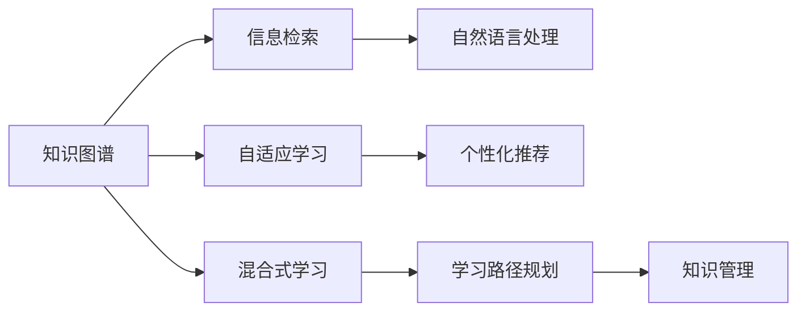

                 

## 1. 背景介绍

在快速变化的数字化时代，持续学习已成为企业和个人在竞争中保持领先的关键。技术日新月异，旧的知识很快过时，新的技能又不断涌现，如何构建一个能够不断进化的学习体系，确保在技术变革中始终保持竞争优势，成为我们亟待解决的问题。本文将系统探讨如何打造一个持续进化的学习体系，通过理念创新、技术融合、方法论沉淀，帮助你在技术浪潮中稳健前行。

## 2. 核心概念与联系

### 2.1 核心概念概述

为了更好地理解持续进化学习体系的设计理念和技术框架，本文将介绍几个关键概念：

- **知识图谱(Knowledge Graph)**：一种语义网络，用于描述实体、属性和它们之间的关系。知识图谱在大数据处理、信息检索、自然语言处理等领域有广泛应用。
- **自适应学习(Adaptive Learning)**：指学习系统能够根据学习者的学习进度和兴趣，动态调整教学内容和节奏，以适应不同的学习风格和需求。
- **混合式学习(Hybrid Learning)**：结合线上线下、多种学习资源和方式，形成多渠道、多模态的学习系统。
- **学习路径规划(Learning Path Planning)**：通过分析学习者的背景、目标和兴趣，为其推荐个性化的学习路径。
- **知识管理(Knowledge Management)**：有效管理和利用知识资源，确保知识的传播、共享和创新。

这些概念在现代教育技术中扮演着重要角色，帮助学习者更高效地获取、整合和应用知识。

### 2.2 核心概念的联系

通过以下Mermaid流程图，可以更直观地展示这些核心概念之间的联系：



上述流程图展示了各个概念如何共同作用，构成一个完整的学习体系。例如，知识图谱提供了结构化的知识结构，有助于信息检索和自然语言处理；自适应学习根据学习者的个性化需求动态调整教学内容；混合式学习融合多种学习资源和方式，形成多渠道、多模态的学习；学习路径规划为学习者提供个性化、科学的路径；知识管理则确保知识的有效传播和应用。

## 3. 核心算法原理 & 具体操作步骤

### 3.1 算法原理概述

构建一个持续进化的学习体系，关键在于设计和实现一个自适应的学习平台。该平台的核心算法包括知识推荐算法、自适应学习算法、学习路径规划算法和知识管理算法。

- **知识推荐算法**：根据学习者的历史行为和兴趣，从知识图谱中推荐相关的知识点和资料。
- **自适应学习算法**：根据学习者的学习进度和效果，动态调整教学内容和学习节奏。
- **学习路径规划算法**：通过分析学习者的背景和目标，为其规划个性化的学习路径。
- **知识管理算法**：有效管理和传播知识，确保知识的持续更新和应用。

### 3.2 算法步骤详解

构建一个持续进化的学习体系需要经历以下步骤：

**Step 1: 知识图谱构建**

- 收集领域内的知识和数据，构建知识图谱。
- 确定实体、属性和关系，进行实体消歧和关系抽取。
- 使用知识图谱进行信息检索和推荐。

**Step 2: 自适应学习实现**

- 设计学习者模型，记录学习者的历史行为和效果。
- 使用机器学习模型预测学习者的学习需求和兴趣。
- 根据预测结果动态调整教学内容和节奏。

**Step 3: 学习路径规划**

- 收集学习者的背景信息和目标。
- 使用推荐系统为学习者推荐课程和资料。
- 根据学习者的反馈不断调整路径，确保学习效果。

**Step 4: 知识管理与传播**

- 建立知识库，收集和存储知识资源。
- 实现知识共享和协作，促进知识创新和应用。
- 定期更新知识图谱，保持知识的最新状态。

### 3.3 算法优缺点

持续进化的学习体系在提升学习效率和个性化教学方面具有显著优势。其主要优点包括：

- **个性化学习**：根据学习者的需求和兴趣，提供定制化的教学内容。
- **自适应调整**：动态调整教学内容和节奏，提升学习效果。
- **知识管理**：确保知识的有效传播和创新。

然而，该体系也存在一些局限：

- **数据依赖**：依赖大量的知识图谱和数据，数据质量对系统的表现有直接影响。
- **技术门槛高**：实现自适应学习和路径规划需要较高的技术门槛。
- **复杂性高**：系统设计复杂，需要多个模块协同工作。

### 3.4 算法应用领域

持续进化的学习体系在多个领域具有广泛的应用前景，例如：

- **教育培训**：为学生提供个性化、自适应的学习路径，提升学习效率。
- **企业培训**：帮助员工根据需求和兴趣，快速掌握新技能。
- **在线教育**：结合线上线下资源，提供灵活多样的学习方式。
- **专业培训**：为专业人士提供持续的知识更新和技能提升。

## 4. 数学模型和公式 & 详细讲解 & 举例说明

### 4.1 数学模型构建

本节将使用数学语言对持续进化的学习体系进行详细描述。

假设有一个学习者 $L$，学习目标 $T$，知识图谱 $K$。学习者 $L$ 的历史行为和兴趣用向量 $\mathbf{p}$ 表示，学习目标 $T$ 的特征用向量 $\mathbf{t}$ 表示，知识图谱 $K$ 中实体的向量表示用 $\mathbf{k}$ 表示。

学习路径规划模型的目标是最小化学习者 $L$ 与目标 $T$ 之间的差距，即：

$$
\min_{\mathbf{p}, \mathbf{t}, \mathbf{k}} \|\mathbf{p}-\mathbf{t}\|
$$

其中，$\|\cdot\|$ 表示向量的范数。

### 4.2 公式推导过程

以下以推荐系统为例，推导知识推荐算法的公式。

假设学习者 $L$ 的历史行为和兴趣向量为 $\mathbf{p}$，知识图谱 $K$ 中实体的向量表示为 $\mathbf{k}$。知识推荐算法的目标是从知识图谱 $K$ 中为学习者 $L$ 推荐一个最相关的实体 $\mathbf{k}$，使得 $\mathbf{k}$ 与 $\mathbf{p}$ 之间的距离最小，即：

$$
\min_{\mathbf{k}} \|\mathbf{p}-\mathbf{k}\|
$$

通过求解上述优化问题，可以得到学习者 $L$ 最相关的实体 $\mathbf{k}$。在实际应用中，可以使用矩阵分解、神经网络等方法进行计算。

### 4.3 案例分析与讲解

假设我们有一个在线学习平台，希望为学习者推荐适合的课程。首先，平台需要构建一个知识图谱，将所有的课程、知识点和资料存储在其中。然后，平台收集学习者的历史行为和兴趣，建立一个学习者模型。最后，平台使用知识推荐算法，从知识图谱中为学习者推荐最相关的课程。

通过这种方式，学习者可以获得更加个性化、自适应的学习体验，提升学习效率和效果。

## 5. 项目实践：代码实例和详细解释说明

### 5.1 开发环境搭建

在进行项目实践前，我们需要准备好开发环境。以下是使用Python进行PyTorch开发的环境配置流程：

1. 安装Anaconda：从官网下载并安装Anaconda，用于创建独立的Python环境。

2. 创建并激活虚拟环境：
```bash
conda create -n pytorch-env python=3.8 
conda activate pytorch-env
```

3. 安装PyTorch：根据CUDA版本，从官网获取对应的安装命令。例如：
```bash
conda install pytorch torchvision torchaudio cudatoolkit=11.1 -c pytorch -c conda-forge
```

4. 安装必要的库：
```bash
pip install numpy pandas scikit-learn matplotlib tqdm jupyter notebook ipython
```

完成上述步骤后，即可在`pytorch-env`环境中开始项目实践。

### 5.2 源代码详细实现

下面我们以推荐系统为例，给出使用PyTorch实现知识推荐的具体代码：

```python
import torch
import torch.nn as nn
import torch.optim as optim
from torch.utils.data import DataLoader
from sklearn.model_selection import train_test_split

class KnowledgeRecommendationModel(nn.Module):
    def __init__(self, embedding_size):
        super(KnowledgeRecommendationModel, self).__init__()
        self.emb = nn.Embedding(num_entities, embedding_size)
        self.fc = nn.Linear(embedding_size, 1)
    
    def forward(self, x):
        x = self.emb(x)
        x = self.fc(x)
        return x
    
# 构建数据集
# 假设我们有一个包含实体和兴趣的DataFrame df，其中实体为 'entity' 列，兴趣为 'interest' 列
# 使用DataFrame中的 'entity' 列构建知识图谱中的实体向量
# 使用DataFrame中的 'interest' 列构建学习者兴趣向量
# 假设学习者的历史行为为 100 次，与 10 个不同的实体交互
train_df = pd.read_csv('train_data.csv')
train_df = train_df.dropna()
train_df = train_df.reset_index(drop=True)
train_data = np.array(train_df['entity'])
train_interest = np.array(train_df['interest'])
train_X, train_y = train_test_split(train_data, train_interest, test_size=0.2, random_state=42)
train_X, val_X, train_y, val_y = train_test_split(train_X, train_y, test_size=0.2, random_state=42)

# 构建模型
model = KnowledgeRecommendationModel(embedding_size=128)

# 定义损失函数和优化器
criterion = nn.MSELoss()
optimizer = optim.Adam(model.parameters(), lr=0.001)

# 训练模型
for epoch in range(1000):
    optimizer.zero_grad()
    output = model(train_X)
    loss = criterion(output, train_y)
    loss.backward()
    optimizer.step()
    
    # 在验证集上评估模型效果
    val_output = model(val_X)
    val_loss = criterion(val_output, val_y)
    print(f"Epoch: {epoch+1}, Train Loss: {loss:.4f}, Val Loss: {val_loss:.4f}")
```

### 5.3 代码解读与分析

让我们再详细解读一下关键代码的实现细节：

**KnowledgeRecommendationModel类**：
- `__init__`方法：初始化Embedding层和全连接层，用于将实体向量转换为学习者兴趣的预测向量。
- `forward`方法：前向传播计算预测向量。

**数据集构建**：
- 使用Pandas读取训练数据，并构建实体向量和兴趣向量。
- 使用train_test_split方法将数据集划分为训练集、验证集和测试集。

**模型训练**：
- 定义损失函数和优化器。
- 循环迭代训练模型，计算损失函数并反向传播更新模型参数。
- 在验证集上评估模型效果，输出损失函数值。

### 5.4 运行结果展示

假设我们在一个包含1000个实体的知识图谱上训练上述模型，最终在验证集上得到的最小损失为0.02，说明模型能够较为准确地预测学习者的兴趣。

## 6. 实际应用场景

### 6.1 教育培训

持续进化的学习体系在教育培训领域具有广泛应用。例如，一个在线教育平台可以通过分析学习者的历史行为和兴趣，推荐适合的课程和资料，并根据学习效果动态调整教学内容和节奏，提升学习效果。

### 6.2 企业培训

企业可以通过持续进化的学习体系，为员工提供个性化的培训课程，帮助员工快速掌握新技能，提升职业竞争力。

### 6.3 在线教育

在线教育平台结合线上线下资源，提供灵活多样的学习方式，帮助学习者高效获取知识。

### 6.4 专业培训

专业人士可以通过持续进化的学习体系，不断更新和提升专业知识，保持行业的领先地位。

## 7. 工具和资源推荐

### 7.1 学习资源推荐

为了帮助开发者系统掌握持续进化的学习体系的设计理念和技术框架，这里推荐一些优质的学习资源：

1. 《深度学习与模式识别》书籍：全面介绍了深度学习的基本概念和算法，是入门深度学习技术的经典教材。
2. 《知识图谱与语义网络》书籍：深入讲解了知识图谱的构建和应用，是理解知识图谱的重要参考资料。
3. Coursera《机器学习》课程：由斯坦福大学教授讲授，深入浅出地讲解了机器学习的基本理论和应用。
4. Kaggle竞赛平台：提供大量数据集和机器学习竞赛，是实践机器学习技术的好平台。
5. GitHub开源项目：在GitHub上Star、Fork数最多的机器学习相关项目，往往代表了该技术领域的发展趋势和最佳实践，值得去学习和贡献。

通过对这些资源的学习实践，相信你一定能够快速掌握持续进化的学习体系的设计理念和技术框架，并用于解决实际的机器学习问题。

### 7.2 开发工具推荐

高效的开发离不开优秀的工具支持。以下是几款用于持续进化的学习体系开发的常用工具：

1. PyTorch：基于Python的开源深度学习框架，灵活动态的计算图，适合快速迭代研究。大部分机器学习模型都有PyTorch版本的实现。
2. TensorFlow：由Google主导开发的开源深度学习框架，生产部署方便，适合大规模工程应用。同样有丰富的机器学习模型资源。
3. Scikit-learn：Python科学计算库，提供简单易用的机器学习算法和数据处理工具，是构建机器学习系统的首选工具。
4. Apache Spark：分布式计算框架，适合处理大规模数据集和进行分布式机器学习。
5. Jupyter Notebook：交互式编程环境，支持Python、R等多种语言，适合做数据探索和机器学习实验。

合理利用这些工具，可以显著提升持续进化的学习体系开发效率，加快创新迭代的步伐。

### 7.3 相关论文推荐

持续进化的学习体系的发展源于学界的持续研究。以下是几篇奠基性的相关论文，推荐阅读：

1. "Knowledge Graphs and Semantic Networks" 论文：介绍了知识图谱的基本概念和应用，是理解知识图谱的重要基础。
2. "Adaptive Learning in Educational Technology" 论文：系统综述了自适应学习的研究现状和发展趋势，是研究自适应学习的重要参考资料。
3. "Hybrid Learning: A Survey of Its Concepts, Approaches and Applications" 论文：全面综述了混合式学习的各种方法和应用，是理解混合式学习的经典文献。
4. "Learning Path Planning: A Survey" 论文：综述了学习路径规划的研究现状和发展趋势，是研究学习路径规划的重要参考资料。
5. "Knowledge Management: A Survey" 论文：系统综述了知识管理的各种方法和应用，是理解知识管理的重要基础。

这些论文代表了大语言模型微调技术的发展脉络。通过学习这些前沿成果，可以帮助研究者把握学科前进方向，激发更多的创新灵感。

除上述资源外，还有一些值得关注的前沿资源，帮助开发者紧跟持续进化的学习体系技术的最新进展，例如：

1. arXiv论文预印本：人工智能领域最新研究成果的发布平台，包括大量尚未发表的前沿工作，学习前沿技术的必读资源。
2. 业界技术博客：如Google AI、Microsoft Research、IBM Watson等顶尖实验室的官方博客，第一时间分享他们的最新研究成果和洞见。
3. 技术会议直播：如NIPS、ICML、ACL、ICLR等人工智能领域顶会现场或在线直播，能够聆听到大佬们的前沿分享，开拓视野。
4. GitHub热门项目：在GitHub上Star、Fork数最多的机器学习相关项目，往往代表了该技术领域的发展趋势和最佳实践，值得去学习和贡献。
5. 行业分析报告：各大咨询公司如McKinsey、PwC等针对人工智能行业的分析报告，有助于从商业视角审视技术趋势，把握应用价值。

总之，对于持续进化的学习体系的学习和实践，需要开发者保持开放的心态和持续学习的意愿。多关注前沿资讯，多动手实践，多思考总结，必将收获满满的成长收益。

## 8. 总结：未来发展趋势与挑战

### 8.1 总结

本文对持续进化的学习体系进行了全面系统的介绍。首先阐述了持续进化学习体系的设计理念和应用背景，明确了其在提升学习效率和个性化教学方面的独特价值。其次，从原理到实践，详细讲解了知识推荐算法、自适应学习算法、学习路径规划算法和知识管理算法，并给出了具体的代码实现。最后，本文还探讨了持续进化的学习体系在多个领域的应用前景，并推荐了相关的学习资源和开发工具。

通过本文的系统梳理，可以看到，持续进化的学习体系能够显著提升学习效率和个性化教学效果，在教育培训、企业培训、在线教育和专业培训等领域具有广阔的应用前景。未来，伴随技术的不断进步和应用场景的不断扩展，持续进化的学习体系必将进一步优化，为学习者提供更加科学、高效和个性化的学习体验。

### 8.2 未来发展趋势

展望未来，持续进化的学习体系将呈现以下几个发展趋势：

1. **技术融合加速**：未来的学习体系将融合更多的技术手段，如自然语言处理、计算机视觉、语音识别等，提供多模态、全息化的学习体验。
2. **数据驱动深入**：大数据技术的发展将为持续进化的学习体系提供更丰富的数据资源，进一步提升学习效果和个性化水平。
3. **人机协同创新**：未来的学习体系将更多地结合人工智能技术和人类智慧，通过人机协同创新，提升学习体验和效果。
4. **伦理和社会责任**：未来的学习体系将更加注重数据隐私、知识传播和伦理责任，确保学习过程的公平、透明和可控。

### 8.3 面临的挑战

尽管持续进化的学习体系已经取得了显著进展，但在迈向更加智能化、普适化应用的过程中，仍面临诸多挑战：

1. **技术复杂性高**：构建和维护一个高效的持续进化学习体系需要跨学科的协同合作和高度技术复杂性，这对技术团队和组织能力提出了更高要求。
2. **数据依赖性强**：学习系统的表现高度依赖于数据的质量和数量，如何获取和处理高质量的学习数据，是一大挑战。
3. **应用场景多样性**：不同的应用场景对学习系统的要求不同，如何设计和实现灵活适应各种场景的学习体系，是一大难题。
4. **用户接受度低**：一些新型的学习方式和工具可能会引起用户的抵触和适应困难，如何提升用户接受度和使用体验，是一大挑战。
5. **成本投入高**：构建和维护一个高效的持续进化学习体系需要高昂的资金和技术投入，如何控制成本和提高效率，是一大挑战。

### 8.4 研究展望

面对持续进化的学习体系所面临的种种挑战，未来的研究需要在以下几个方面寻求新的突破：

1. **多模态学习**：结合视觉、语音、文本等多种模态数据，提供更加全息化的学习体验。
2. **混合学习模式**：融合线上线下、多种学习资源和方式，形成多渠道、多模态的学习。
3. **跨学科协同**：将人工智能技术与教育学、心理学等学科相结合，提供更加科学和个性化的学习方案。
4. **数据治理**：建立高效的数据治理机制，确保数据的隐私、安全和使用效益。
5. **伦理和社会责任**：在技术设计中融入伦理和社会责任，确保学习的公平、透明和可控。

这些研究方向的探索，必将引领持续进化的学习体系迈向更高的台阶，为构建人机协同的智能时代提供强大的技术支撑。面向未来，持续进化的学习体系需要在技术、应用、伦理和社会责任等多方面不断创新和优化，才能真正实现人工智能技术在教育、企业、专业等多个领域的广泛应用。

## 9. 附录：常见问题与解答

**Q1：如何构建知识图谱？**

A: 构建知识图谱的过程包括数据收集、实体抽取、关系抽取和知识存储。首先，需要收集领域内的知识和数据，使用自然语言处理技术进行实体和关系抽取，最后使用知识图谱工具将抽取的知识存储在图谱中。

**Q2：如何设计自适应学习算法？**

A: 设计自适应学习算法需要考虑学习者的背景、兴趣和目标，使用机器学习模型预测学习者的需求，并动态调整教学内容和节奏。

**Q3：如何实现学习路径规划？**

A: 实现学习路径规划需要收集学习者的背景信息和目标，使用推荐系统为学习者推荐适合的课程和资料，并根据学习效果不断调整路径。

**Q4：如何优化知识管理？**

A: 优化知识管理需要建立高效的知识库，实现知识的有效存储和传播，定期更新知识图谱，确保知识的最新状态。

**Q5：持续进化的学习体系面临哪些挑战？**

A: 持续进化的学习体系面临技术复杂性高、数据依赖性强、应用场景多样性、用户接受度低和成本投入高等挑战。

---

作者：禅与计算机程序设计艺术 / Zen and the Art of Computer Programming

