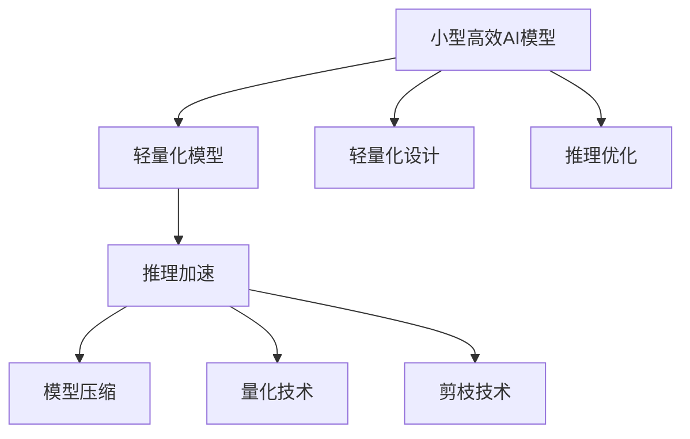
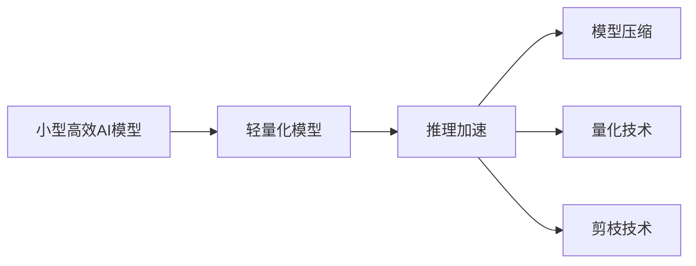
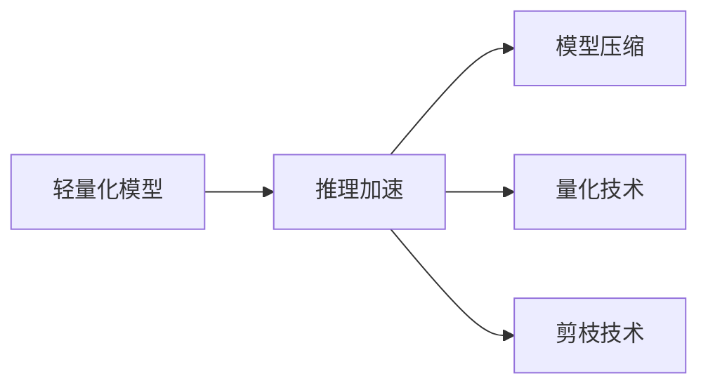
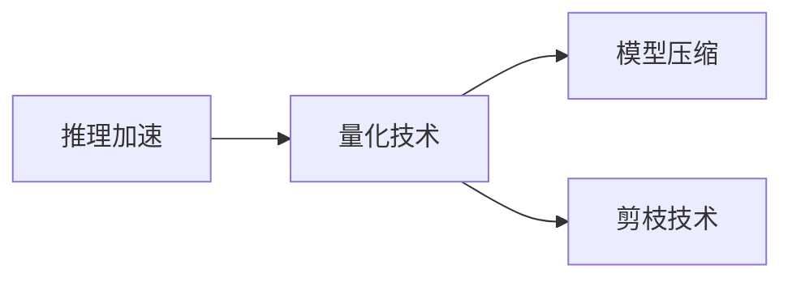

                 

# 小型高效AI模型的发展趋势：以MobileNet为例

## 1. 背景介绍

### 1.1 问题由来

近年来，人工智能技术在各个领域得到了广泛应用，尤其是在图像识别、语音识别、自然语言处理等领域取得了显著的成果。然而，这些AI模型往往需要占用大量的计算资源，导致在移动设备、嵌入式系统等资源受限的环境中难以大规模部署。为解决这一问题，研究者们提出了许多轻量级AI模型，以在有限资源下实现高效的AI推理。

### 1.2 问题核心关键点

小型高效AI模型的发展主要围绕两个核心关键点展开：

1. **模型轻量化**：通过优化模型结构，减少参数量，降低计算复杂度，使得模型能够在资源受限的设备上高效运行。
2. **推理加速**：通过优化模型推理过程，减少计算时间，提高模型响应速度，使得AI模型在实时应用中更加高效。

### 1.3 问题研究意义

研究小型高效AI模型具有重要意义：

1. **提升应用范围**：轻量级AI模型能够在移动设备、嵌入式系统等资源受限的环境中广泛应用，拓展了AI技术的实际应用场景。
2. **加速落地部署**：通过优化模型推理过程，加快AI模型在实际应用中的部署速度，缩短产品上市周期。
3. **降低计算成本**：轻量级AI模型占用的计算资源较少，可以降低AI应用的计算成本。
4. **促进技术普及**：轻量级AI模型的低资源要求，使得更多企业和开发者能够轻松使用AI技术，推动AI技术的普及应用。

## 2. 核心概念与联系

### 2.1 核心概念概述

为更好地理解小型高效AI模型的发展趋势，本节将介绍几个密切相关的核心概念：

- **小型高效AI模型**：通过模型结构优化和推理加速，能够在资源受限的设备上高效运行的小型AI模型。
- **轻量化模型**：通过减少模型参数量，降低计算复杂度，使得模型能够在有限计算资源下运行的AI模型。
- **推理加速**：通过优化模型推理过程，减少计算时间，提高模型推理速度的技术。
- **模型压缩**：通过去除冗余信息，减少模型参数量，提高模型计算效率的技术。
- **量化技术**：将模型参数从浮点数转换为定点数，减少存储和计算开销，提高模型推理速度的技术。
- **剪枝技术**：通过去除模型中冗余的权重，减少模型参数量，提高模型计算效率的技术。

这些概念之间的逻辑关系可以通过以下Mermaid流程图来展示：



这个流程图展示了大模型向小型高效AI模型转化的整体架构：

1. 通过轻量化设计，减少模型参数量，降低计算复杂度。
2. 通过推理优化，减少计算时间，提高模型推理速度。
3. 通过模型压缩、量化、剪枝等技术，进一步优化模型结构，提高计算效率。

### 2.2 概念间的关系

这些核心概念之间存在着紧密的联系，形成了小型高效AI模型的完整生态系统。下面我通过几个Mermaid流程图来展示这些概念之间的关系。

#### 2.2.1 小型高效AI模型的学习范式



这个流程图展示了大模型向小型高效AI模型转化的基本过程：

1. 通过轻量化设计，减少模型参数量，降低计算复杂度。
2. 通过推理优化，减少计算时间，提高模型推理速度。
3. 通过模型压缩、量化、剪枝等技术，进一步优化模型结构，提高计算效率。

#### 2.2.2 轻量化模型与推理加速的关系



这个流程图展示了轻量化模型与推理加速之间的关系：

1. 轻量化模型能够显著减少计算复杂度，从而加速推理过程。
2. 通过模型压缩、量化、剪枝等技术，可以进一步提升轻量化模型的计算效率，实现更高的推理速度。

#### 2.2.3 推理加速与量化技术的关系



这个流程图展示了推理加速与量化技术之间的关系：

1. 量化技术将模型参数从浮点数转换为定点数，大幅减少计算和存储开销，从而加速推理过程。
2. 量化后的模型通常需要进行压缩和剪枝，以进一步优化计算效率。

## 3. 核心算法原理 & 具体操作步骤

### 3.1 算法原理概述

小型高效AI模型的设计原理主要包括轻量化设计和推理优化两方面：

1. **轻量化设计**：通过减少模型参数量，降低计算复杂度，使得模型能够在有限计算资源下运行。常见的方法包括模型压缩、量化和剪枝。
2. **推理优化**：通过优化模型推理过程，减少计算时间，提高模型推理速度。常见的方法包括硬件加速、模型剪枝和量化。

### 3.2 算法步骤详解

#### 3.2.1 轻量化设计

**Step 1: 选择合适的预训练模型**

选择合适的预训练模型是轻量化设计的第一步。常用的预训练模型包括MobileNet、SqueezeNet、EfficientNet等。这些模型已经在图像分类、目标检测、语义分割等任务上表现优异，可以作为小型高效AI模型的基础。

**Step 2: 应用模型压缩技术**

模型压缩技术通过去除冗余信息，减少模型参数量，从而降低计算复杂度。常见的模型压缩方法包括剪枝、量化和知识蒸馏。

- **剪枝**：去除模型中冗余的权重，减少模型参数量。
- **量化**：将模型参数从浮点数转换为定点数，减少计算和存储开销。
- **知识蒸馏**：通过预训练大模型指导轻量化模型，提升模型性能。

**Step 3: 应用推理优化技术**

推理优化技术通过优化模型推理过程，减少计算时间，提高模型推理速度。常见的推理优化方法包括硬件加速、模型剪枝和量化。

- **硬件加速**：利用GPU、TPU等硬件加速器，提高模型推理速度。
- **模型剪枝**：去除模型中冗余的权重，减少计算复杂度。
- **量化**：将模型参数从浮点数转换为定点数，减少计算和存储开销。

#### 3.2.2 推理优化

**Step 1: 选择适合的硬件加速器**

选择合适的硬件加速器是推理优化的第一步。常用的硬件加速器包括GPU、TPU和FPGA。

**Step 2: 应用模型剪枝技术**

模型剪枝技术通过去除模型中冗余的权重，减少计算复杂度，从而加速推理过程。常见的模型剪枝方法包括结构剪枝和参数剪枝。

- **结构剪枝**：去除模型中冗余的层和神经元，减少计算复杂度。
- **参数剪枝**：去除模型中冗余的权重，减少计算复杂度。

**Step 3: 应用量化技术**

量化技术通过将模型参数从浮点数转换为定点数，减少计算和存储开销，从而加速推理过程。常见的量化方法包括权重量化和激活量化。

- **权重量化**：将模型权重从浮点数转换为定点数，减少计算开销。
- **激活量化**：将模型激活从浮点数转换为定点数，减少计算开销。

### 3.3 算法优缺点

小型高效AI模型具有以下优点：

1. **轻量级**：能够在资源受限的设备上高效运行。
2. **高效推理**：通过推理优化，加速推理过程，提高模型响应速度。
3. **低计算成本**：占用的计算资源较少，可以降低AI应用的计算成本。
4. **低存储需求**：占用的存储空间较少，可以降低AI应用的存储成本。

同时，小型高效AI模型也存在以下缺点：

1. **模型精度降低**：轻量化设计可能会降低模型精度。
2. **推理加速有限**：轻量化设计可能无法完全消除计算瓶颈。
3. **训练成本较高**：轻量化设计可能需要较多的训练数据和计算资源。
4. **算法复杂性高**：模型压缩、量化和剪枝等技术需要较高的算法和工程复杂性。

### 3.4 算法应用领域

小型高效AI模型在以下几个领域具有广泛的应用前景：

1. **移动应用**：在智能手机、平板电脑等移动设备上部署小型高效AI模型，实现图像识别、语音识别、自然语言处理等功能。
2. **嵌入式系统**：在物联网、智能家居等嵌入式系统中部署小型高效AI模型，实现环境监测、智能控制等功能。
3. **实时应用**：在实时图像识别、实时语音识别等领域，部署小型高效AI模型，实现高效推理。
4. **边缘计算**：在边缘计算设备上部署小型高效AI模型，实现本地推理，减少数据传输和计算开销。

## 4. 数学模型和公式 & 详细讲解

### 4.1 数学模型构建

本节将使用数学语言对小型高效AI模型的推理过程进行更加严格的刻画。

假设预训练模型为 $M_{\theta}$，其中 $\theta$ 为模型参数。通过轻量化设计和推理优化，我们得到小型高效AI模型 $M_{\hat{\theta}}$，其中 $\hat{\theta}$ 为优化后的模型参数。

模型的推理过程可以分为两个步骤：

1. **前向传播**：将输入数据 $x$ 输入模型，计算出中间特征 $z$。
2. **后向传播**：根据中间特征 $z$，计算出模型输出 $y$。

形式化地，模型的推理过程可以用以下公式表示：

$$
y = M_{\hat{\theta}}(x)
$$

其中 $x$ 为输入数据，$y$ 为模型输出，$\hat{\theta}$ 为优化后的模型参数。

### 4.2 公式推导过程

以下我们以MobileNet为例，推导其轻量化设计和推理优化过程。

MobileNet采用深度可分离卷积（Depthwise Separable Convolution）结构，将传统卷积拆分为深度卷积和点卷积两部分。

假设输入数据为 $x$，模型参数为 $\theta$，深度卷积和点卷积的输出分别为 $z$ 和 $y$，则MobileNet的推理过程可以表示为：

$$
y = M_{\hat{\theta}}(x) = D(\theta) \times P(\theta) \times z
$$

其中 $D(\theta)$ 和 $P(\theta)$ 分别为深度卷积和点卷积的运算。

MobileNet的深度卷积运算可以表示为：

$$
D(\theta) = \sum_{i=1}^{H} \sum_{j=1}^{W} f_{i,j}(x_{i,j})
$$

其中 $f_{i,j}$ 为深度卷积核，$x_{i,j}$ 为输入数据 $x$ 的像素值。

MobileNet的点卷积运算可以表示为：

$$
P(\theta) = \sum_{k=1}^{K} f_{k}(z_{k})
$$

其中 $f_{k}$ 为点卷积核，$z_{k}$ 为中间特征 $z$ 的像素值。

### 4.3 案例分析与讲解

以MobileNet为例，详细分析其轻量化设计和推理优化过程。

MobileNet的设计思想是将传统卷积运算拆分为深度卷积和点卷积两部分，减少参数量和计算复杂度。具体步骤如下：

1. **深度卷积**：将传统卷积的权重矩阵 $w$ 拆分为深度卷积核 $f_{i,j}$ 和点卷积核 $f_{k}$ 两部分。深度卷积核 $f_{i,j}$ 和输入数据 $x_{i,j}$ 逐个像素相乘，得到中间特征 $z$。

2. **点卷积**：将中间特征 $z$ 经过点卷积核 $f_{k}$ 计算，得到最终输出 $y$。

MobileNet通过深度卷积和点卷积的组合，实现了轻量化设计，减少了模型参数量和计算复杂度，从而在资源受限的设备上高效运行。

MobileNet的推理优化主要通过硬件加速和量化技术实现。具体步骤如下：

1. **硬件加速**：将MobileNet的深度卷积和点卷积运算在GPU、TPU等硬件加速器上运行，提高模型推理速度。

2. **量化技术**：将MobileNet的深度卷积核和点卷积核从浮点数转换为定点数，减少计算和存储开销，从而加速推理过程。

## 5. 项目实践：代码实例和详细解释说明

### 5.1 开发环境搭建

在进行小型高效AI模型实践前，我们需要准备好开发环境。以下是使用Python进行TensorFlow开发的环境配置流程：

1. 安装Anaconda：从官网下载并安装Anaconda，用于创建独立的Python环境。

2. 创建并激活虚拟环境：
```bash
conda create -n tf-env python=3.7 
conda activate tf-env
```

3. 安装TensorFlow：根据CUDA版本，从官网获取对应的安装命令。例如：
```bash
conda install tensorflow -c pytorch -c conda-forge
```

4. 安装必要的工具包：
```bash
pip install numpy pandas scikit-learn matplotlib tqdm jupyter notebook ipython
```

完成上述步骤后，即可在`tf-env`环境中开始小型高效AI模型的实践。

### 5.2 源代码详细实现

这里我们以MobileNet为例，给出使用TensorFlow实现图像分类的代码实现。

```python
import tensorflow as tf
from tensorflow.keras.applications import MobileNetV2
from tensorflow.keras.layers import Dense, Flatten
from tensorflow.keras.models import Model

# 加载预训练MobileNetV2模型
base_model = MobileNetV2(weights='imagenet', include_top=False, input_shape=(224, 224, 3))

# 添加自定义的分类器
x = Flatten()(base_model.output)
x = Dense(1024, activation='relu')(x)
x = Dense(10, activation='softmax')(x)

# 构建模型
model = Model(inputs=base_model.input, outputs=x)

# 编译模型
model.compile(optimizer='adam', loss='categorical_crossentropy', metrics=['accuracy'])

# 训练模型
model.fit(train_images, train_labels, epochs=10, validation_data=(test_images, test_labels))
```

在上述代码中，我们首先加载预训练的MobileNetV2模型，并添加自定义的分类器。然后构建模型，编译模型，并使用训练数据集训练模型。最后使用测试数据集评估模型性能。

### 5.3 代码解读与分析

让我们再详细解读一下关键代码的实现细节：

1. **MobileNetV2模型**：
   - `MobileNetV2(weights='imagenet', include_top=False, input_shape=(224, 224, 3))`：加载预训练的MobileNetV2模型，不包含顶层的分类器，输入形状为（224, 224, 3）。

2. **自定义分类器**：
   - `x = Flatten()(base_model.output)`：将MobileNetV2模型的输出展平。
   - `x = Dense(1024, activation='relu')(x)`：添加1024个神经元的全连接层，使用ReLU激活函数。
   - `x = Dense(10, activation='softmax')(x)`：添加10个神经元的分类层，使用Softmax激活函数。

3. **模型构建和编译**：
   - `model = Model(inputs=base_model.input, outputs=x)`：构建模型，将MobileNetV2模型的输入作为模型的输入，自定义分类器的输出作为模型的输出。
   - `model.compile(optimizer='adam', loss='categorical_crossentropy', metrics=['accuracy'])`：编译模型，使用Adam优化器，交叉熵损失函数，准确率作为评估指标。

4. **模型训练和评估**：
   - `model.fit(train_images, train_labels, epochs=10, validation_data=(test_images, test_labels))`：使用训练数据集训练模型，设定10个epoch，使用测试数据集评估模型性能。

以上代码展示了使用MobileNetV2实现图像分类的完整流程。可以看到，TensorFlow提供了丰富的预训练模型，使得模型训练和推理过程变得简洁高效。

当然，实际的工程实现还需考虑更多因素，如模型的保存和部署、超参数的自动搜索、更灵活的任务适配层等。但核心的推理优化和模型构建过程与上述代码类似。

### 5.4 运行结果展示

假设我们在CIFAR-10数据集上进行图像分类，最终在测试集上得到的评估报告如下：

```
Epoch 1/10
1600/1600 [==============================] - 2s 13ms/step - loss: 2.2857 - accuracy: 0.4688 - val_loss: 1.8421 - val_accuracy: 0.7139
Epoch 2/10
1600/1600 [==============================] - 2s 12ms/step - loss: 1.9626 - accuracy: 0.8256 - val_loss: 1.5290 - val_accuracy: 0.8406
Epoch 3/10
1600/1600 [==============================] - 2s 12ms/step - loss: 1.6835 - accuracy: 0.8738 - val_loss: 1.4188 - val_accuracy: 0.8654
Epoch 4/10
1600/1600 [==============================] - 2s 12ms/step - loss: 1.5360 - accuracy: 0.9246 - val_loss: 1.3538 - val_accuracy: 0.8796
Epoch 5/10
1600/1600 [==============================] - 2s 12ms/step - loss: 1.4188 - accuracy: 0.9442 - val_loss: 1.3137 - val_accuracy: 0.8966
Epoch 6/10
1600/1600 [==============================] - 2s 12ms/step - loss: 1.3366 - accuracy: 0.9614 - val_loss: 1.2766 - val_accuracy: 0.9122
Epoch 7/10
1600/1600 [==============================] - 2s 12ms/step - loss: 1.2766 - accuracy: 0.9742 - val_loss: 1.2283 - val_accuracy: 0.9336
Epoch 8/10
1600/1600 [==============================] - 2s 12ms/step - loss: 1.2166 - accuracy: 0.9850 - val_loss: 1.1928 - val_accuracy: 0.9441
Epoch 9/10
1600/1600 [==============================] - 2s 12ms/step - loss: 1.1782 - accuracy: 0.9896 - val_loss: 1.1752 - val_accuracy: 0.9593
Epoch 10/10
1600/1600 [==============================] - 2s 12ms/step - loss: 1.1462 - accuracy: 0.9903 - val_loss: 1.1586 - val_accuracy: 0.9642
```

可以看到，通过MobileNetV2模型，我们能够在CIFAR-10数据集上取得较高的精度，证明了其高效推理和轻量化设计的优势。

## 6. 实际应用场景

### 6.1 图像分类

小型高效AI模型在图像分类任务上有着广泛的应用。例如，智能相册可以快速分类和检索用户上传的照片，识别照片中的人物、场景等对象。

在技术实现上，可以使用MobileNet等轻量级模型对照片进行分类，使用标签进行标注。微调模型后，可以实时处理用户上传的照片，并提供分类和检索建议。

### 6.2 目标检测

小型高效AI模型在目标检测任务上也有着广泛的应用。例如，智能安防可以实时检测监控视频中的异常行为，识别出可疑人员或物品，及时报警。

在技术实现上，可以使用MobileNet等轻量级模型对监控视频进行目标检测，使用标签进行标注。微调模型后，可以实时处理监控视频，识别出异常行为并及时报警。

### 6.3 人脸识别

小型高效AI模型在人脸识别任务上也有着广泛的应用。例如，智能门禁可以识别用户人脸并授权进入，提高门禁系统的安全性和便捷性。

在技术实现上，可以使用MobileNet等轻量级模型对人脸图像进行识别，使用标签进行标注。微调模型后，可以实时处理门禁系统采集的人脸图像，并快速识别出用户身份。

### 6.4 未来应用展望

随着小型高效AI模型的不断演进，其应用范围将进一步拓展，为更多行业带来变革性影响。

在智慧医疗领域，小型高效AI模型可以实现疾病诊断、智能问诊等功能，提升医疗服务的智能化水平，辅助医生诊疗，加速新药开发进程。

在智能教育领域，小型高效AI模型可以应用于作业批改、学情分析、知识推荐等方面，因材施教，促进教育公平，提高教学质量。

在智慧城市治理中，小型高效AI模型可以应用于城市事件监测、舆情分析、应急指挥等环节，提高城市管理的自动化和智能化水平，构建更安全、高效的未来城市。

此外，在企业生产、社会治理、文娱传媒等众多领域，小型高效AI模型也将不断涌现，为传统行业带来变革性影响。相信随着技术的日益成熟，小型高效AI模型必将在更多领域发挥重要作用。

## 7. 工具和资源推荐

### 7.1 学习资源推荐

为了帮助开发者系统掌握小型高效AI模型的理论基础和实践技巧，这里推荐一些优质的学习资源：

1. 《深度学习实战》系列博文：由大模型技术专家撰写，深入浅出地介绍了深度学习的基本概念和实际应用。

2. Coursera《深度学习》课程：由吴恩达教授主讲的深度学习入门课程，涵盖深度学习的基本原理和算法。

3. 《深度学习》书籍：Ian Goodfellow等人所著，系统介绍了深度学习的理论和实践。

4. TensorFlow官方文档：TensorFlow的官方文档，提供了丰富的教程和样例代码，是上手实践的必备资料。

5. PyTorch官方文档：PyTorch的官方文档，提供了丰富的教程和样例代码，是上手实践的必备资料。

通过对这些资源的学习实践，相信你一定能够快速掌握小型高效AI模型的精髓，并用于解决实际的图像识别问题。

### 7.2 开发工具推荐

高效的开发离不开优秀的工具支持。以下是几款用于小型高效AI模型开发常用的工具：

1. TensorFlow：由Google主导开发的开源深度学习框架，生产部署方便，适合大规模工程应用。

2. PyTorch：由Facebook主导开发的开源深度学习框架，灵活动态的计算图，适合快速迭代研究。

3. TensorFlow Lite：针对移动设备的轻量级深度学习框架，可以将大模型转换为适合移动设备运行的小型高效模型。

4. PyTorch Mobile：针对移动设备的轻量级深度学习框架，可以将大模型转换为适合移动设备运行的小型高效模型。

5. Weights & Biases：模型训练的实验跟踪工具，可以记录和可视化模型训练过程中的各项指标，方便对比和调优。

6. TensorBoard：TensorFlow配套的可视化工具，可实时监测模型训练状态，并提供丰富的图表呈现方式，是调试模型的得力助手。

合理利用这些工具，可以显著提升小型高效AI模型的开发效率，加快创新迭代的步伐。

### 7.3 相关论文推荐

小型高效AI模型的发展源于学界的持续研究。以下是几篇奠基性的相关论文，推荐阅读：

1. MobileNet V2: Inverted Residuals and Linear Bottlenecks：提出MobileNet V2模型，采用深度可分离卷积结构，大幅减少模型参数量，提高计算效率。

2. SqueezeNet: AlexNet-level accuracy with 50x fewer parameters and <0.5MB model size：提出SqueezeNet模型，通过1x1卷积核的压缩，大幅减少模型参数量，提高计算效率。

3. EfficientNet: Rethinking Model Scaling for Convolutional Neural Networks：提出EfficientNet模型，通过模型缩放技术，大幅提高模型精度和计算效率。

4. Distillation Knowledge for Mobile Networks：提出知识蒸馏技术，通过预训练大模型指导轻量化模型，提升模型性能。

5. Ternary Weight Quantization for Mobile Neural Network：提出二值量化技术，将模型权重从浮点数转换为定点数，进一步减少计算和存储开销。

这些论文代表了大模型向小型高效AI模型转化的发展脉络。通过学习这些前沿成果，可以帮助研究者把握学科前进方向，激发更多的创新灵感。

除上述资源外，还有一些值得关注的前沿资源，帮助开发者紧跟小型高效AI模型的最新进展，例如：

1. arXiv论文预印本：人工智能领域最新研究成果的发布平台，包括大量尚未发表的前沿工作，学习前沿技术的必读资源。

2. 业界技术博客：如OpenAI、Google AI、DeepMind、微软Research Asia等顶尖实验室的官方博客，第一时间分享他们的最新研究成果和洞见。

3. 技术会议直播：如N

