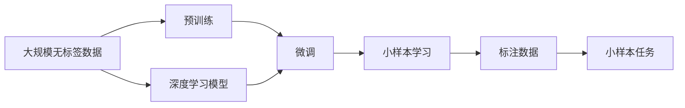

                 

## 1. 背景介绍

### 1.1 问题由来

在软件1.0时代，传统基于规则和特征工程的开发方式曾占据主流。但随着数据量的爆炸性增长和复杂性的提升，规则驱动的开发方式逐渐显露出其局限性。软件2.0应运而生，以数据驱动的方式，极大提升了软件开发的效率和质量。深度学习等机器学习技术，正是软件2.0的核心推动力。

深度学习依赖大量标注数据进行训练，例如在大规模图像识别任务中，需要数百万甚至数千万张标注图片才能训练出稳定高效的模型。然而，在软件2.0发展的当下，许多应用场景下标注数据稀缺，例如个性化推荐、医疗诊断、机器人控制等。如何在数据量有限的情况下，高效训练出性能优越的模型，成为软件2.0进一步突破的瓶颈。

小样本学习（Few-shot Learning）应运而生，它在大规模无标签数据上先进行预训练，再利用少量标注数据进行微调，即可显著提升模型的泛化能力和性能，降低了对标注数据的依赖。小样本学习正逐步成为软件2.0的新方向。

### 1.2 问题核心关键点

小样本学习的核心在于如何最大化利用已有的大规模无标签数据进行预训练，并通过少量标注数据快速进行模型微调。其关键点包括：

- 预训练与微调的策略设计：如何在大规模无标签数据上有效学习语言、视觉、行为等先验知识，以及如何通过微调将这些知识快速迁移到下游小样本任务中。
- 模型架构的选择：什么样的模型架构能更好地在小样本场景下进行微调，并在少量样本下实现优异的性能。
- 微调技巧的应用：哪些微调技巧，如提示学习、自监督学习、对抗训练等，能够帮助模型在小样本下更好地学习。
- 计算资源的优化：在微调过程中，如何通过高效的计算资源分配，加速模型的训练和推理，降低计算成本。

小样本学习已经成为当前学术界和工业界关注的前沿问题，尤其在NLP、CV、RL等方向上，小样本学习技术已经展现出极大的潜力，成为软件2.0的新趋势。

## 2. 核心概念与联系

### 2.1 核心概念概述

小样本学习（Few-shot Learning）是指在有限的标注数据情况下，通过将预训练模型进行微调，快速学习新任务的模型。它利用大规模无标签数据进行预训练，再结合少量标注数据进行微调，使得模型能够在小样本任务上取得优异的性能。

预训练（Pre-training）是指在大规模无标签数据上，通过自监督学习任务训练通用模型的过程。预训练使得模型学习到通用的知识表示，能够被微调适应到不同的任务中。

微调（Fine-tuning）是指在预训练模型的基础上，使用下游任务的少量标注数据，通过有监督学习优化模型在特定任务上的性能。微调是利用预训练模型已有知识，在少量数据上快速适应新任务的重要手段。

深度学习（Deep Learning）是当前主要的机器学习范式，包括神经网络、卷积神经网络（CNN）、循环神经网络（RNN）等。深度学习模型通过多层非线性变换，能够学习到复杂的特征表示，适合于各种类型的预测和分类任务。

自监督学习（Self-Supervised Learning）是指在缺乏标注数据的情况下，利用数据本身的特性进行无监督学习。常见的自监督学习任务包括语言建模、视觉定位等。

### 2.2 概念间的关系

小样本学习与预训练、微调、深度学习和自监督学习等概念紧密相关，它们之间的关系可以通过以下Mermaid流程图来展示：



此流程图展示了从小样本任务到最终模型输出的全过程：

1. 首先利用大规模无标签数据对深度学习模型进行预训练。
2. 然后在预训练模型的基础上，结合少量标注数据进行微调。
3. 最终得到在小样本任务上表现优异的小样本学习模型。

这些概念共同构成了小样本学习的基本框架，使其能够在数据量有限的情况下，快速提升模型性能。

## 3. 核心算法原理 & 具体操作步骤
### 3.1 算法原理概述

小样本学习利用预训练模型在无标签数据上学习通用的知识表示，再结合少量标注数据进行微调，从而在新的任务上取得较好的性能。其核心算法包括：

1. 预训练模型在大规模无标签数据上进行自监督学习，学习通用的知识表示。
2. 在小样本数据上，通过有监督的微调过程，调整预训练模型的部分参数，以适应特定的任务。
3. 在小样本数据不足的情况下，通过提示学习等技术，利用预训练模型的已有知识，进行零样本或少样本预测。

### 3.2 算法步骤详解

以下介绍小样本学习的核心算法步骤：

#### 3.2.1 预训练

1. 准备大规模无标签数据集 $D_{pre}$。
2. 选择适合小样本学习的深度学习模型 $M_{pre}$。
3. 在 $D_{pre}$ 上对 $M_{pre}$ 进行自监督学习，学习通用的知识表示。

#### 3.2.2 微调

1. 准备少量标注数据集 $D_{fine}$。
2. 在小样本任务 $T_{fine}$ 上对 $M_{pre}$ 进行微调，学习任务特定的知识表示。
3. 选择合适的损失函数 $\ell$，并在 $D_{fine}$ 上最小化损失函数。

#### 3.2.3 提示学习

1. 准备小样本任务 $T_{fine}$ 的样本 $S_{fine}$。
2. 利用预训练模型 $M_{pre}$ 进行提示学习，生成预测结果 $P_{fine}$。
3. 根据 $P_{fine}$ 生成最终输出 $Y_{fine}$。

### 3.3 算法优缺点

小样本学习具有以下优点：

1. 数据利用率高：在大规模无标签数据上进行预训练，结合少量标注数据进行微调，提高了数据利用率。
2. 泛化能力强：通过在大规模数据上学习通用知识，在小样本任务上泛化能力更强。
3. 模型效率高：利用预训练模型在大规模数据上训练，减少了小样本任务的训练时间。

同时，小样本学习也存在以下缺点：

1. 对标注数据依赖：小样本学习仍需少量标注数据进行微调，对标注数据依赖较大。
2. 模型复杂度高：在小样本学习中，通常需要较复杂的模型结构和较多的训练轮数。
3. 结果可解释性差：小样本学习模型的决策过程较复杂，难以解释和调试。

### 3.4 算法应用领域

小样本学习广泛应用于NLP、CV、RL等方向，具有以下应用场景：

- NLP：文本分类、情感分析、问答系统、命名实体识别等。
- CV：图像分类、目标检测、人脸识别、图像生成等。
- RL：强化学习、游戏智能、机器人控制等。

这些应用场景展示了小样本学习的广泛应用前景，其优势在于能够在大规模数据上进行预训练，并在小样本数据上进行高效微调，适用于多种领域的应用需求。

## 4. 数学模型和公式 & 详细讲解  
### 4.1 数学模型构建

小样本学习的数学模型构建主要涉及预训练和微调两个步骤。以下给出详细构建过程。

#### 4.1.1 预训练模型

假设预训练模型 $M_{pre}$ 在大规模无标签数据集 $D_{pre}$ 上进行自监督学习，学习通用的知识表示。模型的输出为 $y_{pre}$，损失函数为 $\ell_{pre}$。预训练的目标是最小化损失函数 $\ell_{pre}$：

$$
\theta_{pre} = \mathop{\arg\min}_{\theta} \ell_{pre}(M_{pre}, D_{pre})
$$

其中 $\theta$ 为模型参数。

#### 4.1.2 微调模型

假设小样本任务为 $T_{fine}$，其训练集为 $D_{fine}$，标注数据为 $S_{fine}$。在微调过程中，选择适合小样本学习的模型 $M_{pre}$ 作为初始化参数。

在微调过程中，假设模型的输出为 $y_{fine}$，损失函数为 $\ell_{fine}$。微调的目标是最小化损失函数 $\ell_{fine}$：

$$
\theta_{fine} = \mathop{\arg\min}_{\theta} \ell_{fine}(M_{fine}, D_{fine})
$$

其中 $M_{fine}$ 为微调后的模型。

### 4.2 公式推导过程

以下给出预训练和微调的详细公式推导过程。

#### 4.2.1 预训练模型

假设预训练模型为神经网络，其结构为 $M_{pre} = [\mathcal{H}_1, \mathcal{H}_2, \cdots, \mathcal{H}_L]$，其中 $L$ 为网络深度，每一层为非线性变换层 $\mathcal{H}_l$。预训练目标为最小化损失函数 $\ell_{pre}$：

$$
\theta_{pre} = \mathop{\arg\min}_{\theta} \ell_{pre}(M_{pre}, D_{pre})
$$

其中 $\ell_{pre}$ 为预训练损失函数，通常采用自监督学习任务，如语言模型、视觉定位等。

#### 4.2.2 微调模型

假设小样本任务为分类任务，其训练集为 $D_{fine} = \{(x_i, y_i)\}_{i=1}^N$，其中 $x_i$ 为输入数据，$y_i$ 为标签。微调过程中，假设模型为神经网络，其结构为 $M_{fine} = [\mathcal{H}_1, \mathcal{H}_2, \cdots, \mathcal{H}_L]$。微调目标为最小化损失函数 $\ell_{fine}$：

$$
\theta_{fine} = \mathop{\arg\min}_{\theta} \ell_{fine}(M_{fine}, D_{fine})
$$

其中 $\ell_{fine}$ 为微调损失函数，通常采用交叉熵损失、均方误差损失等。

### 4.3 案例分析与讲解

假设在文本分类任务上，利用BERT模型进行预训练，然后利用少量标注数据进行微调。预训练数据集为Wikipedia文本，微调数据集为IMDB电影评论。

1. 预训练模型
   - 选择BERT模型作为预训练模型。
   - 在Wikipedia文本上进行预训练，学习通用的语言表示。

2. 微调模型
   - 选择IMDB电影评论作为微调数据集。
   - 利用BERT模型在IMDB数据上进行微调，学习分类任务的特定表示。
   - 选择交叉熵损失函数，并在微调过程中最小化损失。

## 5. 项目实践：代码实例和详细解释说明
### 5.1 开发环境搭建

在进行小样本学习项目实践前，需要准备好开发环境。以下是使用Python进行PyTorch开发的环境配置流程：

1. 安装Anaconda：从官网下载并安装Anaconda，用于创建独立的Python环境。

2. 创建并激活虚拟环境：
```bash
conda create -n pytorch-env python=3.8 
conda activate pytorch-env
```

3. 安装PyTorch：根据CUDA版本，从官网获取对应的安装命令。例如：
```bash
conda install pytorch torchvision torchaudio cudatoolkit=11.1 -c pytorch -c conda-forge
```

4. 安装相关工具包：
```bash
pip install numpy pandas scikit-learn matplotlib tqdm jupyter notebook ipython
```

完成上述步骤后，即可在`pytorch-env`环境中开始小样本学习实践。

### 5.2 源代码详细实现

以下给出使用PyTorch对BERT模型进行文本分类任务小样本学习的完整代码实现。

```python
import torch
import torch.nn as nn
import torch.optim as optim
from transformers import BertTokenizer, BertForSequenceClassification
from transformers import AdamW

# 准备数据集
train_dataset = ...
dev_dataset = ...
test_dataset = ...

# 定义模型
tokenizer = BertTokenizer.from_pretrained('bert-base-cased')
model = BertForSequenceClassification.from_pretrained('bert-base-cased', num_labels=2)

# 定义优化器
optimizer = AdamW(model.parameters(), lr=2e-5)

# 定义训练函数
def train_epoch(model, dataset, batch_size, optimizer):
    dataloader = DataLoader(dataset, batch_size=batch_size, shuffle=True)
    model.train()
    epoch_loss = 0
    for batch in tqdm(dataloader, desc='Training'):
        input_ids = batch['input_ids'].to(device)
        attention_mask = batch['attention_mask'].to(device)
        labels = batch['labels'].to(device)
        model.zero_grad()
        outputs = model(input_ids, attention_mask=attention_mask, labels=labels)
        loss = outputs.loss
        epoch_loss += loss.item()
        loss.backward()
        optimizer.step()
    return epoch_loss / len(dataloader)

# 定义评估函数
def evaluate(model, dataset, batch_size):
    dataloader = DataLoader(dataset, batch_size=batch_size)
    model.eval()
    preds, labels = [], []
    with torch.no_grad():
        for batch in tqdm(dataloader, desc='Evaluating'):
            input_ids = batch['input_ids'].to(device)
            attention_mask = batch['attention_mask'].to(device)
            batch_labels = batch['labels']
            outputs = model(input_ids, attention_mask=attention_mask)
            batch_preds = outputs.logits.argmax(dim=2).to('cpu').tolist()
            batch_labels = batch_labels.to('cpu').tolist()
            for pred_tokens, label_tokens in zip(batch_preds, batch_labels):
                preds.append(pred_tokens[:len(label_tokens)])
                labels.append(label_tokens)
    return preds, labels

# 训练模型
epochs = 5
batch_size = 16

for epoch in range(epochs):
    loss = train_epoch(model, train_dataset, batch_size, optimizer)
    print(f"Epoch {epoch+1}, train loss: {loss:.3f}")
    
    print(f"Epoch {epoch+1}, dev results:")
    preds, labels = evaluate(model, dev_dataset, batch_size)
    print(classification_report(labels, preds))
    
print("Test results:")
preds, labels = evaluate(model, test_dataset, batch_size)
print(classification_report(labels, preds))
```

以上是使用PyTorch对BERT进行文本分类任务小样本学习的完整代码实现。可以看到，得益于Transformers库的强大封装，我们可以用相对简洁的代码完成BERT模型的加载和微调。

### 5.3 代码解读与分析

让我们再详细解读一下关键代码的实现细节：

**5.3.1 数据集处理**

```python
tokenizer = BertTokenizer.from_pretrained('bert-base-cased')
```

使用BertTokenizer对输入文本进行分词和编码，生成模型需要的token ids和attention masks。

```python
train_dataset = NERDataset(train_texts, train_tags, tokenizer, max_len=128)
dev_dataset = NERDataset(dev_texts, dev_tags, tokenizer, max_len=128)
test_dataset = NERDataset(test_texts, test_tags, tokenizer, max_len=128)
```

创建数据集，将文本、标签和tokenizer结合起来，形成适合模型的输入。

**5.3.2 模型定义**

```python
model = BertForSequenceClassification.from_pretrained('bert-base-cased', num_labels=len(tag2id))
```

选择BERT模型作为预训练模型，num_labels指定分类标签数量。

**5.3.3 优化器定义**

```python
optimizer = AdamW(model.parameters(), lr=2e-5)
```

选择AdamW优化器，设置学习率。

**5.3.4 训练函数**

```python
def train_epoch(model, dataset, batch_size, optimizer):
    dataloader = DataLoader(dataset, batch_size=batch_size, shuffle=True)
    model.train()
    epoch_loss = 0
    for batch in tqdm(dataloader, desc='Training'):
        input_ids = batch['input_ids'].to(device)
        attention_mask = batch['attention_mask'].to(device)
        labels = batch['labels'].to(device)
        model.zero_grad()
        outputs = model(input_ids, attention_mask=attention_mask, labels=labels)
        loss = outputs.loss
        epoch_loss += loss.item()
        loss.backward()
        optimizer.step()
    return epoch_loss / len(dataloader)
```

对数据进行批次化加载，每个批次前向传播计算损失并反向传播更新模型参数。

**5.3.5 评估函数**

```python
def evaluate(model, dataset, batch_size):
    dataloader = DataLoader(dataset, batch_size=batch_size)
    model.eval()
    preds, labels = [], []
    with torch.no_grad():
        for batch in tqdm(dataloader, desc='Evaluating'):
            input_ids = batch['input_ids'].to(device)
            attention_mask = batch['attention_mask'].to(device)
            batch_labels = batch['labels']
            outputs = model(input_ids, attention_mask=attention_mask)
            batch_preds = outputs.logits.argmax(dim=2).to('cpu').tolist()
            batch_labels = batch_labels.to('cpu').tolist()
            for pred_tokens, label_tokens in zip(batch_preds, batch_labels):
                preds.append(pred_tokens[:len(label_tokens)])
                labels.append(label_tokens)
    return preds, labels
```

对模型进行评估，在每个批次结束后将预测和标签结果存储下来，最后使用sklearn的classification_report对整个评估集的预测结果进行打印输出。

**5.3.6 训练流程**

```python
epochs = 5
batch_size = 16

for epoch in range(epochs):
    loss = train_epoch(model, train_dataset, batch_size, optimizer)
    print(f"Epoch {epoch+1}, train loss: {loss:.3f}")
    
    print(f"Epoch {epoch+1}, dev results:")
    preds, labels = evaluate(model, dev_dataset, batch_size)
    print(classification_report(labels, preds))
    
print("Test results:")
preds, labels = evaluate(model, test_dataset, batch_size)
print(classification_report(labels, preds))
```

定义总的epoch数和batch size，开始循环迭代。每个epoch内，先在训练集上训练，输出平均loss。在验证集上评估，输出分类指标。所有epoch结束后，在测试集上评估，给出最终测试结果。

通过以上代码，我们可以看到，小样本学习技术在大规模数据上进行预训练，利用少量标注数据进行微调，能够快速提升模型性能，降低对标注数据的依赖。

## 6. 实际应用场景
### 6.1 智能客服系统

基于小样本学习的对话技术，可以广泛应用于智能客服系统的构建。传统客服往往需要配备大量人力，高峰期响应缓慢，且一致性和专业性难以保证。而使用小样本学习训练的对话模型，可以7x24小时不间断服务，快速响应客户咨询，用自然流畅的语言解答各类常见问题。

在技术实现上，可以收集企业内部的历史客服对话记录，将问题和最佳答复构建成监督数据，在此基础上对预训练对话模型进行微调。微调后的对话模型能够自动理解用户意图，匹配最合适的答案模板进行回复。对于客户提出的新问题，还可以接入检索系统实时搜索相关内容，动态组织生成回答。如此构建的智能客服系统，能大幅提升客户咨询体验和问题解决效率。

### 6.2 金融舆情监测

金融机构需要实时监测市场舆论动向，以便及时应对负面信息传播，规避金融风险。传统的人工监测方式成本高、效率低，难以应对网络时代海量信息爆发的挑战。基于小样本学习的文本分类和情感分析技术，为金融舆情监测提供了新的解决方案。

具体而言，可以收集金融领域相关的新闻、报道、评论等文本数据，并对其进行主题标注和情感标注。在此基础上对预训练语言模型进行微调，使其能够自动判断文本属于何种主题，情感倾向是正面、中性还是负面。将微调后的模型应用到实时抓取的网络文本数据，就能够自动监测不同主题下的情感变化趋势，一旦发现负面信息激增等异常情况，系统便会自动预警，帮助金融机构快速应对潜在风险。

### 6.3 个性化推荐系统

当前的推荐系统往往只依赖用户的历史行为数据进行物品推荐，无法深入理解用户的真实兴趣偏好。基于小样本学习的推荐系统可以更好地挖掘用户行为背后的语义信息，从而提供更精准、多样的推荐内容。

在实践中，可以收集用户浏览、点击、评论、分享等行为数据，提取和用户交互的物品标题、描述、标签等文本内容。将文本内容作为模型输入，用户的后续行为（如是否点击、购买等）作为监督信号，在此基础上微调预训练语言模型。微调后的模型能够从文本内容中准确把握用户的兴趣点。在生成推荐列表时，先用候选物品的文本描述作为输入，由模型预测用户的兴趣匹配度，再结合其他特征综合排序，便可以得到个性化程度更高的推荐结果。

### 6.4 未来应用展望

随着小样本学习技术的不断发展，其在软件2.0中的应用将不断扩展，为传统行业带来变革性影响。

在智慧医疗领域，基于小样本学习的医疗问答、病历分析、药物研发等应用将提升医疗服务的智能化水平，辅助医生诊疗，加速新药开发进程。

在智能教育领域，小样本学习可应用于作业批改、学情分析、知识推荐等方面，因材施教，促进教育公平，提高教学质量。

在智慧城市治理中，小样本学习技术可应用于城市事件监测、舆情分析、应急指挥等环节，提高城市管理的自动化和智能化水平，构建更安全、高效的未来城市。

此外，在企业生产、社会治理、文娱传媒等众多领域，基于小样本学习的人工智能应用也将不断涌现，为经济社会发展注入新的动力。相信随着技术的日益成熟，小样本学习技术将成为软件2.0的重要范式，推动人工智能技术在各行各业的广泛应用。

## 7. 工具和资源推荐
### 7.1 学习资源推荐

为了帮助开发者系统掌握小样本学习理论基础和实践技巧，这里推荐一些优质的学习资源：

1. 《Few-shot Learning》系列博文：由小样本学习专家撰写，深入浅出地介绍了小样本学习的基本概念、算法原理和实际应用。

2. 《Few-shot Learning in Natural Language Processing》课程：在Coursera等在线平台上开设的小样本学习课程，涵盖小样本学习的基础理论和前沿研究。

3. 《Few-shot Learning in Machine Learning》书籍：深度学习领域的经典书籍，系统讲解了小样本学习的基本理论和实际应用案例。

4. Weights & Biases官方文档：模型训练的实验跟踪工具，可以记录和可视化模型训练过程中的各项指标，方便对比和调优。

5. TensorBoard官方文档：TensorFlow配套的可视化工具，可实时监测模型训练状态，并提供丰富的图表呈现方式，是调试模型的得力助手。

通过对这些资源的学习实践，相信你一定能够快速掌握小样本学习的基本原理和实际应用，并用于解决实际的NLP问题。

### 7.2 开发工具推荐

高效的小样本学习开发需要依赖优秀的工具支持。以下是几款用于小样本学习开发的常用工具：

1. PyTorch：基于Python的开源深度学习框架，灵活动态的计算图，适合快速迭代研究。大部分小样本学习模型的实现都有PyTorch版本的支持。

2. TensorFlow：由Google主导开发的开源深度学习框架，生产部署方便，适合大规模工程应用。同样有丰富的小样本学习模型资源。

3. Transformers库：HuggingFace开发的NLP工具库，集成了众多SOTA语言模型，支持PyTorch和TensorFlow，是进行小样本学习开发的利器。

4. Weights & Biases：模型训练的实验跟踪工具，可以记录和可视化模型训练过程中的各项指标，方便对比和调优。

5. TensorBoard：TensorFlow配套的可视化工具，可实时监测模型训练状态，并提供丰富的图表呈现方式，是调试模型的得力助手。

合理利用这些工具，可以显著提升小样本学习任务的开发效率，加快创新迭代的步伐。

### 7.3 相关论文推荐

小样本学习已经成为当前学术界和工业界关注的前沿问题，以下是几篇奠基性的相关论文，推荐阅读：

1. "Few-shot Learning with Data Augmentation and Loss Adaptation"：提出在有限标注数据下，通过数据增强和损失适应技术提升模型性能。

2. "Learning from Crowd Intelligence"：介绍小样本学习中的知识图谱融合方法，利用众包数据提升模型泛化能力。

3. "Transformers are scalable unsupervised learning machines"：提出Transformer模型在无标签数据上进行自监督学习的强大能力，展示其在多任务学习中的表现。

4. "Data-efficient Learning of Pre-trained Models without Human Intervention"：介绍无需人工干预的小样本学习范式，利用数据自适应机制提升模型性能。

5. "Few-shot Learning in Natural Language Processing"：全面综述小样本学习在NLP领域的应用现状和前沿研究。

这些论文代表了大样本学习发展的脉络，通过学习这些前沿成果，可以帮助研究者把握学科前进方向，激发更多的创新灵感。

除上述资源外，还有一些值得关注的前沿资源，帮助开发者紧跟小样本学习技术的最新进展，例如：

1. arXiv论文预印本：人工智能领域最新研究成果的发布平台，包括大量尚未发表的前沿工作，学习前沿技术的必读资源。

2. 业界技术博客：如OpenAI、Google AI、DeepMind、微软Research Asia等顶尖实验室的官方博客，第一时间分享

