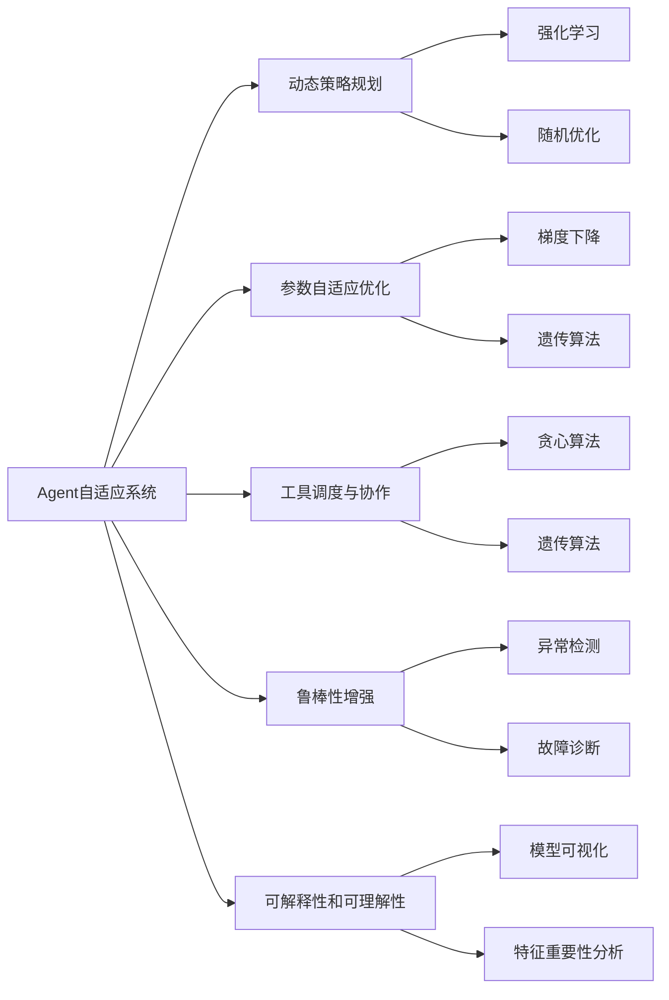
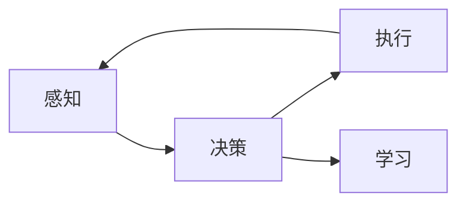
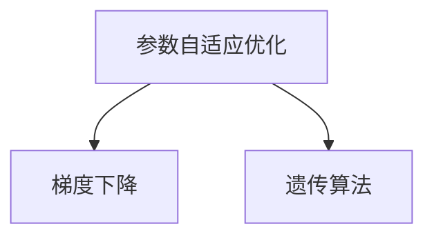
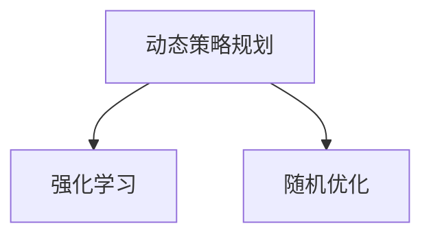
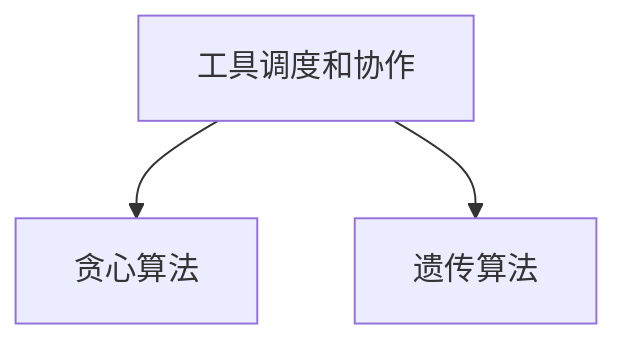
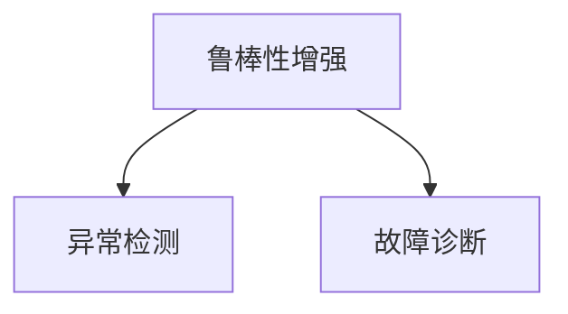
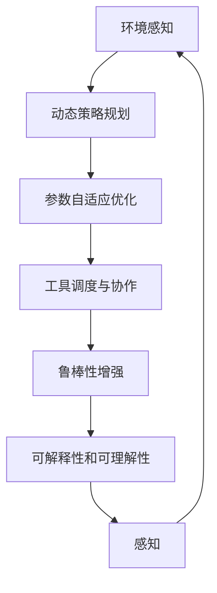

                 

## 1. 背景介绍

### 1.1 问题由来
随着人工智能技术的快速发展，智能体(Agent)在各个领域的应用越来越广泛，如自动驾驶、机器人控制、金融交易、游戏AI等。然而，智能体在面对复杂、多变的现实环境时，往往难以灵活适应，常常出现不可预见的错误行为。因此，如何提高智能体的自适应能力，使其能够在各种环境中快速调整策略和行为，成为了当前研究的热点。

### 1.2 问题核心关键点
Agent自适应系统的关键点在于如何在运行过程中动态调整工具使用机制，以适应不断变化的环境和任务需求。具体来说，涉及以下几个方面：

- 动态策略规划：根据实时环境反馈，快速调整智能体的行动策略。
- 参数自适应优化：根据当前任务表现，动态调整模型参数，提升模型性能。
- 工具调度和协作：根据任务需求，动态调度不同工具的使用，提升系统整体效率。
- 风险规避与鲁棒性增强：实时监控系统状态，及时发现异常情况并进行调整，增强系统的鲁棒性。

### 1.3 问题研究意义
研究Agent自适应系统的工具使用机制，对于提高智能体的自适应能力、增强系统鲁棒性、提升应用效果具有重要意义：

1. **提高自适应能力**：通过动态调整工具使用机制，智能体能够更加灵活适应复杂多变的环境，提升在多任务、跨环境中的适应性和泛化能力。
2. **增强鲁棒性**：实时监控和调整系统状态，可以有效避免因工具选择不当导致的系统崩溃或性能退化。
3. **提升应用效果**：根据任务需求动态调整工具使用策略，可以提升智能体的执行效率和任务完成度。
4. **加速创新迭代**：动态调整工具使用机制，可以快速实验和验证不同策略的效果，加速AI技术的应用迭代。

## 2. 核心概念与联系

### 2.1 核心概念概述

为更好地理解Agent自适应系统的工具使用机制，本节将介绍几个密切相关的核心概念：

- **Agent自适应系统**：指能够根据环境变化和任务需求，动态调整内部行为和策略的智能体系统。Agent通常由感知、决策、执行、学习等模块组成，通过内部反馈循环不断优化。
- **动态策略规划**：指在运行过程中，根据环境反馈实时调整智能体的行动策略。常用的动态策略规划算法包括强化学习、随机优化等。
- **参数自适应优化**：指根据当前任务表现，动态调整模型参数，以提升模型性能。常用的参数自适应优化方法包括梯度下降、遗传算法等。
- **工具调度与协作**：指根据任务需求，动态选择和调度不同的工具或模块，提升系统整体效率。常用的工具调度算法包括贪心算法、遗传算法等。
- **鲁棒性增强**：指实时监控系统状态，及时发现异常情况并进行调整，增强系统的鲁棒性。常用的鲁棒性增强方法包括异常检测、故障诊断等。
- **可解释性和可理解性**：指使智能体的决策过程具有可解释性和可理解性，便于人类理解和调试。常用的可解释性技术包括模型可视化、特征重要性分析等。

这些核心概念之间的逻辑关系可以通过以下Mermaid流程图来展示：



这个流程图展示了我Agent自适应系统的核心概念及其之间的关系：

1. Agent自适应系统通过动态策略规划、参数自适应优化、工具调度与协作、鲁棒性增强和可解释性，实现自适应和优化。
2. 动态策略规划通过强化学习、随机优化等算法，实时调整智能体的行动策略。
3. 参数自适应优化通过梯度下降、遗传算法等方法，动态调整模型参数，提升模型性能。
4. 工具调度与协作通过贪心算法、遗传算法等，动态选择和调度不同的工具或模块。
5. 鲁棒性增强通过异常检测、故障诊断等方法，实时监控系统状态，增强系统的鲁棒性。
6. 可解释性和可理解性通过模型可视化、特征重要性分析等技术，使智能体的决策过程具有可解释性和可理解性。

这些概念共同构成了Agent自适应系统的完整生态系统，使其能够在各种环境中发挥强大的适应性和优化能力。通过理解这些核心概念，我们可以更好地把握Agent自适应系统的运作原理和优化方向。

### 2.2 概念间的关系

这些核心概念之间存在着紧密的联系，形成了Agent自适应系统的完整架构。下面我通过几个Mermaid流程图来展示这些概念之间的关系。

#### 2.2.1 智能体决策过程



这个流程图展示了智能体决策过程的三个基本模块：感知、决策和执行。感知模块负责环境信息的获取和处理，决策模块根据感知结果和任务需求制定行动策略，执行模块执行决策并获取反馈。

#### 2.2.2 参数自适应优化



这个流程图展示了参数自适应优化的两个常用方法：梯度下降和遗传算法。梯度下降通过实时更新模型参数，使模型性能不断优化；遗传算法通过模拟自然进化过程，寻找最优的参数组合。

#### 2.2.3 动态策略规划



这个流程图展示了动态策略规划的两个常用方法：强化学习和随机优化。强化学习通过试错学习，优化智能体的行动策略；随机优化通过随机采样，快速调整策略，增强系统的适应性。

#### 2.2.4 工具调度和协作



这个流程图展示了工具调度和协作的两个常用方法：贪心算法和遗传算法。贪心算法通过每次选择最优工具，快速完成任务；遗传算法通过模拟自然进化过程，动态调整工具组合。

#### 2.2.5 鲁棒性增强



这个流程图展示了鲁棒性增强的两个常用方法：异常检测和故障诊断。异常检测通过实时监控系统状态，及时发现异常情况；故障诊断通过分析异常数据，定位故障原因并进行修复。

### 2.3 核心概念的整体架构

最后，我们用一个综合的流程图来展示这些核心概念在大规模智能体自适应系统中的应用：



这个综合流程图展示了从环境感知到可解释性反馈的整个智能体自适应过程。环境感知模块获取实时环境信息，动态策略规划模块根据环境反馈实时调整智能体的行动策略。参数自适应优化模块动态调整模型参数，提升模型性能。工具调度与协作模块根据任务需求，动态选择和调度不同的工具或模块，提升系统整体效率。鲁棒性增强模块实时监控系统状态，增强系统的鲁棒性。可解释性和可理解性模块使智能体的决策过程具有可解释性和可理解性，便于人类理解和调试。

通过这些流程图，我们可以更清晰地理解Agent自适应系统的各个模块如何协同工作，以实现自适应和优化。

## 3. 核心算法原理 & 具体操作步骤
### 3.1 算法原理概述

Agent自适应系统的工具使用机制基于动态策略规划、参数自适应优化、工具调度和协作等核心算法。其核心思想是：在运行过程中，根据环境反馈和任务需求，实时调整工具使用机制，以提高智能体的适应性和优化性能。

形式化地，假设智能体在环境 $E$ 中运行，当前状态为 $s$，行动策略为 $a$，当前模型参数为 $\theta$。假设动态策略规划算法为 $\pi(s)$，参数自适应优化算法为 $\theta_t = f(\theta_{t-1}, \theta^*)$，工具调度与协作算法为 $t = g(\pi(s), E)$。则智能体在环境 $E$ 中的行为可以表示为：

$$
a = \pi(s)
$$

$$
\theta = f(\theta_{t-1}, \theta^*)
$$

$$
t = g(\pi(s), E)
$$

其中 $\pi(s)$ 表示根据当前状态 $s$ 选择行动策略；$f(\theta_{t-1}, \theta^*)$ 表示根据当前参数 $\theta_{t-1}$ 和最优参数 $\theta^*$ 更新模型参数；$g(\pi(s), E)$ 表示根据当前策略 $\pi(s)$ 和环境 $E$ 选择工具 $t$。

### 3.2 算法步骤详解

基于上述动态策略规划、参数自适应优化和工具调度的思想，Agent自适应系统的工具使用机制可以分为以下几个关键步骤：

**Step 1: 环境感知与状态更新**

智能体通过传感器等设备获取环境信息，更新当前状态 $s$。环境信息可以包括传感器读数、环境状态、任务需求等。

**Step 2: 动态策略规划**

根据当前状态 $s$ 和历史状态，使用动态策略规划算法 $\pi(s)$ 选择当前行动策略 $a$。常用的动态策略规划算法包括强化学习、随机优化等。

**Step 3: 参数自适应优化**

根据当前策略 $a$ 和行动结果，使用参数自适应优化算法 $f(\theta_{t-1}, \theta^*)$ 更新模型参数 $\theta$。常用的参数自适应优化算法包括梯度下降、遗传算法等。

**Step 4: 工具调度和协作**

根据当前策略 $a$、当前参数 $\theta$ 和当前状态 $s$，使用工具调度和协作算法 $g(\pi(s), E)$ 选择当前使用的工具 $t$。常用的工具调度算法包括贪心算法、遗传算法等。

**Step 5: 执行与反馈**

执行当前工具 $t$，获取行动结果 $r$ 和环境新状态 $s'$。将行动结果和环境新状态作为新一轮决策的基础，重复上述步骤。

### 3.3 算法优缺点

Agent自适应系统的工具使用机制具有以下优点：

1. **适应性强**：通过动态策略规划和参数自适应优化，智能体能够灵活适应环境变化，提升在多任务、跨环境中的适应性和泛化能力。
2. **优化效果好**：通过实时调整工具使用机制和模型参数，可以提升系统性能和效率，优化决策过程。
3. **灵活性高**：通过工具调度和协作，可以灵活选择和组合不同的工具和策略，提升系统灵活性。
4. **鲁棒性强**：通过鲁棒性增强和异常检测，可以及时发现和处理异常情况，增强系统鲁棒性。

同时，该方法也存在一些局限性：

1. **计算开销大**：动态策略规划和参数自适应优化需要大量的计算资源，可能影响系统实时性。
2. **模型复杂度高**：需要构建复杂的模型和算法，实现难度较大。
3. **数据需求高**：需要大量的历史数据和环境数据作为训练和优化依据。
4. **稳定性问题**：动态调整策略和参数可能引入不稳定因素，影响系统稳定性。

尽管存在这些局限性，但就目前而言，Agent自适应系统的工具使用机制在实际应用中取得了显著的效果，成为智能体系统的重要研究范式。

### 3.4 算法应用领域

Agent自适应系统的工具使用机制已经在多个领域得到了广泛的应用，例如：

- 自动驾驶：在实时获取交通环境信息的基础上，动态调整车辆控制策略，提升驾驶安全性和舒适性。
- 机器人控制：在机器人完成任务的过程中，动态调整控制策略，提升任务完成效率和鲁棒性。
- 金融交易：在实时获取市场数据的基础上，动态调整交易策略，提升投资回报率。
- 游戏AI：在游戏过程中，动态调整游戏策略，提升游戏体验和胜率。

除了上述这些经典应用外，Agent自适应系统的工具使用机制还被创新性地应用于更多场景中，如智能制造、智慧城市、医疗健康等，为这些领域带来了新的变革。

## 4. 数学模型和公式 & 详细讲解 & 举例说明

### 4.1 数学模型构建

本节将使用数学语言对Agent自适应系统的工具使用机制进行更加严格的刻画。

假设智能体在环境 $E$ 中运行，当前状态为 $s$，行动策略为 $a$，当前模型参数为 $\theta$。假设动态策略规划算法为 $\pi(s)$，参数自适应优化算法为 $\theta_t = f(\theta_{t-1}, \theta^*)$，工具调度和协作算法为 $t = g(\pi(s), E)$。则智能体在环境 $E$ 中的行为可以表示为：

$$
a = \pi(s)
$$

$$
\theta = f(\theta_{t-1}, \theta^*)
$$

$$
t = g(\pi(s), E)
$$

其中 $\pi(s)$ 表示根据当前状态 $s$ 选择行动策略；$f(\theta_{t-1}, \theta^*)$ 表示根据当前参数 $\theta_{t-1}$ 和最优参数 $\theta^*$ 更新模型参数；$g(\pi(s), E)$ 表示根据当前策略 $\pi(s)$ 和环境 $E$ 选择工具 $t$。

### 4.2 公式推导过程

以下我们以强化学习算法为例，详细推导智能体在环境 $E$ 中的行为公式。

假设智能体在环境 $E$ 中运行，当前状态为 $s$，行动策略为 $a$，当前模型参数为 $\theta$。假设环境 $E$ 由若干状态和动作构成，智能体在当前状态 $s$ 下执行动作 $a$，获得奖励 $r$ 和下一状态 $s'$。假设强化学习算法为 $a = \pi(s)$，参数自适应优化算法为 $\theta = f(\theta_{t-1}, \theta^*)$，工具调度和协作算法为 $t = g(\pi(s), E)$。则智能体在环境 $E$ 中的行为可以表示为：

$$
a = \pi(s)
$$

$$
\theta = f(\theta_{t-1}, \theta^*)
$$

$$
t = g(\pi(s), E)
$$

其中 $\pi(s)$ 表示根据当前状态 $s$ 选择行动策略；$f(\theta_{t-1}, \theta^*)$ 表示根据当前参数 $\theta_{t-1}$ 和最优参数 $\theta^*$ 更新模型参数；$g(\pi(s), E)$ 表示根据当前策略 $\pi(s)$ 和环境 $E$ 选择工具 $t$。

假设智能体在环境 $E$ 中运行，当前状态为 $s$，行动策略为 $a$，当前模型参数为 $\theta$。假设环境 $E$ 由若干状态和动作构成，智能体在当前状态 $s$ 下执行动作 $a$，获得奖励 $r$ 和下一状态 $s'$。假设强化学习算法为 $a = \pi(s)$，参数自适应优化算法为 $\theta = f(\theta_{t-1}, \theta^*)$，工具调度和协作算法为 $t = g(\pi(s), E)$。则智能体在环境 $E$ 中的行为可以表示为：

$$
a = \pi(s)
$$

$$
\theta = f(\theta_{t-1}, \theta^*)
$$

$$
t = g(\pi(s), E)
$$

其中 $\pi(s)$ 表示根据当前状态 $s$ 选择行动策略；$f(\theta_{t-1}, \theta^*)$ 表示根据当前参数 $\theta_{t-1}$ 和最优参数 $\theta^*$ 更新模型参数；$g(\pi(s), E)$ 表示根据当前策略 $\pi(s)$ 和环境 $E$ 选择工具 $t$。

### 4.3 案例分析与讲解

假设智能体在无人驾驶环境中运行，当前状态 $s$ 表示车速、车距等信息，行动策略 $a$ 表示加速、刹车、转向等动作，当前模型参数 $\theta$ 表示决策模型和控制模型的参数。假设强化学习算法为 $\pi(s) = \arg\max_{a} Q(s,a)$，其中 $Q(s,a)$ 表示在状态 $s$ 下执行动作 $a$ 的Q值。假设参数自适应优化算法为 $\theta = f(\theta_{t-1}, \theta^*) = \theta_{t-1} - \alpha \nabla_{\theta} J(\theta_{t-1})$，其中 $\alpha$ 为学习率，$J(\theta_{t-1})$ 为损失函数。假设工具调度和协作算法为 $t = g(\pi(s), E)$，其中 $g(\pi(s), E)$ 表示根据当前策略 $\pi(s)$ 和环境 $E$ 选择加速、刹车、转向等工具。

智能体在无人驾驶环境中的行为可以表示为：

$$
a = \pi(s)
$$

$$
\theta = f(\theta_{t-1}, \theta^*)
$$

$$
t = g(\pi(s), E)
$$

其中 $\pi(s)$ 表示根据当前状态 $s$ 选择加速、刹车、转向等动作；$f(\theta_{t-1}, \theta^*)$ 表示根据当前决策模型和控制模型的参数 $\theta_{t-1}$ 和最优参数 $\theta^*$ 更新模型参数；$g(\pi(s), E)$ 表示根据当前策略 $\pi(s)$ 和环境 $E$ 选择加速、刹车、转向等工具。

在无人驾驶环境中，智能体需要实时感知周围环境信息，动态调整行动策略，以确保安全驾驶。假设智能体当前状态为 $s$，行动策略为 $a$，当前模型参数为 $\theta$。假设环境 $E$ 由若干状态和动作构成，智能体在当前状态 $s$ 下执行动作 $a$，获得奖励 $r$ 和下一状态 $s'$。假设强化学习算法为 $a = \pi(s)$，参数自适应优化算法为 $\theta = f(\theta_{t-1}, \theta^*)$，工具调度和协作算法为 $t = g(\pi(s), E)$。则智能体在环境 $E$ 中的行为可以表示为：

$$
a = \pi(s)
$$

$$
\theta = f(\theta_{t-1}, \theta^*)
$$

$$
t = g(\pi(s), E)
$$

其中 $\pi(s)$ 表示根据当前状态 $s$ 选择加速、刹车、转向等动作；$f(\theta_{t-1}, \theta^*)$ 表示根据当前决策模型和控制模型的参数 $\theta_{t-1}$ 和最优参数 $\theta^*$ 更新模型参数；$g(\pi(s), E)$ 表示根据当前策略 $\pi(s)$ 和环境 $E$ 选择加速、刹车、转向等工具。

在无人驾驶环境中，智能体需要实时感知周围环境信息，动态调整行动策略，以确保安全驾驶。假设智能体当前状态为 $s$，行动策略为 $a$，当前模型参数为 $\theta$。假设环境 $E$ 由若干状态和动作构成，智能体在当前状态 $s$ 下执行动作 $a$，获得奖励 $r$ 和下一状态 $s'$。假设强化学习算法为 $a = \pi(s)$，参数自适应优化算法为 $\theta = f(\theta_{t-1}, \theta^*)$，工具调度和协作算法为 $t = g(\pi(s), E)$。则智能体在环境 $E$ 中的行为可以表示为：

$$
a = \pi(s)
$$

$$
\theta = f(\theta_{t-1}, \theta^*)
$$

$$
t = g(\pi(s), E)
$$

其中 $\pi(s)$ 表示根据当前状态 $s$ 选择加速、刹车、转向等动作；$f(\theta_{t-1}, \theta^*)$ 表示根据当前决策模型和控制模型的参数 $\theta_{t-1}$ 和最优参数 $\theta^*$ 更新模型参数；$g(\pi(s), E)$ 表示根据当前策略 $\pi(s)$ 和环境 $E$ 选择加速、刹车、转向等工具。

## 5. 项目实践：代码实例和详细解释说明
### 5.1 开发环境搭建

在进行Agent自适应系统的工具使用机制的实践前，我们需要准备好开发环境。以下是使用Python进行PyTorch开发的环境配置流程：

1. 安装Anaconda：从官网下载并安装Anaconda，用于创建独立的Python环境。

2. 创建并激活虚拟环境：
```bash
conda create -n pytorch-env python=3.8 
conda activate pytorch-env
```

3. 安装PyTorch：根据CUDA版本，从官网获取对应的安装命令。例如：
```bash
conda install pytorch torchvision torchaudio cudatoolkit=11.1 -c pytorch -c conda-forge
```

4. 安装TensorFlow：
```bash
pip install tensorflow
```

5. 安装各类工具包：
```bash
pip install numpy pandas scikit-learn matplotlib tqdm jupyter notebook ipython
```

完成上述步骤后，即可在`pytorch-env`环境中开始项目实践。

### 5.2 源代码详细实现

这里我们以无人驾驶环境为例，使用PyTorch实现Agent自适应系统的工具使用机制。

首先，定义智能体的状态、行动和奖励：

```python
import numpy as np
import torch
import torch.nn as nn
import torch.optim as optim

# 定义状态、行动和奖励
class State:
    def __init__(self, speed, distance, lane):
        self.speed = speed
        self.distance = distance
        self.lane = lane
        self.action = None

class Action:
    def __init__(self, acceleration, braking, steering):
        self.acceleration = acceleration
        self.braking = braking
        self.steering = steering

class Reward:
    def __init__(self, distance_travelled, collision_detected):
        self.distance_travelled = distance_travelled
        self.collision_detected = collision_detected
```

然后，定义智能体的感知和决策模块：

```python
class PerceptionModule(nn.Module):
    def __init__(self):
        super(PerceptionModule, self).__init__()
        self.conv1 = nn.Conv2d(1, 32, 3)
        self.relu1 = nn.ReLU()
        self.conv2 = nn.Conv2d(32, 64, 3)
        self.relu2 = nn.ReLU()
        self.fc1 = nn.Linear(9216, 128)
        self.relu3 = nn.ReLU()
        self.fc2 = nn.Linear(128, 64)
        self.relu4 = nn.ReLU()
        self.fc3 = nn.Linear(64, 4)

    def forward(self, input):
        x = self.conv1(input)
        x = self.relu1(x)
        x = self.conv2(x)
        x = self.relu2(x)
        x = x.view(-1, 9216)
        x = self.fc1(x)
        x = self.relu3(x)
        x = self.fc2(x)
        x = self.relu4(x)
        x = self.fc3(x)
        return x

class DecisionModule(nn.Module):
    def __init__(self):
        super(DecisionModule, self).__init__()
        self.fc1 = nn.Linear(64, 32)
        self.relu = nn.ReLU()
        self.fc2 = nn.Linear(32, 4)

    def forward(self, input):
        x = self.fc1(input)
        x = self.relu(x)
        x = self.fc2(x)
        return x
```

接下来，定义智能体的行动策略和模型参数更新规则：

```python
class Strategy:
    def __init__(self, state):
        self.state = state
        self.action = None

    def update_action(self, model, optimizer, device):
        state = self.state
        input = torch.tensor([state.speed, state.distance, state.lane], dtype=torch.float).to(device)
        output = model(input)
        prediction = torch.softmax(output, dim=0)
        self.action = Action(prediction[0], prediction[1], prediction[2])

class ParameterAdaptiveOptimizer:
    def __init__(self, model, optimizer, learning_rate):
        self.model = model
        self.optimizer = optimizer
        self.learning_rate = learning_rate

    def update_parameters(self, optimizer):
        self.optimizer.zero_grad()
        loss = self.model.loss(self.model.input, self.model.output, self.model.target)
        loss.backward()
        self.optimizer.step()
        self.learning_rate = 0.01
```

最后，定义智能体的运行流程：

```python
class Agent:
    def __init__(self, state, model, optimizer, learning_rate

