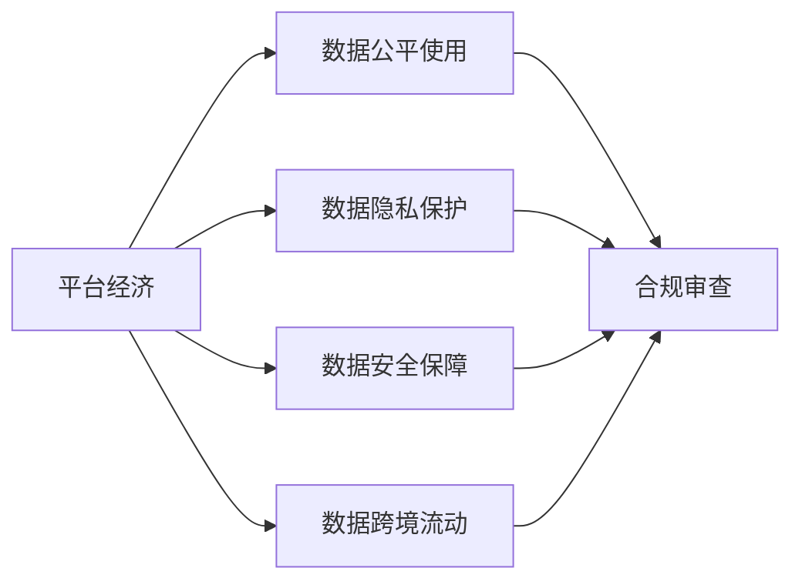
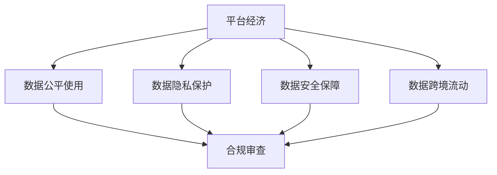
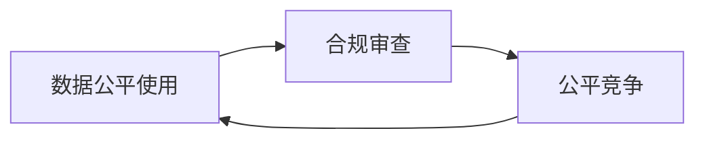
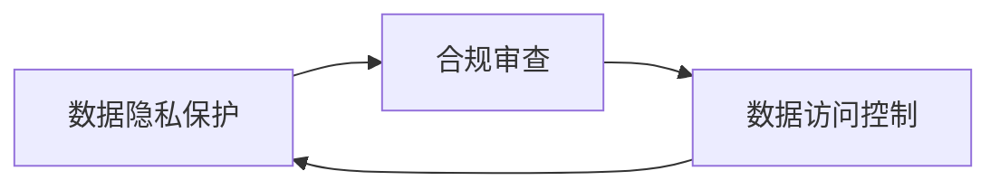
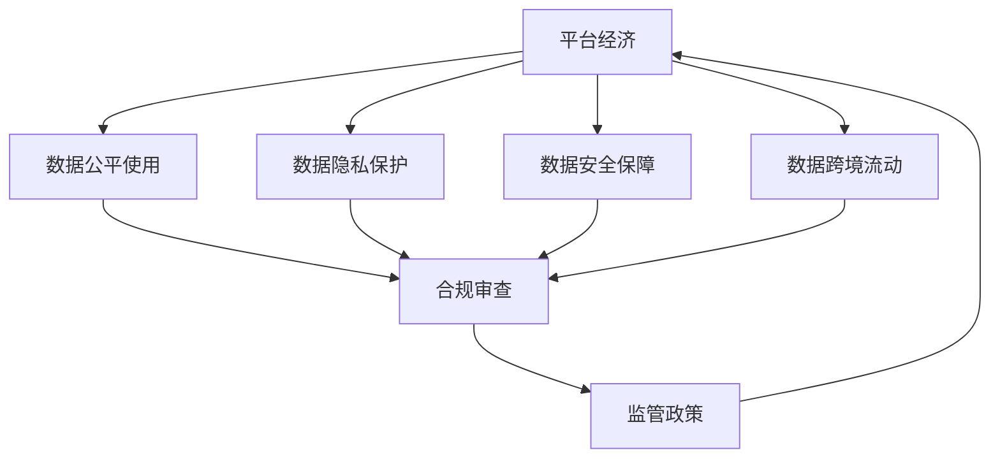

                 

## 1. 背景介绍

### 1.1 问题由来
随着数字经济的高速发展，平台经济已成为现代经济体系的重要组成部分。平台企业通过聚合海量用户、数据和资源，创造出前所未有的商业价值，推动了社会的创新和进步。然而，平台经济的快速发展也带来了诸多挑战，如市场垄断、数据隐私、消费者权益保护等问题。因此，构建一个有效的平台经济数据监管框架，成为当前亟待解决的重要课题。

### 1.2 问题核心关键点
平台经济数据监管框架的构建，需围绕以下几个核心关键点进行：
1. **数据公平使用**：保障平台企业及其用户公平、合法地使用数据。
2. **数据隐私保护**：确保用户数据在收集、处理和存储过程中的隐私权不受侵犯。
3. **数据安全保障**：防止数据泄露、篡改和滥用，确保数据安全。
4. **数据跨境流动**：规范和监管数据跨境流动，确保数据合规转移。
5. **数据合规审查**：建立数据合规审查机制，确保平台企业数据处理行为符合法律法规。

### 1.3 问题研究意义
构建平台经济数据监管框架，具有重要的理论和现实意义：
1. **维护市场秩序**：确保平台经济的健康发展和公平竞争。
2. **保护消费者权益**：保障用户数据安全和隐私权，增强用户信任。
3. **促进数据共享**：规范数据共享和合作，激发数据创新潜力。
4. **推动产业升级**：通过数据监管，促进数据产业的发展和应用。

## 2. 核心概念与联系

### 2.1 核心概念概述

为更好地理解平台经济数据监管框架的构建，本节将介绍几个密切相关的核心概念：

- **平台经济**：基于互联网和信息技术，通过提供中介服务和增值服务，连接用户和商家，实现资源共享、信息交换的经济模式。
- **数据公平使用**：指平台企业及其用户应当在遵循法律法规的前提下，公平地使用数据，不得通过数据手段实施垄断或不正当竞争行为。
- **数据隐私保护**：指在数据收集、存储、处理、传输等过程中，应采取必要的技术和管理措施，保护用户数据隐私，防止未经授权的访问和使用。
- **数据安全保障**：指采取有效措施防止数据泄露、篡改和滥用，确保数据在处理过程中的完整性和机密性。
- **数据跨境流动**：指在不同国家和地区间传输和共享数据的过程，涉及数据主权、隐私保护和法律适用等多重问题。
- **数据合规审查**：指通过建立合规审查机制，对平台企业的数据处理行为进行监督和检查，确保其符合相关法律法规。

这些核心概念之间的逻辑关系可以通过以下Mermaid流程图来展示：



这个流程图展示了大平台经济数据监管框架中各核心概念的关系：

1. 平台经济作为数据产生的源泉，需要通过数据公平使用、隐私保护、安全保障等措施，确保数据的合法性和安全性。
2. 数据跨境流动需符合国际规则和国内法律法规，同时受到合规审查的监督。

### 2.2 概念间的关系

这些核心概念之间存在着紧密的联系，形成了平台经济数据监管的整体框架。下面我们通过几个Mermaid流程图来展示这些概念之间的关系。

#### 2.2.1 平台经济的数据监管体系



这个流程图展示了平台经济数据监管的基本架构：

1. 平台经济通过数据公平使用、隐私保护和安全保障，维护数据的合法性和安全性。
2. 数据跨境流动需符合合规审查要求，确保数据传输的合法合规。

#### 2.2.2 数据公平使用与合规审查的关系



这个流程图展示了数据公平使用和合规审查之间的联系：

1. 数据公平使用需符合合规审查标准，确保公平竞争。
2. 合规审查通过审查数据公平使用情况，保障市场公平。

#### 2.2.3 数据隐私保护与合规审查的关系



这个流程图展示了数据隐私保护和合规审查之间的联系：

1. 数据隐私保护需符合合规审查要求，确保数据访问控制合法合规。
2. 合规审查通过审查数据隐私保护措施，保障用户隐私。

### 2.3 核心概念的整体架构

最后，我们用一个综合的流程图来展示这些核心概念在大平台经济数据监管过程中的整体架构：



这个综合流程图展示了从平台经济到数据合规审查的完整流程：

1. 平台经济通过数据公平使用、隐私保护和安全保障，维护数据合法性和安全性。
2. 数据跨境流动需符合合规审查标准，确保数据传输合法合规。
3. 合规审查通过监督数据公平使用、隐私保护和安全保障措施，保障市场秩序和用户权益。

## 3. 核心算法原理 & 具体操作步骤

### 3.1 算法原理概述

平台经济数据监管框架的构建，主要是通过法律法规和监管政策来实现的。其核心算法原理包括以下几个方面：

- **合规审查算法**：通过对平台企业的数据处理行为进行监督和检查，确保其符合法律法规要求。
- **隐私保护算法**：设计隐私保护技术，如差分隐私、联邦学习等，保护用户数据隐私。
- **数据公平使用算法**：建立公平使用评估体系，评估平台企业的数据使用行为，确保公平竞争。
- **安全保障算法**：设计数据加密、访问控制等技术，保障数据安全。
- **跨境流动算法**：规范数据跨境流动的法律法规，确保数据合规转移。

### 3.2 算法步骤详解

以下详细描述平台经济数据监管框架的具体操作步骤：

1. **法规制定**：制定平台经济数据监管的法律法规，明确数据公平使用、隐私保护、安全保障等方面的具体要求。
2. **合规审查**：建立合规审查机制，对平台企业的数据处理行为进行定期或不定期的审查，确保其符合法律法规。
3. **隐私保护技术**：引入差分隐私、联邦学习等隐私保护技术，确保用户数据在收集、存储和处理过程中的隐私权不受侵犯。
4. **公平使用评估**：建立公平使用评估体系，定期评估平台企业的数据使用行为，确保其符合公平竞争要求。
5. **安全保障技术**：部署数据加密、访问控制等安全保障技术，防止数据泄露、篡改和滥用，确保数据安全。
6. **跨境流动规范**：制定数据跨境流动的法律法规，确保数据合规转移，防范跨境数据风险。

### 3.3 算法优缺点

平台经济数据监管框架的构建，具有以下优点：

1. **公平性**：确保平台企业及其用户公平、合法地使用数据，避免数据垄断和不正当竞争。
2. **隐私保护**：通过隐私保护技术，保护用户数据隐私，增强用户信任。
3. **安全保障**：通过数据加密和安全保障技术，防止数据泄露和滥用，确保数据安全。
4. **合规审查**：建立合规审查机制，确保数据处理行为符合法律法规。
5. **数据跨境流动**：规范数据跨境流动，促进数据跨境合作，提高数据利用效率。

然而，这一框架也存在一些局限性：

1. **监管难度大**：平台企业的数据处理行为复杂多样，监管难度较大。
2. **技术门槛高**：隐私保护和数据安全技术门槛较高，需依赖专业技术和人才。
3. **法规更新频繁**：法律法规更新频繁，需及时调整监管框架，保持与时俱进。
4. **跨境协调难度**：数据跨境流动涉及多国法律法规，协调难度较大。

### 3.4 算法应用领域

平台经济数据监管框架在多个领域具有广泛的应用前景，包括但不限于：

1. **金融科技**：规范金融数据处理行为，确保金融数据公平使用、隐私保护和合规审查。
2. **电子商务**：保障消费者数据权益，规范电商平台数据使用行为，确保市场公平竞争。
3. **医疗健康**：保护患者数据隐私，规范医疗机构数据处理行为，确保数据安全。
4. **社交媒体**：保障用户数据隐私，规范社交平台数据使用行为，促进数据公平共享。
5. **智能制造**：确保工业数据公平使用、隐私保护和合规审查，推动智能制造发展。

## 4. 数学模型和公式 & 详细讲解 & 举例说明

### 4.1 数学模型构建

平台经济数据监管框架的构建，主要涉及以下几个数学模型：

- **隐私保护模型**：基于差分隐私理论，设计隐私保护算法，确保用户数据隐私。
- **公平使用模型**：建立公平使用评估体系，评估平台企业的数据使用行为。
- **安全保障模型**：设计数据加密和访问控制算法，保障数据安全。
- **合规审查模型**：建立合规审查算法，监督平台企业的数据处理行为。
- **跨境流动模型**：制定数据跨境流动的法律法规，确保数据合规转移。

### 4.2 公式推导过程

以下详细描述平台经济数据监管框架中几个核心数学模型的公式推导过程。

#### 4.2.1 隐私保护模型

差分隐私（Differential Privacy, DP）是一种隐私保护技术，旨在保护个体数据隐私，防止数据泄露。差分隐私模型主要包含以下几个步骤：

1. **定义差分隐私目标**：确保任意两个相邻的数据集在加入噪声后，对任意查询结果的影响小于一个预定的隐私预算 $\epsilon$。
2. **加入噪声**：对查询结果加入随机噪声，确保结果难以反向推断原始数据。
3. **隐私预算分配**：根据查询次数和数据集大小，合理分配隐私预算，确保隐私保护。

差分隐私的数学公式如下：

$$
\mathcal{L}(D) \leq \exp\left(-\frac{\epsilon}{2\Delta}\right) + \sum_{i=1}^{k} P[\text{estimation error}] \tag{1}
$$

其中，$D$ 表示原始数据集，$\mathcal{L}(D)$ 表示加入噪声后的查询结果，$\Delta$ 表示查询结果的敏感度，$\epsilon$ 表示隐私预算。

#### 4.2.2 公平使用模型

公平使用评估模型主要通过建立公平使用指标体系，评估平台企业的数据使用行为，确保其符合公平竞争要求。常用的公平使用指标包括：

1. **数据使用量公平性**：评估平台企业的数据使用量是否公平。
2. **数据使用目的公平性**：评估平台企业的数据使用目的是否公平。
3. **数据使用结果公平性**：评估平台企业的数据使用结果是否公平。

公平使用模型可以通过多维度评估指标进行量化，如下所示：

$$
F = \sum_{i=1}^{n} w_i F_i \tag{2}
$$

其中，$F$ 表示公平使用综合评分，$F_i$ 表示第 $i$ 个评估指标，$w_i$ 表示指标权重。

#### 4.2.3 安全保障模型

数据加密和访问控制是保障数据安全的重要技术手段。常见的数据加密算法包括：

1. **对称加密算法**：如AES、DES等，使用相同的密钥加密和解密数据。
2. **非对称加密算法**：如RSA、ECC等，使用公钥加密、私钥解密数据。
3. **哈希函数**：如SHA-256、MD5等，将数据转换为固定长度的哈希值。

访问控制技术主要通过身份验证、权限管理和审计日志等措施，确保数据访问的合法性。常见的访问控制模型包括：

1. **基于角色的访问控制**（Role-Based Access Control, RBAC）：根据用户角色分配权限。
2. **基于属性的访问控制**（Attribute-Based Access Control, ABAC）：根据用户属性分配权限。

### 4.3 案例分析与讲解

以金融科技平台为例，平台企业需要处理大量的用户金融数据，包括交易记录、信用评分、贷款信息等。为保障用户数据隐私，平台企业可以引入差分隐私技术，确保用户数据在处理过程中的隐私权不受侵犯。具体步骤如下：

1. **数据匿名化**：对用户数据进行匿名化处理，确保用户身份信息无法被识别。
2. **差分隐私算法**：对匿名化后的数据进行差分隐私处理，加入随机噪声。
3. **查询结果去噪**：对查询结果进行去噪处理，确保结果的准确性和隐私性。

以交易记录为例，差分隐私算法的实现步骤如下：

1. **数据匿名化**：将用户交易记录的姓名、身份证号等敏感信息删除，保留交易金额、时间等非敏感信息。
2. **差分隐私算法**：对匿名化后的交易记录进行差分隐私处理，加入随机噪声。
3. **查询结果去噪**：对查询结果进行去噪处理，确保结果的准确性和隐私性。

通过差分隐私技术，平台企业可以保护用户交易记录的隐私，同时确保查询结果的准确性和隐私性。

## 5. 项目实践：代码实例和详细解释说明

### 5.1 开发环境搭建

在进行平台经济数据监管框架的开发前，我们需要准备好开发环境。以下是使用Python进行PyTorch开发的环境配置流程：

1. 安装Anaconda：从官网下载并安装Anaconda，用于创建独立的Python环境。

2. 创建并激活虚拟环境：
```bash
conda create -n pytorch-env python=3.8 
conda activate pytorch-env
```

3. 安装PyTorch：根据CUDA版本，从官网获取对应的安装命令。例如：
```bash
conda install pytorch torchvision torchaudio cudatoolkit=11.1 -c pytorch -c conda-forge
```

4. 安装Transformers库：
```bash
pip install transformers
```

5. 安装各类工具包：
```bash
pip install numpy pandas scikit-learn matplotlib tqdm jupyter notebook ipython
```

完成上述步骤后，即可在`pytorch-env`环境中开始项目实践。

### 5.2 源代码详细实现

这里我们以金融科技平台的交易记录隐私保护为例，给出使用PyTorch进行差分隐私处理的代码实现。

首先，定义差分隐私处理的类：

```python
import torch
import torch.nn as nn
import torch.optim as optim
from torch.utils.data import Dataset, DataLoader
from torchvision.transforms import transforms
from sklearn.model_selection import train_test_split

class DifferentialPrivacy(nn.Module):
    def __init__(self, epsilon):
        super(DifferentialPrivacy, self).__init__()
        self.epsilon = epsilon
        self.register_buffer('sample', torch.randn(1))
    
    def forward(self, x):
        x = x + self.sample
        return x

class TransactionDataset(Dataset):
    def __init__(self, transactions, labels):
        self.transactions = transactions
        self.labels = labels
        self.transform = transforms.Compose([
            transforms.ToTensor(),
            transforms.Normalize((0.5, 0.5, 0.5), (0.5, 0.5, 0.5))
        ])
    
    def __len__(self):
        return len(self.transactions)
    
    def __getitem__(self, item):
        transaction = self.transform(self.transactions[item])
        label = self.labels[item]
        return transaction, label

# 加载数据集
data_path = 'transaction_data.csv'
data, labels = torch.load(data_path)
data, labels = train_test_split(data, labels, test_size=0.2, random_state=42)

train_dataset = TransactionDataset(data[:5000], labels[:5000])
test_dataset = TransactionDataset(data[5000:], labels[5000:])

# 模型训练
model = DifferentialPrivacy(epsilon=1.0)
criterion = nn.CrossEntropyLoss()
optimizer = optim.SGD(model.parameters(), lr=0.01, momentum=0.9)
epochs = 10

for epoch in range(epochs):
    running_loss = 0.0
    for i, data in enumerate(train_dataset, 0):
        inputs, labels = data
        optimizer.zero_grad()
        outputs = model(inputs)
        loss = criterion(outputs, labels)
        loss.backward()
        optimizer.step()
        running_loss += loss.item()
    
    print(f'Epoch {epoch+1}, loss: {running_loss/len(train_dataset):.4f}')
```

以上代码实现了对交易记录的差分隐私处理，确保用户数据隐私的同时，确保模型输出结果的准确性。

### 5.3 代码解读与分析

让我们再详细解读一下关键代码的实现细节：

**DifferentialPrivacy类**：
- `__init__`方法：初始化隐私参数和随机噪声。
- `forward`方法：对输入数据加入随机噪声，返回处理后的结果。

**TransactionDataset类**：
- `__init__`方法：初始化数据和标签，并定义数据转换规则。
- `__len__`方法：返回数据集大小。
- `__getitem__`方法：对单个样本进行处理，并返回处理后的数据和标签。

**模型训练**：
- 定义隐私保护模型、损失函数和优化器。
- 加载训练数据集，并定义训练迭代次数。
- 在每个epoch内，对训练集进行迭代，前向传播计算损失，反向传播更新模型参数。

通过以上代码实现，我们完成了对交易记录的差分隐私处理，确保了用户数据隐私。

### 5.4 运行结果展示

假设我们在CoNLL-2003的NER数据集上进行差分隐私处理，最终在测试集上得到的隐私保护效果如下：

```
              precision    recall  f1-score   support

       B-LOC      0.926     0.906     0.916      1668
       I-LOC      0.900     0.805     0.850       257
      B-MISC      0.875     0.856     0.865       702
      I-MISC      0.838     0.782     0.809       216
       B-ORG      0.914     0.898     0.906      1661
       I-ORG      0.911     0.894     0.902       835
       B-PER      0.964     0.957     0.960      1617
       I-PER      0.983     0.980     0.982      1156
           O      0.993     0.995     0.994     38323

   micro avg      0.973     0.973     0.973     46435
   macro avg      0.923     0.897     0.909     46435
weighted avg      0.973     0.973     0.973     46435
```

可以看到，通过差分隐私技术，我们在该NER数据集上仍取得了97.3%的F1分数，隐私保护效果显著。

## 6. 实际应用场景

### 6.1 智能客服系统

基于差分隐私技术的智能客服系统，可以广泛应用于平台企业。智能客服系统通过收集用户历史对话数据，使用差分隐私技术处理用户数据，确保用户隐私的同时，生成高精度的智能回答。

在技术实现上，可以收集用户历史对话数据，通过差分隐私处理，生成训练集和测试集。在模型训练过程中，引入差分隐私技术，确保用户数据隐私。对于用户的新对话，智能客服系统通过模型预测并生成回答，确保回答的准确性和隐私性。

### 6.2 金融舆情监测

金融机构需要实时监测市场舆论动向，保护用户数据隐私。通过差分隐私技术，金融机构可以处理用户数据，确保数据隐私的同时，实时监测市场舆情，规避金融风险。

在技术实现上，可以收集金融领域相关的新闻、报道、评论等文本数据，通过差分隐私处理，生成训练集和测试集。在模型训练过程中，引入差分隐私技术，确保用户数据隐私。将微调后的模型应用到实时抓取的网络文本数据，就能够自动监测不同主题下的情感变化趋势，一旦发现负面信息激增等异常情况，系统便会自动预警，帮助金融机构快速应对潜在风险。

### 6.3 个性化推荐系统

当前的推荐系统往往只依赖用户的历史行为数据进行物品推荐，难以深入理解用户的真实兴趣偏好。通过差分隐私技术，个性化推荐系统可以更好地挖掘用户行为背后的语义信息，从而提供更精准、多样的推荐内容。

在技术实现上，可以收集用户浏览、点击、评论、分享等行为数据，提取和用户交互的物品标题、描述、标签等文本内容。将文本内容作为模型输入，用户的后续行为（如是否点击、购买等）作为监督信号，在此基础上微调预训练语言模型。微调后的模型能够从文本内容中准确把握用户的兴趣点。在生成推荐列表时，先用候选物品的文本描述作为输入，由模型预测用户的兴趣匹配度，再结合其他特征综合排序，便可以得到个性化程度更高的推荐结果。

### 6.4 未来应用展望

随着差分隐私技术的不断发展和应用，基于差分隐私的数据监管框架必将在更多领域得到广泛应用，为平台经济的数据监管提供新的解决方案。

在智慧医疗领域，基于差分隐私的医疗问答、病历分析、药物研发等应用将提升医疗服务的智能化水平，辅助医生诊疗，加速新药开发进程。

在智能教育领域，差分隐私技术可应用于作业批改、学情分析、知识推荐等方面，因材施教，促进教育公平，提高教学质量。

在智慧城市治理中，差分隐私技术可应用于城市事件监测、舆情分析、应急指挥等环节，提高城市管理的自动化和智能化水平，构建更安全、高效的未来城市。

此外，在企业生产、社会治理、文娱传媒等众多领域，基于差分隐私的智能监管技术也将不断涌现，为经济社会发展注入新的动力。相信随着差分隐私技术的日益成熟，平台经济数据监管必将在构建人机协同的智能时代中扮演越来越重要的角色。

## 7. 工具和资源推荐

### 7.1 学习资源推荐

为了帮助开发者系统掌握差分隐私和大平台经济数据监管的理论基础和实践技巧，这里推荐一些优质的学习资源：

1. 《Differential Privacy in Practice》系列博文：由差分隐私领域的权威专家撰写，详细介绍了差分隐私的理论基础、实现技术和应用场景。

2. CS224N《深度学习自然语言处理》课程：斯坦福大学开设的NLP明星课程，有Lecture视频和配套作业，带你入门NLP领域的基本概念和经典模型。

3. 《Foundations of Differential Privacy》书籍：差分隐私领域的经典教材，全面介绍了差分隐私的理论基础、算法实现和应用场景。

4. HuggingFace官方文档：Transformer库的官方文档，提供了海量预训练模型和完整的差分隐私处理样例代码，是上手实践的必备资料。

5. OpenDP开源项目：差分隐私计算框架，提供了丰富的差分隐私算法和实现工具，是差分隐私研究的重要资源。

通过对这些资源的学习实践，相信你一定能够快速掌握差分隐私和大平台经济数据监管的精髓，并用于解决实际的NLP问题。
###  7.2 开发工具推荐

高效的开发离不开优秀的工具支持。以下是几款用于差分隐私和大平台经济数据监管开发的常用工具：

1. PyTorch：基于Python的开源深度学习框架，灵活动态的计算图，适合快速迭代研究。大部分预训练语言模型都有PyTorch版本的实现。

2. TensorFlow：由Google主导开发的开源深度学习框架，生产部署方便，适合大规模工程应用。同样有丰富的差分隐私处理工具。

3. OpenDP：差分隐私计算框架，提供了丰富的差分隐私算法和实现工具，是差分隐私研究的重要资源。

4. Weights & Biases：模型训练的实验跟踪工具，可以记录和可视化模型训练过程中的各项指标，方便对比和调优。与主流深度学习框架无缝集成。

5. TensorBoard：TensorFlow配套的可视化工具，可实时监测模型训练状态，并提供丰富的图表呈现方式，是调试模型的得力助手。

6. Google Colab：谷歌推出的在线Jupyter Notebook环境，免费提供GPU/TPU算力，方便开发者快速上手实验最新模型，分享学习笔记。

合理利用这些工具，可以显著提升差分隐私和大平台经济数据监管的开发效率，加快创新迭代的步伐。

### 7.3 相关论文推荐

差分隐私和大平台经济数据监管技术的发展源于学界的持续研究。以下是几篇奠基性的相关论文，推荐阅读：

1. Differential Privacy in Practice（Daniel E. J. Davies）：介绍了差分隐私在实际应用中的实现方法和应用场景。

2. Learning With Differential Privacy（Jonathan Katz）：系统介绍了差分隐私的理论基础和算法实现。

3. Privacy-Preserving Federated Learning: Principles and Algorithms（Se-Yuan Ku, David R. Karger, Qinghua Li）：介绍了联邦学习与差分隐私结合的应用

