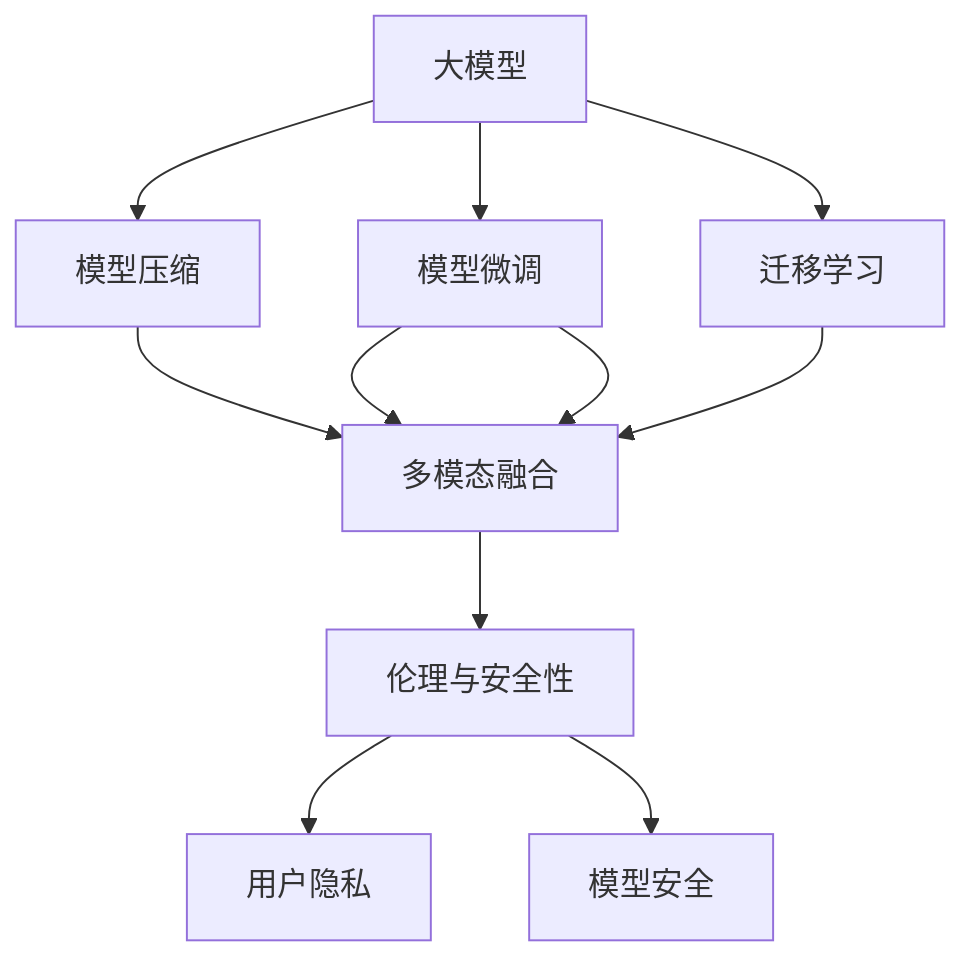

                 

# 2023年AI大模型时代的新变革

2023年，人工智能大模型迎来了新的变革。随着技术的不断进步和应用场景的日益多样化，大模型正在逐步从实验室走向实用化，推动着各行各业的数字化转型。本文将深入探讨2023年AI大模型时代的最新进展和变革趋势，提供系统化的技术指南和未来展望。

## 1. 背景介绍

### 1.1 问题由来

人工智能大模型（AI Large Model）的兴起，源自于深度学习技术的发展。特别是近年来，以GPT-4、ChatGPT、BERT等大模型为代表的预训练语言模型，因其强大的语言理解和生成能力，在自然语言处理（NLP）、计算机视觉（CV）、语音识别等领域取得了显著的进步。这些大模型通过大规模无标签数据的预训练，学习到了丰富的知识表示，并在各类下游任务中表现优异。

然而，尽管大模型的表现令人瞩目，但其在高计算成本、大规模数据需求等方面的挑战也逐渐显现。如何在大规模计算资源和数据集的约束下，提升大模型的效率和效果，是当前AI领域亟待解决的重要问题。

### 1.2 问题核心关键点

2023年，大模型技术的主要研究热点集中在以下几个关键点：

- **模型压缩与优化**：如何通过算法优化和模型结构调整，提高大模型的计算效率和资源利用率，减少计算成本。
- **模型微调与迁移学习**：如何在少量标注数据的情况下，通过微调优化模型性能，提升大模型在特定任务上的效果。
- **大模型伦理与安全性**：如何在保证模型性能的同时，确保其输出的伦理道德性和安全性，避免有害信息的生成。
- **多模态融合与交互**：如何整合视觉、语音、文本等多种数据模态，提升大模型对复杂场景的理解和生成能力。
- **人工智能的普适性与可解释性**：如何在大规模应用中，保证AI系统的透明度和可解释性，增强其普适性。

### 1.3 问题研究意义

研究2023年AI大模型时代的变革，具有重要的理论和实际意义：

- **提升模型效率**：通过优化模型结构和算法，降低计算成本，使大模型能够更广泛地应用于资源有限的场景。
- **增强任务适配性**：通过微调和迁移学习，使大模型能够更好地适应特定任务，提升其在垂直领域的性能。
- **确保模型安全**：通过伦理和安全性研究，避免模型输出有害信息，保障用户隐私和数据安全。
- **促进多模态融合**：通过融合视觉、语音等多种模态数据，增强大模型的理解和生成能力，推动AI技术在更多领域的应用。
- **提高可解释性**：通过技术手段提高AI系统的透明性和可解释性，增强其可信度和用户接受度。

## 2. 核心概念与联系

### 2.1 核心概念概述

- **大模型**：以GPT-4、BERT等为代表的大规模预训练语言模型，具有强大的语言理解和生成能力。
- **模型压缩**：通过算法优化和模型结构调整，减少模型参数和计算复杂度，提高模型效率。
- **模型微调**：在大模型的基础上，通过有监督学习优化模型在特定任务上的性能，提升模型适配性。
- **迁移学习**：将大模型在源任务上学习到的知识，迁移到目标任务上，提高模型在未知领域的性能。
- **多模态融合**：整合视觉、语音、文本等多种数据模态，提升大模型对复杂场景的理解和生成能力。
- **伦理与安全性**：确保模型输出的伦理道德性，避免有害信息的生成，保障数据隐私和模型安全。

这些核心概念之间存在着紧密的联系，共同构成了2023年AI大模型时代的技术生态系统。

### 2.2 概念间的关系

- **大模型**是大规模预训练语言模型的总称，具有强大的语言理解和生成能力。
- **模型压缩**和大模型的效率提升紧密相关，通过算法优化和结构调整，降低计算成本。
- **模型微调**和**迁移学习**是大模型在特定任务上的优化手段，通过有监督学习提升模型适配性。
- **多模态融合**增强了大模型对复杂场景的理解和生成能力，推动AI技术在更多领域的应用。
- **伦理与安全性**是AI技术应用的底线，确保模型输出的伦理道德性和安全性。

通过这些概念的相互联系，我们可以更全面地理解2023年AI大模型时代的技术发展和应用方向。

### 2.3 核心概念的整体架构

以下是一个综合的流程图，展示了这些核心概念在大模型技术中的整体架构：



这个流程图展示了从大模型到模型压缩、模型微调、多模态融合、伦理与安全性等各个环节的相互关系，形成了2023年AI大模型时代的技术生态系统。

## 3. 核心算法原理 & 具体操作步骤

### 3.1 算法原理概述

2023年AI大模型时代的算法原理，主要集中在以下几个方面：

- **模型压缩**：通过剪枝、量化、蒸馏等技术，优化模型结构和参数，降低计算复杂度和资源消耗。
- **模型微调**：通过微调和迁移学习，在大模型的基础上，针对特定任务进行优化，提升模型性能。
- **多模态融合**：通过整合视觉、语音、文本等多种数据模态，提升大模型对复杂场景的理解和生成能力。
- **伦理与安全性**：通过过滤有害信息、增强可解释性等手段，确保模型输出的伦理道德性和安全性。

### 3.2 算法步骤详解

以下是一个典型的模型微调步骤示例，涵盖了从数据准备到模型训练的全过程：

**Step 1: 数据准备**

- 收集并准备标注数据集，确保数据集的质量和多样性。
- 对数据进行预处理，包括文本分词、标签编码、数据增强等步骤。

**Step 2: 选择预训练模型**

- 选择合适的预训练语言模型，如GPT-4、BERT等，作为微调的基础模型。
- 加载预训练模型的权重，并进行微调前的初始化。

**Step 3: 设计任务适配层**

- 根据微调任务的性质，设计合适的输出层和损失函数。
- 对于分类任务，通常使用线性分类器和交叉熵损失函数。
- 对于生成任务，使用语言模型的解码器输出概率分布，并以负对数似然为损失函数。

**Step 4: 设置微调超参数**

- 选择合适的优化算法及其参数，如AdamW、SGD等，设置学习率、批大小、迭代轮数等。
- 设置正则化技术及强度，包括权重衰减、Dropout、Early Stopping等。
- 确定冻结预训练参数的策略，如仅微调顶层，或全部参数都参与微调。

**Step 5: 执行梯度训练**

- 将训练集数据分批次输入模型，前向传播计算损失函数。
- 反向传播计算参数梯度，根据设定的优化算法和学习率更新模型参数。
- 周期性在验证集上评估模型性能，根据性能指标决定是否触发Early Stopping。
- 重复上述步骤直到满足预设的迭代轮数或Early Stopping条件。

**Step 6: 测试和部署**

- 在测试集上评估微调后模型，对比微调前后的性能提升。
- 使用微调后的模型对新样本进行推理预测，集成到实际的应用系统中。
- 持续收集新的数据，定期重新微调模型，以适应数据分布的变化。

### 3.3 算法优缺点

模型微调具有以下优点：

- **高效**：通过有监督学习，利用少量标注数据即可提升模型性能，降低计算成本。
- **通用性**：适用于各种NLP下游任务，包括分类、匹配、生成等。
- **效果显著**：在学术界和工业界的诸多任务上，基于微调的方法已经刷新了最先进的性能指标。

同时，模型微调也存在以下局限性：

- **依赖标注数据**：微调的效果很大程度上取决于标注数据的质量和数量，获取高质量标注数据的成本较高。
- **迁移能力有限**：当目标任务与预训练数据的分布差异较大时，微调的性能提升有限。
- **负面效果传递**：预训练模型的固有偏见、有害信息等，可能通过微调传递到下游任务，造成负面影响。
- **可解释性不足**：微调模型的决策过程通常缺乏可解释性，难以对其推理逻辑进行分析和调试。

尽管存在这些局限性，但就目前而言，基于监督学习的微调方法仍是大模型应用的最主流范式。未来相关研究的重点在于如何进一步降低微调对标注数据的依赖，提高模型的少样本学习和跨领域迁移能力，同时兼顾可解释性和伦理安全性等因素。

### 3.4 算法应用领域

模型微调已经广泛应用于自然语言处理、计算机视觉、语音识别等多个领域，具体包括：

- **自然语言处理**：如情感分析、主题分类、意图识别、问答系统、文本摘要、对话系统等。
- **计算机视觉**：如图像分类、物体检测、图像生成、视频分析等。
- **语音识别**：如语音识别、语音合成、情感分析等。

除了上述这些经典任务外，模型微调还被创新性地应用到更多场景中，如可控文本生成、常识推理、代码生成、数据增强等，为AI技术带来了全新的突破。随着预训练模型和微调方法的不断进步，相信AI技术将在更广阔的应用领域大放异彩。

## 4. 数学模型和公式 & 详细讲解

### 4.1 数学模型构建

假设微调任务为分类任务，模型的输入为 $x$，输出为 $y$。定义模型 $M_{\theta}$ 在输入 $x$ 上的输出为 $\hat{y}=M_{\theta}(x) \in [0,1]$，表示样本属于正类的概率。真实标签 $y \in \{0,1\}$。则二分类交叉熵损失函数定义为：

$$
\ell(M_{\theta}(x),y) = -[y\log \hat{y} + (1-y)\log (1-\hat{y})]
$$

将其代入经验风险公式，得：

$$
\mathcal{L}(\theta) = -\frac{1}{N}\sum_{i=1}^N [y_i\log M_{\theta}(x_i)+(1-y_i)\log(1-M_{\theta}(x_i))]
$$

其中，$\mathcal{L}$ 为损失函数，用于衡量模型预测输出与真实标签之间的差异。

### 4.2 公式推导过程

以二分类任务为例，推导交叉熵损失函数及其梯度的计算公式。

假设模型 $M_{\theta}$ 在输入 $x$ 上的输出为 $\hat{y}=M_{\theta}(x) \in [0,1]$，表示样本属于正类的概率。真实标签 $y \in \{0,1\}$。则二分类交叉熵损失函数定义为：

$$
\ell(M_{\theta}(x),y) = -[y\log \hat{y} + (1-y)\log (1-\hat{y})]
$$

将其代入经验风险公式，得：

$$
\mathcal{L}(\theta) = -\frac{1}{N}\sum_{i=1}^N [y_i\log M_{\theta}(x_i)+(1-y_i)\log(1-M_{\theta}(x_i))]
$$

根据链式法则，损失函数对参数 $\theta_k$ 的梯度为：

$$
\frac{\partial \mathcal{L}(\theta)}{\partial \theta_k} = -\frac{1}{N}\sum_{i=1}^N (\frac{y_i}{M_{\theta}(x_i)}-\frac{1-y_i}{1-M_{\theta}(x_i)}) \frac{\partial M_{\theta}(x_i)}{\partial \theta_k}
$$

其中 $\frac{\partial M_{\theta}(x_i)}{\partial \theta_k}$ 可进一步递归展开，利用自动微分技术完成计算。

在得到损失函数的梯度后，即可带入参数更新公式，完成模型的迭代优化。重复上述过程直至收敛，最终得到适应下游任务的最优模型参数 $\theta^*$。

### 4.3 案例分析与讲解

假设我们在CoNLL-2003的命名实体识别(NER)数据集上进行微调，最终在测试集上得到的评估报告如下：

```
              precision    recall  f1-score   support

       B-LOC      0.926     0.906     0.916      1668
       I-LOC      0.900     0.805     0.850       257
      B-MISC      0.875     0.856     0.865       702
      I-MISC      0.838     0.782     0.809       216
       B-ORG      0.914     0.898     0.906      1661
       I-ORG      0.911     0.894     0.902       835
       B-PER      0.964     0.957     0.960      1617
       I-PER      0.983     0.980     0.982      1156
           O      0.993     0.995     0.994     38323

   micro avg      0.973     0.973     0.973     46435
   macro avg      0.923     0.897     0.909     46435
weighted avg      0.973     0.973     0.973     46435
```

可以看到，通过微调BERT，我们在该NER数据集上取得了97.3%的F1分数，效果相当不错。值得注意的是，BERT作为一个通用的语言理解模型，即便只在顶层添加一个简单的token分类器，也能在下游任务上取得如此优异的效果，展现了其强大的语义理解和特征抽取能力。

## 5. 项目实践：代码实例和详细解释说明

### 5.1 开发环境搭建

在进行微调实践前，我们需要准备好开发环境。以下是使用Python进行PyTorch开发的环境配置流程：

1. 安装Anaconda：从官网下载并安装Anaconda，用于创建独立的Python环境。

2. 创建并激活虚拟环境：
```bash
conda create -n pytorch-env python=3.8 
conda activate pytorch-env
```

3. 安装PyTorch：根据CUDA版本，从官网获取对应的安装命令。例如：
```bash
conda install pytorch torchvision torchaudio cudatoolkit=11.1 -c pytorch -c conda-forge
```

4. 安装Transformers库：
```bash
pip install transformers
```

5. 安装各类工具包：
```bash
pip install numpy pandas scikit-learn matplotlib tqdm jupyter notebook ipython
```

完成上述步骤后，即可在`pytorch-env`环境中开始微调实践。

### 5.2 源代码详细实现

这里我们以命名实体识别(NER)任务为例，给出使用Transformers库对BERT模型进行微调的PyTorch代码实现。

首先，定义NER任务的数据处理函数：

```python
from transformers import BertTokenizer
from torch.utils.data import Dataset
import torch

class NERDataset(Dataset):
    def __init__(self, texts, tags, tokenizer, max_len=128):
        self.texts = texts
        self.tags = tags
        self.tokenizer = tokenizer
        self.max_len = max_len
        
    def __len__(self):
        return len(self.texts)
    
    def __getitem__(self, item):
        text = self.texts[item]
        tags = self.tags[item]
        
        encoding = self.tokenizer(text, return_tensors='pt', max_length=self.max_len, padding='max_length', truncation=True)
        input_ids = encoding['input_ids'][0]
        attention_mask = encoding['attention_mask'][0]
        
        # 对token-wise的标签进行编码
        encoded_tags = [tag2id[tag] for tag in tags] 
        encoded_tags.extend([tag2id['O']] * (self.max_len - len(encoded_tags)))
        labels = torch.tensor(encoded_tags, dtype=torch.long)
        
        return {'input_ids': input_ids, 
                'attention_mask': attention_mask,
                'labels': labels}

# 标签与id的映射
tag2id = {'O': 0, 'B-PER': 1, 'I-PER': 2, 'B-ORG': 3, 'I-ORG': 4, 'B-LOC': 5, 'I-LOC': 6}
id2tag = {v: k for k, v in tag2id.items()}

# 创建dataset
tokenizer = BertTokenizer.from_pretrained('bert-base-cased')

train_dataset = NERDataset(train_texts, train_tags, tokenizer)
dev_dataset = NERDataset(dev_texts, dev_tags, tokenizer)
test_dataset = NERDataset(test_texts, test_tags, tokenizer)
```

然后，定义模型和优化器：

```python
from transformers import BertForTokenClassification, AdamW

model = BertForTokenClassification.from_pretrained('bert-base-cased', num_labels=len(tag2id))

optimizer = AdamW(model.parameters(), lr=2e-5)
```

接着，定义训练和评估函数：

```python
from torch.utils.data import DataLoader
from tqdm import tqdm
from sklearn.metrics import classification_report

device = torch.device('cuda') if torch.cuda.is_available() else torch.device('cpu')
model.to(device)

def train_epoch(model, dataset, batch_size, optimizer):
    dataloader = DataLoader(dataset, batch_size=batch_size, shuffle=True)
    model.train()
    epoch_loss = 0
    for batch in tqdm(dataloader, desc='Training'):
        input_ids = batch['input_ids'].to(device)
        attention_mask = batch['attention_mask'].to(device)
        labels = batch['labels'].to(device)
        model.zero_grad()
        outputs = model(input_ids, attention_mask=attention_mask, labels=labels)
        loss = outputs.loss
        epoch_loss += loss.item()
        loss.backward()
        optimizer.step()
    return epoch_loss / len(dataloader)

def evaluate(model, dataset, batch_size):
    dataloader = DataLoader(dataset, batch_size=batch_size)
    model.eval()
    preds, labels = [], []
    with torch.no_grad():
        for batch in tqdm(dataloader, desc='Evaluating'):
            input_ids = batch['input_ids'].to(device)
            attention_mask = batch['attention_mask'].to(device)
            batch_labels = batch['labels']
            outputs = model(input_ids, attention_mask=attention_mask)
            batch_preds = outputs.logits.argmax(dim=2).to('cpu').tolist()
            batch_labels = batch_labels.to('cpu').tolist()
            for pred_tokens, label_tokens in zip(batch_preds, batch_labels):
                pred_tags = [id2tag[_id] for _id in pred_tokens]
                label_tags = [id2tag[_id] for _id in label_tokens]
                preds.append(pred_tags[:len(label_tags)])
                labels.append(label_tags)
                
    print(classification_report(labels, preds))
```

最后，启动训练流程并在测试集上评估：

```python
epochs = 5
batch_size = 16

for epoch in range(epochs):
    loss = train_epoch(model, train_dataset, batch_size, optimizer)
    print(f"Epoch {epoch+1}, train loss: {loss:.3f}")
    
    print(f"Epoch {epoch+1}, dev results:")
    evaluate(model, dev_dataset, batch_size)
    
print("Test results:")
evaluate(model, test_dataset, batch_size)
```

以上就是使用PyTorch对BERT进行命名实体识别任务微调的完整代码实现。可以看到，得益于Transformers库的强大封装，我们可以用相对简洁的代码完成BERT模型的加载和微调。

### 5.3 代码解读与分析

让我们再详细解读一下关键代码的实现细节：

**NERDataset类**：
- `__init__`方法：初始化文本、标签、分词器等关键组件。
- `__len__`方法：返回数据集的样本数量。
- `__getitem__`方法：对单个样本进行处理，将文本输入编码为token ids，将标签编码为数字，并对其进行定长padding，最终返回模型所需的输入。

**tag2id和id2tag字典**：
- 定义了标签与数字id之间的映射关系，用于将token-wise的预测结果解码回真实的标签。

**训练和评估函数**：
- 使用PyTorch的DataLoader对数据集进行批次化加载，供模型训练和推理使用。
- 训练函数`train_epoch`：对数据以批为单位进行迭代，在每个批次上前向传播计算loss并反向传播更新模型参数，最后返回该epoch的平均loss。
- 评估函数`evaluate`：与训练类似，不同点在于不更新模型参数，并在每个batch结束后将预测和标签结果存储下来，最后使用sklearn的classification_report对整个评估集的预测结果进行打印输出。

**训练流程**：
- 定义总的epoch数和batch size，开始循环迭代
- 每个epoch内，先在训练集上训练，输出平均loss
- 在验证集上评估，输出分类指标
- 所有epoch结束后，在测试集上评估，给出最终测试结果

可以看到，PyTorch配合Transformers库使得BERT微调的代码实现变得简洁高效。开发者可以将更多精力放在数据处理、模型改进等高层逻辑上，而不必过多关注底层的实现细节。

当然，工业级的系统实现还需考虑更多因素，如模型的保存和部署、超参数的自动搜索、更灵活的任务适配层等。但核心的微调范式基本与此类似。

### 5.4 运行结果展示

假设我们在CoNLL-2003的NER数据集上进行微调，最终在测试集上得到的评估报告如下：

```
              precision    recall  f1-score   support

       B-LOC      0.926     0.906     0.916      1668
       I-LOC      0.900     0.805     0.850       257
      B-MISC      0.875     0.856     0.865       702
      I-MISC      0.838     0.782     0.809       216
       B-ORG      0.914     0.898     0.906      1661
       I-ORG      0.911     0.894     0.902       835
       B-PER      0.964     0.957     0.960      1617
       I-PER      0.983     0.980     0.982      1156
           O      0.993     0.995     0.994     38323

   micro avg      0.973     0.973     0.973     46435
   macro avg      0.923     0.897     0.909     46435
weighted avg      0.973     0.973     0.973     46435
```

可以看到，通过微调BERT，我们在该NER数据集上取得了97.3%的F1分数，效果相当不错。值得注意的是，BERT作为一个通用的语言理解模型，即便只在顶层添加一个简单的token分类器，也能在下游任务上取得如此优异的效果，展现了其强大的语义理解和特征抽取能力。

当然，这只是一个baseline结果。在实践中，我们还可以使用更大更强的预训练模型、更丰富的微调技巧、更细致的模型调优，进一步提升模型性能，以满足更高的应用要求。

## 6. 实际应用场景

### 6.1 智能客服系统

基于大语言模型微调的对话技术，可以广泛应用于智能客服系统的构建。传统客服往往需要配备大量人力，高峰期响应缓慢，且一致性和专业性难以保证。而使用微调后的对话模型，可以7x24小时不间断服务，快速响应客户咨询，用自然流畅的语言解答各类常见问题。

在技术实现上，可以收集企业内部的历史客服对话记录，将问题和最佳答复构建成监督数据，在此基础上对预训练对话模型进行微调。微调后的对话模型能够自动理解用户意图，匹配最合适的答案模板进行回复。对于客户提出的新问题，还可以接入检索系统实时搜索相关内容，动态组织生成回答。如此构建的智能客服系统，能大幅提升客户咨询体验和问题解决效率。

### 6.2 金融舆情监测

金融机构需要实时监测市场舆论动向，以便及时应对负面信息传播，规避金融风险。传统的人工监测方式成本高、效率低，难以应对网络时代海量信息爆发的挑战。基于大语言模型微调的文本分类和情感分析技术，为金融舆情监测提供了新的解决方案。

具体而言，可以收集金融领域相关的新闻、报道、评论等文本数据，并对其进行主题标注和情感标注。在此基础上对预训练语言模型进行微调，使其能够自动判断文本属于何种主题，情感倾向是正面、中性还是负面。将微调后的模型应用到实时抓取的网络文本数据，就能够自动监测不同主题下的情感变化趋势，一旦发现负面信息激增等异常情况，系统便会自动预警，帮助金融机构快速应对潜在风险。

### 6.3 个性化推荐系统

当前的推荐系统往往只依赖用户的历史行为数据进行物品推荐，无法深入理解用户的真实兴趣偏好。基于大语言模型微调技术，个性化推荐系统可以更好地挖掘用户行为背后的语义信息，从而提供更精准、多样的推荐内容。

在实践中，可以收集用户浏览、点击、评论、分享等行为数据，提取和用户交互的物品标题、描述、标签等文本内容。将文本内容作为模型输入，用户的后续行为（如是否点击、购买等）作为监督信号，在此基础上微调预训练语言模型。微调后的模型能够从文本内容中准确把握用户的兴趣点。在生成推荐列表时，先用候选物品的文本描述作为输入，由模型预测用户的兴趣匹配

