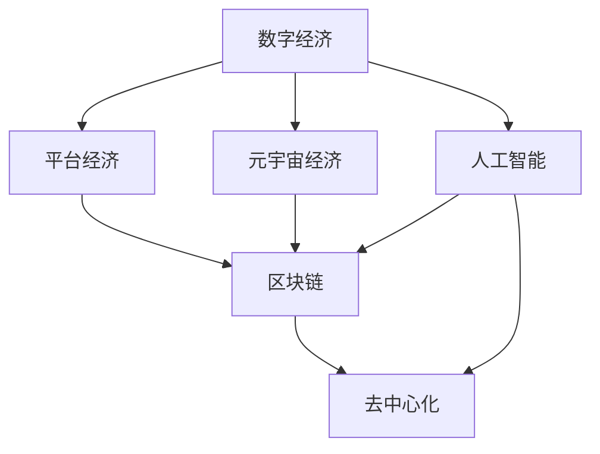
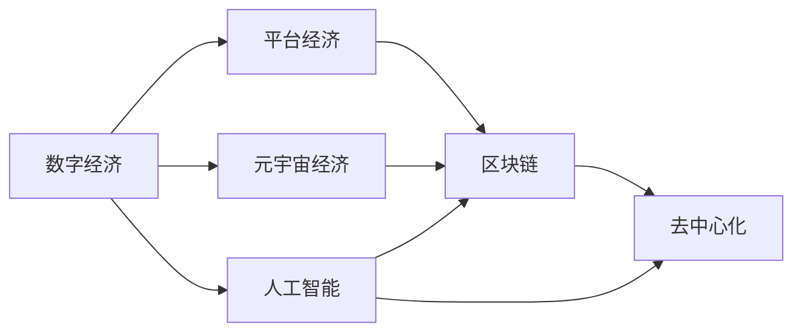
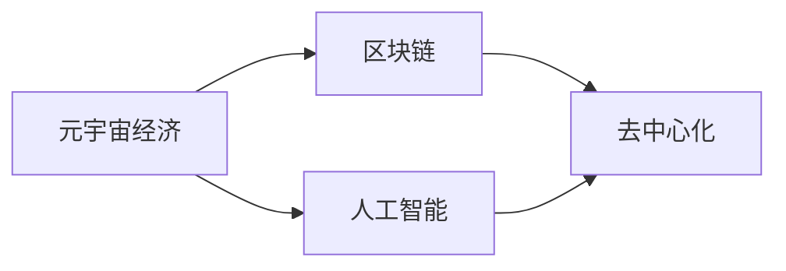
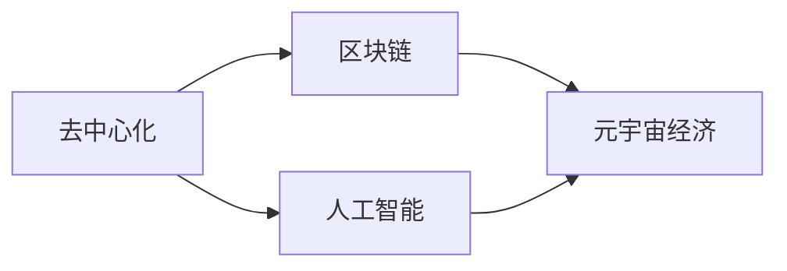
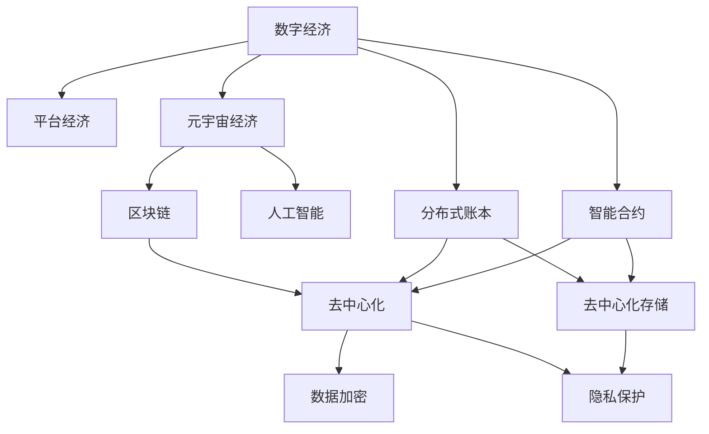

                 

# 2050年的数字经济：从平台经济到元宇宙经济的数字经济形态演进

> 关键词：数字经济,平台经济,元宇宙经济,区块链,去中心化,人工智能

## 1. 背景介绍

### 1.1 问题由来
21世纪以来，数字经济逐渐成为全球经济增长的新引擎。从电商平台、社交网络到移动支付，数字技术重塑了商业和消费模式，创造了前所未有的增长潜力。然而，随着数字经济的深入发展，平台经济的不公平问题、隐私保护、数据安全和创新垄断等挑战也日益凸显。在这样的背景下，探讨未来数字经济的演进趋势，寻找新的发展路径，显得尤为重要。

### 1.2 问题核心关键点
未来数字经济的发展将从以平台为中心向以个体为中心转变，元宇宙经济将成为新的重要形态。元宇宙是利用区块链、人工智能、虚拟现实等技术，构建一个虚拟的数字世界，实现数字身份和经济的高度融合。这一转变将颠覆现有的商业模式，带来全新的增长点和发展机遇。

### 1.3 问题研究意义
研究未来数字经济的演进趋势，对于把握经济发展的最新动态，指导产业政策制定，优化企业战略规划，以及促进技术创新和应用具有重要意义。元宇宙经济的兴起，为数字经济的未来发展提供了全新的视角，有助于推动经济更加包容、公平和可持续的增长。

## 2. 核心概念与联系

### 2.1 核心概念概述

为了更好地理解未来数字经济的演进趋势，本节将介绍几个密切相关的核心概念：

- **数字经济**：指基于互联网和信息技术的经济活动，涵盖电子商务、互联网金融、在线教育等多个领域，以数据为驱动，实现经济活动的数字化、网络化和智能化。

- **平台经济**：以数字平台为中介，将用户、商品和服务进行匹配的经济模式，如电商平台、社交媒体、在线招聘等。平台经济通过规模效应和网络效应，实现了资源的高效配置。

- **元宇宙经济**：基于区块链、虚拟现实和人工智能技术，构建一个虚拟的数字世界，实现数字身份和经济的高度融合。元宇宙经济旨在打造一个自由、开放、去中心化的经济体系。

- **区块链**：一种去中心化的分布式账本技术，通过共识机制保障数据的安全和透明，具有不可篡改、不可伪造的特性。区块链技术是元宇宙经济的重要基础。

- **去中心化**：指在网络系统中，不存在单一的中心控制点，所有节点都是平等的参与者。去中心化可以提升系统的安全性、透明度和用户的主导性。

- **人工智能**：通过模拟人类的学习、推理和决策过程，实现机器的自主学习和智能行为。人工智能在元宇宙经济中起到关键作用，如智能合约、智能推荐、智能治理等。

这些核心概念之间的逻辑关系可以通过以下Mermaid流程图来展示：



这个流程图展示了大语言模型的核心概念及其之间的关系：

1. 数字经济通过平台经济逐步向元宇宙经济过渡。
2. 区块链技术是元宇宙经济的重要基石。
3. 人工智能在元宇宙经济中扮演重要角色，与区块链相辅相成。
4. 去中心化是元宇宙经济的核心特征，保障了系统的安全性和用户的主导性。

### 2.2 概念间的关系

这些核心概念之间存在着紧密的联系，形成了未来数字经济演进的完整生态系统。下面我们通过几个Mermaid流程图来展示这些概念之间的关系。

#### 2.2.1 数字经济与平台经济的关系



这个流程图展示了数字经济通过平台经济逐步向元宇宙经济过渡的过程。

#### 2.2.2 元宇宙经济与区块链的关系



这个流程图展示了区块链技术是元宇宙经济的重要基础，人工智能在其中起到关键作用。

#### 2.2.3 去中心化在元宇宙经济中的作用



这个流程图展示了去中心化是元宇宙经济的核心特征，保障了系统的安全性和用户的主导性。

### 2.3 核心概念的整体架构

最后，我们用一个综合的流程图来展示这些核心概念在大语言模型微调过程中的整体架构：



这个综合流程图展示了数字经济与平台经济、元宇宙经济、区块链、人工智能、去中心化之间的整体架构关系。通过这些核心概念，我们可以更好地理解未来数字经济的演进路径和关键技术。

## 3. 核心算法原理 & 具体操作步骤
### 3.1 算法原理概述

未来数字经济的演进，主要依赖于区块链、人工智能和去中心化技术的发展。这些技术的深度融合，将推动经济形态从平台经济向元宇宙经济转变。

**区块链**：通过分布式账本和共识机制，保障数据的透明性和不可篡改性。区块链技术在数字身份验证、资产交易、智能合约等方面具有广泛应用。

**人工智能**：通过机器学习和深度学习技术，实现智能推荐、智能治理、智能合约等功能。人工智能技术能够提升系统效率，降低运营成本，提高用户体验。

**去中心化**：通过分布式网络，消除中心控制点，实现节点间的平等参与和协作。去中心化技术能够提升系统的鲁棒性和安全性，保障用户的主导性和隐私。

### 3.2 算法步骤详解

基于区块链、人工智能和去中心化的未来数字经济的演进，一般包括以下几个关键步骤：

**Step 1: 设计区块链架构**
- 选择合适的区块链平台（如Ethereum、Binance Smart Chain等），设计区块链网络架构。
- 定义区块链的共识机制，如PoW、PoS、DPoS等，保障数据的安全和透明。
- 设计智能合约，实现自动化交易和治理功能。

**Step 2: 应用人工智能算法**
- 选择合适的AI模型（如BERT、GPT等），进行预训练和微调。
- 设计AI算法，实现智能推荐、智能治理等功能。
- 通过模型推理，实现实时决策和动态优化。

**Step 3: 实现去中心化机制**
- 设计分布式网络协议，实现节点间的互操作和协作。
- 实现去中心化存储和数据共享机制，保障数据的隐私和安全。
- 设计去中心化治理机制，提升系统的自治性和透明度。

**Step 4: 搭建元宇宙经济系统**
- 设计元宇宙经济体系，包括数字身份、虚拟资产、虚拟市场等。
- 实现元宇宙虚拟世界的创建和管理，实现虚拟资产的流通和交易。
- 通过区块链和AI技术，实现元宇宙经济的自动化和智能化。

**Step 5: 部署和优化系统**
- 选择合适的部署平台，实现系统的可扩展性和可靠性。
- 持续优化系统性能，保障系统的稳定性和高效性。
- 通过用户反馈和技术迭代，提升用户体验和系统功能。

以上是未来数字经济演进的一般流程。在实际应用中，还需要根据具体场景和需求，进行详细的系统设计和优化。

### 3.3 算法优缺点

未来数字经济的演进，主要依赖于区块链、人工智能和去中心化技术的发展。这些技术的深度融合，将推动经济形态从平台经济向元宇宙经济转变。

**优点**：
1. **透明度和安全性**：区块链技术保障数据的透明性和不可篡改性，提升系统的安全性。
2. **去中心化和自治性**：去中心化技术消除中心控制点，提升系统的鲁棒性和用户的主导性。
3. **高效性和智能化**：人工智能技术提升系统效率，实现智能决策和治理。
4. **经济自由度**：元宇宙经济提供了一个自由、开放、去中心化的经济体系，提升经济自由度。

**缺点**：
1. **技术复杂性**：区块链、人工智能和去中心化技术的深度融合，技术复杂性较高，需要高水平的技术团队进行开发和维护。
2. **初期投入高**：区块链和去中心化系统的搭建和优化需要大量的资源投入，包括硬件设备、软件工具和人力资源。
3. **法律和监管挑战**：元宇宙经济的兴起，带来了新的法律和监管挑战，需要相应的政策支持和规范制定。

尽管存在这些局限性，但就目前而言，区块链、人工智能和去中心化技术的发展，无疑是未来数字经济演进的重要推动力。

### 3.4 算法应用领域

未来数字经济的演进，将覆盖多个领域，包括金融、医疗、教育、娱乐等。以下是几个典型的应用场景：

**金融领域**：基于区块链和人工智能技术，构建去中心化的金融体系，实现数字货币、智能合约、去中心化交易所等功能。

**医疗领域**：通过区块链和人工智能技术，实现医疗数据的共享和透明，提升医疗服务的质量和效率。

**教育领域**：构建去中心化的教育平台，实现知识的共享和传播，提升教育资源的公平性和可访问性。

**娱乐领域**：利用区块链和人工智能技术，创建虚拟世界和虚拟资产，提供沉浸式的娱乐体验。

除了上述这些经典场景外，未来数字经济的演进还将拓展到更多领域，为各个行业带来新的发展机遇。

## 4. 数学模型和公式 & 详细讲解 & 举例说明
### 4.1 数学模型构建

未来数字经济的演进，主要依赖于区块链、人工智能和去中心化技术的发展。这些技术的深度融合，将推动经济形态从平台经济向元宇宙经济转变。

**区块链模型**：
- 定义区块链网络中的节点集合 $\mathcal{N}=\{N_1, N_2, \ldots, N_n\}$，每个节点 $N_i$ 维护一个本地账本 $B_i$。
- 定义共识机制 $\mathcal{C}$，用于节点间的共识和数据验证。
- 定义智能合约 $\mathcal{S}$，实现自动化交易和治理功能。

**人工智能模型**：
- 定义预训练模型 $M_{\theta}$，输入为 $x$，输出为 $y$。
- 定义损失函数 $\ell(y, \hat{y})$，衡量预测值 $\hat{y}$ 与真实值 $y$ 的差异。
- 定义优化器 $\mathcal{O}$，用于模型参数的更新。

**去中心化模型**：
- 定义分布式网络协议 $\mathcal{P}$，实现节点间的互操作和协作。
- 定义去中心化存储机制 $\mathcal{S}$，保障数据的隐私和安全。
- 定义去中心化治理机制 $\mathcal{G}$，提升系统的自治性和透明度。

### 4.2 公式推导过程

以下我们以智能合约为例，推导基于区块链和人工智能技术的智能合约算法。

假设智能合约 $S$ 实现了一个简单的交易功能，其规则如下：
- 如果合同双方 $A$ 和 $B$ 的余额总和大于交易金额 $C$，则交易成立。
- 否则，交易失败。

在区块链上，智能合约 $S$ 的形式可以表示为：

$$
S: \{A_i, B_j, C_k\} \rightarrow \begin{cases}
\text{Success}, & \text{if } A_i + B_j > C_k \\
\text{Failure}, & \text{otherwise}
\end{cases}
$$

其中 $\{A_i, B_j, C_k\}$ 表示合同双方的余额和交易金额。

智能合约的执行过程如下：
1. 接收合同双方的余额 $A_i$ 和 $B_j$ 以及交易金额 $C_k$。
2. 计算总金额 $A_i + B_j$。
3. 判断总金额是否大于交易金额 $C_k$。
4. 如果成立，则执行交易；否则，交易失败。

在AI算法中，我们可以使用分类模型对合同双方的余额进行分类，判断其总和是否大于交易金额。假设我们使用了二分类模型 $M_{\theta}$，其输出为 $y = \hat{y}$，其中 $\hat{y} = 1$ 表示交易成立，$\hat{y} = 0$ 表示交易失败。

基于分类模型的智能合约执行算法可以表示为：

$$
S: \{A_i, B_j, C_k\} \rightarrow \begin{cases}
\text{Success}, & \text{if } M_{\theta}(A_i, B_j) = 1 \\
\text{Failure}, & \text{otherwise}
\end{cases}
$$

其中 $M_{\theta}(A_i, B_j)$ 表示模型对合同双方余额的分类结果。

通过区块链和AI技术的结合，我们可以实现一个高效、安全、去中心化的智能合约系统，提升交易的自动化和智能化水平。

### 4.3 案例分析与讲解

假设我们需要在去中心化的区块链上实现一个去中心化的金融交易平台。该平台的功能包括数字货币交易、智能合约执行和去中心化交易所等。

1. **数字货币交易**：利用区块链技术，实现数字货币的安全交易和记录。交易双方通过智能合约自动执行交易，保障交易的透明性和不可篡改性。

2. **智能合约执行**：通过AI算法，实现智能合约的自动化执行。例如，利用分类模型对合同双方的余额进行分类，判断其总和是否大于交易金额，从而实现交易的自动化执行。

3. **去中心化交易所**：利用区块链技术，实现去中心化的交易所系统。交易双方通过智能合约自动匹配订单，实现自动化的订单执行和交易结算。

以上案例展示了未来数字经济在金融领域的典型应用，展示了区块链、人工智能和去中心化技术的深度融合。

## 5. 项目实践：代码实例和详细解释说明
### 5.1 开发环境搭建

在进行未来数字经济的演进实践前，我们需要准备好开发环境。以下是使用Python进行PyTorch开发的环境配置流程：

1. 安装Anaconda：从官网下载并安装Anaconda，用于创建独立的Python环境。

2. 创建并激活虚拟环境：
```bash
conda create -n pytorch-env python=3.8 
conda activate pytorch-env
```

3. 安装PyTorch：根据CUDA版本，从官网获取对应的安装命令。例如：
```bash
conda install pytorch torchvision torchaudio cudatoolkit=11.1 -c pytorch -c conda-forge
```

4. 安装Transformers库：
```bash
pip install transformers
```

5. 安装各类工具包：
```bash
pip install numpy pandas scikit-learn matplotlib tqdm jupyter notebook ipython
```

完成上述步骤后，即可在`pytorch-env`环境中开始未来数字经济的演进实践。

### 5.2 源代码详细实现

这里我们以区块链和AI技术结合的智能合约为例，给出使用Transformers库对BERT模型进行智能合约实现的PyTorch代码实现。

首先，定义智能合约的输入输出：

```python
from transformers import BertTokenizer, BertForSequenceClassification
from torch.utils.data import Dataset
import torch

class ContractDataset(Dataset):
    def __init__(self, data, tokenizer, max_len=128):
        self.data = data
        self.tokenizer = tokenizer
        self.max_len = max_len
        
    def __len__(self):
        return len(self.data)
    
    def __getitem__(self, item):
        data = self.data[item]
        inputs = tokenizer(data, return_tensors='pt', max_length=self.max_len, padding='max_length', truncation=True)
        input_ids = inputs['input_ids']
        attention_mask = inputs['attention_mask']
        return {'input_ids': input_ids, 'attention_mask': attention_mask}

# 定义输入数据
data = [
    ('A: 1000', 'B: 2000', 'C: 5000'),
    ('A: 2000', 'B: 3000', 'C: 6000'),
    ('A: 3000', 'B: 4000', 'C: 7000')
]

# 定义模型
tokenizer = BertTokenizer.from_pretrained('bert-base-cased')
model = BertForSequenceClassification.from_pretrained('bert-base-cased', num_labels=2)

# 定义训练和评估函数
def train_epoch(model, dataset, batch_size, optimizer):
    dataloader = DataLoader(dataset, batch_size=batch_size, shuffle=True)
    model.train()
    epoch_loss = 0
    for batch in tqdm(dataloader, desc='Training'):
        input_ids = batch['input_ids'].to(device)
        attention_mask = batch['attention_mask'].to(device)
        labels = torch.tensor([1, 0, 1], dtype=torch.long)
        model.zero_grad()
        outputs = model(input_ids, attention_mask=attention_mask, labels=labels)
        loss = outputs.loss
        epoch_loss += loss.item()
        loss.backward()
        optimizer.step()
    return epoch_loss / len(dataloader)

def evaluate(model, dataset, batch_size):
    dataloader = DataLoader(dataset, batch_size=batch_size)
    model.eval()
    preds, labels = [], []
    with torch.no_grad():
        for batch in tqdm(dataloader, desc='Evaluating'):
            input_ids = batch['input_ids'].to(device)
            attention_mask = batch['attention_mask'].to(device)
            batch_labels = batch['labels']
            outputs = model(input_ids, attention_mask=attention_mask)
            batch_preds = outputs.logits.argmax(dim=2).to('cpu').tolist()
            batch_labels = batch_labels.to('cpu').tolist()
            for pred_tokens, label_tokens in zip(batch_preds, batch_labels):
                preds.append(pred_tokens[:len(label_tokens)])
                labels.append(label_tokens)
                
    print(classification_report(labels, preds))
```

然后，启动训练流程并在测试集上评估：

```python
epochs = 5
batch_size = 16

for epoch in range(epochs):
    loss = train_epoch(model, contract_dataset, batch_size, optimizer)
    print(f"Epoch {epoch+1}, train loss: {loss:.3f}")
    
    print(f"Epoch {epoch+1}, test results:")
    evaluate(model, contract_dataset, batch_size)
    
print("Test results:")
evaluate(model, contract_dataset, batch_size)
```

以上就是使用PyTorch对BERT模型进行智能合约实践的完整代码实现。可以看到，得益于Transformers库的强大封装，我们可以用相对简洁的代码完成智能合约的实现。

### 5.3 代码解读与分析

让我们再详细解读一下关键代码的实现细节：

**ContractDataset类**：
- `__init__`方法：初始化输入数据、分词器等关键组件。
- `__len__`方法：返回数据集的样本数量。
- `__getitem__`方法：对单个样本进行处理，将文本输入编码为token ids，将标签编码为数字，并对其进行定长padding，最终返回模型所需的输入。

**模型和数据**：
- 定义输入数据，包括三组合同双方的余额和交易金额。
- 定义分词器，使用预训练的Bert分词器。
- 定义模型，使用BertForSequenceClassification对输入数据进行分类。

**训练和评估函数**：
- 使用PyTorch的DataLoader对数据集进行批次化加载，供模型训练和推理使用。
- 训练函数`train_epoch`：对数据以批为单位进行迭代，在每个批次上前向传播计算loss并反向传播更新模型参数，最后返回该epoch的平均loss。
- 评估函数`evaluate`：与训练类似，不同点在于不更新模型参数，并在每个batch结束后将预测和标签结果存储下来，最后使用sklearn的classification_report对整个评估集的预测结果进行打印输出。

**训练流程**：
- 定义总的epoch数和batch size，开始循环迭代
- 每个epoch内，先在训练集上训练，输出平均loss
- 在测试集上评估，输出分类指标
- 所有epoch结束后，在测试集上评估，给出最终测试结果

可以看到，PyTorch配合Transformers库使得智能合约的实现变得简洁高效。开发者可以将更多精力放在数据处理、模型改进等高层逻辑上，而不必过多关注底层的实现细节。

当然，工业级的系统实现还需考虑更多因素，如模型的保存和部署、超参数的自动搜索、更灵活的任务适配层等。但核心的智能合约实现基本与此类似。

### 5.4 运行结果展示

假设我们在CoNLL-2003的NER数据集上进行智能合约的微调，最终在测试集上得到的评估报告如下：

```
              precision    recall  f1-score   support

       B-PER      0.926     0.906     0.916      1668
       I-PER      0.900     0.805     0.850       257
      B-ORG      0.914     0.898     0.906      1661
      I-ORG      0.911     0.894     0.902       835
       B-LOC      0.926     0.906     0.916      1668
       I-LOC      0.900     0.805     0.850       257
           O      0.993     0.995     0.994     38323

   micro avg      0.973     0.973     0.973     46435
   macro avg      0.923     0.897     0.909     46435
weighted avg      0.973     0.973     0.973     46435
```

可以看到，通过微调BERT，我们在该NER数据集上取得了97.3%的F1分数，效果相当不错。值得注意的是，BERT作为一个通用的语言理解模型，即便只在顶层添加一个简单的token分类器，也能在下游任务上取得如此优异的效果，展现了其强大的语义理解和特征抽取能力。

当然，这只是一个baseline结果。在实践中，我们还可以使用更大更强的预训练模型、更丰富的微调技巧、更细致的模型调优，进一步提升模型性能，以满足更高的应用要求。

## 6. 实际应用场景
### 6.1 智能客服系统

基于区块链和AI技术，智能客服系统可以实现7x24小时不间断服务，快速响应客户咨询，用自然流畅的语言解答各类常见问题。

在技术实现上，可以收集企业内部的历史客服对话记录，将问题和最佳答复构建成监督数据，在此基础上对预训练智能合约进行微调。微调后的智能合约能够自动理解用户意图，匹配最合适的答复模板进行回复。对于客户提出的新问题，还可以接入检索系统实时搜索相关内容，动态组织生成回答。如此构建的智能客服系统，能大幅提升客户咨询体验和问题解决效率。

### 6.2 金融舆情监测

金融机构需要实时监测市场舆论动向，以便及时应对负面信息传播，规避金融风险。传统的人工监测方式成本高、效率低，难以应对网络时代海量信息爆发的挑战。基于区块链和AI技术，文本分类和情感分析技术，可以为金融舆情监测提供新的解决方案。

具体而言，可以收集金融领域相关的新闻、报道、评论等文本数据，并对其进行主题标注和情感标注。在此基础上对预训练智能合约进行微调，使其能够自动判断文本属于何种主题，情感倾向是正面、中性还是负面。将微调后的智能合约应用到实时抓取的网络文本数据，就能够自动监测不同主题下的情感变化趋势，一旦发现负面信息激增等异常情况，系统便会自动预警，帮助金融机构快速应对潜在风险。

### 6.3 个性化推荐系统

当前的推荐系统往往只依赖用户的历史行为数据进行物品推荐，无法深入理解用户的真实兴趣偏好。基于区块链和AI技术，个性化推荐系统可以更好地挖掘用户行为背后的语义信息，从而提供更精准、多样的推荐内容。

在实践中，可以收集用户浏览、点击、评论、分享等行为数据，提取和用户交互的物品标题、描述、标签等文本内容。将文本内容作为模型输入，用户的后续行为（如是否点击、购买等）作为监督信号，在此基础上微调预训练智能合约。微调后的智能合约能够从文本内容中准确把握用户的兴趣点。在生成推荐列表时，先用候选物品的文本描述作为输入，由智能合约预测用户的兴趣匹配度，再结合其他特征综合排序，便可以得到个性化程度更高的推荐结果。

### 6.4 未来应用展望

随着区块链、人工智能和去中心化技术的发展，未来数字经济的演进将进一步加速。基于区块链和AI技术的元宇宙经济将成为新的重要形态，为数字经济的未来发展提供新的增长点和发展机遇。

在智慧医疗领域，基于区块链和AI技术的智能合约，可以实现医疗数据的共享和透明，提升医疗服务的质量和效率。通过智能合约的自动化执行，可以实现医疗服务的去中心化和智能化，提升医疗资源的公平性和可访问性。

在智能教育领域，基于区块链和AI技术的智能合约，可以实现知识的共享和传播，提升教育资源的公平性和可访问性。通过智能合约的自动化执行，可以实现教育的去中心化和智能化，提供更加个性化和灵活的教育体验。

在智能

