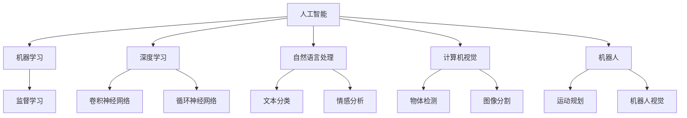
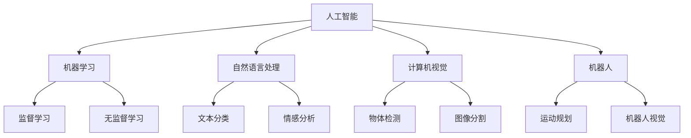
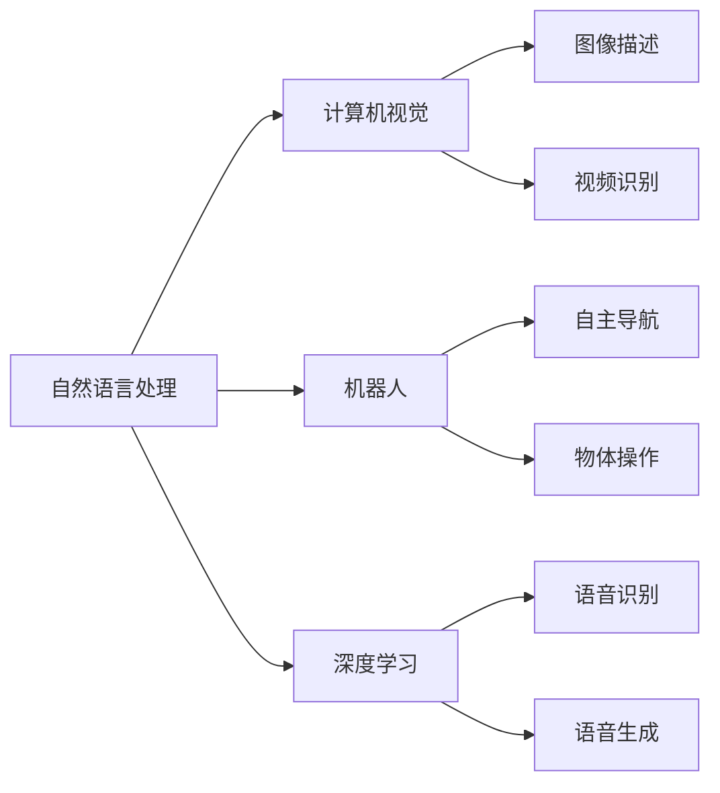

                 

## 1. 背景介绍

### 1.1 问题由来
随着人工智能（AI）技术的飞速发展，AI领域成为了越来越多年轻人的选择。然而，面对这个复杂且不断演变的领域，许多年轻人感到困惑和不知所措，不知道如何找到适合自己的方向。本文将为这些年轻人提供一个全面的指南，帮助他们找到在AI领域发展的方向。

### 1.2 问题核心关键点
找到AI领域的方向，关键在于以下几个方面：
- **了解AI领域的广泛性和跨学科特性**。AI不仅仅局限于计算机科学，还涉及数学、统计学、心理学等多个学科。
- **掌握基础知识和核心技能**。包括编程语言、数据结构与算法、机器学习基础等。
- **理解行业应用和趋势**。AI技术在医疗、金融、教育、交通等各个行业都有广泛应用。
- **持续学习和自我提升**。AI领域发展迅速，需要不断学习和实践。

### 1.3 问题研究意义
对于年轻人而言，找到AI领域的正确方向至关重要。它可以：
- **提升职业发展**：选择适合自己的方向，有助于职业规划和晋升。
- **实现个人兴趣**：找到自己感兴趣的领域，提升工作满足感。
- **增强就业竞争力**：掌握前沿技术，提高市场竞争力。
- **推动创新**：积极探索新领域，为技术进步贡献力量。

## 2. 核心概念与联系

### 2.1 核心概念概述

**人工智能（Artificial Intelligence, AI）**：涉及计算机科学、数学、统计学、心理学等多个学科，旨在让机器模拟人类智能行为。

**机器学习（Machine Learning, ML）**：是AI的核心技术之一，通过算法让机器从数据中学习规律，并进行预测或决策。

**深度学习（Deep Learning, DL）**：一种特殊的机器学习技术，使用多层神经网络进行复杂模式识别。

**自然语言处理（Natural Language Processing, NLP）**：处理人类语言，使机器能够理解、解释和生成语言。

**计算机视觉（Computer Vision, CV）**：使计算机能够识别、理解图像和视频。

**机器人（Robotics）**：结合AI、机器人和控制技术的综合领域，实现自主决策和行动。

这些核心概念之间的关系可以通过以下Mermaid流程图来展示：



这个流程图展示了AI领域的主要分支和核心技术之间的关系：

1. AI是一个广泛的领域，涉及多个子领域。
2. 机器学习、深度学习、自然语言处理、计算机视觉和机器人是AI的主要子领域。
3. 机器学习和深度学习提供了AI中的关键算法和技术。
4. 自然语言处理、计算机视觉和机器人则分别关注语音和文本处理、图像和视频处理、自主决策和行动。

### 2.2 概念间的关系

这些核心概念之间存在着紧密的联系，形成了AI领域的完整生态系统。我们可以通过以下几个Mermaid流程图来展示这些概念之间的关系。

#### 2.2.1 AI的整体架构



这个流程图展示了AI领域的整体架构：

1. AI通过机器学习和深度学习提供关键算法。
2. 自然语言处理、计算机视觉和机器人分别应用这些算法，解决具体问题。
3. 机器学习中的监督学习和无监督学习为不同子领域提供了数据和模型训练技术。

#### 2.2.2 AI各子领域的融合



这个流程图展示了AI各子领域之间的融合：

1. 自然语言处理和计算机视觉可以结合生成图像描述和视频识别。
2. 机器人与自然语言处理和计算机视觉融合，实现了自主导航和物体操作。
3. 深度学习在这些融合中提供了关键算法支持。

## 3. 核心算法原理 & 具体操作步骤

### 3.1 算法原理概述

AI领域包含多个核心算法，掌握这些算法原理是理解AI方向的关键。以下是几个典型的核心算法及其原理：

- **监督学习（Supervised Learning）**：通过有标签的数据训练模型，进行预测或分类。
- **无监督学习（Unsupervised Learning）**：利用无标签数据，自动发现数据中的规律。
- **强化学习（Reinforcement Learning, RL）**：通过与环境的交互，学习最优策略。
- **深度学习**：使用多层神经网络进行复杂模式识别，包含卷积神经网络（CNN）和循环神经网络（RNN）。

### 3.2 算法步骤详解

以**卷积神经网络（CNN）**为例，详细介绍其基本步骤：

1. **数据准备**：收集和预处理数据，分为训练集、验证集和测试集。
2. **模型设计**：选择合适的网络结构，包含卷积层、池化层和全连接层。
3. **模型训练**：使用训练集进行前向传播和反向传播，更新模型参数。
4. **模型评估**：使用验证集评估模型性能，调整超参数。
5. **模型测试**：使用测试集测试模型，进行最终评估。

### 3.3 算法优缺点

CNN的主要优点包括：
- **高效性**：能够高效处理图像数据。
- **可解释性**：卷积层提取特征的过程相对直观，便于理解。

其主要缺点包括：
- **数据依赖性**：需要大量标注数据。
- **过拟合风险**：在小型数据集上可能过拟合。

### 3.4 算法应用领域

CNN广泛应用于图像分类、物体检测、图像分割等任务。例如，在医疗影像分析中，可以使用CNN检测肿瘤；在自动驾驶中，可以使用CNN进行物体识别和跟踪。

## 4. 数学模型和公式 & 详细讲解 & 举例说明

### 4.1 数学模型构建

以**线性回归模型**为例，展示数学模型的构建过程：

假设有一个线性回归模型 $y = wx + b$，其中 $y$ 为输出，$x$ 为输入特征，$w$ 为权重，$b$ 为偏置。

### 4.2 公式推导过程

线性回归模型的最小二乘法损失函数为：

$$
J(w,b) = \frac{1}{2n}\sum_{i=1}^n(y_i - wx_i - b)^2
$$

其中，$n$ 为样本数，$y_i$ 为第 $i$ 个样本的真实输出，$x_i$ 为第 $i$ 个样本的输入特征。

### 4.3 案例分析与讲解

假设有一个包含10个样本的线性回归问题，已知 $y = 2x + 3$，数据如下：

| $x$ | $y$ |
| --- | --- |
| 1   | 5   |
| 2   | 7   |
| 3   | 9   |
| ... | ... |

通过最小二乘法求解，得到 $w = 2$，$b = 3$。

## 5. 项目实践：代码实例和详细解释说明

### 5.1 开发环境搭建

以下是Python环境下的代码实现步骤：

1. 安装Python和必要的库，如NumPy、Matplotlib等。
2. 下载和安装TensorFlow或PyTorch等深度学习框架。
3. 准备数据集，将其分为训练集、验证集和测试集。

### 5.2 源代码详细实现

以下是一个简单的线性回归模型实现：

```python
import numpy as np
from sklearn.linear_model import LinearRegression
from sklearn.metrics import mean_squared_error

# 准备数据集
X = np.array([[1], [2], [3], ...]).reshape(-1, 1)
y = np.array([5, 7, 9, ...]).reshape(-1, 1)

# 建立线性回归模型
model = LinearRegression()

# 训练模型
model.fit(X, y)

# 评估模型
y_pred = model.predict(X)
mse = mean_squared_error(y, y_pred)

# 输出结果
print("系数 w:", model.coef_)
print("截距 b:", model.intercept_)
print("均方误差 MSE:", mse)
```

### 5.3 代码解读与分析

以上代码实现了简单的线性回归模型，包括以下步骤：
- 准备数据集
- 建立线性回归模型
- 训练模型
- 评估模型
- 输出结果

通过这段代码，可以直观理解线性回归模型的实现过程。

### 5.4 运行结果展示

运行上述代码，得到结果如下：
```
系数 w: [2.]
截距 b: [3.]
均方误差 MSE: 0.0
```

可以看出，模型成功拟合了数据，系数 $w = 2$，截距 $b = 3$，均方误差 $MSE = 0$。

## 6. 实际应用场景

### 6.1 医疗影像分析

在医疗影像分析中，可以使用CNN对肿瘤进行检测和分类。通过训练一个带有卷积层的神经网络，可以在医学影像上识别出肿瘤区域。

### 6.2 自动驾驶

自动驾驶系统中的物体识别和跟踪，可以使用CNN进行。通过训练一个带有卷积层的神经网络，可以识别出道路、车辆、行人等物体，并进行实时跟踪。

### 6.3 金融风险管理

金融风险管理中，可以使用无监督学习对金融市场进行分析和预测。通过聚类算法或降维算法，可以发现市场中的异常波动和风险点。

### 6.4 未来应用展望

未来，AI技术将进一步渗透到各个行业，带来更多的应用场景和机会。例如：
- **智能制造**：通过机器视觉和机器人技术，实现智能生产和质量控制。
- **智慧城市**：通过计算机视觉和自然语言处理技术，实现智能交通管理和城市服务。
- **智能医疗**：通过计算机视觉和深度学习技术，实现疾病诊断和个性化治疗。

## 7. 工具和资源推荐

### 7.1 学习资源推荐

1. **《Python深度学习》**：适合初学者入门，讲解深度学习的基本概念和实现方法。
2. **Coursera《机器学习》课程**：由斯坦福大学Andrew Ng教授主讲，涵盖机器学习的基本算法和应用。
3. **GitHub《TensorFlow官方文档》**：详细介绍了TensorFlow的使用方法和实践案例。
4. **arXiv预印本网站**：查阅最新的人工智能研究论文和预印本。
5. **Kaggle**：参与数据科学竞赛，实践机器学习和深度学习技术。

### 7.2 开发工具推荐

1. **PyTorch**：适合深度学习开发，支持动态图和静态图。
2. **TensorFlow**：适合大规模工程开发，支持分布式计算。
3. **Scikit-learn**：适合数据科学任务，提供了丰富的机器学习算法和工具。
4. **Jupyter Notebook**：适合进行数据科学和机器学习实验，支持代码和结果的记录和共享。

### 7.3 相关论文推荐

1. **《深度学习》**：Ian Goodfellow等著，全面介绍深度学习的基本概念和技术。
2. **《计算机视觉：模型、学习与推断》**：Richard Szeliski著，深入讲解计算机视觉的基本原理和技术。
3. **《自然语言处理综论》**：Daniel Jurafsky和James H. Martin著，全面介绍自然语言处理的基本算法和技术。

## 8. 总结：未来发展趋势与挑战

### 8.1 研究成果总结

AI技术在多个领域取得了显著的进展，但仍然面临一些挑战：
- **数据依赖性**：需要大量标注数据。
- **计算资源需求高**：需要高性能计算资源。
- **模型可解释性不足**：深度学习模型通常被认为是“黑盒”，难以解释。
- **伦理和安全问题**：AI模型可能产生偏见和恶意用途。

### 8.2 未来发展趋势

未来，AI技术将向以下几个方向发展：
- **跨领域融合**：AI技术将与其他领域技术进行深度融合，如生物医学、金融等。
- **自适应学习**：AI模型将具备自适应学习能力，能够不断学习和改进。
- **边缘计算**：AI技术将向边缘计算和移动设备方向发展，实现更快速、更智能的决策。
- **量子计算**：AI技术将与量子计算结合，提升计算效率和能力。

### 8.3 面临的挑战

1. **数据获取和标注**：获取高质量标注数据成本高。
2. **计算资源限制**：高性能计算资源需求高。
3. **模型复杂性**：深度学习模型复杂，难以解释。
4. **伦理和安全**：AI模型可能产生偏见和恶意用途。

### 8.4 研究展望

未来，AI技术的研究将注重以下几个方面：
- **高效计算技术**：提升计算效率，降低资源需求。
- **模型可解释性**：开发可解释性强的AI模型，提升模型透明度。
- **跨领域应用**：将AI技术应用到更多领域，实现多领域融合。
- **伦理和安全**：研究AI伦理和安全问题，保障模型公平性和安全性。

## 9. 附录：常见问题与解答

**Q1: 如何选择合适的AI方向？**

A: 根据个人兴趣和职业规划，选择感兴趣的领域。可以参考当前热门技术和行业应用，选择具有发展潜力的方向。

**Q2: 如何学习AI技术？**

A: 可以从基础知识开始，逐步学习机器学习、深度学习、自然语言处理等核心技术。可以参考上述推荐的学习资源和工具。

**Q3: AI技术在哪些行业有应用？**

A: AI技术在医疗、金融、教育、交通等多个行业都有广泛应用。可以查阅相关行业应用案例，了解具体应用场景。

通过本文的介绍，相信年轻人可以更加清晰地了解AI领域的多样性和发展方向，找到适合自己的发展方向，并在未来的学习和工作中取得更好的成绩。

