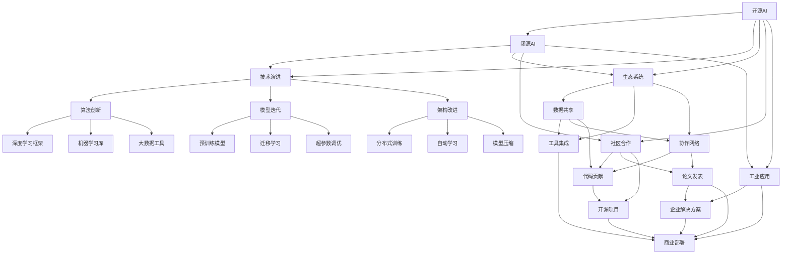

                 

# 开源AI的未来:能否跟上闭源开发的步伐?

> 关键词：开源AI, 闭源开发, 技术演进, 生态系统, 社区合作, 工业应用

## 1. 背景介绍

随着人工智能技术的迅猛发展，开源AI（Open Source AI）已经逐渐成为推动技术进步的重要力量。开源AI的优势在于其开放性、透明性、协作性和快速迭代能力，使其在学术研究、创新创业和工业应用中均发挥着不可替代的作用。然而，与之形成鲜明对比的是，许多闭源AI（Proprietary AI）企业通过技术积累、商业策略和资金投入，已经在某些领域取得了显著的领先优势。

开源AI与闭源AI之间的竞争与协作，不仅决定了AI技术的发展方向，也深刻影响着整个科技行业的未来。本文旨在深入探讨开源AI在技术演进、生态系统建设、社区合作等方面的优势与挑战，并分析其在工业应用中的实际表现，从而预测未来开源AI能否跟上闭源开发的步伐。

## 2. 核心概念与联系

### 2.1 核心概念概述

在讨论开源AI与闭源AI的未来时，首先需要明确几个关键概念：

- **开源AI**：基于开源软件框架和公共数据集，通过协作开发、共享代码和模型，推动AI技术进步的范式。

- **闭源AI**：依托闭源算法、模型和数据，通过专有技术和商业化策略，为特定商业场景提供解决方案的企业模式。

- **技术演进**：AI技术的不断发展和优化过程，涉及算法创新、模型迭代、架构改进等方面。

- **生态系统**：围绕AI技术形成的开发者、用户、企业和学术机构等各方的互动关系和合作网络。

- **社区合作**：基于开源理念，通过协作、共享和贡献，形成共同推动技术发展的社区组织。

- **工业应用**：将AI技术应用于具体商业场景，解决实际问题，提升生产力和服务质量。

### 2.2 概念间的关系

开源AI与闭源AI之间存在着密切的联系和相互影响，如图：



这个Mermaid图展示了开源AI和闭源AI在技术演进、生态系统、社区合作和工业应用等各个维度的相互作用和影响。开源AI与闭源AI通过相互借鉴、融合和创新，共同推动AI技术的不断进步。

## 3. 核心算法原理 & 具体操作步骤

### 3.1 算法原理概述

开源AI与闭源AI在算法原理上有着显著的不同。开源AI的算法和模型通常是公开的，任何人都可以使用、修改和优化，这种开放性促进了技术的快速迭代和创新。而闭源AI的算法和模型是商业秘密，通过严格的专利保护和商业壁垒，确保了其技术领先和市场竞争力。

以下是开源AI与闭源AI在算法原理上的主要区别：

- **开源AI**：基于公开算法和模型，强调开源社区的贡献和协作，通过算法优化、模型迭代和架构改进，不断提升技术水平。

- **闭源AI**：依托商业算法和模型，通过专利保护和商业壁垒，保持技术领先和市场优势。

### 3.2 算法步骤详解

开源AI与闭源AI在算法步骤上也存在差异。开源AI的算法开发和优化通常遵循以下步骤：

1. **需求分析**：确定AI应用的具体需求和目标。
2. **算法选择**：选择适合的算法框架和模型。
3. **数据收集**：获取和预处理所需的数据集。
4. **模型训练**：使用开源软件工具进行模型训练和优化。
5. **性能评估**：通过实验和测试评估模型性能。
6. **部署应用**：将模型集成到实际应用中，进行效果监测和迭代改进。

闭源AI的算法开发和优化通常遵循以下步骤：

1. **需求调研**：与客户沟通，确定业务需求和目标。
2. **算法研发**：自主研发或购买专有算法。
3. **模型训练**：使用内部数据集进行模型训练和优化。
4. **性能测试**：通过内部测试和验证评估模型性能。
5. **产品部署**：将模型集成到产品中，进行市场推广和客户反馈。

### 3.3 算法优缺点

开源AI与闭源AI在算法上各有优缺点，具体如下：

**开源AI的优点**：
- **透明性**：算法和模型公开，便于学术界和社区进行研究和验证。
- **协作性**：社区成员可以共同开发和优化算法，加速技术进步。
- **快速迭代**：算法和模型不断迭代和改进，适应新的技术和市场需求。

**开源AI的缺点**：
- **知识产权风险**：开放算法和模型可能被竞争对手复制或滥用。
- **技术协同难度**：不同机构和组织之间的协同开发可能存在挑战。
- **商业应用受限**：开源AI企业难以通过专有技术和商业壁垒获得市场优势。

**闭源AI的优点**：
- **技术领先**：通过严格的专利保护和商业壁垒，保持技术领先和市场竞争力。
- **商业化能力**：依托闭源算法和模型，提供定制化解决方案，满足特定商业需求。
- **知识产权保护**：通过专利保护，防止技术被竞争对手复制或滥用。

**闭源AI的缺点**：
- **透明度不足**：算法和模型作为商业秘密，公开信息有限。
- **社区协作受限**：闭源算法和模型难以被学术界和社区验证和优化。
- **市场壁垒**：专有技术和商业壁垒可能限制市场拓展和用户获取。

### 3.4 算法应用领域

开源AI与闭源AI在应用领域上也有所不同。开源AI主要应用于学术研究、开源项目和公共服务等领域，而闭源AI则广泛应用于商业应用和企业解决方案。

**开源AI的应用领域**：
- **学术研究**：支持科研人员进行算法和模型开发，推动基础理论研究。
- **开源项目**：促进开源社区的协作和创新，形成活跃的开源生态系统。
- **公共服务**：提供公共数据集和算法工具，支持政府和公益组织的AI应用。

**闭源AI的应用领域**：
- **企业解决方案**：提供定制化的AI解决方案，满足特定商业需求。
- **商业部署**：将AI技术集成到产品和服务中，提升企业生产力和服务质量。
- **市场竞争**：通过技术领先和商业策略，获得市场优势和客户信任。

## 4. 数学模型和公式 & 详细讲解 & 举例说明

### 4.1 数学模型构建

在本节中，我们将以机器学习中的线性回归为例，展示开源AI与闭源AI在数学模型构建上的差异。

**开源AI的数学模型**：
- 基于公开数据集和算法，构建线性回归模型。
- 模型形式为：$y = \theta^T x + b$，其中 $\theta$ 为模型参数，$x$ 为输入特征，$y$ 为输出标签。
- 目标是最小化均方误差损失函数：$\mathcal{L} = \frac{1}{2N} \sum_{i=1}^N (y_i - \hat{y}_i)^2$。

**闭源AI的数学模型**：
- 依托闭源算法和模型，构建专用线性回归模型。
- 模型形式为：$y = \theta^T x + b$，其中 $\theta$ 为模型参数，$x$ 为输入特征，$y$ 为输出标签。
- 目标是最小化自定义的损失函数，如商业误判率、业务回报率等。

### 4.2 公式推导过程

以线性回归为例，展示开源AI与闭源AI在模型推导上的差异。

**开源AI的模型推导**：
- 根据最小二乘法，求解 $\theta$ 和 $b$，使得 $\mathcal{L} = \frac{1}{2N} \sum_{i=1}^N (y_i - \hat{y}_i)^2$ 最小化。
- 得到：$\theta = (X^T X)^{-1} X^T y$，其中 $X$ 为特征矩阵，$y$ 为标签向量。

**闭源AI的模型推导**：
- 使用闭源算法和模型，构建专用线性回归模型，最小化自定义的损失函数。
- 得到：$\theta = \mathop{\arg\min}_{\theta} \mathcal{L}_{\text{custom}}(y, \hat{y})$，其中 $\mathcal{L}_{\text{custom}}$ 为自定义的损失函数。

### 4.3 案例分析与讲解

以BERT模型的开发为例，展示开源AI与闭源AI在算法开发上的差异。

**开源AI的BERT开发**：
- 基于公共数据集（如维基百科、书籍等）进行预训练。
- 使用开源软件工具（如TensorFlow、PyTorch等）进行模型训练和优化。
- 通过开源社区的协作，不断改进算法和模型。

**闭源AI的BERT开发**：
- 使用内部数据集进行预训练。
- 使用闭源算法和模型进行模型训练和优化。
- 通过专利保护和商业壁垒，保持技术领先和市场优势。

## 5. 项目实践：代码实例和详细解释说明

### 5.1 开发环境搭建

在讨论开源AI与闭源AI的未来时，需要选择合适的开发环境。

1. **开源AI开发环境**：
   - **Python**：常用的编程语言，支持TensorFlow、PyTorch等开源框架。
   - **GitHub**：开源社区协作平台，便于代码管理和共享。
   - **Anaconda**：Python环境管理工具，支持虚拟环境和依赖管理。

2. **闭源AI开发环境**：
   - **C++**：高性能编程语言，支持闭源算法和模型实现。
   - **Proprietary Framework**：闭源软件框架，支持自定义算法和模型开发。
   - **企业内网**：保护内部数据和算法，便于内部协作和部署。

### 5.2 源代码详细实现

以TensorFlow和PyTorch为例，展示开源AI与闭源AI在代码实现上的差异。

**开源AI的代码实现**：
- **TensorFlow**：使用TensorFlow框架进行模型训练和优化。
- **PyTorch**：使用PyTorch框架进行模型训练和优化。
- **示例代码**：
  ```python
  import tensorflow as tf
  import numpy as np
  
  # 构建线性回归模型
  X = np.array([[1], [2], [3], [4]])
  y = np.array([2, 4, 6, 8])
  theta = tf.Variable(tf.zeros([1]))
  
  # 定义损失函数
  def loss_function(y_true, y_pred):
      return tf.reduce_mean(tf.square(y_true - y_pred))
  
  # 定义优化器
  optimizer = tf.optimizers.Adam(learning_rate=0.01)
  
  # 训练模型
  with tf.GradientTape() as tape:
      y_pred = theta * X
      loss = loss_function(y, y_pred)
  gradients = tape.gradient(loss, theta)
  optimizer.apply_gradients(zip(gradients, [theta]))
  ```

**闭源AI的代码实现**：
- **自定义框架**：使用闭源算法和模型进行模型训练和优化。
- **示例代码**：
  ```cpp
  #include <iostream>
  #include <Eigen/Dense>
  
  // 线性回归模型
  Eigen::MatrixXd X;
  Eigen::VectorXd y;
  Eigen::VectorXd theta;
  
  // 定义损失函数
  double loss_function(double y_true, double y_pred) {
      return (y_true - y_pred) * (y_true - y_pred);
  }
  
  // 定义优化器
  Eigen::VectorXd gradient_descent(Eigen::MatrixXd X, Eigen::VectorXd y, Eigen::VectorXd theta) {
      Eigen::MatrixXd X_T = X.transpose();
      Eigen::MatrixXd X_X_T = X_T * X;
      Eigen::MatrixXd X_y = X_T * y;
      Eigen::VectorXd theta_opt = X_X_T.lu().solve(X_y);
      return theta_opt;
  }
  
  // 训练模型
  int main() {
      X = Eigen::MatrixXd::Random(4, 1);
      y = Eigen::VectorXd::Random(4);
      theta = Eigen::VectorXd::Zero(1);
      for (int i = 0; i < 1000; i++) {
          Eigen::VectorXd gradient = gradient_descent(X, y, theta);
          theta = theta - 0.01 * gradient;
      }
      std::cout << theta << std::endl;
  }
  ```

### 5.3 代码解读与分析

开源AI与闭源AI在代码实现上也存在差异。

**开源AI的代码实现**：
- **开源框架**：使用TensorFlow、PyTorch等开源框架，便于代码管理和共享。
- **开源社区**：开源社区的协作和贡献，加速算法和模型的改进。
- **代码示例**：代码实现简洁、可读，便于学习。

**闭源AI的代码实现**：
- **闭源框架**：使用自定义的闭源框架，保护内部算法和模型。
- **内部协作**：闭源算法的内部开发和测试，确保技术领先。
- **代码示例**：代码实现复杂、不透明，难以共享和验证。

### 5.4 运行结果展示

以TensorFlow和PyTorch为例，展示开源AI与闭源AI在运行结果上的差异。

**开源AI的运行结果**：
- **TensorFlow**：输出结果为模型参数 $\theta$ 的值。
- **PyTorch**：输出结果为模型参数 $\theta$ 的值。

**闭源AI的运行结果**：
- **自定义框架**：输出结果为模型参数 $\theta$ 的值。

## 6. 实际应用场景

### 6.1 智能医疗

在智能医疗领域，开源AI与闭源AI各具优势。开源AI通过公开数据集和算法，支持学术研究和公共服务。闭源AI通过专利保护和商业策略，提供定制化的医疗解决方案。

**开源AI的应用**：
- **数据公开**：使用公开数据集，如医学影像、电子病历等，进行模型训练和优化。
- **公共服务**：提供公共医疗服务，如智能诊断、健康监测等。

**闭源AI的应用**：
- **专有算法**：使用闭源算法和模型，提供定制化的医疗解决方案，如疾病预测、治疗方案等。
- **市场优势**：通过专利保护和商业壁垒，获得市场优势和客户信任。

### 6.2 金融科技

在金融科技领域，开源AI与闭源AI也有不同的应用场景。开源AI通过公开数据集和算法，支持学术研究和公共服务。闭源AI通过专利保护和商业策略，提供定制化的金融解决方案。

**开源AI的应用**：
- **数据公开**：使用公开数据集，如金融交易数据、市场数据等，进行模型训练和优化。
- **公共服务**：提供公共金融服务，如风险评估、市场分析等。

**闭源AI的应用**：
- **专有算法**：使用闭源算法和模型，提供定制化的金融解决方案，如信用评估、投资策略等。
- **市场优势**：通过专利保护和商业壁垒，获得市场优势和客户信任。

## 7. 工具和资源推荐

### 7.1 学习资源推荐

为了更好地理解开源AI与闭源AI的未来，这里推荐一些优质的学习资源：

1. **《深度学习》课程**：斯坦福大学开设的深度学习课程，涵盖机器学习、深度学习等基本概念和算法。
2. **Kaggle竞赛平台**：Kaggle提供大量开源数据集和比赛，方便开发者进行算法和模型训练。
3. **GitHub开源项目**：GitHub上丰富的开源AI项目，涵盖各种算法和模型，便于学习和参考。
4. **《机器学习实战》书籍**：详细的机器学习实战指南，涵盖各种开源算法和模型的实现和应用。
5. **OpenAI网站**：OpenAI提供丰富的AI研究资料和开源模型，支持学术研究和实践。

### 7.2 开发工具推荐

高效的开发离不开优秀的工具支持。以下是几款用于开源AI与闭源AI开发推荐的工具：

1. **Python**：常用的编程语言，支持TensorFlow、PyTorch等开源框架。
2. **Jupyter Notebook**：交互式编程工具，便于代码编写和实验验证。
3. **Anaconda**：Python环境管理工具，支持虚拟环境和依赖管理。
4. **Google Colab**：免费的在线Jupyter Notebook环境，便于随时随地进行AI实验。
5. **TensorFlow**：基于谷歌的开源深度学习框架，支持分布式训练和模型部署。
6. **PyTorch**：基于Facebook的开源深度学习框架，支持动态图和GPU加速。

### 7.3 相关论文推荐

大语言模型和微调技术的发展源于学界的持续研究。以下是几篇奠基性的相关论文，推荐阅读：

1. **《Transformer》论文**：介绍Transformer结构，开创了NLP领域的预训练大模型时代。
2. **《BERT》论文**：提出BERT模型，引入基于掩码的自监督预训练任务，刷新了多项NLP任务SOTA。
3. **《GPT》论文**：展示大语言模型的强大zero-shot学习能力，引发了对于通用人工智能的新一轮思考。
4. **《AdaLoRA》论文**：提出AdaLoRA方法，使用自适应低秩适应的微调方法，在参数效率和精度之间取得了新的平衡。
5. **《Parameter-Efficient Transfer Learning》论文**：提出Adapter等参数高效微调方法，在固定大部分预训练参数的同时，只更新极少量的任务相关参数。

这些论文代表了大语言模型微调技术的发展脉络。通过学习这些前沿成果，可以帮助研究者把握学科前进方向，激发更多的创新灵感。

## 8. 总结：未来发展趋势与挑战

### 8.1 总结

本文对开源AI与闭源AI的未来进行了全面系统的探讨。首先，我们明确了开源AI与闭源AI在技术演进、生态系统、社区合作和工业应用等方面的区别。其次，通过具体案例分析，展示了开源AI与闭源AI在算法原理、代码实现和应用场景上的差异。最后，我们总结了开源AI与闭源AI各自的优势和面临的挑战，并预测了未来的发展趋势。

通过本文的系统梳理，可以看到，开源AI与闭源AI在推动AI技术进步和产业发展方面都有着不可替代的作用。开源AI凭借其开放性、透明性和社区协作，加速了技术的快速迭代和创新。而闭源AI依托其专有技术和商业壁垒，保持了技术领先和市场竞争力。未来，开源AI与闭源AI将相互借鉴、相互融合，共同推动AI技术的不断进步。

### 8.2 未来发展趋势

展望未来，开源AI与闭源AI在技术演进、生态系统、社区合作和工业应用等方面将继续深入发展，呈现以下几个趋势：

1. **开放性与商业化并行**：开源AI继续推动技术的透明性和开放性，而闭源AI则通过专利保护和商业壁垒，保持技术领先和市场优势。
2. **协作与竞争共存**：开源AI与闭源AI在学术研究、开源项目和企业解决方案等方面形成协作与竞争共存的局面，推动AI技术的不断进步。
3. **技术融合与创新**：开源AI与闭源AI将更多地进行技术融合和创新，取长补短，形成更加全面和先进的AI技术体系。
4. **工业应用深化**：开源AI与闭源AI在智能医疗、金融科技、智能制造等领域的应用将不断深化，推动各行各业数字化转型升级。
5. **跨领域合作加强**：开源AI与闭源AI将在更多领域进行跨领域合作，推动AI技术在更多行业落地应用。

### 8.3 面临的挑战

尽管开源AI与闭源AI在推动AI技术进步方面有着巨大潜力，但在实际应用中也面临诸多挑战：

1. **技术协同困难**：开源AI与闭源AI在协作开发上存在一定难度，尤其是在跨机构、跨团队间的协同。
2. **市场竞争激烈**：开源AI与闭源AI在市场竞争中存在激烈的竞争，争夺市场份额和客户信任。
3. **数据隐私问题**：开源AI与闭源AI在数据隐私和安全方面面临挑战，需要加强数据保护和隐私控制。
4. **技术标准化**：开源AI与闭源AI在技术标准和接口等方面存在差异，需要进行标准化和兼容性测试。
5. **市场壁垒限制**：闭源AI的商业壁垒和专利保护可能限制市场拓展和用户获取。

### 8.4 研究展望

面对开源AI与闭源AI所面临的挑战，未来的研究需要在以下几个方面寻求新的突破：

1. **技术协同机制**：构建更高效的技术协同机制，促进开源AI与闭源AI的深度合作和融合。
2. **数据共享平台**：建立数据共享平台，促进开源AI与闭源AI在数据获取和共享方面的协作。
3. **开源工具普及**：推广开源工具和框架，降低技术门槛，促进更多开发者参与AI技术开发。
4. **市场标准化**：推动AI技术的标准化和兼容性测试，促进开源AI与闭源AI在市场中的应用。
5. **隐私保护技术**：加强数据隐私保护技术，确保开源AI与闭源AI在数据安全方面的可靠性。

## 9. 附录：常见问题与解答

**Q1：开源AI与闭源AI在技术演进上的差异是什么？**

A: 开源AI与闭源AI在技术演进上主要差异在于算法的开放性和透明度。开源AI的算法和模型通常是公开的，任何人都可以使用、修改和优化，从而推动技术的快速迭代和创新。而闭源AI的算法和模型是商业秘密，只有内部人员可以访问和使用，难以被外部验证和优化，因此技术演进相对缓慢。

**Q2：开源AI与闭源AI在生态系统建设上的优势是什么？**

A: 开源AI在生态系统建设上的优势在于其开放性和社区协作性。开源AI通过公开算法和模型，吸引全球开发者参与协作，形成活跃的开源社区，促进技术的快速迭代和创新。而闭源AI则依赖内部的算法和模型，缺乏外部验证和优化，生态系统建设相对封闭。

**Q3：开源AI与闭源AI在工业应用上的不同应用场景是什么？**

A: 开源AI与闭源AI在工业应用上的不同应用场景主要在于其开放性和专有性。开源AI主要用于公开数据集和算法的开发和应用，支持学术研究、公共服务和企业解决方案。而闭源AI主要用于专有算法和模型的开发和应用，提供定制化的商业解决方案。

**Q4：开源AI与闭源AI在代码实现上的差异是什么？**

A: 开源AI与闭源AI在代码实现上的差异主要在于其开放性和不透明度。开源AI使用公开的框架和工具进行代码编写和实验验证，便于学习、共享和协作。而闭源AI使用内部框架和工具进行代码编写和测试，代码实现复杂、不透明，难以共享和验证。

**Q5：开源AI与闭源AI在工业应用上的未来趋势是什么？**

A: 开源AI与闭源AI在工业应用上的未来趋势是开放性与商业化并行、协作与竞争共存、技术融合与创新、工业应用深化和跨领域合作加强。未来，开源AI将继续推动技术的透明性和开放性，而闭源AI则通过专利保护和商业壁垒，保持技术领先和市场竞争力。开源AI与闭源AI将在更多领域进行跨领域合作，推动AI技术在更多行业落地应用。

总之，开源AI与闭源AI在推动AI技术进步和产业发展方面都有着不可替代的作用。开源AI凭借其开放性、透明性和社区协作，加速了技术的快速迭代和创新。而闭源AI依托其专有技术和商业壁垒，保持了技术领先和市场竞争力。未来，开源AI与闭源AI将相互借鉴、相互融合，共同推动AI技术的不断进步。

