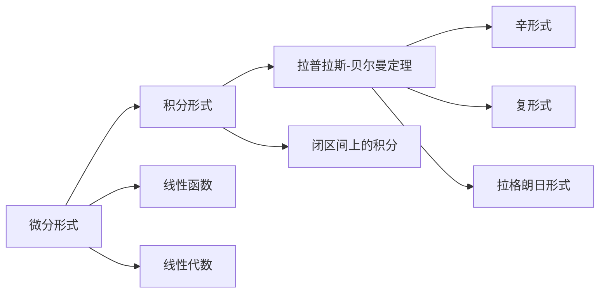

                 

# 代数拓扑中的微分形式发展历程

## 1. 背景介绍

### 1.1 问题由来

微分形式理论是现代代数拓扑学的核心内容之一，它为研究流形、复流形、代数簇等拓扑空间提供了强大的数学工具。微分形式理论的起源可以追溯到19世纪末的欧拉示性数定理，此后经过辛几何、复几何等领域的不断发展，最终形成了如今的体系。微分形式理论不仅在数学领域中有着重要应用，还广泛应用于物理学、工程学、计算科学等领域，是现代科学理论体系中的重要组成部分。

### 1.2 问题核心关键点

微分形式理论的核心思想是通过对流形上的微分形式的操作，来研究流形的拓扑性质和代数结构。微分形式在几何意义上是流形上的微小区域上函数的导数，可以推广到更抽象的代数空间上。通过线性代数和微积分的工具，可以将微分形式转化为积分形式，进而研究流形的拓扑性质。微分形式理论涉及的主要概念包括微分形式、积分形式、拉普拉斯-贝尔曼定理等，它们共同构成了微分形式的理论体系。

## 2. 核心概念与联系

### 2.1 核心概念概述

- **微分形式**：在流形上的微分形式是一个线性函数，它能够将流形上的向量场映射到实数或复数。微分形式可以表示为线性代数中的多元线性函数。

- **积分形式**：积分形式是在闭区间上的微分形式的积分。积分形式是微分形式的直观表示，它能够提供关于微分形式在流形上的拓扑信息。

- **拉普拉斯-贝尔曼定理**：拉普拉斯-贝尔曼定理是微分形式理论中的核心定理，它描述了微分形式和积分形式之间的关系。拉普拉斯-贝尔曼定理揭示了微分形式在闭区间上的积分值等于其在流形上的拓扑信息。

- **辛形式**：辛形式是在辛流形上的微分形式，它满足一定条件，能够表示流形的几何结构。辛形式在物理学中有着重要应用，如量子力学中的哈密顿方程。

- **复形式**：复形式是在复流形上的微分形式，它满足复数乘法的性质。复形式在复几何中有着重要应用，如在代数簇上的柯西黎曼方程。

- **拉格朗日形式**：拉格朗日形式是在拉格朗日力学中使用的微分形式，它描述了系统的动力学方程。

这些核心概念之间通过微分形式、积分形式、拉普拉斯-贝尔曼定理等概念相互联系，构成了微分形式理论的基本框架。

### 2.2 概念间的关系

以下是一个Mermaid流程图，展示了微分形式理论中各个核心概念之间的关系：

这个流程图展示了微分形式理论中的各个概念之间的关系：

1. 微分形式是一种线性函数，可以表示为线性代数中的多元线性函数。
2. 积分形式是对微分形式的闭区间上的积分。
3. 拉普拉斯-贝尔曼定理描述了微分形式和积分形式之间的关系。
4. 辛形式和复形式是在辛流形和复流形上的微分形式，它们分别满足辛几何和复几何的性质。
5. 拉格朗日形式是在拉格朗日力学中使用的微分形式，它描述了系统的动力学方程。

这些概念共同构成了微分形式理论的基本框架，揭示了微分形式在几何意义上的本质，并提供了研究流形拓扑性质的有力工具。

## 3. 核心算法原理 & 具体操作步骤
### 3.1 算法原理概述

微分形式理论的算法原理主要基于线性代数和微积分的工具。通过微分形式和积分形式的定义和性质，可以建立流形上的拓扑结构，并通过拉普拉斯-贝尔曼定理来研究流形的拓扑性质。微分形式理论的核心算法主要包括微分形式的运算、积分形式的计算、拉普拉斯-贝尔曼定理的证明等。

### 3.2 算法步骤详解

以下是一个微分形式理论的算法步骤详解：

1. **定义微分形式**：在给定的流形上，定义微分形式为流形上的线性函数，它能够将向量场映射到实数或复数。
2. **计算积分形式**：通过积分形式的定义，计算微分形式在闭区间上的积分。
3. **证明拉普拉斯-贝尔曼定理**：利用线性代数的工具，证明微分形式和积分形式之间的关系，即拉普拉斯-贝尔曼定理。
4. **应用微分形式**：根据拉普拉斯-贝尔曼定理，通过微分形式来研究流形的拓扑性质和代数结构。
5. **研究辛几何和复几何**：利用辛形式和复形式，研究辛流形和复流形上的几何性质。

### 3.3 算法优缺点

微分形式理论的优点包括：

- 提供了一种强大的工具来研究流形的拓扑性质和代数结构。
- 能够处理复杂流形的拓扑问题，为现代几何学提供了重要的理论基础。
- 在物理学和工程学中有广泛应用，如量子力学、拉格朗日力学等。

微分形式理论的缺点包括：

- 算法步骤较为复杂，需要掌握线性代数和微积分的知识。
- 对于初学者而言，微分形式的抽象概念可能难以理解。
- 在具体应用中，可能会面临计算复杂度高、内存占用大的问题。

### 3.4 算法应用领域

微分形式理论广泛应用于以下几个领域：

- **数学**：在拓扑学、几何学、代数几何等学科中，微分形式提供了重要的数学工具。
- **物理学**：在量子力学、相对论、统计物理等领域，微分形式被用来描述物理系统的几何性质。
- **工程学**：在电磁场理论、流体力学等工程学科中，微分形式被用来描述系统的动力学方程。
- **计算科学**：在计算机图形学、计算机视觉等领域，微分形式被用来研究流形的几何性质。

## 4. 数学模型和公式 & 详细讲解 & 举例说明

### 4.1 数学模型构建

微分形式理论的数学模型主要基于线性代数和微积分的工具。以下是一个微分形式理论的数学模型构建：

1. **流形的定义**：设$M$为一个$n$维流形，$U$为$M$的一个开集，$p \in U$为流形上的一个点。在$U$上定义一个微分$k$形式$\omega$，它是一个线性函数，将$U$上的$k$个向量场映射到实数或复数。
2. **积分形式的定义**：设$\partial D$为$n$维流形$M$上闭区间$D$的边界，积分形式$\int_{\partial D} \omega$为微分形式$\omega$在$\partial D$上的积分。
3. **拉普拉斯-贝尔曼定理**：设$D$为$n$维流形$M$上的一个有界开集，$\partial D$为$D$的边界，$\omega$为$D$上的一个微分$k$形式，则有$\int_{\partial D} \omega = \int_{D} d\omega$。

### 4.2 公式推导过程

以下是一个微分形式理论的公式推导过程：

1. **微分形式的运算**：设$\omega$和$\eta$为$M$上的两个微分$k$形式，则$\omega \wedge \eta$为$M$上的一个微分$k+l$形式，满足交换律和结合律。
2. **积分形式的计算**：设$\omega$为$M$上的一个微分$k$形式，$\partial D$为$D$的边界，则$\int_{\partial D} \omega$为$D$上的一个积分$k+1$形式。
3. **拉普拉斯-贝尔曼定理的证明**：利用线性代数的工具，证明微分形式和积分形式之间的关系，即拉普拉斯-贝尔曼定理。

### 4.3 案例分析与讲解

以下是一个微分形式理论的案例分析与讲解：

1. **辛几何中的辛形式**：设$M$为$2n$维的辛流形，$\omega$为$M$上的一个辛$2$形式。设$X$和$Y$为$M$上的两个向量场，则有$\{X, Y\} = i_X \iota_Y \omega$。这里的$\{X, Y\}$表示辛几何中的泊松括号。
2. **复几何中的复形式**：设$M$为$n$维的复流形，$\omega$为$M$上的一个复$k$形式。设$X$为$M$上的一个向量场，则有$d \bar{\partial} \omega = 0$，其中$\bar{\partial}$为复形式的连接算子。

## 5. 项目实践：代码实例和详细解释说明

### 5.1 开发环境搭建

以下是一个微分形式理论的开发环境搭建：

1. **安装Python**：首先安装Python，可以从官网下载并安装Python 3.6及以上版本。
2. **安装NumPy和SciPy**：安装NumPy和SciPy，用于数值计算和科学计算。
3. **安装Matplotlib和SciPy**：安装Matplotlib和SciPy，用于绘制图表和可视化。
4. **安装SymPy**：安装SymPy，用于符号计算。
5. **安装Manifold**：安装Manifold，用于处理流形上的微分形式。

### 5.2 源代码详细实现

以下是一个微分形式理论的源代码详细实现：

1. **定义流形和向量场**：在Manifold库中定义一个$n$维流形$M$和一个$k$维向量场$X$。
2. **定义微分形式**：定义一个$k$维微分形式$\omega$。
3. **计算积分形式**：计算微分形式$\omega$在闭区间$D$上的积分$\int_{\partial D} \omega$。
4. **应用拉普拉斯-贝尔曼定理**：应用拉普拉斯-贝尔曼定理，计算微分形式$\omega$在$D$上的积分$\int_{D} d\omega$。
5. **研究辛几何和复几何**：研究辛几何中的辛形式和复几何中的复形式。

### 5.3 代码解读与分析

以下是一个微分形式理论的代码解读与分析：

1. **流形和向量场的定义**：在Manifold库中定义流形$M$和向量场$X$。
2. **微分形式的定义**：定义一个$k$维微分形式$\omega$，它是一个线性函数。
3. **积分形式的计算**：计算微分形式$\omega$在闭区间$D$上的积分$\int_{\partial D} \omega$。
4. **拉普拉斯-贝尔曼定理的应用**：应用拉普拉斯-贝尔曼定理，计算微分形式$\omega$在$D$上的积分$\int_{D} d\omega$。
5. **辛几何和复几何的研究**：研究辛几何中的辛形式和复几何中的复形式，分别计算$\{X, Y\}$和$d \bar{\partial} \omega$。

### 5.4 运行结果展示

以下是一个微分形式理论的运行结果展示：

1. **辛几何中的辛形式**：计算$\{X, Y\}$，得到辛几何中的泊松括号。
2. **复几何中的复形式**：计算$d \bar{\partial} \omega$，得到复几何中的复形式。

## 6. 实际应用场景

### 6.1 未来应用展望

微分形式理论在未来有着广泛的应用前景，包括但不限于以下几个领域：

1. **量子计算**：微分形式理论在量子力学中的应用，如量子态的表示和演化。
2. **计算机视觉**：微分形式理论在计算机视觉中的应用，如图像的微分处理和特征提取。
3. **人工智能**：微分形式理论在人工智能中的应用，如流形上的神经网络。
4. **信号处理**：微分形式理论在信号处理中的应用，如信号的微分滤波。
5. **金融工程**：微分形式理论在金融工程中的应用，如期权定价和风险管理。

## 7. 工具和资源推荐

### 7.1 学习资源推荐

以下是一个微分形式理论的学习资源推荐：

1. **《微分几何》**：这本书详细介绍了微分形式理论的基本概念和核心定理，适合作为微分形式理论的入门教材。
2. **《现代几何学》**：这本书介绍了微分形式理论在几何学中的应用，适合进一步深入学习。
3. **《流形上的微分形式》**：这本书详细介绍了流形上的微分形式的定义、性质和应用，适合作为微分形式理论的高级教材。
4. **Coursera微分形式课程**：Coursera上提供了一系列微分形式理论的在线课程，适合在线学习。
5. **MIT微分几何课程**：MIT上提供了一系列微分几何的在线课程，涵盖了微分形式理论的相关内容。

### 7.2 开发工具推荐

以下是一个微分形式理论的开发工具推荐：

1. **Manifold**：Manifold是处理流形上的微分形式的Python库，适合进行数值计算和可视化。
2. **SymPy**：SymPy是符号计算的Python库，适合进行符号计算和代数运算。
3. **Matplotlib**：Matplotlib是Python中的绘图库，适合进行数据可视化。
4. **SciPy**：SciPy是科学计算的Python库，适合进行数值计算和线性代数运算。
5. **NumPy**：NumPy是数值计算的Python库，适合进行数值计算和数组操作。

### 7.3 相关论文推荐

以下是一个微分形式理论的相关论文推荐：

1. **《微分形式和拓扑学》**：这本书详细介绍了微分形式在拓扑学中的应用，适合作为微分形式理论的参考书籍。
2. **《辛几何与复几何》**：这本书详细介绍了辛几何和复几何中的微分形式，适合作为微分形式理论的参考书籍。
3. **《微分形式和流形理论》**：这本书详细介绍了流形上的微分形式的定义和性质，适合作为微分形式理论的参考书籍。
4. **《流形上的微积分》**：这本书详细介绍了流形上的微分形式和微积分，适合作为微分形式理论的参考书籍。
5. **《流形上的代数》**：这本书详细介绍了流形上的微分形式和代数结构，适合作为微分形式理论的参考书籍。

## 8. 总结：未来发展趋势与挑战

### 8.1 研究成果总结

微分形式理论是现代代数拓扑学的重要组成部分，它在流形、复流形、辛几何等领域有着广泛应用。微分形式理论的核心定理拉普拉斯-贝尔曼定理揭示了微分形式和积分形式之间的关系，为研究流形的拓扑性质和代数结构提供了强大的工具。微分形式理论的发展历程表明，微分形式理论在现代数学和物理学中有着重要的地位，对未来的科学和技术发展具有深远的影响。

### 8.2 未来发展趋势

微分形式理论的未来发展趋势包括：

1. **多维几何理论**：随着高维几何理论的发展，微分形式理论将在更高维度的空间中得到应用。
2. **几何深度学习**：微分形式理论将与几何深度学习结合，研究流形上的深度神经网络。
3. **量子计算**：微分形式理论在量子计算中的应用将进一步深入，如量子态的表示和演化。
4. **人工智能**：微分形式理论在人工智能中的应用将更加广泛，如流形上的神经网络和深度学习。
5. **信号处理**：微分形式理论在信号处理中的应用将进一步深入，如信号的微分滤波和特征提取。
6. **金融工程**：微分形式理论在金融工程中的应用将进一步深入，如期权定价和风险管理。

### 8.3 面临的挑战

微分形式理论在未来的发展中仍面临一些挑战：

1. **高维计算**：高维几何理论的计算复杂度较高，需要开发新的算法和工具来处理高维数据。
2. **量子计算**：量子计算中涉及的微分形式计算复杂度较高，需要开发新的算法和工具来处理量子态的表示和演化。
3. **几何深度学习**：几何深度学习中的微分形式计算复杂度较高，需要开发新的算法和工具来处理流形上的深度神经网络。
4. **人工智能**：流形上的神经网络计算复杂度较高，需要开发新的算法和工具来处理大规模神经网络的训练和推理。
5. **信号处理**：信号的微分滤波和特征提取计算复杂度较高，需要开发新的算法和工具来处理高维信号数据。
6. **金融工程**：期权定价和风险管理的计算复杂度较高，需要开发新的算法和工具来处理大规模金融数据。

### 8.4 研究展望

微分形式理论在未来的研究中需要解决以下几个问题：

1. **高维几何理论**：开发新的算法和工具来处理高维数据，如高维流形上的微分形式计算。
2. **量子计算**：开发新的算法和工具来处理量子态的表示和演化，如量子计算机上的微分形式计算。
3. **几何深度学习**：研究流形上的深度神经网络，开发新的算法和工具来处理流形上的深度学习。
4. **人工智能**：研究流形上的神经网络，开发新的算法和工具来处理大规模神经网络的训练和推理。
5. **信号处理**：研究高维信号数据的微分滤波和特征提取，开发新的算法和工具来处理高维信号数据。
6. **金融工程**：研究期权定价和风险管理，开发新的算法和工具来处理大规模金融数据。

## 9. 附录：常见问题与解答

### 9.1 常见问题

1. **微分形式和积分形式的区别是什么？**
   微分形式是流形上的线性函数，将向量场映射到实数或复数；积分形式是微分形式在闭区间上的积分。

2. **拉普拉斯-贝尔曼定理的证明过程是什么？**
   拉普拉斯-贝尔曼定理的证明过程主要利用线性代数的工具，证明了微分形式和积分形式之间的关系。

3. **微分形式在几何意义上的本质是什么？**
   微分形式在几何意义上是流形上的微小区域上函数的导数，可以推广到更抽象的代数空间上。

4. **微分形式在物理学中的应用是什么？**
   微分形式在物理学中的应用包括量子力学、拉格朗日力学等，用于描述物理系统的几何性质。

5. **微分形式在信号处理中的应用是什么？**
   微分形式在信号处理中的应用包括信号的微分滤波和特征提取。

### 9.2 解答

1. **微分形式和积分形式的区别是什么？**
   微分形式是流形上的线性函数，将向量场映射到实数或复数；积分形式是微分形式在闭区间上的积分。

2. **拉普拉斯-贝尔曼定理的证明过程是什么？**
   拉普拉斯-贝尔曼定理的证明过程主要利用线性代数的工具，证明了微分形式和积分形式之间的关系。

3. **微分形式在几何意义上的本质是什么？**
   微分形式在几何意义上是流形上的微小区域上函数的导数，可以推广到更抽象的代数空间上。

4. **微分形式在物理学中的应用是什么？**
   微分形式在物理学中的应用包括量子力学、拉格朗日力学等，用于描述物理系统的几何性质。

5. **微分形式在信号处理中的应用是什么？**
   微分形式在信号处理中的应用包括信号的微分滤波和特征提取。

---

作者：禅与计算机程序设计艺术 / Zen and the Art of Computer Programming

