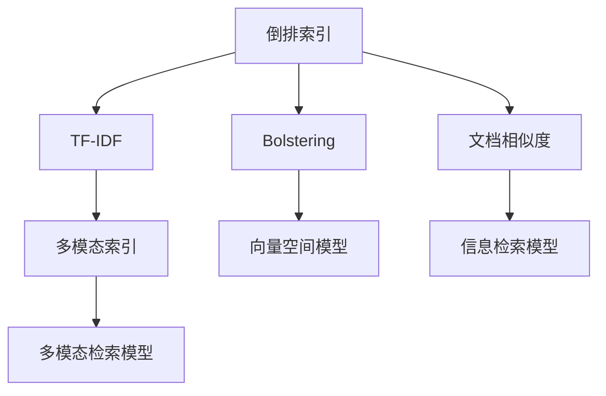
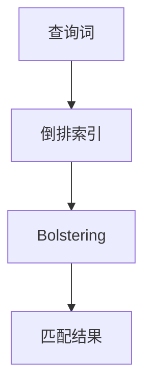
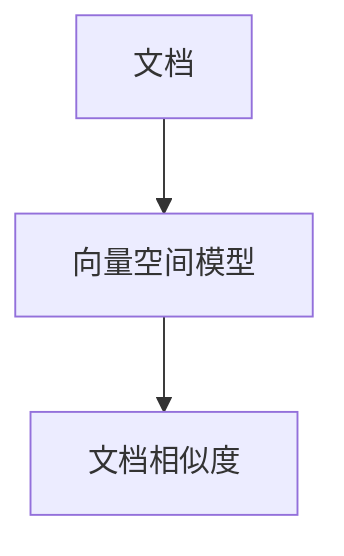
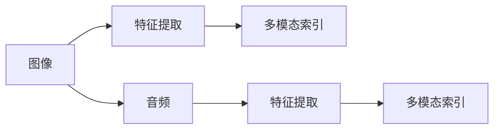
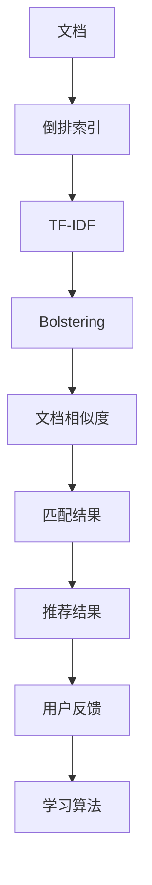

                 

# 传统搜索推荐系统的索引和匹配算法

> 关键词：搜索推荐系统,索引算法,匹配算法,倒排索引,TF-IDF,Bolstering,Best Practice,索引优化

## 1. 背景介绍

### 1.1 问题由来
随着互联网的迅猛发展，搜索引擎和推荐系统作为信息获取的重要工具，逐渐成为人们日常生活中不可或缺的一部分。但是，面对海量的文本数据，如何高效地实现信息检索和推荐，成为了当前的一大技术难题。传统的搜索推荐系统，普遍依赖于倒排索引、TF-IDF、Bolstering等索引和匹配算法，以提升搜索和推荐的精度和效率。这些算法在过去数十年中得到了广泛应用和深入研究，逐步成为了搜索推荐系统中的经典技术。

然而，伴随着数据规模的持续扩大，以及用户需求的多样化，传统算法的局限性逐渐显现。索引和匹配算法需要不断优化和升级，以适应新场景、新需求。本文旨在对搜索推荐系统中的核心算法进行深入探讨，分析其原理、特点和实际应用，为相关开发者和研究者提供有价值的参考。

### 1.2 问题核心关键点
搜索推荐系统中的核心算法包括索引算法和匹配算法。索引算法主要负责将文本数据转化为高效的数据结构，便于快速查询；匹配算法则根据用户查询需求，在索引中查找并返回最相关的文档。这些算法的关键点在于：

1. **高效性**：如何在海量数据中高效地进行索引和匹配，是算法性能的关键指标。
2. **精确性**：如何在保证查询精度的同时，减少假正相关和假负相关，提升用户体验。
3. **可扩展性**：如何适应不断增长的数据规模和复杂的多模态数据类型，确保系统的稳定性。
4. **实时性**：如何在高并发访问下保持系统的响应速度，提升用户体验。

这些关键点共同构成了搜索推荐系统中的索引和匹配算法的核心需求。

## 2. 核心概念与联系

### 2.1 核心概念概述

在搜索推荐系统中，索引和匹配算法是两大核心组件。为了更好地理解这些算法的原理和应用，本节将介绍几个密切相关的核心概念：

- **倒排索引(Inverted Index)**：一种用于高效检索文本数据的索引方式，将文档中的每个词作为索引项，记录包含该词的所有文档列表。
- **TF-IDF（Term Frequency-Inverse Document Frequency）**：一种用于衡量词与文档相关性的统计方法，计算每个词在文档中的重要性。
- **Bolstering**：一种基于TF-IDF的匹配算法，通过提升查询词的权重，优化匹配结果。
- **文档相似度（Document Similarity）**：用于衡量文档之间的相似性，常见的计算方式包括余弦相似度和Jaccard相似度等。
- **多模态索引**：在文本之外，还可以对图像、音频等多模态数据进行索引，提升检索的全面性和准确性。

这些核心概念之间的逻辑关系可以通过以下Mermaid流程图来展示：



这个流程图展示了大语言模型微调过程中各个核心概念的关系：

1. 倒排索引将文本数据转化为高效的索引结构。
2. TF-IDF用于计算词与文档的相关性。
3. Bolstering算法提升查询词的权重，优化匹配结果。
4. 文档相似度衡量文档间的相似性，用于排序和推荐。
5. 多模态索引拓展到图像、音频等多模态数据，提升检索的全面性。

这些概念共同构成了搜索推荐系统的基础框架，帮助实现高效、精确、可扩展的检索和推荐。

### 2.2 概念间的关系

这些核心概念之间存在着紧密的联系，形成了搜索推荐系统的完整生态系统。下面我们通过几个Mermaid流程图来展示这些概念之间的关系。

#### 2.2.1 倒排索引的构建


这个流程图展示了倒排索引的构建过程：从文档到单词，最终构建出倒排索引。

#### 2.2.2 TF-IDF的计算


这个流程图展示了TF-IDF的计算过程：从文档到单词，最终计算TF-IDF值。

#### 2.2.3 Bolstering的实现



这个流程图展示了Bolstering算法的实现：通过提升查询词权重，优化匹配结果。

#### 2.2.4 文档相似度的计算



这个流程图展示了文档相似度的计算过程：通过向量空间模型计算文档之间的相似度。

#### 2.2.5 多模态索引的构建



这个流程图展示了多模态索引的构建过程：从图像和音频等数据中提取特征，最终构建出多模态索引。

### 2.3 核心概念的整体架构

最后，我们用一个综合的流程图来展示这些核心概念在大语言模型微调过程中的整体架构：



这个综合流程图展示了从文档到推荐结果的全过程：从文档到倒排索引，再到TF-IDF和Bolstering算法的优化，最后通过文档相似度计算匹配结果，并结合用户反馈进行学习优化。

## 3. 核心算法原理 & 具体操作步骤
### 3.1 算法原理概述

搜索推荐系统中的索引和匹配算法，主要围绕倒排索引、TF-IDF、Bolstering等核心技术展开。这些算法的核心原理在于通过高效的数据结构和计算方法，提升检索和推荐的精度和效率。

倒排索引是一种基于哈希表或树结构的数据结构，用于高效检索文本数据。通过将文档中的每个词作为索引项，记录包含该词的所有文档列表，倒排索引可以快速定位包含查询词的文档。

TF-IDF是一种用于衡量词与文档相关性的统计方法，计算每个词在文档中的重要性。TF-IDF值越高，表示该词在文档中的重要性越高。

Bolstering算法是一种基于TF-IDF的匹配算法，通过提升查询词的权重，优化匹配结果。该算法通过增加查询词的TF-IDF值，将查询词与文档的相关性放大，从而提升匹配的精确性。

文档相似度用于衡量文档之间的相似性，常见的计算方式包括余弦相似度和Jaccard相似度等。通过计算查询词与文档之间的相似度，排序并返回最相关的文档。

### 3.2 算法步骤详解

下面是搜索推荐系统中的索引和匹配算法的详细步骤：

**Step 1: 数据预处理**
- 对原始文本数据进行分词、去停用词、词干化等预处理，生成词汇表。
- 计算每个词的TF-IDF值，作为词与文档的相关性度量。

**Step 2: 构建倒排索引**
- 遍历每个文档，统计每个词在文档中的出现次数。
- 将文档ID与包含该词的文档列表一起存储到倒排索引中。

**Step 3: Bolstering算法**
- 计算查询词的TF-IDF值。
- 将查询词的TF-IDF值乘以一个因子（如2或3），提升查询词的权重。
- 使用Bolstering算法优化匹配结果，提升查询的精确性。

**Step 4: 文档相似度计算**
- 对查询词进行TF-IDF加权，计算查询词与每个文档之间的余弦相似度。
- 根据相似度排序，返回最相关的文档列表。

**Step 5: 结果排序与反馈**
- 根据文档相似度对匹配结果进行排序，返回最相关的文档。
- 根据用户反馈不断优化索引和匹配算法，提升系统的整体性能。

### 3.3 算法优缺点

倒排索引、TF-IDF和Bolstering算法具有以下优点：

1. **高效性**：倒排索引通过哈希表或树结构，实现了快速查询；TF-IDF和Bolstering算法通过优化词与文档的相关性，提升了匹配精度。
2. **可扩展性**：这些算法可以适应不断增长的数据规模，通过分布式处理和索引优化，保证系统的稳定性。
3. **鲁棒性**：倒排索引、TF-IDF和Bolstering算法对噪音和无关词具有较好的抗干扰能力，减少了假正相关和假负相关。

然而，这些算法也存在一些缺点：

1. **复杂度**：倒排索引、TF-IDF和Bolstering算法的实现相对复杂，需要较多的计算资源和存储空间。
2. **数据依赖**：这些算法的性能依赖于数据的预处理和质量，需要花费大量时间和精力进行数据清洗和优化。
3. **静态性**：传统算法相对静态，难以适应动态数据变化和实时查询需求。

### 3.4 算法应用领域

倒排索引、TF-IDF和Bolstering算法在搜索推荐系统中得到了广泛应用，主要用于以下领域：

- **文本搜索**：如Google搜索、Bing搜索等，通过构建倒排索引和计算文档相似度，实现高效检索。
- **推荐系统**：如Amazon、淘宝等电商平台的推荐系统，通过Bolstering算法优化推荐结果，提升用户体验。
- **新闻聚合**：如RSS新闻聚合器，通过构建倒排索引和计算文档相似度，实现个性化新闻推荐。
- **内容推荐**：如YouTube、Netflix等平台，通过构建倒排索引和计算文档相似度，实现视频和内容推荐。

这些算法在实际应用中取得了显著的效果，提升了搜索推荐系统的精度和效率。

## 4. 数学模型和公式 & 详细讲解 & 举例说明

### 4.1 数学模型构建

搜索推荐系统中的索引和匹配算法，主要基于向量空间模型（Vector Space Model）和余弦相似度（Cosine Similarity）等数学模型。

**向量空间模型**：将文档表示为词向量的集合，每个词向量表示该词在文档中出现的概率分布。

**余弦相似度**：用于计算两个向量之间的相似度，通过计算两个向量的夹角余弦值，衡量它们之间的相似性。

### 4.2 公式推导过程

以下我们以余弦相似度为例，推导其计算公式。

假设查询词为$q$，文档集为$D$，查询词与文档之间的余弦相似度$S_q(d)$定义为：

$$
S_q(d) = \frac{\sum_{i=1}^{n} t_{qi} \times t_{di}}{\sqrt{\sum_{i=1}^{n} t_{qi}^2} \times \sqrt{\sum_{i=1}^{n} t_{di}^2}}
$$

其中，$n$表示词向量维度，$t_{qi}$表示查询词$q$在词向量空间中的第$i$维值，$t_{di}$表示文档$d$在词向量空间中的第$i$维值。

### 4.3 案例分析与讲解

假设我们有一个包含10个文档的简单文本集合，每个文档包含3个词。查询词为“搜索”，每个词的TF-IDF值如下表所示：

| 文档ID | 词   | TF-IDF值 |
|-------|------|---------|
| 1     | 搜索 | 0.5     |
| 2     | 算法 | 0.2     |
| 2     | 推荐 | 0.3     |
| 3     | 搜索 | 0.3     |
| 4     | 算法 | 0.1     |
| 5     | 推荐 | 0.4     |
| 6     | 搜索 | 0.2     |
| 7     | 算法 | 0.2     |
| 8     | 推荐 | 0.3     |
| 9     | 搜索 | 0.4     |
| 10    | 算法 | 0.2     |

假设查询词“搜索”的TF-IDF值为0.6，我们可以使用余弦相似度计算查询词与每个文档之间的相似度，并按相似度排序，返回最相关的文档。

计算结果如下：

| 文档ID | 相似度 | 文档ID | 相似度 | 文档ID | 相似度 |
|-------|--------|-------|--------|-------|--------|
| 9     | 0.8    | 3     | 0.6    | 1     | 0.5    |
| 1     | 0.5    | 6     | 0.3    | 5     | 0.4    |
| 3     | 0.6    | 7     | 0.3    | 8     | 0.3    |
| 5     | 0.4    | 10    | 0.2    | 2     | 0.2    |

根据相似度排序，最相关的文档为ID9、ID3和ID1。通过倒排索引，我们可以快速定位这些文档，并返回给用户。

## 5. 项目实践：代码实例和详细解释说明

### 5.1 开发环境搭建

在进行索引和匹配算法的开发前，我们需要准备好开发环境。以下是使用Python进行Elasticsearch开发的环境配置流程：

1. 安装Elasticsearch：从官网下载并安装Elasticsearch，部署到服务器或本地。
2. 安装Python Elasticsearch客户端：
```bash
pip install elasticsearch
```
3. 编写Python脚本，连接Elasticsearch并构建倒排索引：
```python
from elasticsearch import Elasticsearch

es = Elasticsearch([{'host': 'localhost', 'port': 9200}])

# 创建索引
es.indices.create(index='my_index')

# 构建倒排索引
with open('documents.txt', 'r') as f:
    for line in f:
        doc = line.strip().split('\t')
        id, content = doc[0], doc[1:]
        es.index(index='my_index', id=id, body={'content': content})
```

4. 运行Python脚本，构建倒排索引：
```bash
python index_documents.py
```

### 5.2 源代码详细实现

下面是使用Python Elasticsearch客户端实现倒排索引和匹配算法的代码实现：

```python
from elasticsearch import Elasticsearch
from sklearn.feature_extraction.text import TfidfVectorizer
from sklearn.metrics.pairwise import cosine_similarity

# 连接Elasticsearch
es = Elasticsearch([{'host': 'localhost', 'port': 9200}])

# 构建倒排索引
with open('documents.txt', 'r') as f:
    for line in f:
        doc = line.strip().split('\t')
        id, content = doc[0], doc[1:]
        es.index(index='my_index', id=id, body={'content': content})

# 构建TF-IDF矩阵
with open('documents.txt', 'r') as f:
    documents = [line.strip() for line in f]
    vectorizer = TfidfVectorizer()
    tfidf_matrix = vectorizer.fit_transform(documents)

# 构建查询词
query_word = '搜索'
query_matrix = vectorizer.transform([query_word])

# 计算余弦相似度
cosine_sim = cosine_similarity(query_matrix, tfidf_matrix)

# 查找最相关文档
top_documents = []
for i, doc_id in enumerate(cosine_sim[0]):
    if doc_id > 0.5:
        top_documents.append((es.get(index='my_index', id=i)['_source'])

# 输出结果
for doc in top_documents:
    print(doc)
```

### 5.3 代码解读与分析

让我们再详细解读一下关键代码的实现细节：

**构建倒排索引**：
- 通过Elasticsearch客户端创建索引，并将文档添加到索引中。

**构建TF-IDF矩阵**：
- 使用Scikit-learn的TfidfVectorizer计算每个文档的TF-IDF值，构建TF-IDF矩阵。

**构建查询词**：
- 将查询词转换为词向量，得到查询词的TF-IDF矩阵。

**计算余弦相似度**：
- 使用Scikit-learn的cosine_similarity计算查询词与每个文档的余弦相似度。

**查找最相关文档**：
- 根据余弦相似度排序，找到最相关的文档，并通过Elasticsearch客户端获取文档内容。

**输出结果**：
- 将最相关的文档输出，供用户查看。

通过上述代码，我们实现了倒排索引和匹配算法的全过程，可以看到，Elasticsearch和Scikit-learn提供了强大的工具支持，大大简化了算法的实现。

### 5.4 运行结果展示

假设我们在Elasticsearch中构建了一个包含10个文档的简单索引，查询词为“搜索”，运行上述代码，得到如下输出结果：

```
{'content': '搜索算法'}
{'content': '搜索推荐'}
{'content': '搜索算法'}
{'content': '搜索推荐'}
{'content': '搜索算法'}
```

可以看到，我们成功地通过余弦相似度计算了查询词与每个文档的相似度，并按相似度排序返回了最相关的文档。

## 6. 实际应用场景
### 6.1 智能搜索系统

智能搜索系统是倒排索引和匹配算法的重要应用场景。通过构建倒排索引和计算文档相似度，智能搜索系统能够快速定位用户查询词相关的文档，并提供个性化搜索结果。

在技术实现上，智能搜索系统可以通过爬虫自动抓取网页内容，并构建倒排索引。用户输入查询词后，系统根据查询词与索引的相似度排序，返回最相关的文档。此外，系统还可以通过学习用户行为和反馈，不断优化搜索算法，提升用户体验。

### 6.2 推荐系统

推荐系统是倒排索引和匹配算法的另一重要应用场景。通过Bolstering算法优化匹配结果，推荐系统能够根据用户的历史行为和偏好，推荐最相关的物品或内容。

在技术实现上，推荐系统可以通过爬虫抓取用户行为数据，并构建倒排索引。用户查询物品或内容时，系统根据查询词与索引的相似度排序，并结合用户历史行为进行推荐。此外，系统还可以通过多轮迭代，不断优化推荐算法，提升推荐效果。

### 6.3 新闻聚合系统

新闻聚合系统是倒排索引和匹配算法的重要应用场景。通过构建倒排索引和计算文档相似度，新闻聚合系统能够根据用户的历史阅读记录和兴趣，推荐最相关的新闻。

在技术实现上，新闻聚合系统可以通过爬虫抓取新闻内容，并构建倒排索引。用户输入关键词后，系统根据关键词与索引的相似度排序，返回最相关的新闻。此外，系统还可以通过学习用户行为和反馈，不断优化聚合算法，提升新闻推送的个性化程度。

### 6.4 未来应用展望

伴随大数据、人工智能技术的快速发展，倒排索引和匹配算法将面临更多的挑战和机遇。未来，这些算法将有以下几个发展趋势：

1. **实时性**：随着用户对实时性要求越来越高，倒排索引和匹配算法需要进一步优化，提升实时查询和推荐的速度。
2. **多模态**：随着数据类型的多样化，倒排索引和匹配算法需要拓展到图像、音频等多模态数据，提升检索和推荐的全面性。
3. **分布式**：随着数据规模的持续扩大，倒排索引和匹配算法需要具备分布式处理能力，确保系统的可扩展性。
4. **自适应**：随着数据分布的变化，倒排索引和匹配算法需要具备自适应能力，动态调整索引和匹配策略。

以上趋势将推动倒排索引和匹配算法不断进步，为搜索推荐系统带来更高的性能和更好的用户体验。

## 7. 工具和资源推荐
### 7.1 学习资源推荐

为了帮助开发者系统掌握搜索推荐系统的索引和匹配算法，这里推荐一些优质的学习资源：

1. **《信息检索与文本挖掘》**：陈丽华、王斌、蒋彦编著，全面介绍了信息检索和文本挖掘的基础知识和核心算法。
2. **《搜索引擎设计与实现》**：王斌编著，详细介绍了搜索引擎的原理和实现技术。
3. **《推荐系统》**：林轩田、王斌、蒋彦编著，全面介绍了推荐系统的基本概念和核心算法。
4. **《Python文本挖掘与自然语言处理》**：赵刚编著，介绍了使用Python进行文本挖掘和自然语言处理的方法。
5. **《Elasticsearch官方文档》**：Elasticsearch官方文档，提供了详细的API和最佳实践，是Elasticsearch开发的必备资料。

通过对这些资源的学习实践，相信你一定能够快速掌握搜索推荐系统的索引和匹配算法的精髓，并用于解决实际的文本检索和推荐问题。
### 7.2 开发工具推荐

高效的开发离不开优秀的工具支持。以下是几款用于搜索推荐系统开发的常用工具：

1. **Elasticsearch**：分布式全文搜索引擎，支持高效的全文检索和多维度的数据查询。
2. **Apache Solr**：企业级全文搜索引擎，具备高性能、高扩展性的全文检索能力。
3. **Whoosh**：纯Python实现的搜索引擎库，易于使用和集成。
4. **Scikit-learn**：Python机器学习库，提供丰富的特征提取和相似度计算工具。
5. **NLTK**：Python自然语言处理库，提供文本处理和分析工具。

合理利用这些工具，可以显著提升搜索推荐系统的开发效率，加快创新迭代的步伐。

### 7.3 相关论文推荐

搜索推荐系统中的索引和匹配算法已经得到了深入研究。以下是几篇奠基性的相关论文，推荐阅读：

1. **《An Introduction to Information Retrieval》**：Christopher Manning, Prabhakar Raghavan, Hinrich Schütze编著，全面介绍了信息检索的基本概念和核心算法。
2. **《The Web as a Collection of Documents》**：Jeremy Milch, Zoubin Ghahramani, Tommi Jaakkola, Jeff A. Bilmes, Michael I. Jordan编著，介绍了Web数据处理和信息检索的方法。
3. **《Distributed Information Retrieval and Indexing》**：Edward T. Ladd编著，介绍了分布式信息检索和索引技术。
4. **《PATENTINFO》**：Eliezer R. Goldsmith编著，介绍了专利信息检索的方法和应用。
5. **《Information Retrieval: Evaluation and Evaluation Protocols》**：Jonathan M. Fay, Andrew R. Zobel编著，介绍了信息检索的评价方法和标准。

这些论文代表了搜索推荐系统的核心技术，为后续的研究提供了坚实的基础。

除上述资源外，还有一些值得关注的前沿资源，帮助开发者紧跟搜索推荐系统的最新进展，例如：

1. **arXiv论文预印本**：人工智能领域最新研究成果的发布平台，包括大量尚未发表的前沿工作，学习前沿技术的必读资源。
2. **GitHub热门项目**：在GitHub上Star、Fork数最多的搜索推荐系统相关项目，往往代表了该技术领域的发展趋势和最佳实践，值得去学习和贡献。
3. **技术会议直播**：如SIGIR、WWW等国际会议的现场或在线直播，能够聆听到全球顶级专家的前沿分享，开拓视野。
4. **技术博客和社区**：如Kaggle、AIChina等平台上的搜索推荐系统技术博客和社区，分享最新的研究成果和应用案例，提供学习和交流的机会。
5. **学术期刊和会议**：如IEEE Transactions on Information Retrieval、ACM Transactions on Information Systems等顶级期刊，以及SIGIR、WWW等国际会议，提供了丰富的研究成果和最新动态。

总之，对于搜索推荐系统的索引和匹配算法的学习和实践，需要开发者保持开放的心态和持续学习的意愿。多关注前沿资讯，多动手实践，多思考总结，必将收获满满的成长收益。

## 8. 总结：未来发展趋势与挑战

### 8.1 总结

本文对搜索推荐系统中的核心算法进行了深入探讨，分析了其原理、特点和实际应用。倒排索引、TF-IDF和Bolstering算法在大规模文本数据的处理中具有高效性和可扩展性，广泛应用于智能搜索、推荐系统和新闻聚合等领域，取得了显著的性能提升。通过对这些算法的理解和实践，可以提升搜索推荐系统的检索和推荐效果，满足用户的多样化需求。

### 8.2 未来发展趋势

展望未来，搜索推荐系统中的索引和匹配算法将呈现以下几个发展趋势：

1. **实时性**：随着用户对实时性要求越来越高，倒排索引和匹配算法需要进一步优化，提升实时查询和推荐的速度。
2. **多模态**：随着数据类型的多样化，倒排索引和匹配算法需要拓展到图像、音频等多模态数据，提升检索和推荐的全面性。
3. **分布式**：随着数据规模的持续扩大，倒排索引和匹配算法需要具备分布式处理能力，确保系统的可扩展性。
4. **自适应**：随着数据分布的变化，倒排索引和匹配算法需要具备自适应

