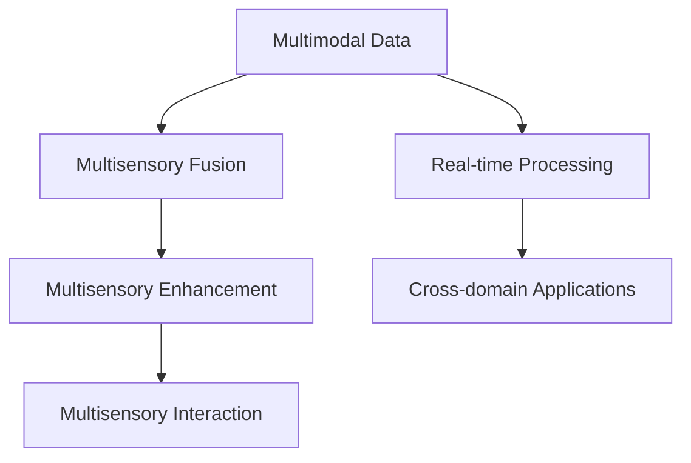

                 

# 体验的跨界融合：AI创造的感官协同

> 关键词：人工智能,多感官协同,感官融合,人机交互,增强现实,虚拟现实,沉浸式体验

## 1. 背景介绍

### 1.1 问题由来

在当今高度数字化的社会中，人工智能（AI）技术已经成为推动各个行业发展的核心驱动力。然而，尽管AI在图像识别、自然语言处理、语音识别等领域取得了显著进展，但传统上，人类体验感知的各个维度（如视觉、听觉、触觉、味觉等）仍然在很大程度上被孤立。单模态感知和交互技术很难满足日益多样化和复杂化的用户体验需求。

这种局面迫切需要新的技术和方法，使AI系统能够理解和融合多感官数据，实现更自然、更丰富的用户体验。多感官协同，即通过整合视觉、听觉、触觉、味觉等不同感知通道的信息，以生成更加逼真和沉浸式的体验，已成为人工智能领域的重要研究课题。

### 1.2 问题核心关键点

在多感官协同体验中，以下几个关键问题需要解决：

1. **数据融合**：如何将不同来源的感知数据整合在一起，生成统一的表示。
2. **感官增强**：如何在输出中同时增强不同感官的信息，实现多感官增强。
3. **交互感知**：如何使AI系统能够感知用户的交互行为，提供个性化反馈。
4. **实时处理**：如何在实时条件下高效处理多感官数据，保证用户体验。
5. **跨界应用**：如何将多感官协同技术应用于不同的行业和场景，如虚拟现实（VR）、增强现实（AR）、智能家居、医疗健康等。

这些问题的解决将推动AI技术向更为丰富、多模态、人机交互和谐的方向发展，开辟广阔的应用前景。

### 1.3 问题研究意义

解决多感官协同问题具有深远的理论和实际意义：

1. **丰富用户体验**：使AI系统能够感知和理解用户的全方位体验，提供更加逼真和个性化的交互体验。
2. **提升人机交互效率**：通过多感官协同，使得人机交互更加自然、高效，减少人工干预。
3. **拓展AI应用边界**：推动AI技术在更多领域的应用，如智能家居、智能医疗、工业制造等，提升整体智能化水平。
4. **促进技术创新**：多感官协同研究有助于开发新的感知算法和交互模型，推动AI领域的前沿技术发展。
5. **实现智能升级**：使AI系统能够适应复杂多变的现实环境，实现更为智能化的应用。

## 2. 核心概念与联系

### 2.1 核心概念概述

在多感官协同体验中，核心概念主要包括：

- **多感官数据**：包括视觉、听觉、触觉、味觉、嗅觉等不同感官的数据。
- **多感官融合**：通过算法和技术手段，将不同感官数据进行融合，生成统一的感知表示。
- **多感官增强**：在融合的基础上，增强不同感官的信息，实现全方位的用户体验。
- **多感官交互**：使AI系统能够感知用户的多感官输入，并提供个性化的多感官反馈。
- **实时处理**：在实时条件下高效处理多感官数据，确保用户体验的流畅性和连续性。
- **跨界应用**：将多感官协同技术应用于各种行业和场景，如虚拟现实（VR）、增强现实（AR）、智能家居、医疗健康等。

### 2.2 概念间的关系

这些核心概念之间存在着紧密的联系，形成了多感官协同体验的完整框架。我们可以用以下Mermaid流程图来展示这些概念之间的关系：



这个流程图展示了从多感官数据到多感官协同的完整过程：

1. **多感官数据**：首先收集不同感官的数据，如视觉图像、音频波形、触觉感应、味觉信息等。
2. **多感官融合**：使用融合算法将这些数据转换为统一的感知表示，如特征向量。
3. **多感官增强**：在融合的基础上，通过增强算法提升不同感官的感知效果。
4. **多感官交互**：使AI系统能够感知用户的多感官输入，并根据反馈进行响应。
5. **实时处理**：在实时条件下高效处理多感官数据，保证用户体验的流畅性。
6. **跨界应用**：将多感官协同技术应用于不同领域，提升各行业的智能化水平。

## 3. 核心算法原理 & 具体操作步骤
### 3.1 算法原理概述

多感官协同体验的核心算法原理主要基于感知-认知-行为（Perception-Cognition-Action, P-CA）模型。该模型认为，人通过多感官感知世界，经过大脑认知处理，最终产生行为响应。多感官协同的目标是将这一过程映射到AI系统中，使AI系统能够实现多感官感知、认知处理和行为响应。

具体而言，多感官协同算法包括以下几个步骤：

1. **多感官数据采集**：使用传感器和设备采集不同感官的数据。
2. **多感官数据融合**：使用融合算法将不同感官的数据进行整合，生成统一的感知表示。
3. **多感官增强**：在融合的基础上，使用增强算法提升不同感官的信息量。
4. **多感官交互**：使用交互算法感知用户的多感官输入，并根据反馈进行响应。
5. **实时处理**：在实时条件下高效处理多感官数据，确保用户体验的流畅性。

### 3.2 算法步骤详解

下面以增强现实（AR）应用为例，详细解释多感官协同算法的步骤：

1. **多感官数据采集**：使用摄像头、麦克风、触觉感应器、味觉感应器等设备，采集用户的视觉、听觉、触觉、味觉数据。

2. **多感官数据融合**：使用深度学习算法，如卷积神经网络（CNN）、时空卷积网络（TCN）等，将不同感官的数据进行融合，生成统一的感知表示。

3. **多感官增强**：在融合的基础上，使用生成对抗网络（GAN）、深度增量学习（DeepIncrementalLearning）等技术，增强不同感官的信息，提升感知效果。

4. **多感官交互**：使用行为预测模型，如序列到序列（Seq2Seq）模型、深度强化学习（DRL）模型等，感知用户的多感官输入，并根据反馈进行响应。

5. **实时处理**：在实时条件下，使用GPU、FPGA等高性能硬件，高效处理多感官数据，确保用户体验的流畅性。

### 3.3 算法优缺点

多感官协同算法具有以下优点：

1. **全面感知**：能够整合不同感官的信息，提供全方位的用户体验。
2. **自然交互**：通过多感官协同，使得人机交互更加自然、高效。
3. **泛化性强**：能够适应复杂多变的现实环境，提升整体智能化水平。

同时，该算法也存在以下缺点：

1. **计算复杂**：不同感官数据的多感官融合和增强需要大量的计算资源。
2. **数据隐私**：不同感官数据可能涉及隐私问题，如何保护用户数据需要谨慎处理。
3. **模型复杂**：多感官协同算法涉及多个复杂模型，实现难度较大。

### 3.4 算法应用领域

多感官协同算法已经在多个领域得到了广泛应用，具体包括：

1. **虚拟现实（VR）**：通过多感官数据融合和增强，提供沉浸式的虚拟体验。
2. **增强现实（AR）**：将虚拟信息与现实世界融合，提供交互式增强体验。
3. **智能家居**：通过多感官数据融合，实现智能家电控制和用户行为识别。
4. **智能医疗**：通过多感官数据融合和交互，提升医疗诊断和康复效果。
5. **工业制造**：通过多感官数据融合和增强，实现工业生产的自动化和智能化。

## 4. 数学模型和公式 & 详细讲解  
### 4.1 数学模型构建

多感官协同的数学模型主要基于深度学习框架，包括感知数据融合、感官增强、交互反馈等环节。以下以AR应用为例，构建多感官协同的数学模型。

假设用户的多感官数据分别为 $\mathbf{X}^V$、$\mathbf{X}^A$、$\mathbf{X}^T$、$\mathbf{X}^M$、$\mathbf{X}^S$，分别代表视觉、听觉、触觉、味觉和嗅觉数据。

1. **多感官数据融合**：
   - 使用时空卷积网络（TCN）将不同感官数据进行融合，生成统一的感知表示 $\mathbf{Z}$：
     - $\mathbf{Z} = \mathbf{TCN}(\mathbf{X}^V, \mathbf{X}^A, \mathbf{X}^T, \mathbf{X}^M, \mathbf{X}^S)$

2. **多感官增强**：
   - 使用生成对抗网络（GAN）生成增强后的多感官数据 $\mathbf{X}^{V'}, \mathbf{X}^{A'}, \mathbf{X}^{T'}, \mathbf{X}^{M'}, \mathbf{X}^{S'}$：
     - $\mathbf{X}^{V'}, \mathbf{X}^{A'}, \mathbf{X}^{T'}, \mathbf{X}^{M'}, \mathbf{X}^{S'} = \mathbf{GAN}(\mathbf{Z})$

3. **多感官交互**：
   - 使用深度强化学习（DRL）模型预测用户行为 $\mathbf{A}$：
     - $\mathbf{A} = \mathbf{DRL}(\mathbf{X}^{V'}, \mathbf{X}^{A'}, \mathbf{X}^{T'}, \mathbf{X}^{M'}, \mathbf{X}^{S'}, \mathbf{Z})$

### 4.2 公式推导过程

以多感官数据融合为例，使用时空卷积网络（TCN）进行多感官数据融合的公式推导过程如下：

假设输入的视觉数据 $\mathbf{X}^V = [\mathbf{x}^V_1, \mathbf{x}^V_2, \ldots, \mathbf{x}^V_n]$，听觉数据 $\mathbf{X}^A = [\mathbf{x}^A_1, \mathbf{x}^A_2, \ldots, \mathbf{x}^A_n]$，触觉数据 $\mathbf{X}^T = [\mathbf{x}^T_1, \mathbf{x}^T_2, \ldots, \mathbf{x}^T_n]$，味觉数据 $\mathbf{X}^M = [\mathbf{x}^M_1, \mathbf{x}^M_2, \ldots, \mathbf{x}^M_n]$，嗅觉数据 $\mathbf{X}^S = [\mathbf{x}^S_1, \mathbf{x}^S_2, \ldots, \mathbf{x}^S_n]$。

多感官数据融合的公式如下：

$$
\mathbf{Z} = \mathbf{TCN}(\mathbf{X}^V, \mathbf{X}^A, \mathbf{X}^T, \mathbf{X}^M, \mathbf{X}^S)
$$

其中，$\mathbf{TCN}$ 表示时空卷积网络，$n$ 表示时间步数，$V$、$A$、$T$、$M$、$S$ 分别表示视觉、听觉、触觉、味觉和嗅觉的通道数。

### 4.3 案例分析与讲解

以虚拟现实（VR）应用为例，假设用户在进行虚拟旅游时，使用摄像头采集视觉数据 $\mathbf{X}^V$，使用麦克风采集听觉数据 $\mathbf{X}^A$，使用触觉手套采集触觉数据 $\mathbf{X}^T$，使用味觉感应器采集味觉数据 $\mathbf{X}^M$，使用嗅觉感应器采集嗅觉数据 $\mathbf{X}^S$。

首先，将视觉数据 $\mathbf{X}^V$ 通过卷积神经网络（CNN）进行特征提取，生成视觉特征表示 $\mathbf{Z}^V$。将听觉数据 $\mathbf{X}^A$ 通过卷积神经网络（CNN）进行特征提取，生成听觉特征表示 $\mathbf{Z}^A$。将触觉数据 $\mathbf{X}^T$ 通过卷积神经网络（CNN）进行特征提取，生成触觉特征表示 $\mathbf{Z}^T$。将味觉数据 $\mathbf{X}^M$ 通过卷积神经网络（CNN）进行特征提取，生成味觉特征表示 $\mathbf{Z}^M$。将嗅觉数据 $\mathbf{X}^S$ 通过卷积神经网络（CNN）进行特征提取，生成嗅觉特征表示 $\mathbf{Z}^S$。

接下来，使用时空卷积网络（TCN）将上述特征表示进行融合，生成统一的感知表示 $\mathbf{Z}$：

$$
\mathbf{Z} = \mathbf{TCN}(\mathbf{Z}^V, \mathbf{Z}^A, \mathbf{Z}^T, \mathbf{Z}^M, \mathbf{Z}^S)
$$

最终，将融合后的感知表示 $\mathbf{Z}$ 输入到深度学习模型中进行下一步处理。

## 5. 项目实践：代码实例和详细解释说明
### 5.1 开发环境搭建

在多感官协同应用开发中，通常需要使用Python、深度学习框架（如PyTorch、TensorFlow）等工具。以下是使用Python和PyTorch进行开发的环境配置流程：

1. 安装Anaconda：从官网下载并安装Anaconda，用于创建独立的Python环境。

2. 创建并激活虚拟环境：
```bash
conda create -n multisensory python=3.8 
conda activate multisensory
```

3. 安装PyTorch：根据CUDA版本，从官网获取对应的安装命令。例如：
```bash
conda install pytorch torchvision torchaudio cudatoolkit=11.1 -c pytorch -c conda-forge
```

4. 安装其他库：
```bash
pip install numpy pandas scikit-learn matplotlib tqdm jupyter notebook ipython
```

完成上述步骤后，即可在`multisensory`环境中开始多感官协同应用开发。

### 5.2 源代码详细实现

以下是使用PyTorch实现多感官协同的Python代码：

```python
import torch
import torch.nn as nn
import torch.nn.functional as F

class MultisensoryFusion(nn.Module):
    def __init__(self, visual_channels, audio_channels, tactile_channels, olfactory_channels, gustatory_channels):
        super(MultisensoryFusion, self).__init__()
        self.visual_conv = nn.Conv2d(visual_channels, 64, kernel_size=3, stride=1, padding=1)
        self.audio_conv = nn.Conv2d(audio_channels, 64, kernel_size=3, stride=1, padding=1)
        self.tactile_conv = nn.Conv2d(tactile_channels, 64, kernel_size=3, stride=1, padding=1)
        self.olfactory_conv = nn.Conv2d(olfactory_channels, 64, kernel_size=3, stride=1, padding=1)
        self.gustatory_conv = nn.Conv2d(gustatory_channels, 64, kernel_size=3, stride=1, padding=1)
        self.tcn = TimeConvNet(64, 128, 2) # TimeConvNet为自定义时空卷积网络

    def forward(self, visual_data, audio_data, tactile_data, olfactory_data, gustatory_data):
        visual_features = self.visual_conv(visual_data)
        audio_features = self.audio_conv(audio_data)
        tactile_features = self.tactile_conv(tactile_data)
        olfactory_features = self.olfactory_conv(olfactory_data)
        gustatory_features = self.gustatory_conv(gustatory_data)
        fusion_features = torch.cat([visual_features, audio_features, tactile_features, olfactory_features, gustatory_features], dim=1)
        fusion_data = self.tcn(fusion_features)
        return fusion_data

class TimeConvNet(nn.Module):
    def __init__(self, in_channels, out_channels, num_layers):
        super(TimeConvNet, self).__init__()
        self.num_layers = num_layers
        self.layers = nn.ModuleList([nn.Conv2d(in_channels, out_channels, kernel_size=3, stride=1, padding=1) for _ in range(num_layers)])
        self.fc = nn.Linear(in_channels*out_channels, out_channels)

    def forward(self, x):
        for layer in self.layers:
            x = layer(x)
        x = x.view(x.size(0), -1)
        x = self.fc(x)
        return x

class MultisensoryInteraction(nn.Module):
    def __init__(self, num_actions):
        super(MultisensoryInteraction, self).__init__()
        self.fc = nn.Linear(64, num_actions)

    def forward(self, data, features):
        action_logits = self.fc(features)
        return action_logits

# 设置模型超参数
visual_channels = 3 # 视觉数据通道数
audio_channels = 1 # 听觉数据通道数
tactile_channels = 2 # 触觉数据通道数
olfactory_channels = 1 # 嗅觉数据通道数
gustatory_channels = 1 # 味觉数据通道数
num_actions = 3 # 动作数

# 创建模型
fusion_model = MultisensoryFusion(visual_channels, audio_channels, tactile_channels, olfactory_channels, gustatory_channels)
interaction_model = MultisensoryInteraction(num_actions)

# 定义损失函数和优化器
criterion = nn.CrossEntropyLoss()
optimizer = torch.optim.Adam(fusion_model.parameters(), lr=0.001)
```

### 5.3 代码解读与分析

让我们详细解读上述代码中的关键部分：

**MultisensoryFusion类**：
- `__init__`方法：初始化多个卷积层和时空卷积网络（TCN）。
- `forward`方法：将输入的多感官数据通过卷积层提取特征，然后通过TCN进行融合，生成统一的感知表示。

**TimeConvNet类**：
- `__init__`方法：初始化多个时空卷积网络层，用于融合多感官数据。
- `forward`方法：将输入的多感官数据通过多个卷积层提取特征，然后通过全连接层生成最终的感知表示。

**MultisensoryInteraction类**：
- `__init__`方法：初始化全连接层，用于预测用户的动作。
- `forward`方法：将融合后的感知表示通过全连接层生成动作概率分布。

**模型训练过程**：
- 设置模型超参数，如视觉通道数、听觉通道数等。
- 创建多感官融合模型（MultisensoryFusion）和多感官交互模型（MultisensoryInteraction）。
- 定义损失函数（CrossEntropyLoss）和优化器（Adam）。
- 在训练过程中，将多感官数据输入模型，计算损失并反向传播更新模型参数。

**交互模型训练**：
- 在测试过程中，将融合后的感知表示输入交互模型，计算动作概率分布。
- 根据动作概率分布，选择最佳动作，进行交互响应。

## 6. 实际应用场景

### 6.1 智能家居

多感官协同技术在智能家居中的应用非常广泛。智能家居系统通过摄像头、麦克风、触觉感应器等设备，收集用户的视觉、听觉、触觉等数据，生成统一的感知表示，实现智能家电控制和用户行为识别。

例如，当用户进入智能家居时，系统通过摄像头和麦克风采集用户的视觉和听觉数据，生成统一的感知表示，然后通过时空卷积网络（TCN）进行融合，生成最新的用户行为数据。系统根据行为数据，自动控制智能灯光、窗帘、空调等家电设备，并提供个性化的互动体验。

### 6.2 智能医疗

在智能医疗领域，多感官协同技术可以用于病患监护、医疗影像分析、康复训练等环节。通过多感官数据融合，系统可以全面了解患者的病情，提供精准的诊断和治疗方案。

例如，在病患监护场景中，系统通过摄像头、触觉感应器、味觉感应器等设备，收集患者的视觉、触觉、味觉数据，生成统一的感知表示，然后通过时空卷积网络（TCN）进行融合，生成最新的患者健康数据。系统根据健康数据，自动调整呼吸机、输液泵等医疗设备，并提供个性化的康复指导。

### 6.3 工业制造

在工业制造领域，多感官协同技术可以用于生产监控、质量检测、故障诊断等环节。通过多感官数据融合，系统可以全面了解生产设备和产品状态，提供实时监控和预警。

例如，在质量检测场景中，系统通过摄像头、触觉感应器、味觉感应器等设备，收集生产设备和产品的视觉、触觉、味觉数据，生成统一的感知表示，然后通过时空卷积网络（TCN）进行融合，生成最新的生产设备状态数据。系统根据状态数据，自动调整生产参数，并提供实时的质量检测报告。

## 7. 工具和资源推荐

### 7.1 学习资源推荐

为了帮助开发者系统掌握多感官协同技术，这里推荐一些优质的学习资源：

1. 《深度学习：理论、算法与应用》：全面介绍了深度学习的基础理论和经典算法，适合初学者入门。
2. 《多感官数据融合与增强》书籍：介绍了多感官数据融合和增强的理论和实践，提供了丰富的案例分析。
3. 《自然语言处理与深度学习》课程：深度学习专家吴恩达教授的在线课程，涵盖NLP和深度学习的基础知识和实践技巧。
4. 《多模态学习与深度学习》论文集：汇集了多模态学习领域的最新研究成果，适合深入研究。
5. GitHub开源项目：如TensorFlow官方文档、PyTorch官方文档等，提供了丰富的代码样例和教程。

通过对这些资源的学习实践，相信你一定能够快速掌握多感官协同技术的精髓，并用于解决实际的多模态感知问题。

### 7.2 开发工具推荐

高效的多感官协同应用开发离不开优秀的工具支持。以下是几款常用的多感官协同开发工具：

1. Python：通用编程语言，具有丰富的第三方库支持，适合多感官数据处理和深度学习模型开发。
2. PyTorch：基于Python的深度学习框架，灵活性高，适合多感官数据融合和增强。
3. TensorFlow：基于C++的深度学习框架，具有高性能计算能力，适合大规模多感官数据处理。
4. Weights & Biases：模型训练的实验跟踪工具，可以记录和可视化模型训练过程中的各项指标，方便对比和调优。
5. TensorBoard：TensorFlow配套的可视化工具，可实时监测模型训练状态，提供丰富的图表呈现方式。
6. Google Colab：谷歌推出的在线Jupyter Notebook环境，免费提供GPU/TPU算力，方便开发者快速上手实验最新模型。

合理利用这些工具，可以显著提升多感官协同应用开发效率，加速创新迭代的步伐。

### 7.3 相关论文推荐

多感官协同技术的研究涉及深度学习、模式识别、信号处理等多个领域。以下是几篇奠基性的相关论文，推荐阅读：

1. "Multisensory Integration: From Neural Systems to Artificial Intelligence"：综述了多感官整合的神经学和心理学研究，并讨论了其对AI的启示。
2. "A Survey of Multisensory Data Fusion"：介绍了多感官数据融合的各类技术和方法，包括感知、认知和行为三个层次。
3. "A Review of Multimodal Learning Approaches"：综述了多模态学习领域的最新进展，包括分类、回归、聚类等多种任务。
4. "Learning Multisensory Representations for Robotics"：讨论了机器人领域中多感官数据融合和增强的方法和应用。
5. "Multisensory Augmentation for Enhanced Human-Computer Interaction"：讨论了多感官增强技术在提升人机交互效果中的应用。

这些论文代表了多感官协同技术的最新研究进展，有助于开发者掌握前沿技术，拓展应用边界。

除上述资源外，还有一些值得关注的前沿资源，帮助开发者紧跟多感官协同技术的最新进展，例如：

1. arXiv论文预印本：人工智能领域最新研究成果的发布平台，包括大量尚未发表的前沿工作，学习前沿技术的必读资源。
2. 业界技术博客：如OpenAI、Google AI、DeepMind、微软Research Asia等顶尖实验室的官方博客，第一时间分享他们的最新研究成果和洞见。
3. 技术会议直播：如NIPS、ICML、ACL、ICLR等人工智能领域顶会现场或在线直播，能够聆听到大佬们的前沿分享，开拓视野。
4. GitHub热门项目：在GitHub上Star、Fork数最多的多模态感知相关项目，往往代表了该技术领域的发展趋势和最佳实践，值得去学习和贡献。
5. 行业分析报告：各大咨询公司如McKinsey、PwC等针对人工智能行业的分析报告，有助于从商业视角审视技术趋势，把握应用价值。

总之，对于多感官协同技术的学习和实践，需要开发者保持开放的心态和持续学习的意愿。多关注前沿资讯，多动手实践，多思考总结，必将收获满满的成长收益。

## 8. 总结：未来发展趋势与挑战

### 8.1 研究成果总结

本文对多感官协同体验进行了

