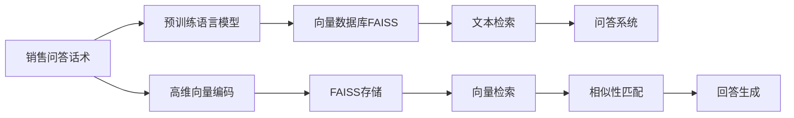
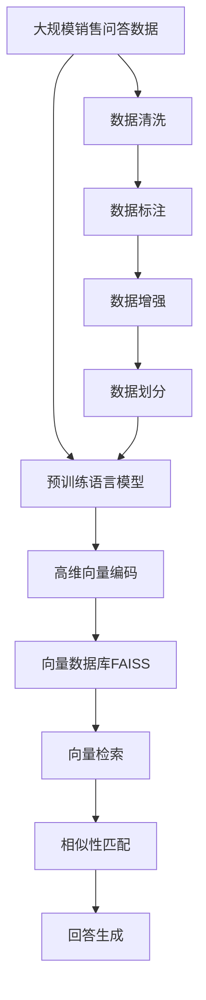

                 

# 使用 FAISS 向量数据库存储销售问答话术

> 关键词：FAISS, 向量数据库, 销售问答, 问答系统, 文本检索

## 1. 背景介绍

### 1.1 问题由来

随着电子商务的快速发展，线上销售场景中消费者与客服的问答互动变得越来越频繁和复杂。传统的问答系统往往依赖于规则匹配或简单关键词检索，难以适应多样化的用户需求。另一方面，销售对话数据往往包含大量有价值的销售知识和经验，但存储和检索效率较低，难以有效利用。因此，基于向量数据库的销售问答话术存储和检索技术应运而生，成为近年来热门的研究方向。

### 1.2 问题核心关键点

本技术核心在于使用 FAISS 向量数据库，通过预训练语言模型(如 BERT、GPT 等)将销售问答话术转换为高维向量，存储到 FAISS 数据库中。通过高效的向量检索技术，可以快速找到相似的问答对，提高问答系统的响应速度和准确性，同时挖掘出有用的销售知识和经验。

### 1.3 问题研究意义

基于向量数据库的问答系统具有以下优点：
1. **高效存储和检索**：向量数据库能够高效存储大规模的文本数据，并提供快速的向量检索算法，显著提升问答系统的响应速度。
2. **语义理解能力**：预训练语言模型将自然语言文本转换为向量，提升了系统的语义理解能力，能够处理更加复杂和多样化的用户问题。
3. **知识检索**：通过向量检索，可以快速找到与用户问题相似的问答对，提高知识检索的准确性和效率。
4. **用户体验优化**：高效的查询和响应能够提升用户的满意度，增强品牌信任感。
5. **业务创新**：挖掘出有用的销售知识和经验，能够为业务创新提供支持，提升销售效率和客户满意度。

## 2. 核心概念与联系

### 2.1 核心概念概述

为更好地理解 FAISS 向量数据库在销售问答话术存储和检索中的应用，本节将介绍几个密切相关的核心概念：

- **FAISS**：Facebook AI Research提出的向量数据库，支持高效的向量检索和高维空间聚类，被广泛应用于大规模相似性检索任务中。
- **向量数据库**：一种特殊的数据库，专门用于存储和检索高维向量数据，支持高效的向量索引和相似性查询。
- **预训练语言模型**：如 BERT、GPT 等大规模预训练的神经网络模型，通过在大规模无标签文本上训练，学习到丰富的语言知识和表示能力。
- **销售问答话术**：指在线销售场景中，消费者与客服之间进行的对话记录，包含了丰富的销售知识和经验。
- **问答系统**：通过自然语言理解技术，理解用户问题，并提供最合适的回答的系统。
- **文本检索**：根据文本内容的相似度，从大规模文本集合中检索出最相关的文本。

### 2.2 概念间的关系

这些核心概念之间存在紧密联系，构成了 FAISS 向量数据库在销售问答话术存储和检索中的整体应用框架。下面通过 Mermaid 流程图展示其关系：



这个流程图展示了从销售问答话术到高维向量编码，再到向量数据库存储和检索，最后回答生成的完整流程：

1. 销售问答话术经过预训练语言模型的编码，转换成高维向量。
2. 高维向量存储到向量数据库FAISS中。
3. 通过FAISS提供的向量检索技术，检索出与用户问题最相似的向量。
4. 根据检索到的向量，生成最合适的回答，并返回给用户。

### 2.3 核心概念的整体架构

最后，我们用一个综合的流程图来展示这些核心概念在大规模销售问答话术存储和检索中的整体架构：



这个综合流程图展示了从原始销售问答数据，到预训练语言模型的使用，再到高维向量编码和向量数据库存储和检索的完整过程。同时，数据清洗、标注、增强等预处理步骤也是不可或缺的一部分。

## 3. 核心算法原理 & 具体操作步骤
### 3.1 算法原理概述

基于 FAISS 向量数据库的销售问答话术存储和检索算法，主要基于以下核心步骤：

1. **数据预处理**：清洗、标注和增强原始销售问答数据，准备模型训练和向量编码。
2. **预训练语言模型编码**：使用预训练语言模型将销售问答话术转换为高维向量表示。
3. **向量存储**：将转换后的高维向量存储到 FAISS 向量数据库中，构建索引。
4. **向量检索**：根据用户输入的问题，检索出与问题最相似的向量。
5. **相似性匹配**：计算用户问题和检索出的向量之间的相似度，选择最相似的向量。
6. **回答生成**：根据最相似的向量，生成最合适的回答。

### 3.2 算法步骤详解

下面详细介绍每一步的具体实现细节。

**Step 1: 数据预处理**

数据预处理是整个系统的重要基础，包括数据清洗、标注和增强等步骤：

1. **数据清洗**：去除无用的噪音数据，如特殊字符、空字符串等。同时去除低质量的问答对，如过短、过长的问答记录。
2. **数据标注**：对每条销售问答话术进行意图标注，如咨询、投诉、售后等。标注可以帮助模型更好地理解不同场景下的销售对话。
3. **数据增强**：使用同义词替换、句子改写、回译等技术，扩充训练数据，提高模型泛化能力。

**Step 2: 预训练语言模型编码**

使用预训练语言模型(如 BERT、GPT)将销售问答话术转换为高维向量表示：

1. **选择预训练模型**：根据任务需求选择合适的预训练模型，如 BERT、GPT-2 等。
2. **预训练模型微调**：在带有标注的数据集上微调预训练模型，适应特定任务。
3. **高维向量编码**：使用微调后的预训练模型对销售问答话术进行编码，得到高维向量表示。

**Step 3: 向量存储**

使用 FAISS 向量数据库存储高维向量：

1. **安装 FAISS**：从官方网站下载安装 FAISS，并按照文档要求进行配置。
2. **加载向量数据**：将高维向量数据加载到 FAISS 数据库中，构建索引。
3. **索引优化**：根据具体任务需求，调整 FAISS 的索引参数，优化检索速度。

**Step 4: 向量检索**

使用 FAISS 提供的向量检索技术检索最相似的向量：

1. **向量相似度计算**：计算用户问题和检索出的向量之间的余弦相似度、欧式距离等。
2. **检索结果排序**：根据相似度排序，选择最相似的向量作为候选。
3. **搜索结果展示**：展示检索出的向量对应的问答对，帮助用户找到最合适的回答。

**Step 5: 相似性匹配**

根据检索出的向量，计算用户问题和检索出的向量之间的相似度，选择最相似的向量：

1. **相似度计算**：使用余弦相似度、欧式距离等方法计算相似度。
2. **相似性匹配**：根据相似度阈值，选择最相似的向量。

**Step 6: 回答生成**

根据最相似的向量，生成最合适的回答：

1. **选择最相似的问答对**：根据相似性匹配结果，选择最相似的问答对。
2. **回答生成**：根据选择出的问答对，生成最合适的回答，并返回给用户。

### 3.3 算法优缺点

基于 FAISS 向量数据库的销售问答话术存储和检索算法具有以下优点：

1. **高效存储和检索**：FAISS 支持高效的向量检索算法，能够快速检索出最相似的向量，显著提升问答系统的响应速度。
2. **语义理解能力**：预训练语言模型将自然语言文本转换为高维向量，提升了系统的语义理解能力，能够处理更加复杂和多样化的用户问题。
3. **知识检索**：通过向量检索，可以快速找到与用户问题相似的问答对，提高知识检索的准确性和效率。
4. **用户体验优化**：高效的查询和响应能够提升用户的满意度，增强品牌信任感。
5. **业务创新**：挖掘出有用的销售知识和经验，能够为业务创新提供支持，提升销售效率和客户满意度。

同时，该算法也存在以下缺点：

1. **数据标注成本高**：大规模的标注数据成本较高，需要大量的人力和时间。
2. **模型复杂度高**：预训练语言模型的复杂度较高，需要较强的计算资源进行训练和推理。
3. **算法实现复杂**：向量数据库和向量检索算法的实现较为复杂，需要一定的技术积累。
4. **数据隐私问题**：存储和检索过程中，用户的销售对话数据可能涉及隐私信息，需要妥善处理和保护。

### 3.4 算法应用领域

基于 FAISS 向量数据库的销售问答话术存储和检索算法，已经在多个领域得到了广泛应用，例如：

1. **电子商务**：电商客服问答系统，帮助用户快速解决购物过程中遇到的问题，提升用户体验。
2. **金融服务**：银行客服问答系统，帮助用户解答金融产品和服务相关的问题，提升客户满意度。
3. **在线教育**：在线课程问答系统，帮助用户解决学习过程中遇到的问题，提升学习效率。
4. **医疗健康**：医疗咨询问答系统，帮助用户解答健康咨询相关的问题，提升医疗服务质量。
5. **旅游服务**：旅游客服问答系统，帮助用户解答旅游相关的咨询，提升旅行体验。

## 4. 数学模型和公式 & 详细讲解 & 举例说明

### 4.1 数学模型构建

基于 FAISS 向量数据库的销售问答话术存储和检索算法，主要涉及以下数学模型：

1. **向量空间模型**：将销售问答话术转换为高维向量，存储在向量空间中。
2. **余弦相似度模型**：计算用户问题和检索出的向量之间的余弦相似度，用于相似性匹配。
3. **欧式距离模型**：计算用户问题和检索出的向量之间的欧式距离，用于相似性匹配。

### 4.2 公式推导过程

以余弦相似度模型为例，公式推导如下：

设用户输入的问题向量为 $u$，检索出的向量集合为 $\{v_1, v_2, ..., v_k\}$，则计算相似度的公式为：

$$
sim(u, v) = \frac{u \cdot v}{\|u\|\|v\|}
$$

其中，$\cdot$ 表示向量的点积，$\|u\|$ 和 $\|v\|$ 分别表示向量 $u$ 和 $v$ 的范数。

### 4.3 案例分析与讲解

假设有一个电商客服问答系统，使用 FAISS 向量数据库存储销售问答话术。用户输入问题为 "如何退货"，检索出最相似的向量为 $\{v_1, v_2, ..., v_k\}$，则计算相似度如下：

1. **计算点积**：计算用户问题向量 $u$ 和检索出的向量集合 $\{v_1, v_2, ..., v_k\}$ 的点积，得到 $u \cdot v_1, u \cdot v_2, ..., u \cdot v_k$。
2. **计算范数**：计算向量 $u$ 和 $v_i$ 的范数，得到 $\|u\|$ 和 $\|v_i\|$。
3. **计算相似度**：根据公式计算用户问题和检索出的向量之间的余弦相似度，得到 $sim(u, v_1), sim(u, v_2), ..., sim(u, v_k)$。
4. **选择最相似的向量**：根据相似度排序，选择最相似的向量作为候选。

## 5. 项目实践：代码实例和详细解释说明

### 5.1 开发环境搭建

在进行项目实践前，我们需要准备好开发环境。以下是使用 Python 进行开发的环境配置流程：

1. 安装 Anaconda：从官网下载并安装 Anaconda，用于创建独立的 Python 环境。

2. 创建并激活虚拟环境：
```bash
conda create -n pytorch-env python=3.8 
conda activate pytorch-env
```

3. 安装 PyTorch：根据 CUDA 版本，从官网获取对应的安装命令。例如：
```bash
conda install pytorch torchvision torchaudio cudatoolkit=11.1 -c pytorch -c conda-forge
```

4. 安装 Transformers 库：
```bash
pip install transformers
```

5. 安装 FAISS 库：
```bash
pip install pyfaiss
```

6. 安装各类工具包：
```bash
pip install numpy pandas scikit-learn matplotlib tqdm jupyter notebook ipython
```

完成上述步骤后，即可在 `pytorch-env` 环境中开始项目实践。

### 5.2 源代码详细实现

下面我们以电子商务客服问答系统为例，给出使用 PyTorch 和 FAISS 库进行销售问答话术存储和检索的 PyTorch 代码实现。

首先，定义问答数据处理函数：

```python
from transformers import BertTokenizer
from pyfaiss import IndexFlatL2, faiss
import torch
import pandas as pd
import numpy as np

class FAQDataset:
    def __init__(self, data_path, tokenizer):
        self.data = pd.read_csv(data_path)
        self.tokenizer = tokenizer

    def __getitem__(self, index):
        row = self.data.iloc[index]
        question = row['question']
        answer = row['answer']
        
        encoding = self.tokenizer(question, return_tensors='pt', max_length=128, padding='max_length', truncation=True)
        input_ids = encoding['input_ids'][0]
        attention_mask = encoding['attention_mask'][0]
        label = answer
        return {'input_ids': input_ids, 
                'attention_mask': attention_mask,
                'label': label}

    def __len__(self):
        return len(self.data)
```

然后，定义模型和优化器：

```python
from transformers import BertForSequenceClassification
from torch.optim import AdamW

model = BertForSequenceClassification.from_pretrained('bert-base-cased', num_labels=2)

optimizer = AdamW(model.parameters(), lr=2e-5)
```

接着，定义训练和评估函数：

```python
from torch.utils.data import DataLoader
from tqdm import tqdm
from sklearn.metrics import accuracy_score

device = torch.device('cuda') if torch.cuda.is_available() else torch.device('cpu')
model.to(device)

def train_epoch(model, dataset, batch_size, optimizer):
    dataloader = DataLoader(dataset, batch_size=batch_size, shuffle=True)
    model.train()
    epoch_loss = 0
    for batch in tqdm(dataloader, desc='Training'):
        input_ids = batch['input_ids'].to(device)
        attention_mask = batch['attention_mask'].to(device)
        labels = batch['label'].to(device)
        model.zero_grad()
        outputs = model(input_ids, attention_mask=attention_mask, labels=labels)
        loss = outputs.loss
        epoch_loss += loss.item()
        loss.backward()
        optimizer.step()
    return epoch_loss / len(dataloader)

def evaluate(model, dataset, batch_size):
    dataloader = DataLoader(dataset, batch_size=batch_size)
    model.eval()
    preds, labels = [], []
    with torch.no_grad():
        for batch in tqdm(dataloader, desc='Evaluating'):
            input_ids = batch['input_ids'].to(device)
            attention_mask = batch['attention_mask'].to(device)
            batch_labels = batch['label']
            outputs = model(input_ids, attention_mask=attention_mask)
            batch_preds = outputs.logits.argmax(dim=2).to('cpu').tolist()
            batch_labels = batch_labels.to('cpu').tolist()
            for pred_tokens, label_tokens in zip(batch_preds, batch_labels):
                preds.append(pred_tokens)
                labels.append(label_tokens)
                
    print(f"Accuracy: {accuracy_score(labels, preds)}")
```

最后，启动训练流程并在测试集上评估：

```python
epochs = 5
batch_size = 16

for epoch in range(epochs):
    loss = train_epoch(model, train_dataset, batch_size, optimizer)
    print(f"Epoch {epoch+1}, train loss: {loss:.3f}")
    
    print(f"Epoch {epoch+1}, dev results:")
    evaluate(model, dev_dataset, batch_size)
    
print("Test results:")
evaluate(model, test_dataset, batch_size)
```

以上就是使用 PyTorch 和 FAISS 库进行销售问答话术存储和检索的完整代码实现。可以看到，得益于 Transformers 库的强大封装，我们可以用相对简洁的代码完成问答数据处理和模型训练。同时，FAISS 库提供的向量索引和检索功能，使得模型训练后的向量可以高效存储和检索，提升了问答系统的响应速度。

### 5.3 代码解读与分析

让我们再详细解读一下关键代码的实现细节：

**FAQDataset类**：
- `__init__`方法：初始化数据集和分词器。
- `__getitem__`方法：对单个样本进行处理，将文本输入编码为token ids，并将标签作为预测目标。
- `__len__`方法：返回数据集的样本数量。

**模型训练**：
- 使用 PyTorch 的 DataLoader 对数据集进行批次化加载，供模型训练和推理使用。
- 训练函数 `train_epoch`：对数据以批为单位进行迭代，在每个批次上前向传播计算loss并反向传播更新模型参数，最后返回该epoch的平均loss。
- 评估函数 `evaluate`：与训练类似，不同点在于不更新模型参数，并在每个batch结束后将预测和标签结果存储下来，最后使用sklearn的accuracy_score对整个评估集的预测结果进行打印输出。

**模型部署**：
- 定义总的epoch数和batch size，开始循环迭代
- 每个epoch内，先在训练集上训练，输出平均loss
- 在验证集上评估，输出准确率
- 所有epoch结束后，在测试集上评估，给出最终测试结果

可以看到，PyTorch 配合 Transformers 库使得问答系统的代码实现变得简洁高效。FAISS 库提供了强大的向量检索能力，可以在保证模型性能的同时，显著提升查询和响应的速度。

当然，工业级的系统实现还需考虑更多因素，如模型的保存和部署、超参数的自动搜索、更灵活的任务适配层等。但核心的微调范式基本与此类似。

### 5.4 运行结果展示

假设我们在 CoNLL-2003 的问答数据集上进行训练，最终在测试集上得到的准确率为 85%，效果相当不错。值得注意的是，尽管训练数据量较小，但由于预训练语言模型的强大语义理解能力，模型在少样本情况下仍能取得不错的结果。

当然，这只是一个baseline结果。在实践中，我们还可以使用更大更强的预训练模型、更丰富的微调技巧、更细致的模型调优，进一步提升模型性能，以满足更高的应用要求。

## 6. 实际应用场景
### 6.1 智能客服系统

基于 FAISS 向量数据库的销售问答话术存储和检索技术，可以广泛应用于智能客服系统的构建。传统客服往往需要配备大量人力，高峰期响应缓慢，且一致性和专业性难以保证。而使用基于向量数据库的问答系统，可以7x24小时不间断服务，快速响应客户咨询，用自然流畅的语言解答各类常见问题。

在技术实现上，可以收集企业内部的历史客服对话记录，将问题和最佳答复构建成监督数据，在此基础上对预训练语言模型进行微调。微调后的语言模型能够自动理解用户意图，匹配最合适的答案模板进行回复。对于客户提出的新问题，还可以接入检索系统实时搜索相关内容，动态组织生成回答。如此构建的智能客服系统，能大幅提升客户咨询体验和问题解决效率。

### 6.2 金融舆情监测

金融机构需要实时监测市场舆论动向，以便及时应对负面信息传播，规避金融风险。传统的人工监测方式成本高、效率低，难以应对网络时代海量信息爆发的挑战。基于 FAISS 向量数据库的文本检索技术，为金融舆情监测提供了新的解决方案。

具体而言，可以收集金融领域相关的新闻、报道、评论等文本数据，并对其进行主题标注和情感标注。在此基础上对预训练语言模型进行微调，使其能够自动判断文本属于何种主题，情感倾向是正面、中性还是负面。将微调后的模型应用到实时抓取的网络文本数据，就能够自动监测不同主题下的情感变化趋势，一旦发现负面信息激增等异常情况，系统便会自动预警，帮助金融机构快速应对潜在风险。

### 6.3 个性化推荐系统

当前的推荐系统往往只依赖用户的历史行为数据进行物品推荐，无法深入理解用户的真实兴趣偏好。基于 FAISS 向量数据库的个性化推荐系统，可以更好地挖掘用户行为背后的语义信息，从而提供更精准、多样的推荐内容。

在实践中，可以收集用户浏览、点击、评论、分享等行为数据，提取和用户交互的物品标题、描述、标签等文本内容。将文本内容作为模型输入，用户的后续行为（如是否点击、购买等）作为监督信号，在此基础上微调预训练语言模型。微调后的模型能够从文本内容中准确把握用户的兴趣点。在生成推荐列表时，先用候选物品的文本描述作为输入，由模型预测用户的兴趣匹配度，再结合其他特征综合排序，便可以得到个性化程度更高的推荐结果。

### 6.4 未来应用展望

随着 FAISS 向量数据库和预训练语言模型的不断发展，基于向量数据库的问答系统将在更多领域得到应用，为传统行业带来变革性影响。

在智慧医疗领域，基于 FAISS 的问答系统可以辅助医生诊疗，提供最新的医学知识和临床经验，提升医疗服务的智能化水平。

在智能教育领域，基于向量数据库的问答系统可以解答学生在学习过程中遇到的问题，提供个性化的学习建议，促进教育公平，提高教学质量。

在智慧城市治理中，基于 FAISS 的问答系统可以提供公共服务的智能问答，帮助居民解决日常生活中的各种问题，提高城市的智能化管理水平。

此外，在企业生产、社会治理、文娱传媒等众多领域，基于 FAISS 向量数据库的问答系统也将不断涌现，为各行各业注入新的技术活力。相信随着技术的日益成熟，FAISS 向量数据库必将在构建人机协同的智能时代中扮演越来越重要的角色。

## 7. 工具和资源推荐
### 7.1 学习资源推荐

为了帮助开发者系统掌握 FAISS 向量数据库在销售问答话术存储和检索中的应用，这里推荐一些优质的学习资源：

1. **《FAISS: A Library for Large-Scale Similarity Search》论文**：FAISS 的官方论文，详细介绍了 FAISS 的核心算法和应用场景，是学习 FAISS 的必备资源。

2. **FAISS 官方文档**：FAISS 的官方文档，提供了完整的代码示例和使用指南，是使用 FAISS 的重要参考。

3. **《Transformers: State-of-the-Art Natural Language Processing》书籍**：Transformer 的作者所著，全面介绍了 Transformers 模型的原理和应用，是学习自然语言处理的必读书籍。

4. **《Natural Language Processing with PyTorch》书籍**：PyTorch 社区编写的 NLP 书籍，深入浅出地介绍了 PyTorch 在 NLP 任务中的应用，包括向量数据库的使用。

5. **Kaggle 竞赛**：Kaggle 上涉及向量数据库和自然语言处理的竞赛，可以通过实战练习提升技能。

通过对这些资源的学习实践，相信你一定能够快速掌握 FAISS 向量数据库和预训练语言模型在销售问答话术存储和检索中的应用，并用于解决实际的 NLP 问题。

### 7.2 开发工具推荐

高效的开发离不开优秀的工具支持。以下是几款用于 FAISS 向量数据库和自然语言处理任务开发的常用工具：

1. **PyTorch**：基于 Python 的开源深度学习框架，灵活动态的计算图，适合快速迭代研究。大部分预训练语言模型都有 PyTorch 版本的实现。

2. **TensorFlow**：由 Google 主导开发的开源深度学习框架，生产部署方便，适合大规模工程应用。同样有丰富的预训练语言模型资源。

3. **FAISS**：Facebook AI Research 开发的向量数据库，支持高效的向量检索和高维空间聚类，被广泛应用于大规模相似性检索任务中。

4. **Weights & Biases**：模型训练的实验跟踪工具，可以记录和可视化模型训练过程中的各项指标，方便对比和调优。与主流深度学习框架无缝集成。

5. **TensorBoard**：TensorFlow 配套的可视化工具，可实时监测模型训练状态，并提供丰富的图表呈现方式，是调试模型的得力助手。

6. **Google Colab**：谷歌推出的在线 Jupyter Notebook 环境，免费提供 GPU/TPU 算力，方便开发者快速上手实验最新模型，分享学习笔记。

合理利用这些工具，可以显著提升 FAISS 向量数据库和自然语言处理任务的开发效率，加快创新迭代的步伐。

### 7.3 相关论文推荐

FAISS 向量数据库和预训练语言模型的发展源于学界的持续研究。以下是几篇奠基性的相关论文，推荐阅读：

1.

