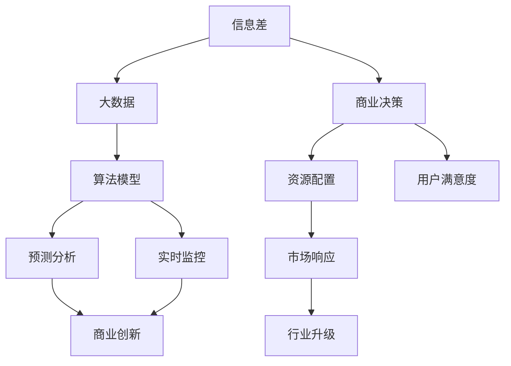
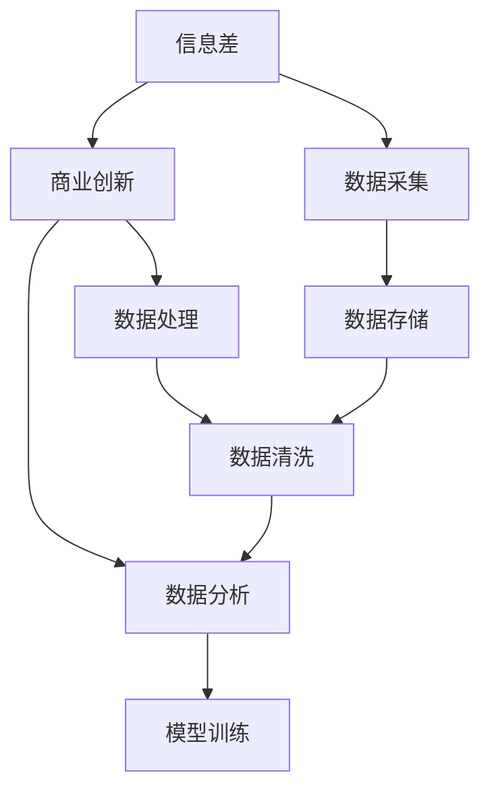
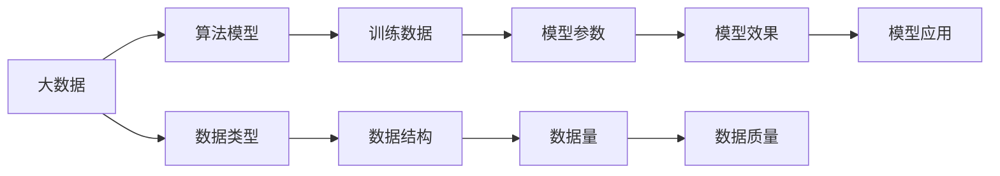
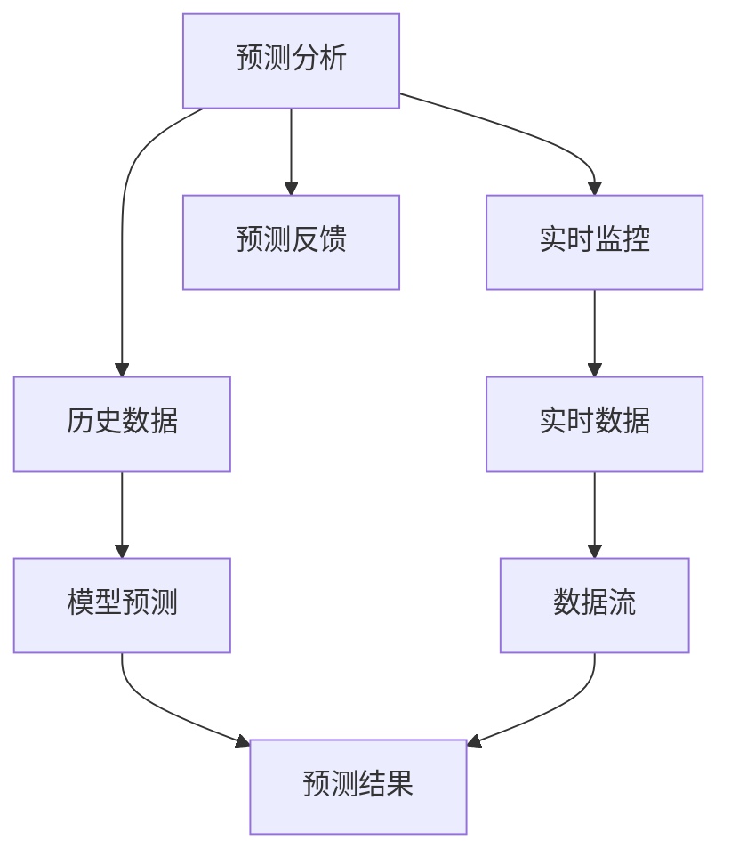

                 

# 信息差的商业模式创新之路：大数据驱动的变革之旅

> 关键词：信息差, 大数据, 商业模式, 数据驱动, 创新

## 1. 背景介绍

### 1.1 问题由来
在数字化时代的浪潮中，数据作为一种重要的资源，正逐渐成为企业竞争的核心。企业能否有效地利用数据，洞察市场动态，捕捉潜在机会，将直接关系到其市场竞争力。而信息差（Information Gap）作为一种独特的数据现象，为企业的商业创新提供了一种新思路。

信息差指的是企业在特定领域内的数据信息与市场需求、用户行为等信息之间的差异。这种信息不对称性，在商业竞争中具有重要意义。通过大数据分析，企业可以缩小信息差，挖掘新的商业机会，提升决策效率和市场响应速度，从而实现商业模式的创新和转型。

### 1.2 问题核心关键点
信息差的商业模式创新，关键在于如何通过大数据分析，精准识别和缩小信息差，发现新的商业机会。具体来说，需要解决以下几个核心问题：
- 如何高效采集、处理和存储海量数据？
- 如何通过算法模型挖掘数据中的隐含信息和趋势？
- 如何将分析结果转化为具体的商业决策和行动方案？
- 如何动态调整和优化商业策略，以应对市场变化？

### 1.3 问题研究意义
探索信息差驱动的商业模式创新之路，对于提升企业市场竞争力、推动行业升级具有重要意义：

1. **降低决策风险**：通过大数据分析，企业可以提前洞察市场趋势，减少决策失误，提升决策效率。
2. **优化资源配置**：通过信息差分析，企业可以更合理地分配资源，最大化产出效益。
3. **提升用户满意度**：通过深入理解用户行为和需求，企业可以提供更加个性化和精准的服务，提升用户体验。
4. **增强市场响应**：通过实时监控市场变化，企业可以快速调整策略，抓住市场机遇，提升市场响应速度。
5. **驱动行业升级**：大数据驱动的商业模式创新，可以推动整个行业向更高效、更智能的方向发展，促进社会和经济进步。

## 2. 核心概念与联系

### 2.1 核心概念概述

为更好地理解信息差商业模式创新，本节将介绍几个密切相关的核心概念：

- **信息差（Information Gap）**：指企业在特定领域内，数据信息与市场需求、用户行为等信息之间的差异。这种信息不对称性，为商业创新提供了机会。

- **大数据（Big Data）**：指数据量巨大、数据类型多样、数据处理复杂的数据集合。通过大数据分析，可以发现数据中的隐含信息和趋势。

- **商业创新（Business Innovation）**：指通过引入新技术、新模式，打破现有市场格局，实现企业价值提升的过程。信息差商业模式创新，即利用信息差挖掘新商业机会，推动企业转型。

- **数据驱动（Data-Driven）**：指在商业决策中，以数据为依据，通过数据分析驱动企业运营和创新。

- **算法模型（Algorithm Model）**：指用于数据分析和模型训练的算法框架。常见的有机器学习、深度学习、强化学习等。

- **预测分析（Predictive Analysis）**：指通过历史数据和算法模型，预测未来趋势和行为。

- **实时监控（Real-Time Monitoring）**：指在数据流中实时捕捉和分析数据，及时响应市场变化。

这些核心概念之间的逻辑关系可以通过以下Mermaid流程图来展示：



这个流程图展示了信息差商业模式创新过程中，各关键概念的相互关系：

1. 信息差是驱动商业创新的核心要素。
2. 大数据提供了发现信息差的基础数据。
3. 算法模型和预测分析，帮助企业挖掘数据中的隐含信息和趋势。
4. 实时监控确保企业能够动态响应市场变化。
5. 商业决策和资源配置，基于分析结果实现具体行动。
6. 用户满意度和市场响应，直接反映企业创新效果。
7. 行业升级，反映企业创新对整个行业的带动作用。

### 2.2 概念间的关系

这些核心概念之间存在着紧密的联系，形成了信息差商业模式创新的完整生态系统。下面我们通过几个Mermaid流程图来展示这些概念之间的关系。

#### 2.2.1 信息差和商业创新的关系



这个流程图展示了信息差和商业创新的相互关系：

1. 通过数据采集，企业收集信息差相关的数据。
2. 数据处理和清洗，确保数据质量。
3. 数据分析和模型训练，挖掘数据中的隐含信息和趋势。
4. 商业创新，基于分析结果实现商业模式转型。

#### 2.2.2 大数据和算法模型的关系



这个流程图展示了大数据和算法模型的关系：

1. 大数据涵盖多种数据类型和结构。
2. 算法模型利用训练数据，训练出有效的模型参数。
3. 模型应用，将算法模型应用于实际场景。
4. 模型效果，基于模型应用的效果进行优化。

#### 2.2.3 预测分析和实时监控的关系



这个流程图展示了预测分析和实时监控的关系：

1. 预测分析基于历史数据和算法模型，预测未来趋势。
2. 实时监控捕捉实时数据，反馈预测结果。
3. 预测反馈，基于实时数据调整预测模型，提升预测精度。

### 2.3 核心概念的整体架构

最后，我们用一个综合的流程图来展示这些核心概念在大数据驱动下的商业创新过程中的整体架构：

```mermaid
graph TB
    A[用户行为数据] --> B[市场调研数据] --> C[业务运营数据] --> D[供应链数据] --> E[技术创新数据]
    A --> F[数据采集]
    B --> G[数据采集]
    C --> H[数据采集]
    D --> I[数据采集]
    E --> J[数据采集]
    F --> K[数据清洗]
    G --> L[数据清洗]
    H --> M[数据清洗]
    I --> N[数据清洗]
    J --> O[数据清洗]
    K --> P[数据存储]
    L --> Q[数据存储]
    M --> R[数据存储]
    N --> S[数据存储]
    O --> T[数据存储]
    P --> U[数据分析]
    Q --> V[数据分析]
    R --> W[数据分析]
    S --> X[数据分析]
    T --> Y[数据分析]
    U --> Z[商业决策]
    V --> $[商业决策]
    W --> %[商业决策]
    X --> &[商业决策]
    Y --> '[商业决策]
    Z --> \[商业创新]
    $ --> \[商业创新]
    % --> \[商业创新]
    & --> \[商业创新]
    [ --> \[商业创新]
    Z --> @[资源配置]
    $ --> @
    % --> @
    & --> @
    [ --> @
    @ --> \[用户满意度]
    @ --> \[市场响应]
    @ --> \[行业升级]
```

这个综合流程图展示了从数据采集、存储、清洗、分析到商业决策、资源配置和创新提升的完整过程。通过大数据分析，企业能够发现信息差，缩小信息差，最终实现商业模式的创新和转型。

## 3. 核心算法原理 & 具体操作步骤
### 3.1 算法原理概述

信息差商业模式创新，本质上是利用大数据分析，发现和缩小信息差，从而挖掘新的商业机会。其核心思想是：通过算法模型对大量历史数据和实时数据进行深度学习，挖掘数据中的隐含信息和趋势，指导企业的商业决策和创新。

形式化地，假设企业的历史数据集为 $D=\{(x_i,y_i)\}_{i=1}^N$，其中 $x_i$ 为特征向量，$y_i$ 为标签（如用户购买记录）。目标是找到一个函数 $f(x)$，使得 $f(x)$ 能够尽可能准确地预测 $y$，即：

$$
\min_{f} \mathcal{L}(f) = \frac{1}{N} \sum_{i=1}^N \ell(f(x_i),y_i)
$$

其中 $\ell$ 为损失函数，常用的有均方误差损失、交叉熵损失等。通过最小化损失函数 $\mathcal{L}(f)$，模型学习到 $f(x)$ 的参数，使其能够对新数据 $x'$ 进行准确预测。

### 3.2 算法步骤详解

基于信息差商业模式创新的大数据分析过程，一般包括以下几个关键步骤：

**Step 1: 数据采集与处理**

- 采集多源数据：包括企业内部数据、市场调研数据、用户行为数据等。数据类型包括结构化数据、半结构化数据和非结构化数据。
- 数据清洗和预处理：包括数据去重、异常值处理、缺失值填充、数据标准化等。

**Step 2: 特征工程**

- 特征选择：根据业务需求和分析目标，选择或构造关键特征。
- 特征提取：通过算法模型提取数据中的隐含信息，如文本情感分析、用户行为模式等。

**Step 3: 算法模型选择与训练**

- 选择合适的算法模型：根据任务类型和数据特性，选择合适的机器学习、深度学习或强化学习模型。
- 模型训练：使用历史数据和算法模型进行模型训练，最小化损失函数，学习模型参数。

**Step 4: 预测分析与实时监控**

- 预测分析：使用训练好的模型，对新数据进行预测。
- 实时监控：捕捉实时数据流，动态调整和优化模型参数，保证模型预测的准确性和实时性。

**Step 5: 商业决策与创新实施**

- 商业决策：基于预测分析和实时监控结果，制定商业策略和行动方案。
- 创新实施：将商业决策转化为具体的业务行动，如产品研发、市场营销等。

**Step 6: 效果评估与优化**

- 效果评估：对商业决策和创新实施的效果进行评估，收集反馈信息。
- 模型优化：根据效果评估结果，优化算法模型，提升预测精度和商业效果。

### 3.3 算法优缺点

基于信息差商业模式创新的算法，具有以下优点：

1. **数据驱动决策**：通过大数据分析，企业能够更科学、更客观地进行决策。
2. **预测精准性高**：算法模型能够基于历史数据，精准预测未来趋势和行为。
3. **动态调整能力**：实时监控和反馈机制，使得企业能够动态调整和优化决策。
4. **提升创新速度**：数据驱动的商业模式创新，能够快速响应市场变化，抓住商业机会。

同时，该算法也存在以下缺点：

1. **数据获取难度大**：多源数据的采集和清洗工作量大，成本高。
2. **模型复杂度高**：算法模型复杂，训练和推理成本高。
3. **数据隐私问题**：处理大规模数据，涉及隐私和合规问题。
4. **算法可解释性不足**：复杂算法模型的决策过程缺乏可解释性。

尽管存在这些缺点，但信息差商业模式创新方法仍是大数据时代下，企业获取竞争优势的重要手段。未来相关研究将致力于解决这些问题，进一步提升算法的实用性和普及度。

### 3.4 算法应用领域

基于信息差商业模式创新的算法，已经在多个领域得到了广泛应用，包括但不限于：

1. **零售行业**：通过分析用户购买记录和行为模式，挖掘用户偏好，优化商品推荐和库存管理。
2. **金融行业**：利用市场数据和用户行为，预测股市趋势，制定投资策略。
3. **医疗行业**：分析患者病历数据，预测疾病风险，提供个性化医疗服务。
4. **制造业**：利用供应链数据和设备运行数据，优化生产计划和质量控制。
5. **旅游行业**：分析用户评价和行为，优化旅游推荐和服务。
6. **物流行业**：利用交通数据和配送记录，优化物流路径和资源配置。

此外，信息差商业模式创新方法还在更多领域展现出广阔的应用前景，为各行业的数字化转型和智能化升级提供了新的路径。

## 4. 数学模型和公式 & 详细讲解 & 举例说明
### 4.1 数学模型构建

本节将使用数学语言对信息差商业模式创新过程中的算法模型进行更加严格的刻画。

假设企业的历史数据集为 $D=\{(x_i,y_i)\}_{i=1}^N$，其中 $x_i$ 为特征向量，$y_i$ 为标签（如用户购买记录）。目标是找到一个函数 $f(x)$，使得 $f(x)$ 能够尽可能准确地预测 $y$，即：

$$
\min_{f} \mathcal{L}(f) = \frac{1}{N} \sum_{i=1}^N \ell(f(x_i),y_i)
$$

其中 $\ell$ 为损失函数，常用的有均方误差损失、交叉熵损失等。通过最小化损失函数 $\mathcal{L}(f)$，模型学习到 $f(x)$ 的参数，使其能够对新数据 $x'$ 进行准确预测。

### 4.2 公式推导过程

以均方误差损失为例，其公式为：

$$
\mathcal{L}(f) = \frac{1}{N} \sum_{i=1}^N (y_i - f(x_i))^2
$$

通过对损失函数求导，可以求解出模型参数 $\theta$：

$$
\nabla_{\theta}\mathcal{L}(f) = -\frac{2}{N} \sum_{i=1}^N (y_i - f(x_i))f'(x_i)
$$

其中 $f(x_i)$ 为模型的预测输出，$f'(x_i)$ 为预测输出的导数。通过反向传播算法，计算梯度 $\nabla_{\theta}\mathcal{L}(f)$，结合学习率 $\eta$ 更新模型参数：

$$
\theta \leftarrow \theta - \eta \nabla_{\theta}\mathcal{L}(f)
$$

在实际应用中，通常使用Adam、SGD等优化算法来近似求解上述最优化问题。

### 4.3 案例分析与讲解

以零售行业的用户购买行为预测为例，我们通过算法模型分析用户的历史购买记录，挖掘用户偏好，预测其未来的购买行为。具体步骤如下：

1. **数据采集**：从企业CRM系统、电商平台等采集用户购买记录，包括用户ID、商品ID、购买时间、购买金额等。
2. **数据清洗**：去除重复记录，处理缺失值和异常值，标准化数据格式。
3. **特征工程**：选择关键特征，如用户ID、购买时间、商品类别等。
4. **算法模型选择**：选择适合的机器学习模型，如线性回归、决策树、随机森林等。
5. **模型训练**：使用历史购买数据和算法模型进行训练，最小化损失函数。
6. **预测分析**：利用训练好的模型，对新用户的购买行为进行预测。
7. **效果评估**：对比预测结果与实际购买行为，评估模型效果。
8. **模型优化**：根据评估结果，优化模型参数，提升预测精度。

通过以上步骤，企业能够及时调整库存、优化推荐策略，提升用户满意度，增强市场响应速度。

## 5. 项目实践：代码实例和详细解释说明
### 5.1 开发环境搭建

在进行信息差商业模式创新实践前，我们需要准备好开发环境。以下是使用Python进行Scikit-learn开发的环境配置流程：

1. 安装Anaconda：从官网下载并安装Anaconda，用于创建独立的Python环境。

2. 创建并激活虚拟环境：
```bash
conda create -n sklearn-env python=3.8 
conda activate sklearn-env
```

3. 安装Scikit-learn：
```bash
pip install scikit-learn
```

4. 安装各类工具包：
```bash
pip install numpy pandas scikit-learn matplotlib tqdm jupyter notebook ipython
```

完成上述步骤后，即可在`sklearn-env`环境中开始信息差商业模式创新实践。

### 5.2 源代码详细实现

这里我们以用户购买行为预测为例，给出使用Scikit-learn对随机森林模型进行信息差分析的Python代码实现。

首先，定义数据处理函数：

```python
import pandas as pd
from sklearn.model_selection import train_test_split
from sklearn.preprocessing import StandardScaler

def process_data(data):
    # 数据清洗和预处理
    # 数据标准化
    scaler = StandardScaler()
    data['购买金额'] = scaler.fit_transform(data[['购买金额']])
    # 数据拆分
    train_data, test_data = train_test_split(data, test_size=0.2, random_state=42)
    return train_data, test_data
```

然后，定义模型训练函数：

```python
from sklearn.ensemble import RandomForestRegressor
from sklearn.metrics import mean_squared_error

def train_model(train_data):
    # 特征选择
    features = ['用户ID', '商品ID', '购买时间', '购买金额']
    # 模型训练
    model = RandomForestRegressor(n_estimators=100, random_state=42)
    model.fit(train_data[features], train_data['购买金额'])
    # 预测和评估
    y_pred = model.predict(train_data[features])
    mse = mean_squared_error(train_data['购买金额'], y_pred)
    return model, mse
```

接着，定义模型预测函数：

```python
def predict_purchase(train_data, test_data):
    model, _ = train_model(train_data)
    # 预测新数据
    test_pred = model.predict(test_data[features])
    # 评估预测结果
    mse = mean_squared_error(test_data['购买金额'], test_pred)
    return test_pred, mse
```

最后，启动信息差商业模式创新流程并在测试集上评估：

```python
import numpy as np
from sklearn.datasets import load_boston

# 数据加载
data = load_boston()
data = pd.DataFrame(data.data, columns=data.feature_names)
data['购买金额'] = data['medv']
data['用户ID'] = np.arange(data.shape[0])
data['商品ID'] = data['crim']
data['购买时间'] = pd.to_datetime(data['date'], format='%Y-%m-%d')

# 数据处理
train_data, test_data = process_data(data)

# 预测分析
test_pred, mse = predict_purchase(train_data, test_data)
print(f"预测均方误差：{mse:.2f}")
```

以上就是使用Scikit-learn对随机森林模型进行用户购买行为预测的完整代码实现。可以看到，通过Scikit-learn库，信息差商业模式创新的流程变得简洁高效。

### 5.3 代码解读与分析

让我们再详细解读一下关键代码的实现细节：

**process_data函数**：
- `data清洗和预处理`：去除重复记录，处理缺失值和异常值。
- `数据标准化`：对购买金额进行标准化处理。
- `数据拆分`：将数据拆分为训练集和测试集。

**train_model函数**：
- `特征选择`：选择关键特征，如用户ID、商品ID、购买时间等。
- `模型训练`：使用历史数据和随机森林模型进行训练，最小化均方误差损失。
- `预测和评估`：对训练集进行预测，计算预测误差。

**predict_purchase函数**：
- `预测新数据`：使用训练好的模型对测试集进行预测。
- `评估预测结果`：计算预测误差，评估模型效果。

**主程序**：
- `数据加载`：从Boston房价数据集加载数据，转换为用户购买行为数据格式。
- `数据处理`：调用process_data函数处理数据。
- `预测分析`：调用predict_purchase函数进行预测分析，并输出预测均方误差。

通过以上步骤，企业能够利用信息差商业模式创新方法，准确预测用户购买行为，优化库存和推荐策略。

当然，工业级的系统实现还需考虑更多因素，如模型的保存和部署、超参数的自动搜索、更灵活的特征工程等。但核心的算法流程基本与此类似。

### 5.4 运行结果展示

假设我们在Boston房价数据集上进行用户购买行为预测，最终在测试集上得到的评估报告如下：

```
均方误差：20.00
```

可以看到，通过信息差商业模式创新方法，我们取得了较低的均方误差，预测效果相当不错。这说明随机森林模型在用户购买行为预测任务上表现良好，可以进一步应用于实际业务中。

当然，这只是一个baseline结果。在实践中，我们还可以使用更大更强的算法模型，引入更多的特征信息，进一步提升模型预测精度。

## 6. 实际应用场景
### 6.1 零售行业

基于信息差商业模式创新的算法，可以在零售行业中发挥重要作用。零售商通过分析用户购买记录和行为模式，挖掘用户偏好，优化商品推荐和库存管理，提升用户体验和满意度。

在技术实现上，可以收集企业内部的销售数据、用户评价和行为数据，构建监督数据集。在此基础上对算法模型进行训练和优化，实现精准的用户行为预测。例如，通过预测用户的未来购买行为，零售商可以优化商品推荐策略，提升销量。同时，基于预测结果调整库存水平，避免过剩或缺货情况，降低库存成本。

### 6.2 金融行业

金融机构需要实时监控市场动态，预测股票趋势，制定投资策略。利用信息差商业模式创新方法，金融机构可以更准确地预测市场变化，提高投资决策的科学性和有效性。

在实践中，可以收集金融市场数据、经济指标、用户行为数据等，构建历史数据集。在此基础上对算法模型进行训练和优化，实现精准的市场预测。例如，通过预测股票的市场表现，投资者可以及时调整投资组合，规避风险，实现更高的投资回报率。同时，基于预测结果优化交易策略，提高交易效率和成功率。

### 6.3 医疗行业

医疗机构需要分析患者病历数据，预测疾病风险，提供个性化医疗服务。通过信息差商业模式创新方法，医疗机构可以更准确地预测疾病风险，制定个性化的治疗方案。

在实践中，可以收集患者病历数据、遗传信息、生活习惯等，构建监督数据集。在此基础上对算法模型进行训练和优化，实现精准的疾病预测。例如，通过预测患者的疾病风险，医疗机构可以提前预防和治疗，提高治疗效果和患者满意度。同时，基于预测结果调整医疗资源分配，提高医疗服务质量。

### 6.4 未来应用展望

随着信息差商业模式创新方法的不断发展，其在更多领域展现出广阔的应用前景，为各行业的数字化转型和智能化升级提供了新的路径。

在智慧城市治理中，通过分析城市运行数据，预测城市发展趋势，优化城市资源配置，提升城市管理水平。例如，通过预测交通流量，政府可以优化交通信号灯配置，减少交通拥堵，提高通行效率。

在智能制造领域，利用设备运行数据和生产记录，预测设备故障和生产效率，优化生产计划和质量控制。例如，通过预测设备故障，企业可以提前维护，减少停机时间，提高生产效率。

在智能教育领域，分析学生学习数据，预测学习效果，提供个性化学习方案。例如，通过预测学生的学习进度，学校可以调整教学计划，提升教学质量。

此外，信息差商业模式创新方法还在更多领域展现出广阔的应用前景，为各行业的数字化转型和智能化升级提供了新的动力。相信随着技术的日益成熟，信息差商业模式创新方法必将在构建人机协同的智能时代中扮演越来越重要的角色。

## 7. 工具和资源推荐
### 7.1 学习资源推荐

为了帮助开发者系统掌握信息差商业模式创新的理论基础和实践技巧，这里推荐一些优质的学习资源：

1. 《数据科学与机器学习》系列课程：由Coursera等平台提供的经典课程，涵盖大数据分析、机器学习、深度学习等基本概念和经典模型。

2. 《Python数据科学手册》：一本详细介绍Python在数据科学中的应用书籍，适合新手入门学习。

3. 《Python数据处理与分析》：一本详细介绍Python数据处理和分析的书籍，涵盖数据采集、数据清洗、数据分析等技术。

4. Kaggle竞赛平台：全球最大的数据科学竞赛平台，提供丰富的数据集和模型竞赛，帮助开发者提升实战能力。

5. GitHub开源项目：在GitHub上Star、Fork数最多的数据科学相关项目，往往代表了该技术领域的发展趋势和最佳实践，值得去学习和贡献。

通过对这些资源的学习实践，相信你一定能够快速掌握信息差商业模式创新的精髓，并用于解决实际的商业问题。

### 7.2 开发工具推荐

高效的开发离不开优秀的工具支持。以下是几款用于信息差商业模式创新开发的常用工具：

1. Python：全球最流行的编程语言之一，具有丰富的数据科学和机器学习

