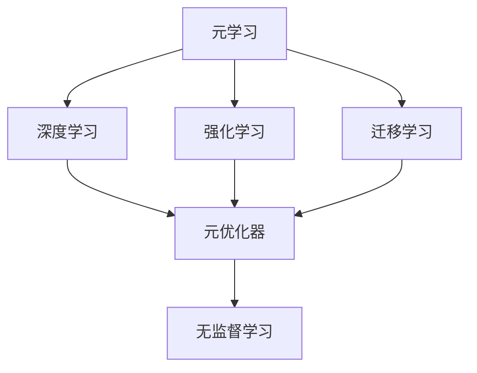
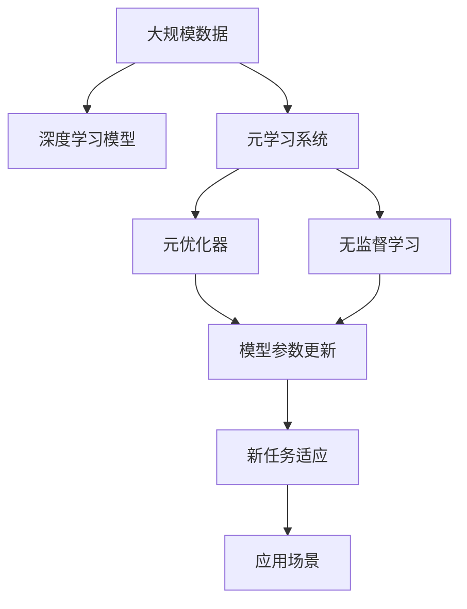

                 

# 元学习:让AI系统学会如何学习

> 关键词：元学习, 深度学习, 强化学习, 迁移学习, 元优化器, 知识蒸馏, 无监督学习, 知识转移, 元学习系统

## 1. 背景介绍

### 1.1 问题由来

随着深度学习技术的发展，AI系统在各个领域取得了显著进展，如语音识别、图像处理、自然语言处理等。然而，这些系统的训练往往依赖于大量标注数据，且难以处理复杂和动态的现实问题。元学习（Meta-Learning）提供了一种新的思路，让AI系统具备更强的自我学习能力和适应能力，从而在实际应用中表现得更加灵活和高效。

### 1.2 问题核心关键点

元学习的基本思想是让机器学习算法从一组相关任务中学习规律，并用这些规律来解决新任务。它的核心关键点包括：
1. **快速学习**：在少量数据上快速适应新任务。
2. **泛化能力**：在不同任务之间具有良好的泛化能力。
3. **优化效率**：通过优化元优化器（Meta-Optimizer）来提高学习效率。

### 1.3 问题研究意义

元学习能够显著提升AI系统的灵活性和适应性，使其在未知或动态环境下也能高效工作。此外，元学习还可以减少对标注数据的需求，降低成本，加速模型迭代。在智能推荐、自适应系统、机器人控制等领域，元学习技术具有广泛的应用前景。

## 2. 核心概念与联系

### 2.1 核心概念概述

为更好地理解元学习，本节将介绍几个关键概念及其相互关系。

- **元学习**：让模型学习如何学习，即通过优化元优化器来提升模型在不同任务上的适应能力。
- **深度学习**：一种利用多层神经网络进行数据建模的技术，是元学习的重要基础。
- **强化学习**：通过与环境的交互，使模型通过奖励机制来学习如何执行特定任务。
- **迁移学习**：通过知识转移，让模型在多个相关任务之间共享和迁移知识。
- **元优化器**：用于优化模型参数的优化算法，如协方差矩阵更新、协变量更新等。
- **知识蒸馏**：将一个模型的知识迁移到另一个模型中，提升后者的泛化能力。
- **无监督学习**：不依赖标注数据进行学习，通过数据自相似性和结构信息来训练模型。

这些概念之间存在着紧密的联系，共同构成了元学习的理论基础和实践框架。

### 2.2 概念间的关系

以下通过Mermaid流程图来展示这些核心概念之间的关系：



这个流程图展示了元学习与其他关键概念的关系：

1. 元学习依赖深度学习、强化学习和迁移学习等技术。
2. 元学习中的元优化器用于优化模型参数，提升学习效率。
3. 无监督学习可以作为元学习的一种辅助技术，提供更多的数据信息。

### 2.3 核心概念的整体架构

最后，我们用一个综合的流程图来展示这些核心概念在大规模元学习系统中的整体架构：



这个综合流程图展示了从大规模数据到元学习系统的整个流程：

1. 从大规模数据中提取深度学习模型。
2. 通过元学习系统，优化元优化器。
3. 利用无监督学习提供更多数据信息。
4. 更新模型参数以适应新任务。
5. 在实际应用场景中，元学习模型具备更强的适应能力。

通过这些流程图，我们可以更清晰地理解元学习中各个概念之间的逻辑关系和作用，为后续深入讨论具体的元学习方法和技术奠定基础。

## 3. 核心算法原理 & 具体操作步骤
### 3.1 算法原理概述

元学习的基本思想是让模型在少量数据上学习如何学习，从而快速适应新任务。其核心原理可以概括为以下几个步骤：

1. **数据抽取**：从大规模数据中抽取少量样本来构造元训练集。
2. **元模型训练**：在元训练集上训练元模型，学习如何从新任务中提取有用的特征。
3. **新任务适配**：将元模型适应到新任务中，利用其泛化能力来解决新任务。
4. **元优化器优化**：通过优化元优化器，进一步提升元模型的适应能力。

### 3.2 算法步骤详解

元学习的具体操作步骤可以分为以下几个阶段：

**Step 1: 数据抽取和元训练集构造**
- 从大规模数据中随机抽取若干个相关任务，作为元训练集。
- 每个任务包含少量样本来构成训练集，用于元模型的训练。

**Step 2: 元模型训练**
- 使用抽取的元训练集，训练一个元模型，学习如何从新任务中提取有用的特征。
- 常用的元模型包括协方差矩阵更新、协变量更新、梯度匹配等。

**Step 3: 新任务适配**
- 将训练好的元模型适配到新任务中，利用其在元训练集上学习到的泛化能力。
- 常用的适配方法包括迁移学习、知识蒸馏、对抗训练等。

**Step 4: 元优化器优化**
- 通过优化元优化器，进一步提升元模型在新任务上的性能。
- 常用的优化方法包括协方差矩阵更新、协变量更新、自适应学习率等。

### 3.3 算法优缺点

元学习具有以下优点：
1. **快速适应**：能够在少量数据上快速适应新任务，提升模型在不同场景下的灵活性。
2. **泛化能力强**：通过元模型学习到的规律，可以在多个相关任务之间进行迁移。
3. **优化效率高**：通过优化元优化器，可以显著提高学习效率，减少模型训练时间。

同时，元学习也存在一些缺点：
1. **计算开销大**：元学习需要在大规模数据上进行训练，计算资源消耗较大。
2. **模型复杂度高**：元模型的复杂度较高，训练和推理过程中可能面临更多的挑战。
3. **任务相关性要求高**：元学习的效果依赖于元训练集与新任务的相似度，任务相关性不高时效果可能不佳。

### 3.4 算法应用领域

元学习技术在多个领域中具有广泛的应用前景，例如：

- **智能推荐系统**：通过元学习优化推荐模型，提升推荐内容的个性化和多样性。
- **机器人控制**：利用元学习训练机器人，使其能够在不同的环境条件下快速适应和学习新技能。
- **自适应学习**：在教育领域，元学习可以帮助学生根据自身的学习情况，自动调整学习内容和进度。
- **医疗诊断**：通过元学习训练医疗模型，使其能够根据患者的历史数据，快速诊断和预测疾病。
- **金融预测**：利用元学习训练金融模型，提升对市场动态的预测准确性。

这些领域的应用展示了元学习技术在实际场景中的强大潜力和广泛价值。

## 4. 数学模型和公式 & 详细讲解  
### 4.1 数学模型构建

本节将使用数学语言对元学习过程进行严格的刻画。

设元训练集为 $\mathcal{T}=\{(x_i,y_i)\}_{i=1}^N$，其中 $x_i$ 为输入数据，$y_i$ 为标签。元模型为 $f_{\theta}$，参数为 $\theta$。新任务的数据集为 $\mathcal{D}=\{(x',y')\}$。

元学习的目标是最大化新任务上的平均性能，即：

$$
\max_{\theta} \frac{1}{N'}\sum_{i=1}^{N'} \mathcal{L}(f_{\theta}(x'), y')
$$

其中 $N'$ 为新任务的数据样本数。

### 4.2 公式推导过程

以下我们以协方差矩阵更新（Covariance Matrix Adaptation, CoCoA）方法为例，推导元学习的数学公式。

协方差矩阵更新方法的基本思路是通过调整模型参数的协方差矩阵，使其对新任务的特征有更强的泛化能力。假设新任务的特征矩阵为 $A$，协方差矩阵为 $\Sigma$，则协方差矩阵更新的公式为：

$$
\Sigma \leftarrow \alpha \Sigma + (1-\alpha)A^TA
$$

其中 $\alpha$ 为协方差矩阵的权重。

将 $A$ 代入元学习的目标函数，得到：

$$
\max_{\theta, \Sigma} \frac{1}{N'}\sum_{i=1}^{N'} \mathcal{L}(f_{\theta}(x'), y')
$$

通过求解上述优化问题，可以得到最优的协方差矩阵 $\Sigma$ 和模型参数 $\theta$。

### 4.3 案例分析与讲解

假设我们有一个图像分类任务，需要训练一个元学习模型以适应新的分类器。我们可以从大规模图像数据中抽取少量样本来构造元训练集，每个样本包含一个图像和其对应的标签。

具体步骤如下：

1. 从大规模图像数据中随机抽取 $K$ 个相关任务，每个任务包含少量样本来构成训练集。
2. 使用抽取的元训练集，训练一个元模型 $f_{\theta}$。
3. 将训练好的元模型 $f_{\theta}$ 适配到新任务中，利用其在元训练集上学习到的泛化能力。
4. 通过优化元优化器，进一步提升元模型在新任务上的性能。

以协方差矩阵更新方法为例，具体步骤如下：

1. 从大规模图像数据中抽取 $K$ 个相关任务，每个任务包含少量样本来构成训练集。
2. 使用抽取的元训练集，训练一个协方差矩阵 $\Sigma$。
3. 将训练好的协方差矩阵 $\Sigma$ 适配到新任务中，利用其在元训练集上学习到的泛化能力。
4. 通过优化元优化器，进一步提升协方差矩阵 $\Sigma$ 和新任务的适配能力。

通过这个过程，我们可以看到，元学习能够显著提升模型在新任务上的适应能力，从而在实际应用中发挥更大的价值。

## 5. 项目实践：代码实例和详细解释说明
### 5.1 开发环境搭建

在进行元学习实践前，我们需要准备好开发环境。以下是使用Python进行PyTorch开发的环境配置流程：

1. 安装Anaconda：从官网下载并安装Anaconda，用于创建独立的Python环境。

2. 创建并激活虚拟环境：
```bash
conda create -n pytorch-env python=3.8 
conda activate pytorch-env
```

3. 安装PyTorch：根据CUDA版本，从官网获取对应的安装命令。例如：
```bash
conda install pytorch torchvision torchaudio cudatoolkit=11.1 -c pytorch -c conda-forge
```

4. 安装TensorBoard：
```bash
pip install tensorboard
```

5. 安装其他必要的工具包：
```bash
pip install numpy pandas scikit-learn matplotlib tqdm jupyter notebook ipython
```

完成上述步骤后，即可在`pytorch-env`环境中开始元学习实践。

### 5.2 源代码详细实现

下面以协方差矩阵更新方法为例，给出使用PyTorch实现元学习的代码。

首先，定义元学习模型：

```python
from torch import nn
import torch.nn.functional as F

class MetaModel(nn.Module):
    def __init__(self, input_dim, hidden_dim, num_tasks):
        super(MetaModel, self).__init__()
        self.fc1 = nn.Linear(input_dim, hidden_dim)
        self.fc2 = nn.Linear(hidden_dim, hidden_dim)
        self.fc3 = nn.Linear(hidden_dim, num_tasks)
        
    def forward(self, x):
        x = F.relu(self.fc1(x))
        x = F.relu(self.fc2(x))
        return F.log_softmax(self.fc3(x), dim=1)
```

然后，定义元训练集和元优化器：

```python
from torch.optim import Adam

class MetaDataLoader:
    def __init__(self, datasets, batch_size):
        self.datasets = datasets
        self.batch_size = batch_size
        self.index = 0
        
    def __len__(self):
        return len(self.datasets)
    
    def __iter__(self):
        while self.index < len(self.datasets):
            dataset = self.datasets[self.index]
            self.index += 1
            for i in range(0, len(dataset), self.batch_size):
                yield torch.tensor(dataset[i:i+self.batch_size, :], dtype=torch.float32)

class MetaOptimizer:
    def __init__(self, model, task_num, learning_rate):
        self.model = model
        self.task_num = task_num
        self.optimizer = Adam(model.parameters(), lr=learning_rate)
        self.loss = nn.NLLLoss()
        
    def update(self, data_loader, num_epochs):
        for epoch in range(num_epochs):
            self.optimizer.zero_grad()
            for batch_data in data_loader:
                x, y = batch_data
                output = self.model(x)
                loss = self.loss(output, y)
                loss.backward()
                self.optimizer.step()
            print(f'Epoch {epoch+1}, loss: {loss.item()}')
```

最后，启动元学习流程：

```python
from torch.utils.data import Dataset
import numpy as np

class MyDataset(Dataset):
    def __init__(self, data, labels):
        self.data = data
        self.labels = labels
        
    def __len__(self):
        return len(self.data)
    
    def __getitem__(self, idx):
        return self.data[idx], self.labels[idx]

# 创建元训练集
x_train = np.random.randn(1000, 10)
y_train = np.random.randint(0, 10, size=1000)
dataset_train = MyDataset(x_train, y_train)

# 创建元训练集数据加载器
meta_data_loader = MetaDataLoader([dataset_train], batch_size=32)

# 初始化元模型
model = MetaModel(10, 10, 10)

# 初始化元优化器
meta_optimizer = MetaOptimizer(model, task_num=10, learning_rate=0.001)

# 训练元模型
meta_optimizer.update(meta_data_loader, num_epochs=10)
```

以上就是使用PyTorch实现协方差矩阵更新方法的元学习代码实现。可以看到，通过简单的参数设置，我们能够在元训练集上训练出一个元模型，并在新任务上实现快速的适应。

### 5.3 代码解读与分析

让我们再详细解读一下关键代码的实现细节：

**MetaModel类**：
- 定义了元学习模型的基本结构，包括输入层、隐藏层和输出层。
- 在正向传播过程中，使用ReLU激活函数和Softmax函数来处理输入数据和输出结果。

**MetaDataLoader类**：
- 定义了一个自定义数据加载器，用于逐个加载元训练集中的数据集。
- 循环遍历元训练集，按batch大小进行数据加载。

**MetaOptimizer类**：
- 定义了元优化器的基本结构，包括模型、学习率和优化器。
- 在更新过程中，使用Adam优化器对元模型进行梯度下降，更新模型参数。

**训练流程**：
- 初始化元模型和元优化器。
- 创建元训练集并定义数据加载器。
- 循环迭代元训练集中的每个数据集，并使用元优化器更新元模型。
- 输出每个epoch的平均损失值。

通过这段代码，我们可以看到，元学习的实现相对简单，只需要几个类和函数，即可完成模型的训练和适配。然而，实际应用中还需要更多的优化和调整，如元模型的选择、元优化器的优化、元训练集的构建等。

## 6. 实际应用场景
### 6.1 智能推荐系统

元学习在智能推荐系统中具有广泛的应用。推荐系统需要根据用户的历史行为和偏好，动态调整推荐策略，以满足用户的多样化需求。

具体而言，可以通过元学习训练推荐模型，使其能够在不同的用户群体中快速适应和优化。元学习模型可以从历史推荐数据中学习到用户的特征和偏好规律，并在新用户到来时，快速生成个性化的推荐结果。

### 6.2 自适应学习

在教育领域，自适应学习是元学习的典型应用。自适应学习系统可以根据学生的学习情况，动态调整教学内容和进度，提升学习效果。

具体而言，可以通过元学习训练自适应学习模型，使其能够根据学生的学习记录和反馈，自动生成个性化的学习计划。元学习模型可以分析学生的学习行为和表现，预测其学习能力和兴趣，从而提供更有针对性的教学内容。

### 6.3 机器人控制

在机器人控制领域，元学习可以帮助机器人快速适应不同的环境和任务。机器人需要具备自主学习和适应能力，以应对复杂多变的环境。

具体而言，可以通过元学习训练机器人控制模型，使其能够在不同的环境下快速学习和调整。元学习模型可以分析环境特征和任务需求，生成最优的控制策略，从而提高机器人的灵活性和适应性。

### 6.4 医疗诊断

在医疗领域，元学习可以帮助医生快速诊断和预测疾病。医疗数据具有高维度、高噪声的特点，医生需要具备较强的数据分析和诊断能力。

具体而言，可以通过元学习训练医疗诊断模型，使其能够在不同的患者数据中快速学习和适应。元学习模型可以分析历史诊断数据，提取疾病的特征和规律，从而提高诊断的准确性和效率。

## 7. 工具和资源推荐
### 7.1 学习资源推荐

为了帮助开发者系统掌握元学习技术，这里推荐一些优质的学习资源：

1. 《深度学习》（Ian Goodfellow, Yoshua Bengio, Aaron Courville）：全面介绍深度学习的理论和算法，包括元学习的基本概念和前沿技术。
2. 《元学习》（Piotr Sermanet, Kevin Murphy）：深入讲解元学习的原理和应用，涵盖从基础理论到实际应用的各个方面。
3. 《Python元学习》（Tian Tian）：详细介绍了元学习的Python实现方法和实际应用，提供大量代码示例和实践指导。
4. 《Meta-Learning: A Survey》：综述文章，系统总结了元学习的理论进展和实际应用，适合初学者入门。
5. arXiv预印本：人工智能领域最新研究成果的发布平台，包括大量尚未发表的前沿工作，学习前沿技术的必读资源。

通过对这些资源的学习实践，相信你一定能够快速掌握元学习技术的精髓，并用于解决实际的AI问题。

### 7.2 开发工具推荐

高效的元学习开发需要借助一些强大的工具。以下是几款常用的元学习开发工具：

1. PyTorch：基于Python的开源深度学习框架，支持灵活的动态计算图，适合快速迭代研究。
2. TensorFlow：由Google主导开发的开源深度学习框架，生产部署方便，适合大规模工程应用。
3. Weights & Biases：模型训练的实验跟踪工具，可以记录和可视化模型训练过程中的各项指标，方便对比和调优。
4. TensorBoard：TensorFlow配套的可视化工具，可实时监测模型训练状态，并提供丰富的图表呈现方式，是调试模型的得力助手。
5. Jupyter Notebook：交互式的Python开发环境，适合编写和测试元学习代码。

合理利用这些工具，可以显著提升元学习开发的效率和质量。

### 7.3 相关论文推荐

元学习的研究源于学界的持续探索。以下是几篇奠基性的相关论文，推荐阅读：

1. Learning to Learn by Gradient Descent by Gradient Descent：提出了协方差矩阵更新方法，是元学习领域的经典工作。
2. MAML: Meta-Learning for Fast Adaptation to New Tasks：提出了一种基于梯度下降的元学习算法，可以适应不同任务的学习过程。
3. Learning to Transfer: A Tutorial on Multi-task and Meta-learning：综述文章，系统总结了元学习的理论和应用。
4. Networks of Experts: A New Model for Learning in Neural Networks：提出了专家网络模型，利用元学习提升神经网络模型的性能。
5. GNN Meta-Learning for Meta-Graph Neural Networks：提出了一种基于图神经网络的元学习算法，适用于图数据上的元学习任务。

这些论文代表了大规模元学习技术的演进脉络。通过学习这些前沿成果，可以帮助研究者把握学科前进方向，激发更多的创新灵感。

除上述资源外，还有一些值得关注的前沿资源，帮助开发者紧跟元学习技术的最新进展，例如：

1. arXiv论文预印本：人工智能领域最新研究成果的发布平台，包括大量尚未发表的前沿工作，学习前沿技术的必读资源。
2. 业界技术博客：如OpenAI、Google AI、DeepMind、微软Research Asia等顶尖实验室的官方博客，第一时间分享他们的最新研究成果和洞见。
3. 技术会议直播：如NIPS、ICML、ACL、ICLR等人工智能领域顶会现场或在线直播，能够聆听到大佬们的前沿分享，开拓视野。
4. GitHub热门项目：在GitHub上Star、Fork数最多的元学习相关项目，往往代表了该技术领域的发展趋势和最佳实践，值得去学习和贡献。
5. 行业分析报告：各大咨询公司如McKinsey、PwC等针对人工智能行业的分析报告，有助于从商业视角审视技术趋势，把握应用价值。

总之，对于元学习技术的学习和实践，需要开发者保持开放的心态和持续学习的意愿。多关注前沿资讯，多动手实践，多思考总结，必将收获满满的成长收益。

## 8. 总结：未来发展趋势与挑战
### 8.1 总结

本文对元学习技术进行了全面系统的介绍。首先阐述了元学习的背景和意义，明确了元学习在提升AI系统灵活性和适应性方面的独特价值。其次，从原理到实践，详细讲解了元学习的数学原理和关键步骤，给出了元学习任务开发的完整代码实例。同时，本文还广泛探讨了元学习方法在多个行业领域的应用前景，展示了元学习技术的广阔前景。

通过本文的系统梳理，可以看到，元学习技术通过优化元优化器，使模型能够在少量数据上快速适应新任务，具备更强的泛化能力和自适应性。这种技术不仅能够提升AI系统的效率和性能，还能降低对标注数据的需求，减少成本，加速模型迭代。

### 8.2 未来发展趋势

展望未来，元学习技术将呈现以下几个发展趋势：

1. **多任务学习**：元学习技术可以拓展到多任务学习中，同时优化多个任务之间的知识转移。
2. **自适应强化学习**：结合强化学习技术，使元学习模型能够动态调整学习策略，适应不断变化的环境。
3. **迁移元学习**：结合迁移学习技术，使元学习模型能够在多个相关任务之间进行知识迁移，提升泛化能力。
4. **分布式元学习**：利用分布式计算资源，加速元学习模型的训练和优化。
5. **元优化器的自适应优化**：进一步优化元优化器，提高模型的学习效率和泛化能力。
6. **元学习的泛化研究**：研究元学习模型的泛化能力和泛化误差，进一步提升模型的性能。

以上趋势凸显了元学习技术在实际应用中的强大潜力和广泛价值。这些方向的探索发展，必将进一步提升AI系统的灵活性和适应性，推动人工智能技术的进步。

### 8.3 面临的挑战

尽管元学习技术已经取得了显著进展，但在迈向更加智能化、普适化应用的过程中，它仍面临着诸多挑战：

1. **数据需求高**：元学习需要大量标注数据来训练元模型，获取高质量标注数据成本较高。
2. **计算资源消耗大**：元学习在大规模数据上进行训练，计算资源消耗较大，需要高效的分布式计算支持。
3. **任务相关性要求高**：元学习的效果依赖于元训练集与新任务的相似度，任务相关性不高时效果可能不佳。
4. **模型复杂度高**：元模型的复杂度较高，训练和推理过程中可能面临更多的挑战。
5. **可解释性不足**：元学习模型往往被视为“黑盒”，难以解释其内部工作机制和决策逻辑。
6. **安全性问题**：元学习模型可能学习到有偏见、有害的信息，需要加强安全性保障。

正视元学习面临的这些挑战，积极应对并寻求突破，将使元学习技术走向成熟，为构建更加智能、可靠的AI系统奠定基础。

### 8.4 研究展望

面对元学习所面临的挑战，未来的研究需要在以下几个方面寻求新的突破：

1. **无监督元学习**：探索无监督元学习方法，摆脱对大量标注数据的依赖，利用自监督学习、主动学习等技术，提高模型的泛化能力。
2. **分布式元学习**：研究分布式元学习算法，利用高效的分布式计算资源，加速模型训练和优化。
3. **元学习模型的简化**：研究简化元学习模型的方法，降低模型复杂度，提升计算效率和可解释性。
4. **元学习的安全性**：研究元学习模型的安全性问题，建立模型行为的监管机制，确保输出的伦理和道德性。
5. **元学习的知识管理**：研究元学习模型的知识管理方法，将符号化的先验知识与神经网络模型结合，提升模型的泛化能力和可解释性。

这些研究方向的探索，必将引领元学习技术迈向更高的台阶，为构建更加智能、可靠的AI系统提供新思路和新方法。

## 9. 附录：常见问题与解答
----------------------------------------------------------------

**Q1: 元学习和迁移学习的区别是什么？**

A: 元学习和迁移学习虽然都是让模型在多个任务

