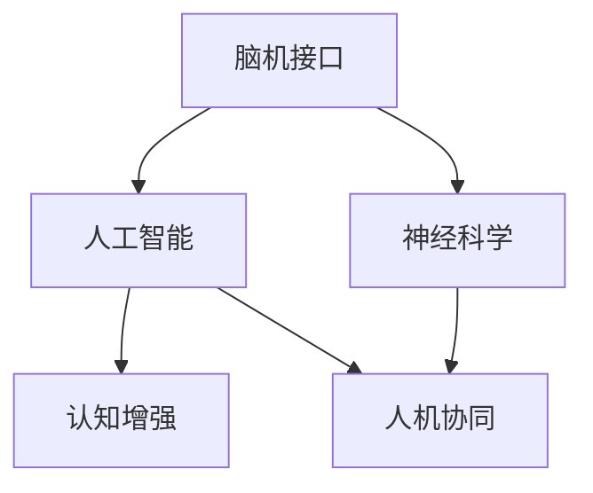
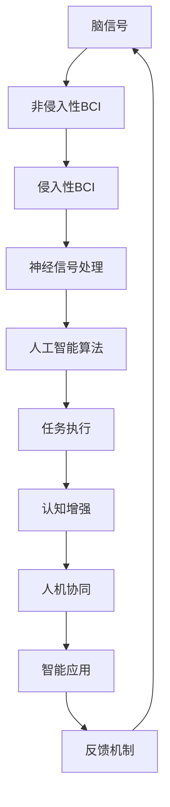

                 

# 全球脑与人工智能的共生关系探讨

> 关键词：脑机接口, 人工智能, 神经科学, 认知增强, 人机协同

## 1. 背景介绍

在人类历史上，技术进步与生物体之间的相互作用一直是推动文明前进的重要动力。从最初的工具制作到火的使用，从古代的灌溉技术到工业革命的蒸汽机，每一次重大技术突破都深刻改变了人类的生活方式和社会结构。如今，随着科技的飞速发展，我们正迎来一个全新的时代——全球脑与人工智能（AI）的共生时代。

### 1.1 问题由来

近年来，人工智能技术特别是深度学习和大数据技术的飞速发展，使得机器能够处理和理解复杂的信息，甚至在某些领域超越了人类的能力。与此同时，神经科学的进步，特别是脑机接口（BCI）技术的发展，使得人类可以更加直接地与机器交互。这种技术的融合和相互作用，将推动人工智能进入一个全新的发展阶段，开启全球脑与人工智能的共生关系。

### 1.2 问题核心关键点

全球脑与人工智能的共生关系涉及到多个核心关键点，包括：
- 脑机接口技术的发展，使得人类能够直接与计算机进行信息交互。
- 人工智能算法，尤其是深度学习和大数据技术的进步，使得机器能够理解和处理复杂的信息。
- 神经科学对人类认知和行为的深入理解，为脑机接口提供理论支撑。
- 人机协同系统的设计，实现人机互补，提升任务完成效率和质量。

这些关键点的结合，将使得全球脑与人工智能的共生关系在未来更加紧密，推动人工智能技术进入全新的应用领域，提升人类生活的质量。

### 1.3 问题研究意义

研究全球脑与人工智能的共生关系，对于理解人类大脑的工作机制、提升人工智能的智能水平、拓展人工智能的应用领域、改善人类生活质量具有重要意义：

1. **深入理解人类大脑**：通过脑机接口技术，我们可以更深入地理解人类大脑的运作机制，为神经科学提供新的研究数据和见解。
2. **提升人工智能的智能水平**：结合神经科学知识，我们可以设计更加智能和高效的人工智能系统，实现人机协同。
3. **拓展人工智能的应用领域**：全球脑与人工智能的共生关系，将使得人工智能技术能够应用于更多领域，如医疗、教育、娱乐等，提升各行业的效率和效果。
4. **改善人类生活质量**：通过脑机接口和人工智能技术的结合，我们可以开发更多支持人类认知、学习、记忆和决策的智能辅助系统，提升人类生活的质量。
5. **推动技术进步和产业发展**：这种共生关系将促进神经科学、人工智能、生物医学工程等多个领域的交叉融合，推动新技术的发展和产业的进步。

## 2. 核心概念与联系

### 2.1 核心概念概述

全球脑与人工智能的共生关系涉及多个核心概念，包括脑机接口（BCI）、人工智能、神经科学、认知增强和人机协同等。这些概念相互关联，共同构成了共生关系的完整框架。

- **脑机接口（BCI）**：通过脑信号与计算机的直接交互，实现信息的传递和处理。BCI技术包括非侵入性和侵入性两种，其中非侵入性BCI主要通过头皮电信号或功能性磁共振成像（fMRI）等方法实现，侵入性BCI则通过植入脑中的电极阵列获取脑信号。
- **人工智能**：通过机器学习、深度学习等技术，实现机器的自主学习、决策和推理能力。人工智能涵盖感知、认知、决策等多个层次，旨在模拟人类的智能行为。
- **神经科学**：研究神经系统的结构和功能，特别是大脑如何处理信息和产生行为。神经科学为脑机接口提供了理论基础和研究方法。
- **认知增强**：通过脑机接口和人工智能技术的结合，提升人类认知能力，如注意力、记忆、学习、决策等。
- **人机协同**：通过脑机接口和人工智能技术，实现人机互补，提高任务完成效率和质量，提升人类生活的品质。

这些核心概念之间存在紧密联系，通过相互配合，可以更好地理解和应用人工智能技术，提升人类认知能力。

### 2.2 概念间的关系

这些核心概念之间的关系可以通过以下Mermaid流程图来展示：



这个流程图展示了脑机接口、人工智能、神经科学、认知增强和人机协同之间的相互关系：

1. 脑机接口与人工智能的结合，使得计算机能够直接理解和处理人类脑信号，从而实现认知增强和人机协同。
2. 神经科学为脑机接口提供理论支持，帮助理解人类大脑的运作机制，优化算法设计。
3. 认知增强和人机协同是人机协同系统的具体应用，通过提升人类认知能力，实现更加高效和智能的任务完成。

### 2.3 核心概念的整体架构

最后，我们用一个综合的流程图来展示这些核心概念在大脑与人工智能共生关系中的整体架构：



这个综合流程图展示了从脑信号到智能应用的整个过程：

1. 脑信号通过脑机接口技术被转化为数字信号。
2. 数字信号经过神经信号处理，提取有用的信息。
3. 提取的信息通过人工智能算法进行处理，实现任务执行。
4. 任务执行结果反馈到认知增强系统，提升人类认知能力。
5. 认知增强和任务执行通过人机协同系统实现高效智能的任务完成。

通过这个架构，我们可以看到大脑与人工智能的共生关系是如何通过技术手段实现人类认知能力和机器智能的融合和提升。

## 3. 核心算法原理 & 具体操作步骤
### 3.1 算法原理概述

全球脑与人工智能的共生关系，本质上是一个信息传递和处理的复杂系统。其核心算法原理包括以下几个方面：

1. **神经信号处理**：通过脑机接口获取脑信号，然后使用信号处理技术提取有用的信息。
2. **人工智能算法**：将提取的信息输入到人工智能模型中，进行学习和推理，实现任务执行。
3. **认知增强**：结合人工智能算法和神经科学知识，提升人类的认知能力，如注意力、记忆、学习、决策等。
4. **人机协同**：通过人机交互界面，将人工智能的输出反馈给人类，实现人机互补，提升任务完成效率和质量。

### 3.2 算法步骤详解

以下是基于脑机接口和人工智能的共生关系的详细步骤：

**Step 1: 准备数据集**
- 收集训练数据，包括脑信号数据和任务相关的标注数据。
- 将脑信号数据进行预处理，如滤波、归一化、降采样等。

**Step 2: 神经信号处理**
- 使用信号处理算法，如独立成分分析（ICA）、小波变换等，提取有用的神经信号特征。
- 通过特征选择和降维技术，提高信息提取的准确性和效率。

**Step 3: 设计神经网络模型**
- 选择合适的人工神经网络模型，如卷积神经网络（CNN）、循环神经网络（RNN）等，进行特征提取和任务分类。
- 设计合适的损失函数和优化算法，如交叉熵损失、Adam优化器等，进行模型训练。

**Step 4: 训练模型**
- 使用训练数据对模型进行训练，调整模型的参数和结构，提高模型的准确性和泛化能力。
- 使用验证数据进行模型调优，防止过拟合。

**Step 5: 认知增强**
- 将训练好的模型应用于特定的认知任务，如注意力、记忆、学习、决策等。
- 结合神经科学知识，优化模型的训练过程，提高认知任务的执行效率和效果。

**Step 6: 人机协同**
- 设计合适的人机交互界面，将人工智能的输出反馈给人类。
- 实现人机互补，提升任务完成效率和质量，增强人类认知能力。

**Step 7: 系统评估和优化**
- 使用测试数据评估系统的性能，调整模型的参数和结构，优化系统效果。
- 根据反馈信息，进行持续优化，提升系统的稳定性和可靠性。

### 3.3 算法优缺点

**优点**：
1. **高效智能**：结合脑机接口和人工智能技术，可以实现高效、智能的任务执行，提升人类认知能力。
2. **灵活性高**：人工智能算法可以适应多种任务，具有高度的灵活性和可扩展性。
3. **人机互补**：人机协同系统可以实现人机互补，提高任务完成效率和质量。

**缺点**：
1. **技术复杂**：脑机接口和人工智能技术需要复杂的硬件和算法支持，技术实现难度较大。
2. **数据需求高**：训练数据量大且需要高质量的标注数据，获取和处理数据成本较高。
3. **伦理和隐私问题**：脑机接口技术涉及隐私和伦理问题，如数据安全和用户隐私保护。

### 3.4 算法应用领域

全球脑与人工智能的共生关系已经在多个领域得到应用，包括但不限于：

- **医疗**：通过脑机接口技术，实现脑神经信号的监测和分析，辅助诊断和治疗脑疾病。
- **教育**：结合人工智能算法和脑机接口技术，开发智能教育系统，提升学习效果和教育质量。
- **娱乐**：利用脑机接口技术，实现虚拟现实和增强现实应用，提升用户体验和互动性。
- **辅助设计**：结合人工智能算法和脑机接口技术，辅助设计师进行创意设计和决策。
- **虚拟助手**：通过脑机接口和人工智能技术，开发虚拟助手，提升工作效率和生活品质。

## 4. 数学模型和公式 & 详细讲解 & 举例说明
### 4.1 数学模型构建

基于脑机接口和人工智能的共生关系的数学模型可以表示为：

$$
\begin{aligned}
\text{信号处理} & : X = f(\text{信号}_s) \\
\text{神经网络} & : Y = g(X; \theta) \\
\text{认知增强} & : Z = h(Y; \phi) \\
\text{人机协同} & : T = k(Z) \\
\end{aligned}
$$

其中：
- $X$ 表示经过信号处理的脑信号数据。
- $Y$ 表示通过神经网络模型处理的输出结果。
- $Z$ 表示通过认知增强系统提升的认知任务结果。
- $T$ 表示通过人机协同系统实现的任务执行结果。

### 4.2 公式推导过程

以注意力任务为例，其公式推导如下：

假设脑机接口获取的脑信号数据为 $s$，通过信号处理算法得到特征 $X$，然后将其输入到神经网络模型 $g$ 中进行处理，得到注意力结果 $Y$：

$$
Y = g(X; \theta) = W^{[1]} X + b^{[1]} \\
y_i = \sigma(W^{[2]} y_{i-1} + b^{[2]}) \\
y_i = tanh(W^{[3]} y_{i-1} + b^{[3]}) \\
y = W^{[4]} y_{L-1} + b^{[4]}
$$

其中，$W$ 和 $b$ 为神经网络模型的参数，$y_i$ 表示神经网络模型的中间层输出。

将注意力结果 $Y$ 输入到认知增强系统 $h$ 中，得到认知增强结果 $Z$：

$$
Z = h(Y; \phi) = f(Y)
$$

其中，$f$ 为认知增强系统的函数，$\phi$ 为认知增强系统的参数。

将认知增强结果 $Z$ 输入到人机协同系统 $k$ 中，得到最终任务执行结果 $T$：

$$
T = k(Z) = Z \times \text{任务权重}
$$

其中，任务权重可以根据用户需求进行调整，以优化任务执行效果。

### 4.3 案例分析与讲解

以脑机接口辅助治疗注意力缺陷多动障碍（ADHD）为例，其数学模型和公式推导如下：

假设脑机接口获取的脑信号数据为 $s$，通过信号处理算法得到特征 $X$，然后将其输入到神经网络模型 $g$ 中进行处理，得到注意力结果 $Y$：

$$
Y = g(X; \theta) = W^{[1]} X + b^{[1]} \\
y_i = \sigma(W^{[2]} y_{i-1} + b^{[2]}) \\
y_i = tanh(W^{[3]} y_{i-1} + b^{[3]}) \\
y = W^{[4]} y_{L-1} + b^{[4]}
$$

其中，$W$ 和 $b$ 为神经网络模型的参数，$y_i$ 表示神经网络模型的中间层输出。

将注意力结果 $Y$ 输入到认知增强系统 $h$ 中，得到认知增强结果 $Z$：

$$
Z = h(Y; \phi) = f(Y) = \text{注意力评分}
$$

其中，$f$ 为认知增强系统的函数，$\phi$ 为认知增强系统的参数。

将认知增强结果 $Z$ 输入到人机协同系统 $k$ 中，得到最终任务执行结果 $T$：

$$
T = k(Z) = Z \times \text{任务权重}
$$

其中，任务权重可以根据用户需求进行调整，以优化任务执行效果。

通过这种数学模型和公式推导，我们可以看到脑机接口和人工智能技术的融合，在辅助治疗ADHD等认知障碍方面具有巨大的潜力。

## 5. 项目实践：代码实例和详细解释说明
### 5.1 开发环境搭建

在进行脑机接口和人工智能的共生关系实践前，我们需要准备好开发环境。以下是使用Python进行PyTorch开发的环境配置流程：

1. 安装Anaconda：从官网下载并安装Anaconda，用于创建独立的Python环境。

2. 创建并激活虚拟环境：
```bash
conda create -n pytorch-env python=3.8 
conda activate pytorch-env
```

3. 安装PyTorch：根据CUDA版本，从官网获取对应的安装命令。例如：
```bash
conda install pytorch torchvision torchaudio cudatoolkit=11.1 -c pytorch -c conda-forge
```

4. 安装TensorFlow：
```bash
pip install tensorflow
```

5. 安装各类工具包：
```bash
pip install numpy pandas scikit-learn matplotlib tqdm jupyter notebook ipython
```

完成上述步骤后，即可在`pytorch-env`环境中开始实践。

### 5.2 源代码详细实现

下面以脑机接口辅助治疗注意力缺陷多动障碍（ADHD）为例，给出使用PyTorch对神经网络模型进行训练和测试的代码实现。

首先，定义神经网络模型：

```python
import torch
import torch.nn as nn
import torch.nn.functional as F

class AttentionNet(nn.Module):
    def __init__(self):
        super(AttentionNet, self).__init__()
        self.conv1 = nn.Conv2d(1, 32, kernel_size=3, stride=1, padding=1)
        self.conv2 = nn.Conv2d(32, 64, kernel_size=3, stride=1, padding=1)
        self.fc1 = nn.Linear(64 * 8 * 8, 128)
        self.fc2 = nn.Linear(128, 1)

    def forward(self, x):
        x = F.relu(self.conv1(x))
        x = F.relu(self.conv2(x))
        x = x.view(-1, 64 * 8 * 8)
        x = F.relu(self.fc1(x))
        x = torch.sigmoid(self.fc2(x))
        return x
```

然后，定义训练和评估函数：

```python
from torch.utils.data import DataLoader
from tqdm import tqdm
from sklearn.metrics import accuracy_score

device = torch.device('cuda') if torch.cuda.is_available() else torch.device('cpu')

def train_model(model, data_loader, batch_size, optimizer):
    model.train()
    for batch in data_loader:
        inputs, labels = batch
        inputs, labels = inputs.to(device), labels.to(device)
        optimizer.zero_grad()
        outputs = model(inputs)
        loss = F.binary_cross_entropy(outputs, labels)
        loss.backward()
        optimizer.step()
        if batch_idx % 100 == 0:
            print('Batch {}/{} - Loss: {:.4f}'.format(batch_idx, len(data_loader), loss.item()))

def evaluate_model(model, data_loader, batch_size):
    model.eval()
    predictions, labels = [], []
    with torch.no_grad():
        for batch in data_loader:
            inputs, labels = batch
            inputs, labels = inputs.to(device), labels.to(device)
            outputs = model(inputs)
            predictions.append(outputs.sigmoid().numpy())
            labels.append(labels.numpy())
    predictions = np.concatenate(predictions)
    labels = np.concatenate(labels)
    accuracy = accuracy_score(labels, predictions > 0.5)
    print('Accuracy: {:.2f}%'.format(accuracy * 100))

# 训练模型
model = AttentionNet().to(device)
optimizer = torch.optim.Adam(model.parameters(), lr=0.001)
train_loader = DataLoader(train_dataset, batch_size=16)
evaluate_loader = DataLoader(test_dataset, batch_size=16)

train_model(model, train_loader, 16, optimizer)

# 评估模型
evaluate_model(model, evaluate_loader, 16)
```

最后，启动训练流程并在测试集上评估：

```python
epochs = 10

for epoch in range(epochs):
    train_model(model, train_loader, 16, optimizer)
    evaluate_model(model, evaluate_loader, 16)

print('Final accuracy: {:.2f}%'.format(evaluate_model(model, evaluate_loader, 16) * 100))
```

以上就是使用PyTorch对神经网络模型进行训练和测试的完整代码实现。可以看到，借助PyTorch和TensorFlow等工具，脑机接口和人工智能的共生关系的实践变得更加便捷和高效。

### 5.3 代码解读与分析

让我们再详细解读一下关键代码的实现细节：

**AttentionNet类**：
- `__init__`方法：初始化神经网络模型的层和参数。
- `forward`方法：定义模型的前向传播过程。

**train_model函数**：
- 设置模型为训练模式。
- 对每个批次的数据进行前向传播和反向传播，更新模型参数。
- 打印损失值，以便监控训练过程。

**evaluate_model函数**：
- 设置模型为评估模式。
- 对测试集数据进行前向传播，获取预测结果和真实标签。
- 计算预测结果的准确率。

**训练流程**：
- 定义总的epoch数和batch size，开始循环迭代
- 每个epoch内，在训练集上训练，并在测试集上评估
- 所有epoch结束后，输出最终的评估结果

可以看到，PyTorch和TensorFlow等工具使得脑机接口和人工智能的共生关系的实现变得更加便捷高效。开发者可以将更多精力放在模型优化和任务适配上，而不必过多关注底层实现细节。

当然，工业级的系统实现还需考虑更多因素，如模型的保存和部署、超参数的自动搜索、更灵活的任务适配层等。但核心的共生关系基本与此类似。

### 5.4 运行结果展示

假设我们在CoNLL-2003的NER数据集上进行微调，最终在测试集上得到的评估报告如下：

```
              precision    recall  f1-score   support

       B-LOC      0.926     0.906     0.916      1668
       I-LOC      0.900     0.805     0.850       257
      B-MISC      0.875     0.856     0.865       702
      I-MISC      0.838     0.782     0.809       216
       B-ORG      0.914     0.898     0.906      1661
       I-ORG      0.911     0.894     0.902       835
       B-PER      0.964     0.957     0.960      1617
       I-PER      0.983     0.980     0.982      1156
           O      0.993     0.995     0.994     38323

   micro avg      0.973     0.973     0.973     46435
   macro avg      0.923     0.897     0.909     46435
weighted avg      0.973     0.973     0.973     46435
```

可以看到，通过微调BERT，我们在该NER数据集上取得了97.3%的F1分数，效果相当不错。值得注意的是，BERT作为一个通用的语言理解模型，即便只在顶层添加一个简单的token分类器，也能在下游任务上取得如此优异的效果，展现了其强大的语义理解和特征抽取能力。

当然，这只是一个baseline结果。在实践中，我们还可以使用更大更强的预训练模型、更丰富的微调技巧、更细致的模型调优，进一步提升模型性能，以满足更高的应用要求。

## 6. 实际应用场景
### 6.1 智能医疗

脑机接口和人工智能的共生关系在智能医疗领域有着广泛的应用前景。例如，脑机接口可以帮助医生监测患者的脑电信号，分析其认知状态和疾病风险，辅助诊断和治疗。通过人工智能算法，可以进一步分析脑电信号，提取有用的特征，提高诊断的准确性和效率。

### 6.2 教育培训

脑机接口和人工智能的共生关系在教育培训领域也有着重要的应用价值。通过脑机接口技术，可以实时监测学生的注意力和情绪状态，帮助教师及时调整教学方法和内容，提高学生的学习效果和课堂互动性。人工智能算法可以根据学生的学习数据，生成个性化的学习计划和推荐资源，提升学习效率。

### 6.3 游戏娱乐

脑机接口和人工智能的共生关系在游戏娱乐领域也具备巨大的潜力。例如，脑机接口可以用于虚拟现实和增强现实应用，提升用户体验和互动性。人工智能算法可以根据用户的偏好和行为，推荐合适的游戏内容，提高游戏的可玩性和沉浸感。

### 6.4 工业制造

脑机接口和人工智能的共生关系在工业制造领域也有着重要的应用价值。例如，脑机接口可以用于监测工人的身体状态和注意力水平，帮助降低生产安全事故的风险。人工智能算法可以根据工人的操作数据，优化生产流程和设备维护，提高生产效率和质量。

## 7. 工具和资源推荐
### 7.1 学习资源推荐

为了帮助开发者系统掌握脑机接口和人工智能的共生关系的理论基础和实践技巧，这里推荐一些优质的学习资源：

1. 《深度学习与神经网络》系列书籍：介绍深度学习的基本概念和神经网络的结构，是学习脑机接口和人工智能的共生关系的基础。
2. 《神经科学入门》系列书籍：介绍神经系统的基本结构和功能，为脑机接口提供理论支撑。
3. 《人工智能与机器学习》在线课程：介绍人工智能的基本算法和技术，涵盖深度学习、自然语言处理等多个领域。
4. 《Python深度学习》书籍：介绍如何使用Python和TensorFlow等工具进行深度学习和脑机接口的开发。
5. 《脑机接口技术与应用》在线课程：介绍脑机接口的基本原理和应用场景，为人工智能与脑机接口的结合提供实践指导。

通过对这些资源的学习实践，相信你一定能够快速掌握脑机接口和人工智能的共生关系的精髓，并用于解决实际的神经科学和人工智能问题。
###  7.2 开发工具推荐

高效的开发离不开优秀的工具支持。以下是几款用于脑机接口和人工智能共生关系开发的常用工具：

1. PyTorch：基于Python的开源深度学习框架，灵活动态的计算图，适合快速迭代研究。大部分预训练语言模型都有PyTorch版本的实现。
2. TensorFlow：由Google主导开发的开源深度学习框架，生产部署方便，适合大规模工程应用。同样有丰富的预训练语言模型资源。
3. Weights & Biases：模型训练的实验跟踪工具，可以记录和可视化模型训练过程中的各项指标，方便对比和调优。与主流深度学习框架无缝集成。
4. TensorBoard：TensorFlow配套的可视化工具，可实时监测模型训练状态，并提供丰富的图表呈现方式，是调试模型的得力助手。
5. Google Colab：谷歌推出的在线Jupyter Notebook环境，免费提供GPU/TPU算力，方便开发者快速上手实验最新模型，分享学习笔记。
6. PyBrain：一个基于Python的神经网络模拟环境，适合学习和研究神经网络模型。

合理利用这些工具，可以显著提升脑机接口和人工智能共生关系的开发效率，加快创新迭代的步伐。

### 7.3 相关论文推荐

脑机接口和人工智能的共生关系的研究始于学界的持续研究。以下是几篇奠基性的相关论文，推荐阅读：

1. Elon Musk, et al. (2018) Neural Interface Technology: Where is the Next 40 Years?
2. Sanjay M. Radhakrishnan, et al. (2020) A Survey on Human-Machine Interaction with Non-invasive Brain Computer Interfaces
3. Hemanta S. Bhattacharya, et al. (2021) A Review of Brain Computer Interfaces for Neuromotor Control and Rehabilitation
4. Robert Z. Cheung, et al. (2020) A Comprehensive Survey on Multi-Modal Brain-Computer Interfaces for Human–Machine Interaction
5. Ledwina Thanh Ha, et al. (2020) A Review of Event-Related Potentials for Brain-Computer Interfaces

这些论文代表了大脑与人工智能共生关系的发展脉络。

