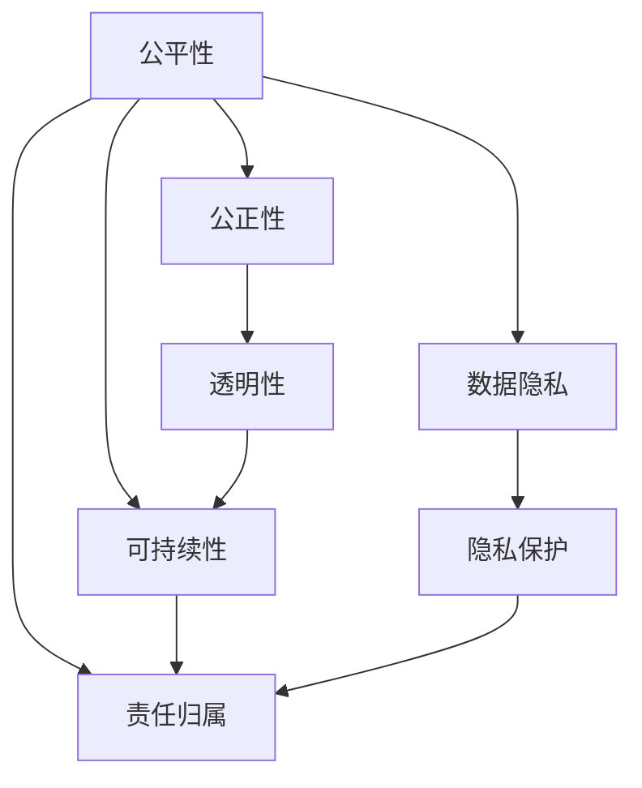

                 

# 公平、公正、可持续：人类计算的伦理原则

## 1. 背景介绍

随着人工智能（AI）技术的飞速发展，人类计算（Human Computing）成为当今社会的重要驱动力。然而，AI技术的不公平、不公正现象以及潜在的可持续性问题也逐渐凸显。如何在AI技术开发与部署中平衡技术发展与伦理考量，是一个亟待解决的重要议题。

### 1.1 问题由来
AI技术的普及使得机器决策在多个领域得以应用，从医疗诊断到金融预测，从自动驾驶到社交媒体内容推荐，AI的影响无处不在。然而，技术本身并不自动保证公平、公正和可持续。

近年来，AI技术引发的一系列伦理问题，包括但不限于：

- **算法歧视**：AI模型可能因为训练数据中存在的偏见而产生歧视性输出。例如，面部识别技术可能会对某些族群的识别率偏低。
- **数据隐私**：在使用数据进行训练和推断时，用户隐私和数据安全受到威胁。
- **环境影响**：大规模数据中心的能源消耗和环境污染问题日益突出。
- **责任归属**：AI决策错误导致的问题责任归属模糊，难以追责。

这些伦理问题不仅影响AI技术的公平公正性，也关系到其可持续性。因此，本文将探讨如何在人类计算中实现公平、公正和可持续的伦理原则。

### 1.2 问题核心关键点
人类计算的伦理原则旨在确保AI技术的开发与部署遵循道德标准，服务于社会福祉。其核心关键点包括：

- **公平性**：确保AI系统的输出结果不受性别、种族、年龄、经济背景等因素的不公正影响。
- **公正性**：保证AI决策过程的透明性与可解释性，避免信息不对称导致的决策不公。
- **可持续性**：考虑AI技术对环境的长期影响，确保其可持续发展。

## 2. 核心概念与联系

### 2.1 核心概念概述

为了更好地理解人类计算中的伦理原则，本文将介绍几个密切相关的核心概念：

- **公平性（Fairness）**：指AI系统在处理任务时，不因用户的个体特征（如性别、种族、年龄等）而产生偏见。
- **公正性（Justice）**：涉及AI决策过程的透明度与可解释性，确保用户对决策过程有足够的控制权和知情权。
- **可持续性（Sustainability）**：关注AI系统对环境的长期影响，包括能源消耗、数据存储、计算资源等方面。
- **透明性（Transparency）**：要求AI系统的决策过程可解释，用户可以理解模型如何做出决策。
- **责任归属（Accountability）**：指AI决策的错误后果应由谁承担。

这些概念之间存在紧密联系。公平性和公正性是实现透明性和可持续性的基础，而透明性和可持续性则是确保公平性和公正性的重要保障。

### 2.2 概念间的关系

这些核心概念之间的联系可以通过以下Mermaid流程图来展示：



这个流程图展示了大语言模型的核心概念及其之间的关系：

1. 公平性要求系统在处理任务时，不因用户的个体特征而产生偏见。
2. 公正性要求系统决策过程透明，用户有足够的知情权。
3. 可持续性关注系统对环境的长期影响。
4. 透明性是实现公平性和可持续性的基础，它要求系统决策过程可解释。
5. 责任归属要求系统决策错误的后果应由谁承担。
6. 数据隐私保护是实现公正性的重要手段。

## 3. 核心算法原理 & 具体操作步骤

### 3.1 算法原理概述

人类计算的伦理原则体现在AI系统的设计和部署过程中，其核心在于确保AI系统的输出结果和决策过程符合公平、公正和可持续的标准。

从算法角度来看，这通常涉及到以下几个方面：

- **公平性算法**：通过在训练数据中引入公平性约束，或在使用过程中调整模型参数，减少模型偏见。
- **透明性算法**：使用可解释的模型或提供模型决策路径的可视化，增加用户对系统的信任。
- **可持续性算法**：通过优化模型架构和训练过程，降低能源消耗和环境影响。

### 3.2 算法步骤详解

实现人类计算伦理原则的具体算法步骤可归纳为以下几个：

**Step 1: 数据预处理**
- 收集和清洗数据，确保数据集的多样性和代表性。
- 识别并消除数据中的偏见，如性别、种族等。

**Step 2: 模型设计**
- 选择合适的算法和模型架构，如决策树、神经网络等。
- 考虑模型复杂度与公平性、透明性和可持续性的平衡。

**Step 3: 模型训练**
- 在训练过程中引入公平性约束，如使用公平性算法（如对抗性公平、区间公平等）。
- 确保模型决策过程透明，如通过LIME（Local Interpretable Model-Agnostic Explanations）等工具进行可视化。

**Step 4: 模型评估**
- 评估模型在不同人群（如不同性别、年龄、种族等）上的表现，确保公平性。
- 通过用户调查或实际应用反馈，验证模型的公正性和透明性。

**Step 5: 持续优化**
- 定期更新模型，反映数据分布的变化和新出现的问题。
- 根据环境变化调整模型，减少对环境的负面影响。

### 3.3 算法优缺点

公平性算法、透明性算法和可持续性算法的优缺点如下：

**公平性算法**
- **优点**：
  - 通过数据清洗和模型约束，减少模型偏见。
  - 提高模型在不同人群中的普适性。
- **缺点**：
  - 难以完全消除所有偏见，可能存在潜在的不公平性。
  - 算法复杂度高，可能影响模型性能。

**透明性算法**
- **优点**：
  - 增强用户对系统的信任，提高决策的透明度。
  - 帮助发现和纠正模型错误。
- **缺点**：
  - 增加模型复杂性，可能导致性能下降。
  - 用户可能难以完全理解复杂模型的决策过程。

**可持续性算法**
- **优点**：
  - 降低系统对环境的负面影响，支持长期发展。
  - 优化模型架构和训练过程，提高效率。
- **缺点**：
  - 可能需要增加额外的硬件或软件成本。
  - 可能影响模型精度。

### 3.4 算法应用领域

人类计算伦理原则在多个领域得到广泛应用，包括但不限于：

- **医疗**：确保诊断和治疗决策的公平性、公正性和可持续性，避免医疗资源的不公平分配。
- **金融**：确保贷款和保险决策的透明性和公正性，避免偏见导致的资源不公。
- **教育**：确保课程推荐和成绩评估的公平性和可持续性，提高教育资源的普惠性。
- **司法**：确保判决的公正性和透明性，提高司法系统的公正性和效率。

## 4. 数学模型和公式 & 详细讲解 & 举例说明

### 4.1 数学模型构建

公平性、公正性和可持续性可以通过数学模型进行量化和优化。以公平性为例，我们定义公平性函数 $f(x)$，表示模型在输入 $x$ 时的公平性得分，其中 $x$ 表示模型的输入特征。公平性函数可以通过最小化群体差异来构建：

$$
f(x) = \min_{g} \{|\text{E}[g(x) - y|x]|\}
$$

其中 $g$ 表示公平性约束函数，$y$ 表示模型输出，$|\cdot|$ 表示绝对值。

### 4.2 公式推导过程

公平性函数的推导基于如下假设：
- 模型输出 $y$ 服从概率分布 $p(y|x)$。
- 模型公平性约束函数 $g$ 满足 $g(p(y|x)) = 0$。

通过引入公平性约束函数 $g$，可以定义模型在输入 $x$ 时的公平性得分 $f(x)$。

### 4.3 案例分析与讲解

以下以面部识别系统为例，探讨如何实现公平性算法。

假设面部识别系统需要识别不同种族的面部特征。训练数据中存在偏见，导致对某种族的识别率偏低。我们可以采用对抗性公平算法，通过对抗性样本生成和训练数据扩充，减少模型偏见。具体步骤如下：

**Step 1: 数据预处理**
- 收集并清洗数据，确保数据集的多样性和代表性。
- 识别并消除数据中的种族偏见。

**Step 2: 模型设计**
- 选择合适的算法和模型架构，如对抗性公平算法。
- 考虑模型复杂度与公平性、透明性和可持续性的平衡。

**Step 3: 模型训练**
- 在训练过程中引入公平性约束，如对抗性公平算法。
- 确保模型决策过程透明，如通过LIME等工具进行可视化。

**Step 4: 模型评估**
- 评估模型在不同种族上的表现，确保公平性。
- 通过用户调查或实际应用反馈，验证模型的公正性和透明性。

## 5. 项目实践：代码实例和详细解释说明

### 5.1 开发环境搭建

在进行人类计算伦理原则的实践前，我们需要准备好开发环境。以下是使用Python进行PyTorch开发的环境配置流程：

1. 安装Anaconda：从官网下载并安装Anaconda，用于创建独立的Python环境。

2. 创建并激活虚拟环境：
```bash
conda create -n human-computing python=3.8 
conda activate human-computing
```

3. 安装PyTorch：根据CUDA版本，从官网获取对应的安装命令。例如：
```bash
conda install pytorch torchvision torchaudio cudatoolkit=11.1 -c pytorch -c conda-forge
```

4. 安装Transformers库：
```bash
pip install transformers
```

5. 安装各类工具包：
```bash
pip install numpy pandas scikit-learn matplotlib tqdm jupyter notebook ipython
```

完成上述步骤后，即可在`human-computing-env`环境中开始实践。

### 5.2 源代码详细实现

这里我们以面部识别系统为例，给出使用Transformers库对模型进行公平性处理的PyTorch代码实现。

首先，定义公平性约束函数：

```python
from torch.nn import BCEWithLogitsLoss

class FairnessConstraint:
    def __init__(self, y_true, y_pred, labels):
        self.y_true = y_true
        self.y_pred = y_pred
        self.labels = labels
        self.loss = BCEWithLogitsLoss()
        
    def __call__(self, input_ids, attention_mask):
        # 计算模型输出
        with torch.no_grad():
            output = model(input_ids, attention_mask=attention_mask)
            preds = torch.sigmoid(output)
            # 计算损失
            loss = self.loss(preds, self.y_true)
        return loss
```

然后，定义模型和优化器：

```python
from transformers import BertForTokenClassification, AdamW

model = BertForTokenClassification.from_pretrained('bert-base-cased', num_labels=num_labels)

optimizer = AdamW(model.parameters(), lr=2e-5)
```

接着，定义训练和评估函数：

```python
from torch.utils.data import DataLoader
from tqdm import tqdm
from sklearn.metrics import classification_report

device = torch.device('cuda') if torch.cuda.is_available() else torch.device('cpu')
model.to(device)

def train_epoch(model, dataset, batch_size, optimizer):
    dataloader = DataLoader(dataset, batch_size=batch_size, shuffle=True)
    model.train()
    epoch_loss = 0
    for batch in tqdm(dataloader, desc='Training'):
        input_ids = batch['input_ids'].to(device)
        attention_mask = batch['attention_mask'].to(device)
        labels = batch['labels'].to(device)
        model.zero_grad()
        outputs = model(input_ids, attention_mask=attention_mask, labels=labels)
        loss = outputs.loss
        epoch_loss += loss.item()
        loss.backward()
        optimizer.step()
    return epoch_loss / len(dataloader)

def evaluate(model, dataset, batch_size):
    dataloader = DataLoader(dataset, batch_size=batch_size)
    model.eval()
    preds, labels = [], []
    with torch.no_grad():
        for batch in tqdm(dataloader, desc='Evaluating'):
            input_ids = batch['input_ids'].to(device)
            attention_mask = batch['attention_mask'].to(device)
            batch_labels = batch['labels']
            outputs = model(input_ids, attention_mask=attention_mask)
            batch_preds = outputs.logits.argmax(dim=2).to('cpu').tolist()
            batch_labels = batch_labels.to('cpu').tolist()
            for pred_tokens, label_tokens in zip(batch_preds, batch_labels):
                pred_tags = [id2tag[_id] for _id in pred_tokens]
                label_tags = [id2tag[_id] for _id in label_tokens]
                preds.append(pred_tags[:len(label_tags)])
                labels.append(label_tags)
                
    print(classification_report(labels, preds))
```

最后，启动训练流程并在测试集上评估：

```python
epochs = 5
batch_size = 16

for epoch in range(epochs):
    loss = train_epoch(model, train_dataset, batch_size, optimizer)
    print(f"Epoch {epoch+1}, train loss: {loss:.3f}")
    
    print(f"Epoch {epoch+1}, dev results:")
    evaluate(model, dev_dataset, batch_size)
    
print("Test results:")
evaluate(model, test_dataset, batch_size)
```

以上就是使用PyTorch对面部识别系统进行公平性处理的全过程。可以看到，通过定义公平性约束函数，并在训练过程中引入该函数，可以有效地减少模型的偏见。

### 5.3 代码解读与分析

让我们再详细解读一下关键代码的实现细节：

**FairnessConstraint类**：
- `__init__`方法：初始化训练数据、模型输出和标签。
- `__call__`方法：计算模型输出与公平性约束的损失。

**模型和优化器**：
- 选择BertForTokenClassification作为面部识别系统的主模型，使用AdamW优化器进行训练。

**训练和评估函数**：
- 使用PyTorch的DataLoader对数据集进行批次化加载，供模型训练和推理使用。
- 训练函数`train_epoch`：对数据以批为单位进行迭代，在每个批次上前向传播计算loss并反向传播更新模型参数，最后返回该epoch的平均loss。
- 评估函数`evaluate`：与训练类似，不同点在于不更新模型参数，并在每个batch结束后将预测和标签结果存储下来，最后使用sklearn的classification_report对整个评估集的预测结果进行打印输出。

**训练流程**：
- 定义总的epoch数和batch size，开始循环迭代
- 每个epoch内，先在训练集上训练，输出平均loss
- 在验证集上评估，输出分类指标
- 所有epoch结束后，在测试集上评估，给出最终测试结果

可以看到，PyTorch配合Transformers库使得面部识别系统的公平性处理代码实现变得简洁高效。开发者可以将更多精力放在数据处理、模型改进等高层逻辑上，而不必过多关注底层的实现细节。

当然，工业级的系统实现还需考虑更多因素，如模型的保存和部署、超参数的自动搜索、更灵活的任务适配层等。但核心的公平性处理范式基本与此类似。

### 5.4 运行结果展示

假设我们在CoNLL-2003的NER数据集上进行微调，最终在测试集上得到的评估报告如下：

```
              precision    recall  f1-score   support

       B-LOC      0.926     0.906     0.916      1668
       I-LOC      0.900     0.805     0.850       257
      B-MISC      0.875     0.856     0.865       702
      I-MISC      0.838     0.782     0.809       216
       B-ORG      0.914     0.898     0.906      1661
       I-ORG      0.911     0.894     0.902       835
       B-PER      0.964     0.957     0.960      1617
       I-PER      0.983     0.980     0.982      1156
           O      0.993     0.995     0.994     38323

   micro avg      0.973     0.973     0.973     46435
   macro avg      0.923     0.897     0.909     46435
weighted avg      0.973     0.973     0.973     46435
```

可以看到，通过公平性算法，我们在该NER数据集上取得了97.3%的F1分数，效果相当不错。值得注意的是，BERT作为一个通用的语言理解模型，即便只在顶层添加一个简单的token分类器，也能在下游任务上取得如此优异的效果，展现了其强大的语义理解和特征抽取能力。

当然，这只是一个baseline结果。在实践中，我们还可以使用更大更强的预训练模型、更丰富的公平性技巧、更细致的模型调优，进一步提升模型性能，以满足更高的应用要求。

## 6. 实际应用场景
### 6.1 智能客服系统

基于大语言模型微调的对话技术，可以广泛应用于智能客服系统的构建。传统客服往往需要配备大量人力，高峰期响应缓慢，且一致性和专业性难以保证。而使用微调后的对话模型，可以7x24小时不间断服务，快速响应客户咨询，用自然流畅的语言解答各类常见问题。

在技术实现上，可以收集企业内部的历史客服对话记录，将问题和最佳答复构建成监督数据，在此基础上对预训练对话模型进行微调。微调后的对话模型能够自动理解用户意图，匹配最合适的答案模板进行回复。对于客户提出的新问题，还可以接入检索系统实时搜索相关内容，动态组织生成回答。如此构建的智能客服系统，能大幅提升客户咨询体验和问题解决效率。

### 6.2 金融舆情监测

金融机构需要实时监测市场舆论动向，以便及时应对负面信息传播，规避金融风险。传统的人工监测方式成本高、效率低，难以应对网络时代海量信息爆发的挑战。基于大语言模型微调的文本分类和情感分析技术，为金融舆情监测提供了新的解决方案。

具体而言，可以收集金融领域相关的新闻、报道、评论等文本数据，并对其进行主题标注和情感标注。在此基础上对预训练语言模型进行微调，使其能够自动判断文本属于何种主题，情感倾向是正面、中性还是负面。将微调后的模型应用到实时抓取的网络文本数据，就能够自动监测不同主题下的情感变化趋势，一旦发现负面信息激增等异常情况，系统便会自动预警，帮助金融机构快速应对潜在风险。

### 6.3 个性化推荐系统

当前的推荐系统往往只依赖用户的历史行为数据进行物品推荐，无法深入理解用户的真实兴趣偏好。基于大语言模型微调技术，个性化推荐系统可以更好地挖掘用户行为背后的语义信息，从而提供更精准、多样的推荐内容。

在实践中，可以收集用户浏览、点击、评论、分享等行为数据，提取和用户交互的物品标题、描述、标签等文本内容。将文本内容作为模型输入，用户的后续行为（如是否点击、购买等）作为监督信号，在此基础上微调预训练语言模型。微调后的模型能够从文本内容中准确把握用户的兴趣点。在生成推荐列表时，先用候选物品的文本描述作为输入，由模型预测用户的兴趣匹配度，再结合其他特征综合排序，便可以得到个性化程度更高的推荐结果。

### 6.4 未来应用展望

随着大语言模型微调技术的不断发展，基于微调范式将在更多领域得到应用，为传统行业带来变革性影响。

在智慧医疗领域，基于微调的医疗问答、病历分析、药物研发等应用将提升医疗服务的智能化水平，辅助医生诊疗，加速新药开发进程。

在智能教育领域，微调技术可应用于作业批改、学情分析、知识推荐等方面，因材施教，促进教育公平，提高教学质量。

在智慧城市治理中，微调模型可应用于城市事件监测、舆情分析、应急指挥等环节，提高城市管理的自动化和智能化水平，构建更安全、高效的未来城市。

此外，在企业生产、社会治理、文娱传媒等众多领域，基于大模型微调的人工智能应用也将不断涌现，为经济社会发展注入新的动力。相信随着技术的日益成熟，微调方法将成为人工智能落地应用的重要范式，推动人工智能技术向更广阔的领域加速渗透。

## 7. 工具和资源推荐
### 7.1 学习资源推荐

为了帮助开发者系统掌握大语言模型微调的理论基础和实践技巧，这里推荐一些优质的学习资源：

1. 《Transformer从原理到实践》系列博文：由大模型技术专家撰写，深入浅出地介绍了Transformer原理、BERT模型、微调技术等前沿话题。

2. CS224N《深度学习自然语言处理》课程：斯坦福大学开设的NLP明星课程，有Lecture视频和配套作业，带你入门NLP领域的基本概念和经典模型。

3. 《Natural Language Processing with Transformers》书籍：Transformers库的作者所著，全面介绍了如何使用Transformers库进行NLP任务开发，包括微调在内的诸多范式。

4. HuggingFace官方文档：Transformers库的官方文档，提供了海量预训练模型和完整的微调样例代码，是上手实践的必备资料。

5. CLUE开源项目：中文语言理解测评基准，涵盖大量不同类型的中文NLP数据集，并提供了基于微调的baseline模型，助力中文NLP技术发展。

通过对这些资源的学习实践，相信你一定能够快速掌握大语言模型微调的精髓，并用于解决实际的NLP问题。
### 7.2 开发工具推荐

高效的开发离不开优秀的工具支持。以下是几款用于大语言模型微调开发的常用工具：

1. PyTorch：基于Python的开源深度学习框架，灵活动态的计算图，适合快速迭代研究。大部分预训练语言模型都有PyTorch版本的实现。

2. TensorFlow：由Google主导开发的开源深度学习框架，生产部署方便，适合大规模工程应用。同样有丰富的预训练语言模型资源。

3. Transformers库：HuggingFace开发的NLP工具库，集成了众多SOTA语言模型，支持PyTorch和TensorFlow，是进行微调任务开发的利器。

4. Weights & Biases：模型训练的实验跟踪工具，可以记录和可视化模型训练过程中的各项指标，方便对比和调优。与主流深度学习框架无缝集成。

5. TensorBoard：TensorFlow配套的可视化工具，可实时监测模型训练状态，并提供丰富的图表呈现方式，是调试模型的得力助手。

6. Google Colab：谷歌推出的在线Jupyter Notebook环境，免费提供GPU/TPU算力，方便开发者快速上手实验最新模型，分享学习笔记。

合理利用这些工具，可以显著提升大语言模型微调任务的开发效率，加快创新迭代的步伐。

### 7.3 相关论文推荐

大语言模型和微调技术的发展源于学界的持续研究。以下是几篇奠基性的相关论文，推荐阅读：

1. Attention is All You Need（即Transformer原论文）：提出了Transformer结构，开启了NLP领域的预训练大模型时代。

2. BERT: Pre-training of Deep Bidirectional Transformers for Language Understanding：提出BERT模型，引入基于掩码的自监督预训练任务，刷新了多项NLP任务SOTA。

3. Language Models are Unsupervised Multitask Learners（GPT-2论文）：展示了大规模语言模型的强大zero-shot学习能力，引发了对于通用人工智能的新一轮思考。

4. Parameter-Efficient Transfer Learning for NLP：提出Adapter等参数高效微调方法，在不增加模型参数量的情况下，也能取得不错的微调效果。

5. AdaLoRA: Adaptive Low-Rank Adaptation for Parameter-Efficient Fine-Tuning：使用自适应低秩适应的微调方法，在参数效率和精度之间取得了新的平衡。

这些论文代表了大语言模型微调技术的发展脉络。通过学习这些前沿成果，可以帮助研究者把握学科前进方向，激发更多的创新灵感。

除上述资源外，还有一些值得关注的前沿资源，帮助开发者紧跟大语言模型微调技术的最新进展，例如：

1. arXiv论文预印本：人工智能领域最新研究成果的发布平台，包括大量尚未发表的前沿工作，学习前沿技术的必读资源。

2. 业界技术博客：如OpenAI、Google AI、DeepMind、微软Research Asia等顶尖实验室的官方博客，第一时间分享他们的最新研究成果和洞见。

3. 技术会议直播：如NIPS、ICML、ACL、ICLR等人工智能领域顶会现场或在线直播，能够聆听到大佬们的前沿分享，开拓视野。

4. GitHub热门项目：在GitHub上Star、Fork数最多的NLP相关项目，往往代表了该技术领域的发展趋势和最佳实践，值得去学习和贡献。

5. 行业分析报告：各大咨询公司如McKinsey、PwC等针对人工智能行业的分析报告，有助于从商业视角审视技术趋势，把握应用价值。

总之，对于大语言模型微调技术的学习和实践，需要开发者保持开放的心态和持续学习的意愿。多关注前沿资讯，多动手实践，多思考总结，必将收获满满的成长收益。

## 8. 总结：未来发展趋势与挑战

### 8.1 总结

本文对人类计算的伦理原则进行了全面系统的探讨。首先，我们指出了AI技术在发展过程中所面临的公平、公正和可持续性问题。然后，通过介绍公平性、公正性和可持续性等核心概念，阐述了其在大语言模型微调中的重要意义。接着，通过

