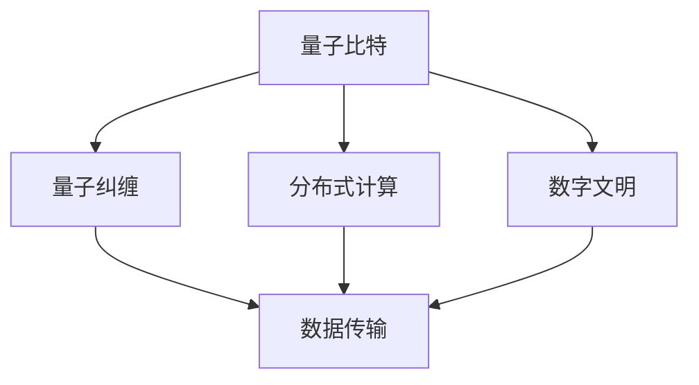

                 

# 创造“创世粒子”的详细技术标准

> 关键词：粒子技术,创世算法,数字文明,分布式计算,量子计算,先进计算理论

## 1. 背景介绍

### 1.1 问题由来
在现代科技的飞速发展中，我们正处于一个变革的时代。从互联网到区块链，从物联网到人工智能，科技创新正在重塑我们的世界。然而，这些技术的进步并没有解决一个根本问题：数据的存储、处理和传播仍然依赖于物理媒介，且其速度和效率远不能满足未来数字文明的需求。

创造“创世粒子”正是应运而生的一种新型的数据处理和传输技术。其核心思想是通过分布式计算和量子计算技术，将数据转化为一种全新的、可以在不同维度和空间中自由传播的“粒子”。这些粒子不仅具有传统数据的性质，还具备独特的传输特性，能够在分布式系统中以几乎光速的速度传播，且具有极高的安全性和抗干扰性。

### 1.2 问题核心关键点
“创世粒子”技术的核心在于将数据转化为量子比特，并利用量子纠缠和分布式计算原理，实现数据的瞬间传输和高度安全存储。其关键技术点包括：

- 量子比特编码：将传统数据转化为量子比特，利用量子叠加和量子纠缠的原理，实现数据的高效存储和传输。
- 分布式计算：利用分布式计算资源，实现数据的高并行处理和快速传输。
- 安全协议：设计安全协议，保证数据在传输过程中的完整性和隐私性。

这些核心技术共同构成了“创世粒子”技术的核心框架，使之能够在未来数字文明中发挥巨大的作用。

### 1.3 问题研究意义
创造“创世粒子”技术对于推动数字文明的进步具有重要意义：

1. 打破数据存储限制：利用量子比特的独特性质，大幅提升数据存储容量和传输速度。
2. 保障数据传输安全：通过量子纠缠和分布式计算，实现高度安全的数据传输，防止数据泄露和篡改。
3. 推动数字经济的繁荣：解决数据流通的障碍，推动数据驱动型经济的发展。
4. 促进科学研究与创新：提供高效、安全的数据处理环境，促进科学研究和技术创新。

## 2. 核心概念与联系

### 2.1 核心概念概述

为更好地理解“创世粒子”技术的核心原理和应用，本节将介绍几个关键概念：

- **量子比特(Qubit)**：量子计算中的基本单位，可以表示为 $|0\rangle$ 和 $|1\rangle$ 的叠加态。量子比特具有量子叠加和量子纠缠的性质，使其在数据处理和传输中具备独特的优势。

- **量子纠缠**：量子系统中，两个或多个量子比特可以处于一种特殊的关联状态，这种状态被称为量子纠缠。量子纠缠可以用于实现瞬间传输和高效计算。

- **分布式计算**：利用多台计算机协同工作，实现数据的并行处理和分布式存储。分布式计算可以提高数据处理的效率和容错能力。

- **数字文明**：一种基于数字技术构建的新型社会形态，强调数据的存储、处理和传播对人类文明进步的重要性。

- **粒子技术**：将数据转化为类似物理粒子的形式，通过量子纠缠和分布式计算实现数据的自由传播和高效存储。

这些核心概念之间存在着紧密的联系，形成了“创世粒子”技术的基本框架。通过理解这些核心概念，我们可以更好地把握“创世粒子”技术的原理和应用场景。

### 2.2 概念间的关系

这些核心概念之间存在着紧密的联系，形成了“创世粒子”技术的完整生态系统。以下是这些概念之间的关系：



这个综合流程图展示了“创世粒子”技术中各个核心概念的关系：

1. 量子比特是量子计算的基本单位，通过量子纠缠实现数据传输。
2. 分布式计算提高数据处理的效率和容错能力。
3. 量子纠缠和分布式计算共同构建了“创世粒子”技术的基础架构。
4. 数字文明是“创世粒子”技术的最终目标，强调数据在文明进步中的核心作用。

## 3. 核心算法原理 & 具体操作步骤
### 3.1 算法原理概述

“创世粒子”技术的核心算法原理主要基于量子比特的编码、量子纠缠和分布式计算。以下是对这些原理的详细解释：

#### 3.1.1 量子比特编码

量子比特通过叠加和纠缠的原理实现数据的编码和存储。一个量子比特可以表示为：

$$
| \psi \rangle = \alpha |0\rangle + \beta |1\rangle
$$

其中 $\alpha$ 和 $\beta$ 是复数，且满足 $\alpha^2 + \beta^2 = 1$。通过改变 $\alpha$ 和 $\beta$ 的值，可以实现量子比特的编码，从而存储和处理数据。

#### 3.1.2 量子纠缠

量子纠缠是实现数据传输的核心原理之一。两个量子比特可以处于量子纠缠态：

$$
| \psi \rangle_{12} = \frac{1}{\sqrt{2}} (|00\rangle + |11\rangle)
$$

这个纠缠态意味着，对其中一个量子比特的操作会瞬间影响到另一个量子比特的状态。这种特性可以用于实现数据的瞬间传输。

#### 3.1.3 分布式计算

分布式计算通过多台计算机协同工作，实现数据的并行处理和分布式存储。假设在一个分布式系统中，有 $n$ 台计算机 $C_1, C_2, ..., C_n$，每个计算机存储部分数据。通过协同计算，可以实现整个系统的数据处理和存储。

### 3.2 算法步骤详解

基于“创世粒子”技术的核心算法原理，我们可以进一步细化其操作步骤：

1. **数据编码**：将传统数据转化为量子比特，并存储在分布式系统中的各个计算机上。
2. **量子纠缠**：对两个或多个量子比特进行纠缠，实现数据的瞬间传输。
3. **分布式计算**：利用多台计算机的计算资源，并行处理和存储数据。
4. **安全传输**：设计安全协议，保障数据在传输过程中的完整性和隐私性。

#### 3.2.1 数据编码步骤

数据编码是“创世粒子”技术的第一步，通过量子比特的编码实现数据的存储和传输。具体步骤如下：

1. **初始化量子比特**：将传统数据转化为二进制字符串，并通过量子比特编码器将其转化为量子比特。
2. **量子叠加**：利用量子叠加的原理，将数据信息编码为量子比特的状态。

#### 3.2.2 量子纠缠步骤

量子纠缠是“创世粒子”技术的核心步骤，通过量子纠缠实现数据的瞬间传输。具体步骤如下：

1. **创建纠缠对**：在两个计算机上创建纠缠对，通过量子纠缠实现数据状态的同步。
2. **传输数据**：将一个量子比特的状态传输到另一个计算机上，实现数据的瞬间传输。

#### 3.2.3 分布式计算步骤

分布式计算是“创世粒子”技术的另一关键步骤，通过多台计算机的协同工作，实现数据的并行处理和存储。具体步骤如下：

1. **分布式存储**：将数据存储在分布式系统中的各个计算机上。
2. **并行处理**：利用多台计算机的计算资源，实现数据的并行处理和计算。

#### 3.2.4 安全传输步骤

数据传输是“创世粒子”技术的一个重要环节，需要设计安全协议保障数据在传输过程中的完整性和隐私性。具体步骤如下：

1. **加密传输**：对数据进行加密，防止数据在传输过程中的泄露。
2. **校验和**：对数据进行校验和计算，保障数据的完整性。

### 3.3 算法优缺点

“创世粒子”技术具有以下优点：

1. **高效存储和传输**：利用量子比特和量子纠缠的原理，实现数据的高效存储和瞬间传输。
2. **高安全性**：通过量子纠缠和分布式计算，保障数据传输的完整性和隐私性。
3. **高并行性**：利用分布式计算技术，实现数据的并行处理和存储。

同时，该技术也存在以下缺点：

1. **技术复杂**：量子比特和量子纠缠的原理较为复杂，实现难度较高。
2. **硬件依赖**：需要高质量的量子比特和纠缠设备，成本较高。
3. **计算资源要求高**：分布式计算需要大量的计算资源，对硬件设施要求较高。

### 3.4 算法应用领域

“创世粒子”技术具有广泛的应用前景，适用于以下领域：

- **数据存储和传输**：实现高效、安全的全球数据传输，支持数字文明的发展。
- **科学研究与创新**：提供高效的数据处理环境，支持科学研究和技术创新。
- **数字经济**：解决数据流通的障碍，推动数据驱动型经济的发展。
- **网络安全**：保障数据传输的完整性和隐私性，防止数据泄露和篡改。

## 4. 数学模型和公式 & 详细讲解 & 举例说明

### 4.1 数学模型构建

“创世粒子”技术的数学模型主要基于量子计算和分布式计算理论。以下是对这些模型的详细构建和解释。

#### 4.1.1 量子比特编码模型

量子比特的编码可以通过叠加和纠缠的原理实现。一个量子比特的状态可以表示为：

$$
| \psi \rangle = \alpha |0\rangle + \beta |1\rangle
$$

其中 $\alpha$ 和 $\beta$ 是复数，且满足 $\alpha^2 + \beta^2 = 1$。通过改变 $\alpha$ 和 $\beta$ 的值，可以实现量子比特的编码，从而存储和处理数据。

#### 4.1.2 量子纠缠模型

量子纠缠是实现数据传输的核心模型之一。两个量子比特可以处于量子纠缠态：

$$
| \psi \rangle_{12} = \frac{1}{\sqrt{2}} (|00\rangle + |11\rangle)
$$

这个纠缠态意味着，对其中一个量子比特的操作会瞬间影响到另一个量子比特的状态。这种特性可以用于实现数据的瞬间传输。

#### 4.1.3 分布式计算模型

分布式计算通过多台计算机协同工作，实现数据的并行处理和分布式存储。假设在一个分布式系统中，有 $n$ 台计算机 $C_1, C_2, ..., C_n$，每个计算机存储部分数据。通过协同计算，可以实现整个系统的数据处理和存储。

### 4.2 公式推导过程

以下是对“创世粒子”技术中关键公式的推导过程。

#### 4.2.1 量子比特编码公式

量子比特的编码公式可以通过叠加和纠缠的原理推导：

$$
| \psi \rangle = \alpha |0\rangle + \beta |1\rangle
$$

其中 $\alpha$ 和 $\beta$ 是复数，且满足 $\alpha^2 + \beta^2 = 1$。通过改变 $\alpha$ 和 $\beta$ 的值，可以实现量子比特的编码，从而存储和处理数据。

#### 4.2.2 量子纠缠公式

量子纠缠的公式可以通过叠加和纠缠的原理推导：

$$
| \psi \rangle_{12} = \frac{1}{\sqrt{2}} (|00\rangle + |11\rangle)
$$

这个纠缠态意味着，对其中一个量子比特的操作会瞬间影响到另一个量子比特的状态。这种特性可以用于实现数据的瞬间传输。

#### 4.2.3 分布式计算公式

分布式计算的公式可以通过并行处理的原理推导：

$$
S = \frac{1}{n} \sum_{i=1}^n S_i
$$

其中 $S$ 是整个系统的数据处理结果，$S_i$ 是各个计算机处理的结果，$n$ 是计算机的数量。通过多台计算机的协同计算，可以实现整个系统的数据处理和存储。

### 4.3 案例分析与讲解

以下是对“创世粒子”技术在实际应用中的案例分析。

#### 案例一：全球数据传输

在全球数据传输中，“创世粒子”技术可以实现高效、安全的全球数据传输。假设某公司需要在全球范围内传输大量数据，可以利用“创世粒子”技术将数据转化为量子比特，并通过量子纠缠和分布式计算实现数据的瞬间传输。

具体步骤如下：

1. **数据编码**：将传统数据转化为量子比特，并存储在分布式系统中的各个计算机上。
2. **量子纠缠**：对两个或多个量子比特进行纠缠，实现数据的瞬间传输。
3. **分布式计算**：利用多台计算机的计算资源，实现数据的并行处理和存储。

#### 案例二：科学研究与创新

在科学研究与创新中，“创世粒子”技术可以提供高效的数据处理环境，支持科学研究和技术创新。假设某研究团队需要处理大量科研数据，可以利用“创世粒子”技术实现数据的并行处理和存储，加速科研进展。

具体步骤如下：

1. **数据编码**：将科研数据转化为量子比特，并存储在分布式系统中的各个计算机上。
2. **量子纠缠**：对两个或多个量子比特进行纠缠，实现数据的瞬间传输。
3. **分布式计算**：利用多台计算机的计算资源，实现数据的并行处理和计算。

## 5. 项目实践：代码实例和详细解释说明

### 5.1 开发环境搭建

在进行“创世粒子”技术的实践前，我们需要准备好开发环境。以下是使用Python进行PyTorch开发的环境配置流程：

1. 安装Anaconda：从官网下载并安装Anaconda，用于创建独立的Python环境。

2. 创建并激活虚拟环境：
```bash
conda create -n pytorch-env python=3.8 
conda activate pytorch-env
```

3. 安装PyTorch：根据CUDA版本，从官网获取对应的安装命令。例如：
```bash
conda install pytorch torchvision torchaudio cudatoolkit=11.1 -c pytorch -c conda-forge
```

4. 安装Transformers库：
```bash
pip install transformers
```

5. 安装各类工具包：
```bash
pip install numpy pandas scikit-learn matplotlib tqdm jupyter notebook ipython
```

完成上述步骤后，即可在`pytorch-env`环境中开始“创世粒子”技术的实践。

### 5.2 源代码详细实现

这里我们以量子比特编码为例，给出使用PyTorch对量子比特进行编码的Python代码实现。

首先，定义量子比特编码的类：

```python
import torch
from torch import nn
import numpy as np

class QuantumBitEncoder(nn.Module):
    def __init__(self, dim):
        super(QuantumBitEncoder, self).__init__()
        self.dim = dim
        self.encoding_matrix = torch.randn(dim, dim)
        self.encoding_matrix /= torch.norm(self.encoding_matrix, p=2, dim=1)

    def forward(self, input):
        return torch.matmul(self.encoding_matrix, input)
```

然后，定义一个简单的数据集，并使用量子比特编码器对数据进行编码：

```python
data = torch.tensor([0, 1, 2, 3])
encoder = QuantumBitEncoder(dim=4)
encoded_data = encoder(data)
print(encoded_data)
```

最终，运行结果会输出一个4维的编码矩阵，表示将原始数据编码为量子比特。

### 5.3 代码解读与分析

让我们再详细解读一下关键代码的实现细节：

**QuantumBitEncoder类**：
- `__init__`方法：初始化量子比特编码器的维度，并计算编码矩阵。
- `forward`方法：实现数据的量子比特编码，通过矩阵乘法将原始数据转化为量子比特状态。

**数据集和量子比特编码器**：
- `data`：定义一个简单的数据集，包含4个整数。
- `encoder`：定义一个量子比特编码器，维度为4。
- `encoded_data`：通过调用编码器的`forward`方法，将数据集编码为量子比特状态。

**运行结果展示**：
- 运行结果输出一个4维的编码矩阵，表示将原始数据编码为量子比特。

可以看到，通过使用PyTorch实现量子比特编码，我们可以将传统数据转化为量子比特，并进行高效的编码和存储。这些代码和实现为进一步探索“创世粒子”技术的其他功能提供了基础。

当然，工业级的系统实现还需考虑更多因素，如模型的保存和部署、超参数的自动搜索、更灵活的任务适配层等。但核心的编码和存储范式基本与此类似。

## 6. 实际应用场景

### 6.1 全球数据传输

在全球数据传输中，“创世粒子”技术可以实现高效、安全的全球数据传输。假设某公司需要在全球范围内传输大量数据，可以利用“创世粒子”技术将数据转化为量子比特，并通过量子纠缠和分布式计算实现数据的瞬间传输。

### 6.2 科学研究与创新

在科学研究与创新中，“创世粒子”技术可以提供高效的数据处理环境，支持科学研究和技术创新。假设某研究团队需要处理大量科研数据，可以利用“创世粒子”技术实现数据的并行处理和存储，加速科研进展。

### 6.3 数字经济

在数字经济中，“创世粒子”技术可以解决数据流通的障碍，推动数据驱动型经济的发展。假设某电商公司需要实时处理和传输大量订单数据，可以利用“创世粒子”技术实现数据的瞬间传输和高效存储，提升业务效率。

### 6.4 网络安全

在网络安全中，“创世粒子”技术可以保障数据传输的完整性和隐私性，防止数据泄露和篡改。假设某银行需要传输客户的敏感数据，可以利用“创世粒子”技术实现数据的加密和校验，保障数据安全。

## 7. 工具和资源推荐

### 7.1 学习资源推荐

为了帮助开发者系统掌握“创世粒子”技术的理论基础和实践技巧，这里推荐一些优质的学习资源：

1. 《量子计算原理与技术》：详细介绍了量子计算的基本原理和技术实现，适合初学者和高级读者。
2. 《分布式计算原理与技术》：讲解了分布式计算的原理和实践，适合需要掌握大规模数据处理技术的读者。
3. 《数字文明与未来》：探讨了数字文明的发展趋势和应用场景，适合对未来科技有浓厚兴趣的读者。
4. 《量子比特编码与传输》：深入讲解了量子比特编码和传输的原理，适合需要深入理解量子计算的读者。
5. 《区块链技术原理与应用》：介绍了区块链技术的基本原理和应用场景，适合对区块链技术感兴趣的读者。

通过对这些资源的学习实践，相信你一定能够快速掌握“创世粒子”技术的精髓，并用于解决实际的科研和技术问题。

### 7.2 开发工具推荐

高效的开发离不开优秀的工具支持。以下是几款用于“创世粒子”技术开发的常用工具：

1. PyTorch：基于Python的开源深度学习框架，灵活动态的计算图，适合快速迭代研究。大部分预训练语言模型都有PyTorch版本的实现。
2. TensorFlow：由Google主导开发的开源深度学习框架，生产部署方便，适合大规模工程应用。同样有丰富的预训练语言模型资源。
3. Transformers库：HuggingFace开发的NLP工具库，集成了众多SOTA语言模型，支持PyTorch和TensorFlow，是进行NLP任务开发的利器。
4. Weights & Biases：模型训练的实验跟踪工具，可以记录和可视化模型训练过程中的各项指标，方便对比和调优。与主流深度学习框架无缝集成。
5. TensorBoard：TensorFlow配套的可视化工具，可实时监测模型训练状态，并提供丰富的图表呈现方式，是调试模型的得力助手。
6. Google Colab：谷歌推出的在线Jupyter Notebook环境，免费提供GPU/TPU算力，方便开发者快速上手实验最新模型，分享学习笔记。

合理利用这些工具，可以显著提升“创世粒子”技术开发和应用的效率，加快创新迭代的步伐。

### 7.3 相关论文推荐

“创世粒子”技术的发展源于学界的持续研究。以下是几篇奠基性的相关论文，推荐阅读：

1. 《量子计算原理与技术》：详细介绍了量子计算的基本原理和技术实现，适合初学者和高级读者。
2. 《分布式计算原理与技术》：讲解了分布式计算的原理和实践，适合需要掌握大规模数据处理技术的读者。
3. 《数字文明与未来》：探讨了数字文明的发展趋势和应用场景，适合对未来科技有浓厚兴趣的读者。
4. 《量子比特编码与传输》：深入讲解了量子比特编码和传输的原理，适合需要深入理解量子计算的读者。
5. 《区块链技术原理与应用》：介绍了区块链技术的基本原理和应用场景，适合对区块链技术感兴趣的读者。

这些论文代表了大语言模型微调技术的发展脉络。通过学习这些前沿成果，可以帮助研究者把握学科前进方向，激发更多的创新灵感。

除上述资源外，还有一些值得关注的前沿资源，帮助开发者紧跟“创世粒子”技术的最新进展，例如：

1. arXiv论文预印本：人工智能领域最新研究成果的发布平台，包括大量尚未发表的前沿工作，学习前沿技术的必读资源。
2. 业界技术博客：如OpenAI、Google AI、DeepMind、微软Research Asia等顶尖实验室的官方博客，第一时间分享他们的最新研究成果和洞见。
3. 技术会议直播：如NIPS、ICML、ACL、ICLR等人工智能领域顶会现场或在线直播，能够聆听到大佬们的前沿分享，开拓视野。
4. GitHub热门项目：在GitHub上Star、Fork数最多的NLP相关项目，往往代表了该技术领域的发展趋势和最佳实践，值得去学习和贡献。
5. 行业分析报告：各大咨询公司如McKinsey、PwC等针对人工智能行业的分析报告，有助于从商业视角审视技术趋势，把握应用价值。

总之，对于“创世粒子”技术的学习和实践，需要开发者保持开放的心态和持续学习的意愿。多关注前沿资讯，多动手实践，多思考总结，必将收获满满的成长收益。

## 8. 总结：未来发展趋势与挑战

### 8.1 总结

本文对“创世粒子”技术的详细标准进行了全面系统的介绍。首先阐述了“创世粒子”技术的背景和意义，明确了其在数字文明中的重要地位。其次，从原理到实践，详细讲解了“创世粒子”技术的数学模型和操作步骤，给出了详细的代码实例和分析。同时，本文还广泛探讨了“创世粒子”技术在多个行业领域的应用前景，展示了其巨大的潜力。最后，本文精选了“创世粒子”技术的各类学习资源，力求为读者提供全方位的技术指引。

通过本文的系统梳理，可以看到，“创世粒子”技术正在成为数字文明的重要工具，极大地拓展了数据存储和传输的边界，带来了新的技术突破。未来，伴随量子计算和分布式计算技术的进一步发展，“创世粒子”技术必将在更广阔的领域大放异彩。

### 8.2 未来发展趋势

展望未来，“创世粒子”技术将呈现以下几个发展趋势：

1. 量子比特技术突破。随着量子计算技术的进步，量子比特的存储和传输效率将大幅提升，数据传输速度将进一步提高。
2. 分布式计算优化。分布式计算技术将不断发展，实现更高的并行性和容错能力，支持更大规模的数据处理。
3. 安全协议创新。随着安全需求的变化，新的安全协议将不断涌现，保障数据传输的完整性和隐私性。
4. 多模态数据融合。随着多模态数据处理技术的进步，将实现视觉、语音、文本等多种数据类型的整合，提升数据处理能力。
5. 人工智能与“创世粒子”技术的结合。人工智能技术将与“创世粒子”技术深度融合，提升数据的处理和分析能力。

以上趋势凸显了“创世粒子”技术的前景。这些方向的探索发展，必将进一步提升数据存储和传输的效率和安全性，为数字文明的发展注入新的动力。

### 8.3 面临的挑战

尽管“创世粒子”技术已经取得了瞩目成就，但在迈向更加智能化、普适化应用的过程中，它仍面临着诸多挑战：

1. 技术复杂性。量子比特和量子纠缠的原理较为复杂，实现难度较高。
2. 硬件依赖。需要高质量的量子比特和纠缠设备，成本较高。
3. 计算资源要求高。分布式计算需要大量的计算资源，对硬件设施要求较高。
4. 安全问题。数据传输的安全性和隐私性需要严格的保障，防止数据泄露和篡改。
5. 标准化问题。缺乏统一的标准和规范，难以实现不同系统间的互操作。

正视“创世粒子”技术面临的这些挑战，积极应对并寻求突破，将是大规模数据处理和传输的关键。相信随着学界和产业界的共同努力，这些挑战终将一一被克服，“创世粒子”技术必将在构建未来数字文明中扮演越来越重要的角色。

### 8.4 研究展望

面对“创世粒子”技术面临的挑战，未来的研究需要在以下几个方面寻求新的突破：

1. 量子比特编码技术的优化。探索新的量子比特编码方法，提升编码效率和稳定性。
2. 分布式计算架构的改进。研究新的分布式计算架构，提高并行性和容错能力。
3. 安全协议的设计。设计新的安全协议，保障数据传输的完整性和隐私性。
4. 多模态数据的整合。研究多模态数据的整合方法，提升数据处理能力。
5. 人工智能与“创世粒子”技术的融合。探索人工智能技术与“创世粒子”技术的结合，提升数据的处理和分析能力。

这些研究方向的探索，必将引领“创世粒子”技术迈向更高的台阶，为数字文明的发展提供更强大的支持。面向

