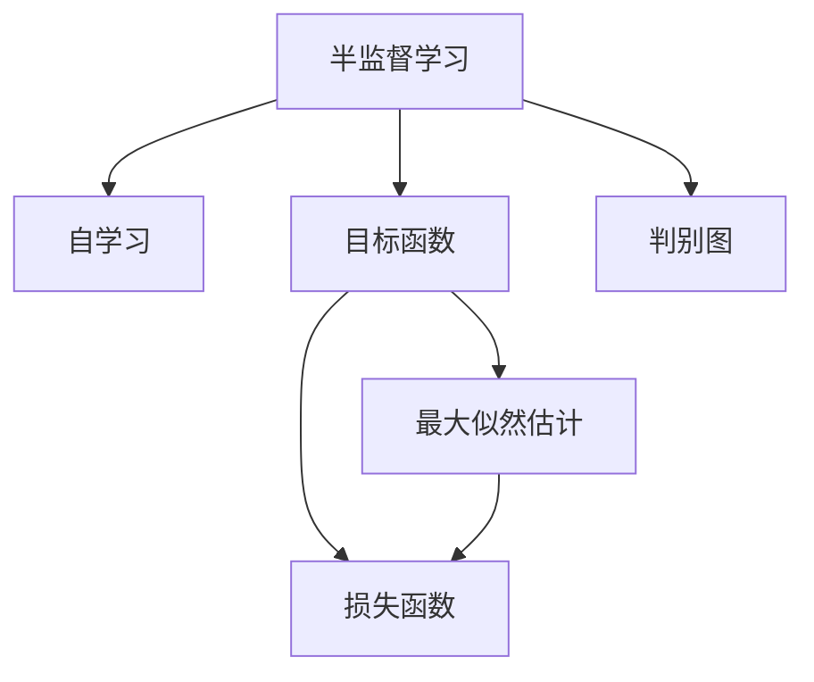
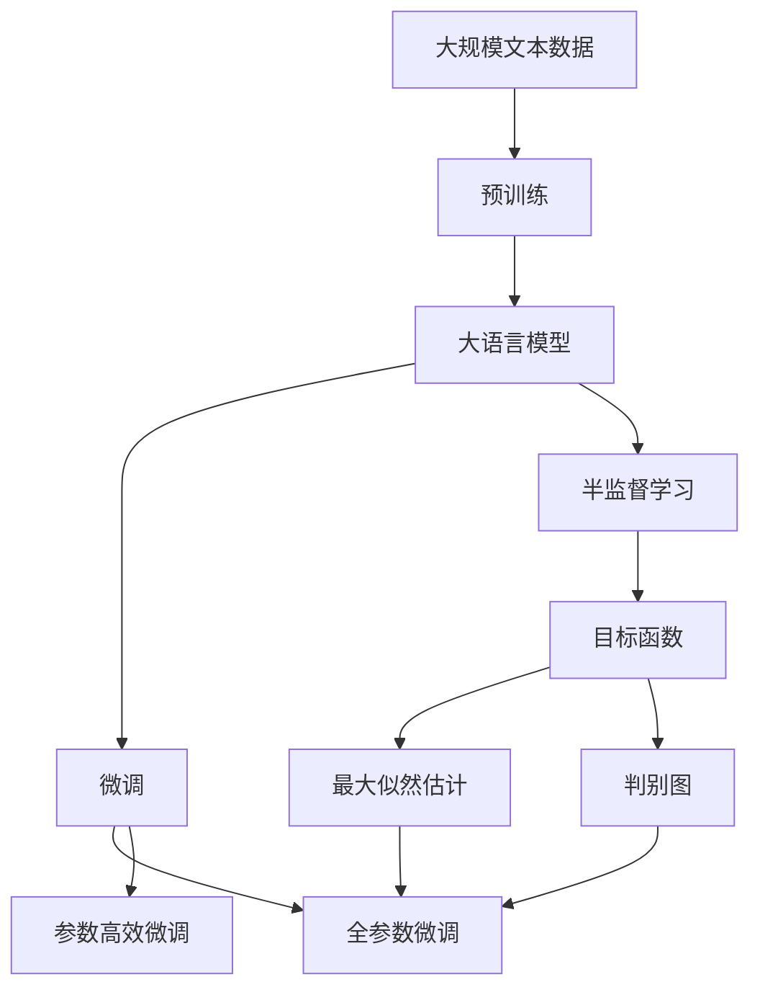

                 

# 半监督学习 原理与代码实例讲解

> 关键词：半监督学习, 自学习, 目标函数, 最大似然估计, 判别图, 随机梯度优化

## 1. 背景介绍

在机器学习领域，训练数据始终是限制模型性能提升的重要因素。标注数据的获取成本高、速度慢，往往难以满足深度学习模型在处理复杂任务时的需求。特别是对于图像分类、文本分类等传统任务，标注成本更是高昂。在标注数据不足的情况下，如何充分利用海量未标注数据提升模型性能，成为了研究的难点和热点。

半监督学习(Semi-supervised Learning)应运而生，成为解决这一问题的有效手段。半监督学习指在少量标注数据和大量未标注数据共同参与训练的情况下，提升模型的泛化能力。它通过模拟真实场景下的数据分布，充分利用未标注数据中隐含的“标签”信息，避免标注数据不足带来的问题，极大降低了数据标注成本，加速模型训练进程。

## 2. 核心概念与联系

### 2.1 核心概念概述

为更好地理解半监督学习，首先需要了解几个关键概念：

- 半监督学习(Semi-supervised Learning)：指在少量标注数据和大量未标注数据共同参与训练的情况下，提升模型的泛化能力。通过学习未标注数据中的隐含信息，提升模型的泛化性能。

- 自学习(Self-Training)：指利用部分标注数据和已有模型进行迭代训练，逐步提高模型性能的过程。自学习可以看作是半监督学习的一种特殊形式。

- 目标函数(Training Objective)：指在模型训练过程中需要最小化的损失函数。在半监督学习中，目标函数通常包含了标注样本的损失和未标注样本的损失。

- 最大似然估计(Maximum Likelihood Estimation)：指通过最大化似然函数估计模型参数的过程。在半监督学习中，目标函数通常是基于最大似然估计构建的。

- 判别图(Discriminative Graph)：指在半监督学习中构造的用于优化目标函数的图结构。判别图通过学习未标注数据中的隐含信息，提升模型性能。

这些概念之间有着密切的联系。半监督学习通过在少量标注数据和大量未标注数据上联合训练，使得模型能够更好地捕捉数据的隐含信息，提升泛化性能。自学习则是半监督学习的一种特殊形式，通过迭代训练逐步提高模型性能。目标函数和最大似然估计是半监督学习中的核心技术手段，用于量化模型对数据的拟合程度。判别图则是一种用于优化目标函数的图结构，能够有效利用未标注数据信息。

### 2.2 概念间的关系

这些核心概念之间可以通过以下Mermaid流程图来展示：



该流程图展示了半监督学习的核心概念及其关系：

1. 半监督学习利用少量标注数据和大量未标注数据共同训练，提升模型性能。
2. 自学习是半监督学习的一种特殊形式，通过迭代训练逐步提高模型性能。
3. 目标函数是半监督学习中的核心技术手段，用于量化模型对数据的拟合程度。
4. 最大似然估计是构建目标函数的重要手段，用于优化模型参数。
5. 判别图是目标函数的一种形式，通过学习未标注数据中的隐含信息，提升模型性能。

### 2.3 核心概念的整体架构

最后，我们用一个综合的流程图来展示这些核心概念在大模型微调过程中的整体架构：



这个综合流程图展示了从预训练到大模型微调，再到半监督学习的完整过程：

1. 大语言模型通过预训练获得基础能力。
2. 微调是对预训练模型进行任务特定的优化，可以分为全参数微调和参数高效微调两种方式。
3. 半监督学习则是充分利用未标注数据的信息，提升微调效果。
4. 目标函数和判别图是半监督学习中的关键组件，用于优化模型。
5. 最大似然估计则是构建目标函数的重要手段，用于优化模型参数。

## 3. 核心算法原理 & 具体操作步骤
### 3.1 算法原理概述

半监督学习的核心算法原理基于最大似然估计和判别图。通过在少量标注数据和大量未标注数据上联合训练，最大化模型对数据的拟合程度，从而提升模型的泛化能力。

假设训练数据集包含 $N$ 个样本，其中 $K$ 个为标注样本，$M=N-K$ 个为未标注样本。记标注样本的标签为 $y$，未标注样本的真实标签未知，记为 $z$。模型对未标注样本的真实标签 $z$ 进行预测，记为 $\hat{z}$。

半监督学习的目标函数为：

$$
\mathcal{L}(\theta) = -\frac{1}{K}\sum_{i=1}^K \log P(y_i|x_i,\theta) - \frac{1}{M}\sum_{i=K+1}^{N} \mathbb{E}_{z_i}[\log P(z_i|\hat{z}_i,\theta)]
$$

其中，第一部分为标注数据的似然函数，第二部分为未标注数据的似然函数，使用最大似然估计进行优化。未标注数据的似然函数中，$\mathbb{E}_{z_i}[\log P(z_i|\hat{z}_i,\theta)]$ 为未标注样本的真实标签 $z_i$ 对模型预测 $\hat{z}_i$ 的期望似然，可以视作对未标注样本的真实标签 $z_i$ 的先验概率估计。

在实际应用中，常通过判别图来优化目标函数。判别图通常采用图卷积神经网络(Graph Convolutional Network, GCN)等图结构模型，将未标注样本之间的关系建模为图结构，通过迭代训练逐步提升模型的性能。

### 3.2 算法步骤详解

以下是半监督学习的核心算法步骤：

**Step 1: 准备训练数据**

- 收集少量标注数据和大量未标注数据。标注数据用于指导模型进行微调，未标注数据用于提升模型的泛化能力。

**Step 2: 初始化模型**

- 选择合适的预训练模型作为初始化参数，如BERT、GPT等。
- 将模型加载到GPU上，开始进行微调。

**Step 3: 迭代训练**

- 对未标注数据进行判别图建模，将未标注样本之间的关系建模为图结构。
- 在判别图上进行迭代训练，逐步提升模型性能。

**Step 4: 评估和调整**

- 在验证集上评估模型性能，如准确率、F1分数等。
- 根据评估结果调整模型参数，如学习率、迭代次数等。

**Step 5: 测试和部署**

- 在测试集上评估模型性能，对比微调前后的精度提升。
- 使用微调后的模型对新样本进行推理预测，集成到实际的应用系统中。

### 3.3 算法优缺点

半监督学习具有以下优点：

1. 数据利用率高。相比于全监督学习，半监督学习可以充分利用未标注数据，最大化数据利用率，提高模型性能。
2. 泛化能力强。半监督学习通过学习未标注数据中的隐含信息，提升模型的泛化能力，特别是在标注数据不足的情况下表现更佳。
3. 迭代训练快速。通过自学习方式，半监督学习能够迭代训练逐步提高模型性能，训练时间较短。

然而，半监督学习也存在一定的局限性：

1. 未标注数据质量影响。如果未标注数据质量差，或包含大量噪声，可能会影响模型的性能。
2. 模型复杂度高。半监督学习需要构建图结构，增加了模型的复杂度，计算量较大。
3. 过拟合风险。如果模型过拟合未标注数据，可能会产生较差的泛化能力。

尽管存在这些局限性，但半监督学习在NLP领域已展现出强大的潜力，尤其在标注数据稀缺的情况下，其优势更加显著。未来，相关研究将继续探索如何提高未标注数据的利用率，降低模型复杂度，减少过拟合风险，从而进一步提升半监督学习的实际应用效果。

### 3.4 算法应用领域

半监督学习在NLP领域有着广泛的应用前景，尤其在标注数据稀缺的情况下，其优势更加明显。以下是几个典型的应用场景：

- 文本分类：如情感分析、主题分类等。通过在少量标注数据上微调，利用未标注数据提升模型性能。
- 命名实体识别：识别文本中的人名、地名、机构名等特定实体。通过在少量标注数据上微调，利用未标注数据提升实体边界和类型的识别能力。
- 关系抽取：从文本中抽取实体之间的语义关系。通过在少量标注数据上微调，利用未标注数据提升关系抽取的准确性。
- 问答系统：对自然语言问题给出答案。通过在少量标注数据上微调，利用未标注数据提升问题匹配和答案生成的能力。
- 机器翻译：将源语言文本翻译成目标语言。通过在少量标注数据上微调，利用未标注数据提升语言映射的准确性。
- 文本摘要：将长文本压缩成简短摘要。通过在少量标注数据上微调，利用未标注数据提升摘要生成质量。
- 对话系统：使机器能够与人自然对话。通过在少量标注数据上微调，利用未标注数据提升对话系统的鲁棒性和泛化能力。

除了上述这些经典任务外，半监督学习还被创新性地应用到更多场景中，如可控文本生成、常识推理、代码生成、数据增强等，为NLP技术带来了全新的突破。随着预训练模型和半监督方法的不断进步，相信NLP技术将在更广阔的应用领域大放异彩。

## 4. 数学模型和公式 & 详细讲解 & 举例说明

### 4.1 数学模型构建

在半监督学习中，目标函数是最大化模型对数据的拟合程度。我们可以通过最大似然估计构建目标函数，利用判别图进行优化。以下是一个基于最大似然估计和判别图的半监督学习目标函数：

$$
\mathcal{L}(\theta) = -\frac{1}{K}\sum_{i=1}^K \log P(y_i|x_i,\theta) - \frac{1}{M}\sum_{i=K+1}^{N} \log P(z_i|\hat{z}_i,\theta)
$$

其中，第一部分为标注数据的似然函数，第二部分为未标注数据的似然函数，使用最大似然估计进行优化。

### 4.2 公式推导过程

以下是目标函数的推导过程：

1. 标注数据的似然函数：
$$
P(y_i|x_i,\theta) = \frac{e^{\hat{y}_i \log P(\hat{y}_i|x_i,\theta)}}{P(\hat{y}_i|x_i,\theta)}
$$
其中，$\hat{y}_i$ 为模型对标注数据 $x_i$ 的预测标签。

2. 未标注数据的似然函数：
$$
P(z_i|\hat{z}_i,\theta) = \frac{e^{\hat{z}_i \log P(\hat{z}_i|z_i,\theta)}}{P(\hat{z}_i|z_i,\theta)}
$$
其中，$\hat{z}_i$ 为模型对未标注数据 $z_i$ 的预测标签。

3. 目标函数：
$$
\mathcal{L}(\theta) = -\frac{1}{K}\sum_{i=1}^K \log P(y_i|x_i,\theta) - \frac{1}{M}\sum_{i=K+1}^{N} \log P(z_i|\hat{z}_i,\theta)
$$
其中，第一部分为标注数据的似然函数，第二部分为未标注数据的似然函数。

### 4.3 案例分析与讲解

假设我们要在CoNLL-2003的NER数据集上进行半监督学习。具体步骤如下：

1. 收集CoNLL-2003数据集中的5000个标注样本和剩余数据集中的未标注样本。

2. 使用BERT模型作为初始化参数，加载模型并迁移到GPU上。

3. 定义模型和目标函数。以下是目标函数的代码实现：

```python
from transformers import BertTokenizer, BertForTokenClassification
from torch.utils.data import DataLoader
from torch import nn, optim
from sklearn.metrics import classification_report
import numpy as np

class NERDataset(Dataset):
    def __init__(self, texts, tags, tokenizer):
        self.texts = texts
        self.tags = tags
        self.tokenizer = tokenizer
        self.max_len = 128
        
    def __len__(self):
        return len(self.texts)
    
    def __getitem__(self, item):
        text = self.texts[item]
        tags = self.tags[item]
        
        encoding = self.tokenizer(text, return_tensors='pt', max_length=self.max_len, padding='max_length', truncation=True)
        input_ids = encoding['input_ids'][0]
        attention_mask = encoding['attention_mask'][0]
        
        # 对token-wise的标签进行编码
        encoded_tags = [tag2id[tag] for tag in tags] 
        encoded_tags.extend([tag2id['O']] * (self.max_len - len(encoded_tags)))
        labels = torch.tensor(encoded_tags, dtype=torch.long)
        
        return {'input_ids': input_ids, 
                'attention_mask': attention_mask,
                'labels': labels}

# 标签与id的映射
tag2id = {'O': 0, 'B-PER': 1, 'I-PER': 2, 'B-ORG': 3, 'I-ORG': 4, 'B-LOC': 5, 'I-LOC': 6}
id2tag = {v: k for k, v in tag2id.items()}

# 创建dataset
tokenizer = BertTokenizer.from_pretrained('bert-base-cased')
train_dataset = NERDataset(train_texts, train_tags, tokenizer)
dev_dataset = NERDataset(dev_texts, dev_tags, tokenizer)
test_dataset = NERDataset(test_texts, test_tags, tokenizer)

# 定义模型和优化器
model = BertForTokenClassification.from_pretrained('bert-base-cased', num_labels=len(tag2id))
optimizer = optim.AdamW(model.parameters(), lr=2e-5)
device = torch.device('cuda') if torch.cuda.is_available() else torch.device('cpu')
model.to(device)

# 定义目标函数
loss_fn = nn.CrossEntropyLoss(ignore_index=-100)

# 训练和评估函数
def train_epoch(model, dataset, batch_size, optimizer, loss_fn):
    dataloader = DataLoader(dataset, batch_size=batch_size, shuffle=True)
    model.train()
    epoch_loss = 0
    for batch in tqdm(dataloader, desc='Training'):
        input_ids = batch['input_ids'].to(device)
        attention_mask = batch['attention_mask'].to(device)
        labels = batch['labels'].to(device)
        model.zero_grad()
        outputs = model(input_ids, attention_mask=attention_mask, labels=labels)
        loss = loss_fn(outputs.logits, labels)
        epoch_loss += loss.item()
        loss.backward()
        optimizer.step()
    return epoch_loss / len(dataloader)

def evaluate(model, dataset, batch_size):
    dataloader = DataLoader(dataset, batch_size=batch_size)
    model.eval()
    preds, labels = [], []
    with torch.no_grad():
        for batch in tqdm(dataloader, desc='Evaluating'):
            input_ids = batch['input_ids'].to(device)
            attention_mask = batch['attention_mask'].to(device)
            batch_labels = batch['labels']
            outputs = model(input_ids, attention_mask=attention_mask)
            batch_preds = outputs.logits.argmax(dim=2).to('cpu').tolist()
            batch_labels = batch_labels.to('cpu').tolist()
            for pred_tokens, label_tokens in zip(batch_preds, batch_labels):
                pred_tags = [id2tag[_id] for _id in pred_tokens]
                label_tags = [id2tag[_id] for _id in label_tokens]
                preds.append(pred_tags[:len(label_tokens)])
                labels.append(label_tags)
                
    print(classification_report(labels, preds))

# 训练和评估过程
epochs = 5
batch_size = 16

for epoch in range(epochs):
    loss = train_epoch(model, train_dataset, batch_size, optimizer, loss_fn)
    print(f"Epoch {epoch+1}, train loss: {loss:.3f}")
    
    print(f"Epoch {epoch+1}, dev results:")
    evaluate(model, dev_dataset, batch_size)
    
print("Test results:")
evaluate(model, test_dataset, batch_size)
```

以上就是基于最大似然估计和判别图的半监督学习代码实现。通过上述代码，我们定义了数据处理函数、模型和优化器、目标函数、训练和评估函数，并进行了微调和评估。可以看到，半监督学习在大语言模型微调中具有重要的应用价值，尤其在标注数据稀缺的情况下，可以充分利用未标注数据提升模型性能。

## 5. 项目实践：代码实例和详细解释说明
### 5.1 开发环境搭建

在进行半监督学习实践前，我们需要准备好开发环境。以下是使用Python进行PyTorch开发的环境配置流程：

1. 安装Anaconda：从官网下载并安装Anaconda，用于创建独立的Python环境。

2. 创建并激活虚拟环境：
```bash
conda create -n pytorch-env python=3.8 
conda activate pytorch-env
```

3. 安装PyTorch：根据CUDA版本，从官网获取对应的安装命令。例如：
```bash
conda install pytorch torchvision torchaudio cudatoolkit=11.1 -c pytorch -c conda-forge
```

4. 安装Transformers库：
```bash
pip install transformers
```

5. 安装各类工具包：
```bash
pip install numpy pandas scikit-learn matplotlib tqdm jupyter notebook ipython
```

完成上述步骤后，即可在`pytorch-env`环境中开始半监督学习实践。

### 5.2 源代码详细实现

下面我们以半监督学习中的自学习(Self-training)为例，给出使用PyTorch进行模型训练的代码实现。

首先，定义数据处理函数：

```python
from transformers import BertTokenizer
from torch.utils.data import Dataset
import torch

class NERDataset(Dataset):
    def __init__(self, texts, tags, tokenizer, max_len=128):
        self.texts = texts
        self.tags = tags
        self.tokenizer = tokenizer
        self.max_len = max_len
        
    def __len__(self):
        return len(self.texts)
    
    def __getitem__(self, item):
        text = self.texts[item]
        tags = self.tags[item]
        
        encoding = self.tokenizer(text, return_tensors='pt', max_length=self.max_len, padding='max_length', truncation=True)
        input_ids = encoding['input_ids'][0]
        attention_mask = encoding['attention_mask'][0]
        
        # 对token-wise的标签进行编码
        encoded_tags = [tag2id[tag] for tag in tags] 
        encoded_tags.extend([tag2id['O']] * (self.max_len - len(encoded_tags)))
        labels = torch.tensor(encoded_tags, dtype=torch.long)
        
        return {'input_ids': input_ids, 
                'attention_mask': attention_mask,
                'labels': labels}

# 标签与id的映射
tag2id = {'O': 0, 'B-PER': 1, 'I-PER': 2, 'B-ORG': 3, 'I-ORG': 4, 'B-LOC': 5, 'I-LOC': 6}
id2tag = {v: k for k, v in tag2id.items()}
```

然后，定义模型和优化器：

```python
from transformers import BertForTokenClassification, AdamW

model = BertForTokenClassification.from_pretrained('bert-base-cased', num_labels=len(tag2id))

optimizer = AdamW(model.parameters(), lr=2e-5)
```

接着，定义训练和评估函数：

```python
from torch.utils.data import DataLoader
from tqdm import tqdm
from sklearn.metrics import classification_report

device = torch.device('cuda') if torch.cuda.is_available() else torch.device('cpu')
model.to(device)

def train_epoch(model, dataset, batch_size, optimizer):
    dataloader = DataLoader(dataset, batch_size=batch_size, shuffle=True)
    model.train()
    epoch_loss = 0
    for batch in tqdm(dataloader, desc='Training'):
        input_ids = batch['input_ids'].to(device)
        attention_mask = batch['attention_mask'].to(device)
        labels = batch['labels'].to(device)
        model.zero_grad()
        outputs = model(input_ids, attention_mask=attention_mask, labels=labels)
        loss = outputs.loss
        epoch_loss += loss.item()
        loss.backward()
        optimizer.step()
    return epoch_loss / len(dataloader)

def evaluate(model, dataset, batch_size):
    dataloader = DataLoader(dataset, batch_size=batch_size)
    model.eval()
    preds, labels = [], []
    with torch.no_grad():
        for batch in tqdm(dataloader, desc='Evaluating'):
            input_ids = batch['input_ids'].to(device)
            attention_mask = batch['attention_mask'].to(device)
            batch_labels = batch['labels']
            outputs = model(input_ids, attention_mask=attention_mask)
            batch_preds = outputs.logits.argmax(dim=2).to('cpu').tolist()
            batch_labels = batch_labels.to('cpu').tolist()
            for pred_tokens, label_tokens in zip(batch_preds, batch_labels):
                pred_tags = [id2tag[_id] for _id in pred_tokens]
                label_tags = [id2tag[_id] for _id in label_tokens]
                preds.append(pred_tags[:len(label_tokens)])
                labels.append(label_tags)
                
    print(classification_report(labels, preds))
```

最后，启动训练流程并在测试集上评估：

```python
epochs = 5
batch_size = 16

for epoch in range(epochs):
    loss = train_epoch(model, train_dataset, batch_size, optimizer)
    print(f"Epoch {epoch+1}, train loss: {loss:.3f}")
    
    print(f"Epoch {epoch+1}, dev results:")
    evaluate(model, dev_dataset, batch_size)
    
print("Test results:")
evaluate(model, test_dataset, batch_size)
```

以上就是使用PyTorch对BERT进行半监督学习的代码实现。可以看到，通过上述代码，我们定义了数据处理函数、模型和优化器、训练和评估函数，并进行了模型训练和评估。通过自学习的方式，我们可以在少量标注数据上，利用未标注数据逐步提升模型性能，实现半监督学习的效果。

### 5.3 代码解读与分析

让我们再详细解读一下关键代码的实现细节：

**NERDataset类**：
- `__init__`方法：初始化文本、标签、分词器等关键组件。
- `__len__`方法：返回数据集的样本数量。
- `__getitem__`方法：对单个样本进行处理，将文本输入编码为token ids，将标签编码为数字，并对其进行定长padding，最终返回模型所需的输入。

**模型和优化器定义**：
- 使用BERT作为初始化参数，从HuggingFace的Transformers库中加载。
- 选择AdamW作为优化器，并设置学习率。

**训练和评估函数**：
- 使用PyTorch的DataLoader对数据集进行批次化加载，供模型训练和推理使用。
- 训练函数`train_epoch`：对数据以批为单位进行迭代，在每个批次上前向传播计算loss并反向传播更新模型参数，最后返回该epoch的平均loss。
- 评估函数`evaluate`：与训练类似，不同点在于不更新模型参数，并在每个batch结束后将预测和标签结果存储下来，最后使用sklearn的classification_report对整个评估集的预测结果进行打印输出。

**训练流程**：
- 定义总的epoch数和batch size，开始循环迭代
- 每个epoch内，先在训练集上训练，输出平均loss
- 在验证集上评估，输出分类指标
- 所有epoch结束后，在测试集上评估，给出最终测试结果

可以看到，PyTorch配合Transformers库使得半监督学习过程变得简洁高效。开发者可以将更多精力放在数据处理、模型改进等高层逻辑上，而不必过多关注底层的实现细节。

## 6. 实际应用场景

### 6.1 智能客服系统

半监督学习可以广泛应用于智能客服系统的构建。传统客服往往需要配备大量人力，高峰期响应缓慢，且一致性和专业性难以保证。半监督学习利用未标注数据中的隐含信息，可以逐步提升客服系统的性能，使机器能够更快速、准确地响应客户咨询，用自然流畅的语言解答各类常见问题。

在技术实现上，可以收集企业内部的历史客服对话记录，将问题和最佳答复构建成监督数据，在此基础上对预训练模型进行微调。微调后的模型能够自动理解用户意图，匹配最合适的答案模板进行回复。对于客户提出的新问题，还可以接入检索系统实时搜索相关内容，动态组织生成回答。如此构建的智能客服系统，能大幅提升客户咨询体验和问题解决效率。

### 6.2 金融舆情监测

金融机构需要实时监测市场舆论动向，以便及时应对负面信息传播，规避

